# 🎭 Instance Segmentation

> Detecting and segmenting individual object instances

<p align="center">
  
</p>

---

## 📑 Table of Contents

1. [What is Instance Segmentation?](#what-is-instance-segmentation)
2. [Mask R-CNN](#mask-r-cnn)
3. [YOLACT](#yolact)
4. [SOLO/SOLOv2](#solo)
5. [Panoptic Segmentation](#panoptic-segmentation)
6. [Implementation Guide](#implementation-guide)

---

## What is Instance Segmentation?

Instance segmentation combines object detection with semantic segmentation - each object instance gets a unique mask.

```mermaid
flowchart LR
    subgraph Detection["🎯 Object Detection"]
        D1[Find Objects]
        D2[Bounding Boxes]
    end

    subgraph Semantic["🎨 Semantic Segmentation"]
        S1[Pixel Classification]
        S2[Class Map]
    end

    subgraph Instance["🎭 Instance Segmentation"]
        I1[Detection + Masks]
        I2[Unique per Object]
    end

    Detection --> Instance
    Semantic --> Instance

    style Instance fill:#c8e6c9

```

```mermaid
graph TB
    subgraph Comparison["Task Comparison"]
        subgraph Det["Object Detection"]
            D["📦 Boxes + Labels"]
        end
        subgraph Sem["Semantic Seg"]
            S["🎨 Pixel Labels<br/>(class-level)"]
        end
        subgraph Inst["Instance Seg"]
            I["🎭 Pixel Labels<br/>(instance-level)"]
        end
    end

    Det -->|"+ masks"| Inst
    Sem -->|"+ instances"| Inst

    style D fill:#e3f2fd
    style S fill:#fff3e0
    style I fill:#c8e6c9

```





| Task | Output | Example |
|------|--------|---------|
| 🎯 **Detection** | Boxes + classes | "2 cars, 1 dog" |
| 🎨 **Semantic** | Pixel classes | All car pixels = blue |
| 🎭 **Instance** | Pixel instances | Car1 = blue, Car2 = green |
| 🌐 **Panoptic** | Thing + Stuff | Instances + background |

---

## Mask R-CNN

### Architecture Overview

Extends Faster R-CNN by adding a mask prediction branch.


### Mask R-CNN Loss


### Mask R-CNN Implementation

```python
import torch
import torchvision
from torchvision.models.detection import maskrcnn_resnet50_fpn
from torchvision.models.detection.faster_rcnn import FastRCNNPredictor
from torchvision.models.detection.mask_rcnn import MaskRCNNPredictor

class MaskRCNNDetector:
    """Mask R-CNN instance segmentation wrapper."""

    def __init__(self, num_classes, pretrained=True, device='cuda'):
        self.device = device
        self.num_classes = num_classes
        self.model = self._build_model(num_classes, pretrained)
        self.model.to(device)

    def _build_model(self, num_classes, pretrained):
        """Build Mask R-CNN with custom number of classes."""
        model = maskrcnn_resnet50_fpn(pretrained=pretrained)

        # Replace box predictor
        in_features = model.roi_heads.box_predictor.cls_score.in_features
        model.roi_heads.box_predictor = FastRCNNPredictor(in_features, num_classes)

        # Replace mask predictor
        in_features_mask = model.roi_heads.mask_predictor.conv5_mask.in_channels
        hidden_layer = 256
        model.roi_heads.mask_predictor = MaskRCNNPredictor(
            in_features_mask, hidden_layer, num_classes
        )

        return model

    @torch.no_grad()
    def predict(self, images, score_threshold=0.5, mask_threshold=0.5):
        """
        Run inference.

        Returns:
            List of dicts with 'boxes', 'labels', 'scores', 'masks'
        """
        self.model.eval()

        if isinstance(images, list):
            images = [img.to(self.device) for img in images]
        else:
            images = [images.to(self.device)]

        outputs = self.model(images)

        results = []
        for output in outputs:
            # Filter by score
            keep = output['scores'] > score_threshold

            result = {
                'boxes': output['boxes'][keep].cpu(),
                'labels': output['labels'][keep].cpu(),
                'scores': output['scores'][keep].cpu(),
                'masks': (output['masks'][keep] > mask_threshold).cpu()
            }
            results.append(result)

        return results

    def visualize(self, image, prediction, class_names=None):
        """Visualize predictions on image."""
        import cv2
        import numpy as np

        # Convert to numpy if tensor
        if torch.is_tensor(image):
            image = image.permute(1, 2, 0).cpu().numpy()
            image = (image * 255).astype(np.uint8)

        image = image.copy()

        # Generate random colors for each instance
        num_instances = len(prediction['boxes'])
        colors = np.random.randint(0, 255, (num_instances, 3))

        for i in range(num_instances):
            box = prediction['boxes'][i].numpy().astype(int)
            mask = prediction['masks'][i, 0].numpy()
            label = prediction['labels'][i].item()
            score = prediction['scores'][i].item()
            color = colors[i].tolist()

            # Draw mask
            mask_overlay = np.zeros_like(image)
            mask_overlay[mask > 0] = color
            image = cv2.addWeighted(image, 1, mask_overlay, 0.5, 0)

            # Draw box
            cv2.rectangle(image, (box[0], box[1]), (box[2], box[3]), color, 2)

            # Draw label
            label_text = class_names[label] if class_names else str(label)
            label_text = f"{label_text}: {score:.2f}"
            cv2.putText(image, label_text, (box[0], box[1]-10),
                       cv2.FONT_HERSHEY_SIMPLEX, 0.5, color, 2)

        return image

```

---

## YOLACT

### Real-Time Instance Segmentation


---

## SOLO

### Segment Objects by Location


---

## Panoptic Segmentation

### Unified Segmentation


---

## Implementation Guide

### Training Pipeline

```python
import torch
import torch.nn as nn
from torch.utils.data import DataLoader
import torchvision.transforms as T

class InstanceSegmentationTrainer:
    """Training pipeline for instance segmentation."""

    def __init__(self, model, device='cuda'):
        self.model = model.to(device)
        self.device = device

    def get_transform(self, train=True):
        """Get data transforms."""
        transforms = [T.ToTensor()]
        if train:
            transforms.append(T.RandomHorizontalFlip(0.5))
        return T.Compose(transforms)

    def train_one_epoch(self, dataloader, optimizer):
        """Train for one epoch."""
        self.model.train()
        total_loss = 0

        for images, targets in dataloader:
            images = [img.to(self.device) for img in images]
            targets = [{k: v.to(self.device) for k, v in t.items()} for t in targets]

            loss_dict = self.model(images, targets)
            losses = sum(loss for loss in loss_dict.values())

            optimizer.zero_grad()
            losses.backward()
            optimizer.step()

            total_loss += losses.item()

        return total_loss / len(dataloader)

    @torch.no_grad()
    def evaluate(self, dataloader):
        """Evaluate using COCO metrics."""
        from pycocotools.coco import COCO
        from pycocotools.cocoeval import COCOeval

        self.model.eval()
        results = []

        for images, targets in dataloader:
            images = [img.to(self.device) for img in images]
            outputs = self.model(images)

            # Convert to COCO format
            for target, output in zip(targets, outputs):
                image_id = target['image_id'].item()

                for i in range(len(output['boxes'])):
                    result = {
                        'image_id': image_id,
                        'category_id': output['labels'][i].item(),
                        'bbox': output['boxes'][i].cpu().tolist(),
                        'score': output['scores'][i].item(),
                        'segmentation': self._mask_to_rle(output['masks'][i])
                    }
                    results.append(result)

        return results

    def _mask_to_rle(self, mask):
        """Convert binary mask to RLE format."""
        from pycocotools import mask as mask_utils
        import numpy as np

        mask_np = mask[0].cpu().numpy().astype(np.uint8)
        rle = mask_utils.encode(np.asfortranarray(mask_np))
        rle['counts'] = rle['counts'].decode('utf-8')
        return rle

# Example usage
if __name__ == "__main__":
    from torchvision.models.detection import maskrcnn_resnet50_fpn

    # Create model
    model = maskrcnn_resnet50_fpn(pretrained=True)
    trainer = InstanceSegmentationTrainer(model)

    # Training loop
    optimizer = torch.optim.SGD(
        model.parameters(),
        lr=0.005,
        momentum=0.9,
        weight_decay=0.0005
    )

    # train_loader = DataLoader(...)
    # for epoch in range(num_epochs):
    #     loss = trainer.train_one_epoch(train_loader, optimizer)

```

---

## 📚 Key Takeaways

1. **Mask R-CNN** extends Faster R-CNN with mask head
2. **RoI Align** is crucial for precise mask alignment
3. **YOLACT** trades accuracy for real-time speed
4. **SOLO** removes detection step entirely
5. **Panoptic** unifies thing and stuff segmentation

---

## 🔗 Next Steps

- [Image Classification →](../08_image_classification/) - Transfer learning

- [Video Analysis →](../11_video_analysis/) - Tracking instances

---

*Instance segmentation is the bridge between detection and pixel-level understanding.* 🎯

---

<div align="center">

**[⬆ Back to Top](#)** | **[📚 Main Repository](https://github.com/Gaurav14cs17/ml_system_design)**

Made with 💜 by [Gaurav14cs17](https://github.com/Gaurav14cs17)

</div>
