# 👤 Face Recognition

> Detection, verification, and identification of human faces

<p align="center">
  
</p>

---

## 📑 Table of Contents

1. [Face Recognition Pipeline](#face-recognition-pipeline)
2. [Face Detection](#face-detection)
3. [Face Alignment](#face-alignment)
4. [Face Embeddings](#face-embeddings)
5. [Verification vs Identification](#verification-vs-identification)
6. [Implementation Guide](#alignment-implementation)

---

## Face Recognition Pipeline

```mermaid
graph TB
    subgraph Tasks["Face Recognition Tasks"]
        V["🔐 Verification (1:1)<br/>Is this Person A?"]
        I["🔍 Identification (1:N)<br/>Who is this person?"]
    end

    subgraph Apps["Applications"]
        A1[Phone Unlock]
        A2[Access Control]
        A3[Photo Tagging]
        A4[Surveillance]
    end

    V --> A1 & A2
    I --> A3 & A4

    style V fill:#e3f2fd
    style I fill:#fff3e0
```




---

## Face Detection

### Detection Methods

| Method | Speed | Accuracy | Best For |
|--------|-------|----------|----------|
| Haar Cascades | Very Fast | Low | Legacy systems |
| HOG + SVM | Fast | Medium | CPU-only |
| MTCNN | Medium | High | General use |
| RetinaFace | Slow | Very High | Accuracy-critical |
| MediaPipe | Fast | High | Real-time |
| YOLOv8-face | Fast | High | Production |

### MTCNN Architecture


### Face Detection Implementation

```python
import cv2
import numpy as np
from mediapipe import solutions as mp_solutions

class FaceDetector:
    """Multi-backend face detection."""

    def __init__(self, backend='mediapipe', min_confidence=0.5):
        self.backend = backend
        self.min_confidence = min_confidence
        self._init_detector()

    def _init_detector(self):
        if self.backend == 'mediapipe':
            self.detector = mp_solutions.face_detection.FaceDetection(
                min_detection_confidence=self.min_confidence
            )
        elif self.backend == 'haar':
            self.detector = cv2.CascadeClassifier(
                cv2.data.haarcascades + 'haarcascade_frontalface_default.xml'
            )
        elif self.backend == 'dnn':
            self.detector = cv2.dnn.readNetFromCaffe(
                'deploy.prototxt', 'res10_300x300_ssd_iter_140000.caffemodel'
            )

    def detect(self, image):
        """
        Detect faces in image.

        Returns:
            List of dicts with 'bbox', 'confidence', 'landmarks'
        """
        if self.backend == 'mediapipe':
            return self._detect_mediapipe(image)
        elif self.backend == 'haar':
            return self._detect_haar(image)
        elif self.backend == 'dnn':
            return self._detect_dnn(image)

    def _detect_mediapipe(self, image):
        rgb = cv2.cvtColor(image, cv2.COLOR_BGR2RGB)
        results = self.detector.process(rgb)

        faces = []
        if results.detections:
            h, w = image.shape[:2]
            for detection in results.detections:
                bbox = detection.location_data.relative_bounding_box
                face = {
                    'bbox': [
                        int(bbox.xmin * w),
                        int(bbox.ymin * h),
                        int(bbox.width * w),
                        int(bbox.height * h)
                    ],
                    'confidence': detection.score[0],
                    'landmarks': self._extract_landmarks(detection, w, h)
                }
                faces.append(face)

        return faces

    def _extract_landmarks(self, detection, w, h):
        """Extract 6 facial landmarks."""
        keypoints = detection.location_data.relative_keypoints
        return {
            'right_eye': (int(keypoints[0].x * w), int(keypoints[0].y * h)),
            'left_eye': (int(keypoints[1].x * w), int(keypoints[1].y * h)),
            'nose': (int(keypoints[2].x * w), int(keypoints[2].y * h)),
            'mouth': (int(keypoints[3].x * w), int(keypoints[3].y * h)),
            'right_ear': (int(keypoints[4].x * w), int(keypoints[4].y * h)),
            'left_ear': (int(keypoints[5].x * w), int(keypoints[5].y * h)),
        }
```

---

## Face Alignment

### Why Alignment Matters


### Alignment Implementation

```python
import cv2
import numpy as np

class FaceAligner:
    """Align faces to canonical pose using landmarks."""

    # Reference points for aligned face (112×112)
    REFERENCE_LANDMARKS = np.array([
        [38.2946, 51.6963],  # Left eye
        [73.5318, 51.5014],  # Right eye
        [56.0252, 71.7366],  # Nose
        [41.5493, 92.3655],  # Left mouth
        [70.7299, 92.2041],  # Right mouth
    ], dtype=np.float32)

    def __init__(self, output_size=(112, 112)):
        self.output_size = output_size
        # Scale reference landmarks to output size
        scale = output_size[0] / 112.0
        self.reference = self.REFERENCE_LANDMARKS * scale

    def align(self, image, landmarks):
        """
        Align face using 5 landmarks.

        Args:
            image: Input image
            landmarks: Dict with 'left_eye', 'right_eye', 'nose', 'left_mouth', 'right_mouth'

        Returns:
            Aligned face image
        """
        src_pts = np.array([
            landmarks['left_eye'],
            landmarks['right_eye'],
            landmarks['nose'],
            landmarks.get('left_mouth', landmarks['mouth']),
            landmarks.get('right_mouth', landmarks['mouth']),
        ], dtype=np.float32)

        # Estimate similarity transform
        transform = cv2.estimateAffinePartial2D(src_pts, self.reference)[0]

        # Apply transformation
        aligned = cv2.warpAffine(
            image, transform, self.output_size,
            borderMode=cv2.BORDER_REPLICATE
        )

        return aligned

    def align_simple(self, image, left_eye, right_eye):
        """Simple alignment using only eye positions."""
        # Compute angle between eyes
        dx = right_eye[0] - left_eye[0]
        dy = right_eye[1] - left_eye[1]
        angle = np.degrees(np.arctan2(dy, dx))

        # Center between eyes
        center = ((left_eye[0] + right_eye[0]) // 2,
                  (left_eye[1] + right_eye[1]) // 2)

        # Rotation matrix
        M = cv2.getRotationMatrix2D(center, angle, 1.0)

        # Apply rotation
        aligned = cv2.warpAffine(image, M, (image.shape[1], image.shape[0]))

        return aligned
```

---

## Face Embeddings

### Embedding Networks


### Embedding Extraction

```python
import torch
import torch.nn as nn
from torchvision import transforms
import numpy as np

class FaceEmbedder:
    """Extract face embeddings using pretrained model."""

    def __init__(self, model_name='arcface', device='cuda'):
        self.device = device
        self.model = self._load_model(model_name)
        self.model.eval()

        self.transform = transforms.Compose([
            transforms.ToPILImage(),
            transforms.Resize((112, 112)),
            transforms.ToTensor(),
            transforms.Normalize([0.5, 0.5, 0.5], [0.5, 0.5, 0.5])
        ])

    def _load_model(self, model_name):
        """Load pretrained face recognition model."""
        if model_name == 'arcface':
            # Using insightface or custom ArcFace implementation
            from insightface.app import FaceAnalysis
            app = FaceAnalysis(providers=['CUDAExecutionProvider'])
            app.prepare(ctx_id=0)
            return app
        # Add other models as needed

    @torch.no_grad()
    def extract(self, face_image):
        """
        Extract embedding from aligned face image.

        Args:
            face_image: Aligned face (112×112×3)

        Returns:
            512-dimensional embedding vector
        """
        # Preprocess
        tensor = self.transform(face_image).unsqueeze(0).to(self.device)

        # Extract embedding
        embedding = self.model(tensor)

        # Normalize to unit vector
        embedding = embedding / np.linalg.norm(embedding)

        return embedding.cpu().numpy().flatten()

    def compute_similarity(self, emb1, emb2):
        """Compute cosine similarity between embeddings."""
        return np.dot(emb1, emb2)

    def compute_distance(self, emb1, emb2):
        """Compute Euclidean distance between embeddings."""
        return np.linalg.norm(emb1 - emb2)
```

---

## Verification vs Identification


### Complete Recognition System

```python
import numpy as np
from collections import defaultdict

class FaceRecognitionSystem:
    """Complete face recognition system."""

    def __init__(self, threshold=0.4):
        self.detector = FaceDetector(backend='mediapipe')
        self.aligner = FaceAligner()
        self.embedder = FaceEmbedder()
        self.threshold = threshold

        # Face database: {person_id: [embeddings]}
        self.database = defaultdict(list)

    def register(self, image, person_id):
        """Register a new face to the database."""
        faces = self.detector.detect(image)

        if len(faces) != 1:
            raise ValueError(f"Expected 1 face, found {len(faces)}")

        face = faces[0]
        aligned = self.aligner.align(image, face['landmarks'])
        embedding = self.embedder.extract(aligned)

        self.database[person_id].append(embedding)

        return True

    def verify(self, image, claimed_id):
        """Verify if face matches claimed identity."""
        if claimed_id not in self.database:
            return False, 0.0

        faces = self.detector.detect(image)
        if len(faces) == 0:
            return False, 0.0

        face = faces[0]
        aligned = self.aligner.align(image, face['landmarks'])
        embedding = self.embedder.extract(aligned)

        # Compare with stored embeddings
        max_similarity = 0
        for stored_emb in self.database[claimed_id]:
            similarity = self.embedder.compute_similarity(embedding, stored_emb)
            max_similarity = max(max_similarity, similarity)

        is_match = max_similarity > self.threshold

        return is_match, max_similarity

    def identify(self, image, top_k=1):
        """Identify person from database."""
        faces = self.detector.detect(image)

        results = []
        for face in faces:
            aligned = self.aligner.align(image, face['landmarks'])
            embedding = self.embedder.extract(aligned)

            # Search database
            matches = []
            for person_id, stored_embs in self.database.items():
                for stored_emb in stored_embs:
                    similarity = self.embedder.compute_similarity(embedding, stored_emb)
                    matches.append((person_id, similarity))

            # Sort by similarity
            matches.sort(key=lambda x: x[1], reverse=True)

            # Get top-k unique persons
            seen = set()
            top_matches = []
            for person_id, similarity in matches:
                if person_id not in seen and similarity > self.threshold:
                    top_matches.append({
                        'person_id': person_id,
                        'similarity': similarity,
                        'bbox': face['bbox']
                    })
                    seen.add(person_id)
                    if len(top_matches) >= top_k:
                        break

            if not top_matches:
                top_matches.append({
                    'person_id': 'unknown',
                    'similarity': 0,
                    'bbox': face['bbox']
                })

            results.append(top_matches[0])

        return results
```

---

## 📚 Key Takeaways

1. **Detection** must come before recognition - use MTCNN or MediaPipe
2. **Alignment** is crucial - normalize pose before embedding
3. **ArcFace** embeddings are current SOTA
4. **Threshold tuning** balances FAR vs FRR
5. **Verification** (1:1) is easier than **identification** (1:N)

---

## 🔗 Next Steps

- [Pose Estimation →](../10_pose_estimation/) - Human body analysis
- [Deployment →](../15_deployment/) - Privacy considerations

---

*Face recognition requires careful consideration of privacy and ethics.* 🎯

---

<div align="center">

**[⬆ Back to Top](#)** | **[📚 Main Repository](https://github.com/Gaurav14cs17/ml_system_design)**

Made with 💜 by [Gaurav14cs17](https://github.com/Gaurav14cs17)

</div>
