# 🏃 Pose Estimation

> Detecting human body keypoints and skeletal structure

---

## 📑 Table of Contents

1. [Pose Estimation Overview](#pose-estimation-overview)
2. [Top-Down vs Bottom-Up](#approaches)
3. [Key Architectures](#key-architectures)
4. [MediaPipe & OpenPose](#mediapipe-openpose)
5. [Implementation Guide](#implementation-guide)

---

## Pose Estimation Overview

```mermaid
flowchart LR
    subgraph Input["📷 Input"]
        A[Image/Video]
    end

    subgraph Detection["🔍 Person Detection"]
        B[Detect People]
        C[Bounding Boxes]
    end

    subgraph Pose["🦴 Pose Estimation"]
        D[Keypoint Detection]
        E[Skeleton Assembly]
    end

    subgraph Output["📊 Output"]
        F["17-25 Keypoints<br/>(x, y, conf)"]
        G[Skeleton Connections]
    end

    A --> B --> C --> D --> E --> F & G

    style D fill:#fff3e0
    style F fill:#c8e6c9
```

```mermaid
graph TB
    subgraph Keypoints["🦴 COCO 17 Keypoints"]
        K1[👃 Nose]
        K2[👀 Eyes L/R]
        K3[👂 Ears L/R]
        K4[💪 Shoulders]
        K5[🦾 Elbows]
        K6[✋ Wrists]
        K7[🦵 Hips]
        K8[🦿 Knees]
        K9[🦶 Ankles]
    end

    subgraph Apps["📱 Applications"]
        A1[🏋️ Fitness Tracking]
        A2[🎮 Gaming/VR]
        A3[🏃 Sports Analysis]
        A4[🩺 Physical Therapy]
        A5[📹 Motion Capture]
    end

    Keypoints --> Apps
```





| Keypoint Set | Count | Details | Use Case |
|--------------|-------|---------|----------|
| **COCO** | 17 | Basic skeleton | General pose |
| **BODY_25** | 25 | + Feet detail | Full body |
| **BODY_135** | 135 | + Hands + Face | Motion capture |
| **Hand** | 21 | Per hand | Gesture recognition |
| **Face** | 68 | Facial landmarks | Expression |

---

## Approaches


---

## Key Architectures

### Stacked Hourglass


### HRNet (High-Resolution Network)


---

## MediaPipe & OpenPose

### MediaPipe Pose Implementation

```python
import cv2
import mediapipe as mp
import numpy as np

class MediaPipePose:
    """MediaPipe pose estimation wrapper."""

    KEYPOINT_NAMES = [
        'nose', 'left_eye_inner', 'left_eye', 'left_eye_outer',
        'right_eye_inner', 'right_eye', 'right_eye_outer',
        'left_ear', 'right_ear', 'mouth_left', 'mouth_right',
        'left_shoulder', 'right_shoulder', 'left_elbow', 'right_elbow',
        'left_wrist', 'right_wrist', 'left_pinky', 'right_pinky',
        'left_index', 'right_index', 'left_thumb', 'right_thumb',
        'left_hip', 'right_hip', 'left_knee', 'right_knee',
        'left_ankle', 'right_ankle', 'left_heel', 'right_heel',
        'left_foot_index', 'right_foot_index'
    ]

    def __init__(self, static_mode=False, min_detection_conf=0.5, min_tracking_conf=0.5):
        self.mp_pose = mp.solutions.pose
        self.pose = self.mp_pose.Pose(
            static_image_mode=static_mode,
            min_detection_confidence=min_detection_conf,
            min_tracking_confidence=min_tracking_conf
        )
        self.mp_draw = mp.solutions.drawing_utils

    def estimate(self, image):
        """
        Estimate pose from image.

        Returns:
            List of keypoints with (x, y, z, visibility)
        """
        rgb = cv2.cvtColor(image, cv2.COLOR_BGR2RGB)
        results = self.pose.process(rgb)

        if not results.pose_landmarks:
            return None

        h, w = image.shape[:2]
        keypoints = []

        for i, landmark in enumerate(results.pose_landmarks.landmark):
            keypoints.append({
                'name': self.KEYPOINT_NAMES[i],
                'x': int(landmark.x * w),
                'y': int(landmark.y * h),
                'z': landmark.z,
                'visibility': landmark.visibility
            })

        return keypoints

    def draw(self, image, keypoints=None):
        """Draw pose on image."""
        if keypoints is None:
            rgb = cv2.cvtColor(image, cv2.COLOR_BGR2RGB)
            results = self.pose.process(rgb)
            if results.pose_landmarks:
                self.mp_draw.draw_landmarks(
                    image, results.pose_landmarks, self.mp_pose.POSE_CONNECTIONS
                )
        return image

    def get_angle(self, keypoints, joint1, joint2, joint3):
        """Calculate angle at joint2 between joint1-joint2-joint3."""
        p1 = np.array([keypoints[joint1]['x'], keypoints[joint1]['y']])
        p2 = np.array([keypoints[joint2]['x'], keypoints[joint2]['y']])
        p3 = np.array([keypoints[joint3]['x'], keypoints[joint3]['y']])

        v1 = p1 - p2
        v2 = p3 - p2

        cos_angle = np.dot(v1, v2) / (np.linalg.norm(v1) * np.linalg.norm(v2))
        angle = np.arccos(np.clip(cos_angle, -1, 1))

        return np.degrees(angle)

# Usage for fitness tracking
class FitnessTracker:
    """Track exercise form using pose estimation."""

    def __init__(self):
        self.pose = MediaPipePose()

    def count_squats(self, video_path):
        """Count squats in video."""
        cap = cv2.VideoCapture(video_path)
        count = 0
        is_down = False

        while cap.isOpened():
            ret, frame = cap.read()
            if not ret:
                break

            keypoints = self.pose.estimate(frame)
            if keypoints is None:
                continue

            # Get knee angle
            knee_angle = self.pose.get_angle(
                keypoints,
                self.pose.KEYPOINT_NAMES.index('left_hip'),
                self.pose.KEYPOINT_NAMES.index('left_knee'),
                self.pose.KEYPOINT_NAMES.index('left_ankle')
            )

            # Squat detection logic
            if knee_angle < 90 and not is_down:
                is_down = True
            elif knee_angle > 160 and is_down:
                is_down = False
                count += 1

        cap.release()
        return count
```

---

## Implementation Guide

### Multi-Person Pose Estimation

```python
import torch
from mmpose.apis import init_model, inference_topdown
from mmdet.apis import init_detector, inference_detector

class MultiPersonPose:
    """Multi-person pose estimation using MMPose."""

    def __init__(self, device='cuda'):
        self.device = device

        # Person detector
        self.detector = init_detector(
            'configs/faster_rcnn_r50_fpn_coco.py',
            'checkpoints/faster_rcnn.pth',
            device=device
        )

        # Pose estimator
        self.pose_model = init_model(
            'configs/hrnet_w48_coco.py',
            'checkpoints/hrnet_w48.pth',
            device=device
        )

    def estimate(self, image):
        """Estimate poses for all persons in image."""
        # Detect persons
        det_results = inference_detector(self.detector, image)
        person_boxes = det_results[0]  # Class 0 = person

        # Filter by confidence
        person_boxes = person_boxes[person_boxes[:, 4] > 0.5]

        # Estimate pose for each person
        all_poses = []
        for box in person_boxes:
            pose_results = inference_topdown(
                self.pose_model, image, [{'bbox': box[:4]}]
            )
            all_poses.append({
                'bbox': box[:4].tolist(),
                'keypoints': pose_results[0]['keypoints'],
                'scores': pose_results[0]['keypoint_scores']
            })

        return all_poses
```

---

## 📚 Key Takeaways

1. **Top-down** is more accurate but slower for many people
2. **Bottom-up** is faster for crowds (OpenPose)
3. **MediaPipe** is great for real-time single-person
4. **HRNet** maintains high resolution for better accuracy
5. **Pose** enables action recognition, fitness tracking, AR

---

## 🔗 Next Steps

- [Video Analysis →](../11_video_analysis/) - Temporal pose analysis
- [Deployment →](../15_deployment/) - Real-time optimization

---

*Pose estimation enables understanding of human actions and behavior.* 🎯

---

<div align="center">

**[⬆ Back to Top](#)** | **[📚 Main Repository](https://github.com/Gaurav14cs17/ml_system_design)**

Made with 💜 by [Gaurav14cs17](https://github.com/Gaurav14cs17)

</div>
