# 🎬 Video Analysis

> Action recognition, object tracking, and temporal understanding

---

## 📑 Table of Contents

1. [Video Analysis Overview](#video-analysis-overview)
2. [Object Tracking](#object-tracking)
3. [Action Recognition](#action-recognition)
4. [Video Classification](#video-classification-with-timesformer)
5. [Implementation Guide](#deepsort-implementation)

---

## Video Analysis Overview

```mermaid
flowchart LR
    subgraph Video["🎬 Video Input"]
        F1[Frame 1]
        F2[Frame 2]
        F3[Frame 3]
        F4[Frame N]
    end

    subgraph Tasks["📋 Analysis Tasks"]
        T1["🎯 Object Tracking<br/>Follow objects across frames"]
        T2["🏃 Action Recognition<br/>Classify human actions"]
        T3["🎬 Video Classification<br/>Categorize entire video"]
        T4["📍 Temporal Detection<br/>When does action occur?"]
    end

    F1 & F2 & F3 & F4 --> T1 & T2 & T3 & T4

    style T1 fill:#e3f2fd
    style T2 fill:#fff3e0
    style T3 fill:#e8f5e9

```




| Task | Output | Applications |
|------|--------|--------------|
| 🎯 **Tracking** | Object trajectories | Surveillance, Sports |
| 🏃 **Action Recognition** | Action labels | Fitness, Security |
| 🎬 **Video Classification** | Video category | Content moderation |
| 📍 **Temporal Detection** | Action segments | Video search |

---

## Object Tracking

### Tracking Paradigms


### DeepSORT Implementation

```python
import numpy as np
from scipy.optimize import linear_sum_assignment
from filterpy.kalman import KalmanFilter

class Track:
    """Single object track."""

    _next_id = 0

    def __init__(self, bbox, feature=None):
        self.id = Track._next_id
        Track._next_id += 1

        self.bbox = bbox
        self.feature = feature
        self.hits = 1
        self.age = 0
        self.time_since_update = 0

        # Kalman filter for motion prediction
        self.kf = self._init_kalman(bbox)

    def _init_kalman(self, bbox):
        """Initialize Kalman filter for tracking."""
        kf = KalmanFilter(dim_x=7, dim_z=4)

        # State: [x, y, s, r, vx, vy, vs]
        # x, y = center, s = scale, r = aspect ratio
        kf.F = np.array([
            [1, 0, 0, 0, 1, 0, 0],
            [0, 1, 0, 0, 0, 1, 0],
            [0, 0, 1, 0, 0, 0, 1],
            [0, 0, 0, 1, 0, 0, 0],
            [0, 0, 0, 0, 1, 0, 0],
            [0, 0, 0, 0, 0, 1, 0],
            [0, 0, 0, 0, 0, 0, 1]
        ])

        kf.H = np.array([
            [1, 0, 0, 0, 0, 0, 0],
            [0, 1, 0, 0, 0, 0, 0],
            [0, 0, 1, 0, 0, 0, 0],
            [0, 0, 0, 1, 0, 0, 0]
        ])

        # Initialize state
        kf.x[:4] = self._bbox_to_xysr(bbox).reshape(-1, 1)

        return kf

    def _bbox_to_xysr(self, bbox):
        """Convert bbox to center, scale, ratio."""
        x1, y1, x2, y2 = bbox
        w, h = x2 - x1, y2 - y1
        return np.array([
            x1 + w/2, y1 + h/2,  # center
            w * h,               # scale (area)
            w / h                # aspect ratio
        ])

    def predict(self):
        """Predict next position."""
        self.kf.predict()
        self.age += 1
        self.time_since_update += 1

    def update(self, bbox, feature=None):
        """Update with new detection."""
        self.kf.update(self._bbox_to_xysr(bbox))
        self.hits += 1
        self.time_since_update = 0
        if feature is not None:
            self.feature = feature

class DeepSORT:
    """DeepSORT multi-object tracker."""

    def __init__(self, max_age=30, min_hits=3, iou_threshold=0.3):
        self.max_age = max_age
        self.min_hits = min_hits
        self.iou_threshold = iou_threshold
        self.tracks = []

    def update(self, detections, features=None):
        """
        Update tracks with new detections.

        Args:
            detections: List of [x1, y1, x2, y2, score]
            features: Optional appearance features

        Returns:
            List of active tracks with IDs
        """
        # Predict new locations
        for track in self.tracks:
            track.predict()

        # Match detections to tracks
        if len(self.tracks) == 0:
            # Initialize new tracks
            for i, det in enumerate(detections):
                feat = features[i] if features is not None else None
                self.tracks.append(Track(det[:4], feat))
        else:
            # Compute cost matrix
            cost_matrix = self._compute_cost_matrix(detections, features)

            # Hungarian algorithm
            track_indices, det_indices = linear_sum_assignment(cost_matrix)

            matched, unmatched_tracks, unmatched_dets = self._filter_matches(
                track_indices, det_indices, cost_matrix
            )

            # Update matched tracks
            for t_idx, d_idx in matched:
                feat = features[d_idx] if features is not None else None
                self.tracks[t_idx].update(detections[d_idx][:4], feat)

            # Create new tracks for unmatched detections
            for d_idx in unmatched_dets:
                feat = features[d_idx] if features is not None else None
                self.tracks.append(Track(detections[d_idx][:4], feat))

        # Remove dead tracks
        self.tracks = [t for t in self.tracks if t.time_since_update < self.max_age]

        # Return confirmed tracks
        return [
            {'id': t.id, 'bbox': t.bbox}
            for t in self.tracks
            if t.hits >= self.min_hits and t.time_since_update < 1
        ]

    def _compute_cost_matrix(self, detections, features):
        """Compute cost matrix using IoU and appearance."""
        n_tracks = len(self.tracks)
        n_dets = len(detections)
        cost_matrix = np.zeros((n_tracks, n_dets))

        for i, track in enumerate(self.tracks):
            for j, det in enumerate(detections):
                iou = self._compute_iou(track.bbox, det[:4])
                cost_matrix[i, j] = 1 - iou

        return cost_matrix

    def _compute_iou(self, box1, box2):
        """Compute IoU between two boxes."""
        x1 = max(box1[0], box2[0])
        y1 = max(box1[1], box2[1])
        x2 = min(box1[2], box2[2])
        y2 = min(box1[3], box2[3])

        intersection = max(0, x2 - x1) * max(0, y2 - y1)
        area1 = (box1[2] - box1[0]) * (box1[3] - box1[1])
        area2 = (box2[2] - box2[0]) * (box2[3] - box2[1])

        return intersection / (area1 + area2 - intersection + 1e-6)

    def _filter_matches(self, track_indices, det_indices, cost_matrix):
        """Filter matches by threshold."""
        matched = []
        unmatched_tracks = list(range(len(self.tracks)))
        unmatched_dets = list(range(cost_matrix.shape[1]))

        for t_idx, d_idx in zip(track_indices, det_indices):
            if cost_matrix[t_idx, d_idx] < 1 - self.iou_threshold:
                matched.append((t_idx, d_idx))
                unmatched_tracks.remove(t_idx)
                unmatched_dets.remove(d_idx)

        return matched, unmatched_tracks, unmatched_dets

```

---

## Action Recognition

### Approaches


### Video Classification with TimeSformer

```python
import torch
import torch.nn as nn
from transformers import TimesformerModel

class VideoClassifier:
    """Video classification using TimeSformer."""

    def __init__(self, num_classes, device='cuda'):
        self.device = device
        self.model = self._build_model(num_classes)
        self.model.to(device)

    def _build_model(self, num_classes):
        """Build TimeSformer with classification head."""
        base = TimesformerModel.from_pretrained(
            'facebook/timesformer-base-finetuned-k400'
        )

        return nn.Sequential(
            base,
            nn.Linear(768, num_classes)
        )

    def preprocess_video(self, video_path, num_frames=8):
        """Sample and preprocess frames from video."""
        import cv2

        cap = cv2.VideoCapture(video_path)
        total_frames = int(cap.get(cv2.CAP_PROP_FRAME_COUNT))

        # Sample frames uniformly
        indices = np.linspace(0, total_frames - 1, num_frames, dtype=int)

        frames = []
        for idx in indices:
            cap.set(cv2.CAP_PROP_POS_FRAMES, idx)
            ret, frame = cap.read()
            if ret:
                frame = cv2.cvtColor(frame, cv2.COLOR_BGR2RGB)
                frame = cv2.resize(frame, (224, 224))
                frames.append(frame)

        cap.release()

        # Normalize and stack
        frames = np.array(frames, dtype=np.float32) / 255.0
        frames = (frames - [0.485, 0.456, 0.406]) / [0.229, 0.224, 0.225]
        frames = torch.from_numpy(frames).permute(0, 3, 1, 2)  # T, C, H, W

        return frames.unsqueeze(0)  # Add batch dimension

    @torch.no_grad()
    def predict(self, video_path, top_k=5):
        """Classify video."""
        self.model.eval()

        frames = self.preprocess_video(video_path).to(self.device)
        logits = self.model(frames)
        probs = torch.softmax(logits, dim=-1)

        top_probs, top_indices = probs.topk(top_k)

        return [
            {'class_id': idx.item(), 'confidence': prob.item()}
            for idx, prob in zip(top_indices[0], top_probs[0])
        ]

```

---

## 📚 Key Takeaways

1. **Tracking** = Detection + Association across frames
2. **DeepSORT** adds appearance features to SORT
3. **3D CNNs** capture spatial-temporal features jointly
4. **Transformers** (TimeSformer) are SOTA for video understanding
5. **Optical flow** helps with motion-centric actions

---

## 🔗 Next Steps

- [Generative Models →](../12_generative_models/) - Video generation

- [Deployment →](../15_deployment/) - Real-time video processing

---

*Video understanding adds the temporal dimension to vision.* 🎯

---

<div align="center">

**[⬆ Back to Top](#)** | **[📚 Main Repository](https://github.com/Gaurav14cs17/ml_system_design)**

Made with 💜 by [Gaurav14cs17](https://github.com/Gaurav14cs17)

</div>
