# 🎨 Generative Models for Vision

> GANs, VAEs, Diffusion Models, and image synthesis

---

## 📑 Table of Contents

1. [Generative Models Overview](#generative-models-overview)
2. [GANs (Generative Adversarial Networks)](#gans)
4. [Diffusion Models](#diffusion-models)
5. [Applications](#applications)
6. [Implementation Guide](#gan-implementation)

---

## Generative Models Overview

```mermaid
graph TB
    subgraph GANs["🎭 GANs"]
        G[Generator]
        D[Discriminator]
        G <-->|Adversarial| D
    end

    subgraph VAEs["🔮 VAEs"]
        E[Encoder]
        L[Latent Space]
        Dec[Decoder]
        E --> L --> Dec
    end

    subgraph Diffusion["🌊 Diffusion"]
        N[Noise]
        DN[Denoise Steps]
        I[Image]
        N --> DN --> I
    end

    style G fill:#ffecb3
    style L fill:#e1bee7
    style DN fill:#c8e6c9

```




| Aspect | GANs | VAEs | Diffusion |
|--------|------|------|-----------|
| **Training** | 🔴 Unstable | 🟢 Stable | 🟢 Stable |
| **Quality** | 🟢 Sharp | 🟡 Blurry | 🟢 SOTA |
| **Diversity** | 🟡 Mode collapse | 🟢 Good | 🟢 Excellent |
| **Speed** | 🟢 Fast | 🟢 Fast | 🔴 Slow |
| **Control** | 🟡 Difficult | 🟢 Good | 🟢 Excellent |

---

## GANs

### GAN Architecture


### GAN Implementation

```python
import torch
import torch.nn as nn

class Generator(nn.Module):
    """DCGAN Generator."""

    def __init__(self, latent_dim=100, img_channels=3, feature_maps=64):
        super().__init__()

        self.net = nn.Sequential(
            # Input: latent_dim x 1 x 1
            nn.ConvTranspose2d(latent_dim, feature_maps * 8, 4, 1, 0, bias=False),
            nn.BatchNorm2d(feature_maps * 8),
            nn.ReLU(True),
            # State: (fm*8) x 4 x 4

            nn.ConvTranspose2d(feature_maps * 8, feature_maps * 4, 4, 2, 1, bias=False),
            nn.BatchNorm2d(feature_maps * 4),
            nn.ReLU(True),
            # State: (fm*4) x 8 x 8

            nn.ConvTranspose2d(feature_maps * 4, feature_maps * 2, 4, 2, 1, bias=False),
            nn.BatchNorm2d(feature_maps * 2),
            nn.ReLU(True),
            # State: (fm*2) x 16 x 16

            nn.ConvTranspose2d(feature_maps * 2, feature_maps, 4, 2, 1, bias=False),
            nn.BatchNorm2d(feature_maps),
            nn.ReLU(True),
            # State: fm x 32 x 32

            nn.ConvTranspose2d(feature_maps, img_channels, 4, 2, 1, bias=False),
            nn.Tanh()
            # Output: img_channels x 64 x 64
        )

    def forward(self, z):
        return self.net(z.view(-1, z.size(1), 1, 1))

class Discriminator(nn.Module):
    """DCGAN Discriminator."""

    def __init__(self, img_channels=3, feature_maps=64):
        super().__init__()

        self.net = nn.Sequential(
            nn.Conv2d(img_channels, feature_maps, 4, 2, 1, bias=False),
            nn.LeakyReLU(0.2, inplace=True),

            nn.Conv2d(feature_maps, feature_maps * 2, 4, 2, 1, bias=False),
            nn.BatchNorm2d(feature_maps * 2),
            nn.LeakyReLU(0.2, inplace=True),

            nn.Conv2d(feature_maps * 2, feature_maps * 4, 4, 2, 1, bias=False),
            nn.BatchNorm2d(feature_maps * 4),
            nn.LeakyReLU(0.2, inplace=True),

            nn.Conv2d(feature_maps * 4, feature_maps * 8, 4, 2, 1, bias=False),
            nn.BatchNorm2d(feature_maps * 8),
            nn.LeakyReLU(0.2, inplace=True),

            nn.Conv2d(feature_maps * 8, 1, 4, 1, 0, bias=False),
            nn.Sigmoid()
        )

    def forward(self, img):
        return self.net(img).view(-1)

class GANTrainer:
    """GAN training loop."""

    def __init__(self, latent_dim=100, device='cuda'):
        self.device = device
        self.latent_dim = latent_dim

        self.G = Generator(latent_dim).to(device)
        self.D = Discriminator().to(device)

        self.opt_G = torch.optim.Adam(self.G.parameters(), lr=2e-4, betas=(0.5, 0.999))
        self.opt_D = torch.optim.Adam(self.D.parameters(), lr=2e-4, betas=(0.5, 0.999))

        self.criterion = nn.BCELoss()

    def train_step(self, real_images):
        batch_size = real_images.size(0)
        real_images = real_images.to(self.device)

        real_labels = torch.ones(batch_size, device=self.device)
        fake_labels = torch.zeros(batch_size, device=self.device)

        # Train Discriminator
        self.opt_D.zero_grad()

        # Real images
        output_real = self.D(real_images)
        loss_real = self.criterion(output_real, real_labels)

        # Fake images
        z = torch.randn(batch_size, self.latent_dim, device=self.device)
        fake_images = self.G(z)
        output_fake = self.D(fake_images.detach())
        loss_fake = self.criterion(output_fake, fake_labels)

        loss_D = loss_real + loss_fake
        loss_D.backward()
        self.opt_D.step()

        # Train Generator
        self.opt_G.zero_grad()

        output_fake = self.D(fake_images)
        loss_G = self.criterion(output_fake, real_labels)

        loss_G.backward()
        self.opt_G.step()

        return {'loss_D': loss_D.item(), 'loss_G': loss_G.item()}

```

---

## Diffusion Models

### Diffusion Process


### Stable Diffusion Usage

```python
from diffusers import StableDiffusionPipeline
import torch

class TextToImage:
    """Text-to-image generation using Stable Diffusion."""

    def __init__(self, model_id="runwayml/stable-diffusion-v1-5", device="cuda"):
        self.pipe = StableDiffusionPipeline.from_pretrained(
            model_id,
            torch_dtype=torch.float16
        ).to(device)

        # Enable memory optimization
        self.pipe.enable_attention_slicing()

    def generate(self, prompt, negative_prompt="", num_images=1,
                 height=512, width=512, num_steps=50, guidance_scale=7.5):
        """
        Generate images from text prompt.

        Args:
            prompt: Text description of desired image
            negative_prompt: What to avoid in generation
            num_images: Number of images to generate
            height, width: Image dimensions (multiple of 8)
            num_steps: Number of denoising steps
            guidance_scale: How closely to follow prompt

        Returns:
            List of PIL images
        """
        images = self.pipe(
            prompt=prompt,
            negative_prompt=negative_prompt,
            num_images_per_prompt=num_images,
            height=height,
            width=width,
            num_inference_steps=num_steps,
            guidance_scale=guidance_scale
        ).images

        return images

    def image_to_image(self, init_image, prompt, strength=0.75):
        """Generate image based on input image + prompt."""
        from diffusers import StableDiffusionImg2ImgPipeline

        pipe = StableDiffusionImg2ImgPipeline.from_pretrained(
            "runwayml/stable-diffusion-v1-5",
            torch_dtype=torch.float16
        ).to("cuda")

        images = pipe(
            prompt=prompt,
            image=init_image,
            strength=strength
        ).images

        return images

# Usage
generator = TextToImage()
images = generator.generate(
    prompt="A serene mountain landscape at sunset, oil painting style",
    negative_prompt="blurry, low quality, distorted",
    num_images=4
)

```

---

## Applications


---

## 📚 Key Takeaways

1. **GANs** are fast but hard to train (mode collapse)
2. **VAEs** have smooth latent space but blurry outputs
3. **Diffusion models** are SOTA but slow (many steps)
4. **Classifier-free guidance** improves quality significantly
5. **ControlNet** adds precise control to diffusion

---

## 🔗 Next Steps

- [OCR →](../13_ocr/) - Text in images

- [Deployment →](../15_deployment/) - Serving generative models

---

*Generative models are transforming creative workflows.* 🎯

---

<div align="center">

**[⬆ Back to Top](#)** | **[📚 Main Repository](https://github.com/Gaurav14cs17/ml_system_design)**

Made with 💜 by [Gaurav14cs17](https://github.com/Gaurav14cs17)

</div>
