# 📝 OCR (Optical Character Recognition)

> Detecting and recognizing text in images

---

## 📑 Table of Contents

1. [OCR Pipeline](#ocr-pipeline)
2. [Text Detection](#text-detection)
3. [Text Recognition](#text-recognition)
4. [End-to-End Systems](#end-to-end-systems)
5. [Implementation Guide](#easyocr-implementation)

---

## OCR Pipeline

```mermaid
flowchart LR
    subgraph Input["📷 Input"]
        A[Document/Scene Image]
    end

    subgraph Detection["🔍 Text Detection"]
        B[Detect Text Regions]
        C[Bounding Boxes/<br/>Polygons]
    end

    subgraph Preprocess["📐 Preprocessing"]
        D[Crop Regions]
        E[Deskew/Align]
        F[Normalize]
    end

    subgraph Recognition["🔤 Recognition"]
        G[CRNN/Transformer]
        H[CTC Decode]
    end

    subgraph Output["📝 Output"]
        I[Text + Positions]
    end

    A --> B --> C --> D --> E --> F --> G --> H --> I

    style B fill:#fff3e0
    style G fill:#e8f5e9
    style I fill:#c8e6c9

```




---

## Text Detection

### Detection Approaches


---

## Text Recognition

### CRNN Architecture


---

## End-to-End Systems

### Popular OCR Libraries

| Library | Detection | Recognition | Languages | Speed |
|---------|-----------|-------------|-----------|-------|
| Tesseract | LSTM | LSTM | 100+ | Medium |
| EasyOCR | CRAFT | CRNN | 80+ | Medium |
| PaddleOCR | DB | CRNN/SVTR | 80+ | Fast |
| TrOCR | - | Transformer | Many | Slow |

### EasyOCR Implementation

```python
import easyocr
import cv2
import numpy as np

class OCRSystem:
    """Complete OCR system using EasyOCR."""

    def __init__(self, languages=['en'], gpu=True):
        self.reader = easyocr.Reader(languages, gpu=gpu)

    def read(self, image, detail=1):
        """
        Extract text from image.

        Args:
            image: Image path or numpy array
            detail: 0=text only, 1=with boxes and confidence

        Returns:
            List of (bbox, text, confidence) tuples
        """
        results = self.reader.readtext(image, detail=detail)

        if detail == 0:
            return results  # Just text strings

        # Parse results with bounding boxes
        parsed = []
        for bbox, text, confidence in results:
            parsed.append({
                'bbox': bbox,  # 4 corner points
                'text': text,
                'confidence': confidence
            })

        return parsed

    def read_document(self, image):
        """Read document with paragraph detection."""
        results = self.read(image)

        # Sort by vertical position for reading order
        results.sort(key=lambda x: (
            min(p[1] for p in x['bbox']),  # Top-most y
            min(p[0] for p in x['bbox'])   # Left-most x
        ))

        return results

    def visualize(self, image, results):
        """Draw OCR results on image."""
        if isinstance(image, str):
            image = cv2.imread(image)
        else:
            image = image.copy()

        for result in results:
            bbox = np.array(result['bbox'], dtype=np.int32)
            text = result['text']
            conf = result['confidence']

            # Draw polygon
            cv2.polylines(image, [bbox], True, (0, 255, 0), 2)

            # Draw text
            x, y = bbox[0]
            cv2.putText(image, f"{text} ({conf:.2f})",
                       (x, y - 10), cv2.FONT_HERSHEY_SIMPLEX,
                       0.5, (0, 255, 0), 2)

        return image

# Usage
ocr = OCRSystem(languages=['en', 'hi'])  # English + Hindi

# Read from image
results = ocr.read('document.jpg')
for r in results:
    print(f"Text: {r['text']}, Confidence: {r['confidence']:.2f}")

# Visualize
image = ocr.visualize('document.jpg', results)
cv2.imwrite('output.jpg', image)

```

### Document Understanding

```python
import layoutparser as lp
from transformers import LayoutLMv3Processor, LayoutLMv3ForTokenClassification

class DocumentAnalyzer:
    """Document layout analysis + OCR."""

    def __init__(self):
        # Layout detection model
        self.layout_model = lp.Detectron2LayoutModel(
            'lp://PubLayNet/mask_rcnn_X_101_32x8d_FPN_3x/config',
            label_map={0: "Text", 1: "Title", 2: "List", 3: "Table", 4: "Figure"}
        )

        # OCR for text regions
        self.ocr = OCRSystem()

    def analyze(self, image):
        """
        Analyze document structure and extract text.

        Returns:
            List of regions with type, bbox, and text
        """
        if isinstance(image, str):
            image = cv2.imread(image)

        # Detect layout
        layout = self.layout_model.detect(image)

        results = []
        for block in layout:
            region = {
                'type': block.type,
                'bbox': [block.block.x_1, block.block.y_1,
                        block.block.x_2, block.block.y_2],
                'score': block.score
            }

            # Extract text from text regions
            if block.type in ['Text', 'Title', 'List']:
                x1, y1, x2, y2 = region['bbox']
                crop = image[int(y1):int(y2), int(x1):int(x2)]
                text_results = self.ocr.read(crop)
                region['text'] = ' '.join([r['text'] for r in text_results])

            results.append(region)

        return results

```

---

## 📚 Key Takeaways

1. **Detection** finds text regions, **Recognition** reads them
2. **CRNN + CTC** is the classic recognition approach
3. **DBNet** is fast and accurate for detection
4. **Transformers** (TrOCR) are SOTA but slower
5. **Document understanding** adds layout analysis

---

## 🔗 Next Steps

- [3D Vision →](../14_3d_vision/) - Depth and 3D understanding

- [Deployment →](../15_deployment/) - Serving OCR systems

---

*OCR bridges the gap between images and text understanding.* 🎯

---

<div align="center">

**[⬆ Back to Top](#)** | **[📚 Main Repository](https://github.com/Gaurav14cs17/ml_system_design)**

Made with 💜 by [Gaurav14cs17](https://github.com/Gaurav14cs17)

</div>
