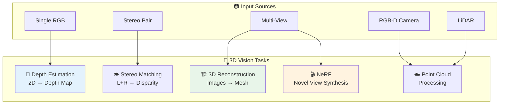
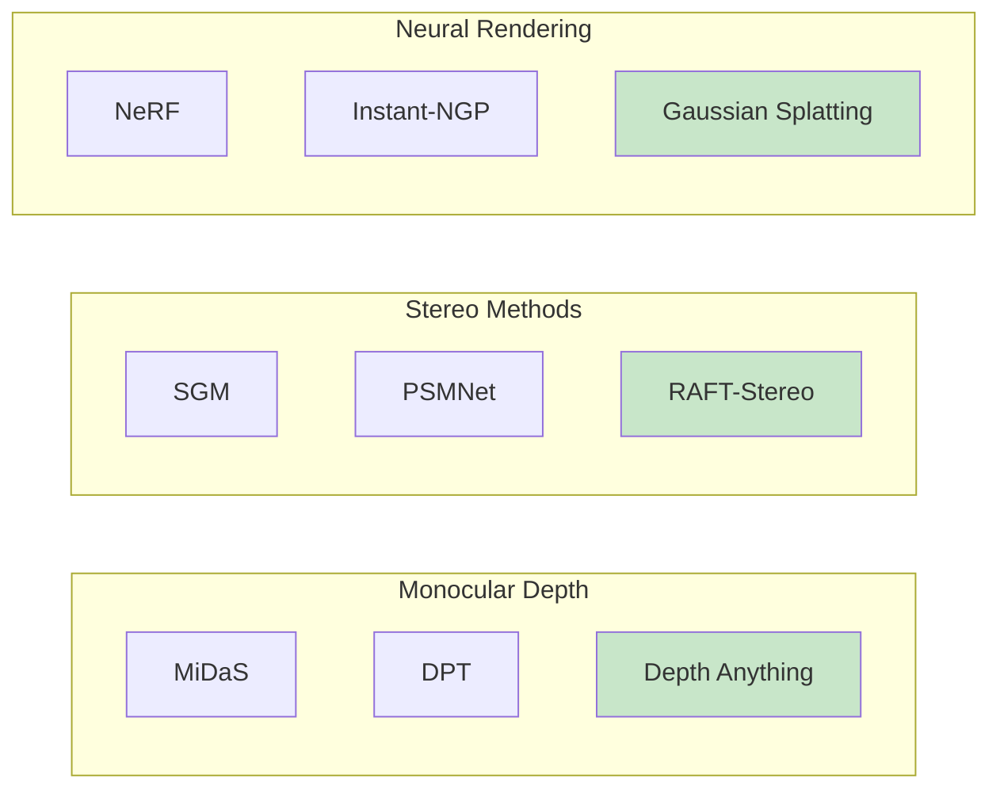
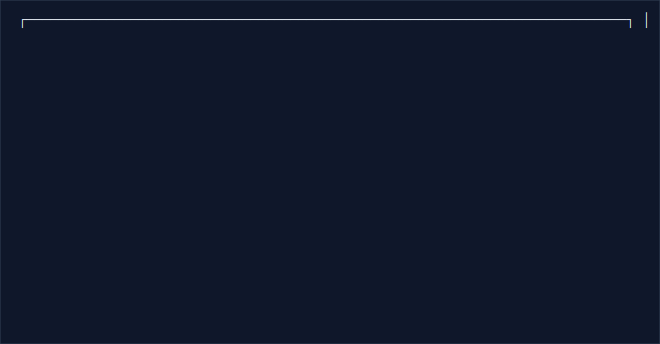

# 🌐 3D Vision

> Depth estimation, 3D reconstruction, and point cloud processing

---

## 📑 Table of Contents

1. [3D Vision Overview](#3d-vision-overview)
2. [Depth Estimation](#depth-estimation)
3. [Stereo Vision](#stereo-vision)
4. [Point Clouds](#point-clouds)

---

## 3D Vision Overview





| Method | Input | Output | Use Case |
|--------|-------|--------|----------|
| 📏 **Monocular Depth** | Single RGB | Relative depth | AR, Bokeh |
| 👁️ **Stereo** | L+R images | Metric depth | Robotics |
| 🏗️ **SfM/SLAM** | Video/images | 3D map | Navigation |
| ☁️ **Point Cloud** | Depth/LiDAR | 3D points | Autonomous |
| 🎬 **NeRF** | Multi-view | Novel views | VR/Film |

---

## Depth Estimation

### Monocular Depth Estimation



### Depth Estimation Implementation

```python
import torch
import cv2
import numpy as np

class DepthEstimator:
    """Monocular depth estimation using MiDaS/DPT."""

    def __init__(self, model_type='DPT_Large', device='cuda'):
        self.device = device

        # Load model from torch hub
        self.model = torch.hub.load('intel-isl/MiDaS', model_type)
        self.model.to(device).eval()

        # Load transforms
        midas_transforms = torch.hub.load('intel-isl/MiDaS', 'transforms')

        if 'DPT' in model_type:
            self.transform = midas_transforms.dpt_transform
        else:
            self.transform = midas_transforms.small_transform

    @torch.no_grad()
    def estimate(self, image):
        """
        Estimate depth from RGB image.

        Args:
            image: RGB image (numpy array or path)

        Returns:
            Depth map (higher values = further)
        """
        if isinstance(image, str):
            image = cv2.imread(image)
            image = cv2.cvtColor(image, cv2.COLOR_BGR2RGB)

        # Preprocess
        input_batch = self.transform(image).to(self.device)

        # Predict
        prediction = self.model(input_batch)

        # Resize to original size
        prediction = torch.nn.functional.interpolate(
            prediction.unsqueeze(1),
            size=image.shape[:2],
            mode='bicubic',
            align_corners=False
        ).squeeze()

        return prediction.cpu().numpy()

    def to_point_cloud(self, image, depth, intrinsics=None):
        """
        Convert depth map to 3D point cloud.

        Args:
            image: RGB image
            depth: Depth map
            intrinsics: Camera intrinsic matrix (optional)

        Returns:
            Points (N, 3) and colors (N, 3)
        """
        h, w = depth.shape

        # Default intrinsics (approximate)
        if intrinsics is None:
            fx = fy = w  # Approximate focal length
            cx, cy = w / 2, h / 2
        else:
            fx, fy = intrinsics[0, 0], intrinsics[1, 1]
            cx, cy = intrinsics[0, 2], intrinsics[1, 2]

        # Create meshgrid
        u, v = np.meshgrid(np.arange(w), np.arange(h))

        # Back-project to 3D
        z = depth
        x = (u - cx) * z / fx
        y = (v - cy) * z / fy

        # Stack and reshape
        points = np.stack([x, y, z], axis=-1).reshape(-1, 3)
        colors = image.reshape(-1, 3) / 255.0

        # Filter invalid points
        valid = (z.flatten() > 0) & (z.flatten() < np.inf)

        return points[valid], colors[valid]

    def visualize_depth(self, depth, colormap='plasma'):
        """Convert depth to colored visualization."""
        # Normalize
        depth_normalized = (depth - depth.min()) / (depth.max() - depth.min())

        # Apply colormap
        depth_colored = plt.cm.get_cmap(colormap)(depth_normalized)
        depth_colored = (depth_colored[:, :, :3] * 255).astype(np.uint8)

        return depth_colored
```

---

## Stereo Vision


### Stereo Matching

```python
import cv2
import numpy as np

class StereoMatcher:
    """Stereo depth estimation."""

    def __init__(self, method='sgbm'):
        self.method = method

        if method == 'sgbm':
            self.matcher = cv2.StereoSGBM_create(
                minDisparity=0,
                numDisparities=128,
                blockSize=11,
                P1=8 * 3 * 11**2,
                P2=32 * 3 * 11**2,
                disp12MaxDiff=1,
                uniquenessRatio=10,
                speckleWindowSize=100,
                speckleRange=32
            )
        else:
            self.matcher = cv2.StereoBM_create(
                numDisparities=128,
                blockSize=15
            )

    def compute_disparity(self, left, right):
        """
        Compute disparity map from stereo pair.

        Args:
            left, right: Rectified stereo images (grayscale)

        Returns:
            Disparity map
        """
        if len(left.shape) == 3:
            left = cv2.cvtColor(left, cv2.COLOR_BGR2GRAY)
            right = cv2.cvtColor(right, cv2.COLOR_BGR2GRAY)

        disparity = self.matcher.compute(left, right)

        # Normalize
        disparity = disparity.astype(np.float32) / 16.0

        return disparity

    def disparity_to_depth(self, disparity, focal_length, baseline):
        """
        Convert disparity to depth.

        Args:
            disparity: Disparity map
            focal_length: Camera focal length in pixels
            baseline: Distance between cameras in meters

        Returns:
            Depth map in meters
        """
        # Avoid division by zero
        disparity[disparity <= 0] = 0.1

        depth = (focal_length * baseline) / disparity

        return depth
```

---

## Point Clouds


### Point Cloud Processing

```python
import numpy as np
import open3d as o3d

class PointCloudProcessor:
    """Point cloud processing utilities."""

    @staticmethod
    def from_depth(depth, rgb, intrinsics):
        """Create point cloud from depth image."""
        # Create Open3D depth and color images
        depth_o3d = o3d.geometry.Image(depth.astype(np.float32))
        rgb_o3d = o3d.geometry.Image(rgb.astype(np.uint8))

        rgbd = o3d.geometry.RGBDImage.create_from_color_and_depth(
            rgb_o3d, depth_o3d,
            depth_scale=1000.0,
            depth_trunc=10.0,
            convert_rgb_to_intensity=False
        )

        # Create point cloud
        pcd = o3d.geometry.PointCloud.create_from_rgbd_image(
            rgbd, intrinsics
        )

        return pcd

    @staticmethod
    def preprocess(pcd, voxel_size=0.02):
        """Preprocess point cloud."""
        # Downsample
        pcd_down = pcd.voxel_down_sample(voxel_size)

        # Estimate normals
        pcd_down.estimate_normals(
            search_param=o3d.geometry.KDTreeSearchParamHybrid(
                radius=voxel_size * 2, max_nn=30
            )
        )

        # Remove outliers
        pcd_clean, _ = pcd_down.remove_statistical_outlier(
            nb_neighbors=20, std_ratio=2.0
        )

        return pcd_clean

    @staticmethod
    def segment_plane(pcd, distance_threshold=0.02):
        """Segment largest plane (e.g., ground)."""
        plane_model, inliers = pcd.segment_plane(
            distance_threshold=distance_threshold,
            ransac_n=3,
            num_iterations=1000
        )

        plane_cloud = pcd.select_by_index(inliers)
        remaining = pcd.select_by_index(inliers, invert=True)

        return plane_cloud, remaining, plane_model

    @staticmethod
    def register_icp(source, target, threshold=0.02):
        """Register two point clouds using ICP."""
        # Initial guess (identity)
        trans_init = np.eye(4)

        # Run ICP
        reg = o3d.pipelines.registration.registration_icp(
            source, target, threshold, trans_init,
            o3d.pipelines.registration.TransformationEstimationPointToPoint()
        )

        return reg.transformation, reg.fitness
```

---

## 📚 Key Takeaways

1. **Monocular depth** is convenient but relative (not metric)
2. **Stereo** gives metric depth but needs calibration
3. **Point clouds** are the bridge to 3D understanding
4. **NeRF** enables novel view synthesis from images
5. **LiDAR** is gold standard for autonomous driving

---

## 🔗 Next Steps

- [Deployment →](../15_deployment/) - 3D model optimization

---

*3D vision enables robots and AR to understand the physical world.* 🎯

---

<div align="center">

**[⬆ Back to Top](#)** | **[📚 Main Repository](https://github.com/Gaurav14cs17/ml_system_design)**

Made with 💜 by [Gaurav14cs17](https://github.com/Gaurav14cs17)

</div>
