# 🚀 Deployment

> From training to production: optimization, serving, and monitoring

<p align="center">
  
</p>

---

## 📑 Table of Contents

1. [Deployment Overview](#deployment-overview)
2. [Model Optimization](#model-optimization)
3. [Export Formats](#export-formats)
4. [Serving Infrastructure](#serving-infrastructure)
5. [Edge Deployment](#edge-deployment)
6. [Monitoring & MLOps](#monitoring-mlops)

---

## Deployment Overview

```mermaid
graph TB
    subgraph Platforms["🎯 Deployment Targets"]
        CLOUD["☁️ Cloud<br/>TensorRT, Triton"]
        SERVER["🖥️ Server<br/>ONNX Runtime"]
        MOBILE["📱 Mobile<br/>TFLite, CoreML"]
        EDGE["🔌 Edge<br/>OpenVINO, NCNN"]
    end

    style CLOUD fill:#e3f2fd
    style SERVER fill:#fff3e0
    style MOBILE fill:#c8e6c9
    style EDGE fill:#ffccbc
```




---

## Model Optimization

### Optimization Techniques


### Quantization Implementation

```python
import torch
import torch.quantization as quant

class ModelOptimizer:
    """Model optimization utilities."""

    @staticmethod
    def quantize_dynamic(model, dtype=torch.qint8):
        """
        Dynamic quantization (easiest, good for inference).
        Weights quantized, activations computed in fp32.
        """
        quantized = torch.quantization.quantize_dynamic(
            model,
            {torch.nn.Linear, torch.nn.Conv2d},
            dtype=dtype
        )
        return quantized

    @staticmethod
    def quantize_static(model, calibration_loader, device='cpu'):
        """
        Static quantization (better performance).
        Both weights and activations quantized.
        """
        model.eval()
        model.to(device)

        # Fuse modules
        model = torch.quantization.fuse_modules(model, [
            ['conv', 'bn', 'relu'],
            ['conv', 'bn']
        ])

        # Prepare for quantization
        model.qconfig = torch.quantization.get_default_qconfig('fbgemm')
        torch.quantization.prepare(model, inplace=True)

        # Calibrate with representative data
        with torch.no_grad():
            for images, _ in calibration_loader:
                model(images.to(device))

        # Convert to quantized model
        torch.quantization.convert(model, inplace=True)

        return model

    @staticmethod
    def prune_model(model, amount=0.3):
        """
        Prune model weights (unstructured).
        """
        import torch.nn.utils.prune as prune

        for name, module in model.named_modules():
            if isinstance(module, torch.nn.Conv2d):
                prune.l1_unstructured(module, name='weight', amount=amount)
                prune.remove(module, 'weight')
            elif isinstance(module, torch.nn.Linear):
                prune.l1_unstructured(module, name='weight', amount=amount)
                prune.remove(module, 'weight')

        return model

    @staticmethod
    def benchmark(model, input_shape, num_iterations=100, device='cuda'):
        """Benchmark model inference speed."""
        import time

        model.eval().to(device)
        dummy_input = torch.randn(input_shape).to(device)

        # Warmup
        for _ in range(10):
            with torch.no_grad():
                _ = model(dummy_input)

        if device == 'cuda':
            torch.cuda.synchronize()

        # Benchmark
        start = time.time()
        for _ in range(num_iterations):
            with torch.no_grad():
                _ = model(dummy_input)

        if device == 'cuda':
            torch.cuda.synchronize()

        elapsed = time.time() - start

        return {
            'total_time': elapsed,
            'avg_time_ms': (elapsed / num_iterations) * 1000,
            'throughput': num_iterations / elapsed
        }
```

---

## Export Formats

### ONNX Export

```python
import torch
import onnx
import onnxruntime as ort

class ModelExporter:
    """Export models to various formats."""

    @staticmethod
    def to_onnx(model, input_shape, output_path, opset_version=13):
        """Export PyTorch model to ONNX."""
        model.eval()

        dummy_input = torch.randn(input_shape)

        torch.onnx.export(
            model,
            dummy_input,
            output_path,
            export_params=True,
            opset_version=opset_version,
            do_constant_folding=True,
            input_names=['input'],
            output_names=['output'],
            dynamic_axes={
                'input': {0: 'batch_size'},
                'output': {0: 'batch_size'}
            }
        )

        # Verify
        onnx_model = onnx.load(output_path)
        onnx.checker.check_model(onnx_model)

        return output_path

    @staticmethod
    def to_torchscript(model, input_shape, output_path, method='trace'):
        """Export to TorchScript."""
        model.eval()

        dummy_input = torch.randn(input_shape)

        if method == 'trace':
            traced = torch.jit.trace(model, dummy_input)
        else:
            traced = torch.jit.script(model)

        traced.save(output_path)

        return output_path

    @staticmethod
    def to_tensorrt(onnx_path, output_path, fp16=True, int8=False):
        """Convert ONNX to TensorRT engine."""
        import tensorrt as trt

        logger = trt.Logger(trt.Logger.WARNING)
        builder = trt.Builder(logger)
        network = builder.create_network(
            1 << int(trt.NetworkDefinitionCreationFlag.EXPLICIT_BATCH)
        )
        parser = trt.OnnxParser(network, logger)

        # Parse ONNX
        with open(onnx_path, 'rb') as f:
            if not parser.parse(f.read()):
                for error in range(parser.num_errors):
                    print(parser.get_error(error))
                raise RuntimeError('ONNX parsing failed')

        # Configure builder
        config = builder.create_builder_config()
        config.max_workspace_size = 1 << 30  # 1GB

        if fp16:
            config.set_flag(trt.BuilderFlag.FP16)
        if int8:
            config.set_flag(trt.BuilderFlag.INT8)

        # Build engine
        engine = builder.build_engine(network, config)

        # Save
        with open(output_path, 'wb') as f:
            f.write(engine.serialize())

        return output_path
```

---

## Serving Infrastructure

### FastAPI Serving

```python
from fastapi import FastAPI, File, UploadFile
from fastapi.responses import JSONResponse
import torch
import numpy as np
from PIL import Image
import io

app = FastAPI(title="Vision Model API")

class ModelServer:
    """Model serving with batching and caching."""

    def __init__(self, model_path, device='cuda'):
        self.device = device
        self.model = self._load_model(model_path)
        self.model.eval()

    def _load_model(self, path):
        if path.endswith('.onnx'):
            import onnxruntime as ort
            return ort.InferenceSession(path)
        elif path.endswith('.pt'):
            return torch.jit.load(path).to(self.device)
        else:
            return torch.load(path).to(self.device)

    def preprocess(self, image):
        """Standard ImageNet preprocessing."""
        from torchvision import transforms

        transform = transforms.Compose([
            transforms.Resize(256),
            transforms.CenterCrop(224),
            transforms.ToTensor(),
            transforms.Normalize([0.485, 0.456, 0.406], [0.229, 0.224, 0.225])
        ])

        return transform(image).unsqueeze(0)

    @torch.no_grad()
    def predict(self, image):
        """Run inference."""
        tensor = self.preprocess(image).to(self.device)
        output = self.model(tensor)

        probs = torch.softmax(output, dim=1)
        top_prob, top_idx = probs.topk(5)

        return [
            {'class_id': idx.item(), 'confidence': prob.item()}
            for idx, prob in zip(top_idx[0], top_prob[0])
        ]

# Initialize model server
server = ModelServer('model.pt')

@app.post("/predict")
async def predict(file: UploadFile = File(...)):
    """Classify uploaded image."""
    contents = await file.read()
    image = Image.open(io.BytesIO(contents)).convert('RGB')

    predictions = server.predict(image)

    return JSONResponse(content={'predictions': predictions})

@app.get("/health")
async def health():
    """Health check endpoint."""
    return {"status": "healthy"}
```

### Triton Inference Server

```python
# config.pbtxt for Triton
"""
name: "vision_model"
platform: "onnxruntime_onnx"
max_batch_size: 32

input [
  {
    name: "input"
    data_type: TYPE_FP32
    dims: [ 3, 224, 224 ]
  }
]

output [
  {
    name: "output"
    data_type: TYPE_FP32
    dims: [ 1000 ]
  }
]

instance_group [
  {
    count: 2
    kind: KIND_GPU
  }
]

dynamic_batching {
  preferred_batch_size: [ 8, 16, 32 ]
  max_queue_delay_microseconds: 100
}
"""

import tritonclient.http as httpclient
import numpy as np

class TritonClient:
    """Client for Triton Inference Server."""

    def __init__(self, url="localhost:8000", model_name="vision_model"):
        self.client = httpclient.InferenceServerClient(url=url)
        self.model_name = model_name

    def predict(self, images):
        """Send batch for inference."""
        # Prepare input
        inputs = [httpclient.InferInput("input", images.shape, "FP32")]
        inputs[0].set_data_from_numpy(images.astype(np.float32))

        # Request inference
        outputs = [httpclient.InferRequestedOutput("output")]
        response = self.client.infer(self.model_name, inputs, outputs=outputs)

        return response.as_numpy("output")
```

---

## Edge Deployment

### Mobile Deployment (TFLite)

```python
import tensorflow as tf

def convert_to_tflite(saved_model_path, output_path, quantize=True):
    """Convert TensorFlow model to TFLite."""
    converter = tf.lite.TFLiteConverter.from_saved_model(saved_model_path)

    if quantize:
        converter.optimizations = [tf.lite.Optimize.DEFAULT]
        converter.target_spec.supported_types = [tf.float16]

    tflite_model = converter.convert()

    with open(output_path, 'wb') as f:
        f.write(tflite_model)

    return output_path

# Android/iOS inference
class TFLiteInference:
    """TFLite inference for mobile."""

    def __init__(self, model_path):
        self.interpreter = tf.lite.Interpreter(model_path=model_path)
        self.interpreter.allocate_tensors()

        self.input_details = self.interpreter.get_input_details()
        self.output_details = self.interpreter.get_output_details()

    def predict(self, image):
        """Run inference."""
        # Set input
        self.interpreter.set_tensor(
            self.input_details[0]['index'],
            image.astype(np.float32)
        )

        # Run
        self.interpreter.invoke()

        # Get output
        output = self.interpreter.get_tensor(self.output_details[0]['index'])

        return output
```

---

## Monitoring & MLOps

```python
import time
from prometheus_client import Counter, Histogram, start_http_server

# Metrics
PREDICTIONS = Counter('predictions_total', 'Total predictions', ['model', 'status'])
LATENCY = Histogram('prediction_latency_seconds', 'Prediction latency')

class MonitoredModel:
    """Model wrapper with monitoring."""

    def __init__(self, model, model_name='default'):
        self.model = model
        self.model_name = model_name

    def predict(self, input_data):
        """Predict with monitoring."""
        start_time = time.time()

        try:
            result = self.model(input_data)
            PREDICTIONS.labels(model=self.model_name, status='success').inc()
            return result
        except Exception as e:
            PREDICTIONS.labels(model=self.model_name, status='error').inc()
            raise
        finally:
            LATENCY.observe(time.time() - start_time)
```

---

## 📚 Key Takeaways

1. **Quantization** gives 2-4× speedup with minimal accuracy loss
2. **ONNX** is the universal exchange format
3. **TensorRT** for NVIDIA, **CoreML** for Apple, **TFLite** for mobile
4. **Batch inference** maximizes GPU utilization
5. **Monitor** latency, throughput, and accuracy drift

---

*Deployment is where models meet the real world - optimize carefully.* 🎯

---

<div align="center">

**[⬆ Back to Top](#)** | **[📚 Main Repository](https://github.com/Gaurav14cs17/ml_system_design)**

Made with 💜 by [Gaurav14cs17](https://github.com/Gaurav14cs17)

</div>
