# 🖼️ Computer Vision: Complete System Design Guide

> A comprehensive, production-ready guide to building computer vision systems at scale

<p align="center">
  
</p>

---

## 📚 Table of Contents

| Module | Topic | Description |
|--------|-------|-------------|
| 01 | [Fundamentals](./01_fundamentals/) | Image basics, color spaces, digital image representation |
| 02 | [Image Processing](./02_image_processing/) | Filtering, transformations, morphological operations |
| 03 | [Feature Extraction](./03_feature_extraction/) | Traditional CV features: SIFT, SURF, ORB, HOG |
| 04 | [CNN Architectures](./04_cnn_architectures/) | Deep learning backbones: LeNet to Vision Transformers |
| 05 | [Object Detection](./05_object_detection/) | YOLO, Faster R-CNN, SSD, and modern detectors |
| 06 | [Semantic Segmentation](./06_semantic_segmentation/) | Pixel-wise classification: FCN, U-Net, DeepLab |
| 07 | [Instance Segmentation](./07_instance_segmentation/) | Object-level segmentation: Mask R-CNN, SOLO |
| 08 | [Image Classification](./08_image_classification/) | Transfer learning, fine-tuning strategies |
| 09 | [Face Recognition](./09_face_recognition/) | Detection, verification, and recognition pipelines |
| 10 | [Pose Estimation](./10_pose_estimation/) | Human pose detection: OpenPose, MediaPipe |
| 11 | [Video Analysis](./11_video_analysis/) | Action recognition, object tracking, temporal models |
| 12 | [Generative Models](./12_generative_models/) | GANs, VAEs, Diffusion models for images |
| 13 | [OCR](./13_ocr/) | Text detection and recognition systems |
| 14 | [3D Vision](./14_3d_vision/) | Depth estimation, 3D reconstruction, point clouds |
| 15 | [Deployment](./15_deployment/) | Model optimization, edge deployment, serving |

---

## 🎯 Learning Path

```mermaid
flowchart LR
    subgraph Phase1["📚 Phase 1: Foundations"]
        A[01 Fundamentals] --> B[02 Image Processing]
        B --> C[03 Feature Extraction]
    end

    subgraph Phase2["🧠 Phase 2: Deep Learning"]
        D[04 CNN Architectures] --> E[05 Object Detection]
        E --> F[06 Semantic Segmentation]
    end

    subgraph Phase3["🎯 Phase 3: Advanced Tasks"]
        G[07 Instance Segmentation] --> H[08 Classification]
        H --> I[09 Face Recognition]
    end

    subgraph Phase4["🎬 Phase 4: Specialized"]
        J[10 Pose Estimation] --> K[11 Video Analysis]
        K --> L[12 Generative Models]
    end

    subgraph Phase5["🚀 Phase 5: Production"]
        M[13 OCR] --> N[14 3D Vision]
        N --> O[15 Deployment]
    end

    Phase1 --> Phase2
    Phase2 --> Phase3
    Phase3 --> Phase4
    Phase4 --> Phase5

    style A fill:#e1f5fe
    style O fill:#c8e6c9

```



### Week-by-Week Timeline


---

## 🏗️ System Architecture Overview

```mermaid
graph TB
    subgraph Input["📥 Input Layer"]
        CAM[Camera/Sensor]
        IMG[Image Files]
        VID[Video Stream]
    end

    subgraph Preprocessing["⚙️ Preprocessing"]
        RESIZE[Resize & Normalize]
        AUG[Augmentation]
        BATCH[Batching]
    end

    subgraph Models["🧠 Model Layer"]
        BACKBONE[Backbone CNN/ViT]
        HEADS[Task Heads]
        ENSEMBLE[Ensemble]
    end

    subgraph Postprocess["📤 Postprocessing"]
        NMS[NMS/Filtering]
        DECODE[Decode Outputs]
        FORMAT[Format Results]
    end

    subgraph Serving["🚀 Serving"]
        API[REST API]
        GRPC[gRPC]
        EDGE[Edge Runtime]
    end

    Input --> Preprocessing
    Preprocessing --> Models
    Models --> Postprocess
    Postprocess --> Serving

    style BACKBONE fill:#fff3e0
    style API fill:#e8f5e9

```



---

## 🏗️ System Design Focus Areas

### 1. **Scalability Patterns**

- Batch processing pipelines

- Real-time inference systems

- Distributed training architectures

### 2. **Production Considerations**

- Model versioning and A/B testing

- Monitoring and observability

- Graceful degradation strategies

### 3. **Performance Optimization**

- GPU utilization techniques

- Model quantization and pruning

- Hardware-specific optimizations

### 4. **MLOps Integration**

- CI/CD for ML pipelines

- Feature stores for vision

- Experiment tracking

---

## 🛠️ Technology Stack

| Category | Tools |
|----------|-------|
| **Frameworks** | PyTorch, TensorFlow, JAX |
| **Libraries** | OpenCV, Albumentations, Kornia |
| **Model Hubs** | HuggingFace, TorchVision, timm |
| **Serving** | TorchServe, TensorFlow Serving, Triton |
| **Optimization** | ONNX, TensorRT, OpenVINO |
| **Edge** | TFLite, CoreML, NCNN |
| **Orchestration** | Kubeflow, MLflow, Weights & Biases |

---

## 📖 How to Use This Guide

1. **Sequential Learning**: Follow modules 01-15 for comprehensive coverage

2. **Project-Based**: Jump to specific topics for targeted learning

3. **Reference**: Use as documentation for production implementations

Each module contains:

- 📝 **Concept Explanation**: Deep theoretical background

- 🏛️ **Architecture Details**: System design diagrams

- 💻 **Code Examples**: Production-ready implementations

- 🎯 **Best Practices**: Industry-proven patterns

- ⚠️ **Common Pitfalls**: Mistakes to avoid

- 📊 **Benchmarks**: Performance comparisons

---

## 🚀 Quick Start

```bash
# Clone and setup environment
cd 05_computer_vision

# Create virtual environment
python -m venv venv
source venv/bin/activate  # Linux/Mac
# or: venv\Scripts\activate  # Windows

# Install dependencies
pip install -r requirements.txt

# Start with fundamentals
cd 01_fundamentals
python examples/basic_image_ops.py

```

---

## 📋 Prerequisites

- **Python 3.8+** with basic programming skills

- **Linear Algebra** fundamentals (matrices, vectors)

- **Calculus** basics (gradients, derivatives)

- **Machine Learning** concepts (loss functions, optimization)

---

## 🤝 Contributing

Each module follows a consistent structure:


---

*Built for ML Engineers who want to design production-grade computer vision systems* 🎯

---

<div align="center">

**[⬆ Back to Top](#)** | **[📚 Main Repository](https://github.com/Gaurav14cs17/ml_system_design)**

Made with 💜 by [Gaurav14cs17](https://github.com/Gaurav14cs17)

</div>
