# 🎯 Introduction to Fraud Detection Systems

> Understanding the fundamentals of fraud detection, types of fraud, business impact, and what makes a robust fraud detection ML system.

---

## 📊 Visual Overview

### System Architecture
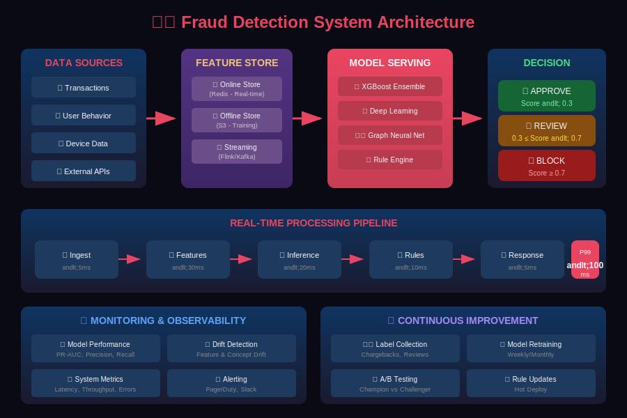

### Types of Fraud
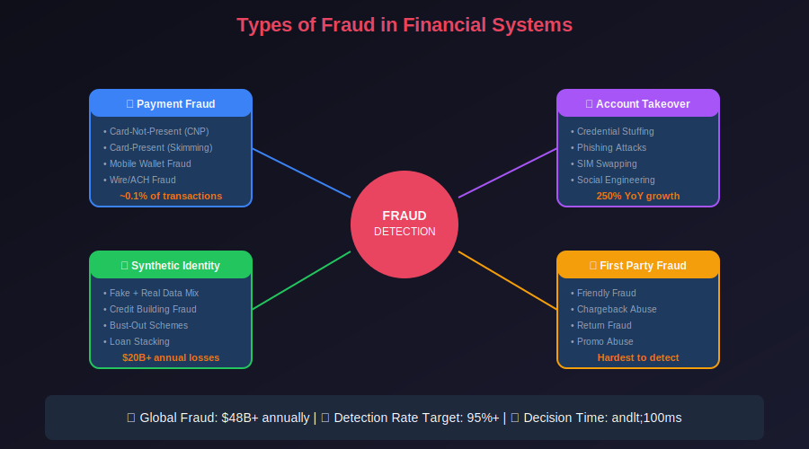

---

## 📖 Table of Contents

1. [What is Fraud Detection?](#what-is-fraud-detection)

2. [Mathematical Foundation](#mathematical-foundation)

3. [Types of Fraud](#types-of-fraud)

4. [Business Impact](#business-impact)

5. [Traditional vs ML-Based Approaches](#traditional-vs-ml-based-approaches)

6. [System Requirements](#system-requirements)

7. [Key Challenges](#key-challenges)

8. [Success Metrics](#success-metrics)

---

## What is Fraud Detection?

Fraud detection is the process of identifying and preventing unauthorized or deceptive activities that result in financial or data loss. In the context of machine learning systems, fraud detection involves using algorithms to analyze patterns in data and automatically flag suspicious transactions or behaviors.

---

## Mathematical Foundation

### Bayesian Framework for Fraud Detection

At its core, fraud detection is a **binary classification problem** where we estimate the probability that a transaction is fraudulent given observable features. Using Bayes' theorem:

```math
P(\text{fraud} | \mathbf{x}) = \frac{P(\mathbf{x} | \text{fraud}) \cdot P(\text{fraud})}{P(\mathbf{x})}

```

Where:

- $P(\text{fraud} | \mathbf{x})$ is the **posterior probability** of fraud given transaction features $\mathbf{x}$

- $P(\mathbf{x} | \text{fraud})$ is the **likelihood** of observing features $\mathbf{x}$ given fraud

- $P(\text{fraud})$ is the **prior probability** of fraud (typically 0.1-1%)

- $P(\mathbf{x})$ is the **evidence** (normalizing constant)

### Decision Theory and Cost-Sensitive Classification

The optimal decision boundary is not simply $P(\text{fraud} | \mathbf{x}) = 0.5$. Instead, we minimize **expected cost**:

```math
\text{Expected Cost} = C_{FP} \cdot P(\text{false positive}) + C_{FN} \cdot P(\text{false negative})

```

Where typically $C\_{FN} \gg C\_{FP}$ because missing fraud is far more costly than incorrectly blocking a legitimate transaction.

The **optimal decision threshold** $\tau^*$ is:

```math
\tau^* = \frac{C_{FP}}{C_{FP} + C_{FN}}

```

For example, if missing fraud costs \$500 and blocking a legitimate transaction costs \$10:

```math
\tau^* = \frac{10}{10 + 500} = 0.0196 \approx 2\%

```

This means we should block any transaction with $P(\text{fraud}) > 2\%$.

### Class Imbalance: The Mathematical Challenge

In fraud detection, the class distribution is highly skewed:

```math
\eta = \frac{N_{\text{fraud}}}{N_{\text{total}}} \approx 0.001 - 0.01

```

This creates several mathematical issues:

1. **Accuracy Paradox**: A model predicting "no fraud" for everything achieves $(1 - \eta) \approx 99\%$ accuracy

2. **Learning Bias**: Standard loss functions weight all samples equally, causing the model to ignore the minority class

3. **Evaluation Metrics**: Traditional metrics fail; we need area under the PR curve (AUPRC) instead of AUROC

### Information-Theoretic Perspective

The **information gain** from observing feature $\mathbf{x}$ about fraud is:

```math
I(\text{fraud}; \mathbf{x}) = H(\text{fraud}) - H(\text{fraud} | \mathbf{x})

```

Where $H(\cdot)$ is Shannon entropy:

```math
H(\text{fraud}) = -\sum_{y \in \{0,1\}} P(y) \log_2 P(y)

```

Good features maximize this mutual information, reducing uncertainty about whether a transaction is fraudulent.

### The Scale of the Problem

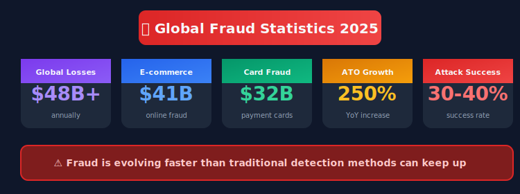

### Why ML for Fraud Detection?

Traditional rule-based systems struggle with:

- **Evolving fraud patterns**: Fraudsters constantly adapt their techniques

- **Scale**: Millions of transactions per second need real-time analysis

- **Complexity**: Modern fraud involves sophisticated multi-step attacks

- **False positives**: Static rules generate too many false alarms

Machine learning addresses these challenges by:

- Learning complex patterns from historical data

- Adapting to new fraud patterns automatically

- Processing high-dimensional feature spaces

- Balancing precision and recall dynamically

---

## Types of Fraud

### 1. Payment Fraud

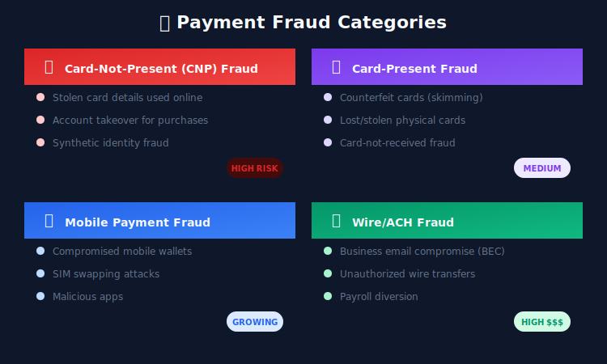

### 2. Account Fraud

| Type | Description | Detection Signals |
|------|-------------|-------------------|
| Account Takeover (ATO) | Unauthorized access to existing accounts | Unusual login location, device fingerprint change |
| New Account Fraud | Creating accounts with stolen/synthetic identities | Velocity checks, identity verification failures |
| Credential Stuffing | Automated login attempts with leaked credentials | High-velocity login attempts, bot patterns |
| Synthetic Identity | Combining real and fake information | SSN/name mismatches, thin credit files |

### 3. Transaction Fraud

```python
# Transaction fraud patterns
transaction_fraud_types = {
    "first_party_fraud": {
        "description": "Legitimate customer disputes valid charges",
        "aka": "Friendly fraud, chargeback fraud",
        "difficulty": "High - customer is legitimate"
    },
    "third_party_fraud": {
        "description": "Unauthorized use of stolen payment credentials",
        "aka": "True fraud",
        "difficulty": "Medium - clear unauthorized activity"
    },
    "merchant_fraud": {
        "description": "Merchant colludes in fraudulent transactions",
        "aka": "Merchant collusion",
        "difficulty": "High - inside job"
    }
}

```

### 4. Application Fraud

Application fraud occurs during onboarding or credit applications:

- **Identity Theft**: Using stolen personal information

- **Income Falsification**: Inflating income on applications

- **Document Fraud**: Submitting forged documents

- **Bust-out Fraud**: Building credit then defaulting intentionally

### 5. Insurance Fraud

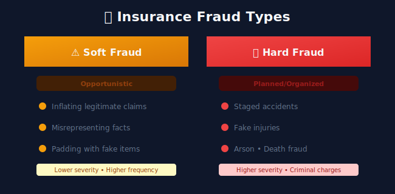

---

## Business Impact

### Cost of Fraud

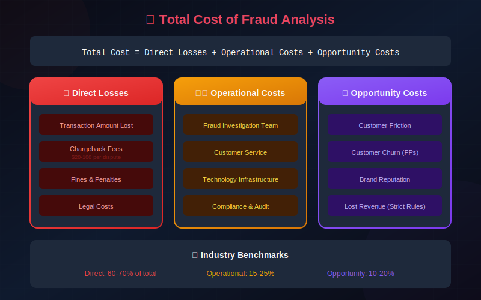

### The False Positive Problem

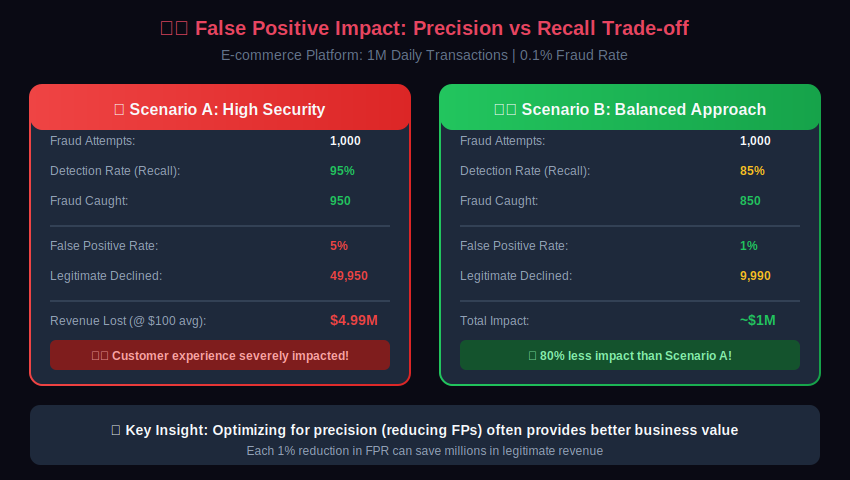

### ROI of Fraud Detection

| Investment | Cost | Savings | ROI |
|------------|------|---------|-----|
| Basic ML System | $500K/year | $2M fraud prevented | 300% |
| Advanced ML + Rules | $1.5M/year | $8M fraud prevented | 433% |
| Real-time Feature Store | $800K/year | $3M from faster detection | 275% |

---

## Traditional vs ML-Based Approaches

### Rule-Based Systems

```python
# Traditional rule-based fraud detection
def check_fraud_rules(transaction):
    rules_triggered = []

    # Rule 1: Large transaction
    if transaction.amount > 10000:
        rules_triggered.append("LARGE_AMOUNT")

    # Rule 2: International transaction
    if transaction.country != customer.home_country:
        rules_triggered.append("INTERNATIONAL")

    # Rule 3: Night transaction
    if transaction.hour < 6 or transaction.hour > 22:
        rules_triggered.append("ODD_HOURS")

    # Rule 4: New device
    if transaction.device_id not in customer.known_devices:
        rules_triggered.append("NEW_DEVICE")

    # Decision based on rules
    if len(rules_triggered) >= 2:
        return "REVIEW"
    elif "LARGE_AMOUNT" in rules_triggered and "INTERNATIONAL" in rules_triggered:
        return "BLOCK"
    else:
        return "APPROVE"

```

**Pros:**

- Easy to understand and explain

- Quick to implement for known patterns

- No training data required

- Full control over logic

**Cons:**

- Doesn't adapt to new fraud patterns

- High false positive rates

- Difficult to maintain at scale

- Can't capture complex interactions

### Machine Learning Approach

```python
# ML-based fraud detection
class FraudDetectionModel:
    def __init__(self):
        self.feature_extractor = FeatureExtractor()
        self.model = XGBoostClassifier()
        self.threshold = 0.7

    def predict(self, transaction):
        # Extract rich feature set
        features = self.feature_extractor.transform(transaction)

        # Features include:
        # - Transaction attributes
        # - Customer behavioral history
        # - Device/session features
        # - Network/graph features
        # - Time-series aggregations

        # Get probability score
        fraud_probability = self.model.predict_proba(features)[1]

        # Return decision with explanation
        return {
            "score": fraud_probability,
            "decision": "BLOCK" if fraud_probability > self.threshold else "APPROVE",
            "top_factors": self.explain_prediction(features)
        }

```

**Pros:**

- Learns complex patterns automatically

- Adapts to new fraud patterns with retraining

- Lower false positive rates

- Handles high-dimensional data

**Cons:**

- Requires quality training data

- Less interpretable (black box)

- Needs monitoring for drift

- Higher initial investment

### Hybrid Approach (Best Practice)

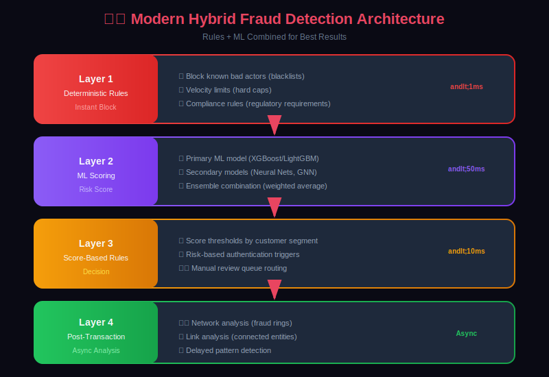

---

## System Requirements

### Functional Requirements

```yaml
Fraud Detection System Requirements:

Real-Time Scoring:
  - Score transactions in < 100ms (P99)
  - Support 100,000+ transactions per second
  - Handle multiple transaction types
  - Return risk score and decision

Batch Processing:
  - Daily model retraining capability
  - Historical pattern analysis
  - Report generation
  - Feature computation

Case Management:
  - Queue suspicious transactions for review
  - Track investigation outcomes
  - Feedback loop for model improvement
  - Audit trail for compliance

API Integration:
  - RESTful API for real-time scoring
  - Streaming API for high-throughput
  - Batch API for bulk processing
  - Webhook for async notifications

```

### Non-Functional Requirements

| Requirement | Target | Justification |
|-------------|--------|---------------|
| Latency (P50) | <20ms | User experience in checkout |
| Latency (P99) | <100ms | SLA requirements |
| Availability | 99.99% | Critical path for transactions |
| Throughput | 100K TPS | Peak holiday traffic |
| Accuracy | >95% precision | Minimize customer friction |
| Recovery Time | <1 minute | Minimize impact of outages |

### Data Requirements

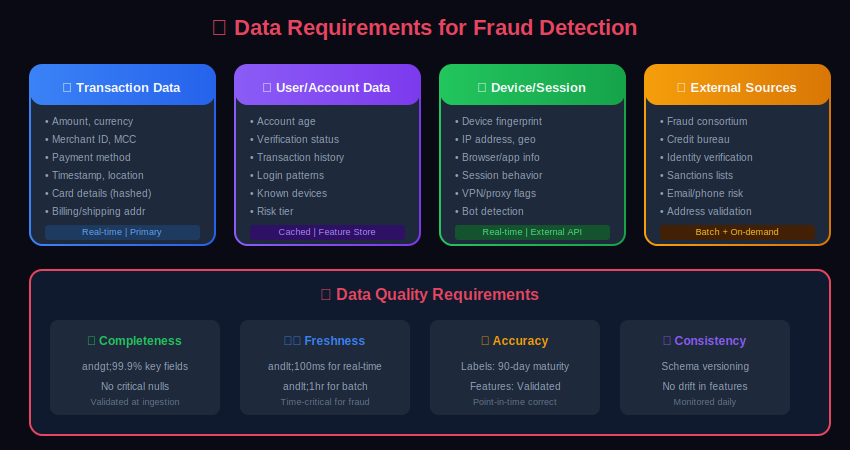

---

## Key Challenges

### 1. Class Imbalance

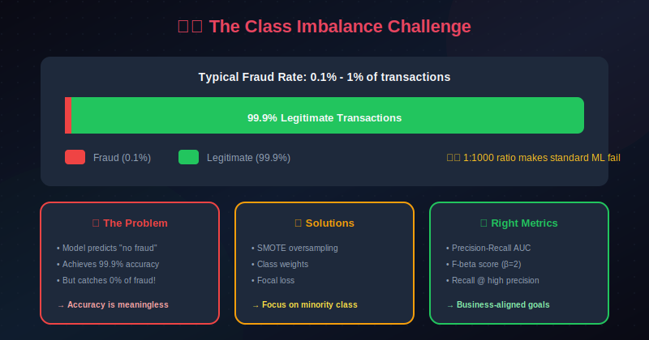

### 2. Adversarial Adaptation

Fraudsters actively adapt to detection systems:

```python
# Adversarial evolution example
fraud_evolution = {
    "2020": {
        "pattern": "Large single transactions",
        "detection": "Amount threshold rules",
        "adaptation": "Split into smaller transactions"
    },
    "2021": {
        "pattern": "Multiple small transactions",
        "detection": "Velocity rules",
        "adaptation": "Spread across time/accounts"
    },
    "2022": {
        "pattern": "Distributed attacks",
        "detection": "Network analysis",
        "adaptation": "Synthetic identities"
    },
    "2023": {
        "pattern": "Synthetic identity fraud",
        "detection": "Identity verification ML",
        "adaptation": "AI-generated documents"
    }
}

```

### 3. Real-Time Constraints

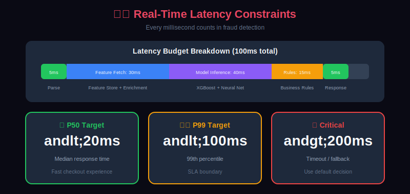

### 4. Label Quality and Delay

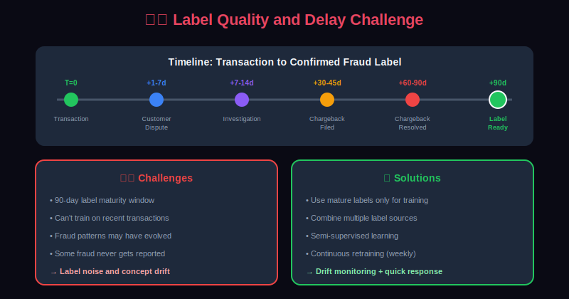

### 5. Explainability Requirements

Regulatory and business requirements for explainability:

- **GDPR Right to Explanation**: Customers can request explanation for decisions

- **Fair Lending Laws**: Must explain credit decisions

- **Internal Audit**: Need to justify model decisions

- **Analyst Productivity**: Clear signals help investigation

---

## Success Metrics

### Mathematical Definitions of Core Metrics

Given a confusion matrix with True Positives (TP), False Positives (FP), True Negatives (TN), and False Negatives (FN):

#### Precision (Positive Predictive Value)

```math
\text{Precision} = \frac{TP}{TP + FP}

```

**Interpretation**: Of all transactions we flag as fraud, what fraction are actually fraud?

#### Recall (Sensitivity / True Positive Rate)

```math
\text{Recall} = \frac{TP}{TP + FN}

```

**Interpretation**: Of all actual fraud, what fraction do we catch?

#### F1 Score (Harmonic Mean)

```math
F_1 = 2 \cdot \frac{\text{Precision} \cdot \text{Recall}}{\text{Precision} + \text{Recall}} = \frac{2 \cdot TP}{2 \cdot TP + FP + FN}

```

#### Generalized F-beta Score

When recall is more important than precision (fraud detection), use $\beta > 1$:

```math
F_\beta = (1 + \beta^2) \cdot \frac{\text{Precision} \cdot \text{Recall}}{\beta^2 \cdot \text{Precision} + \text{Recall}}

```

For fraud detection, $F\_2$ (weighing recall twice as much as precision) is often appropriate.

#### Precision-Recall AUC (AUPRC)

```math
\text{AUPRC} = \int_0^1 P(r) \, dr

```

Where $P(r)$ is precision as a function of recall. **AUPRC is the preferred metric for imbalanced classification** because it focuses on the minority class performance.

### Why AUPRC Over AUROC?

For highly imbalanced datasets, AUROC can be misleadingly high. The relationship is:

```math
\text{AUROC} = P(\hat{y}_+ > \hat{y}_-)

```

This measures how often a randomly chosen positive example ranks higher than a negative. But with 99%+ negatives, even poor models achieve high AUROC.

**AUPRC baseline** equals the positive class prevalence $\pi$:

```math
\text{AUPRC}_{\text{random}} = \pi = \frac{N_+}{N_+ + N_-}

```

So for 0.1% fraud rate, random baseline AUPRC = 0.001, making improvements clearly visible.

### Business Metrics

| Metric | Definition | Formula | Target |
|--------|------------|---------|--------|
| Fraud Loss Rate | Fraud losses / Total value | $\frac{\sum\_{i \in FN} v\_i}{V\_{\text{total}}}$ | <0.05% |
| Decline Rate | Declined / Total transactions | $\frac{TP + FP}{N}$ | <2% |
| Review Rate | Reviews / Total | $\frac{N\_{\text{review}}}{N}$ | <0.5% |
| Investigation Efficiency | Confirmed / Reviewed | $\frac{TP\_{\text{review}}}{N\_{\text{review}}}$ | >20% |

### Operational Metrics

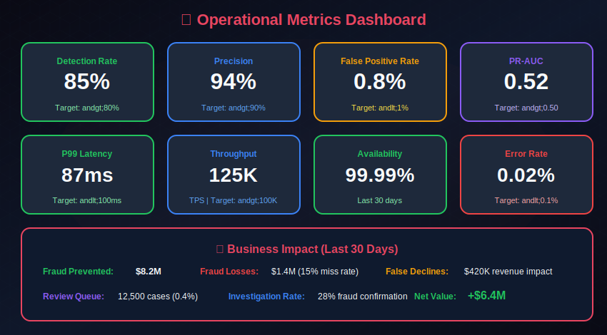

---

## Summary

Building an effective fraud detection system requires:

1. **Understanding the problem space**: Different fraud types need different approaches

2. **Balancing trade-offs**: Precision vs recall, speed vs accuracy

3. **Hybrid architecture**: Combining rules and ML for best results

4. **Continuous adaptation**: Fraudsters evolve, so must your system

5. **Proper metrics**: Focus on business impact, not just ML metrics

---

## Next Steps

Continue to [Chapter 2: Data Collection & Preprocessing →](../02_data_collection_and_preprocessing/)

---

## Resources

- [ACFE Report to the Nations](https://www.acfe.com/report-to-the-nations/2024/)

- [Nilson Report on Payment Fraud](https://nilsonreport.com/)

- [FICO Fraud Detection Research](https://www.fico.com/en/solutions/fraud-detection)

- [IEEE Fraud Detection Papers](https://ieeexplore.ieee.org/)

---

<div align="center">

**[⬆ Back to Top](#)** | **[📚 Main Repository](https://github.com/Gaurav14cs17/ml_system_design)**

Made with 💜 by [Gaurav14cs17](https://github.com/Gaurav14cs17)

</div>
