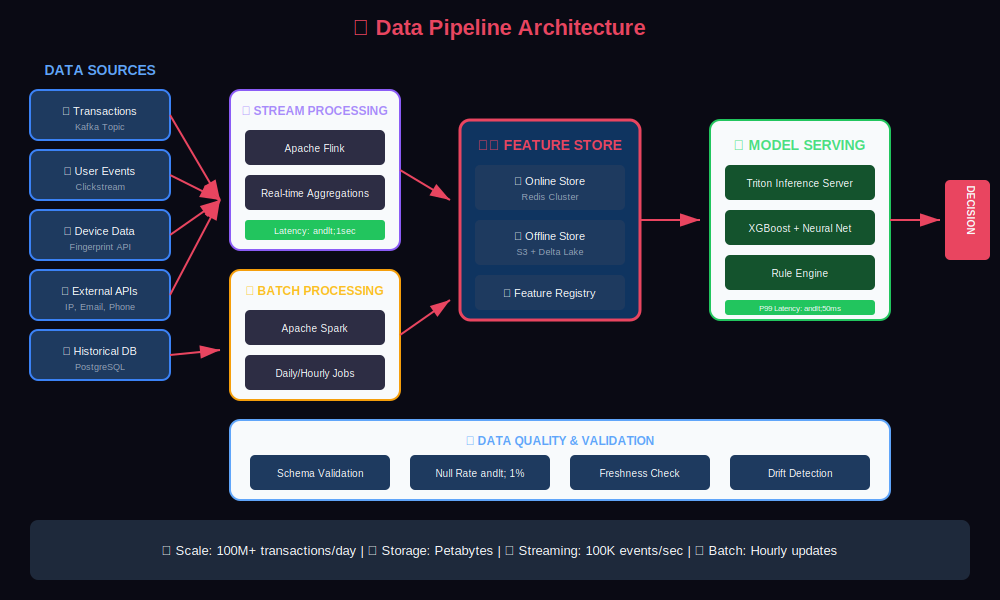
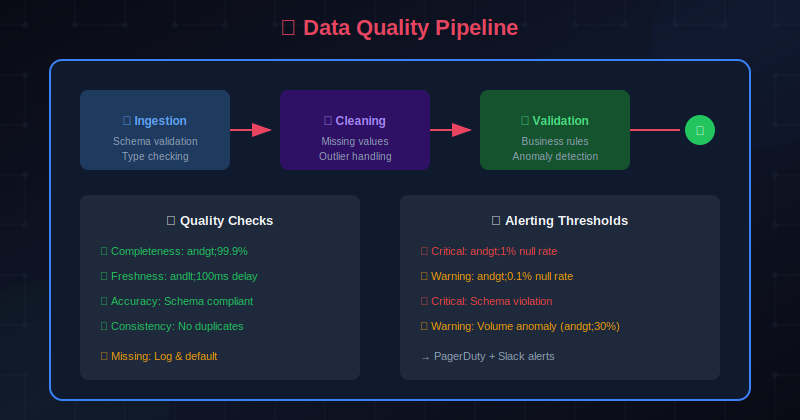
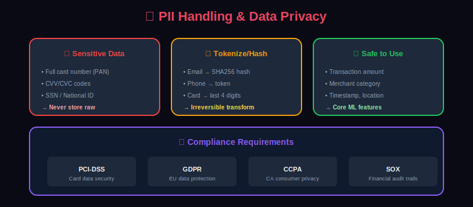
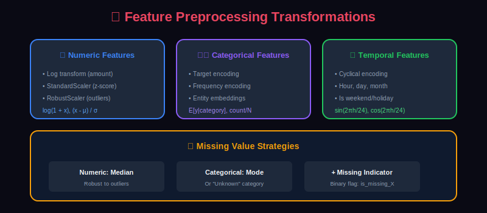
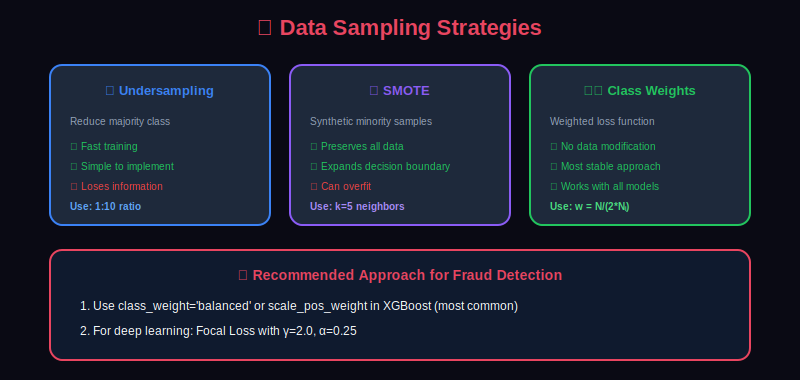

# 📊 Data Collection & Preprocessing for Fraud Detection

> A deep dive into collecting, processing, and preparing data for fraud detection ML systems.

---

## 📊 Visual Overview

### Data Pipeline Architecture


---

## 📖 Table of Contents

1. [Data Sources Overview](#data-sources-overview)
2. [Transaction Data](#transaction-data)
3. [User Behavioral Data](#user-behavioral-data)
4. [Device and Session Data](#device-and-session-data)
5. [External Data Sources](#external-data-sources)
6. [Data Pipeline Architecture](#data-pipeline-architecture)
7. [Data Quality and Validation](#data-quality-and-validation)
8. [Preprocessing Techniques](#preprocessing-techniques)
9. [Handling Missing Data](#handling-missing-data)
10. [Data Privacy and Compliance](#data-privacy-and-compliance)

---

## Data Sources Overview

A comprehensive fraud detection system requires data from multiple sources:


### Data Volume Estimates

| Data Type | Volume (Daily) | Retention | Storage |
|-----------|----------------|-----------|---------|
| Transactions | 100M+ records | 7 years | Petabytes |
| Device Data | 50M+ records | 2 years | Terabytes |
| Session Events | 1B+ events | 90 days | Terabytes |
| Feature Store | 10B+ features | Real-time | Terabytes |

---

## Transaction Data

Transaction data forms the core of fraud detection:

### Schema Design

```python
from dataclasses import dataclass
from datetime import datetime
from typing import Optional
from decimal import Decimal

@dataclass
class Transaction:
    # Identifiers
    transaction_id: str
    customer_id: str
    merchant_id: str

    # Transaction details
    amount: Decimal
    currency: str
    transaction_type: str  # purchase, refund, transfer

    # Timing
    timestamp: datetime
    processing_time_ms: int

    # Payment method
    payment_method: str  # card, bank, wallet
    card_type: Optional[str]  # credit, debit, prepaid
    card_brand: Optional[str]  # visa, mastercard
    card_bin: Optional[str]  # first 6 digits
    card_last4: Optional[str]
    card_expiry: Optional[str]

    # Merchant info
    merchant_category_code: str
    merchant_name: str
    merchant_country: str
    merchant_city: Optional[str]

    # Channel
    channel: str  # online, pos, atm, mobile
    entry_mode: str  # chip, swipe, keyed, contactless

    # Authorization
    authorization_code: Optional[str]
    response_code: str

    # Enriched fields
    customer_ip: Optional[str]
    device_id: Optional[str]
    session_id: Optional[str]
```

### Transaction Types



---

## User Behavioral Data

### Behavioral Signals

```python
@dataclass
class UserBehavior:
    user_id: str
    session_id: str

    # Login patterns
    login_timestamp: datetime
    login_location: str
    login_device: str
    login_method: str  # password, biometric, sso
    failed_attempts_before_success: int

    # Session behavior
    pages_viewed: list[str]
    time_on_page: dict[str, float]
    mouse_movements: int
    keyboard_patterns: dict
    scroll_behavior: dict

    # Transaction patterns
    typical_amount_range: tuple[float, float]
    typical_merchants: list[str]
    typical_time_of_day: list[int]
    typical_day_of_week: list[int]

    # Historical stats
    account_age_days: int
    total_transactions: int
    total_amount_lifetime: Decimal
    previous_fraud_cases: int
    previous_disputes: int
```

### Behavioral Aggregations

```sql
-- User behavioral aggregations for fraud detection
CREATE TABLE user_behavioral_features AS
SELECT
    user_id,

    -- Transaction velocity (last 24 hours)
    COUNT(*) FILTER (WHERE ts > NOW() - INTERVAL '24 hours') as txn_count_24h,
    SUM(amount) FILTER (WHERE ts > NOW() - INTERVAL '24 hours') as txn_amount_24h,
    COUNT(DISTINCT merchant_id) FILTER (WHERE ts > NOW() - INTERVAL '24 hours') as unique_merchants_24h,

    -- Transaction velocity (last 7 days)
    COUNT(*) FILTER (WHERE ts > NOW() - INTERVAL '7 days') as txn_count_7d,
    AVG(amount) FILTER (WHERE ts > NOW() - INTERVAL '7 days') as avg_amount_7d,
    STDDEV(amount) FILTER (WHERE ts > NOW() - INTERVAL '7 days') as stddev_amount_7d,

    -- Behavioral patterns
    MODE() WITHIN GROUP (ORDER BY EXTRACT(HOUR FROM ts)) as typical_hour,
    MODE() WITHIN GROUP (ORDER BY merchant_category) as typical_mcc,

    -- Risk indicators
    COUNT(*) FILTER (WHERE is_international) / NULLIF(COUNT(*), 0)::float as international_ratio,
    COUNT(*) FILTER (WHERE is_declined) / NULLIF(COUNT(*), 0)::float as decline_ratio,

    -- Recency
    EXTRACT(EPOCH FROM (NOW() - MAX(ts))) as seconds_since_last_txn,
    EXTRACT(EPOCH FROM (NOW() - MIN(ts))) as account_age_seconds

FROM transactions
GROUP BY user_id;
```

---

## Device and Session Data

### Device Fingerprinting

```python
@dataclass
class DeviceFingerprint:
    device_id: str  # Generated fingerprint hash

    # Browser/App
    user_agent: str
    browser_name: str
    browser_version: str
    platform: str  # Windows, macOS, iOS, Android

    # Hardware signals
    screen_resolution: str
    color_depth: int
    device_memory: Optional[int]
    hardware_concurrency: int

    # Network
    ip_address: str
    ip_type: str  # residential, datacenter, mobile, tor
    isp: str
    asn: str

    # Geolocation
    country: str
    region: str
    city: str
    latitude: float
    longitude: float
    timezone: str

    # Canvas/WebGL fingerprint
    canvas_hash: str
    webgl_hash: str
    audio_hash: str

    # Plugins and fonts
    plugins_hash: str
    fonts_hash: str

    # Risk signals
    is_incognito: bool
    is_automation: bool
    has_touch: bool

    # Trust score
    device_reputation_score: float
    first_seen: datetime
    times_seen: int
```

### Session Analytics

```python
@dataclass
class SessionData:
    session_id: str
    user_id: Optional[str]
    device_id: str

    # Session lifecycle
    session_start: datetime
    session_end: Optional[datetime]
    duration_seconds: int

    # Page flow
    pages_visited: list[str]
    entry_page: str
    exit_page: str

    # Interaction signals
    total_clicks: int
    total_keystrokes: int
    mouse_movement_distance: float
    scroll_depth_avg: float

    # Form behavior
    form_fill_time_seconds: float
    form_corrections: int
    copy_paste_events: int
    autofill_used: bool

    # Bot detection signals
    time_to_first_interaction: float
    interaction_timing_variance: float
    is_headless_browser: bool
    has_webdriver: bool

    # Transaction attempt
    checkout_started: bool
    checkout_completed: bool
    payment_attempts: int
    errors_encountered: list[str]
```

---

## External Data Sources

### Types of External Data



### Integration Pattern

```python
class ExternalDataEnricher:
    def __init__(self):
        self.ip_service = MaxMindClient()
        self.device_service = ThreatMetrixClient()
        self.email_service = EmailAgeClient()
        self.consortium = FraudConsortiumClient()

    async def enrich_transaction(self, txn: Transaction) -> EnrichedTransaction:
        # Parallel API calls for enrichment
        enrichment_tasks = [
            self.ip_service.lookup(txn.customer_ip),
            self.device_service.check(txn.device_id),
            self.email_service.verify(txn.customer_email),
            self.consortium.check_fraud_signals(txn)
        ]

        results = await asyncio.gather(*enrichment_tasks, return_exceptions=True)

        ip_data, device_data, email_data, consortium_data = results

        return EnrichedTransaction(
            **txn.__dict__,
            ip_risk_score=ip_data.risk_score if not isinstance(ip_data, Exception) else None,
            ip_is_vpn=ip_data.is_vpn if not isinstance(ip_data, Exception) else None,
            ip_is_proxy=ip_data.is_proxy if not isinstance(ip_data, Exception) else None,
            device_reputation=device_data.score if not isinstance(device_data, Exception) else None,
            device_fraud_history=device_data.fraud_count if not isinstance(device_data, Exception) else None,
            email_risk_score=email_data.risk if not isinstance(email_data, Exception) else None,
            email_first_seen=email_data.first_seen if not isinstance(email_data, Exception) else None,
            consortium_alerts=consortium_data.alerts if not isinstance(consortium_data, Exception) else []
        )
```

---

## Data Pipeline Architecture

### Real-Time Pipeline



### Apache Flink Example

```python
from pyflink.datastream import StreamExecutionEnvironment
from pyflink.table import StreamTableEnvironment

env = StreamExecutionEnvironment.get_execution_environment()
t_env = StreamTableEnvironment.create(env)

# Define Kafka source
t_env.execute_sql("""
    CREATE TABLE transactions (
        transaction_id STRING,
        user_id STRING,
        amount DECIMAL(10, 2),
        merchant_id STRING,
        timestamp TIMESTAMP(3),
        WATERMARK FOR timestamp AS timestamp - INTERVAL '5' SECOND
    ) WITH (
        'connector' = 'kafka',
        'topic' = 'transactions',
        'properties.bootstrap.servers' = 'kafka:9092',
        'format' = 'json'
    )
""")

# Real-time aggregations using window functions
t_env.execute_sql("""
    CREATE TABLE user_velocity AS
    SELECT
        user_id,
        TUMBLE_START(timestamp, INTERVAL '1' HOUR) as window_start,
        COUNT(*) as txn_count,
        SUM(amount) as txn_amount,
        COUNT(DISTINCT merchant_id) as unique_merchants,
        MAX(amount) as max_amount
    FROM transactions
    GROUP BY
        user_id,
        TUMBLE(timestamp, INTERVAL '1' HOUR)
""")
```

### Batch Pipeline

```python
# Apache Spark batch pipeline for historical features
from pyspark.sql import SparkSession
from pyspark.sql import functions as F
from pyspark.sql.window import Window

spark = SparkSession.builder \
    .appName("FraudFeaturePipeline") \
    .getOrCreate()

# Read historical transactions
transactions = spark.read.parquet("s3://data-lake/transactions/")

# Define windows for aggregations
user_window_30d = Window.partitionBy("user_id") \
    .orderBy(F.col("timestamp").cast("long")) \
    .rangeBetween(-30*24*60*60, 0)  # 30 days

user_window_7d = Window.partitionBy("user_id") \
    .orderBy(F.col("timestamp").cast("long")) \
    .rangeBetween(-7*24*60*60, 0)  # 7 days

# Calculate features
features = transactions.withColumn(
    "txn_count_30d", F.count("*").over(user_window_30d)
).withColumn(
    "txn_amount_30d", F.sum("amount").over(user_window_30d)
).withColumn(
    "avg_amount_7d", F.avg("amount").over(user_window_7d)
).withColumn(
    "amount_zscore",
    (F.col("amount") - F.avg("amount").over(user_window_30d)) /
    F.stddev("amount").over(user_window_30d)
)

# Save to feature store
features.write.mode("overwrite").parquet("s3://feature-store/user_features/")
```

---

## Data Quality and Validation

### Data Quality Framework

```python
from great_expectations import DataContext
from great_expectations.core.batch import BatchRequest

class FraudDataValidator:
    def __init__(self):
        self.context = DataContext()

    def validate_transactions(self, df):
        """Validate transaction data quality"""

        expectations = [
            # Completeness
            {"expectation": "expect_column_values_to_not_be_null",
             "column": "transaction_id"},
            {"expectation": "expect_column_values_to_not_be_null",
             "column": "amount"},
            {"expectation": "expect_column_values_to_not_be_null",
             "column": "timestamp"},

            # Validity
            {"expectation": "expect_column_values_to_be_positive",
             "column": "amount"},
            {"expectation": "expect_column_values_to_be_unique",
             "column": "transaction_id"},
            {"expectation": "expect_column_values_to_be_in_set",
             "column": "transaction_type",
             "value_set": ["purchase", "refund", "transfer", "withdrawal"]},

            # Consistency
            {"expectation": "expect_column_pair_values_to_be_in_set",
             "column_A": "currency",
             "column_B": "country",
             "value_pairs_set": self.get_valid_currency_country_pairs()},

            # Timeliness
            {"expectation": "expect_column_values_to_be_between",
             "column": "timestamp",
             "min_value": "2020-01-01",
             "max_value": datetime.now().isoformat()}
        ]

        return self.run_expectations(df, expectations)

    def detect_anomalies(self, df):
        """Detect data anomalies that might indicate data pipeline issues"""

        anomalies = []

        # Volume anomaly
        current_volume = len(df)
        expected_volume = self.get_expected_volume()
        if abs(current_volume - expected_volume) / expected_volume > 0.3:
            anomalies.append({
                "type": "volume_anomaly",
                "expected": expected_volume,
                "actual": current_volume
            })

        # Distribution anomaly
        amount_stats = df['amount'].describe()
        if amount_stats['mean'] > self.historical_mean * 2:
            anomalies.append({
                "type": "distribution_anomaly",
                "metric": "mean_amount",
                "value": amount_stats['mean']
            })

        # Null rate anomaly
        for column in df.columns:
            null_rate = df[column].isnull().mean()
            if null_rate > 0.1:  # More than 10% nulls
                anomalies.append({
                    "type": "null_rate_anomaly",
                    "column": column,
                    "null_rate": null_rate
                })

        return anomalies
```

### Data Quality Metrics Dashboard

```yaml
Data Quality Metrics:
  Completeness:
    - null_rate_by_column: < 1%
    - missing_records: 0

  Accuracy:
    - invalid_transactions: < 0.01%
    - currency_mismatch: 0
    - negative_amounts: 0

  Consistency:
    - duplicate_transactions: 0
    - orphan_records: 0
    - referential_integrity: 100%

  Timeliness:
    - data_latency_p99: < 5 minutes
    - stale_records: 0

  Validity:
    - schema_violations: 0
    - out_of_range_values: < 0.01%
```

---

## Preprocessing Techniques

### Numerical Features

```python
import numpy as np
from sklearn.preprocessing import StandardScaler, RobustScaler, QuantileTransformer

class NumericalPreprocessor:
    def __init__(self):
        self.scalers = {}

    def preprocess_amount(self, amount: np.ndarray) -> np.ndarray:
        """Preprocess transaction amounts"""

        # Log transform for heavy-tailed distributions
        log_amount = np.log1p(amount)

        # Robust scaling to handle outliers
        if 'amount' not in self.scalers:
            self.scalers['amount'] = RobustScaler()
            return self.scalers['amount'].fit_transform(log_amount.reshape(-1, 1))
        return self.scalers['amount'].transform(log_amount.reshape(-1, 1))

    def preprocess_velocity(self, velocity: np.ndarray) -> np.ndarray:
        """Preprocess velocity/count features"""

        # Quantile transform for uniform distribution
        if 'velocity' not in self.scalers:
            self.scalers['velocity'] = QuantileTransformer(output_distribution='normal')
            return self.scalers['velocity'].fit_transform(velocity.reshape(-1, 1))
        return self.scalers['velocity'].transform(velocity.reshape(-1, 1))

    def create_amount_features(self, amount: float, historical_amounts: list) -> dict:
        """Create derived amount features"""

        historical_mean = np.mean(historical_amounts) if historical_amounts else amount
        historical_std = np.std(historical_amounts) if len(historical_amounts) > 1 else 1
        historical_max = max(historical_amounts) if historical_amounts else amount

        return {
            'amount_log': np.log1p(amount),
            'amount_zscore': (amount - historical_mean) / (historical_std + 1e-6),
            'amount_to_max_ratio': amount / (historical_max + 1e-6),
            'amount_percentile': np.searchsorted(sorted(historical_amounts), amount) / (len(historical_amounts) + 1),
            'is_round_amount': float(amount % 100 == 0),
            'amount_digit_sum': sum(int(d) for d in str(int(amount)))
        }
```

### Categorical Features

```python
from sklearn.preprocessing import LabelEncoder, OneHotEncoder
import category_encoders as ce

class CategoricalPreprocessor:
    def __init__(self):
        self.encoders = {}

    def encode_merchant_category(self, mcc: str) -> dict:
        """Encode merchant category code"""

        # Target encoding based on historical fraud rate
        if 'mcc_target' not in self.encoders:
            self.encoders['mcc_target'] = ce.TargetEncoder()

        # Frequency encoding
        if 'mcc_freq' not in self.encoders:
            self.encoders['mcc_freq'] = ce.CountEncoder()

        # Risk category mapping
        high_risk_mcc = ['5967', '7995', '5816', '4829']  # Gambling, digital goods, wire transfer
        medium_risk_mcc = ['5411', '5541', '5812']  # Gas stations, grocery, restaurants

        return {
            'mcc_target_encoded': self.encoders['mcc_target'].transform([mcc])[0],
            'mcc_frequency': self.encoders['mcc_freq'].transform([mcc])[0],
            'mcc_is_high_risk': float(mcc in high_risk_mcc),
            'mcc_is_medium_risk': float(mcc in medium_risk_mcc),
            'mcc_category': self.map_mcc_to_category(mcc)
        }

    def encode_country(self, country: str, home_country: str) -> dict:
        """Encode country with geographical features"""

        country_risk_scores = self.load_country_risk_scores()

        return {
            'is_domestic': float(country == home_country),
            'is_high_risk_country': float(country in self.high_risk_countries),
            'country_risk_score': country_risk_scores.get(country, 0.5),
            'distance_from_home': self.calculate_distance(country, home_country)
        }
```

### Temporal Features

```python
from datetime import datetime
import numpy as np

class TemporalPreprocessor:
    def extract_time_features(self, timestamp: datetime) -> dict:
        """Extract temporal features from timestamp"""

        return {
            # Cyclical encoding for hour
            'hour_sin': np.sin(2 * np.pi * timestamp.hour / 24),
            'hour_cos': np.cos(2 * np.pi * timestamp.hour / 24),

            # Cyclical encoding for day of week
            'dow_sin': np.sin(2 * np.pi * timestamp.weekday() / 7),
            'dow_cos': np.cos(2 * np.pi * timestamp.weekday() / 7),

            # Cyclical encoding for day of month
            'dom_sin': np.sin(2 * np.pi * timestamp.day / 31),
            'dom_cos': np.cos(2 * np.pi * timestamp.day / 31),

            # Binary flags
            'is_weekend': float(timestamp.weekday() >= 5),
            'is_night': float(timestamp.hour < 6 or timestamp.hour > 22),
            'is_business_hours': float(9 <= timestamp.hour <= 17 and timestamp.weekday() < 5),
            'is_holiday': float(self.is_holiday(timestamp)),

            # Time since patterns
            'minutes_since_midnight': timestamp.hour * 60 + timestamp.minute,
            'days_until_month_end': (timestamp.replace(day=28) + timedelta(days=4)).day - timestamp.day
        }

    def calculate_time_delta_features(self, current_time: datetime, last_transaction_time: datetime) -> dict:
        """Calculate time-based velocity features"""

        delta = current_time - last_transaction_time

        return {
            'seconds_since_last_txn': delta.total_seconds(),
            'minutes_since_last_txn': delta.total_seconds() / 60,
            'hours_since_last_txn': delta.total_seconds() / 3600,
            'is_rapid_succession': float(delta.total_seconds() < 60),
            'is_same_hour': float(current_time.hour == last_transaction_time.hour),
            'is_unusual_gap': float(delta.total_seconds() > 30 * 24 * 3600)  # > 30 days
        }
```

---

## Handling Missing Data

### Missing Data Strategies

```python
class MissingDataHandler:
    def __init__(self):
        self.imputers = {}
        self.missing_indicators = {}

    def handle_missing(self, df, column, strategy='auto'):
        """Handle missing values with appropriate strategy"""

        if strategy == 'auto':
            strategy = self.detect_best_strategy(df, column)

        strategies = {
            'mean': self.impute_mean,
            'median': self.impute_median,
            'mode': self.impute_mode,
            'zero': self.impute_zero,
            'flag': self.add_missing_flag,
            'model': self.impute_with_model,
            'forward_fill': self.forward_fill,
            'group_mean': self.impute_group_mean
        }

        # Always add missing indicator for important features
        df[f'{column}_is_missing'] = df[column].isnull().astype(int)

        # Apply imputation
        df[column] = strategies[strategy](df, column)

        return df

    def detect_best_strategy(self, df, column):
        """Detect best imputation strategy based on data characteristics"""

        missing_rate = df[column].isnull().mean()

        if missing_rate > 0.5:
            return 'flag'  # Too many missing, use indicator only

        if df[column].dtype in ['object', 'category']:
            return 'mode'

        if df[column].skew() > 2:
            return 'median'  # Skewed distribution

        return 'mean'

    def impute_group_mean(self, df, column, group_column='user_id'):
        """Impute with group mean (e.g., user-specific mean)"""

        group_means = df.groupby(group_column)[column].transform('mean')
        global_mean = df[column].mean()

        # Use group mean where available, else global mean
        imputed = df[column].fillna(group_means).fillna(global_mean)

        return imputed
```

### Missing Data Patterns in Fraud Detection



---

## Data Privacy and Compliance

### Privacy Requirements

```yaml
Data Privacy Framework:

  GDPR (Europe):
    - Right to access
    - Right to erasure
    - Data minimization
    - Purpose limitation
    - Consent requirements

  CCPA (California):
    - Right to know
    - Right to delete
    - Right to opt-out
    - Non-discrimination

  PCI-DSS (Payment Cards):
    - Encrypt cardholder data
    - Restrict access
    - Maintain security policies
    - Regular testing

  Industry Specific:
    - GLBA (Financial)
    - HIPAA (Healthcare)
    - SOX (Public companies)
```

### Data Anonymization Techniques

```python
import hashlib
from typing import Optional

class DataAnonymizer:
    def __init__(self, salt: str):
        self.salt = salt

    def hash_identifier(self, identifier: str) -> str:
        """One-way hash for identifiers"""
        return hashlib.sha256(f"{identifier}{self.salt}".encode()).hexdigest()

    def tokenize_card(self, card_number: str) -> dict:
        """Tokenize card number for storage"""
        return {
            'token': self.hash_identifier(card_number),
            'bin': card_number[:6],  # First 6 digits (non-sensitive)
            'last4': card_number[-4:]  # Last 4 digits (for display)
        }

    def mask_email(self, email: str) -> str:
        """Mask email for logging"""
        local, domain = email.split('@')
        return f"{local[0]}***@{domain}"

    def generalize_location(self, latitude: float, longitude: float, precision: int = 2) -> tuple:
        """Reduce location precision"""
        return (round(latitude, precision), round(longitude, precision))

    def k_anonymize(self, df, quasi_identifiers: list, k: int = 5):
        """Apply k-anonymity to dataset"""
        # Group by quasi-identifiers and filter groups with < k records
        group_sizes = df.groupby(quasi_identifiers).size()
        valid_groups = group_sizes[group_sizes >= k].index

        return df[df.set_index(quasi_identifiers).index.isin(valid_groups)]
```

### Audit Trail

```python
from datetime import datetime
import json

class DataAccessAudit:
    def __init__(self, audit_storage):
        self.storage = audit_storage

    def log_access(self, user_id: str, data_type: str, purpose: str,
                   records_accessed: int, query: Optional[str] = None):
        """Log all data access for compliance"""

        audit_record = {
            'timestamp': datetime.utcnow().isoformat(),
            'user_id': user_id,
            'data_type': data_type,
            'purpose': purpose,
            'records_accessed': records_accessed,
            'query_hash': hashlib.sha256(query.encode()).hexdigest() if query else None,
            'ip_address': self.get_client_ip(),
            'session_id': self.get_session_id()
        }

        self.storage.write(audit_record)

    def generate_access_report(self, customer_id: str) -> dict:
        """Generate data access report for GDPR subject access request"""

        return {
            'customer_id': customer_id,
            'report_generated': datetime.utcnow().isoformat(),
            'data_collected': self.get_data_inventory(customer_id),
            'access_log': self.get_access_log(customer_id),
            'third_party_sharing': self.get_sharing_log(customer_id),
            'retention_policy': self.get_retention_policy()
        }
```

---

## Summary

Effective data collection and preprocessing for fraud detection requires:

1. **Comprehensive data sources**: Transaction, behavioral, device, and external data
2. **Real-time and batch pipelines**: Handle both immediate scoring and historical analysis
3. **Data quality**: Validate, monitor, and handle anomalies
4. **Smart preprocessing**: Transform features appropriately for ML models
5. **Privacy compliance**: Anonymize, audit, and protect sensitive data

---

## Next Steps

Continue to [Chapter 3: Feature Engineering →](../03_feature_engineering/)

---

## Code Examples

See the `code/` directory for:
- `data_pipeline.py` - Complete data pipeline implementation
- `validators.py` - Data quality validators
- `preprocessors.py` - Preprocessing utilities
- `privacy.py` - Privacy and anonymization tools

---

<div align="center">

**[⬆ Back to Top](#)** | **[📚 Main Repository](https://github.com/Gaurav14cs17/ml_system_design)**

Made with 💜 by [Gaurav14cs17](https://github.com/Gaurav14cs17)

</div>
