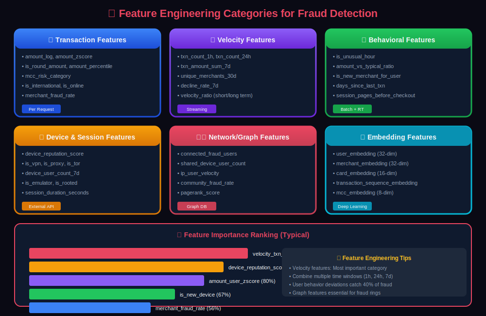
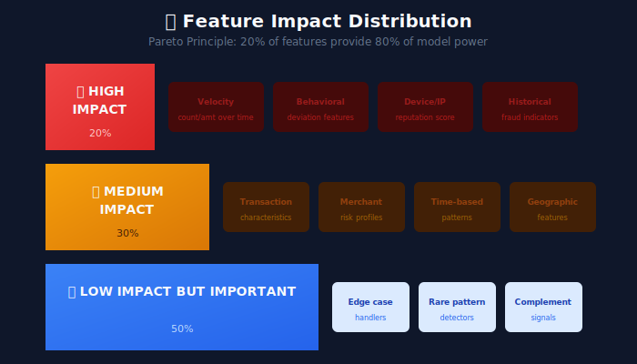
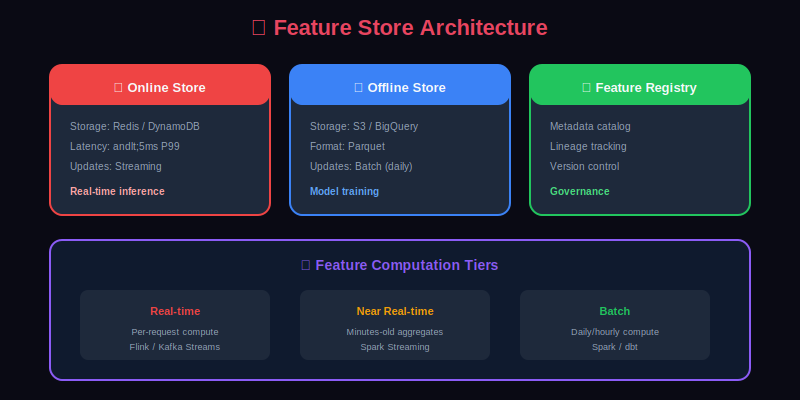

# 🔧 Feature Engineering for Fraud Detection

> Master the art of creating powerful features that distinguish fraudulent transactions from legitimate ones.

---

## 📊 Visual Overview

### Feature Categories


---

## 📖 Table of Contents

1. [Feature Engineering Philosophy](#feature-engineering-philosophy)

2. [Mathematical Foundation](#mathematical-foundation)

3. [Transaction-Level Features](#transaction-level-features)

4. [Velocity and Aggregation Features](#velocity-and-aggregation-features)

5. [Behavioral Features](#behavioral-features)

6. [Device and Session Features](#device-and-session-features)

7. [Network and Graph Features](#network-and-graph-features)

8. [Embedding Features](#embedding-features)

9. [Feature Selection](#feature-selection)

10. [Real-Time Feature Computation](#real-time-feature-computation)

11. [Feature Store Integration](#feature-store-integration)

---

## Feature Engineering Philosophy

### The 80/20 Rule in Fraud Detection



---

## Mathematical Foundation

### Feature Importance Theory

The goal of feature engineering is to create features $\mathbf{x}$ that maximize the **mutual information** with the fraud label $y$:

```math
I(y; \mathbf{x}) = H(y) - H(y | \mathbf{x})

```

Where entropy is:

```math
H(y) = -\sum_{c \in \{0,1\}} P(y=c) \log P(y=c)

```

### Statistical Anomaly Detection

#### Z-Score Normalization

For any feature $x$, the **z-score** measures deviations from expected behavior:

```math
z = \frac{x - \mu}{\sigma}

```

Where $\mu$ is the mean and $\sigma$ is the standard deviation of the reference distribution.

**For user-specific features:**

```math
z_{\text{user}} = \frac{x_{\text{current}} - \mu_{\text{user}}}{\sigma_{\text{user}}}

```

A transaction with $|z| > 3$ is considered anomalous (outside 99.7% of normal behavior).

#### Robust Z-Score (MAD-based)

For features with outliers, use **Median Absolute Deviation (MAD)**:

```math
z_{\text{MAD}} = \frac{x - \tilde{x}}{1.4826 \cdot \text{MAD}}

```

Where:

- $\tilde{x}$ is the median

- $\text{MAD} = \text{median}(|x\_i - \tilde{x}|)$

- $1.4826$ is a scaling factor for normal distributions

### Velocity Features: Sliding Window Aggregations

Velocity features capture transaction patterns over time windows. For a time window $[t - \Delta t, t]$:

```math
\text{count}_{\Delta t}(u) = \sum_{i: t_i \in [t-\Delta t, t]} \mathbb{1}[\text{user}_i = u]
\text{sum}_{\Delta t}(u) = \sum_{i: t_i \in [t-\Delta t, t]} v_i \cdot \mathbb{1}[\text{user}_i = u]

```

**Velocity ratio** (detecting acceleration):

```math
r_{\text{velocity}} = \frac{\text{count}_{1h}}{\text{count}_{24h} / 24 + \epsilon}

```

Values $r > 3$ suggest unusual short-term activity bursts.

### Information-Theoretic Feature Selection

#### Mutual Information

For discrete features, compute:

```math
I(X; Y) = \sum_{x \in \mathcal{X}} \sum_{y \in \mathcal{Y}} P(x, y) \log \frac{P(x, y)}{P(x)P(y)}

```

Features with high $I(X; Y)$ are most predictive of fraud.

#### Entropy of Categorical Features

The **Shannon entropy** of a categorical feature over a time window:

```math
H(X) = -\sum_{i=1}^{k} p_i \log_2 p_i

```

Where $p\_i$ is the proportion of category $i$.

**Example**: Merchant category entropy over 30 days. High entropy = diverse spending; Low entropy = concentrated behavior.

### Graph-Based Features

For transaction networks, define:

- **Nodes**: Users, merchants, devices, cards

- **Edges**: Transactions or shared attributes

#### PageRank for Risk Propagation

The PageRank score $\pi\_i$ for node $i$ satisfies:

```math
\pi_i = \frac{1 - d}{N} + d \sum_{j \in \text{in}(i)} \frac{\pi_j}{|\text{out}(j)|}

```

Where $d \approx 0.85$ is the damping factor. High PageRank for fraud nodes propagates risk through the network.

#### Community Detection

Use **Louvain modularity** to detect fraud rings:

```math
Q = \frac{1}{2m} \sum_{ij} \left[ A_{ij} - \frac{k_i k_j}{2m} \right] \delta(c_i, c_j)

```

Where $A\_{ij}$ is the adjacency matrix, $k\_i$ is node degree, and $\delta$ tests community membership.

### Feature Categories Overview

| Category | Examples | Update Frequency | Storage |
|----------|----------|------------------|---------|
| Static | Account age, verification status | Daily | Offline store |
| Semi-static | Customer risk score, address | Hourly | Warm cache |
| Dynamic | Last login time, recent transactions | Real-time | Hot cache |
| Computed | Velocity ratios, anomaly scores | Per-request | Computed |

---

## Transaction-Level Features

### Basic Transaction Features

```python
from dataclasses import dataclass
from decimal import Decimal
from typing import Optional
import numpy as np

@dataclass
class TransactionFeatures:
    """Features derived directly from transaction data"""

    # Amount features
    amount_log: float
    amount_cents: int  # Fractional part
    is_round_amount: bool  # Divisible by 100
    is_whole_dollar: bool
    amount_digit_sum: int

    # Merchant features
    mcc_risk_category: str
    merchant_fraud_rate: float
    merchant_avg_amount: float
    merchant_transaction_count: int
    is_new_merchant_for_user: bool

    # Payment method features
    is_credit: bool
    is_debit: bool
    is_prepaid: bool
    card_age_days: int
    is_new_card: bool

    # Channel features
    is_online: bool
    is_mobile: bool
    is_recurring: bool
    is_international: bool

    @classmethod
    def from_transaction(cls, txn: dict, enrichment: dict) -> 'TransactionFeatures':
        amount = Decimal(str(txn['amount']))

        return cls(
            amount_log=float(np.log1p(float(amount))),
            amount_cents=int(amount * 100) % 100,
            is_round_amount=float(amount) % 100 == 0,
            is_whole_dollar=float(amount) % 1 == 0,
            amount_digit_sum=sum(int(d) for d in str(int(amount))),

            mcc_risk_category=enrichment.get('mcc_risk', 'medium'),
            merchant_fraud_rate=enrichment.get('merchant_fraud_rate', 0.001),
            merchant_avg_amount=enrichment.get('merchant_avg_amount', 100.0),
            merchant_transaction_count=enrichment.get('merchant_txn_count', 1000),
            is_new_merchant_for_user=txn['merchant_id'] not in enrichment.get('user_merchants', []),

            is_credit=txn.get('card_type') == 'credit',
            is_debit=txn.get('card_type') == 'debit',
            is_prepaid=txn.get('card_type') == 'prepaid',
            card_age_days=enrichment.get('card_age_days', 0),
            is_new_card=enrichment.get('card_age_days', 0) < 30,

            is_online=txn.get('channel') == 'online',
            is_mobile=txn.get('channel') == 'mobile',
            is_recurring=txn.get('is_recurring', False),
            is_international=txn.get('country') != enrichment.get('home_country')
        )

```

### Amount Anomaly Features

```python
class AmountAnomalyFeatures:
    """Detect unusual amounts compared to user/merchant history"""

    def compute(self, amount: float, user_history: dict, merchant_history: dict) -> dict:

        # User-based anomalies
        user_mean = user_history.get('mean_amount', amount)
        user_std = user_history.get('std_amount', 1)
        user_max = user_history.get('max_amount', amount)
        user_median = user_history.get('median_amount', amount)

        # Merchant-based anomalies
        merchant_mean = merchant_history.get('mean_amount', amount)
        merchant_std = merchant_history.get('std_amount', 1)

        return {
            # Z-scores
            'amount_user_zscore': (amount - user_mean) / (user_std + 1e-6),
            'amount_merchant_zscore': (amount - merchant_mean) / (merchant_std + 1e-6),

            # Ratios
            'amount_to_user_max_ratio': amount / (user_max + 1e-6),
            'amount_to_user_mean_ratio': amount / (user_mean + 1e-6),
            'amount_to_user_median_ratio': amount / (user_median + 1e-6),

            # Percentiles
            'amount_user_percentile': self._compute_percentile(amount, user_history.get('amounts', [])),

            # Flags
            'is_highest_ever': amount > user_max,
            'is_above_3_sigma': abs(amount - user_mean) > 3 * user_std,
            'is_unusual_for_merchant': abs(amount - merchant_mean) > 2 * merchant_std
        }

    def _compute_percentile(self, value: float, history: list) -> float:
        if not history:
            return 0.5
        return sum(1 for x in history if x <= value) / len(history)

```

---

## Velocity and Aggregation Features

### Time Window Aggregations

```python
from datetime import datetime, timedelta
from typing import Dict, List
from collections import defaultdict

class VelocityFeatureComputer:
    """Compute velocity features across multiple time windows"""

    TIME_WINDOWS = {
        '1m': timedelta(minutes=1),
        '5m': timedelta(minutes=5),
        '1h': timedelta(hours=1),
        '24h': timedelta(hours=24),
        '7d': timedelta(days=7),
        '30d': timedelta(days=30)
    }

    def compute_velocity_features(self,
                                  user_id: str,
                                  current_time: datetime,
                                  transaction_history: List[dict]) -> Dict[str, float]:
        """Compute velocity features for all time windows"""

        features = {}

        for window_name, window_delta in self.TIME_WINDOWS.items():
            cutoff = current_time - window_delta

            # Filter transactions in window
            window_txns = [t for t in transaction_history if t['timestamp'] > cutoff]

            # Count features
            features[f'txn_count_{window_name}'] = len(window_txns)

            # Amount features
            amounts = [t['amount'] for t in window_txns]
            features[f'txn_amount_sum_{window_name}'] = sum(amounts) if amounts else 0
            features[f'txn_amount_avg_{window_name}'] = np.mean(amounts) if amounts else 0
            features[f'txn_amount_max_{window_name}'] = max(amounts) if amounts else 0
            features[f'txn_amount_std_{window_name}'] = np.std(amounts) if len(amounts) > 1 else 0

            # Unique counts
            features[f'unique_merchants_{window_name}'] = len(set(t['merchant_id'] for t in window_txns))
            features[f'unique_countries_{window_name}'] = len(set(t['country'] for t in window_txns))
            features[f'unique_devices_{window_name}'] = len(set(t.get('device_id') for t in window_txns if t.get('device_id')))

            # Decline/failure counts
            features[f'decline_count_{window_name}'] = sum(1 for t in window_txns if t.get('is_declined'))
            features[f'decline_rate_{window_name}'] = features[f'decline_count_{window_name}'] / max(len(window_txns), 1)

        return features

    def compute_velocity_ratios(self, velocity_features: dict) -> dict:
        """Compute ratios between time windows for trend detection"""

        ratios = {}

        # Short-term vs long-term ratios
        pairs = [('1h', '24h'), ('24h', '7d'), ('7d', '30d'), ('1m', '1h')]

        for short, long in pairs:
            for metric in ['txn_count', 'txn_amount_sum', 'unique_merchants']:
                short_val = velocity_features.get(f'{metric}_{short}', 0)
                long_val = velocity_features.get(f'{metric}_{long}', 0)

                # Normalized ratio (expected proportion of long window)
                expected_ratio = self.TIME_WINDOWS[short] / self.TIME_WINDOWS[long]
                actual_ratio = short_val / (long_val + 1e-6)

                ratios[f'{metric}_ratio_{short}_to_{long}'] = actual_ratio
                ratios[f'{metric}_anomaly_{short}_to_{long}'] = actual_ratio / (expected_ratio + 1e-6)

        return ratios

```

### Cross-Entity Velocity

```python
class CrossEntityVelocity:
    """Velocity features across different entities (cards, devices, IPs)"""

    def compute(self, entity_type: str, entity_id: str,
                current_txn: dict, history: List[dict]) -> dict:
        """
        entity_type: 'card', 'device', 'ip', 'email', 'phone'
        """

        # Filter history for this entity
        entity_history = [t for t in history if t.get(f'{entity_type}_id') == entity_id]

        current_time = current_txn['timestamp']

        features = {
            f'{entity_type}_total_txn_count': len(entity_history),
            f'{entity_type}_total_amount': sum(t['amount'] for t in entity_history),
            f'{entity_type}_unique_users': len(set(t['user_id'] for t in entity_history)),
            f'{entity_type}_unique_merchants': len(set(t['merchant_id'] for t in entity_history)),
        }

        # Time since first/last seen
        if entity_history:
            timestamps = [t['timestamp'] for t in entity_history]
            features[f'{entity_type}_age_hours'] = (current_time - min(timestamps)).total_seconds() / 3600
            features[f'{entity_type}_hours_since_last'] = (current_time - max(timestamps)).total_seconds() / 3600
        else:
            features[f'{entity_type}_is_first_time'] = 1.0
            features[f'{entity_type}_age_hours'] = 0
            features[f'{entity_type}_hours_since_last'] = float('inf')

        # Fraud history on entity
        fraud_count = sum(1 for t in entity_history if t.get('is_fraud'))
        features[f'{entity_type}_fraud_count'] = fraud_count
        features[f'{entity_type}_fraud_rate'] = fraud_count / max(len(entity_history), 1)

        return features

```

### Merchant-Level Aggregations

```sql
-- SQL for merchant-level features (batch computation)
CREATE TABLE merchant_features AS
SELECT
    merchant_id,
    merchant_category_code,

    -- Volume metrics
    COUNT(*) as total_transactions,
    SUM(amount) as total_amount,
    AVG(amount) as avg_amount,
    STDDEV(amount) as std_amount,
    PERCENTILE_CONT(0.5) WITHIN GROUP (ORDER BY amount) as median_amount,

    -- Fraud metrics
    SUM(CASE WHEN is_fraud THEN 1 ELSE 0 END) as fraud_count,
    SUM(CASE WHEN is_fraud THEN 1 ELSE 0 END)::float / COUNT(*) as fraud_rate,
    SUM(CASE WHEN is_fraud THEN amount ELSE 0 END) as fraud_amount,

    -- Customer metrics
    COUNT(DISTINCT user_id) as unique_customers,
    AVG(transactions_per_customer) as avg_customer_frequency,

    -- Time patterns
    MODE() WITHIN GROUP (ORDER BY EXTRACT(HOUR FROM timestamp)) as peak_hour,
    MODE() WITHIN GROUP (ORDER BY EXTRACT(DOW FROM timestamp)) as peak_day,

    -- Risk indicators
    COUNT(DISTINCT country) as unique_countries,
    SUM(CASE WHEN is_international THEN 1 ELSE 0 END)::float / COUNT(*) as international_rate,
    SUM(CASE WHEN is_declined THEN 1 ELSE 0 END)::float / COUNT(*) as decline_rate

FROM transactions
WHERE timestamp > CURRENT_DATE - INTERVAL '90 days'
GROUP BY merchant_id, merchant_category_code;

```

---

## Behavioral Features

### User Behavioral Profile

```python
class UserBehavioralProfile:
    """Model user's normal behavior for anomaly detection"""

    def compute_behavioral_features(self, current_txn: dict, user_profile: dict) -> dict:
        """Compare current transaction against user's behavioral profile"""

        features = {}

        # Time pattern deviation
        current_hour = current_txn['timestamp'].hour
        typical_hours = user_profile.get('typical_hours', list(range(9, 22)))
        features['is_unusual_hour'] = current_hour not in typical_hours
        features['hour_deviation'] = min(abs(current_hour - h) for h in typical_hours) if typical_hours else 0

        # Amount pattern deviation
        current_amount = current_txn['amount']
        typical_range = user_profile.get('typical_amount_range', (10, 500))
        features['is_above_typical_max'] = current_amount > typical_range[1]
        features['is_below_typical_min'] = current_amount < typical_range[0]
        features['amount_typical_ratio'] = current_amount / np.mean(typical_range)

        # Merchant pattern deviation
        current_mcc = current_txn['merchant_category_code']
        typical_mccs = user_profile.get('typical_mccs', [])
        features['is_new_mcc'] = current_mcc not in typical_mccs
        features['mcc_frequency_for_user'] = typical_mccs.count(current_mcc) / max(len(typical_mccs), 1)

        # Geographic pattern deviation
        current_country = current_txn['country']
        home_country = user_profile.get('home_country')
        visited_countries = user_profile.get('visited_countries', [])
        features['is_new_country'] = current_country not in visited_countries
        features['is_domestic'] = current_country == home_country

        # Device pattern deviation
        current_device = current_txn.get('device_id')
        known_devices = user_profile.get('known_devices', [])
        features['is_new_device'] = current_device not in known_devices
        features['known_device_count'] = len(known_devices)

        # Transaction frequency deviation
        hours_since_last = (current_txn['timestamp'] - user_profile.get('last_transaction_time', current_txn['timestamp'])).total_seconds() / 3600
        typical_gap = user_profile.get('typical_transaction_gap_hours', 24)
        features['gap_ratio'] = hours_since_last / (typical_gap + 1e-6)
        features['is_unusually_frequent'] = hours_since_last < typical_gap * 0.1
        features['is_unusually_infrequent'] = hours_since_last > typical_gap * 10

        return features

    def compute_session_anomaly(self, current_session: dict, user_profile: dict) -> dict:
        """Detect anomalies in session behavior"""

        features = {}

        # Login patterns
        typical_login_hours = user_profile.get('typical_login_hours', list(range(8, 23)))
        current_login_hour = current_session.get('login_hour', 12)
        features['is_unusual_login_time'] = current_login_hour not in typical_login_hours

        # Navigation patterns
        typical_pages_per_session = user_profile.get('avg_pages_per_session', 10)
        current_pages = current_session.get('pages_visited', 0)
        features['page_count_ratio'] = current_pages / (typical_pages_per_session + 1e-6)

        # Time on site patterns
        typical_session_duration = user_profile.get('avg_session_duration_seconds', 300)
        current_duration = current_session.get('duration_seconds', 0)
        features['duration_ratio'] = current_duration / (typical_session_duration + 1e-6)
        features['is_unusually_short_session'] = current_duration < typical_session_duration * 0.1

        return features

```

### Sequence-Based Features

```python
class TransactionSequenceFeatures:
    """Extract features from the sequence of transactions"""

    def compute(self, current_txn: dict, recent_txns: List[dict]) -> dict:
        """Analyze patterns in transaction sequence"""

        if not recent_txns:
            return self._default_sequence_features()

        features = {}

        # Time between transactions
        time_deltas = []
        for i in range(1, len(recent_txns)):
            delta = (recent_txns[i]['timestamp'] - recent_txns[i-1]['timestamp']).total_seconds()
            time_deltas.append(delta)

        if time_deltas:
            features['avg_time_between_txns'] = np.mean(time_deltas)
            features['std_time_between_txns'] = np.std(time_deltas)
            features['min_time_between_txns'] = min(time_deltas)
            features['is_accelerating'] = time_deltas[-1] < np.mean(time_deltas[:-1]) if len(time_deltas) > 1 else False

        # Amount progression
        amounts = [t['amount'] for t in recent_txns]
        features['amount_trend'] = self._compute_trend(amounts)
        features['is_amount_increasing'] = all(amounts[i] <= amounts[i+1] for i in range(len(amounts)-1))
        features['amount_volatility'] = np.std(amounts) / (np.mean(amounts) + 1e-6)

        # Geographic movement
        countries = [t['country'] for t in recent_txns]
        features['country_changes'] = sum(1 for i in range(1, len(countries)) if countries[i] != countries[i-1])
        features['impossible_travel'] = self._detect_impossible_travel(recent_txns)

        # Merchant diversity in sequence
        merchants = [t['merchant_id'] for t in recent_txns]
        features['merchant_entropy'] = self._compute_entropy(merchants)
        features['unique_merchant_ratio'] = len(set(merchants)) / len(merchants)

        # Pattern detection
        features['repeated_amount_count'] = self._count_repeated_values(amounts)
        features['repeated_merchant_count'] = self._count_repeated_values(merchants)

        return features

    def _detect_impossible_travel(self, txns: List[dict]) -> bool:
        """Detect if travel speed between transactions is impossible"""

        for i in range(1, len(txns)):
            distance_km = self._haversine_distance(
                txns[i-1].get('latitude'), txns[i-1].get('longitude'),
                txns[i].get('latitude'), txns[i].get('longitude')
            )
            time_hours = (txns[i]['timestamp'] - txns[i-1]['timestamp']).total_seconds() / 3600

            if time_hours > 0:
                speed_kmh = distance_km / time_hours
                if speed_kmh > 1000:  # Faster than commercial flight
                    return True
        return False

    def _compute_trend(self, values: List[float]) -> float:
        """Compute linear trend coefficient"""
        if len(values) < 2:
            return 0
        x = np.arange(len(values))
        slope, _ = np.polyfit(x, values, 1)
        return slope

    def _compute_entropy(self, values: List) -> float:
        """Compute Shannon entropy of values"""
        from collections import Counter
        counts = Counter(values)
        probs = [c / len(values) for c in counts.values()]
        return -sum(p * np.log2(p) for p in probs if p > 0)

```

---

## Device and Session Features

### Device Fingerprint Features

```python
class DeviceFeatures:
    """Extract features from device fingerprinting data"""

    def compute(self, device_data: dict, device_history: dict) -> dict:
        features = {}

        # Device reputation
        features['device_reputation_score'] = device_history.get('reputation_score', 0.5)
        features['device_fraud_count'] = device_history.get('fraud_count', 0)
        features['device_age_days'] = device_history.get('age_days', 0)
        features['device_user_count'] = device_history.get('unique_users', 1)

        # Device characteristics
        features['is_mobile'] = device_data.get('is_mobile', False)
        features['is_tablet'] = device_data.get('is_tablet', False)
        features['is_desktop'] = device_data.get('is_desktop', True)

        # Risk signals
        features['is_emulator'] = device_data.get('is_emulator', False)
        features['is_rooted'] = device_data.get('is_rooted', False)
        features['is_incognito'] = device_data.get('is_incognito', False)
        features['is_headless'] = device_data.get('is_headless', False)
        features['has_automation'] = device_data.get('has_automation', False)

        # Browser/app integrity
        features['has_webdriver'] = device_data.get('has_webdriver', False)
        features['language_mismatch'] = device_data.get('browser_language') != device_data.get('system_language')
        features['timezone_mismatch'] = device_data.get('browser_timezone') != device_data.get('ip_timezone')

        # Fingerprint stability
        features['fingerprint_changed'] = device_data.get('fingerprint') != device_history.get('last_fingerprint')
        features['fingerprint_change_count'] = device_history.get('fingerprint_changes', 0)

        return features

    def compute_device_risk_score(self, features: dict) -> float:
        """Compute overall device risk score"""

        risk_factors = {
            'is_emulator': 0.4,
            'is_rooted': 0.2,
            'is_incognito': 0.1,
            'is_headless': 0.5,
            'has_automation': 0.5,
            'has_webdriver': 0.3,
            'language_mismatch': 0.1,
            'timezone_mismatch': 0.15,
            'fingerprint_changed': 0.2
        }

        risk_score = sum(
            weight for factor, weight in risk_factors.items()
            if features.get(factor, False)
        )

        # Adjust for device reputation
        reputation = features.get('device_reputation_score', 0.5)
        risk_score = risk_score * (1.5 - reputation)

        return min(risk_score, 1.0)

```

### IP and Network Features

```python
class IPFeatures:
    """Extract features from IP address and network data"""

    def compute(self, ip_data: dict, ip_history: dict, user_profile: dict) -> dict:
        features = {}

        # IP reputation
        features['ip_risk_score'] = ip_data.get('risk_score', 0.5)
        features['ip_fraud_score'] = ip_data.get('fraud_score', 0)

        # IP type
        features['is_vpn'] = ip_data.get('is_vpn', False)
        features['is_proxy'] = ip_data.get('is_proxy', False)
        features['is_tor'] = ip_data.get('is_tor', False)
        features['is_datacenter'] = ip_data.get('is_datacenter', False)
        features['is_residential'] = ip_data.get('is_residential', True)
        features['is_mobile_carrier'] = ip_data.get('is_mobile_carrier', False)

        # Geographic features
        features['ip_country'] = ip_data.get('country_code', 'US')
        features['ip_matches_home_country'] = ip_data.get('country_code') == user_profile.get('home_country')
        features['ip_matches_billing_country'] = ip_data.get('country_code') == user_profile.get('billing_country')

        # Distance from expected location
        features['distance_from_home_km'] = self._compute_distance(
            ip_data.get('latitude'), ip_data.get('longitude'),
            user_profile.get('home_latitude'), user_profile.get('home_longitude')
        )

        # IP velocity
        features['ip_user_count_24h'] = ip_history.get('unique_users_24h', 1)
        features['ip_transaction_count_24h'] = ip_history.get('transactions_24h', 1)
        features['ip_is_shared'] = ip_history.get('unique_users_24h', 1) > 5

        # ISP features
        features['isp_risk_score'] = ip_data.get('isp_risk', 0.5)
        features['asn_fraud_rate'] = ip_history.get('asn_fraud_rate', 0.001)

        return features

```

---

## Network and Graph Features

### Transaction Graph Features

```python
import networkx as nx
from typing import Dict, Set, Tuple

class GraphFeatures:
    """Extract features from transaction network graphs"""

    def __init__(self):
        self.user_merchant_graph = nx.Graph()
        self.user_user_graph = nx.Graph()  # Users sharing devices/IPs

    def build_graphs(self, transactions: List[dict]):
        """Build graphs from transaction data"""

        # User-Merchant bipartite graph
        for txn in transactions:
            self.user_merchant_graph.add_edge(
                f"user_{txn['user_id']}",
                f"merchant_{txn['merchant_id']}",
                weight=txn['amount'],
                timestamp=txn['timestamp']
            )

        # User-User graph (shared entities)
        device_users = {}
        ip_users = {}

        for txn in transactions:
            device = txn.get('device_id')
            ip = txn.get('ip_address')
            user = txn['user_id']

            if device:
                if device not in device_users:
                    device_users[device] = set()
                device_users[device].add(user)

            if ip:
                if ip not in ip_users:
                    ip_users[ip] = set()
                ip_users[ip].add(user)

        # Create edges for users sharing devices/IPs
        for device, users in device_users.items():
            for u1 in users:
                for u2 in users:
                    if u1 < u2:
                        if self.user_user_graph.has_edge(u1, u2):
                            self.user_user_graph[u1][u2]['weight'] += 1
                        else:
                            self.user_user_graph.add_edge(u1, u2, weight=1, shared_devices=1)

    def compute_user_graph_features(self, user_id: str) -> dict:
        """Compute graph-based features for a user"""

        user_node = f"user_{user_id}"
        features = {}

        if user_node not in self.user_merchant_graph:
            return self._default_graph_features()

        # Centrality measures
        features['degree_centrality'] = nx.degree_centrality(self.user_merchant_graph).get(user_node, 0)
        features['pagerank'] = nx.pagerank(self.user_merchant_graph).get(user_node, 0)

        # Neighborhood features
        neighbors = list(self.user_merchant_graph.neighbors(user_node))
        features['merchant_count'] = len([n for n in neighbors if n.startswith('merchant_')])

        # Community detection
        communities = nx.community.louvain_communities(self.user_merchant_graph)
        user_community = next((c for c in communities if user_node in c), set())
        features['community_size'] = len(user_community)
        features['community_fraud_rate'] = self._compute_community_fraud_rate(user_community)

        # Shared entity features (from user-user graph)
        if user_id in self.user_user_graph:
            connected_users = list(self.user_user_graph.neighbors(user_id))
            features['connected_user_count'] = len(connected_users)
            features['connected_fraud_users'] = sum(1 for u in connected_users if self._is_fraud_user(u))
            features['max_sharing_weight'] = max(
                (self.user_user_graph[user_id][u]['weight'] for u in connected_users),
                default=0
            )
        else:
            features['connected_user_count'] = 0
            features['connected_fraud_users'] = 0
            features['max_sharing_weight'] = 0

        return features

```

### Fraud Ring Detection Features

```python
class FraudRingFeatures:
    """Features for detecting organized fraud rings"""

    def compute_ring_features(self, user_id: str, transaction_data: dict) -> dict:
        """Detect if user might be part of a fraud ring"""

        features = {}

        # Shared device analysis
        device_id = transaction_data.get('device_id')
        if device_id:
            other_users = self.get_users_on_device(device_id)
            features['device_shared_with_users'] = len(other_users) - 1
            features['device_fraud_user_count'] = sum(1 for u in other_users if self.is_fraud_user(u))

        # Shared IP analysis
        ip = transaction_data.get('ip_address')
        if ip:
            ip_users = self.get_users_on_ip(ip)
            features['ip_shared_with_users'] = len(ip_users) - 1

        # Shared beneficiary analysis
        beneficiaries = self.get_user_beneficiaries(user_id)
        for ben_id in beneficiaries:
            other_senders = self.get_beneficiary_senders(ben_id)
            if len(other_senders) > 5:
                features['beneficiary_many_senders'] = True
                break

        # Coordinated timing detection
        features['coordinated_timing_score'] = self._detect_coordinated_timing(
            user_id,
            transaction_data['timestamp']
        )

        # Similar amount pattern detection
        features['amount_pattern_match_score'] = self._detect_amount_patterns(
            user_id,
            transaction_data['amount']
        )

        return features

    def _detect_coordinated_timing(self, user_id: str, timestamp: datetime) -> float:
        """Detect if transaction timing is suspiciously coordinated with others"""

        # Find other transactions within 5-minute window
        window_start = timestamp - timedelta(minutes=5)
        window_end = timestamp + timedelta(minutes=5)

        nearby_txns = self.get_transactions_in_window(window_start, window_end)

        # Check for shared attributes
        shared_device_txns = [t for t in nearby_txns if t['device_id'] == self.get_user_device(user_id)]
        shared_ip_txns = [t for t in nearby_txns if t['ip_address'] == self.get_user_ip(user_id)]

        coordination_score = (len(shared_device_txns) + len(shared_ip_txns)) / max(len(nearby_txns), 1)

        return coordination_score

```

---

## Embedding Features

### Entity Embeddings

```python
import torch
import torch.nn as nn
from typing import Dict

class EntityEmbeddings(nn.Module):
    """Learn embeddings for entities (users, merchants, cards)"""

    def __init__(self, entity_counts: Dict[str, int], embedding_dim: int = 32):
        super().__init__()

        self.embeddings = nn.ModuleDict({
            entity_type: nn.Embedding(count, embedding_dim)
            for entity_type, count in entity_counts.items()
        })

    def forward(self, entity_type: str, entity_ids: torch.Tensor) -> torch.Tensor:
        return self.embeddings[entity_type](entity_ids)

class TransactionEmbeddingModel(nn.Module):
    """Model that learns transaction representations"""

    def __init__(self, config: dict):
        super().__init__()

        # Entity embeddings
        self.entity_embeddings = EntityEmbeddings(
            entity_counts={
                'user': config['num_users'],
                'merchant': config['num_merchants'],
                'card': config['num_cards'],
                'mcc': config['num_mccs']
            },
            embedding_dim=config['embedding_dim']
        )

        # Numerical feature encoder
        self.numerical_encoder = nn.Sequential(
            nn.Linear(config['num_numerical_features'], 64),
            nn.ReLU(),
            nn.Linear(64, 32)
        )

        # Combine all features
        combined_dim = config['embedding_dim'] * 4 + 32  # 4 embeddings + numerical
        self.combined_encoder = nn.Sequential(
            nn.Linear(combined_dim, 128),
            nn.ReLU(),
            nn.Dropout(0.3),
            nn.Linear(128, 64)
        )

    def forward(self, batch: dict) -> torch.Tensor:
        # Get entity embeddings
        user_emb = self.entity_embeddings('user', batch['user_id'])
        merchant_emb = self.entity_embeddings('merchant', batch['merchant_id'])
        card_emb = self.entity_embeddings('card', batch['card_id'])
        mcc_emb = self.entity_embeddings('mcc', batch['mcc'])

        # Encode numerical features
        numerical_emb = self.numerical_encoder(batch['numerical_features'])

        # Combine all
        combined = torch.cat([user_emb, merchant_emb, card_emb, mcc_emb, numerical_emb], dim=1)

        return self.combined_encoder(combined)

```

### Sequence Embeddings with Transformers

```python
class TransactionSequenceEncoder(nn.Module):
    """Transformer-based encoder for transaction sequences"""

    def __init__(self, config: dict):
        super().__init__()

        self.transaction_encoder = TransactionEmbeddingModel(config)

        # Positional encoding
        self.position_encoding = nn.Embedding(config['max_seq_length'], config['hidden_dim'])

        # Transformer encoder
        encoder_layer = nn.TransformerEncoderLayer(
            d_model=config['hidden_dim'],
            nhead=config['num_heads'],
            dim_feedforward=config['ff_dim'],
            dropout=config['dropout']
        )
        self.transformer = nn.TransformerEncoder(encoder_layer, num_layers=config['num_layers'])

        # Output projection
        self.output_projection = nn.Linear(config['hidden_dim'], config['output_dim'])

    def forward(self, transaction_sequence: List[dict], attention_mask: torch.Tensor) -> torch.Tensor:
        # Encode each transaction
        seq_len = len(transaction_sequence)
        transaction_embeddings = torch.stack([
            self.transaction_encoder(txn) for txn in transaction_sequence
        ])

        # Add positional encoding
        positions = torch.arange(seq_len)
        transaction_embeddings = transaction_embeddings + self.position_encoding(positions)

        # Apply transformer
        # Shape: (seq_len, batch_size, hidden_dim)
        transformer_output = self.transformer(
            transaction_embeddings,
            src_key_padding_mask=~attention_mask
        )

        # Use last position as sequence representation
        sequence_repr = transformer_output[-1]

        return self.output_projection(sequence_repr)

```

---

## Feature Selection

### Feature Importance Analysis

```python
from sklearn.ensemble import RandomForestClassifier
import shap
import numpy as np
import pandas as pd

class FeatureSelector:
    """Select most important features for fraud detection"""

    def __init__(self):
        self.importance_scores = {}

    def compute_importance(self, X: pd.DataFrame, y: pd.Series, method: str = 'all') -> dict:
        """Compute feature importance using multiple methods"""

        results = {}

        if method in ['all', 'random_forest']:
            results['random_forest'] = self._rf_importance(X, y)

        if method in ['all', 'shap']:
            results['shap'] = self._shap_importance(X, y)

        if method in ['all', 'permutation']:
            results['permutation'] = self._permutation_importance(X, y)

        if method in ['all', 'correlation']:
            results['correlation'] = self._correlation_importance(X, y)

        # Combine scores
        if method == 'all':
            results['combined'] = self._combine_importance_scores(results)

        return results

    def _rf_importance(self, X: pd.DataFrame, y: pd.Series) -> dict:
        """Random Forest feature importance"""

        rf = RandomForestClassifier(n_estimators=100, random_state=42)
        rf.fit(X, y)

        return dict(zip(X.columns, rf.feature_importances_))

    def _shap_importance(self, X: pd.DataFrame, y: pd.Series) -> dict:
        """SHAP-based feature importance"""

        # Train a model
        import xgboost as xgb
        model = xgb.XGBClassifier(n_estimators=100, random_state=42)
        model.fit(X, y)

        # Compute SHAP values
        explainer = shap.TreeExplainer(model)
        shap_values = explainer.shap_values(X)

        # Mean absolute SHAP value
        importance = np.abs(shap_values).mean(axis=0)

        return dict(zip(X.columns, importance))

    def select_features(self, importance_scores: dict, method: str = 'top_k', k: int = 50) -> List[str]:
        """Select features based on importance scores"""

        sorted_features = sorted(importance_scores.items(), key=lambda x: x[1], reverse=True)

        if method == 'top_k':
            return [f[0] for f in sorted_features[:k]]

        elif method == 'cumulative_importance':
            # Select features that contribute to X% of importance
            total = sum(importance_scores.values())
            cumsum = 0
            selected = []
            for feature, score in sorted_features:
                selected.append(feature)
                cumsum += score
                if cumsum / total > 0.95:
                    break
            return selected

        elif method == 'threshold':
            threshold = np.mean(list(importance_scores.values()))
            return [f for f, s in sorted_features if s > threshold]

```

### Feature Correlation Analysis

```python
class FeatureCorrelationAnalyzer:
    """Analyze and remove correlated features"""

    def find_correlated_features(self, X: pd.DataFrame, threshold: float = 0.95) -> List[Tuple[str, str]]:
        """Find pairs of highly correlated features"""

        corr_matrix = X.corr().abs()

        # Get upper triangle
        upper = corr_matrix.where(
            np.triu(np.ones(corr_matrix.shape), k=1).astype(bool)
        )

        # Find pairs above threshold
        correlated_pairs = []
        for col in upper.columns:
            correlated = upper.index[upper[col] > threshold].tolist()
            for corr_col in correlated:
                correlated_pairs.append((col, corr_col, upper.loc[corr_col, col]))

        return correlated_pairs

    def remove_correlated(self, X: pd.DataFrame, importance_scores: dict, threshold: float = 0.95) -> pd.DataFrame:
        """Remove less important features from correlated pairs"""

        correlated_pairs = self.find_correlated_features(X, threshold)

        to_remove = set()
        for feat1, feat2, corr in correlated_pairs:
            # Keep the more important feature
            if importance_scores.get(feat1, 0) < importance_scores.get(feat2, 0):
                to_remove.add(feat1)
            else:
                to_remove.add(feat2)

        return X.drop(columns=list(to_remove))

```

---

## Real-Time Feature Computation

### Feature Computation Service

```python
import asyncio
from typing import Dict, Any
import redis.asyncio as redis

class RealTimeFeatureService:
    """Compute features in real-time for fraud scoring"""

    def __init__(self, redis_client: redis.Redis, feature_store_client):
        self.redis = redis_client
        self.feature_store = feature_store_client
        self.feature_computers = {}

    async def compute_features(self, transaction: dict) -> Dict[str, Any]:
        """Compute all features for a transaction in real-time"""

        # Parallel feature computation
        tasks = [
            self._compute_transaction_features(transaction),
            self._compute_velocity_features(transaction),
            self._compute_behavioral_features(transaction),
            self._compute_device_features(transaction),
            self._get_precomputed_features(transaction),
        ]

        results = await asyncio.gather(*tasks, return_exceptions=True)

        # Combine all features
        all_features = {}
        for result in results:
            if isinstance(result, dict):
                all_features.update(result)
            elif isinstance(result, Exception):
                # Log error and continue with partial features
                self.log_error(result)

        return all_features

    async def _compute_velocity_features(self, transaction: dict) -> dict:
        """Compute velocity features using Redis counters"""

        user_id = transaction['user_id']
        current_time = transaction['timestamp']

        # Use Redis sorted sets for time-windowed aggregations
        pipe = self.redis.pipeline()

        # Get counts for different time windows
        windows = {'1m': 60, '1h': 3600, '24h': 86400}

        for window_name, seconds in windows.items():
            cutoff = current_time - seconds
            pipe.zcount(f"user:{user_id}:txns", cutoff, current_time)
            pipe.zrangebyscore(f"user:{user_id}:amounts", cutoff, current_time)

        results = await pipe.execute()

        features = {}
        for i, (window_name, _) in enumerate(windows.items()):
            features[f'txn_count_{window_name}'] = results[i * 2]
            amounts = [float(a) for a in results[i * 2 + 1]]
            features[f'txn_amount_{window_name}'] = sum(amounts)

        return features

    async def _get_precomputed_features(self, transaction: dict) -> dict:
        """Get precomputed features from feature store"""

        feature_refs = [
            ('user_features', transaction['user_id']),
            ('merchant_features', transaction['merchant_id']),
            ('card_features', transaction.get('card_id')),
            ('device_features', transaction.get('device_id')),
        ]

        features = {}
        for feature_group, entity_id in feature_refs:
            if entity_id:
                group_features = await self.feature_store.get_features(
                    feature_group, entity_id
                )
                features.update(group_features)

        return features

```

### Low-Latency Optimization

```python
class OptimizedFeatureComputer:
    """Optimized feature computation for low latency"""

    def __init__(self):
        # Pre-compiled feature transformations
        self.transformers = self._compile_transformers()

        # Feature caching
        self.cache = {}
        self.cache_ttl = 300  # 5 minutes

    def _compile_transformers(self):
        """Pre-compile feature transformations for speed"""

        import numba

        @numba.jit(nopython=True)
        def compute_amount_features(amount, historical_mean, historical_std):
            log_amount = np.log1p(amount)
            zscore = (amount - historical_mean) / (historical_std + 1e-6)
            return log_amount, zscore

        @numba.jit(nopython=True)
        def compute_time_features(hour, day_of_week):
            hour_sin = np.sin(2 * np.pi * hour / 24)
            hour_cos = np.cos(2 * np.pi * hour / 24)
            dow_sin = np.sin(2 * np.pi * day_of_week / 7)
            dow_cos = np.cos(2 * np.pi * day_of_week / 7)
            return hour_sin, hour_cos, dow_sin, dow_cos

        return {
            'amount': compute_amount_features,
            'time': compute_time_features
        }

    def compute_with_cache(self, transaction: dict) -> dict:
        """Compute features with caching for repeated entities"""

        # Check cache for static features
        user_cache_key = f"user:{transaction['user_id']}"
        if user_cache_key in self.cache:
            user_features = self.cache[user_cache_key]
        else:
            user_features = self._compute_user_features(transaction['user_id'])
            self.cache[user_cache_key] = user_features

        # Compute dynamic features (always fresh)
        dynamic_features = self._compute_dynamic_features(transaction)

        return {**user_features, **dynamic_features}

```

---

## Feature Store Integration

### Feature Store Architecture



### Feast Integration Example

```python
from feast import FeatureStore, Entity, Feature, FeatureView, ValueType
from feast.data_source import BigQuerySource

# Initialize feature store
store = FeatureStore(repo_path="feature_repo/")

# Define entities
user = Entity(
    name="user",
    value_type=ValueType.STRING,
    description="Customer ID"
)

merchant = Entity(
    name="merchant",
    value_type=ValueType.STRING,
    description="Merchant ID"
)

# Define feature views
user_transaction_features = FeatureView(
    name="user_transaction_features",
    entities=["user"],
    ttl=timedelta(days=1),
    features=[
        Feature(name="txn_count_24h", dtype=ValueType.INT64),
        Feature(name="txn_amount_24h", dtype=ValueType.DOUBLE),
        Feature(name="avg_amount_30d", dtype=ValueType.DOUBLE),
        Feature(name="unique_merchants_7d", dtype=ValueType.INT64),
        Feature(name="decline_rate_7d", dtype=ValueType.DOUBLE),
    ],
    online=True,
    source=BigQuerySource(
        table_ref="project.dataset.user_features",
        event_timestamp_column="feature_timestamp"
    )
)

# Retrieve features for scoring
def get_features_for_scoring(user_id: str, merchant_id: str) -> dict:
    """Get features from feature store for real-time scoring"""

    feature_vector = store.get_online_features(
        features=[
            "user_transaction_features:txn_count_24h",
            "user_transaction_features:txn_amount_24h",
            "user_transaction_features:avg_amount_30d",
            "merchant_features:fraud_rate",
            "merchant_features:avg_amount",
        ],
        entity_rows=[
            {"user": user_id, "merchant": merchant_id}
        ]
    )

    return feature_vector.to_dict()

```

---

## Summary

Effective feature engineering for fraud detection requires:

1. **Multi-level features**: Transaction, velocity, behavioral, device, and network

2. **Time-aware aggregations**: Multiple time windows for pattern detection

3. **Behavioral baselines**: Compare against user's normal behavior

4. **Graph features**: Detect fraud rings and connected entities

5. **Real-time computation**: Low-latency feature serving for production

---

## Next Steps

Continue to [Chapter 4: Model Architecture →](../04_model_architecture/)

---

## Code Examples

See the `code/` directory for:

- `feature_extractors.py` - Complete feature extraction classes

- `velocity_features.py` - Time-windowed aggregation utilities

- `graph_features.py` - Network feature computation

- `feature_store_integration.py` - Feature store examples

---

<div align="center">

**[⬆ Back to Top](#)** | **[📚 Main Repository](https://github.com/Gaurav14cs17/ml_system_design)**

Made with 💜 by [Gaurav14cs17](https://github.com/Gaurav14cs17)

</div>
