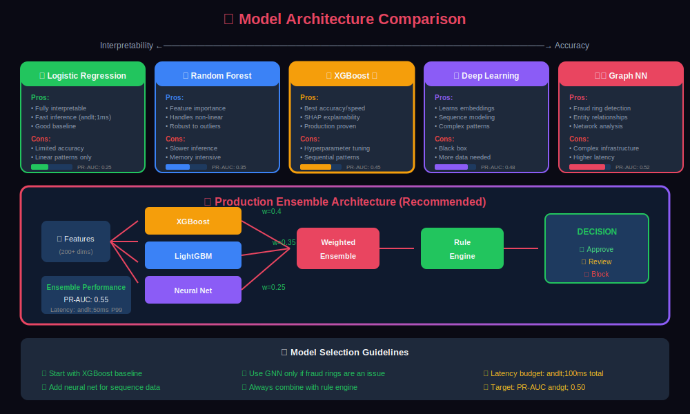
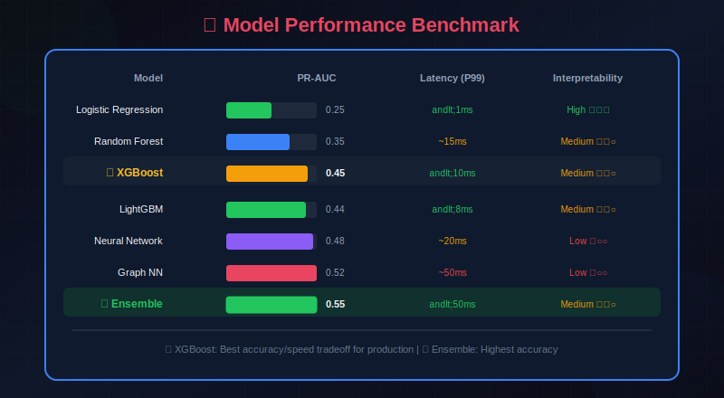

# 🧠 Model Architecture for Fraud Detection

> Exploring ML model architectures from gradient boosting to deep learning and graph neural networks for fraud detection.

---

## 📊 Visual Overview

### Model Comparison


---

## 📖 Table of Contents

1. [Model Selection Philosophy](#model-selection-philosophy)
2. [Mathematical Foundations](#mathematical-foundations)
3. [Traditional ML Models](#traditional-ml-models)
4. [Gradient Boosting Models](#gradient-boosting-models)
5. [Deep Learning Models](#deep-learning-models)
6. [Sequence Models](#sequence-models)
7. [Graph Neural Networks](#graph-neural-networks)
8. [Anomaly Detection Models](#anomaly-detection-models)
9. [Ensemble Methods](#ensemble-methods)
10. [Model Comparison](#model-comparison)
11. [Production Considerations](#production-considerations)

---

## Model Selection Philosophy

### The Fraud Detection Model Landscape


---

## Mathematical Foundations

### Binary Classification Objective

For fraud detection, we learn a function $f: \mathcal{X} \rightarrow [0, 1]$ that estimates:

```math
\hat{y} = f(\mathbf{x}; \theta) \approx P(y = 1 | \mathbf{x})
```

### Loss Functions for Imbalanced Classification

#### Binary Cross-Entropy (Baseline)

```math
\mathcal{L}_{\text{BCE}} = -\frac{1}{N} \sum_{i=1}^{N} \left[ y_i \log(\hat{y}_i) + (1 - y_i) \log(1 - \hat{y}_i) \right]
```

**Problem**: Treats all samples equally, causing the model to optimize for the majority class.

#### Weighted Cross-Entropy

```math
\mathcal{L}_{\text{WCE}} = -\frac{1}{N} \sum_{i=1}^{N} \left[ w_+ \cdot y_i \log(\hat{y}_i) + w_- \cdot (1 - y_i) \log(1 - \hat{y}_i) \right]
```

Where $w\_+ = \frac{N}{2 \cdot N\_+}$ and $w\_- = \frac{N}{2 \cdot N\_-}$ balance the classes.

#### Focal Loss (Lin et al., 2017)

Focal loss down-weights easy examples, focusing training on hard negatives:

```math
\mathcal{L}_{\text{focal}} = -\frac{1}{N} \sum_{i=1}^{N} \alpha_t (1 - p_t)^\gamma \log(p_t)
```

Where:
- $p\_t = \hat{y}\_i$ if $y\_i = 1$, else $1 - \hat{y}\_i$
- $\gamma \geq 0$ is the focusing parameter (typically $\gamma = 2$)
- $\alpha\_t$ is the class-balancing weight

**Intuition**: When $\gamma > 0$, well-classified examples ($p\_t \rightarrow 1$) contribute negligibly to the loss.

#### Asymmetric Loss

For fraud detection where $C\_{FN} \gg C\_{FP}$:

```math
\mathcal{L}_{\text{asym}} = -\frac{1}{N} \sum_{i=1}^{N} \left[ \lambda \cdot y_i \log(\hat{y}_i) + (1 - y_i) \log(1 - \hat{y}_i) \right]
```

Where $\lambda = \frac{C\_{FN}}{C\_{FP}} \approx 10-100$ penalizes missed fraud heavily.

### Gradient Boosting Mathematics

#### XGBoost Objective

XGBoost minimizes:

```math
\mathcal{L}^{(t)} = \sum_{i=1}^{N} l(y_i, \hat{y}_i^{(t-1)} + f_t(\mathbf{x}_i)) + \Omega(f_t)
```

Where $\Omega(f) = \gamma T + \frac{1}{2}\lambda \sum\_{j=1}^{T} w\_j^2$ is the regularization term (T = number of leaves, $w\_j$ = leaf weights).

Using second-order Taylor expansion:

```math
\mathcal{L}^{(t)} \approx \sum_{i=1}^{N} \left[ g_i f_t(\mathbf{x}_i) + \frac{1}{2} h_i f_t^2(\mathbf{x}_i) \right] + \Omega(f_t)
```

Where $g\_i = \partial\_{\hat{y}} l(y\_i, \hat{y}^{(t-1)})$ and $h\_i = \partial^2\_{\hat{y}} l(y\_i, \hat{y}^{(t-1)})$.

For weighted binary cross-entropy with `scale_pos_weight`:

```math
g_i = \hat{y}_i - y_i \cdot w_+, \quad h_i = \hat{y}_i(1 - \hat{y}_i)
```

### Deep Learning: Neural Network Formulation

#### Feedforward Network

```math
\hat{y} = \sigma\left( \mathbf{W}^{(L)} \cdot \text{ReLU}\left( \mathbf{W}^{(L-1)} \cdots \text{ReLU}\left( \mathbf{W}^{(1)} \mathbf{x} + \mathbf{b}^{(1)} \right) \cdots \right) + \mathbf{b}^{(L)} \right)
```

With dropout regularization: $\tilde{\mathbf{h}} = \mathbf{h} \odot \mathbf{m}$ where $m\_i \sim \text{Bernoulli}(1-p)$.

#### Entity Embeddings

For categorical features (user, merchant, MCC), learn low-dimensional representations:

```math
\mathbf{e}_{\text{entity}} = \mathbf{E}[\text{entity\_id}] \in \mathbb{R}^d
```

Where $\mathbf{E} \in \mathbb{R}^{|\mathcal{V}| \times d}$ is the learned embedding matrix.

### Sequence Models: LSTM and Transformers

#### LSTM Cell Equations

```math
\begin{align}
\mathbf{f}_t &= \sigma(\mathbf{W}_f \cdot [\mathbf{h}_{t-1}, \mathbf{x}_t] + \mathbf{b}_f) & \text{(forget gate)} \\
\mathbf{i}_t &= \sigma(\mathbf{W}_i \cdot [\mathbf{h}_{t-1}, \mathbf{x}_t] + \mathbf{b}_i) & \text{(input gate)} \\
\tilde{\mathbf{c}}_t &= \tanh(\mathbf{W}_c \cdot [\mathbf{h}_{t-1}, \mathbf{x}_t] + \mathbf{b}_c) & \text{(candidate)} \\
\mathbf{c}_t &= \mathbf{f}_t \odot \mathbf{c}_{t-1} + \mathbf{i}_t \odot \tilde{\mathbf{c}}_t & \text{(cell state)} \\
\mathbf{o}_t &= \sigma(\mathbf{W}_o \cdot [\mathbf{h}_{t-1}, \mathbf{x}_t] + \mathbf{b}_o) & \text{(output gate)} \\
\mathbf{h}_t &= \mathbf{o}_t \odot \tanh(\mathbf{c}_t) & \text{(hidden state)}
\end{align}
```

#### Transformer Self-Attention

```math
\text{Attention}(Q, K, V) = \text{softmax}\left( \frac{QK^T}{\sqrt{d_k}} \right) V
```

For transaction sequences, this captures dependencies between any pair of transactions regardless of temporal distance.

### Graph Neural Networks

#### Message Passing Framework

For node $v$ with neighbors $\mathcal{N}(v)$:

```math
\mathbf{h}_v^{(k+1)} = \phi\left( \mathbf{h}_v^{(k)}, \bigoplus_{u \in \mathcal{N}(v)} \psi(\mathbf{h}_u^{(k)}, \mathbf{h}_v^{(k)}, \mathbf{e}_{uv}) \right)
```

Where $\bigoplus$ is a permutation-invariant aggregation (sum, mean, max).

#### Graph Attention Networks (GAT)

Attention coefficients between nodes:

```math
\alpha_{ij} = \frac{\exp\left( \text{LeakyReLU}(\mathbf{a}^T [\mathbf{W}\mathbf{h}_i \| \mathbf{W}\mathbf{h}_j]) \right)}{\sum_{k \in \mathcal{N}(i)} \exp\left( \text{LeakyReLU}(\mathbf{a}^T [\mathbf{W}\mathbf{h}_i \| \mathbf{W}\mathbf{h}_k]) \right)}
```

Updated node embedding: $\mathbf{h}\_i' = \sigma\left( \sum\_{j \in \mathcal{N}(i)} \alpha\_{ij} \mathbf{W} \mathbf{h}\_j \right)$

### Anomaly Detection: Autoencoder Mathematics

#### Reconstruction Error

```math
\mathcal{L}_{\text{AE}} = \| \mathbf{x} - \text{Dec}(\text{Enc}(\mathbf{x})) \|_2^2
```

Transactions with high reconstruction error are anomalous.

#### Variational Autoencoder (VAE)

```math
\mathcal{L}_{\text{VAE}} = \mathbb{E}_{q_\phi(\mathbf{z}|\mathbf{x})}[\log p_\theta(\mathbf{x}|\mathbf{z})] - D_{KL}(q_\phi(\mathbf{z}|\mathbf{x}) \| p(\mathbf{z}))
```

The KL divergence term regularizes the latent space:

```math
D_{KL} = -\frac{1}{2} \sum_{j=1}^{J} \left( 1 + \log(\sigma_j^2) - \mu_j^2 - \sigma_j^2 \right)
```

### Ensemble Theory

For $M$ models with predictions $\hat{y}\_1, \ldots, \hat{y}\_M$:

**Weighted Average:**
```math
\hat{y}_{\text{ens}} = \sum_{m=1}^{M} w_m \hat{y}_m, \quad \sum_{m=1}^{M} w_m = 1
```

**Optimal Weights** (minimize ensemble variance):
```math
w_m^* \propto \frac{1}{\sigma_m^2 (1 - \rho_m)}
```

Where $\sigma\_m^2$ is model variance and $\rho\_m$ is correlation with other models. Diverse, accurate models get higher weight.

### When to Use Which Model

| Scenario | Recommended Model | Reason |
|----------|-------------------|--------|
| Baseline/MVP | Logistic Regression | Fast, interpretable, good baseline |
| Production standard | XGBoost/LightGBM | Best accuracy-speed tradeoff |
| Complex patterns | Deep Learning | Learns hierarchical patterns |
| Sequential data | LSTM/Transformer | Captures temporal dependencies |
| Network fraud | Graph NN | Models entity relationships |
| Cold start/new patterns | Anomaly Detection | No labeled data needed |

---

## Traditional ML Models

### Logistic Regression

```python
from sklearn.linear_model import LogisticRegression
from sklearn.preprocessing import StandardScaler
from sklearn.pipeline import Pipeline
import numpy as np

class FraudLogisticRegression:
    """Logistic Regression baseline for fraud detection"""

    def __init__(self, class_weight='balanced', C=1.0):
        self.pipeline = Pipeline([
            ('scaler', StandardScaler()),
            ('classifier', LogisticRegression(
                class_weight=class_weight,
                C=C,
                max_iter=1000,
                solver='lbfgs',
                random_state=42
            ))
        ])

    def fit(self, X, y):
        self.pipeline.fit(X, y)
        return self

    def predict_proba(self, X):
        return self.pipeline.predict_proba(X)[:, 1]

    def get_feature_importance(self, feature_names):
        """Get feature coefficients for interpretability"""
        coefs = self.pipeline.named_steps['classifier'].coef_[0]
        importance = dict(zip(feature_names, np.abs(coefs)))
        return dict(sorted(importance.items(), key=lambda x: x[1], reverse=True))

    def explain_prediction(self, X, feature_names):
        """Explain individual prediction"""
        scaled_X = self.pipeline.named_steps['scaler'].transform(X)
        coefs = self.pipeline.named_steps['classifier'].coef_[0]

        contributions = scaled_X[0] * coefs

        return dict(sorted(
            zip(feature_names, contributions),
            key=lambda x: abs(x[1]),
            reverse=True
        ))
```

### Random Forest

```python
from sklearn.ensemble import RandomForestClassifier
from sklearn.calibration import CalibratedClassifierCV

class FraudRandomForest:
    """Random Forest with probability calibration"""

    def __init__(self, n_estimators=100, max_depth=15):
        self.base_model = RandomForestClassifier(
            n_estimators=n_estimators,
            max_depth=max_depth,
            class_weight='balanced',
            min_samples_leaf=10,
            n_jobs=-1,
            random_state=42
        )
        self.model = None

    def fit(self, X, y, calibrate=True):
        if calibrate:
            # Isotonic calibration for better probability estimates
            self.model = CalibratedClassifierCV(
                self.base_model,
                method='isotonic',
                cv=5
            )
        else:
            self.model = self.base_model

        self.model.fit(X, y)
        return self

    def predict_proba(self, X):
        return self.model.predict_proba(X)[:, 1]

    def get_feature_importance(self, feature_names):
        if hasattr(self.model, 'estimators_'):
            # CalibratedClassifier
            importances = np.mean([
                est.feature_importances_
                for cal_est in self.model.estimators_
                for est in [cal_est.estimator]
            ], axis=0)
        else:
            importances = self.model.feature_importances_

        return dict(zip(feature_names, importances))
```

---

## Gradient Boosting Models

### XGBoost Implementation

```python
import xgboost as xgb
from sklearn.model_selection import StratifiedKFold
import numpy as np

class FraudXGBoost:
    """XGBoost model optimized for fraud detection"""

    def __init__(self):
        self.model = None
        self.best_params = None

    def get_default_params(self, scale_pos_weight=1.0):
        """Default hyperparameters for fraud detection"""
        return {
            'objective': 'binary:logistic',
            'eval_metric': 'aucpr',  # Area under PR curve (better for imbalanced)
            'scale_pos_weight': scale_pos_weight,
            'max_depth': 6,
            'min_child_weight': 10,
            'learning_rate': 0.1,
            'subsample': 0.8,
            'colsample_bytree': 0.8,
            'reg_alpha': 0.1,
            'reg_lambda': 1.0,
            'tree_method': 'hist',  # Faster training
            'random_state': 42
        }

    def fit(self, X, y, eval_set=None, early_stopping_rounds=50):
        """Train XGBoost model"""

        # Calculate class imbalance ratio
        scale_pos_weight = (y == 0).sum() / (y == 1).sum()

        params = self.get_default_params(scale_pos_weight)

        dtrain = xgb.DMatrix(X, label=y)

        if eval_set:
            deval = xgb.DMatrix(eval_set[0], label=eval_set[1])
            evals = [(dtrain, 'train'), (deval, 'eval')]
        else:
            evals = [(dtrain, 'train')]

        self.model = xgb.train(
            params,
            dtrain,
            num_boost_round=1000,
            evals=evals,
            early_stopping_rounds=early_stopping_rounds,
            verbose_eval=100
        )

        return self

    def predict_proba(self, X):
        dtest = xgb.DMatrix(X)
        return self.model.predict(dtest)

    def get_feature_importance(self, importance_type='gain'):
        """Get feature importance scores"""
        importance = self.model.get_score(importance_type=importance_type)
        return dict(sorted(importance.items(), key=lambda x: x[1], reverse=True))

    def cross_validate(self, X, y, n_folds=5):
        """Cross-validation with stratified folds"""

        scale_pos_weight = (y == 0).sum() / (y == 1).sum()
        params = self.get_default_params(scale_pos_weight)

        dtrain = xgb.DMatrix(X, label=y)

        cv_results = xgb.cv(
            params,
            dtrain,
            num_boost_round=1000,
            nfold=n_folds,
            stratified=True,
            metrics=['aucpr', 'auc'],
            early_stopping_rounds=50,
            verbose_eval=50
        )

        return cv_results
```

### LightGBM Implementation

```python
import lightgbm as lgb

class FraudLightGBM:
    """LightGBM model optimized for fraud detection"""

    def __init__(self):
        self.model = None

    def get_default_params(self):
        return {
            'objective': 'binary',
            'metric': ['auc', 'average_precision'],
            'is_unbalance': True,
            'max_depth': 8,
            'num_leaves': 64,
            'learning_rate': 0.05,
            'feature_fraction': 0.8,
            'bagging_fraction': 0.8,
            'bagging_freq': 5,
            'min_child_samples': 20,
            'lambda_l1': 0.1,
            'lambda_l2': 1.0,
            'verbose': -1,
            'random_state': 42,
            'n_jobs': -1
        }

    def fit(self, X, y, eval_set=None, categorical_features=None):
        """Train LightGBM model"""

        params = self.get_default_params()

        train_data = lgb.Dataset(
            X, label=y,
            categorical_feature=categorical_features
        )

        callbacks = [
            lgb.early_stopping(50),
            lgb.log_evaluation(100)
        ]

        valid_sets = [train_data]
        valid_names = ['train']

        if eval_set:
            valid_data = lgb.Dataset(eval_set[0], label=eval_set[1])
            valid_sets.append(valid_data)
            valid_names.append('valid')

        self.model = lgb.train(
            params,
            train_data,
            num_boost_round=1000,
            valid_sets=valid_sets,
            valid_names=valid_names,
            callbacks=callbacks
        )

        return self

    def predict_proba(self, X):
        return self.model.predict(X, num_iteration=self.model.best_iteration)

    def get_feature_importance(self, importance_type='gain'):
        return dict(zip(
            self.model.feature_name(),
            self.model.feature_importance(importance_type=importance_type)
        ))
```

### CatBoost for Categorical Features

```python
from catboost import CatBoostClassifier, Pool

class FraudCatBoost:
    """CatBoost model with native categorical feature handling"""

    def __init__(self):
        self.model = None

    def fit(self, X, y, cat_features=None, eval_set=None):
        """Train CatBoost model"""

        self.model = CatBoostClassifier(
            iterations=1000,
            learning_rate=0.05,
            depth=8,
            l2_leaf_reg=3,
            auto_class_weights='Balanced',
            cat_features=cat_features,
            early_stopping_rounds=50,
            verbose=100,
            random_state=42,
            task_type='GPU' if self._gpu_available() else 'CPU'
        )

        train_pool = Pool(X, y, cat_features=cat_features)

        eval_pool = None
        if eval_set:
            eval_pool = Pool(eval_set[0], eval_set[1], cat_features=cat_features)

        self.model.fit(
            train_pool,
            eval_set=eval_pool,
            use_best_model=True
        )

        return self

    def predict_proba(self, X):
        return self.model.predict_proba(X)[:, 1]

    def get_shap_values(self, X):
        """Get SHAP values for interpretability"""
        pool = Pool(X)
        return self.model.get_feature_importance(pool, type='ShapValues')

    def _gpu_available(self):
        try:
            from catboost import CatBoostError
            test_model = CatBoostClassifier(task_type='GPU', iterations=1)
            return True
        except:
            return False
```

---

## Deep Learning Models

### Feedforward Neural Network

```python
import torch
import torch.nn as nn
import torch.nn.functional as F

class FraudMLP(nn.Module):
    """Multi-Layer Perceptron for fraud detection"""

    def __init__(self, input_dim, hidden_dims=[256, 128, 64], dropout=0.3):
        super().__init__()

        layers = []
        prev_dim = input_dim

        for hidden_dim in hidden_dims:
            layers.extend([
                nn.Linear(prev_dim, hidden_dim),
                nn.BatchNorm1d(hidden_dim),
                nn.ReLU(),
                nn.Dropout(dropout)
            ])
            prev_dim = hidden_dim

        # Output layer
        layers.append(nn.Linear(prev_dim, 1))

        self.network = nn.Sequential(*layers)

    def forward(self, x):
        return torch.sigmoid(self.network(x))

class FraudDeepModel(nn.Module):
    """Deep model with entity embeddings"""

    def __init__(self, config):
        super().__init__()

        # Entity embeddings
        self.user_embedding = nn.Embedding(config['num_users'], config['embedding_dim'])
        self.merchant_embedding = nn.Embedding(config['num_merchants'], config['embedding_dim'])
        self.mcc_embedding = nn.Embedding(config['num_mcc'], config['embedding_dim'] // 2)

        # Numerical feature processor
        self.numerical_processor = nn.Sequential(
            nn.Linear(config['num_numerical'], 64),
            nn.ReLU(),
            nn.Dropout(0.2)
        )

        # Combine embeddings and numerical features
        combined_dim = config['embedding_dim'] * 2 + config['embedding_dim'] // 2 + 64

        self.classifier = nn.Sequential(
            nn.Linear(combined_dim, 256),
            nn.BatchNorm1d(256),
            nn.ReLU(),
            nn.Dropout(0.3),
            nn.Linear(256, 128),
            nn.BatchNorm1d(128),
            nn.ReLU(),
            nn.Dropout(0.3),
            nn.Linear(128, 64),
            nn.ReLU(),
            nn.Linear(64, 1)
        )

    def forward(self, batch):
        # Get embeddings
        user_emb = self.user_embedding(batch['user_id'])
        merchant_emb = self.merchant_embedding(batch['merchant_id'])
        mcc_emb = self.mcc_embedding(batch['mcc'])

        # Process numerical features
        numerical = self.numerical_processor(batch['numerical'])

        # Concatenate all
        combined = torch.cat([user_emb, merchant_emb, mcc_emb, numerical], dim=1)

        return torch.sigmoid(self.classifier(combined))
```

### Training Loop with Focal Loss

```python
class FocalLoss(nn.Module):
    """Focal Loss for handling class imbalance"""

    def __init__(self, alpha=0.25, gamma=2.0):
        super().__init__()
        self.alpha = alpha
        self.gamma = gamma

    def forward(self, pred, target):
        bce_loss = F.binary_cross_entropy(pred, target, reduction='none')

        pt = torch.where(target == 1, pred, 1 - pred)
        focal_weight = self.alpha * (1 - pt) ** self.gamma

        return (focal_weight * bce_loss).mean()

class FraudModelTrainer:
    """Training utilities for deep fraud models"""

    def __init__(self, model, device='cuda'):
        self.model = model.to(device)
        self.device = device
        self.criterion = FocalLoss(alpha=0.25, gamma=2.0)

    def train_epoch(self, dataloader, optimizer):
        self.model.train()
        total_loss = 0

        for batch in dataloader:
            batch = {k: v.to(self.device) for k, v in batch.items()}

            optimizer.zero_grad()
            predictions = self.model(batch)
            loss = self.criterion(predictions.squeeze(), batch['label'].float())

            loss.backward()
            torch.nn.utils.clip_grad_norm_(self.model.parameters(), 1.0)
            optimizer.step()

            total_loss += loss.item()

        return total_loss / len(dataloader)

    def evaluate(self, dataloader):
        self.model.eval()
        all_preds = []
        all_labels = []

        with torch.no_grad():
            for batch in dataloader:
                batch = {k: v.to(self.device) for k, v in batch.items()}
                predictions = self.model(batch)

                all_preds.extend(predictions.cpu().numpy())
                all_labels.extend(batch['label'].cpu().numpy())

        return np.array(all_preds), np.array(all_labels)
```

---

## Sequence Models

### LSTM for Transaction Sequences

```python
class TransactionLSTM(nn.Module):
    """LSTM model for sequential transaction patterns"""

    def __init__(self, config):
        super().__init__()

        # Transaction encoder
        self.transaction_encoder = nn.Linear(config['transaction_dim'], config['hidden_dim'])

        # LSTM for sequence modeling
        self.lstm = nn.LSTM(
            input_size=config['hidden_dim'],
            hidden_size=config['hidden_dim'],
            num_layers=config['num_layers'],
            batch_first=True,
            dropout=config['dropout'],
            bidirectional=True
        )

        # Attention mechanism
        self.attention = nn.MultiheadAttention(
            embed_dim=config['hidden_dim'] * 2,
            num_heads=4,
            dropout=config['dropout']
        )

        # Classifier
        self.classifier = nn.Sequential(
            nn.Linear(config['hidden_dim'] * 2, 128),
            nn.ReLU(),
            nn.Dropout(config['dropout']),
            nn.Linear(128, 1)
        )

    def forward(self, transaction_sequence, lengths):
        # Encode transactions
        encoded = self.transaction_encoder(transaction_sequence)

        # Pack sequence
        packed = nn.utils.rnn.pack_padded_sequence(
            encoded, lengths.cpu(), batch_first=True, enforce_sorted=False
        )

        # LSTM forward
        lstm_out, (hidden, cell) = self.lstm(packed)

        # Unpack
        unpacked, _ = nn.utils.rnn.pad_packed_sequence(lstm_out, batch_first=True)

        # Self-attention over sequence
        attn_out, _ = self.attention(unpacked, unpacked, unpacked)

        # Use last hidden state
        last_hidden = torch.cat([hidden[-2], hidden[-1]], dim=1)

        return torch.sigmoid(self.classifier(last_hidden))
```

### Transformer for Transaction Sequences

```python
class TransactionTransformer(nn.Module):
    """Transformer model for transaction sequence analysis"""

    def __init__(self, config):
        super().__init__()

        self.config = config

        # Transaction embedding
        self.transaction_embedding = TransactionEmbedding(config)

        # Positional encoding
        self.position_encoding = PositionalEncoding(
            config['hidden_dim'],
            config['max_seq_length']
        )

        # Transformer encoder
        encoder_layer = nn.TransformerEncoderLayer(
            d_model=config['hidden_dim'],
            nhead=config['num_heads'],
            dim_feedforward=config['ff_dim'],
            dropout=config['dropout'],
            activation='gelu',
            batch_first=True
        )
        self.transformer = nn.TransformerEncoder(
            encoder_layer,
            num_layers=config['num_layers']
        )

        # Pooling and classification
        self.pooler = nn.Linear(config['hidden_dim'], config['hidden_dim'])
        self.classifier = nn.Linear(config['hidden_dim'], 1)

    def forward(self, batch, attention_mask=None):
        # Embed transactions
        embeddings = self.transaction_embedding(batch)

        # Add positional encoding
        embeddings = self.position_encoding(embeddings)

        # Create attention mask for padding
        if attention_mask is not None:
            # Convert to boolean mask (True = masked/ignored)
            attention_mask = ~attention_mask.bool()

        # Transformer encoding
        encoded = self.transformer(embeddings, src_key_padding_mask=attention_mask)

        # Pool using [CLS] token or mean pooling
        if self.config.get('use_cls_token', False):
            pooled = encoded[:, 0]
        else:
            # Mean pooling over non-padded positions
            if attention_mask is not None:
                mask = (~attention_mask).unsqueeze(-1).float()
                pooled = (encoded * mask).sum(dim=1) / mask.sum(dim=1)
            else:
                pooled = encoded.mean(dim=1)

        pooled = torch.tanh(self.pooler(pooled))

        return torch.sigmoid(self.classifier(pooled))

class PositionalEncoding(nn.Module):
    """Sinusoidal positional encoding"""

    def __init__(self, d_model, max_len=5000):
        super().__init__()

        pe = torch.zeros(max_len, d_model)
        position = torch.arange(0, max_len, dtype=torch.float).unsqueeze(1)
        div_term = torch.exp(torch.arange(0, d_model, 2).float() * (-np.log(10000.0) / d_model))

        pe[:, 0::2] = torch.sin(position * div_term)
        pe[:, 1::2] = torch.cos(position * div_term)

        self.register_buffer('pe', pe.unsqueeze(0))

    def forward(self, x):
        return x + self.pe[:, :x.size(1)]
```

---

## Graph Neural Networks

### Graph Attention Network for Fraud Detection

```python
import torch_geometric
from torch_geometric.nn import GATConv, global_mean_pool
from torch_geometric.data import Data, Batch

class FraudGAT(nn.Module):
    """Graph Attention Network for fraud ring detection"""

    def __init__(self, config):
        super().__init__()

        # Node feature encoder
        self.node_encoder = nn.Linear(config['node_features'], config['hidden_dim'])

        # GAT layers
        self.gat_layers = nn.ModuleList([
            GATConv(
                in_channels=config['hidden_dim'],
                out_channels=config['hidden_dim'],
                heads=config['num_heads'],
                dropout=config['dropout'],
                concat=True if i < config['num_layers'] - 1 else False
            )
            for i in range(config['num_layers'])
        ])

        # Classifier
        classifier_input = config['hidden_dim'] * config['num_heads']
        if config['num_layers'] > 1:
            classifier_input = config['hidden_dim']

        self.classifier = nn.Sequential(
            nn.Linear(classifier_input, 64),
            nn.ReLU(),
            nn.Dropout(config['dropout']),
            nn.Linear(64, 1)
        )

    def forward(self, data):
        x, edge_index = data.x, data.edge_index

        # Encode node features
        x = self.node_encoder(x)

        # GAT message passing
        for i, gat_layer in enumerate(self.gat_layers):
            x = gat_layer(x, edge_index)
            if i < len(self.gat_layers) - 1:
                x = F.elu(x)
                x = F.dropout(x, p=0.3, training=self.training)

        # Get target node embeddings (nodes we want to classify)
        if hasattr(data, 'target_mask'):
            x = x[data.target_mask]

        return torch.sigmoid(self.classifier(x))

class TransactionGraphBuilder:
    """Build transaction graphs for GNN processing"""

    def build_graph(self, transactions, user_id):
        """Build a local graph around a user for fraud detection"""

        nodes = {}
        edges = []
        node_features = []

        # Add transaction nodes
        for i, txn in enumerate(transactions):
            nodes[f"txn_{txn['id']}"] = len(nodes)
            node_features.append(self._get_txn_features(txn))

            # Edge: user -> transaction
            user_node = f"user_{txn['user_id']}"
            if user_node not in nodes:
                nodes[user_node] = len(nodes)
                node_features.append(self._get_user_features(txn['user_id']))
            edges.append((nodes[user_node], nodes[f"txn_{txn['id']}"]))

            # Edge: transaction -> merchant
            merchant_node = f"merchant_{txn['merchant_id']}"
            if merchant_node not in nodes:
                nodes[merchant_node] = len(nodes)
                node_features.append(self._get_merchant_features(txn['merchant_id']))
            edges.append((nodes[f"txn_{txn['id']}"], nodes[merchant_node]))

            # Edge: transaction -> device
            if txn.get('device_id'):
                device_node = f"device_{txn['device_id']}"
                if device_node not in nodes:
                    nodes[device_node] = len(nodes)
                    node_features.append(self._get_device_features(txn['device_id']))
                edges.append((nodes[f"txn_{txn['id']}"], nodes[device_node]))

        # Convert to PyTorch Geometric format
        edge_index = torch.tensor(edges, dtype=torch.long).t().contiguous()
        x = torch.tensor(node_features, dtype=torch.float)

        return Data(x=x, edge_index=edge_index)
```

### Heterogeneous Graph Network

```python
from torch_geometric.nn import HeteroConv, SAGEConv

class HeteroFraudGNN(nn.Module):
    """Heterogeneous GNN for multi-entity fraud detection"""

    def __init__(self, config):
        super().__init__()

        # Node type embeddings
        self.node_encoders = nn.ModuleDict({
            'user': nn.Linear(config['user_features'], config['hidden_dim']),
            'merchant': nn.Linear(config['merchant_features'], config['hidden_dim']),
            'card': nn.Linear(config['card_features'], config['hidden_dim']),
            'device': nn.Linear(config['device_features'], config['hidden_dim']),
            'transaction': nn.Linear(config['txn_features'], config['hidden_dim'])
        })

        # Heterogeneous message passing
        self.convs = nn.ModuleList()
        for _ in range(config['num_layers']):
            conv = HeteroConv({
                ('user', 'makes', 'transaction'): SAGEConv(config['hidden_dim'], config['hidden_dim']),
                ('transaction', 'at', 'merchant'): SAGEConv(config['hidden_dim'], config['hidden_dim']),
                ('transaction', 'uses', 'card'): SAGEConv(config['hidden_dim'], config['hidden_dim']),
                ('transaction', 'from', 'device'): SAGEConv(config['hidden_dim'], config['hidden_dim']),
                ('card', 'belongs_to', 'user'): SAGEConv(config['hidden_dim'], config['hidden_dim']),
            }, aggr='mean')
            self.convs.append(conv)

        # Transaction classifier
        self.classifier = nn.Sequential(
            nn.Linear(config['hidden_dim'], 64),
            nn.ReLU(),
            nn.Linear(64, 1)
        )

    def forward(self, hetero_data):
        # Encode nodes by type
        x_dict = {}
        for node_type, encoder in self.node_encoders.items():
            if node_type in hetero_data.node_types:
                x_dict[node_type] = encoder(hetero_data[node_type].x)

        # Message passing
        for conv in self.convs:
            x_dict = conv(x_dict, hetero_data.edge_index_dict)
            x_dict = {key: F.relu(x) for key, x in x_dict.items()}

        # Classify transactions
        transaction_embeddings = x_dict['transaction']
        return torch.sigmoid(self.classifier(transaction_embeddings))
```

---

## Anomaly Detection Models

### Isolation Forest

```python
from sklearn.ensemble import IsolationForest

class FraudIsolationForest:
    """Isolation Forest for unsupervised fraud detection"""

    def __init__(self, contamination=0.01):
        self.model = IsolationForest(
            n_estimators=200,
            contamination=contamination,
            max_samples='auto',
            random_state=42,
            n_jobs=-1
        )

    def fit(self, X):
        self.model.fit(X)
        return self

    def predict_anomaly_score(self, X):
        """Return anomaly scores (higher = more anomalous)"""
        # Isolation Forest returns negative scores, invert them
        return -self.model.score_samples(X)

    def predict(self, X, threshold=None):
        scores = self.predict_anomaly_score(X)
        if threshold is None:
            return self.model.predict(X) == -1  # Anomaly = True
        return scores > threshold
```

### Autoencoder for Anomaly Detection

```python
class FraudAutoencoder(nn.Module):
    """Autoencoder for detecting anomalous transactions"""

    def __init__(self, input_dim, encoding_dim=32):
        super().__init__()

        # Encoder
        self.encoder = nn.Sequential(
            nn.Linear(input_dim, 128),
            nn.ReLU(),
            nn.BatchNorm1d(128),
            nn.Linear(128, 64),
            nn.ReLU(),
            nn.BatchNorm1d(64),
            nn.Linear(64, encoding_dim)
        )

        # Decoder
        self.decoder = nn.Sequential(
            nn.Linear(encoding_dim, 64),
            nn.ReLU(),
            nn.BatchNorm1d(64),
            nn.Linear(64, 128),
            nn.ReLU(),
            nn.BatchNorm1d(128),
            nn.Linear(128, input_dim)
        )

    def forward(self, x):
        encoded = self.encoder(x)
        decoded = self.decoder(encoded)
        return decoded

    def get_reconstruction_error(self, x):
        """Anomaly score based on reconstruction error"""
        reconstructed = self.forward(x)
        return F.mse_loss(reconstructed, x, reduction='none').mean(dim=1)

class VariationalAutoencoder(nn.Module):
    """VAE for more robust anomaly detection"""

    def __init__(self, input_dim, latent_dim=32):
        super().__init__()

        self.encoder = nn.Sequential(
            nn.Linear(input_dim, 128),
            nn.ReLU(),
            nn.Linear(128, 64),
            nn.ReLU()
        )

        self.fc_mu = nn.Linear(64, latent_dim)
        self.fc_logvar = nn.Linear(64, latent_dim)

        self.decoder = nn.Sequential(
            nn.Linear(latent_dim, 64),
            nn.ReLU(),
            nn.Linear(64, 128),
            nn.ReLU(),
            nn.Linear(128, input_dim)
        )

    def reparameterize(self, mu, logvar):
        std = torch.exp(0.5 * logvar)
        eps = torch.randn_like(std)
        return mu + eps * std

    def forward(self, x):
        h = self.encoder(x)
        mu = self.fc_mu(h)
        logvar = self.fc_logvar(h)
        z = self.reparameterize(mu, logvar)
        return self.decoder(z), mu, logvar

    def get_anomaly_score(self, x):
        """Anomaly score combining reconstruction and KL divergence"""
        recon, mu, logvar = self.forward(x)

        recon_loss = F.mse_loss(recon, x, reduction='none').sum(dim=1)
        kl_loss = -0.5 * (1 + logvar - mu.pow(2) - logvar.exp()).sum(dim=1)

        return recon_loss + kl_loss
```

---

## Ensemble Methods

### Multi-Model Ensemble

```python
class FraudEnsemble:
    """Ensemble of multiple fraud detection models"""

    def __init__(self, models: dict, weights: dict = None):
        self.models = models
        self.weights = weights or {name: 1.0 for name in models}

    def predict_proba(self, X, method='weighted_average'):
        """Combine predictions from all models"""

        predictions = {}
        for name, model in self.models.items():
            predictions[name] = model.predict_proba(X)

        if method == 'weighted_average':
            return self._weighted_average(predictions)
        elif method == 'voting':
            return self._voting(predictions)
        elif method == 'stacking':
            return self._stacking(predictions, X)
        elif method == 'max':
            return self._max_score(predictions)
        else:
            raise ValueError(f"Unknown method: {method}")

    def _weighted_average(self, predictions):
        total_weight = sum(self.weights.values())
        combined = sum(
            self.weights[name] * pred
            for name, pred in predictions.items()
        ) / total_weight
        return combined

    def _voting(self, predictions, threshold=0.5):
        votes = sum(
            (pred > threshold).astype(float)
            for pred in predictions.values()
        )
        return votes / len(predictions)

    def _max_score(self, predictions):
        """Use maximum score across models (conservative)"""
        return np.max(list(predictions.values()), axis=0)

class StackedEnsemble:
    """Stacked ensemble with meta-learner"""

    def __init__(self, base_models: dict):
        self.base_models = base_models
        self.meta_model = LogisticRegression()

    def fit(self, X, y, X_val, y_val):
        """Train base models and meta-learner"""

        # Train base models
        for name, model in self.base_models.items():
            model.fit(X, y)

        # Generate meta-features from validation set
        meta_features = self._generate_meta_features(X_val)

        # Train meta-learner
        self.meta_model.fit(meta_features, y_val)

        return self

    def _generate_meta_features(self, X):
        """Generate predictions from base models as features"""
        meta_features = []
        for name, model in self.base_models.items():
            pred = model.predict_proba(X)
            meta_features.append(pred)
        return np.column_stack(meta_features)

    def predict_proba(self, X):
        meta_features = self._generate_meta_features(X)
        return self.meta_model.predict_proba(meta_features)[:, 1]
```

---

## Model Comparison

### Benchmark Results



### Selection Guidelines

```yaml
Model Selection Decision Tree:

Start:
  - Do you have labeled fraud data?
    - No → Use Anomaly Detection (Isolation Forest, Autoencoder)
    - Yes → Continue

  - What's your latency requirement?
    - < 5ms → XGBoost/LightGBM single model
    - < 20ms → Gradient Boosting + lightweight ensemble
    - < 100ms → Can include sequence/graph models

  - Do you have sequential transaction data?
    - Yes → Include LSTM/Transformer model
    - No → Skip sequence models

  - Do you have graph/network data?
    - Yes → Include GNN model
    - No → Skip graph models

  - Is interpretability critical?
    - Yes → Prefer tree models, add SHAP explanations
    - No → Can use deep learning / complex ensembles
```

---

## Production Considerations

### Model Optimization for Inference

```python
class OptimizedModel:
    """Production-optimized model serving"""

    def __init__(self, model, optimization='onnx'):
        self.original_model = model
        self.optimized_model = None
        self.optimization = optimization

    def optimize(self):
        if self.optimization == 'onnx':
            self._convert_to_onnx()
        elif self.optimization == 'torchscript':
            self._convert_to_torchscript()
        elif self.optimization == 'quantize':
            self._quantize_model()

    def _convert_to_onnx(self):
        """Convert to ONNX for cross-platform inference"""
        import onnx
        import onnxruntime

        dummy_input = torch.randn(1, self.input_dim)
        torch.onnx.export(
            self.original_model,
            dummy_input,
            "model.onnx",
            export_params=True,
            opset_version=12,
            do_constant_folding=True,
            input_names=['input'],
            output_names=['output'],
            dynamic_axes={'input': {0: 'batch_size'}}
        )

        self.optimized_model = onnxruntime.InferenceSession("model.onnx")

    def _quantize_model(self):
        """Quantize for faster CPU inference"""
        self.optimized_model = torch.quantization.quantize_dynamic(
            self.original_model,
            {torch.nn.Linear},
            dtype=torch.qint8
        )

    def predict(self, X):
        if self.optimization == 'onnx':
            return self.optimized_model.run(
                None,
                {'input': X.astype(np.float32)}
            )[0]
        else:
            return self.optimized_model(torch.tensor(X)).numpy()
```

### Model Versioning

```python
class ModelRegistry:
    """Manage model versions for production"""

    def __init__(self, storage_path):
        self.storage_path = storage_path
        self.models = {}

    def register_model(self, model, version, metrics):
        """Register a new model version"""

        model_info = {
            'version': version,
            'timestamp': datetime.utcnow().isoformat(),
            'metrics': metrics,
            'path': f"{self.storage_path}/{version}/model.pkl"
        }

        # Save model
        self._save_model(model, model_info['path'])

        # Update registry
        self.models[version] = model_info

        return model_info

    def promote_to_production(self, version):
        """Promote a model version to production"""

        if version not in self.models:
            raise ValueError(f"Version {version} not found")

        self.models['production'] = self.models[version]

    def get_production_model(self):
        """Get the current production model"""

        if 'production' not in self.models:
            raise ValueError("No production model set")

        return self._load_model(self.models['production']['path'])
```

---

## Summary

Key takeaways for fraud detection model architecture:

1. **Start simple**: Logistic regression baseline, then gradient boosting
2. **Layer complexity**: Add sequence/graph models only when needed
3. **Ensemble for production**: Combine multiple model types
4. **Optimize for latency**: Use ONNX, quantization, caching
5. **Monitor continuously**: Track model drift and performance

---

## Next Steps

Continue to [Chapter 5: Real-Time Inference →](../05_real_time_inference/)

---

## Code Examples

See the `code/` directory for:
- `models/` - All model implementations
- `training/` - Training utilities and pipelines
- `optimization/` - Model optimization scripts
- `ensemble/` - Ensemble configuration examples

---

<div align="center">

**[⬆ Back to Top](#)** | **[📚 Main Repository](https://github.com/Gaurav14cs17/ml_system_design)**

Made with 💜 by [Gaurav14cs17](https://github.com/Gaurav14cs17)

</div>
