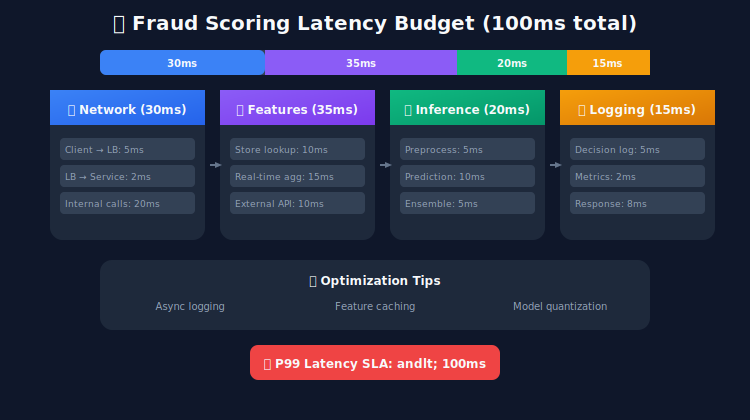
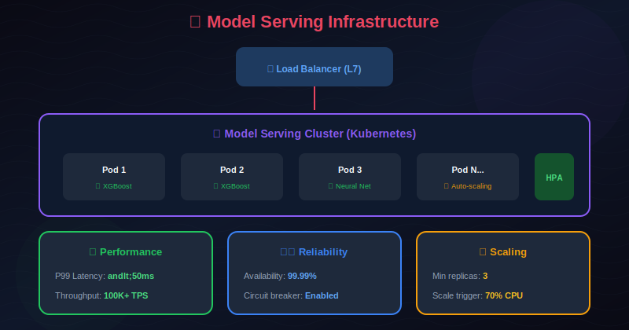
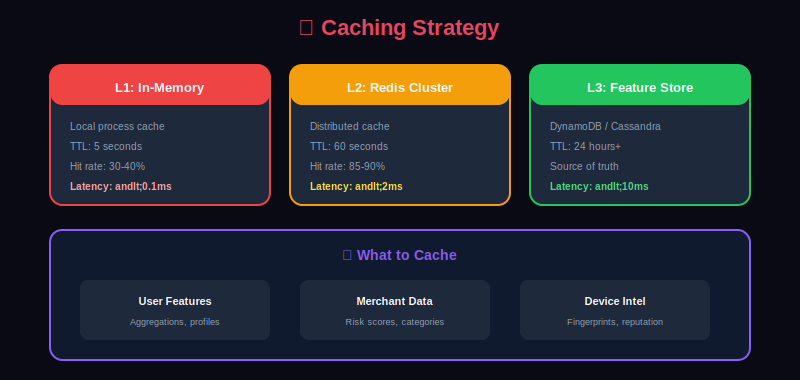

# ⚡ Real-Time Inference for Fraud Detection

> Building low-latency, high-throughput inference systems for real-time fraud scoring.

---

## 📊 Visual Overview

### Latency Breakdown


---

## 📖 Table of Contents

1. [Real-Time Requirements](#real-time-requirements)

2. [Inference Architecture](#inference-architecture)

3. [Feature Retrieval Optimization](#feature-retrieval-optimization)

4. [Model Serving Strategies](#model-serving-strategies)

5. [Latency Optimization](#latency-optimization)

6. [Scaling for High Throughput](#scaling-for-high-throughput)

7. [Caching Strategies](#caching-strategies)

8. [Fallback and Degradation](#fallback-and-degradation)

9. [Monitoring Inference](#monitoring-inference)

10. [Case Study: Building a 10ms Scoring System](#case-study-building-a-10ms-scoring-system)

---

## Real-Time Requirements

### Latency Budget



### Performance Targets

| Metric | Target | Critical Threshold |
|--------|--------|-------------------|
| P50 Latency | <20ms | <50ms |
| P95 Latency | <50ms | <100ms |
| P99 Latency | <100ms | <200ms |
| Throughput | 100K TPS | 50K TPS minimum |
| Availability | 99.99% | 99.9% |
| Error Rate | <0.01% | <0.1% |

---

## Inference Architecture

### High-Level Architecture



### Scoring Service Implementation

```python
from fastapi import FastAPI, HTTPException
from pydantic import BaseModel
from typing import Optional, Dict
import asyncio
import time

app = FastAPI()

class TransactionRequest(BaseModel):
    transaction_id: str
    user_id: str
    merchant_id: str
    amount: float
    currency: str
    card_id: Optional[str]
    device_id: Optional[str]
    ip_address: Optional[str]
    timestamp: str

class ScoringResponse(BaseModel):
    transaction_id: str
    fraud_score: float
    decision: str  # APPROVE, REVIEW, BLOCK
    risk_factors: list[str]
    latency_ms: float

class FraudScoringService:
    def __init__(self):
        self.feature_service = FeatureRetrievalService()
        self.model_service = ModelServingService()
        self.decision_engine = DecisionEngine()
        self.logger = AsyncLogger()

    async def score_transaction(self, request: TransactionRequest) -> ScoringResponse:
        start_time = time.perf_counter()

        try:
            # Parallel feature retrieval and enrichment
            features = await self.feature_service.get_features(request)

            # Model inference
            model_scores = await self.model_service.predict(features)

            # Decision based on scores and rules
            decision = self.decision_engine.decide(model_scores, request)

            # Async logging (non-blocking)
            asyncio.create_task(
                self.logger.log_decision(request, decision, model_scores)
            )

            latency_ms = (time.perf_counter() - start_time) * 1000

            return ScoringResponse(
                transaction_id=request.transaction_id,
                fraud_score=model_scores['ensemble_score'],
                decision=decision.action,
                risk_factors=decision.top_factors,
                latency_ms=latency_ms
            )

        except Exception as e:
            # Fallback to safe default on error
            return self._fallback_response(request, str(e))

scoring_service = FraudScoringService()

@app.post("/v1/score", response_model=ScoringResponse)
async def score_transaction(request: TransactionRequest):
    return await scoring_service.score_transaction(request)

@app.get("/health")
async def health_check():
    return {"status": "healthy", "model_version": scoring_service.model_service.version}

```

---

## Feature Retrieval Optimization

### Parallel Feature Fetching

```python
import asyncio
import aioredis
from typing import Dict, Any

class FeatureRetrievalService:
    """Optimized feature retrieval with parallel fetching"""

    def __init__(self):
        self.redis = aioredis.from_url("redis://localhost:6379")
        self.feature_store = FeatureStoreClient()
        self.enrichment_service = EnrichmentService()

    async def get_features(self, request: TransactionRequest) -> Dict[str, Any]:
        """Fetch all features in parallel"""

        # Define all feature retrieval tasks
        tasks = {
            'user_features': self._get_user_features(request.user_id),
            'merchant_features': self._get_merchant_features(request.merchant_id),
            'card_features': self._get_card_features(request.card_id),
            'device_features': self._get_device_features(request.device_id),
            'velocity_features': self._get_velocity_features(request),
            'ip_features': self._get_ip_features(request.ip_address),
            'transaction_features': self._compute_transaction_features(request)
        }

        # Execute all in parallel with timeout
        try:
            results = await asyncio.wait_for(
                asyncio.gather(*tasks.values(), return_exceptions=True),
                timeout=0.030  # 30ms timeout
            )
        except asyncio.TimeoutError:
            # Return partial results on timeout
            return await self._handle_timeout(tasks)

        # Combine results
        features = {}
        for name, result in zip(tasks.keys(), results):
            if isinstance(result, Exception):
                features.update(self._get_default_features(name))
            else:
                features.update(result)

        return features

    async def _get_user_features(self, user_id: str) -> Dict[str, float]:
        """Get precomputed user features from feature store"""

        # Try cache first
        cache_key = f"user_features:{user_id}"
        cached = await self.redis.get(cache_key)
        if cached:
            return json.loads(cached)

        # Fetch from feature store
        features = await self.feature_store.get_online_features(
            feature_group='user_features',
            entity_id=user_id
        )

        # Cache for 5 minutes
        await self.redis.setex(cache_key, 300, json.dumps(features))

        return features

    async def _get_velocity_features(self, request: TransactionRequest) -> Dict[str, float]:
        """Compute real-time velocity features"""

        user_id = request.user_id
        now = int(time.time())

        # Use Redis sorted sets for time-windowed counts
        pipe = self.redis.pipeline()

        # Count transactions in different windows
        windows = {'1m': 60, '5m': 300, '1h': 3600, '24h': 86400}
        for window_name, seconds in windows.items():
            cutoff = now - seconds
            pipe.zcount(f"user:{user_id}:txns", cutoff, now)
            pipe.zrangebyscore(f"user:{user_id}:amounts", cutoff, now)

        results = await pipe.execute()

        features = {}
        idx = 0
        for window_name in windows:
            features[f'txn_count_{window_name}'] = results[idx]
            amounts = [float(a) for a in results[idx + 1]]
            features[f'txn_amount_{window_name}'] = sum(amounts)
            idx += 2

        return features

```

### Feature Caching Strategy

```python
class TieredFeatureCache:
    """Multi-tier caching for features"""

    def __init__(self):
        # L1: Local in-memory cache (fastest, smallest)
        self.l1_cache = LRUCache(maxsize=10000)
        self.l1_ttl = 60  # 1 minute

        # L2: Redis cache (fast, larger)
        self.l2_cache = aioredis.from_url("redis://localhost:6379")
        self.l2_ttl = 300  # 5 minutes

        # L3: Feature store (source of truth)
        self.feature_store = FeatureStoreClient()

    async def get(self, key: str) -> Optional[Dict]:
        """Get from cache with fallback through tiers"""

        # Try L1 (local memory)
        l1_result = self.l1_cache.get(key)
        if l1_result and not self._is_expired(l1_result):
            return l1_result['data']

        # Try L2 (Redis)
        l2_result = await self.l2_cache.get(key)
        if l2_result:
            data = json.loads(l2_result)
            self.l1_cache[key] = {'data': data, 'ts': time.time()}
            return data

        # Fetch from L3 (Feature Store)
        data = await self.feature_store.get(key)
        if data:
            await self._set_all_tiers(key, data)

        return data

    async def _set_all_tiers(self, key: str, data: Dict):
        """Populate all cache tiers"""

        # L1
        self.l1_cache[key] = {'data': data, 'ts': time.time()}

        # L2
        await self.l2_cache.setex(key, self.l2_ttl, json.dumps(data))

    def _is_expired(self, entry: Dict) -> bool:
        return time.time() - entry['ts'] > self.l1_ttl

```

---

## Model Serving Strategies

### Triton Inference Server

```python
import tritonclient.grpc as grpcclient
import numpy as np

class TritonModelServer:
    """Model serving using NVIDIA Triton"""

    def __init__(self, server_url: str = "localhost:8001"):
        self.client = grpcclient.InferenceServerClient(url=server_url)
        self.model_name = "fraud_detection"
        self.model_version = "1"

    async def predict(self, features: np.ndarray) -> np.ndarray:
        """Run inference on Triton server"""

        # Prepare input
        inputs = [
            grpcclient.InferInput("features", features.shape, "FP32")
        ]
        inputs[0].set_data_from_numpy(features.astype(np.float32))

        # Prepare output
        outputs = [
            grpcclient.InferRequestedOutput("predictions")
        ]

        # Run inference
        response = self.client.infer(
            model_name=self.model_name,
            model_version=self.model_version,
            inputs=inputs,
            outputs=outputs
        )

        return response.as_numpy("predictions")

    def check_health(self) -> bool:
        """Check if model server is healthy"""
        return self.client.is_server_live() and self.client.is_model_ready(self.model_name)

```

### TensorFlow Serving

```python
import tensorflow as tf
from tensorflow_serving.apis import predict_pb2
from tensorflow_serving.apis import prediction_service_pb2_grpc
import grpc

class TFServingClient:
    """TensorFlow Serving client for fraud detection"""

    def __init__(self, server_address: str = "localhost:8500"):
        self.channel = grpc.insecure_channel(server_address)
        self.stub = prediction_service_pb2_grpc.PredictionServiceStub(self.channel)
        self.model_name = "fraud_model"

    def predict(self, features: np.ndarray) -> np.ndarray:
        """Run prediction using TF Serving"""

        request = predict_pb2.PredictRequest()
        request.model_spec.name = self.model_name
        request.model_spec.signature_name = 'serving_default'

        request.inputs['features'].CopyFrom(
            tf.make_tensor_proto(features, dtype=tf.float32)
        )

        response = self.stub.Predict(request, timeout=0.050)  # 50ms timeout

        return tf.make_ndarray(response.outputs['predictions'])

```

### Multi-Model Serving

```python
class MultiModelServingService:
    """Serve multiple models with ensemble combination"""

    def __init__(self):
        self.models = {
            'xgboost': XGBoostServer(),
            'neural_net': TritonModelServer(),
            'rules': RuleEngine()
        }
        self.weights = {'xgboost': 0.4, 'neural_net': 0.4, 'rules': 0.2}
        self.fallback_model = 'xgboost'

    async def predict(self, features: Dict) -> Dict[str, float]:
        """Run all models in parallel and combine"""

        tasks = {}
        for name, model in self.models.items():
            tasks[name] = asyncio.create_task(
                self._safe_predict(name, model, features)
            )

        # Wait with timeout
        done, pending = await asyncio.wait(
            tasks.values(),
            timeout=0.020,  # 20ms for model inference
            return_when=asyncio.ALL_COMPLETED
        )

        # Cancel pending tasks
        for task in pending:
            task.cancel()

        # Collect results
        scores = {}
        for name, task in tasks.items():
            if task in done and not task.cancelled():
                try:
                    scores[name] = task.result()
                except Exception:
                    scores[name] = None

        # Compute ensemble score
        ensemble_score = self._compute_ensemble(scores)
        scores['ensemble_score'] = ensemble_score

        return scores

    async def _safe_predict(self, name: str, model, features: Dict) -> float:
        """Predict with error handling"""
        try:
            return await model.predict(features)
        except Exception as e:
            logger.error(f"Model {name} failed: {e}")
            return None

    def _compute_ensemble(self, scores: Dict[str, Optional[float]]) -> float:
        """Compute weighted ensemble score"""

        total_weight = 0
        weighted_sum = 0

        for name, score in scores.items():
            if name in self.weights and score is not None:
                weighted_sum += self.weights[name] * score
                total_weight += self.weights[name]

        if total_weight == 0:
            # All models failed, use fallback
            return 0.5  # Neutral score

        return weighted_sum / total_weight

```

---

## Latency Optimization

### Model Optimization Techniques

```python
class ModelOptimizer:
    """Optimize models for low-latency inference"""

    def optimize_xgboost(self, model, num_threads: int = 4):
        """Optimize XGBoost for inference"""

        # Set inference parameters
        model.set_param('nthread', num_threads)
        model.set_param('predictor', 'cpu_predictor')

        # Save in binary format for faster loading
        model.save_model('model.ubj')  # Universal binary JSON

        return model

    def convert_to_onnx(self, torch_model, input_shape):
        """Convert PyTorch model to ONNX"""

        dummy_input = torch.randn(*input_shape)

        torch.onnx.export(
            torch_model,
            dummy_input,
            "model.onnx",
            export_params=True,
            opset_version=13,
            do_constant_folding=True,
            input_names=['input'],
            output_names=['output'],
            dynamic_axes={
                'input': {0: 'batch_size'},
                'output': {0: 'batch_size'}
            }
        )

        # Optimize ONNX model
        import onnxoptimizer
        model = onnx.load("model.onnx")
        optimized_model = onnxoptimizer.optimize(model)
        onnx.save(optimized_model, "model_optimized.onnx")

    def quantize_model(self, model, calibration_data):
        """Quantize model for faster CPU inference"""

        # For PyTorch
        quantized_model = torch.quantization.quantize_dynamic(
            model,
            {torch.nn.Linear, torch.nn.LSTM},
            dtype=torch.qint8
        )

        return quantized_model

    def prune_model(self, model, sparsity: float = 0.5):
        """Prune model weights for faster inference"""

        import torch.nn.utils.prune as prune

        for name, module in model.named_modules():
            if isinstance(module, torch.nn.Linear):
                prune.l1_unstructured(module, name='weight', amount=sparsity)
                prune.remove(module, 'weight')

        return model

```

### Batching for Throughput

```python
class BatchingInferenceServer:
    """Batch requests for improved throughput"""

    def __init__(self, model, max_batch_size: int = 32, max_wait_ms: float = 5):
        self.model = model
        self.max_batch_size = max_batch_size
        self.max_wait_ms = max_wait_ms / 1000  # Convert to seconds

        self.request_queue = asyncio.Queue()
        self.batch_processor = None

    async def start(self):
        """Start the batch processing loop"""
        self.batch_processor = asyncio.create_task(self._process_batches())

    async def predict(self, features: np.ndarray) -> float:
        """Add request to batch queue"""

        future = asyncio.Future()
        await self.request_queue.put((features, future))

        return await future

    async def _process_batches(self):
        """Process batches continuously"""

        while True:
            batch_features = []
            batch_futures = []

            # Collect requests for batch
            try:
                # Wait for first request
                features, future = await asyncio.wait_for(
                    self.request_queue.get(),
                    timeout=0.100
                )
                batch_features.append(features)
                batch_futures.append(future)

                # Collect more requests (up to max batch or max wait)
                deadline = time.time() + self.max_wait_ms
                while len(batch_features) < self.max_batch_size and time.time() < deadline:
                    try:
                        features, future = await asyncio.wait_for(
                            self.request_queue.get(),
                            timeout=deadline - time.time()
                        )
                        batch_features.append(features)
                        batch_futures.append(future)
                    except asyncio.TimeoutError:
                        break

            except asyncio.TimeoutError:
                continue

            # Run batch inference
            try:
                batch_input = np.stack(batch_features)
                predictions = self.model.predict(batch_input)

                # Return results
                for future, pred in zip(batch_futures, predictions):
                    future.set_result(pred)

            except Exception as e:
                for future in batch_futures:
                    future.set_exception(e)

```

---

## Scaling for High Throughput

### Horizontal Scaling Architecture

```yaml
# Kubernetes deployment for fraud scoring service
apiVersion: apps/v1
kind: Deployment
metadata:
  name: fraud-scoring-service
spec:
  replicas: 10  # Start with 10 replicas
  selector:
    matchLabels:
      app: fraud-scoring
  template:
    metadata:
      labels:
        app: fraud-scoring
    spec:
      containers:
      - name: scoring-service
        image: fraud-scoring:v1.2.3
        resources:
          requests:
            memory: "2Gi"
            cpu: "2"
          limits:
            memory: "4Gi"
            cpu: "4"
        ports:
        - containerPort: 8080
        env:
        - name: MODEL_SERVER_URL
          value: "triton-inference:8001"
        - name: REDIS_URL
          value: "redis-cluster:6379"
        readinessProbe:
          httpGet:
            path: /health
            port: 8080
          initialDelaySeconds: 5
          periodSeconds: 5
        livenessProbe:
          httpGet:
            path: /health
            port: 8080
          initialDelaySeconds: 15
          periodSeconds: 10
---
apiVersion: autoscaling/v2
kind: HorizontalPodAutoscaler
metadata:
  name: fraud-scoring-hpa
spec:
  scaleTargetRef:
    apiVersion: apps/v1
    kind: Deployment
    name: fraud-scoring-service
  minReplicas: 5
  maxReplicas: 50
  metrics:
  - type: Resource
    resource:
      name: cpu
      target:
        type: Utilization
        averageUtilization: 70
  - type: Pods
    pods:
      metric:
        name: requests_per_second
      target:
        type: AverageValue
        averageValue: "1000"

```

### Load Balancing

```python
class LoadBalancedModelService:
    """Load balance across multiple model servers"""

    def __init__(self, server_addresses: list[str]):
        self.servers = [
            TritonModelServer(addr) for addr in server_addresses
        ]
        self.current_index = 0
        self.health_status = {addr: True for addr in server_addresses}

        # Start health check loop
        asyncio.create_task(self._health_check_loop())

    async def predict(self, features: np.ndarray) -> np.ndarray:
        """Round-robin load balancing with health checks"""

        attempts = 0
        while attempts < len(self.servers):
            server = self._get_next_healthy_server()
            if server is None:
                raise Exception("No healthy servers available")

            try:
                return await asyncio.wait_for(
                    server.predict(features),
                    timeout=0.050
                )
            except Exception as e:
                self.health_status[server.server_url] = False
                attempts += 1

        raise Exception("All servers failed")

    def _get_next_healthy_server(self):
        """Get next healthy server using round-robin"""

        start = self.current_index
        while True:
            server = self.servers[self.current_index]
            self.current_index = (self.current_index + 1) % len(self.servers)

            if self.health_status.get(server.server_url, False):
                return server

            if self.current_index == start:
                return None  # No healthy servers

    async def _health_check_loop(self):
        """Periodically check server health"""

        while True:
            for server in self.servers:
                try:
                    is_healthy = server.check_health()
                    self.health_status[server.server_url] = is_healthy
                except Exception:
                    self.health_status[server.server_url] = False

            await asyncio.sleep(5)  # Check every 5 seconds

```

---

## Caching Strategies

### Prediction Caching

```python
class PredictionCache:
    """Cache predictions for repeated transactions"""

    def __init__(self, redis_client):
        self.redis = redis_client
        self.cache_ttl = 60  # 1 minute cache

    def _make_cache_key(self, request: TransactionRequest) -> str:
        """Create cache key from transaction attributes"""

        # Only cache based on stable attributes
        key_parts = [
            request.user_id,
            request.merchant_id,
            str(int(request.amount * 100)),  # Amount in cents
            request.card_id or 'no_card'
        ]

        return f"pred:{hashlib.md5(':'.join(key_parts).encode()).hexdigest()}"

    async def get_cached_prediction(self, request: TransactionRequest) -> Optional[float]:
        """Get cached prediction if available"""

        key = self._make_cache_key(request)
        cached = await self.redis.get(key)

        if cached:
            return float(cached)
        return None

    async def cache_prediction(self, request: TransactionRequest, score: float):
        """Cache prediction for future requests"""

        key = self._make_cache_key(request)
        await self.redis.setex(key, self.cache_ttl, str(score))

    async def get_or_compute(self, request: TransactionRequest,
                             compute_fn: Callable) -> float:
        """Get from cache or compute prediction"""

        # Try cache first
        cached = await self.get_cached_prediction(request)
        if cached is not None:
            return cached

        # Compute prediction
        score = await compute_fn(request)

        # Cache result
        await self.cache_prediction(request, score)

        return score

```

### Feature Cache with Invalidation

```python
class FeatureCacheWithInvalidation:
    """Feature cache with event-driven invalidation"""

    def __init__(self):
        self.cache = {}
        self.pubsub = None

    async def start(self):
        """Start listening for invalidation events"""

        redis = await aioredis.from_url("redis://localhost:6379")
        self.pubsub = redis.pubsub()

        await self.pubsub.subscribe("feature_updates")

        asyncio.create_task(self._listen_for_invalidations())

    async def _listen_for_invalidations(self):
        """Listen for cache invalidation events"""

        async for message in self.pubsub.listen():
            if message['type'] == 'message':
                event = json.loads(message['data'])
                await self._handle_invalidation(event)

    async def _handle_invalidation(self, event: dict):
        """Handle cache invalidation event"""

        entity_type = event['entity_type']
        entity_id = event['entity_id']

        cache_key = f"{entity_type}:{entity_id}"

        if cache_key in self.cache:
            del self.cache[cache_key]
            logger.info(f"Invalidated cache for {cache_key}")

```

---

## Fallback and Degradation

### Graceful Degradation

```python
class ResilientScoringService:
    """Scoring service with graceful degradation"""

    def __init__(self):
        self.primary_model = TritonModelServer()
        self.fallback_model = SimplisticRuleModel()
        self.circuit_breaker = CircuitBreaker(
            failure_threshold=5,
            recovery_timeout=30
        )

    async def score(self, request: TransactionRequest) -> ScoringResponse:
        """Score with fallback on failure"""

        # Try primary model if circuit breaker allows
        if self.circuit_breaker.is_closed():
            try:
                features = await self._get_features(request)
                score = await asyncio.wait_for(
                    self.primary_model.predict(features),
                    timeout=0.050
                )
                self.circuit_breaker.record_success()
                return self._make_response(request, score, 'primary')

            except Exception as e:
                self.circuit_breaker.record_failure()
                logger.error(f"Primary model failed: {e}")

        # Fallback to simple rules
        try:
            score = await self.fallback_model.score(request)
            return self._make_response(request, score, 'fallback')
        except Exception as e:
            logger.error(f"Fallback failed: {e}")

            # Last resort: conservative default
            return self._default_response(request)

    def _default_response(self, request: TransactionRequest) -> ScoringResponse:
        """Default response when all else fails"""

        # Conservative: flag for review if amount is high
        if request.amount > 1000:
            return ScoringResponse(
                transaction_id=request.transaction_id,
                fraud_score=0.6,
                decision='REVIEW',
                risk_factors=['system_degraded', 'high_amount'],
                latency_ms=0
            )
        else:
            return ScoringResponse(
                transaction_id=request.transaction_id,
                fraud_score=0.3,
                decision='APPROVE',
                risk_factors=['system_degraded'],
                latency_ms=0
            )

class CircuitBreaker:
    """Circuit breaker for service protection"""

    def __init__(self, failure_threshold: int = 5, recovery_timeout: float = 30):
        self.failure_threshold = failure_threshold
        self.recovery_timeout = recovery_timeout
        self.failures = 0
        self.last_failure_time = None
        self.state = 'CLOSED'  # CLOSED, OPEN, HALF_OPEN

    def is_closed(self) -> bool:
        if self.state == 'CLOSED':
            return True

        if self.state == 'OPEN':
            # Check if recovery timeout has passed
            if time.time() - self.last_failure_time > self.recovery_timeout:
                self.state = 'HALF_OPEN'
                return True
            return False

        # HALF_OPEN: allow one request
        return True

    def record_success(self):
        self.failures = 0
        self.state = 'CLOSED'

    def record_failure(self):
        self.failures += 1
        self.last_failure_time = time.time()

        if self.failures >= self.failure_threshold:
            self.state = 'OPEN'

```

---

## Monitoring Inference

### Metrics Collection

```python
from prometheus_client import Counter, Histogram, Gauge
import time

# Define metrics
PREDICTION_LATENCY = Histogram(
    'fraud_prediction_latency_seconds',
    'Time spent processing prediction',
    ['model', 'status'],
    buckets=[.005, .01, .025, .05, .075, .1, .25, .5, 1.0]
)

PREDICTION_COUNT = Counter(
    'fraud_predictions_total',
    'Total number of predictions',
    ['model', 'decision']
)

MODEL_ERRORS = Counter(
    'fraud_model_errors_total',
    'Total number of model errors',
    ['model', 'error_type']
)

ACTIVE_REQUESTS = Gauge(
    'fraud_active_requests',
    'Number of requests currently being processed'
)

SCORE_DISTRIBUTION = Histogram(
    'fraud_score_distribution',
    'Distribution of fraud scores',
    buckets=[0.1, 0.2, 0.3, 0.4, 0.5, 0.6, 0.7, 0.8, 0.9, 1.0]
)

class InstrumentedScoringService:
    """Scoring service with full instrumentation"""

    def __init__(self, scoring_service):
        self.service = scoring_service

    async def score(self, request: TransactionRequest) -> ScoringResponse:
        ACTIVE_REQUESTS.inc()
        start_time = time.perf_counter()

        try:
            response = await self.service.score(request)

            # Record metrics
            latency = time.perf_counter() - start_time
            PREDICTION_LATENCY.labels(
                model='ensemble',
                status='success'
            ).observe(latency)

            PREDICTION_COUNT.labels(
                model='ensemble',
                decision=response.decision
            ).inc()

            SCORE_DISTRIBUTION.observe(response.fraud_score)

            return response

        except Exception as e:
            MODEL_ERRORS.labels(
                model='ensemble',
                error_type=type(e).__name__
            ).inc()
            raise

        finally:
            ACTIVE_REQUESTS.dec()

```

### Latency Tracking Dashboard

```yaml
# Grafana dashboard configuration
dashboard:
  title: "Fraud Detection - Real-Time Inference"
  panels:
    - title: "P99 Latency"
      type: graph
      query: |
        histogram_quantile(0.99,
          rate(fraud_prediction_latency_seconds_bucket[5m]))
      thresholds:
        - value: 0.1
          color: red

    - title: "Request Rate"
      type: graph
      query: |
        sum(rate(fraud_predictions_total[1m]))

    - title: "Decision Distribution"
      type: piechart
      query: |
        sum by (decision) (fraud_predictions_total)

    - title: "Error Rate"
      type: stat
      query: |
        sum(rate(fraud_model_errors_total[5m])) /
        sum(rate(fraud_predictions_total[5m]))

    - title: "Score Distribution"
      type: heatmap
      query: |
        sum(rate(fraud_score_distribution_bucket[5m])) by (le)

```

---

## Case Study: Building a 10ms Scoring System

### Architecture Overview



### Implementation

```python
class Ultra10msScoringService:
    """Optimized for <10ms P99 latency"""

    def __init__(self):
        # Pre-loaded models in memory
        self.xgb_model = self._load_quantized_xgb()
        self.mlp_model = self._load_onnx_model()

        # Connection pools
        self.redis_pool = redis.ConnectionPool(max_connections=100)

        # Local caches
        self.user_cache = LRUCache(maxsize=50000)
        self.merchant_cache = LRUCache(maxsize=10000)

        # Precompiled feature transformers
        self.transformer = NumbaOptimizedTransformer()

    async def score(self, request: TransactionRequest) -> float:
        # Use asyncio.gather for parallel operations
        user_features, merchant_features, velocity = await asyncio.gather(
            self._get_user_features_fast(request.user_id),
            self._get_merchant_features_fast(request.merchant_id),
            self._get_velocity_fast(request.user_id)
        )

        # Combine features
        features = self.transformer.transform(
            request, user_features, merchant_features, velocity
        )

        # Parallel model inference
        xgb_score, mlp_score = await asyncio.gather(
            self._predict_xgb(features),
            self._predict_mlp(features)
        )

        # Ensemble
        return 0.6 * xgb_score + 0.4 * mlp_score

    async def _get_user_features_fast(self, user_id: str) -> np.ndarray:
        # Try local cache first
        cached = self.user_cache.get(user_id)
        if cached is not None:
            return cached

        # Redis with timeout
        features = await asyncio.wait_for(
            self._fetch_from_redis(f"user:{user_id}"),
            timeout=0.002  # 2ms timeout
        )

        self.user_cache[user_id] = features
        return features

    async def _predict_xgb(self, features: np.ndarray) -> float:
        # Direct prediction, no overhead
        return float(self.xgb_model.predict(features)[0])

    async def _predict_mlp(self, features: np.ndarray) -> float:
        # ONNX runtime prediction
        return float(self.mlp_model.run(
            None,
            {'input': features.astype(np.float32)}
        )[0][0])

```

---

## Summary

Key principles for real-time fraud inference:

1. **Parallel everything**: Feature retrieval, model inference, logging

2. **Cache aggressively**: Multi-tier caching for features and predictions

3. **Optimize models**: Quantization, ONNX, model pruning

4. **Graceful degradation**: Circuit breakers, fallback models

5. **Monitor continuously**: Latency percentiles, error rates, score distributions

---

## Next Steps

Continue to [Chapter 6: Rule Engine →](../06_rule_engine/)

---

## Code Examples

See the `code/` directory for:

- `serving/` - Model serving implementations

- `caching/` - Caching strategies

- `optimization/` - Latency optimization utilities

- `monitoring/` - Metrics and dashboards

---

<div align="center">

**[⬆ Back to Top](#)** | **[📚 Main Repository](https://github.com/Gaurav14cs17/ml_system_design)**

Made with 💜 by [Gaurav14cs17](https://github.com/Gaurav14cs17)

</div>
