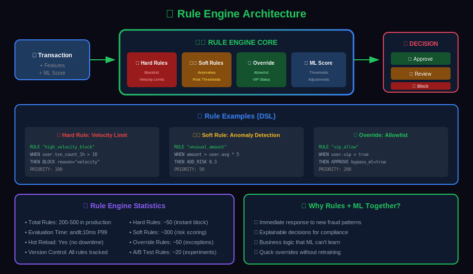
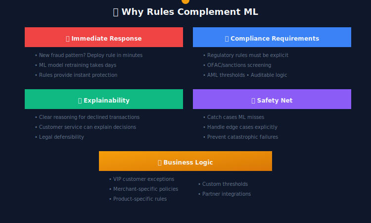
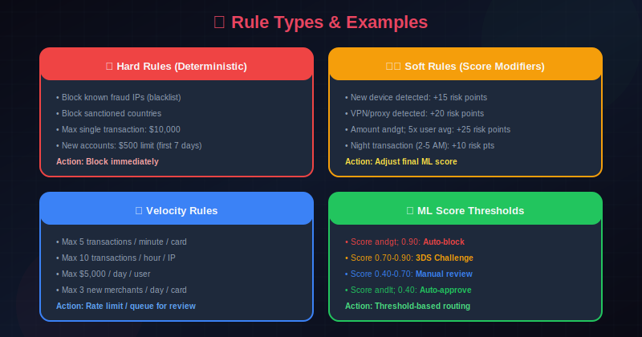
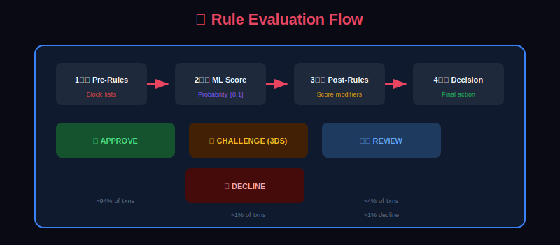

# 📋 Rule Engine for Fraud Detection

> Building and managing business rules that complement ML models for comprehensive fraud detection.

---

## 📊 Visual Overview

### Rule Engine Flow


---

## 📖 Table of Contents

1. [Why Rules Still Matter](#why-rules-still-matter)
2. [Types of Rules](#types-of-rules)
3. [Rule Engine Architecture](#rule-engine-architecture)
4. [Rule Definition Language](#rule-definition-language)
5. [Rule Management System](#rule-management-system)
6. [ML + Rules Integration](#ml-rules-integration)
7. [Rule Performance Optimization](#rule-performance-optimization)
8. [Rule Testing and Validation](#rule-testing-and-validation)
9. [Rule Monitoring](#rule-monitoring)
10. [Best Practices](#best-practices)

---

## Why Rules Still Matter

### The Case for Rules in ML Systems



### Rules vs ML Comparison

| Aspect | Rules | ML Models |
|--------|-------|-----------|
| Deployment Speed | Minutes | Days |
| Pattern Complexity | Simple, explicit | Complex, learned |
| Interpretability | Full | Partial (SHAP) |
| Maintenance | Manual updates | Automatic learning |
| False Positives | Predictable | Variable |
| Novel Patterns | Cannot detect | Can generalize |
| Compliance | Auditable | Requires explanation layer |

---

## Types of Rules

### 1. Blacklist/Whitelist Rules

```python
class BlacklistRules:
    """Rules based on known bad/good entities"""

    def __init__(self, blacklist_service):
        self.blacklist = blacklist_service

    def check(self, transaction: dict) -> RuleResult:
        results = []

        # Card BIN blacklist
        if self.blacklist.is_blocked_bin(transaction.get('card_bin')):
            results.append(RuleResult(
                rule_id='BLOCKED_BIN',
                action='BLOCK',
                reason='Card BIN is on blocklist',
                severity='HIGH'
            ))

        # IP blacklist
        if self.blacklist.is_blocked_ip(transaction.get('ip_address')):
            results.append(RuleResult(
                rule_id='BLOCKED_IP',
                action='BLOCK',
                reason='IP address is on blocklist',
                severity='HIGH'
            ))

        # Device blacklist
        if self.blacklist.is_blocked_device(transaction.get('device_id')):
            results.append(RuleResult(
                rule_id='BLOCKED_DEVICE',
                action='BLOCK',
                reason='Device is on blocklist',
                severity='HIGH'
            ))

        # Email domain blacklist
        email = transaction.get('email', '')
        if self.blacklist.is_blocked_email_domain(email.split('@')[-1]):
            results.append(RuleResult(
                rule_id='BLOCKED_EMAIL_DOMAIN',
                action='REVIEW',
                reason='Email domain is suspicious',
                severity='MEDIUM'
            ))

        # Whitelist override
        if self.blacklist.is_whitelisted_user(transaction.get('user_id')):
            return RuleResult(
                rule_id='WHITELISTED_USER',
                action='APPROVE',
                reason='User is on trusted whitelist',
                severity='LOW',
                override=True
            )

        return results

```

### 2. Velocity Rules

```python
class VelocityRules:
    """Rules based on transaction frequency and amounts"""

    def __init__(self, velocity_service):
        self.velocity = velocity_service

        # Define velocity limits
        self.limits = {
            'txn_count_1h': 5,
            'txn_count_24h': 20,
            'txn_amount_1h': 1000,
            'txn_amount_24h': 5000,
            'unique_merchants_1h': 3,
            'unique_countries_24h': 2,
            'decline_count_1h': 3
        }

    def check(self, transaction: dict) -> list[RuleResult]:
        user_id = transaction['user_id']
        results = []

        # Get current velocities
        velocities = self.velocity.get_user_velocities(user_id)

        # Transaction count limits
        if velocities['txn_count_1h'] >= self.limits['txn_count_1h']:
            results.append(RuleResult(
                rule_id='VELOCITY_TXN_COUNT_1H',
                action='REVIEW',
                reason=f"Transaction count exceeds {self.limits['txn_count_1h']}/hour",
                severity='MEDIUM',
                data={'current': velocities['txn_count_1h'], 'limit': self.limits['txn_count_1h']}
            ))

        # Amount limits
        potential_total = velocities['txn_amount_24h'] + transaction['amount']
        if potential_total > self.limits['txn_amount_24h']:
            results.append(RuleResult(
                rule_id='VELOCITY_AMOUNT_24H',
                action='REVIEW',
                reason=f"24h amount would exceed ${self.limits['txn_amount_24h']}",
                severity='MEDIUM',
                data={'current': velocities['txn_amount_24h'], 'limit': self.limits['txn_amount_24h']}
            ))

        # Geographic spread
        if velocities['unique_countries_24h'] >= self.limits['unique_countries_24h']:
            results.append(RuleResult(
                rule_id='VELOCITY_COUNTRIES',
                action='REVIEW',
                reason='Transaction from too many countries in 24h',
                severity='HIGH',
                data={'countries': velocities['unique_countries_24h']}
            ))

        # Decline velocity (potential credential testing)
        if velocities['decline_count_1h'] >= self.limits['decline_count_1h']:
            results.append(RuleResult(
                rule_id='VELOCITY_DECLINES',
                action='BLOCK',
                reason='Too many declined transactions',
                severity='HIGH',
                data={'declines': velocities['decline_count_1h']}
            ))

        return results

```

### 3. Amount and Pattern Rules

```python
class AmountPatternRules:
    """Rules based on transaction amounts and patterns"""

    def check(self, transaction: dict, user_profile: dict) -> list[RuleResult]:
        results = []
        amount = transaction['amount']

        # Large transaction rule
        if amount > 10000:
            results.append(RuleResult(
                rule_id='LARGE_AMOUNT',
                action='REVIEW',
                reason='Transaction amount exceeds $10,000',
                severity='MEDIUM'
            ))

        # Unusual amount for user
        user_max = user_profile.get('max_transaction', 500)
        if amount > user_max * 3:
            results.append(RuleResult(
                rule_id='UNUSUAL_AMOUNT_FOR_USER',
                action='REVIEW',
                reason=f'Amount is 3x user typical max (${user_max})',
                severity='HIGH'
            ))

        # Round amount patterns (potential money laundering)
        if amount >= 1000 and amount % 1000 == 0:
            results.append(RuleResult(
                rule_id='ROUND_LARGE_AMOUNT',
                action='REVIEW',
                reason='Large round amount detected',
                severity='LOW'
            ))

        # Just under threshold (structuring)
        reporting_thresholds = [10000, 3000]  # CTR, typical limits
        for threshold in reporting_thresholds:
            if threshold * 0.95 <= amount < threshold:
                results.append(RuleResult(
                    rule_id='STRUCTURING_PATTERN',
                    action='REVIEW',
                    reason=f'Amount just below ${threshold} threshold',
                    severity='MEDIUM'
                ))

        # First large transaction
        if user_profile.get('transaction_count', 0) < 3 and amount > 500:
            results.append(RuleResult(
                rule_id='NEW_USER_LARGE_TXN',
                action='REVIEW',
                reason='Large transaction from new user',
                severity='MEDIUM'
            ))

        return results

```

### 4. Geographic Rules

```python
class GeographicRules:
    """Rules based on location and travel patterns"""

    def __init__(self, geo_service):
        self.geo = geo_service
        self.high_risk_countries = ['XX', 'YY', 'ZZ']  # Placeholder codes

    def check(self, transaction: dict, user_profile: dict) -> list[RuleResult]:
        results = []

        txn_country = transaction.get('country')
        home_country = user_profile.get('home_country')
        last_txn = user_profile.get('last_transaction', {})

        # High-risk country
        if txn_country in self.high_risk_countries:
            results.append(RuleResult(
                rule_id='HIGH_RISK_COUNTRY',
                action='REVIEW',
                reason=f'Transaction from high-risk country: {txn_country}',
                severity='HIGH'
            ))

        # First international transaction
        if txn_country != home_country and not user_profile.get('has_international_history'):
            results.append(RuleResult(
                rule_id='FIRST_INTERNATIONAL',
                action='REVIEW',
                reason='First international transaction for user',
                severity='MEDIUM'
            ))

        # Impossible travel
        if last_txn:
            travel_speed = self._calculate_travel_speed(
                last_txn.get('location'),
                transaction.get('location'),
                last_txn.get('timestamp'),
                transaction.get('timestamp')
            )

            if travel_speed > 1000:  # km/h, faster than commercial flight
                results.append(RuleResult(
                    rule_id='IMPOSSIBLE_TRAVEL',
                    action='BLOCK',
                    reason=f'Impossible travel detected: {travel_speed:.0f} km/h',
                    severity='CRITICAL'
                ))

        # IP/Billing country mismatch
        ip_country = transaction.get('ip_country')
        billing_country = transaction.get('billing_country')

        if ip_country and billing_country and ip_country != billing_country:
            results.append(RuleResult(
                rule_id='IP_BILLING_MISMATCH',
                action='REVIEW',
                reason=f'IP country ({ip_country}) != billing country ({billing_country})',
                severity='MEDIUM'
            ))

        return results

    def _calculate_travel_speed(self, loc1, loc2, time1, time2) -> float:
        if not all([loc1, loc2, time1, time2]):
            return 0

        distance = self.geo.haversine_distance(
            loc1['lat'], loc1['lon'],
            loc2['lat'], loc2['lon']
        )

        time_diff = (time2 - time1).total_seconds() / 3600  # hours

        if time_diff <= 0:
            return float('inf')

        return distance / time_diff

```

### 5. Device and Session Rules

```python
class DeviceSessionRules:
    """Rules based on device fingerprinting and session behavior"""

    def check(self, transaction: dict, device_data: dict, session_data: dict) -> list[RuleResult]:
        results = []

        # VPN/Proxy detection
        if device_data.get('is_vpn') or device_data.get('is_proxy'):
            results.append(RuleResult(
                rule_id='VPN_PROXY_DETECTED',
                action='REVIEW',
                reason='VPN or proxy detected',
                severity='MEDIUM'
            ))

        # Tor exit node
        if device_data.get('is_tor'):
            results.append(RuleResult(
                rule_id='TOR_DETECTED',
                action='BLOCK',
                reason='Tor exit node detected',
                severity='HIGH'
            ))

        # Emulator/rooted device
        if device_data.get('is_emulator'):
            results.append(RuleResult(
                rule_id='EMULATOR_DETECTED',
                action='BLOCK',
                reason='Device emulator detected',
                severity='HIGH'
            ))

        # Multiple users on device
        if device_data.get('unique_users_7d', 1) > 5:
            results.append(RuleResult(
                rule_id='SHARED_DEVICE',
                action='REVIEW',
                reason=f"Device used by {device_data['unique_users_7d']} users",
                severity='MEDIUM'
            ))

        # Session anomalies
        if session_data:
            # Very short session before purchase
            if session_data.get('duration_seconds', 60) < 10:
                results.append(RuleResult(
                    rule_id='SHORT_SESSION',
                    action='REVIEW',
                    reason='Purchase attempt within 10 seconds of session start',
                    severity='MEDIUM'
                ))

            # Direct checkout (no browsing)
            if session_data.get('pages_before_checkout', 5) < 2:
                results.append(RuleResult(
                    rule_id='DIRECT_CHECKOUT',
                    action='REVIEW',
                    reason='Direct checkout with minimal browsing',
                    severity='LOW'
                ))

        return results

```

---

## Rule Engine Architecture

### Engine Design



### Rule Engine Implementation

```python
from dataclasses import dataclass
from enum import Enum
from typing import List, Dict, Any, Optional
import asyncio

class Action(Enum):
    APPROVE = "APPROVE"
    REVIEW = "REVIEW"
    BLOCK = "BLOCK"

class Severity(Enum):
    LOW = 1
    MEDIUM = 2
    HIGH = 3
    CRITICAL = 4

@dataclass
class RuleResult:
    rule_id: str
    action: Action
    reason: str
    severity: Severity
    data: Optional[Dict] = None
    override: bool = False

@dataclass
class RuleEngineDecision:
    final_action: Action
    triggered_rules: List[RuleResult]
    confidence: float
    processing_time_ms: float

class RuleEngine:
    """Main rule engine orchestrator"""

    def __init__(self, config: dict):
        self.rule_groups = self._initialize_rule_groups(config)
        self.priority_order = [
            'whitelist',
            'blacklist',
            'velocity',
            'amount',
            'geographic',
            'device',
            'ml_threshold',
            'business'
        ]

    def _initialize_rule_groups(self, config: dict) -> Dict[str, RuleGroup]:
        return {
            'whitelist': WhitelistRules(config['whitelist_service']),
            'blacklist': BlacklistRules(config['blacklist_service']),
            'velocity': VelocityRules(config['velocity_service']),
            'amount': AmountPatternRules(),
            'geographic': GeographicRules(config['geo_service']),
            'device': DeviceSessionRules(),
            'ml_threshold': MLThresholdRules(config['ml_thresholds']),
            'business': BusinessRules(config['business_rules'])
        }

    async def evaluate(self, context: RuleContext) -> RuleEngineDecision:
        """Evaluate all rules and return decision"""

        start_time = time.perf_counter()
        all_results: List[RuleResult] = []

        for group_name in self.priority_order:
            rule_group = self.rule_groups.get(group_name)
            if not rule_group:
                continue

            try:
                results = await self._evaluate_group(rule_group, context)

                # Check for override (whitelist)
                override = next((r for r in results if r.override), None)
                if override:
                    return RuleEngineDecision(
                        final_action=override.action,
                        triggered_rules=[override],
                        confidence=1.0,
                        processing_time_ms=(time.perf_counter() - start_time) * 1000
                    )

                # Check for immediate block
                critical = [r for r in results if r.severity == Severity.CRITICAL]
                if critical:
                    all_results.extend(critical)
                    break

                all_results.extend(results)

            except Exception as e:
                logger.error(f"Rule group {group_name} failed: {e}")
                continue

        # Determine final action
        final_action = self._aggregate_decision(all_results)
        confidence = self._calculate_confidence(all_results)

        return RuleEngineDecision(
            final_action=final_action,
            triggered_rules=all_results,
            confidence=confidence,
            processing_time_ms=(time.perf_counter() - start_time) * 1000
        )

    def _aggregate_decision(self, results: List[RuleResult]) -> Action:
        """Determine final action from all rule results"""

        if not results:
            return Action.APPROVE

        # Any BLOCK -> BLOCK
        if any(r.action == Action.BLOCK for r in results):
            return Action.BLOCK

        # Multiple REVIEW or high severity -> BLOCK
        review_count = sum(1 for r in results if r.action == Action.REVIEW)
        high_severity_count = sum(1 for r in results if r.severity.value >= Severity.HIGH.value)

        if review_count >= 3 or high_severity_count >= 2:
            return Action.BLOCK

        # Any REVIEW -> REVIEW
        if review_count > 0:
            return Action.REVIEW

        return Action.APPROVE

    def _calculate_confidence(self, results: List[RuleResult]) -> float:
        """Calculate confidence in the decision"""

        if not results:
            return 0.9  # No rules triggered, confident approve

        severity_scores = [r.severity.value for r in results]
        max_severity = max(severity_scores)

        # Higher severity = higher confidence in fraud
        return min(0.5 + (max_severity * 0.15), 1.0)

```

---

## Rule Definition Language

### YAML-Based Rule Definition

```yaml
# rules/velocity_rules.yaml
rules:
  - id: VELOCITY_TXN_COUNT_1H
    name: "Hourly Transaction Count Limit"
    description: "Block if more than 5 transactions in 1 hour"
    enabled: true
    priority: 1
    conditions:
      - field: velocity.txn_count_1h
        operator: gte
        value: 5
    action: REVIEW
    severity: MEDIUM
    message: "Transaction count exceeds {velocity.txn_count_1h}/hour (limit: 5)"

  - id: VELOCITY_AMOUNT_24H
    name: "Daily Amount Limit"
    description: "Review if daily amount exceeds $5000"
    enabled: true
    priority: 2
    conditions:
      - field: velocity.txn_amount_24h
        operator: gt
        value: 5000
    action: REVIEW
    severity: MEDIUM
    message: "24h amount ${velocity.txn_amount_24h} exceeds limit"

  - id: VELOCITY_RAPID_FIRE
    name: "Rapid Transaction Detection"
    description: "Block rapid-fire transactions"
    enabled: true
    priority: 0
    conditions:
      - field: velocity.txn_count_1m
        operator: gte
        value: 3
    action: BLOCK
    severity: HIGH
    message: "Rapid-fire transactions detected: {velocity.txn_count_1m} in 1 minute"

```

### Rule Parser and Executor

```python
import yaml
from typing import Any

class RuleDefinition:
    """Parsed rule from YAML definition"""

    def __init__(self, config: dict):
        self.id = config['id']
        self.name = config['name']
        self.enabled = config.get('enabled', True)
        self.priority = config.get('priority', 100)
        self.conditions = [Condition(c) for c in config['conditions']]
        self.action = Action[config['action']]
        self.severity = Severity[config['severity']]
        self.message = config['message']

    def evaluate(self, context: dict) -> Optional[RuleResult]:
        """Evaluate rule against context"""

        if not self.enabled:
            return None

        # Check all conditions
        if all(cond.evaluate(context) for cond in self.conditions):
            return RuleResult(
                rule_id=self.id,
                action=self.action,
                reason=self._format_message(context),
                severity=self.severity
            )

        return None

    def _format_message(self, context: dict) -> str:
        """Format message with context values"""
        message = self.message
        for match in re.finditer(r'\{([^}]+)\}', self.message):
            field_path = match.group(1)
            value = self._get_nested_value(context, field_path)
            message = message.replace(match.group(0), str(value))
        return message

class Condition:
    """Single condition in a rule"""

    OPERATORS = {
        'eq': lambda a, b: a == b,
        'neq': lambda a, b: a != b,
        'gt': lambda a, b: a > b,
        'gte': lambda a, b: a >= b,
        'lt': lambda a, b: a < b,
        'lte': lambda a, b: a <= b,
        'in': lambda a, b: a in b,
        'not_in': lambda a, b: a not in b,
        'contains': lambda a, b: b in a,
        'regex': lambda a, b: bool(re.match(b, str(a))),
    }

    def __init__(self, config: dict):
        self.field = config['field']
        self.operator = config['operator']
        self.value = config['value']

    def evaluate(self, context: dict) -> bool:
        """Evaluate condition against context"""

        field_value = self._get_nested_value(context, self.field)

        if field_value is None:
            return False

        op_func = self.OPERATORS.get(self.operator)
        if not op_func:
            raise ValueError(f"Unknown operator: {self.operator}")

        return op_func(field_value, self.value)

class RuleLoader:
    """Load rules from YAML files"""

    def __init__(self, rules_directory: str):
        self.rules_dir = rules_directory
        self.rules: Dict[str, RuleDefinition] = {}

    def load_all(self):
        """Load all rules from directory"""

        for file_path in Path(self.rules_dir).glob("*.yaml"):
            with open(file_path) as f:
                config = yaml.safe_load(f)

            for rule_config in config.get('rules', []):
                rule = RuleDefinition(rule_config)
                self.rules[rule.id] = rule

        return self.rules

    def reload(self):
        """Hot reload rules"""
        self.rules.clear()
        return self.load_all()

```

---

## Rule Management System

### Rule Lifecycle



### Rule Admin API

```python
from fastapi import FastAPI, HTTPException
from pydantic import BaseModel

app = FastAPI()

class RuleCreateRequest(BaseModel):
    id: str
    name: str
    conditions: list[dict]
    action: str
    severity: str
    enabled: bool = False  # Start disabled

class RuleUpdateRequest(BaseModel):
    enabled: Optional[bool]
    conditions: Optional[list[dict]]
    action: Optional[str]
    severity: Optional[str]

class RuleAdminService:
    def __init__(self, rule_store, audit_log):
        self.store = rule_store
        self.audit = audit_log

    async def create_rule(self, request: RuleCreateRequest, user: str) -> dict:
        """Create new rule (starts disabled)"""

        # Validate rule
        self._validate_rule(request)

        # Store rule
        rule = await self.store.create(request.dict())

        # Audit log
        await self.audit.log({
            'action': 'CREATE_RULE',
            'rule_id': request.id,
            'user': user,
            'timestamp': datetime.utcnow()
        })

        return rule

    async def enable_rule(self, rule_id: str, user: str) -> dict:
        """Enable a rule for production"""

        rule = await self.store.get(rule_id)
        if not rule:
            raise HTTPException(404, "Rule not found")

        # Require backtest results before enabling
        if not await self._has_valid_backtest(rule_id):
            raise HTTPException(400, "Rule must be backtested before enabling")

        rule['enabled'] = True
        await self.store.update(rule_id, rule)

        # Audit
        await self.audit.log({
            'action': 'ENABLE_RULE',
            'rule_id': rule_id,
            'user': user
        })

        return rule

    async def disable_rule(self, rule_id: str, user: str, reason: str) -> dict:
        """Disable a rule (emergency or planned)"""

        rule = await self.store.get(rule_id)
        rule['enabled'] = False
        await self.store.update(rule_id, rule)

        await self.audit.log({
            'action': 'DISABLE_RULE',
            'rule_id': rule_id,
            'user': user,
            'reason': reason
        })

        return rule

@app.post("/rules")
async def create_rule(request: RuleCreateRequest, current_user: str = Depends(get_current_user)):
    return await rule_admin.create_rule(request, current_user)

@app.put("/rules/{rule_id}/enable")
async def enable_rule(rule_id: str, current_user: str = Depends(get_current_user)):
    return await rule_admin.enable_rule(rule_id, current_user)

@app.put("/rules/{rule_id}/disable")
async def disable_rule(rule_id: str, reason: str, current_user: str = Depends(get_current_user)):
    return await rule_admin.disable_rule(rule_id, current_user, reason)

```

---

## ML + Rules Integration

### Hybrid Decision System

```python
class HybridDecisionEngine:
    """Combine ML scores with rule engine for final decision"""

    def __init__(self, ml_service, rule_engine):
        self.ml = ml_service
        self.rules = rule_engine

        # ML score thresholds
        self.thresholds = {
            'auto_approve': 0.1,
            'review': 0.5,
            'auto_block': 0.9
        }

    async def decide(self, transaction: dict) -> Decision:
        """Make final fraud decision using ML + rules"""

        # Get ML score
        ml_result = await self.ml.score(transaction)

        # Get rule results
        rule_result = await self.rules.evaluate(transaction)

        # Decision matrix
        decision = self._combine_decisions(ml_result, rule_result)

        return Decision(
            action=decision['action'],
            fraud_score=ml_result.score,
            ml_decision=ml_result.decision,
            rule_decision=rule_result.final_action,
            triggered_rules=rule_result.triggered_rules,
            risk_factors=self._get_risk_factors(ml_result, rule_result)
        )

    def _combine_decisions(self, ml_result, rule_result) -> dict:
        """Combine ML and rule decisions"""

        ml_score = ml_result.score
        rule_action = rule_result.final_action

        # Rule-based overrides
        if rule_result.has_critical_rule:
            return {'action': Action.BLOCK, 'reason': 'critical_rule'}

        if rule_result.has_whitelist:
            return {'action': Action.APPROVE, 'reason': 'whitelist'}

        # ML-based decisions with rule adjustment
        if ml_score >= self.thresholds['auto_block']:
            return {'action': Action.BLOCK, 'reason': 'high_ml_score'}

        if ml_score <= self.thresholds['auto_approve'] and rule_action == Action.APPROVE:
            return {'action': Action.APPROVE, 'reason': 'low_risk'}

        if ml_score >= self.thresholds['review'] or rule_action == Action.REVIEW:
            return {'action': Action.REVIEW, 'reason': 'elevated_risk'}

        # Moderate ML score with no rule triggers
        if rule_action == Action.APPROVE:
            return {'action': Action.APPROVE, 'reason': 'moderate_risk_no_rules'}

        return {'action': Action.REVIEW, 'reason': 'uncertain'}

```

### ML Score-Based Rules

```yaml
# rules/ml_threshold_rules.yaml
rules:
  - id: ML_HIGH_SCORE
    name: "High ML Score Block"
    conditions:
      - field: ml.fraud_score
        operator: gte
        value: 0.95
    action: BLOCK
    severity: HIGH
    message: "ML fraud score {ml.fraud_score} exceeds block threshold"

  - id: ML_SCORE_NEW_DEVICE
    name: "Medium Score with New Device"
    conditions:
      - field: ml.fraud_score
        operator: gte
        value: 0.6
      - field: device.is_new_for_user
        operator: eq
        value: true
    action: REVIEW
    severity: MEDIUM
    message: "Elevated ML score with new device"

  - id: ML_SCORE_HIGH_AMOUNT
    name: "Medium Score with High Amount"
    conditions:
      - field: ml.fraud_score
        operator: gte
        value: 0.5
      - field: transaction.amount
        operator: gt
        value: 1000
    action: REVIEW
    severity: MEDIUM
    message: "Elevated ML score with high amount transaction"

```

---

## Rule Performance Optimization

### Efficient Rule Evaluation

```python
class OptimizedRuleEngine:
    """Performance-optimized rule engine"""

    def __init__(self, rules: List[RuleDefinition]):
        self.rules = rules

        # Pre-compile regex patterns
        self._compile_patterns()

        # Build field dependency index
        self.field_index = self._build_field_index()

        # Sort rules by priority
        self.rules.sort(key=lambda r: r.priority)

    def _compile_patterns(self):
        """Pre-compile all regex patterns"""
        for rule in self.rules:
            for cond in rule.conditions:
                if cond.operator == 'regex':
                    cond._compiled_pattern = re.compile(cond.value)

    def _build_field_index(self) -> Dict[str, List[RuleDefinition]]:
        """Index rules by fields they depend on"""
        index = defaultdict(list)
        for rule in self.rules:
            for cond in rule.conditions:
                index[cond.field].append(rule)
        return index

    def evaluate_fast(self, context: dict) -> List[RuleResult]:
        """Fast evaluation with short-circuit logic"""

        results = []

        # Check rules in priority order
        for rule in self.rules:
            if not rule.enabled:
                continue

            # Quick field availability check
            if not self._has_required_fields(rule, context):
                continue

            result = rule.evaluate(context)
            if result:
                results.append(result)

                # Short-circuit on critical
                if result.severity == Severity.CRITICAL:
                    break

        return results

    def _has_required_fields(self, rule: RuleDefinition, context: dict) -> bool:
        """Check if context has all required fields"""
        for cond in rule.conditions:
            if self._get_nested_value(context, cond.field) is None:
                return False
        return True

class RuleCache:
    """Cache rule results for repeated patterns"""

    def __init__(self, max_size: int = 10000):
        self.cache = LRUCache(maxsize=max_size)

    def get_cache_key(self, rule_id: str, context: dict) -> str:
        """Create cache key from rule and relevant context"""
        relevant_fields = self._get_rule_fields(rule_id)
        key_data = {f: self._get_nested(context, f) for f in relevant_fields}
        return f"{rule_id}:{hashlib.md5(json.dumps(key_data, sort_keys=True).encode()).hexdigest()}"

    def get(self, rule_id: str, context: dict) -> Optional[RuleResult]:
        key = self.get_cache_key(rule_id, context)
        return self.cache.get(key)

    def set(self, rule_id: str, context: dict, result: RuleResult):
        key = self.get_cache_key(rule_id, context)
        self.cache[key] = result

```

---

## Rule Testing and Validation

### Backtesting Framework

```python
class RuleBacktester:
    """Backtest rules against historical data"""

    def __init__(self, data_source, rule_engine):
        self.data = data_source
        self.engine = rule_engine

    async def backtest(self, rule_id: str,
                       start_date: datetime,
                       end_date: datetime) -> BacktestResult:
        """Run rule against historical transactions"""

        # Get historical transactions with labels
        transactions = await self.data.get_transactions(start_date, end_date)

        results = {
            'total': 0,
            'triggered': 0,
            'true_positives': 0,
            'false_positives': 0,
            'true_negatives': 0,
            'false_negatives': 0
        }

        for txn in transactions:
            results['total'] += 1

            # Evaluate rule
            rule_result = self.engine.evaluate_single_rule(rule_id, txn)
            triggered = rule_result is not None

            # Check against label
            is_fraud = txn.get('is_fraud', False)

            if triggered and is_fraud:
                results['true_positives'] += 1
            elif triggered and not is_fraud:
                results['false_positives'] += 1
            elif not triggered and is_fraud:
                results['false_negatives'] += 1
            else:
                results['true_negatives'] += 1

            if triggered:
                results['triggered'] += 1

        # Calculate metrics
        return BacktestResult(
            rule_id=rule_id,
            period=f"{start_date} to {end_date}",
            total_transactions=results['total'],
            trigger_rate=results['triggered'] / results['total'],
            precision=results['true_positives'] / max(results['triggered'], 1),
            recall=results['true_positives'] / max(results['true_positives'] + results['false_negatives'], 1),
            false_positive_rate=results['false_positives'] / max(results['true_negatives'] + results['false_positives'], 1)
        )

```

### Unit Testing Rules

```python
import pytest

class TestVelocityRules:
    """Unit tests for velocity rules"""

    @pytest.fixture
    def velocity_rules(self):
        return VelocityRules(MockVelocityService())

    def test_hourly_transaction_limit(self, velocity_rules):
        """Test hourly transaction count rule"""

        # Setup: 5 transactions in last hour
        context = {
            'user_id': 'user123',
            'velocity': {
                'txn_count_1h': 5,
                'txn_amount_1h': 500
            }
        }

        results = velocity_rules.check(context)

        assert len(results) == 1
        assert results[0].rule_id == 'VELOCITY_TXN_COUNT_1H'
        assert results[0].action == Action.REVIEW

    def test_rapid_fire_block(self, velocity_rules):
        """Test rapid-fire detection blocks"""

        context = {
            'user_id': 'user123',
            'velocity': {
                'txn_count_1m': 3  # 3 in 1 minute
            }
        }

        results = velocity_rules.check(context)

        assert any(r.action == Action.BLOCK for r in results)

    def test_no_trigger_under_limits(self, velocity_rules):
        """Test no trigger when under limits"""

        context = {
            'user_id': 'user123',
            'velocity': {
                'txn_count_1h': 2,
                'txn_amount_24h': 1000
            }
        }

        results = velocity_rules.check(context)

        assert len(results) == 0

```

---

## Rule Monitoring

### Rule Metrics Dashboard

```python
from prometheus_client import Counter, Histogram, Gauge

# Metrics
RULE_TRIGGERS = Counter(
    'fraud_rule_triggers_total',
    'Number of times each rule triggered',
    ['rule_id', 'action']
)

RULE_EVALUATION_TIME = Histogram(
    'fraud_rule_evaluation_seconds',
    'Time to evaluate rules',
    buckets=[.001, .005, .01, .025, .05, .1]
)

RULE_FALSE_POSITIVES = Gauge(
    'fraud_rule_false_positive_rate',
    'False positive rate for each rule',
    ['rule_id']
)

class RuleMonitor:
    """Monitor rule performance"""

    def __init__(self, metrics_store):
        self.store = metrics_store

    async def record_trigger(self, rule_id: str, action: str, context: dict):
        """Record rule trigger"""
        RULE_TRIGGERS.labels(rule_id=rule_id, action=action).inc()

        await self.store.insert({
            'rule_id': rule_id,
            'action': action,
            'timestamp': datetime.utcnow(),
            'transaction_id': context.get('transaction_id'),
            'user_id': context.get('user_id')
        })

    async def calculate_metrics(self, rule_id: str, period_days: int = 7) -> dict:
        """Calculate rule performance metrics"""

        # Get trigger data
        triggers = await self.store.get_triggers(rule_id, period_days)

        # Get feedback data (confirmed fraud/not fraud)
        feedback = await self.store.get_feedback(rule_id, period_days)

        true_positives = sum(1 for f in feedback if f['triggered'] and f['is_fraud'])
        false_positives = sum(1 for f in feedback if f['triggered'] and not f['is_fraud'])

        return {
            'rule_id': rule_id,
            'total_triggers': len(triggers),
            'trigger_rate': len(triggers) / await self.store.get_total_transactions(period_days),
            'precision': true_positives / max(true_positives + false_positives, 1),
            'false_positive_count': false_positives,
            'false_positive_rate': false_positives / max(len(triggers), 1)
        }

```

---

## Best Practices

### Rule Design Guidelines

```yaml
Rule Design Best Practices:

1. Single Responsibility:
   - Each rule should check one specific pattern
   - Avoid complex multi-condition rules
   - Combine simple rules for complex logic

2. Measurable Thresholds:
   - Use concrete numbers, not vague conditions
   - Base thresholds on data analysis
   - Document threshold rationale

3. Clear Naming:
   - Rule ID should be descriptive
   - Include affected entity (user, device, etc.)
   - Include pattern type (velocity, amount, etc.)

4. Severity Alignment:
   - LOW: Minor signal, informational
   - MEDIUM: Warrants review
   - HIGH: Strong fraud indicator
   - CRITICAL: Definite block

5. Testing Requirements:
   - Every rule must have unit tests
   - Backtest before production
   - Monitor false positives continuously

6. Documentation:
   - Document business reason
   - Include expected trigger rate
   - Reference related rules

```

### Common Rule Patterns

```python
# Pattern 1: Threshold with context
class ContextualThresholdRule:
    """Threshold that varies by context"""

    def check(self, txn: dict, user: dict) -> Optional[RuleResult]:
        # New users have lower thresholds
        if user.get('account_age_days', 0) < 30:
            threshold = 500
        elif user.get('is_verified', False):
            threshold = 5000
        else:
            threshold = 1000

        if txn['amount'] > threshold:
            return RuleResult(
                rule_id='CONTEXTUAL_AMOUNT_LIMIT',
                action=Action.REVIEW,
                reason=f"Amount ${txn['amount']} exceeds threshold ${threshold}",
                severity=Severity.MEDIUM
            )

# Pattern 2: Combination rule
class CombinationRule:
    """Multiple weak signals = strong signal"""

    def check(self, context: dict) -> Optional[RuleResult]:
        signals = 0

        if context.get('is_new_device'):
            signals += 1
        if context.get('is_international'):
            signals += 1
        if context.get('ml_score', 0) > 0.4:
            signals += 1
        if context.get('amount', 0) > 500:
            signals += 1

        if signals >= 3:
            return RuleResult(
                rule_id='MULTIPLE_RISK_SIGNALS',
                action=Action.REVIEW,
                reason=f"{signals} risk signals detected",
                severity=Severity.MEDIUM
            )

# Pattern 3: Time-decay rule
class TimeDecayRule:
    """Risk decreases over time"""

    def check(self, txn: dict, user: dict) -> Optional[RuleResult]:
        last_fraud = user.get('last_fraud_date')
        if not last_fraud:
            return None

        days_since_fraud = (datetime.utcnow() - last_fraud).days

        # Heightened scrutiny for 90 days after fraud
        if days_since_fraud < 90 and txn['amount'] > 200:
            return RuleResult(
                rule_id='RECENT_FRAUD_HISTORY',
                action=Action.REVIEW,
                reason=f"Transaction within {days_since_fraud} days of previous fraud",
                severity=Severity.HIGH
            )

```

---

## Summary

Effective rule engines for fraud detection:

1. **Complement ML**: Rules handle what ML can't (compliance, instant response)
2. **Layer defense**: Multiple rule types catch different fraud patterns
3. **Easy management**: YAML definitions, hot reload, version control
4. **Testable**: Backtest, unit test, shadow mode before production
5. **Observable**: Track trigger rates, false positives, performance

---

## Next Steps

Continue to [Chapter 7: Model Training & Evaluation →](../07_model_training_and_evaluation/)

---

## Code Examples

See the `code/` directory for:
- `rules/` - Rule definitions and implementations
- `engine/` - Rule engine core
- `admin/` - Rule management API
- `testing/` - Rule testing utilities

---

<div align="center">

**[⬆ Back to Top](#)** | **[📚 Main Repository](https://github.com/Gaurav14cs17/ml_system_design)**

Made with 💜 by [Gaurav14cs17](https://github.com/Gaurav14cs17)

</div>
