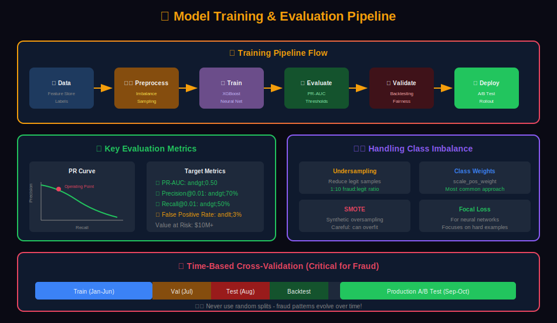
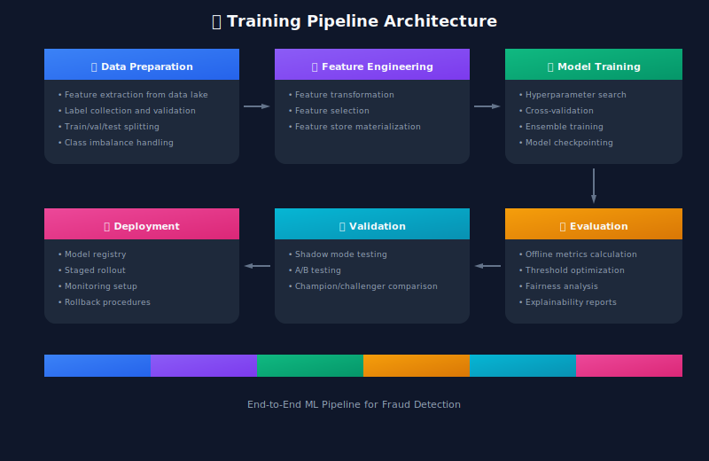
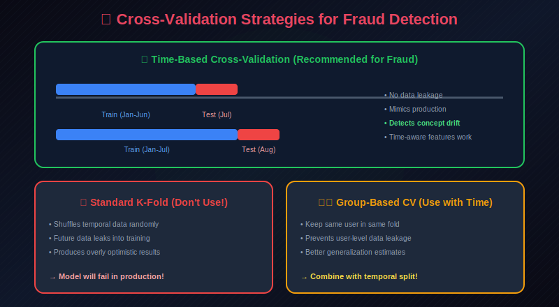

# 🎯 Model Training & Evaluation for Fraud Detection

> Comprehensive guide to training, validating, and evaluating fraud detection models.

---

## 📊 Visual Overview

### Training Pipeline


---

## 📖 Table of Contents

1. [Training Pipeline Overview](#training-pipeline-overview)
2. [Mathematical Foundations](#mathematical-foundations)
3. [Handling Class Imbalance](#handling-class-imbalance)
4. [Training Data Preparation](#training-data-preparation)
5. [Cross-Validation Strategies](#cross-validation-strategies)
6. [Hyperparameter Tuning](#hyperparameter-tuning)
7. [Evaluation Metrics](#evaluation-metrics)
8. [Threshold Selection](#threshold-selection)
9. [Model Validation](#model-validation)
10. [A/B Testing](#ab-testing)
11. [Continuous Training](#continuous-training)

---

## Training Pipeline Overview

### End-to-End Training Pipeline



---

## Mathematical Foundations

### Empirical Risk Minimization

Training seeks to minimize the **empirical risk** over the training set:

```math
\hat{\theta} = \arg\min_\theta \frac{1}{N} \sum_{i=1}^{N} \mathcal{L}(y_i, f(\mathbf{x}_i; \theta)) + \lambda \cdot R(\theta)

```

Where:

- $\mathcal{L}$ is the loss function

- $R(\theta)$ is the regularization term

- $\lambda$ controls regularization strength

### Generalization Theory

The **generalization error** is bounded by:

```math
\mathbb{E}[\mathcal{L}_{\text{test}}] \leq \mathcal{L}_{\text{train}} + O\left(\sqrt{\frac{\text{VC}(f)}{N}}\right)

```

Where $\text{VC}(f)$ is the VC dimension (model complexity). More training data reduces the gap.

### Class Imbalance: Theoretical Treatment

#### Prior Probability Shift

In production, the fraud rate may differ from training:

```math
P_{\text{prod}}(\text{fraud}) \neq P_{\text{train}}(\text{fraud})

```

To correct predictions:

```math
\hat{y}_{\text{corrected}} = \frac{\hat{y} \cdot \pi_{\text{prod}} / \pi_{\text{train}}}{\hat{y} \cdot \pi_{\text{prod}} / \pi_{\text{train}} + (1 - \hat{y}) \cdot (1 - \pi_{\text{prod}}) / (1 - \pi_{\text{train}})}

```

#### SMOTE: Synthetic Minority Oversampling

For each minority sample $\mathbf{x}\_i$, find $k$ nearest neighbors and create synthetic samples:

```math
\mathbf{x}_{\text{new}} = \mathbf{x}_i + \lambda \cdot (\mathbf{x}_{nn} - \mathbf{x}_i)

```

Where $\lambda \sim \text{Uniform}(0, 1)$ and $\mathbf{x}\_{nn}$ is a random neighbor.

### Evaluation Metrics: Mathematical Definitions

#### Precision-Recall Curve

At each threshold $\tau$, compute:

```math
\text{Precision}(\tau) = \frac{\sum_i \mathbb{1}[\hat{y}_i \geq \tau] \cdot \mathbb{1}[y_i = 1]}{\sum_i \mathbb{1}[\hat{y}_i \geq \tau]}
\text{Recall}(\tau) = \frac{\sum_i \mathbb{1}[\hat{y}_i \geq \tau] \cdot \mathbb{1}[y_i = 1]}{\sum_i \mathbb{1}[y_i = 1]}

```

#### Area Under PR Curve (AUPRC)

Using the trapezoidal rule:

```math
\text{AUPRC} \approx \sum_{k=1}^{K-1} \frac{(P_k + P_{k+1})}{2} \cdot (R_k - R_{k+1})

```

#### Average Precision (AP)

```math
\text{AP} = \sum_k (R_k - R_{k-1}) \cdot P_k

```

This is the precision-weighted average over recall levels.

### Optimal Threshold Selection

#### F-beta Optimal Threshold

The threshold maximizing $F\_\beta$ score:

```math
\tau^* = \arg\max_\tau \frac{(1 + \beta^2) \cdot P(\tau) \cdot R(\tau)}{\beta^2 \cdot P(\tau) + R(\tau)}

```

#### Cost-Optimal Threshold

Given costs $C\_{FP}$ (false positive) and $C\_{FN}$ (false negative):

```math
\tau^* = \arg\min_\tau \left[ C_{FP} \cdot FP(\tau) + C_{FN} \cdot FN(\tau) \right]

```

Equivalently, set $\tau^* = \frac{C\_{FP}}{C\_{FP} + C\_{FN}}$ when the model is well-calibrated.

#### Youden's J Statistic

```math
J = \text{Sensitivity} + \text{Specificity} - 1 = TPR - FPR
\tau^* = \arg\max_\tau \left[ TPR(\tau) - FPR(\tau) \right]

```

### Calibration Theory

A model is **calibrated** if:

```math
P(y = 1 | \hat{y} = p) = p \quad \forall p \in [0, 1]

```

#### Expected Calibration Error (ECE)

```math
\text{ECE} = \sum_{b=1}^{B} \frac{|B_b|}{N} \cdot |\text{acc}(B_b) - \text{conf}(B_b)|

```

Where predictions are binned into $B$ buckets, $\text{acc}$ is accuracy, and $\text{conf}$ is average confidence.

#### Platt Scaling

Post-hoc calibration using logistic regression:

```math
\hat{y}_{\text{calibrated}} = \sigma(A \cdot \hat{y}_{\text{raw}} + B)

```

Where $A, B$ are learned on a held-out calibration set.

### Cross-Validation for Time Series

#### Temporal Split (Walk-Forward)

For data ordered by time $t\_1 < t\_2 < \cdots < t\_N$:

- **Fold 1**: Train on $[t\_1, t\_k]$, validate on $[t\_k + \text{gap}, t\_{k+m}]$

- **Fold 2**: Train on $[t\_1, t\_{k+m}]$, validate on $[t\_{k+m+\text{gap}}, t\_{k+2m}]$

The **gap** prevents label leakage from delayed fraud labels (typically 30-90 days).

#### Blocked Cross-Validation

To preserve temporal ordering within folds:

```math
\text{CV}_{\text{blocked}} = \frac{1}{K} \sum_{k=1}^{K} \mathcal{L}(\theta_{-k}; D_k)

```

Where $D\_k$ is a contiguous time block, and $\theta\_{-k}$ is trained on all other blocks.

### Hyperparameter Optimization

#### Bayesian Optimization

Model the objective $f(\mathbf{h})$ with a Gaussian Process:

```math
f(\mathbf{h}) \sim \mathcal{GP}(m(\mathbf{h}), k(\mathbf{h}, \mathbf{h}'))

```

Acquisition function (Expected Improvement):

```math
\text{EI}(\mathbf{h}) = \mathbb{E}[\max(f(\mathbf{h}) - f(\mathbf{h}^+), 0)]

```

Where $\mathbf{h}^+$ is the current best. Next point: $\mathbf{h}\_{\text{next}} = \arg\max\_\mathbf{h} \text{EI}(\mathbf{h})$.

### Statistical Significance Testing

#### McNemar's Test for Model Comparison

Given two models' predictions on the same test set:

```math
\chi^2 = \frac{(b - c)^2}{b + c}

```

Where $b$ = samples correctly classified by model 1 only, $c$ = by model 2 only.

Reject $H\_0$ (models are equivalent) if $\chi^2 > 3.84$ (at $\alpha = 0.05$).

#### Bootstrap Confidence Intervals

For metric $M$, compute bootstrap distribution:

```math
M^{(b)} = M(\mathcal{D}^{(b)}), \quad b = 1, \ldots, B

```

Where $\mathcal{D}^{(b)}$ is a bootstrap resample. The 95% CI is $[M\_{2.5\%}, M\_{97.5\%}]$.

### Pipeline Implementation

```python
from dataclasses import dataclass
from typing import Dict, Any, Optional
import mlflow

@dataclass
class TrainingConfig:
    experiment_name: str
    model_type: str
    feature_set: str
    train_start_date: str
    train_end_date: str
    validation_days: int = 30
    test_days: int = 30
    sampling_strategy: str = 'smote'
    hyperparameter_tuning: bool = True
    n_trials: int = 100

class FraudModelTrainingPipeline:
    """End-to-end training pipeline for fraud detection models"""

    def __init__(self, config: TrainingConfig):
        self.config = config
        self.data_loader = DataLoader()
        self.feature_store = FeatureStore()
        self.model_registry = ModelRegistry()

    def run(self) -> Dict[str, Any]:
        """Execute full training pipeline"""

        mlflow.set_experiment(self.config.experiment_name)

        with mlflow.start_run():
            # Log configuration
            mlflow.log_params(self.config.__dict__)

            # Step 1: Load and prepare data
            print("Step 1: Loading data...")
            train_data, val_data, test_data = self._prepare_data()

            # Step 2: Handle class imbalance
            print("Step 2: Handling class imbalance...")
            train_data = self._handle_imbalance(train_data)

            # Step 3: Feature selection
            print("Step 3: Selecting features...")
            selected_features = self._select_features(train_data)

            # Step 4: Hyperparameter tuning
            print("Step 4: Hyperparameter tuning...")
            if self.config.hyperparameter_tuning:
                best_params = self._tune_hyperparameters(train_data, val_data, selected_features)
            else:
                best_params = self._get_default_params()

            # Step 5: Train final model
            print("Step 5: Training final model...")
            model = self._train_model(train_data, best_params, selected_features)

            # Step 6: Evaluate
            print("Step 6: Evaluating model...")
            metrics = self._evaluate_model(model, test_data, selected_features)

            # Step 7: Find optimal threshold
            print("Step 7: Optimizing threshold...")
            threshold = self._optimize_threshold(model, val_data, selected_features)

            # Log results
            mlflow.log_metrics(metrics)
            mlflow.log_param('optimal_threshold', threshold)

            # Step 8: Save model
            print("Step 8: Saving model...")
            model_path = self._save_model(model, selected_features, threshold)

            return {
                'model_path': model_path,
                'metrics': metrics,
                'threshold': threshold,
                'features': selected_features
            }

    def _prepare_data(self):
        """Load and split data with temporal awareness"""

        # Load features and labels
        data = self.data_loader.load_training_data(
            start_date=self.config.train_start_date,
            end_date=self.config.train_end_date
        )

        # Temporal split (crucial for fraud detection!)
        train_end = pd.to_datetime(self.config.train_end_date)
        val_end = train_end + timedelta(days=self.config.validation_days)

        train_data = data[data['timestamp'] <= train_end]
        val_data = data[(data['timestamp'] > train_end) & (data['timestamp'] <= val_end)]
        test_data = data[data['timestamp'] > val_end]

        print(f"Train: {len(train_data)}, Val: {len(val_data)}, Test: {len(test_data)}")
        print(f"Train fraud rate: {train_data['is_fraud'].mean():.4f}")

        return train_data, val_data, test_data

```

---

## Handling Class Imbalance

### The Imbalance Challenge



### Sampling Techniques

```python
from imblearn.over_sampling import SMOTE, ADASYN
from imblearn.under_sampling import RandomUnderSampler, TomekLinks
from imblearn.combine import SMOTETomek

class ImbalanceHandler:
    """Handle class imbalance in fraud detection"""

    def __init__(self, strategy: str = 'smote'):
        self.strategy = strategy

    def resample(self, X: np.ndarray, y: np.ndarray) -> tuple:
        """Apply resampling strategy"""

        print(f"Original distribution: {np.bincount(y)}")

        if self.strategy == 'smote':
            sampler = SMOTE(
                sampling_strategy=0.3,  # 30% minority ratio
                random_state=42,
                k_neighbors=5
            )

        elif self.strategy == 'adasyn':
            sampler = ADASYN(
                sampling_strategy=0.3,
                random_state=42
            )

        elif self.strategy == 'undersample':
            sampler = RandomUnderSampler(
                sampling_strategy=0.5,  # 50% minority ratio
                random_state=42
            )

        elif self.strategy == 'smote_tomek':
            sampler = SMOTETomek(
                sampling_strategy=0.3,
                random_state=42
            )

        elif self.strategy == 'none':
            return X, y

        X_resampled, y_resampled = sampler.fit_resample(X, y)

        print(f"Resampled distribution: {np.bincount(y_resampled)}")

        return X_resampled, y_resampled

class ClassWeightHandler:
    """Use class weights instead of resampling"""

    def calculate_weights(self, y: np.ndarray) -> Dict[int, float]:
        """Calculate class weights inversely proportional to frequency"""

        class_counts = np.bincount(y)
        total = len(y)

        weights = {
            0: total / (2 * class_counts[0]),
            1: total / (2 * class_counts[1])
        }

        # Normalize
        total_weight = sum(weights.values())
        weights = {k: v / total_weight * 2 for k, v in weights.items()}

        return weights

    def get_sample_weights(self, y: np.ndarray) -> np.ndarray:
        """Get per-sample weights"""

        class_weights = self.calculate_weights(y)
        return np.array([class_weights[label] for label in y])

```

### Cost-Sensitive Learning

```python
class CostSensitiveLoss:
    """Custom loss functions for cost-sensitive learning"""

    @staticmethod
    def weighted_binary_crossentropy(y_true, y_pred, pos_weight=10.0):
        """Binary cross-entropy with higher weight for positives"""

        bce = -(
            pos_weight * y_true * np.log(y_pred + 1e-7) +
            (1 - y_true) * np.log(1 - y_pred + 1e-7)
        )
        return np.mean(bce)

    @staticmethod
    def focal_loss(y_true, y_pred, gamma=2.0, alpha=0.25):
        """Focal loss for handling class imbalance"""

        pt = np.where(y_true == 1, y_pred, 1 - y_pred)
        focal_weight = alpha * (1 - pt) ** gamma

        bce = -np.log(pt + 1e-7)

        return np.mean(focal_weight * bce)

# XGBoost with scale_pos_weight
def train_xgboost_imbalanced(X_train, y_train, X_val, y_val):
    """Train XGBoost with imbalance handling"""

    # Calculate scale_pos_weight
    neg_count = (y_train == 0).sum()
    pos_count = (y_train == 1).sum()
    scale_pos_weight = neg_count / pos_count

    params = {
        'objective': 'binary:logistic',
        'scale_pos_weight': scale_pos_weight,
        'eval_metric': 'aucpr',  # Use PR-AUC for imbalanced data
        'max_depth': 6,
        'learning_rate': 0.1,
        'subsample': 0.8,
        'colsample_bytree': 0.8
    }

    dtrain = xgb.DMatrix(X_train, label=y_train)
    dval = xgb.DMatrix(X_val, label=y_val)

    model = xgb.train(
        params,
        dtrain,
        num_boost_round=1000,
        evals=[(dtrain, 'train'), (dval, 'val')],
        early_stopping_rounds=50,
        verbose_eval=100
    )

    return model

```

---

## Training Data Preparation

### Label Definition and Collection

```python
class LabelCollector:
    """Collect and validate fraud labels"""

    def __init__(self, data_source):
        self.source = data_source

    def collect_labels(self, start_date: str, end_date: str) -> pd.DataFrame:
        """Collect fraud labels from multiple sources"""

        # Chargeback data (ground truth, but delayed)
        chargebacks = self.source.get_chargebacks(start_date, end_date)

        # Manual review outcomes
        reviews = self.source.get_review_outcomes(start_date, end_date)

        # Customer disputes
        disputes = self.source.get_disputes(start_date, end_date)

        # Combine labels
        labels = self._combine_labels(chargebacks, reviews, disputes)

        # Validate labels
        self._validate_labels(labels)

        return labels

    def _combine_labels(self, chargebacks, reviews, disputes) -> pd.DataFrame:
        """Combine labels with priority: chargeback > review > dispute"""

        all_txns = pd.concat([
            chargebacks[['transaction_id', 'is_fraud']].assign(source='chargeback'),
            reviews[['transaction_id', 'is_fraud']].assign(source='review'),
            disputes[['transaction_id', 'is_fraud']].assign(source='dispute')
        ])

        # Priority order
        priority = {'chargeback': 1, 'review': 2, 'dispute': 3}
        all_txns['priority'] = all_txns['source'].map(priority)

        # Keep highest priority label for each transaction
        labels = all_txns.sort_values('priority').drop_duplicates('transaction_id', keep='first')

        return labels[['transaction_id', 'is_fraud', 'source']]

    def _validate_labels(self, labels: pd.DataFrame):
        """Validate label quality"""

        # Check for missing labels
        missing_rate = labels['is_fraud'].isna().mean()
        if missing_rate > 0.01:
            raise ValueError(f"Too many missing labels: {missing_rate:.2%}")

        # Check fraud rate is reasonable
        fraud_rate = labels['is_fraud'].mean()
        if fraud_rate < 0.0001 or fraud_rate > 0.1:
            raise ValueError(f"Unusual fraud rate: {fraud_rate:.4%}")

        print(f"Label validation passed. Fraud rate: {fraud_rate:.4%}")

class LabelMaturityHandler:
    """Handle label maturity (delay between transaction and label)"""

    def __init__(self, maturity_days: int = 90):
        self.maturity_days = maturity_days

    def filter_mature_labels(self, data: pd.DataFrame) -> pd.DataFrame:
        """Only use transactions with mature labels"""

        cutoff_date = datetime.now() - timedelta(days=self.maturity_days)

        mature_data = data[data['timestamp'] < cutoff_date]

        print(f"Filtered to {len(mature_data)} transactions with mature labels")
        print(f"Excluded {len(data) - len(mature_data)} recent transactions")

        return mature_data

```

### Feature-Label Alignment

```python
class TrainingDataBuilder:
    """Build training dataset with proper feature-label alignment"""

    def __init__(self, feature_store, label_collector):
        self.features = feature_store
        self.labels = label_collector

    def build_training_data(self, start_date: str, end_date: str) -> pd.DataFrame:
        """Build training dataset"""

        # Get labels
        labels = self.labels.collect_labels(start_date, end_date)

        # Get features (point-in-time correct!)
        features = []
        for _, row in labels.iterrows():
            txn_features = self.features.get_point_in_time_features(
                transaction_id=row['transaction_id'],
                timestamp=row['timestamp']
            )
            features.append(txn_features)

        features_df = pd.DataFrame(features)

        # Join features and labels
        training_data = features_df.merge(labels, on='transaction_id')

        # Validate no data leakage
        self._check_data_leakage(training_data)

        return training_data

    def _check_data_leakage(self, data: pd.DataFrame):
        """Check for potential data leakage"""

        leakage_features = [
            'is_fraud',  # Label in features
            'chargeback_date',  # Future information
            'dispute_outcome',  # Post-transaction info
        ]

        for col in data.columns:
            if any(leak in col.lower() for leak in leakage_features):
                raise ValueError(f"Potential data leakage: {col}")

```

---

## Cross-Validation Strategies

### Temporal Cross-Validation

```python
from sklearn.model_selection import TimeSeriesSplit

class TemporalCrossValidator:
    """Time-aware cross-validation for fraud detection"""

    def __init__(self, n_splits: int = 5, gap_days: int = 7):
        self.n_splits = n_splits
        self.gap_days = gap_days  # Gap between train and validation

    def split(self, data: pd.DataFrame) -> Iterator[tuple]:
        """Generate temporal train/validation splits"""

        data = data.sort_values('timestamp')

        # Calculate split points
        total_days = (data['timestamp'].max() - data['timestamp'].min()).days
        fold_days = total_days // (self.n_splits + 1)

        for i in range(self.n_splits):
            # Training: all data up to split point
            train_end = data['timestamp'].min() + timedelta(days=(i + 1) * fold_days)

            # Validation: after gap period
            val_start = train_end + timedelta(days=self.gap_days)
            val_end = val_start + timedelta(days=fold_days)

            train_idx = data[data['timestamp'] <= train_end].index
            val_idx = data[(data['timestamp'] >= val_start) & (data['timestamp'] <= val_end)].index

            yield train_idx, val_idx

    def cross_validate(self, model_class, data: pd.DataFrame,
                       features: list, target: str) -> Dict[str, list]:
        """Run cross-validation and collect metrics"""

        metrics = defaultdict(list)

        for fold, (train_idx, val_idx) in enumerate(self.split(data)):
            print(f"\nFold {fold + 1}/{self.n_splits}")

            X_train = data.loc[train_idx, features]
            y_train = data.loc[train_idx, target]
            X_val = data.loc[val_idx, features]
            y_val = data.loc[val_idx, target]

            print(f"Train size: {len(X_train)}, Fraud rate: {y_train.mean():.4f}")
            print(f"Val size: {len(X_val)}, Fraud rate: {y_val.mean():.4f}")

            # Train model
            model = model_class()
            model.fit(X_train, y_train)

            # Predict
            y_pred = model.predict_proba(X_val)

            # Calculate metrics
            fold_metrics = self._calculate_metrics(y_val, y_pred)

            for metric, value in fold_metrics.items():
                metrics[metric].append(value)
                print(f"{metric}: {value:.4f}")

        # Aggregate
        return {
            metric: {
                'mean': np.mean(values),
                'std': np.std(values),
                'values': values
            }
            for metric, values in metrics.items()
        }

```

### Group-Aware Cross-Validation

```python
class GroupAwareCrossValidator:
    """Cross-validation that keeps user groups together"""

    def __init__(self, n_splits: int = 5):
        self.n_splits = n_splits

    def split(self, data: pd.DataFrame, group_col: str = 'user_id') -> Iterator[tuple]:
        """Split keeping groups intact"""

        # Get unique groups
        groups = data[group_col].unique()
        np.random.shuffle(groups)

        # Split groups into folds
        fold_size = len(groups) // self.n_splits

        for i in range(self.n_splits):
            val_groups = groups[i * fold_size:(i + 1) * fold_size]
            train_groups = np.concatenate([
                groups[:i * fold_size],
                groups[(i + 1) * fold_size:]
            ])

            train_idx = data[data[group_col].isin(train_groups)].index
            val_idx = data[data[group_col].isin(val_groups)].index

            yield train_idx, val_idx

```

---

## Hyperparameter Tuning

### Optuna-Based Tuning

```python
import optuna
from optuna.integration import XGBoostPruningCallback

class HyperparameterTuner:
    """Hyperparameter tuning with Optuna"""

    def __init__(self, n_trials: int = 100):
        self.n_trials = n_trials

    def tune_xgboost(self, X_train, y_train, X_val, y_val) -> Dict[str, Any]:
        """Tune XGBoost hyperparameters"""

        def objective(trial):
            params = {
                'objective': 'binary:logistic',
                'eval_metric': 'aucpr',
                'max_depth': trial.suggest_int('max_depth', 3, 10),
                'learning_rate': trial.suggest_float('learning_rate', 0.01, 0.3, log=True),
                'subsample': trial.suggest_float('subsample', 0.6, 1.0),
                'colsample_bytree': trial.suggest_float('colsample_bytree', 0.6, 1.0),
                'min_child_weight': trial.suggest_int('min_child_weight', 1, 20),
                'reg_alpha': trial.suggest_float('reg_alpha', 1e-8, 10, log=True),
                'reg_lambda': trial.suggest_float('reg_lambda', 1e-8, 10, log=True),
                'scale_pos_weight': (y_train == 0).sum() / (y_train == 1).sum()
            }

            dtrain = xgb.DMatrix(X_train, label=y_train)
            dval = xgb.DMatrix(X_val, label=y_val)

            pruning_callback = XGBoostPruningCallback(trial, 'val-aucpr')

            model = xgb.train(
                params,
                dtrain,
                num_boost_round=1000,
                evals=[(dval, 'val')],
                early_stopping_rounds=50,
                callbacks=[pruning_callback],
                verbose_eval=False
            )

            # Return validation PR-AUC
            y_pred = model.predict(dval)
            return average_precision_score(y_val, y_pred)

        # Create study
        study = optuna.create_study(
            direction='maximize',
            pruner=optuna.pruners.MedianPruner(n_warmup_steps=20)
        )

        study.optimize(objective, n_trials=self.n_trials, show_progress_bar=True)

        print(f"Best trial: {study.best_trial.value:.4f}")
        print(f"Best params: {study.best_params}")

        return study.best_params

    def tune_lightgbm(self, X_train, y_train, X_val, y_val) -> Dict[str, Any]:
        """Tune LightGBM hyperparameters"""

        def objective(trial):
            params = {
                'objective': 'binary',
                'metric': 'average_precision',
                'is_unbalance': True,
                'max_depth': trial.suggest_int('max_depth', 3, 12),
                'num_leaves': trial.suggest_int('num_leaves', 20, 150),
                'learning_rate': trial.suggest_float('learning_rate', 0.01, 0.3, log=True),
                'feature_fraction': trial.suggest_float('feature_fraction', 0.6, 1.0),
                'bagging_fraction': trial.suggest_float('bagging_fraction', 0.6, 1.0),
                'bagging_freq': trial.suggest_int('bagging_freq', 1, 7),
                'min_child_samples': trial.suggest_int('min_child_samples', 10, 100),
                'lambda_l1': trial.suggest_float('lambda_l1', 1e-8, 10, log=True),
                'lambda_l2': trial.suggest_float('lambda_l2', 1e-8, 10, log=True),
                'verbose': -1
            }

            train_set = lgb.Dataset(X_train, y_train)
            val_set = lgb.Dataset(X_val, y_val, reference=train_set)

            model = lgb.train(
                params,
                train_set,
                num_boost_round=1000,
                valid_sets=[val_set],
                callbacks=[
                    lgb.early_stopping(50),
                    optuna.integration.LightGBMPruningCallback(trial, 'average_precision')
                ]
            )

            y_pred = model.predict(X_val)
            return average_precision_score(y_val, y_pred)

        study = optuna.create_study(direction='maximize')
        study.optimize(objective, n_trials=self.n_trials)

        return study.best_params

```

---

## Evaluation Metrics

### Metrics for Imbalanced Classification

```python
from sklearn.metrics import (
    precision_score, recall_score, f1_score,
    precision_recall_curve, roc_auc_score,
    average_precision_score, confusion_matrix
)

class FraudMetrics:
    """Comprehensive metrics for fraud detection evaluation"""

    @staticmethod
    def calculate_all_metrics(y_true: np.ndarray, y_pred_proba: np.ndarray,
                              threshold: float = 0.5) -> Dict[str, float]:
        """Calculate all relevant metrics"""

        y_pred = (y_pred_proba >= threshold).astype(int)

        # Confusion matrix
        tn, fp, fn, tp = confusion_matrix(y_true, y_pred).ravel()

        metrics = {
            # Basic metrics
            'precision': precision_score(y_true, y_pred, zero_division=0),
            'recall': recall_score(y_true, y_pred, zero_division=0),
            'f1_score': f1_score(y_true, y_pred, zero_division=0),

            # Threshold-independent metrics
            'roc_auc': roc_auc_score(y_true, y_pred_proba),
            'pr_auc': average_precision_score(y_true, y_pred_proba),

            # Confusion matrix metrics
            'true_positives': tp,
            'false_positives': fp,
            'true_negatives': tn,
            'false_negatives': fn,

            # Rates
            'false_positive_rate': fp / (fp + tn) if (fp + tn) > 0 else 0,
            'false_negative_rate': fn / (fn + tp) if (fn + tp) > 0 else 0,
            'detection_rate': tp / (tp + fn) if (tp + fn) > 0 else 0,

            # Business metrics
            'precision_at_1pct': FraudMetrics.precision_at_recall(y_true, y_pred_proba, 0.01),
            'precision_at_5pct': FraudMetrics.precision_at_recall(y_true, y_pred_proba, 0.05),
            'recall_at_95precision': FraudMetrics.recall_at_precision(y_true, y_pred_proba, 0.95),
        }

        return metrics

    @staticmethod
    def precision_at_recall(y_true, y_pred_proba, target_recall):
        """Find precision at specific recall level"""

        precision, recall, thresholds = precision_recall_curve(y_true, y_pred_proba)

        # Find threshold that achieves target recall
        idx = np.argmin(np.abs(recall - target_recall))

        return precision[idx]

    @staticmethod
    def recall_at_precision(y_true, y_pred_proba, target_precision):
        """Find recall at specific precision level"""

        precision, recall, thresholds = precision_recall_curve(y_true, y_pred_proba)

        # Find threshold that achieves target precision
        valid_idx = precision >= target_precision

        if not valid_idx.any():
            return 0.0

        # Get maximum recall among valid precisions
        return recall[valid_idx].max()

    @staticmethod
    def business_value_metric(y_true, y_pred_proba, threshold,
                             avg_fraud_amount=500, review_cost=10,
                             false_decline_cost=50):
        """Calculate business value of predictions"""

        y_pred = (y_pred_proba >= threshold).astype(int)
        tn, fp, fn, tp = confusion_matrix(y_true, y_pred).ravel()

        # Value calculation
        fraud_caught_value = tp * avg_fraud_amount  # Money saved
        fraud_missed_cost = fn * avg_fraud_amount   # Money lost
        false_decline_cost = fp * false_decline_cost  # Customer impact
        review_cost = (tp + fp) * review_cost  # Operational cost

        net_value = fraud_caught_value - fraud_missed_cost - false_decline_cost - review_cost

        return {
            'net_value': net_value,
            'fraud_caught_value': fraud_caught_value,
            'fraud_missed_cost': fraud_missed_cost,
            'false_decline_cost': false_decline_cost,
            'review_cost': review_cost
        }

```

### Visualization

```python
import matplotlib.pyplot as plt
import seaborn as sns

class MetricsVisualizer:
    """Visualize model performance metrics"""

    @staticmethod
    def plot_precision_recall_curve(y_true, y_pred_proba, title="Precision-Recall Curve"):
        """Plot precision-recall curve with thresholds"""

        precision, recall, thresholds = precision_recall_curve(y_true, y_pred_proba)
        pr_auc = average_precision_score(y_true, y_pred_proba)

        fig, (ax1, ax2) = plt.subplots(1, 2, figsize=(14, 5))

        # PR Curve
        ax1.plot(recall, precision, 'b-', label=f'PR AUC = {pr_auc:.3f}')
        ax1.axhline(y=y_true.mean(), color='r', linestyle='--', label='Baseline')
        ax1.set_xlabel('Recall')
        ax1.set_ylabel('Precision')
        ax1.set_title(title)
        ax1.legend()
        ax1.grid(True)

        # Precision/Recall vs Threshold
        ax2.plot(thresholds, precision[:-1], 'b-', label='Precision')
        ax2.plot(thresholds, recall[:-1], 'g-', label='Recall')
        ax2.set_xlabel('Threshold')
        ax2.set_ylabel('Score')
        ax2.set_title('Precision and Recall vs Threshold')
        ax2.legend()
        ax2.grid(True)

        plt.tight_layout()
        return fig

    @staticmethod
    def plot_score_distribution(y_true, y_pred_proba):
        """Plot score distribution by class"""

        fig, ax = plt.subplots(figsize=(10, 6))

        ax.hist(y_pred_proba[y_true == 0], bins=50, alpha=0.5,
                label='Legitimate', density=True)
        ax.hist(y_pred_proba[y_true == 1], bins=50, alpha=0.5,
                label='Fraud', density=True)

        ax.set_xlabel('Fraud Score')
        ax.set_ylabel('Density')
        ax.set_title('Score Distribution by Class')
        ax.legend()
        ax.grid(True)

        return fig

    @staticmethod
    def plot_confusion_matrix(y_true, y_pred, title="Confusion Matrix"):
        """Plot confusion matrix"""

        cm = confusion_matrix(y_true, y_pred)

        fig, ax = plt.subplots(figsize=(8, 6))
        sns.heatmap(cm, annot=True, fmt='d', cmap='Blues', ax=ax)
        ax.set_xlabel('Predicted')
        ax.set_ylabel('Actual')
        ax.set_title(title)
        ax.set_xticklabels(['Legitimate', 'Fraud'])
        ax.set_yticklabels(['Legitimate', 'Fraud'])

        return fig

```

---

## Threshold Selection

### Optimal Threshold Finding

```python
class ThresholdOptimizer:
    """Find optimal decision threshold"""

    def find_optimal_threshold(self, y_true, y_pred_proba,
                               method: str = 'f1') -> float:
        """Find optimal threshold using specified method"""

        if method == 'f1':
            return self._optimize_f1(y_true, y_pred_proba)
        elif method == 'precision_recall_balance':
            return self._optimize_pr_balance(y_true, y_pred_proba)
        elif method == 'business_value':
            return self._optimize_business_value(y_true, y_pred_proba)
        elif method == 'target_precision':
            return self._find_threshold_for_precision(y_true, y_pred_proba, target=0.95)
        elif method == 'target_recall':
            return self._find_threshold_for_recall(y_true, y_pred_proba, target=0.80)
        else:
            raise ValueError(f"Unknown method: {method}")

    def _optimize_f1(self, y_true, y_pred_proba) -> float:
        """Find threshold that maximizes F1 score"""

        precision, recall, thresholds = precision_recall_curve(y_true, y_pred_proba)

        f1_scores = 2 * (precision * recall) / (precision + recall + 1e-8)

        best_idx = np.argmax(f1_scores)

        return thresholds[min(best_idx, len(thresholds) - 1)]

    def _optimize_pr_balance(self, y_true, y_pred_proba) -> float:
        """Find threshold where precision equals recall"""

        precision, recall, thresholds = precision_recall_curve(y_true, y_pred_proba)

        diff = np.abs(precision - recall)
        best_idx = np.argmin(diff)

        return thresholds[min(best_idx, len(thresholds) - 1)]

    def _optimize_business_value(self, y_true, y_pred_proba) -> float:
        """Find threshold that maximizes business value"""

        thresholds = np.arange(0.1, 0.95, 0.01)
        best_value = -float('inf')
        best_threshold = 0.5

        for threshold in thresholds:
            metrics = FraudMetrics.business_value_metric(
                y_true, y_pred_proba, threshold
            )

            if metrics['net_value'] > best_value:
                best_value = metrics['net_value']
                best_threshold = threshold

        return best_threshold

    def _find_threshold_for_precision(self, y_true, y_pred_proba, target: float) -> float:
        """Find lowest threshold that achieves target precision"""

        precision, recall, thresholds = precision_recall_curve(y_true, y_pred_proba)

        # Find thresholds that achieve target precision
        valid_idx = np.where(precision >= target)[0]

        if len(valid_idx) == 0:
            return 0.99  # Very high threshold

        # Return lowest threshold (highest recall) that achieves precision
        return thresholds[valid_idx[0]]

```

---

## Model Validation

### Shadow Mode Testing

```python
class ShadowModeValidator:
    """Validate model in shadow mode before production"""

    def __init__(self, production_model, challenger_model):
        self.production = production_model
        self.challenger = challenger_model
        self.results = []

    async def shadow_score(self, transaction: dict) -> dict:
        """Score with both models, only use production decision"""

        # Production model (used for decision)
        prod_score = await self.production.predict(transaction)

        # Challenger model (shadow, not used for decision)
        challenger_score = await self.challenger.predict(transaction)

        # Log for comparison
        result = {
            'transaction_id': transaction['id'],
            'timestamp': datetime.utcnow(),
            'production_score': prod_score,
            'challenger_score': challenger_score,
            'score_diff': challenger_score - prod_score
        }

        self.results.append(result)

        # Return production decision
        return {'score': prod_score, 'model': 'production'}

    def analyze_shadow_results(self, feedback_data: pd.DataFrame) -> dict:
        """Analyze shadow mode results"""

        results_df = pd.DataFrame(self.results)

        # Join with feedback
        analysis = results_df.merge(
            feedback_data[['transaction_id', 'is_fraud']],
            on='transaction_id'
        )

        # Calculate metrics for both models
        prod_metrics = FraudMetrics.calculate_all_metrics(
            analysis['is_fraud'].values,
            analysis['production_score'].values
        )

        challenger_metrics = FraudMetrics.calculate_all_metrics(
            analysis['is_fraud'].values,
            analysis['challenger_score'].values
        )

        # Comparison
        comparison = {
            'production': prod_metrics,
            'challenger': challenger_metrics,
            'pr_auc_improvement': challenger_metrics['pr_auc'] - prod_metrics['pr_auc'],
            'precision_improvement': challenger_metrics['precision'] - prod_metrics['precision'],
            'recall_improvement': challenger_metrics['recall'] - prod_metrics['recall']
        }

        return comparison

```

---

## A/B Testing

### Experiment Framework

```python
class FraudModelExperiment:
    """A/B testing framework for fraud models"""

    def __init__(self, control_model, treatment_model, split_ratio: float = 0.1):
        self.control = control_model
        self.treatment = treatment_model
        self.split_ratio = split_ratio
        self.experiment_log = []

    def get_assignment(self, user_id: str) -> str:
        """Deterministic assignment based on user_id"""

        hash_val = int(hashlib.md5(user_id.encode()).hexdigest(), 16)

        if (hash_val % 100) < (self.split_ratio * 100):
            return 'treatment'
        return 'control'

    async def score(self, transaction: dict) -> dict:
        """Score using assigned model"""

        assignment = self.get_assignment(transaction['user_id'])

        if assignment == 'treatment':
            score = await self.treatment.predict(transaction)
            model_version = self.treatment.version
        else:
            score = await self.control.predict(transaction)
            model_version = self.control.version

        # Log assignment
        self.experiment_log.append({
            'transaction_id': transaction['id'],
            'user_id': transaction['user_id'],
            'assignment': assignment,
            'model_version': model_version,
            'score': score,
            'timestamp': datetime.utcnow()
        })

        return {'score': score, 'assignment': assignment}

    def analyze_experiment(self, feedback_data: pd.DataFrame) -> dict:
        """Analyze A/B test results with statistical significance"""

        log_df = pd.DataFrame(self.experiment_log)

        # Join with outcomes
        results = log_df.merge(feedback_data, on='transaction_id')

        control_results = results[results['assignment'] == 'control']
        treatment_results = results[results['assignment'] == 'treatment']

        # Calculate metrics
        control_metrics = self._calculate_group_metrics(control_results)
        treatment_metrics = self._calculate_group_metrics(treatment_results)

        # Statistical significance test
        significance = self._test_significance(control_results, treatment_results)

        return {
            'control': control_metrics,
            'treatment': treatment_metrics,
            'significance': significance,
            'recommendation': self._make_recommendation(control_metrics, treatment_metrics, significance)
        }

    def _test_significance(self, control, treatment) -> dict:
        """Test statistical significance of differences"""

        from scipy import stats

        # Chi-square test for detection rate difference
        control_detected = control['is_fraud_detected'].sum()
        control_total = len(control)
        treatment_detected = treatment['is_fraud_detected'].sum()
        treatment_total = len(treatment)

        contingency = [
            [control_detected, control_total - control_detected],
            [treatment_detected, treatment_total - treatment_detected]
        ]

        chi2, p_value, dof, expected = stats.chi2_contingency(contingency)

        return {
            'chi2': chi2,
            'p_value': p_value,
            'is_significant': p_value < 0.05
        }

```

---

## Continuous Training

### Automated Retraining Pipeline

```python
class ContinuousTrainingPipeline:
    """Automated model retraining pipeline"""

    def __init__(self, config: dict):
        self.config = config
        self.training_pipeline = FraudModelTrainingPipeline(config)
        self.model_registry = ModelRegistry()
        self.drift_detector = DriftDetector()

    async def check_and_retrain(self) -> Optional[dict]:
        """Check if retraining is needed and execute if so"""

        # Check for drift
        drift_detected = await self.drift_detector.check_drift()

        # Check for performance degradation
        perf_degraded = await self._check_performance_degradation()

        # Check if enough new data
        new_data_available = await self._check_new_data()

        should_retrain = (
            drift_detected or
            perf_degraded or
            (new_data_available and self._days_since_last_training() > 7)
        )

        if should_retrain:
            return await self._execute_retraining()

        return None

    async def _execute_retraining(self) -> dict:
        """Execute full retraining pipeline"""

        # Train new model
        result = self.training_pipeline.run()

        # Compare with production model
        comparison = await self._compare_with_production(result)

        if comparison['should_deploy']:
            # Deploy new model
            await self._deploy_model(result)

            return {
                'status': 'deployed',
                'new_model': result,
                'comparison': comparison
            }
        else:
            return {
                'status': 'trained_not_deployed',
                'new_model': result,
                'comparison': comparison,
                'reason': comparison['reason']
            }

    async def _compare_with_production(self, new_result: dict) -> dict:
        """Compare new model with production"""

        production_model = self.model_registry.get_production_model()

        # Evaluate on holdout set
        holdout_data = await self._get_holdout_data()

        prod_metrics = self._evaluate(production_model, holdout_data)
        new_metrics = new_result['metrics']

        # Decision criteria
        pr_auc_improvement = new_metrics['pr_auc'] - prod_metrics['pr_auc']

        should_deploy = (
            pr_auc_improvement > 0.01 and  # At least 1% improvement
            new_metrics['precision'] >= prod_metrics['precision'] * 0.95  # No precision regression
        )

        return {
            'should_deploy': should_deploy,
            'pr_auc_improvement': pr_auc_improvement,
            'production_metrics': prod_metrics,
            'new_metrics': new_metrics,
            'reason': 'Insufficient improvement' if not should_deploy else None
        }

```

---

## Summary

Key training and evaluation practices for fraud detection:

1. **Handle imbalance carefully**: Use SMOTE, class weights, or cost-sensitive learning
2. **Temporal validation**: Always use time-based splits, never random
3. **Right metrics**: Focus on PR-AUC and precision at recall, not accuracy
4. **Business metrics**: Tie model performance to dollar value
5. **Continuous improvement**: Automated retraining with drift detection

---

## Next Steps

Continue to [Chapter 8: Feature Store →](../08_feature_store/)

---

## Code Examples

See the `code/` directory for:

- `training/` - Training pipeline implementation

- `evaluation/` - Metrics and visualization

- `experiments/` - A/B testing framework

- `continuous/` - Continuous training utilities

---

<div align="center">

**[⬆ Back to Top](#)** | **[📚 Main Repository](https://github.com/Gaurav14cs17/ml_system_design)**

Made with 💜 by [Gaurav14cs17](https://github.com/Gaurav14cs17)

</div>
