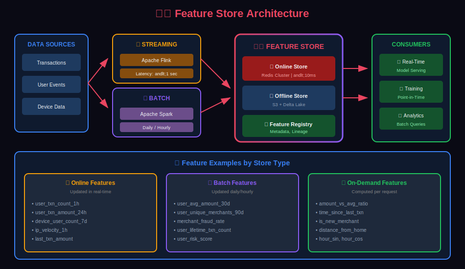
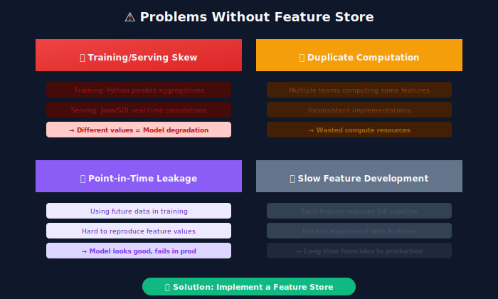
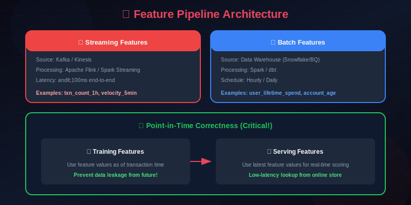
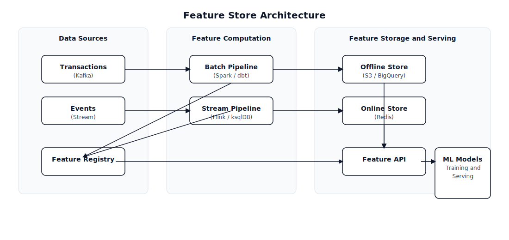
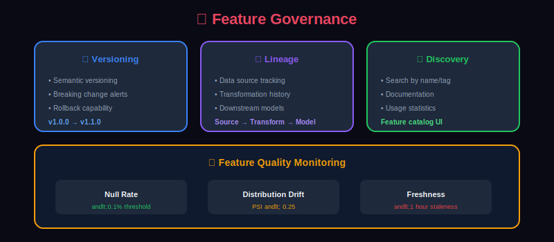

# 🗄️ Feature Store for Fraud Detection

> Building and managing feature infrastructure for real-time and batch fraud detection.

---

## 📊 Visual Overview

### Feature Store Architecture


---

## 📖 Table of Contents

1. [Why Feature Stores?](#why-feature-stores)
2. [Feature Store Architecture](#feature-store-architecture)
3. [Online vs Offline Features](#online-vs-offline-features)
4. [Feature Computation Pipelines](#feature-computation-pipelines)
5. [Point-in-Time Correctness](#point-in-time-correctness)
6. [Feature Store Implementations](#feature-store-implementations)
7. [Feature Management](#feature-management)
8. [Monitoring Features](#monitoring-features)
9. [Best Practices](#best-practices)

---

## Why Feature Stores?

### The Feature Management Challenge



### Feature Store Benefits



---

## Feature Store Architecture

### High-Level Architecture



### Component Responsibilities

| Component | Purpose | Technology Options |
|-----------|---------|-------------------|
| Offline Store | Historical features for training | S3, BigQuery, Snowflake |
| Online Store | Low-latency features for serving | Redis, DynamoDB, Bigtable |
| Feature Registry | Feature metadata and discovery | Custom DB, Feast, Tecton |
| Batch Pipeline | Compute historical aggregations | Spark, dbt, Airflow |
| Stream Pipeline | Real-time feature updates | Flink, Kafka Streams |

---

## Online vs Offline Features

### Comparison

```python
# Offline features - for training
offline_features = {
    'user_txn_count_30d': {
        'computation': 'batch',
        'freshness': 'daily',
        'storage': 's3/bigquery',
        'use_case': 'training, batch predictions'
    },
    'user_avg_amount_90d': {
        'computation': 'batch',
        'freshness': 'daily',
        'storage': 's3/bigquery',
        'use_case': 'training'
    }
}

# Online features - for real-time serving
online_features = {
    'user_txn_count_1h': {
        'computation': 'streaming',
        'freshness': 'seconds',
        'storage': 'redis',
        'use_case': 'real-time scoring'
    },
    'user_last_txn_amount': {
        'computation': 'streaming',
        'freshness': 'immediate',
        'storage': 'redis',
        'use_case': 'real-time scoring'
    }
}

```

### Feature Classification

```yaml
Feature Classification by Latency:

Precomputed (Batch):
  update_frequency: daily/hourly
  latency: milliseconds (cache lookup)
  examples:
    - user_lifetime_txn_count
    - user_avg_amount_30d
    - merchant_fraud_rate_90d
    - device_reputation_score

Precomputed (Streaming):
  update_frequency: real-time
  latency: milliseconds (cache lookup)
  examples:
    - user_txn_count_1h
    - user_amount_sum_24h
    - device_user_count_7d
    - ip_txn_velocity_1h

On-Demand (Computed at Request):
  update_frequency: per-request
  latency: adds to request time
  examples:
    - amount_vs_user_avg_ratio
    - time_since_last_txn
    - is_new_merchant_for_user
    - distance_from_home

```

---

## Feature Computation Pipelines

### Batch Feature Pipeline (Spark)

```python
from pyspark.sql import SparkSession
from pyspark.sql import functions as F
from pyspark.sql.window import Window
from datetime import datetime, timedelta

class BatchFeaturePipeline:
    """Compute batch features using Spark"""

    def __init__(self, spark: SparkSession):
        self.spark = spark

    def compute_user_features(self, as_of_date: str) -> DataFrame:
        """Compute user-level features as of a specific date"""

        # Load transactions up to as_of_date
        transactions = self.spark.read.parquet("s3://data-lake/transactions/") \
            .filter(F.col("timestamp") < as_of_date)

        # Define time windows
        end_date = F.lit(as_of_date).cast("timestamp")

        user_features = transactions.groupBy("user_id").agg(
            # Lifetime aggregations
            F.count("*").alias("user_lifetime_txn_count"),
            F.sum("amount").alias("user_lifetime_amount"),
            F.avg("amount").alias("user_avg_amount_all_time"),

            # 30-day aggregations
            F.count(F.when(
                F.col("timestamp") >= F.date_sub(end_date, 30), 1
            )).alias("user_txn_count_30d"),

            F.sum(F.when(
                F.col("timestamp") >= F.date_sub(end_date, 30), F.col("amount")
            )).alias("user_amount_sum_30d"),

            # Unique counts
            F.countDistinct(F.when(
                F.col("timestamp") >= F.date_sub(end_date, 30), F.col("merchant_id")
            )).alias("user_unique_merchants_30d"),

            # Fraud history
            F.sum(F.when(F.col("is_fraud") == 1, 1).otherwise(0)).alias("user_fraud_count"),

            # Recency
            F.max("timestamp").alias("user_last_txn_time"),
            F.datediff(end_date, F.max("timestamp")).alias("user_days_since_last_txn")
        )

        return user_features

    def compute_merchant_features(self, as_of_date: str) -> DataFrame:
        """Compute merchant-level features"""

        transactions = self.spark.read.parquet("s3://data-lake/transactions/") \
            .filter(F.col("timestamp") < as_of_date) \
            .filter(F.col("timestamp") >= F.date_sub(F.lit(as_of_date), 90))

        merchant_features = transactions.groupBy("merchant_id").agg(
            F.count("*").alias("merchant_txn_count_90d"),
            F.sum("amount").alias("merchant_amount_90d"),
            F.avg("amount").alias("merchant_avg_amount"),
            F.stddev("amount").alias("merchant_std_amount"),

            # Fraud rate
            (F.sum(F.when(F.col("is_fraud") == 1, 1).otherwise(0)) / F.count("*"))
                .alias("merchant_fraud_rate"),

            # Customer metrics
            F.countDistinct("user_id").alias("merchant_unique_customers"),

            # Decline rate
            (F.sum(F.when(F.col("is_declined") == 1, 1).otherwise(0)) / F.count("*"))
                .alias("merchant_decline_rate")
        )

        return merchant_features

    def materialize_to_offline_store(self, features: DataFrame,
                                     feature_group: str,
                                     as_of_date: str):
        """Write features to offline store"""

        features \
            .withColumn("feature_timestamp", F.lit(as_of_date).cast("timestamp")) \
            .write \
            .mode("overwrite") \
            .partitionBy("feature_timestamp") \
            .parquet(f"s3://feature-store/{feature_group}/")

```

### Streaming Feature Pipeline (Flink)

```python
from pyflink.datastream import StreamExecutionEnvironment
from pyflink.table import StreamTableEnvironment

class StreamingFeaturePipeline:
    """Real-time feature computation using Flink"""

    def __init__(self):
        self.env = StreamExecutionEnvironment.get_execution_environment()
        self.t_env = StreamTableEnvironment.create(self.env)

    def setup_velocity_features(self):
        """Setup streaming velocity feature computation"""

        # Define transaction source
        self.t_env.execute_sql("""
            CREATE TABLE transactions (
                transaction_id STRING,
                user_id STRING,
                merchant_id STRING,
                amount DECIMAL(10, 2),
                timestamp TIMESTAMP(3),
                WATERMARK FOR timestamp AS timestamp - INTERVAL '5' SECOND
            ) WITH (
                'connector' = 'kafka',
                'topic' = 'transactions',
                'properties.bootstrap.servers' = 'kafka:9092',
                'format' = 'json'
            )
        """)

        # Define Redis sink
        self.t_env.execute_sql("""
            CREATE TABLE user_velocity_features (
                user_id STRING,
                window_start TIMESTAMP(3),
                txn_count_1h BIGINT,
                txn_amount_1h DECIMAL(10, 2),
                unique_merchants_1h BIGINT,
                PRIMARY KEY (user_id) NOT ENFORCED
            ) WITH (
                'connector' = 'redis',
                'hostname' = 'redis',
                'port' = '6379',
                'command' = 'SET'
            )
        """)

        # Compute tumbling window aggregations
        self.t_env.execute_sql("""
            INSERT INTO user_velocity_features
            SELECT
                user_id,
                TUMBLE_START(timestamp, INTERVAL '1' HOUR) as window_start,
                COUNT(*) as txn_count_1h,
                SUM(amount) as txn_amount_1h,
                COUNT(DISTINCT merchant_id) as unique_merchants_1h
            FROM transactions
            GROUP BY
                user_id,
                TUMBLE(timestamp, INTERVAL '1' HOUR)
        """)

class RedisVelocityCounter:
    """Real-time velocity features using Redis"""

    def __init__(self, redis_client):
        self.redis = redis_client

    async def update_velocity(self, transaction: dict):
        """Update velocity counters on new transaction"""

        user_id = transaction['user_id']
        amount = transaction['amount']
        timestamp = int(transaction['timestamp'].timestamp())

        pipe = self.redis.pipeline()

        # Add to sorted set (score = timestamp)
        pipe.zadd(f"user:{user_id}:txns", {transaction['id']: timestamp})
        pipe.zadd(f"user:{user_id}:amounts", {str(amount): timestamp})

        # Trim old entries (keep last 24 hours)
        cutoff = timestamp - 86400
        pipe.zremrangebyscore(f"user:{user_id}:txns", 0, cutoff)
        pipe.zremrangebyscore(f"user:{user_id}:amounts", 0, cutoff)

        # Set expiry
        pipe.expire(f"user:{user_id}:txns", 86400 * 2)
        pipe.expire(f"user:{user_id}:amounts", 86400 * 2)

        await pipe.execute()

    async def get_velocity_features(self, user_id: str) -> dict:
        """Get current velocity features"""

        now = int(datetime.now().timestamp())

        pipe = self.redis.pipeline()

        # Count transactions in different windows
        windows = {
            '1m': 60,
            '5m': 300,
            '1h': 3600,
            '24h': 86400
        }

        for window_name, seconds in windows.items():
            cutoff = now - seconds
            pipe.zcount(f"user:{user_id}:txns", cutoff, now)
            pipe.zrangebyscore(f"user:{user_id}:amounts", cutoff, now)

        results = await pipe.execute()

        features = {}
        idx = 0
        for window_name in windows:
            features[f'txn_count_{window_name}'] = results[idx]
            amounts = [float(a) for a in results[idx + 1]]
            features[f'txn_amount_{window_name}'] = sum(amounts) if amounts else 0
            features[f'txn_avg_{window_name}'] = np.mean(amounts) if amounts else 0
            idx += 2

        return features

```

---

## Point-in-Time Correctness

### The Data Leakage Problem



### Implementation

```python
class PointInTimeFeatureStore:
    """Feature store with point-in-time correct feature retrieval"""

    def __init__(self, offline_store, online_store):
        self.offline = offline_store
        self.online = online_store

    def get_training_features(self, entity_df: pd.DataFrame,
                              feature_views: list) -> pd.DataFrame:
        """Get point-in-time correct features for training"""

        # entity_df has: entity_id, event_timestamp

        all_features = entity_df.copy()

        for feature_view in feature_views:
            # Get feature history
            feature_history = self.offline.read_feature_view(feature_view)

            # Point-in-time join
            pit_features = self._point_in_time_join(
                entity_df=entity_df,
                feature_df=feature_history,
                entity_column=feature_view.entity_column,
                timestamp_column='feature_timestamp'
            )

            all_features = all_features.merge(
                pit_features,
                on=['entity_id', 'event_timestamp'],
                how='left'
            )

        return all_features

    def _point_in_time_join(self, entity_df: pd.DataFrame,
                           feature_df: pd.DataFrame,
                           entity_column: str,
                           timestamp_column: str) -> pd.DataFrame:
        """Perform point-in-time correct join"""

        # Sort both dataframes
        entity_df = entity_df.sort_values(['entity_id', 'event_timestamp'])
        feature_df = feature_df.sort_values([entity_column, timestamp_column])

        # For each entity event, find the most recent feature value
        results = []

        for _, entity_row in entity_df.iterrows():
            entity_id = entity_row['entity_id']
            event_ts = entity_row['event_timestamp']

            # Filter to entity and before event time
            entity_features = feature_df[
                (feature_df[entity_column] == entity_id) &
                (feature_df[timestamp_column] <= event_ts)
            ]

            if len(entity_features) > 0:
                # Get most recent feature row
                latest_features = entity_features.iloc[-1].to_dict()
            else:
                # No features available (cold start)
                latest_features = {col: None for col in feature_df.columns}

            latest_features['entity_id'] = entity_id
            latest_features['event_timestamp'] = event_ts
            results.append(latest_features)

        return pd.DataFrame(results)

    def get_online_features(self, entity_keys: dict) -> dict:
        """Get current features for real-time serving"""

        features = {}

        for entity_type, entity_id in entity_keys.items():
            entity_features = self.online.get(f"{entity_type}:{entity_id}")

            if entity_features:
                features.update(entity_features)
            else:
                # Return defaults for missing entities
                features.update(self._get_default_features(entity_type))

        return features

```

---

## Feature Store Implementations

### Feast Implementation

```python
from feast import FeatureStore, Entity, Feature, FeatureView, ValueType
from feast.data_source import BigQuerySource, FileSource
from datetime import timedelta

# Initialize store
store = FeatureStore(repo_path="feature_repo/")

# Define entities
user = Entity(
    name="user_id",
    value_type=ValueType.STRING,
    description="User identifier"
)

merchant = Entity(
    name="merchant_id",
    value_type=ValueType.STRING,
    description="Merchant identifier"
)

# Define data source
user_features_source = BigQuerySource(
    table="project.dataset.user_features",
    timestamp_field="feature_timestamp",
    created_timestamp_column="created_at"
)

# Define feature view
user_transaction_stats = FeatureView(
    name="user_transaction_stats",
    entities=["user_id"],
    ttl=timedelta(days=1),
    features=[
        Feature(name="txn_count_30d", dtype=ValueType.INT64),
        Feature(name="txn_amount_30d", dtype=ValueType.FLOAT),
        Feature(name="avg_amount_30d", dtype=ValueType.FLOAT),
        Feature(name="unique_merchants_30d", dtype=ValueType.INT64),
        Feature(name="fraud_count_lifetime", dtype=ValueType.INT64),
    ],
    online=True,
    batch_source=user_features_source
)

# Apply feature definitions
store.apply([user, merchant, user_transaction_stats])

# Materialize to online store
store.materialize(
    start_date=datetime.now() - timedelta(days=1),
    end_date=datetime.now()
)

# Retrieve features for training
training_df = store.get_historical_features(
    entity_df=entity_df,  # Has user_id and event_timestamp
    features=[
        "user_transaction_stats:txn_count_30d",
        "user_transaction_stats:avg_amount_30d",
        "user_transaction_stats:unique_merchants_30d"
    ]
).to_df()

# Retrieve features for serving
online_features = store.get_online_features(
    features=[
        "user_transaction_stats:txn_count_30d",
        "user_transaction_stats:avg_amount_30d"
    ],
    entity_rows=[{"user_id": "user123"}]
).to_dict()

```

### Custom Feature Store

```python
class CustomFeatureStore:
    """Custom feature store implementation"""

    def __init__(self, config: dict):
        # Offline store (S3 + Spark)
        self.offline_store = S3FeatureStore(config['s3_bucket'])

        # Online store (Redis cluster)
        self.online_store = RedisFeatureStore(config['redis_url'])

        # Feature registry (PostgreSQL)
        self.registry = FeatureRegistry(config['registry_db'])

    def register_feature_view(self, feature_view: FeatureViewConfig):
        """Register a new feature view"""

        self.registry.register(feature_view)

        # Setup compute pipeline if needed
        if feature_view.compute_config:
            self._setup_compute_pipeline(feature_view)

    def get_online_features(self, entity_type: str,
                           entity_id: str,
                           features: list) -> dict:
        """Get features from online store"""

        cache_key = f"{entity_type}:{entity_id}"

        # Get from Redis
        cached = self.online_store.hgetall(cache_key)

        if not cached:
            return self._get_default_features(entity_type, features)

        # Filter to requested features
        return {f: cached.get(f) for f in features}

    def get_historical_features(self, entity_df: pd.DataFrame,
                                feature_views: list) -> pd.DataFrame:
        """Get point-in-time correct historical features"""

        result = entity_df.copy()

        for view_name in feature_views:
            view_config = self.registry.get_view(view_name)

            # Read from offline store
            feature_data = self.offline_store.read_parquet(view_config.path)

            # Point-in-time join
            joined = self._pit_join(
                entity_df,
                feature_data,
                view_config.entity_column,
                view_config.timestamp_column
            )

            result = result.merge(joined, on=['entity_id', 'event_timestamp'])

        return result

    def materialize_to_online(self, feature_view: str,
                             as_of_date: datetime):
        """Materialize offline features to online store"""

        view_config = self.registry.get_view(feature_view)

        # Read latest features from offline
        features = self.offline_store.read_latest(view_config.path)

        # Write to Redis
        pipe = self.online_store.pipeline()

        for _, row in features.iterrows():
            entity_key = f"{view_config.entity}:{row[view_config.entity_column]}"

            feature_dict = row[view_config.features].to_dict()
            pipe.hset(entity_key, mapping=feature_dict)
            pipe.expire(entity_key, view_config.ttl_seconds)

        pipe.execute()

```

---

## Feature Management

### Feature Registry

```python
from dataclasses import dataclass
from typing import List, Optional
from datetime import timedelta

@dataclass
class FeatureDefinition:
    name: str
    dtype: str
    description: str
    entity: str
    computation: str  # 'batch' or 'streaming'
    source: str
    transformation: Optional[str] = None

@dataclass
class FeatureViewDefinition:
    name: str
    entity: str
    features: List[FeatureDefinition]
    ttl: timedelta
    online: bool
    batch_source: str
    stream_source: Optional[str] = None
    owner: str = ""
    tags: List[str] = None

class FeatureRegistry:
    """Central registry for feature definitions"""

    def __init__(self, db_connection):
        self.db = db_connection

    def register_feature(self, feature: FeatureDefinition):
        """Register a new feature"""

        # Validate feature
        self._validate_feature(feature)

        # Check for duplicates
        if self.get_feature(feature.name):
            raise ValueError(f"Feature {feature.name} already exists")

        # Store in registry
        self.db.execute("""
            INSERT INTO features (name, dtype, description, entity,
                                 computation, source, transformation)
            VALUES (?, ?, ?, ?, ?, ?, ?)
        """, (feature.name, feature.dtype, feature.description,
              feature.entity, feature.computation, feature.source,
              feature.transformation))

        return feature

    def get_feature(self, name: str) -> Optional[FeatureDefinition]:
        """Get feature definition"""

        result = self.db.execute(
            "SELECT * FROM features WHERE name = ?", (name,)
        ).fetchone()

        if result:
            return FeatureDefinition(**result)
        return None

    def search_features(self, query: str = None,
                       entity: str = None,
                       tags: List[str] = None) -> List[FeatureDefinition]:
        """Search feature catalog"""

        sql = "SELECT * FROM features WHERE 1=1"
        params = []

        if query:
            sql += " AND (name LIKE ? OR description LIKE ?)"
            params.extend([f"%{query}%", f"%{query}%"])

        if entity:
            sql += " AND entity = ?"
            params.append(entity)

        results = self.db.execute(sql, params).fetchall()

        return [FeatureDefinition(**r) for r in results]

    def get_feature_lineage(self, feature_name: str) -> dict:
        """Get feature lineage (source → transformations → feature)"""

        feature = self.get_feature(feature_name)

        return {
            'feature': feature_name,
            'source': feature.source,
            'transformation': feature.transformation,
            'created_by': feature.owner,
            'dependencies': self._get_dependencies(feature_name)
        }

```

### Feature Versioning

```python
class FeatureVersionManager:
    """Manage feature versions"""

    def __init__(self, registry: FeatureRegistry):
        self.registry = registry

    def create_version(self, feature_name: str,
                      new_definition: FeatureDefinition) -> str:
        """Create new version of a feature"""

        # Get current version
        current = self.registry.get_feature(feature_name)
        current_version = current.version if current else 0

        # Create new version
        new_version = current_version + 1
        new_definition.version = new_version
        new_definition.name = f"{feature_name}_v{new_version}"

        self.registry.register_feature(new_definition)

        # Update alias to point to new version
        self.registry.update_alias(feature_name, new_definition.name)

        return new_definition.name

    def rollback_version(self, feature_name: str, target_version: int):
        """Rollback to previous version"""

        version_name = f"{feature_name}_v{target_version}"

        if not self.registry.get_feature(version_name):
            raise ValueError(f"Version {target_version} not found")

        self.registry.update_alias(feature_name, version_name)

```

---

## Monitoring Features

### Feature Quality Monitoring

```python
from dataclasses import dataclass
from typing import Dict

@dataclass
class FeatureStats:
    feature_name: str
    count: int
    null_rate: float
    mean: Optional[float]
    std: Optional[float]
    min: Optional[float]
    max: Optional[float]
    unique_count: Optional[int]

class FeatureMonitor:
    """Monitor feature quality and drift"""

    def __init__(self, metrics_store):
        self.metrics = metrics_store
        self.baseline_stats: Dict[str, FeatureStats] = {}

    def compute_stats(self, feature_values: pd.Series) -> FeatureStats:
        """Compute statistics for a feature"""

        stats = FeatureStats(
            feature_name=feature_values.name,
            count=len(feature_values),
            null_rate=feature_values.isnull().mean()
        )

        if feature_values.dtype in ['int64', 'float64']:
            stats.mean = feature_values.mean()
            stats.std = feature_values.std()
            stats.min = feature_values.min()
            stats.max = feature_values.max()
        else:
            stats.unique_count = feature_values.nunique()

        return stats

    def detect_drift(self, feature_name: str,
                    current_values: pd.Series) -> Dict[str, float]:
        """Detect feature drift from baseline"""

        if feature_name not in self.baseline_stats:
            return {'drift_detected': False}

        baseline = self.baseline_stats[feature_name]
        current = self.compute_stats(current_values)

        drift_metrics = {}

        # Null rate drift
        null_drift = abs(current.null_rate - baseline.null_rate)
        drift_metrics['null_rate_drift'] = null_drift

        # Distribution drift (for numerical features)
        if current.mean is not None and baseline.mean is not None:
            mean_drift = abs(current.mean - baseline.mean) / (baseline.std + 1e-6)
            drift_metrics['mean_drift'] = mean_drift

            # PSI (Population Stability Index)
            drift_metrics['psi'] = self._calculate_psi(
                baseline.distribution,
                current_values.values
            )

        # Detect if drift exceeds threshold
        drift_metrics['drift_detected'] = (
            drift_metrics.get('null_rate_drift', 0) > 0.05 or
            drift_metrics.get('mean_drift', 0) > 2.0 or
            drift_metrics.get('psi', 0) > 0.2
        )

        return drift_metrics

    def _calculate_psi(self, expected: np.ndarray, actual: np.ndarray,
                      n_bins: int = 10) -> float:
        """Calculate Population Stability Index"""

        # Bin both distributions
        bins = np.linspace(
            min(expected.min(), actual.min()),
            max(expected.max(), actual.max()),
            n_bins + 1
        )

        expected_hist, _ = np.histogram(expected, bins=bins)
        actual_hist, _ = np.histogram(actual, bins=bins)

        # Normalize
        expected_pct = expected_hist / len(expected) + 1e-6
        actual_pct = actual_hist / len(actual) + 1e-6

        # Calculate PSI
        psi = np.sum((actual_pct - expected_pct) * np.log(actual_pct / expected_pct))

        return psi

class FeatureFreshnessMonitor:
    """Monitor feature freshness"""

    def __init__(self, online_store, alerting):
        self.store = online_store
        self.alerting = alerting

    async def check_freshness(self, feature_view: str,
                             max_staleness_seconds: int) -> Dict:
        """Check if features are fresh enough"""

        # Sample entities
        sample_keys = await self.store.sample_keys(feature_view, n=100)

        stale_count = 0
        for key in sample_keys:
            last_update = await self.store.get_last_update_time(key)

            if last_update:
                staleness = (datetime.utcnow() - last_update).total_seconds()
                if staleness > max_staleness_seconds:
                    stale_count += 1

        stale_rate = stale_count / len(sample_keys)

        if stale_rate > 0.1:  # More than 10% stale
            await self.alerting.send_alert(
                severity='warning',
                message=f"Feature view {feature_view} has {stale_rate:.1%} stale features"
            )

        return {
            'feature_view': feature_view,
            'sample_size': len(sample_keys),
            'stale_count': stale_count,
            'stale_rate': stale_rate
        }

```

---

## Best Practices

### Feature Naming Conventions

```yaml
Feature Naming Convention:

Pattern: {entity}_{aggregation}_{measure}_{window}

Examples:
  - user_sum_amount_30d
  - merchant_avg_txn_count_7d
  - device_count_unique_users_24h
  - card_max_amount_lifetime

Aggregations:
  - sum, avg, min, max, count
  - stddev, percentile_XX
  - count_distinct, mode

Windows:
  - 1m, 5m, 1h, 24h, 7d, 30d, 90d
  - lifetime, all_time

```

### Feature Development Workflow


---

## Summary

A robust feature store for fraud detection:

1. **Separate online and offline**: Different latency requirements
2. **Point-in-time correctness**: Prevent data leakage
3. **Streaming pipelines**: Real-time velocity features
4. **Feature registry**: Discover and manage features
5. **Monitoring**: Track quality, drift, and freshness

---

## Next Steps

Continue to [Chapter 9: Monitoring & Observability →](../09_monitoring_and_observability/)

---

<div align="center">

**[⬆ Back to Top](#)** | **[📚 Main Repository](https://github.com/Gaurav14cs17/ml_system_design)**

Made with 💜 by [Gaurav14cs17](https://github.com/Gaurav14cs17)

</div>
