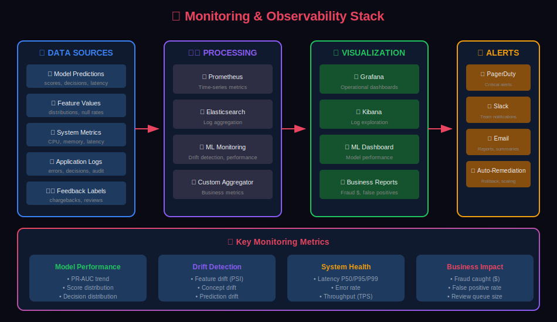
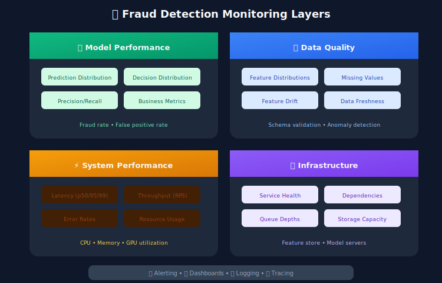

# 📊 Monitoring & Observability for Fraud Detection

> Building comprehensive monitoring to ensure your fraud detection system performs reliably in production.

---

## 📊 Visual Overview

### Monitoring Stack


---

## 📖 Table of Contents

1. [Monitoring Overview](#monitoring-overview)
2. [Model Performance Monitoring](#model-performance-monitoring)
3. [Data and Feature Drift](#data-and-feature-drift)
4. [System Health Monitoring](#system-health-monitoring)
5. [Alerting Strategies](#alerting-strategies)
6. [Dashboards](#dashboards)
7. [Logging Best Practices](#logging-best-practices)
8. [Incident Response](#incident-response)

---

## Monitoring Overview

### What to Monitor



### Monitoring Architecture


---

## Model Performance Monitoring

### Prediction Distribution Monitoring

```python
from prometheus_client import Histogram, Counter, Gauge
import numpy as np

# Metrics definitions
FRAUD_SCORE_HISTOGRAM = Histogram(
    'fraud_score_distribution',
    'Distribution of fraud scores',
    buckets=[0.1, 0.2, 0.3, 0.4, 0.5, 0.6, 0.7, 0.8, 0.9, 0.95, 0.99, 1.0]
)

DECISION_COUNTER = Counter(
    'fraud_decisions_total',
    'Count of decisions by type',
    ['decision', 'model_version']
)

HIGH_SCORE_RATE = Gauge(
    'fraud_high_score_rate',
    'Rate of high fraud scores (>0.8)',
    ['time_window']
)

class ModelPerformanceMonitor:
    """Monitor model predictions in production"""

    def __init__(self, window_minutes: int = 5):
        self.window_minutes = window_minutes
        self.recent_scores = []
        self.recent_decisions = []

    def record_prediction(self, score: float, decision: str, model_version: str):
        """Record a prediction for monitoring"""

        # Prometheus metrics
        FRAUD_SCORE_HISTOGRAM.observe(score)
        DECISION_COUNTER.labels(decision=decision, model_version=model_version).inc()

        # Local tracking for derived metrics
        timestamp = datetime.utcnow()
        self.recent_scores.append((timestamp, score))
        self.recent_decisions.append((timestamp, decision))

        # Clean old entries
        self._cleanup_old_entries()

        # Update derived metrics
        self._update_derived_metrics()

    def _cleanup_old_entries(self):
        """Remove entries older than window"""
        cutoff = datetime.utcnow() - timedelta(minutes=self.window_minutes)
        self.recent_scores = [(t, s) for t, s in self.recent_scores if t > cutoff]
        self.recent_decisions = [(t, d) for t, d in self.recent_decisions if t > cutoff]

    def _update_derived_metrics(self):
        """Update derived metrics"""
        if not self.recent_scores:
            return

        scores = [s for _, s in self.recent_scores]

        # High score rate
        high_score_rate = sum(1 for s in scores if s > 0.8) / len(scores)
        HIGH_SCORE_RATE.labels(time_window=f'{self.window_minutes}m').set(high_score_rate)

    def get_score_statistics(self) -> dict:
        """Get current score statistics"""
        if not self.recent_scores:
            return {}

        scores = [s for _, s in self.recent_scores]

        return {
            'count': len(scores),
            'mean': np.mean(scores),
            'std': np.std(scores),
            'median': np.median(scores),
            'p95': np.percentile(scores, 95),
            'p99': np.percentile(scores, 99),
            'high_score_rate': sum(1 for s in scores if s > 0.8) / len(scores)
        }

    def detect_score_anomaly(self, baseline_stats: dict) -> dict:
        """Detect anomalies in score distribution"""

        current_stats = self.get_score_statistics()
        if not current_stats:
            return {'anomaly_detected': False}

        anomalies = {}

        # Mean shift detection
        if baseline_stats.get('mean'):
            mean_shift = abs(current_stats['mean'] - baseline_stats['mean'])
            std_threshold = baseline_stats.get('std', 0.1) * 2

            if mean_shift > std_threshold:
                anomalies['mean_shift'] = {
                    'baseline': baseline_stats['mean'],
                    'current': current_stats['mean'],
                    'shift': mean_shift
                }

        # High score rate anomaly
        if baseline_stats.get('high_score_rate'):
            rate_change = abs(
                current_stats['high_score_rate'] - baseline_stats['high_score_rate']
            )
            if rate_change > 0.05:  # 5% change
                anomalies['high_score_rate_change'] = {
                    'baseline': baseline_stats['high_score_rate'],
                    'current': current_stats['high_score_rate']
                }

        return {
            'anomaly_detected': len(anomalies) > 0,
            'anomalies': anomalies,
            'current_stats': current_stats
        }
```

### Delayed Label Monitoring

```python
class DelayedLabelMonitor:
    """Monitor model performance with delayed labels (chargebacks)"""

    def __init__(self, label_delay_days: int = 45):
        self.label_delay_days = label_delay_days
        self.predictions_store = PredictionsStore()
        self.labels_store = LabelsStore()

    async def compute_performance_metrics(self,
                                          evaluation_date: datetime) -> dict:
        """Compute metrics for predictions made label_delay_days ago"""

        # Get predictions from label_delay_days ago
        prediction_date = evaluation_date - timedelta(days=self.label_delay_days)

        predictions = await self.predictions_store.get_predictions(
            start_date=prediction_date,
            end_date=prediction_date + timedelta(days=1)
        )

        # Get corresponding labels
        labels = await self.labels_store.get_labels(
            transaction_ids=[p['transaction_id'] for p in predictions]
        )

        # Join predictions and labels
        labeled_predictions = self._join_predictions_labels(predictions, labels)

        if len(labeled_predictions) == 0:
            return {'status': 'no_labeled_data'}

        # Calculate metrics
        y_true = np.array([p['is_fraud'] for p in labeled_predictions])
        y_scores = np.array([p['fraud_score'] for p in labeled_predictions])
        y_pred = np.array([p['decision'] == 'BLOCK' for p in labeled_predictions])

        return {
            'evaluation_date': evaluation_date.isoformat(),
            'prediction_date': prediction_date.isoformat(),
            'sample_size': len(labeled_predictions),
            'fraud_rate': y_true.mean(),
            'block_rate': y_pred.mean(),
            'pr_auc': average_precision_score(y_true, y_scores),
            'precision': precision_score(y_true, y_pred),
            'recall': recall_score(y_true, y_pred),
            'f1': f1_score(y_true, y_pred)
        }

    async def track_performance_trend(self, days: int = 30) -> pd.DataFrame:
        """Track performance metrics over time"""

        metrics_over_time = []

        for i in range(days):
            eval_date = datetime.utcnow() - timedelta(days=i)
            metrics = await self.compute_performance_metrics(eval_date)
            metrics['days_ago'] = i
            metrics_over_time.append(metrics)

        return pd.DataFrame(metrics_over_time)
```

---

## Data and Feature Drift

### Feature Drift Detection

```python
from scipy import stats
from typing import Dict, List

class FeatureDriftDetector:
    """Detect drift in features"""

    def __init__(self, reference_data: pd.DataFrame):
        self.reference = reference_data
        self.reference_stats = self._compute_stats(reference_data)

    def _compute_stats(self, df: pd.DataFrame) -> Dict:
        """Compute statistics for each feature"""

        stats_dict = {}

        for col in df.columns:
            if df[col].dtype in ['int64', 'float64']:
                stats_dict[col] = {
                    'type': 'numerical',
                    'mean': df[col].mean(),
                    'std': df[col].std(),
                    'median': df[col].median(),
                    'percentiles': {
                        '5': df[col].quantile(0.05),
                        '25': df[col].quantile(0.25),
                        '75': df[col].quantile(0.75),
                        '95': df[col].quantile(0.95)
                    }
                }
            else:
                value_counts = df[col].value_counts(normalize=True)
                stats_dict[col] = {
                    'type': 'categorical',
                    'distribution': value_counts.to_dict(),
                    'unique_count': df[col].nunique()
                }

        return stats_dict

    def detect_drift(self, current_data: pd.DataFrame) -> Dict[str, Dict]:
        """Detect drift between reference and current data"""

        drift_results = {}

        for col in self.reference.columns:
            if col not in current_data.columns:
                drift_results[col] = {'status': 'missing_column'}
                continue

            ref_stats = self.reference_stats[col]

            if ref_stats['type'] == 'numerical':
                drift_results[col] = self._detect_numerical_drift(
                    self.reference[col],
                    current_data[col]
                )
            else:
                drift_results[col] = self._detect_categorical_drift(
                    self.reference[col],
                    current_data[col]
                )

        return drift_results

    def _detect_numerical_drift(self, ref: pd.Series, curr: pd.Series) -> Dict:
        """Detect drift in numerical feature"""

        # Kolmogorov-Smirnov test
        ks_stat, ks_pvalue = stats.ks_2samp(ref.dropna(), curr.dropna())

        # Population Stability Index
        psi = self._calculate_psi(ref.values, curr.values)

        # Mean shift (in standard deviations)
        mean_shift = abs(curr.mean() - ref.mean()) / (ref.std() + 1e-6)

        drift_detected = (
            ks_pvalue < 0.01 or  # KS test significant
            psi > 0.2 or         # PSI threshold
            mean_shift > 2.0     # Mean shifted by 2 std
        )

        return {
            'type': 'numerical',
            'drift_detected': drift_detected,
            'ks_statistic': ks_stat,
            'ks_pvalue': ks_pvalue,
            'psi': psi,
            'mean_shift_std': mean_shift,
            'reference_mean': ref.mean(),
            'current_mean': curr.mean()
        }

    def _detect_categorical_drift(self, ref: pd.Series, curr: pd.Series) -> Dict:
        """Detect drift in categorical feature"""

        # Chi-square test
        ref_counts = ref.value_counts()
        curr_counts = curr.value_counts()

        # Align categories
        all_categories = set(ref_counts.index) | set(curr_counts.index)
        ref_aligned = np.array([ref_counts.get(c, 0) for c in all_categories])
        curr_aligned = np.array([curr_counts.get(c, 0) for c in all_categories])

        # Normalize
        ref_normalized = ref_aligned / ref_aligned.sum()
        curr_normalized = curr_aligned / curr_aligned.sum()

        # JS divergence
        js_divergence = self._js_divergence(ref_normalized, curr_normalized)

        # New categories
        new_categories = set(curr_counts.index) - set(ref_counts.index)

        drift_detected = (
            js_divergence > 0.1 or
            len(new_categories) > 0
        )

        return {
            'type': 'categorical',
            'drift_detected': drift_detected,
            'js_divergence': js_divergence,
            'new_categories': list(new_categories),
            'missing_categories': list(set(ref_counts.index) - set(curr_counts.index))
        }

    def _calculate_psi(self, expected: np.ndarray, actual: np.ndarray,
                      n_bins: int = 10) -> float:
        """Calculate Population Stability Index"""

        # Create bins from expected distribution
        percentiles = np.linspace(0, 100, n_bins + 1)
        bins = np.percentile(expected, percentiles)
        bins[0] = -np.inf
        bins[-1] = np.inf

        # Calculate proportions
        expected_hist = np.histogram(expected, bins=bins)[0]
        actual_hist = np.histogram(actual, bins=bins)[0]

        expected_pct = expected_hist / len(expected) + 1e-6
        actual_pct = actual_hist / len(actual) + 1e-6

        # PSI formula
        psi = np.sum((actual_pct - expected_pct) * np.log(actual_pct / expected_pct))

        return psi

    def _js_divergence(self, p: np.ndarray, q: np.ndarray) -> float:
        """Calculate Jensen-Shannon divergence"""
        m = 0.5 * (p + q)
        return 0.5 * (stats.entropy(p, m) + stats.entropy(q, m))
```

### Concept Drift Detection

```python
class ConceptDriftDetector:
    """Detect concept drift (change in relationship between features and target)"""

    def __init__(self, window_size: int = 1000):
        self.window_size = window_size
        self.error_history = []

    def update(self, prediction: float, actual: int):
        """Update with new prediction-actual pair"""

        error = abs(prediction - actual)
        self.error_history.append({
            'timestamp': datetime.utcnow(),
            'error': error,
            'prediction': prediction,
            'actual': actual
        })

        # Keep only recent history
        if len(self.error_history) > self.window_size * 2:
            self.error_history = self.error_history[-self.window_size * 2:]

    def detect_drift(self) -> Dict:
        """Detect concept drift using Page-Hinkley test"""

        if len(self.error_history) < self.window_size:
            return {'drift_detected': False, 'reason': 'insufficient_data'}

        errors = [e['error'] for e in self.error_history]

        # Split into reference and recent windows
        reference = errors[:self.window_size]
        recent = errors[-self.window_size:]

        # Page-Hinkley test
        reference_mean = np.mean(reference)
        cumsum = 0
        min_cumsum = 0
        ph_statistic = 0

        for error in recent:
            cumsum += error - reference_mean - 0.005  # delta threshold
            min_cumsum = min(min_cumsum, cumsum)
            ph_statistic = cumsum - min_cumsum

        drift_detected = ph_statistic > 50  # lambda threshold

        # Also check with statistical test
        t_stat, p_value = stats.ttest_ind(reference, recent)

        return {
            'drift_detected': drift_detected or p_value < 0.01,
            'ph_statistic': ph_statistic,
            't_statistic': t_stat,
            'p_value': p_value,
            'reference_error': np.mean(reference),
            'recent_error': np.mean(recent),
            'error_increase': np.mean(recent) - np.mean(reference)
        }
```

---

## System Health Monitoring

### Latency Monitoring

```python
from prometheus_client import Histogram, Summary
import time
from contextlib import contextmanager

# Latency metrics
REQUEST_LATENCY = Histogram(
    'fraud_scoring_latency_seconds',
    'End-to-end request latency',
    ['endpoint'],
    buckets=[.005, .01, .025, .05, .075, .1, .25, .5, 1.0, 2.5]
)

FEATURE_RETRIEVAL_LATENCY = Histogram(
    'fraud_feature_retrieval_latency_seconds',
    'Feature retrieval latency',
    ['feature_group'],
    buckets=[.001, .005, .01, .025, .05, .1]
)

MODEL_INFERENCE_LATENCY = Histogram(
    'fraud_model_inference_latency_seconds',
    'Model inference latency',
    ['model_name'],
    buckets=[.001, .005, .01, .025, .05]
)

class LatencyTracker:
    """Track latency breakdown for fraud scoring"""

    def __init__(self):
        self.traces = {}

    @contextmanager
    def track(self, operation: str):
        """Context manager for tracking operation latency"""
        start = time.perf_counter()
        try:
            yield
        finally:
            duration = time.perf_counter() - start
            self.traces[operation] = duration

            # Record to Prometheus
            if operation.startswith('feature_'):
                FEATURE_RETRIEVAL_LATENCY.labels(
                    feature_group=operation
                ).observe(duration)
            elif operation.startswith('model_'):
                MODEL_INFERENCE_LATENCY.labels(
                    model_name=operation
                ).observe(duration)

    def get_breakdown(self) -> Dict[str, float]:
        """Get latency breakdown"""
        return self.traces.copy()

    def log_request(self, endpoint: str, total_latency: float):
        """Log complete request with breakdown"""

        REQUEST_LATENCY.labels(endpoint=endpoint).observe(total_latency)

        return {
            'endpoint': endpoint,
            'total_latency_ms': total_latency * 1000,
            'breakdown': {k: v * 1000 for k, v in self.traces.items()}
        }
```

### Health Checks

```python
from fastapi import FastAPI, Response
from typing import Dict

app = FastAPI()

class HealthChecker:
    """Comprehensive health checking"""

    def __init__(self):
        self.dependencies = {}

    def register_dependency(self, name: str, check_func):
        """Register a dependency to check"""
        self.dependencies[name] = check_func

    async def check_all(self) -> Dict:
        """Check all dependencies"""

        results = {
            'status': 'healthy',
            'timestamp': datetime.utcnow().isoformat(),
            'checks': {}
        }

        for name, check_func in self.dependencies.items():
            try:
                start = time.time()
                is_healthy = await check_func()
                latency = time.time() - start

                results['checks'][name] = {
                    'healthy': is_healthy,
                    'latency_ms': latency * 1000
                }

                if not is_healthy:
                    results['status'] = 'unhealthy'

            except Exception as e:
                results['checks'][name] = {
                    'healthy': False,
                    'error': str(e)
                }
                results['status'] = 'unhealthy'

        return results

# Health checker instance
health_checker = HealthChecker()

# Register dependency checks
async def check_redis():
    try:
        await redis_client.ping()
        return True
    except:
        return False

async def check_model_server():
    try:
        response = await httpx.get(f"{MODEL_SERVER_URL}/health", timeout=1.0)
        return response.status_code == 200
    except:
        return False

async def check_feature_store():
    try:
        await feature_store.get_features("test_user", ["test_feature"])
        return True
    except:
        return False

health_checker.register_dependency('redis', check_redis)
health_checker.register_dependency('model_server', check_model_server)
health_checker.register_dependency('feature_store', check_feature_store)

@app.get("/health")
async def health_check():
    result = await health_checker.check_all()
    status_code = 200 if result['status'] == 'healthy' else 503
    return Response(content=json.dumps(result), status_code=status_code)

@app.get("/ready")
async def readiness_check():
    """Check if service is ready to receive traffic"""
    result = await health_checker.check_all()
    if result['status'] == 'healthy':
        return {"ready": True}
    return Response(content=json.dumps({"ready": False}), status_code=503)
```

---

## Alerting Strategies

### Alert Definitions

```python
from dataclasses import dataclass
from enum import Enum
from typing import Callable, Optional

class Severity(Enum):
    INFO = "info"
    WARNING = "warning"
    CRITICAL = "critical"

@dataclass
class AlertRule:
    name: str
    description: str
    condition: Callable[[], bool]
    severity: Severity
    cooldown_minutes: int = 15
    runbook_url: Optional[str] = None

class AlertManager:
    """Manage and trigger alerts"""

    def __init__(self, notification_service):
        self.notifications = notification_service
        self.rules: Dict[str, AlertRule] = {}
        self.last_triggered: Dict[str, datetime] = {}

    def register_rule(self, rule: AlertRule):
        """Register an alert rule"""
        self.rules[rule.name] = rule

    async def evaluate_rules(self):
        """Evaluate all alert rules"""

        for name, rule in self.rules.items():
            try:
                if rule.condition():
                    await self._trigger_alert(rule)
            except Exception as e:
                logger.error(f"Error evaluating rule {name}: {e}")

    async def _trigger_alert(self, rule: AlertRule):
        """Trigger an alert if not in cooldown"""

        now = datetime.utcnow()
        last = self.last_triggered.get(rule.name)

        if last and (now - last).total_seconds() < rule.cooldown_minutes * 60:
            return  # In cooldown

        self.last_triggered[rule.name] = now

        await self.notifications.send(
            title=f"[{rule.severity.value.upper()}] {rule.name}",
            message=rule.description,
            severity=rule.severity,
            runbook_url=rule.runbook_url
        )

# Define alert rules
alert_manager = AlertManager(notification_service)

# High score rate alert
alert_manager.register_rule(AlertRule(
    name="high_fraud_score_rate",
    description="More than 10% of transactions scoring above 0.8",
    condition=lambda: get_metric('high_score_rate_5m') > 0.10,
    severity=Severity.WARNING,
    cooldown_minutes=30,
    runbook_url="https://runbooks.internal/fraud/high-score-rate"
))

# Latency alert
alert_manager.register_rule(AlertRule(
    name="high_latency",
    description="P99 latency above 200ms",
    condition=lambda: get_metric('latency_p99') > 0.200,
    severity=Severity.WARNING,
    cooldown_minutes=15
))

# Model drift alert
alert_manager.register_rule(AlertRule(
    name="model_drift_detected",
    description="Significant drift detected in model predictions",
    condition=lambda: get_metric('prediction_drift_score') > 0.2,
    severity=Severity.CRITICAL,
    cooldown_minutes=60,
    runbook_url="https://runbooks.internal/fraud/model-drift"
))

# Feature store health
alert_manager.register_rule(AlertRule(
    name="feature_store_unhealthy",
    description="Feature store not responding",
    condition=lambda: not check_feature_store_health(),
    severity=Severity.CRITICAL,
    cooldown_minutes=5
))
```

### Alert Routing

```yaml

# alertmanager.yml - Alert routing configuration
route:
  receiver: 'default'
  group_by: ['alertname', 'severity']
  group_wait: 30s
  group_interval: 5m
  repeat_interval: 4h

  routes:
    - match:
        severity: critical
      receiver: 'pagerduty-critical'
      continue: true

    - match:
        severity: warning
      receiver: 'slack-fraud-alerts'

    - match:
        alertname: model_drift_detected
      receiver: 'ml-team-slack'

receivers:
  - name: 'default'
    slack_configs:
      - channel: '#fraud-alerts'

  - name: 'pagerduty-critical'
    pagerduty_configs:
      - service_key: '$PAGERDUTY_SERVICE_KEY'
        severity: critical

  - name: 'slack-fraud-alerts'
    slack_configs:
      - channel: '#fraud-alerts'
        send_resolved: true

  - name: 'ml-team-slack'
    slack_configs:
      - channel: '#ml-platform'
```

---

## Dashboards

### Key Dashboards

```yaml
Fraud Detection Dashboards:

1. Real-Time Operations Dashboard:
   - Current request rate
   - Latency percentiles (real-time)
   - Error rate
   - Decision distribution
   - Score distribution histogram

2. Model Performance Dashboard:
   - PR-AUC trend (with delayed labels)
   - Precision/Recall over time
   - Score distribution comparison (baseline vs current)
   - Feature importance changes

3. Drift Monitoring Dashboard:
   - Feature drift scores by feature
   - Prediction drift over time
   - PSI values heatmap
   - New category alerts

4. Business Metrics Dashboard:
   - Fraud caught ($)
   - False positives (count and $)
   - Review queue size
   - Analyst productivity

5. Infrastructure Dashboard:
   - Service health status
   - Resource utilization
   - Dependency latencies
   - Queue depths
```

### Grafana Dashboard JSON

```json
{
  "dashboard": {
    "title": "Fraud Detection - Real-Time Operations",
    "panels": [
      {
        "title": "Request Rate",
        "type": "graph",
        "targets": [
          {
            "expr": "sum(rate(fraud_scoring_requests_total[1m]))",
            "legendFormat": "requests/sec"
          }
        ]
      },
      {
        "title": "Latency Percentiles",
        "type": "graph",
        "targets": [
          {
            "expr": "histogram_quantile(0.50, rate(fraud_scoring_latency_seconds_bucket[5m]))",
            "legendFormat": "p50"
          },
          {
            "expr": "histogram_quantile(0.95, rate(fraud_scoring_latency_seconds_bucket[5m]))",
            "legendFormat": "p95"
          },
          {
            "expr": "histogram_quantile(0.99, rate(fraud_scoring_latency_seconds_bucket[5m]))",
            "legendFormat": "p99"
          }
        ]
      },
      {
        "title": "Decision Distribution",
        "type": "piechart",
        "targets": [
          {
            "expr": "sum by (decision) (fraud_decisions_total)"
          }
        ]
      },
      {
        "title": "Score Distribution",
        "type": "heatmap",
        "targets": [
          {
            "expr": "sum(rate(fraud_score_distribution_bucket[5m])) by (le)"
          }
        ]
      }
    ]
  }
}
```

---

## Logging Best Practices

### Structured Logging

```python
import structlog
from typing import Any, Dict

# Configure structured logging
structlog.configure(
    processors=[
        structlog.stdlib.filter_by_level,
        structlog.stdlib.add_logger_name,
        structlog.stdlib.add_log_level,
        structlog.processors.TimeStamper(fmt="iso"),
        structlog.processors.StackInfoRenderer(),
        structlog.processors.format_exc_info,
        structlog.processors.JSONRenderer()
    ],
    wrapper_class=structlog.stdlib.BoundLogger,
    context_class=dict,
    logger_factory=structlog.stdlib.LoggerFactory(),
    cache_logger_on_first_use=True
)

logger = structlog.get_logger()

class FraudScoringLogger:
    """Structured logging for fraud scoring"""

    def __init__(self):
        self.logger = structlog.get_logger()

    def log_scoring_request(self, transaction_id: str,
                           user_id: str,
                           request_data: Dict[str, Any]):
        """Log incoming scoring request"""

        self.logger.info(
            "scoring_request_received",
            transaction_id=transaction_id,
            user_id=user_id,
            amount=request_data.get('amount'),
            merchant_id=request_data.get('merchant_id'),
            channel=request_data.get('channel')
        )

    def log_scoring_decision(self, transaction_id: str,
                            fraud_score: float,
                            decision: str,
                            latency_ms: float,
                            model_version: str,
                            risk_factors: list):
        """Log scoring decision"""

        self.logger.info(
            "scoring_decision",
            transaction_id=transaction_id,
            fraud_score=fraud_score,
            decision=decision,
            latency_ms=latency_ms,
            model_version=model_version,
            risk_factors=risk_factors
        )

    def log_error(self, transaction_id: str,
                 error_type: str,
                 error_message: str,
                 fallback_used: bool = False):
        """Log scoring error"""

        self.logger.error(
            "scoring_error",
            transaction_id=transaction_id,
            error_type=error_type,
            error_message=error_message,
            fallback_used=fallback_used
        )
```

---

## Incident Response

### Incident Playbook

```yaml
Fraud Detection Incident Response:

1. Detection:
   - Alert triggered from monitoring
   - Customer complaint
   - Manual discovery

2. Triage (first 5 minutes):
   - Assess severity (fraud getting through? false positives?)
   - Check system health dashboards
   - Identify scope (all traffic? specific segment?)

3. Immediate Actions:

   Model Issues:
   - Rollback to previous model version
   - Enable fallback rules
   - Increase review queue

   Feature Store Issues:
   - Enable feature defaults
   - Route to backup feature store
   - Cache extension

   High False Positives:
   - Raise decision thresholds
   - Disable aggressive rules
   - Enable whitelist for affected segments

   Fraud Spike:
   - Lower decision thresholds
   - Enable additional rules
   - Alert fraud investigation team

4. Investigation:
   - Collect relevant logs
   - Analyze affected transactions
   - Identify root cause

5. Resolution:
   - Implement fix
   - Verify in shadow mode
   - Gradual rollout

6. Post-Incident:
   - Post-mortem document
   - Update runbooks
   - Improve monitoring
```

---

## Summary

Comprehensive monitoring for fraud detection:

1. **Model metrics**: Track predictions, scores, and delayed performance
2. **Drift detection**: Monitor feature and concept drift continuously
3. **System health**: Latency, throughput, error rates
4. **Smart alerting**: Severity-based routing with runbooks
5. **Incident readiness**: Playbooks and quick rollback capabilities

---

## Next Steps

Continue to [Chapter 10: Deployment & Scaling →](../10_deployment_and_scaling/)

---

<div align="center">

**[⬆ Back to Top](#)** | **[📚 Main Repository](https://github.com/Gaurav14cs17/ml_system_design)**

Made with 💜 by [Gaurav14cs17](https://github.com/Gaurav14cs17)

</div>
