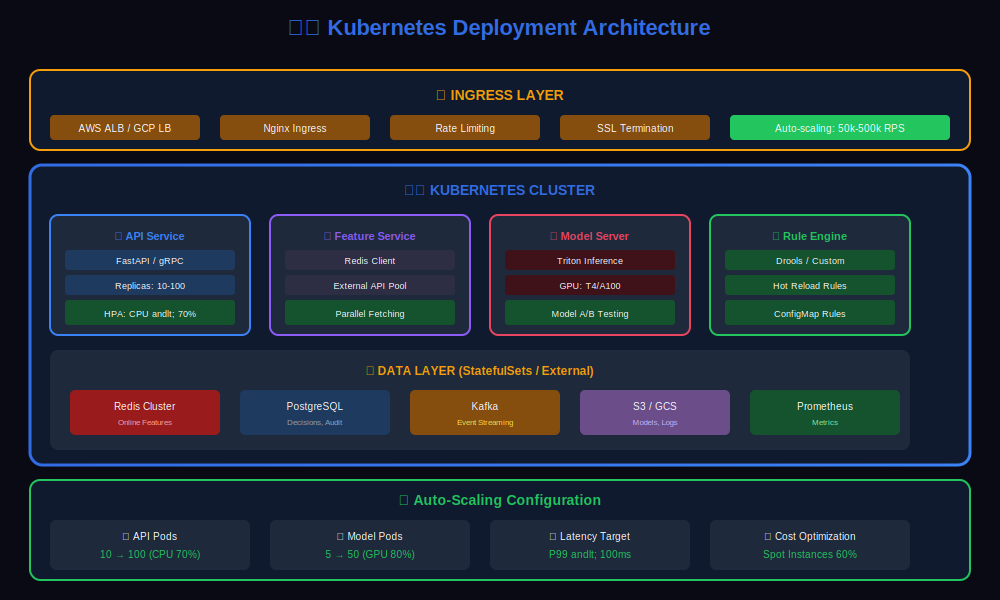
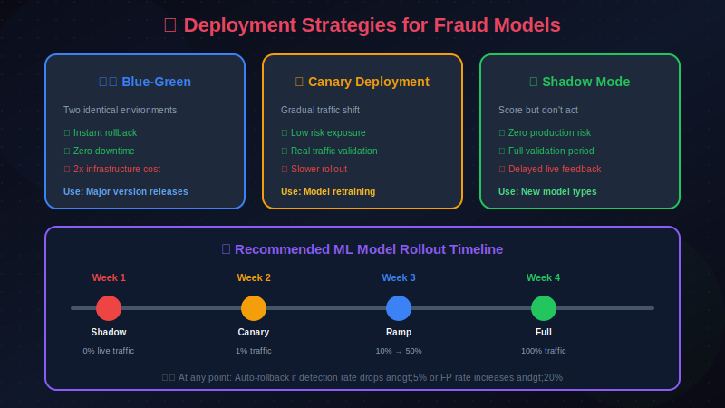

# 🚀 Deployment & Scaling for Fraud Detection

> Strategies for deploying and scaling fraud detection systems to handle millions of transactions.

---

## 📊 Visual Overview

### Deployment Architecture


---

## 📖 Table of Contents

1. [Deployment Architecture](#deployment-architecture)
2. [Containerization](#containerization)
3. [Kubernetes Deployment](#kubernetes-deployment)
4. [Scaling Strategies](#scaling-strategies)
5. [Blue-Green and Canary Deployments](#blue-green-and-canary-deployments)
6. [CI/CD Pipeline](#cicd-pipeline)
7. [Model Registry and Versioning](#model-registry-and-versioning)
8. [Multi-Region Deployment](#multi-region-deployment)
9. [Cost Optimization](#cost-optimization)

---

## Deployment Architecture

### Production Architecture



---

## Containerization

### Scoring Service Dockerfile

```dockerfile
# Multi-stage build for optimized image
FROM python:3.11-slim as builder

WORKDIR /app

# Install build dependencies
RUN apt-get update && apt-get install -y \
    build-essential \
    && rm -rf /var/lib/apt/lists/*

# Install Python dependencies
COPY requirements.txt .
RUN pip install --no-cache-dir --user -r requirements.txt

# Production image
FROM python:3.11-slim

WORKDIR /app

# Copy installed packages from builder
COPY --from=builder /root/.local /root/.local
ENV PATH=/root/.local/bin:$PATH

# Copy application code
COPY src/ ./src/
COPY config/ ./config/

# Security: Run as non-root user
RUN useradd -m appuser
USER appuser

# Health check
HEALTHCHECK --interval=30s --timeout=3s --start-period=5s --retries=3 \
    CMD curl -f http://localhost:8080/health || exit 1

EXPOSE 8080

CMD ["uvicorn", "src.main:app", "--host", "0.0.0.0", "--port", "8080", "--workers", "4"]

```

### Model Server Dockerfile

```dockerfile
# Triton Inference Server with custom models
FROM nvcr.io/nvidia/tritonserver:23.10-py3

WORKDIR /models

# Copy model repository
COPY model_repository/ /models/

# Custom preprocessing scripts
COPY preprocessing/ /opt/tritonserver/preprocessing/

# Configuration
COPY triton_config.pbtxt /models/fraud_model/config.pbtxt

EXPOSE 8000 8001 8002

CMD ["tritonserver", "--model-repository=/models", "--strict-model-config=false"]

```

---

## Kubernetes Deployment

### Deployment Manifest

```yaml
apiVersion: apps/v1
kind: Deployment
metadata:
  name: fraud-scoring-service
  namespace: fraud-detection
  labels:
    app: fraud-scoring
    version: v1.2.0
spec:
  replicas: 10
  selector:
    matchLabels:
      app: fraud-scoring
  strategy:
    type: RollingUpdate
    rollingUpdate:
      maxSurge: 25%
      maxUnavailable: 0
  template:
    metadata:
      labels:
        app: fraud-scoring
        version: v1.2.0
      annotations:
        prometheus.io/scrape: "true"
        prometheus.io/port: "8080"
        prometheus.io/path: "/metrics"
    spec:
      serviceAccountName: fraud-scoring-sa

      # Anti-affinity for high availability
      affinity:
        podAntiAffinity:
          preferredDuringSchedulingIgnoredDuringExecution:
          - weight: 100
            podAffinityTerm:
              labelSelector:
                matchExpressions:
                - key: app
                  operator: In
                  values:
                  - fraud-scoring
              topologyKey: kubernetes.io/hostname

      containers:
      - name: scoring-service
        image: fraud-scoring:v1.2.0
        imagePullPolicy: Always

        ports:
        - containerPort: 8080
          name: http

        resources:
          requests:
            memory: "2Gi"
            cpu: "2"
          limits:
            memory: "4Gi"
            cpu: "4"

        env:
        - name: MODEL_VERSION
          value: "v1.2.0"
        - name: REDIS_URL
          valueFrom:
            secretKeyRef:
              name: fraud-secrets
              key: redis-url
        - name: MODEL_SERVER_URL
          value: "http://triton-inference:8000"
        - name: LOG_LEVEL
          value: "INFO"

        readinessProbe:
          httpGet:
            path: /ready
            port: 8080
          initialDelaySeconds: 10
          periodSeconds: 5
          timeoutSeconds: 2
          failureThreshold: 3

        livenessProbe:
          httpGet:
            path: /health
            port: 8080
          initialDelaySeconds: 30
          periodSeconds: 10
          timeoutSeconds: 5
          failureThreshold: 3

        volumeMounts:
        - name: config
          mountPath: /app/config
          readOnly: true

      volumes:
      - name: config
        configMap:
          name: fraud-scoring-config

---
apiVersion: v1
kind: Service
metadata:
  name: fraud-scoring-service
  namespace: fraud-detection
spec:
  selector:
    app: fraud-scoring
  ports:
  - port: 80
    targetPort: 8080
    protocol: TCP
  type: ClusterIP

```

### Horizontal Pod Autoscaler

```yaml
apiVersion: autoscaling/v2
kind: HorizontalPodAutoscaler
metadata:
  name: fraud-scoring-hpa
  namespace: fraud-detection
spec:
  scaleTargetRef:
    apiVersion: apps/v1
    kind: Deployment
    name: fraud-scoring-service
  minReplicas: 10
  maxReplicas: 100
  metrics:
  # CPU-based scaling
  - type: Resource
    resource:
      name: cpu
      target:
        type: Utilization
        averageUtilization: 70

  # Custom metrics: requests per second
  - type: Pods
    pods:
      metric:
        name: http_requests_per_second
      target:
        type: AverageValue
        averageValue: "1000"

  # Custom metrics: latency-based scaling
  - type: Pods
    pods:
      metric:
        name: http_request_duration_p99
      target:
        type: AverageValue
        averageValue: "100m"  # 100ms target

  behavior:
    scaleUp:
      stabilizationWindowSeconds: 60
      policies:
      - type: Percent
        value: 100
        periodSeconds: 60
      - type: Pods
        value: 10
        periodSeconds: 60
    scaleDown:
      stabilizationWindowSeconds: 300
      policies:
      - type: Percent
        value: 10
        periodSeconds: 120

```

---

## Scaling Strategies

### Capacity Planning

```python
class CapacityPlanner:
    """Plan capacity for fraud detection service"""

    def __init__(self):
        self.metrics = MetricsClient()

    def calculate_required_replicas(self,
                                   target_rps: float,
                                   target_latency_p99_ms: float) -> dict:
        """Calculate required replicas for target performance"""

        # Get current metrics
        current_rps_per_pod = self.metrics.get_average('rps_per_pod')
        current_latency = self.metrics.get_p99('latency_ms')
        current_cpu_utilization = self.metrics.get_average('cpu_utilization')

        # Calculate scaling factor
        rps_factor = target_rps / (current_rps_per_pod * current_cpu_utilization / 0.7)

        # Latency consideration (add buffer if latency is high)
        latency_factor = 1.0
        if current_latency > target_latency_p99_ms:
            latency_factor = current_latency / target_latency_p99_ms

        # Required replicas
        required_replicas = int(rps_factor * latency_factor * 1.2)  # 20% buffer

        return {
            'required_replicas': required_replicas,
            'current_rps_per_pod': current_rps_per_pod,
            'scaling_factor': rps_factor,
            'latency_factor': latency_factor
        }

    def predict_peak_capacity(self,
                             historical_days: int = 90) -> dict:
        """Predict peak capacity needs"""

        # Get historical traffic patterns
        traffic_data = self.metrics.get_historical('rps', days=historical_days)

        # Find peak patterns
        daily_peaks = traffic_data.groupby(traffic_data.index.date).max()

        # Calculate percentiles
        p95_peak = np.percentile(daily_peaks, 95)
        p99_peak = np.percentile(daily_peaks, 99)
        max_peak = daily_peaks.max()

        # Seasonal factors (e.g., holiday shopping)
        seasonal_multiplier = self._get_seasonal_multiplier()

        return {
            'p95_peak_rps': p95_peak * seasonal_multiplier,
            'p99_peak_rps': p99_peak * seasonal_multiplier,
            'max_peak_rps': max_peak * seasonal_multiplier,
            'recommended_capacity': max_peak * seasonal_multiplier * 1.5  # 50% buffer
        }

```

### Load Testing

```python
from locust import HttpUser, task, between

class FraudScoringUser(HttpUser):
    """Load test for fraud scoring service"""

    wait_time = between(0.01, 0.1)  # High-frequency testing

    @task(10)
    def score_transaction(self):
        """Score a transaction"""

        transaction = self.generate_transaction()

        with self.client.post(
            "/v1/score",
            json=transaction,
            catch_response=True
        ) as response:
            if response.status_code == 200:
                latency = response.elapsed.total_seconds() * 1000

                if latency > 100:  # Flag slow responses
                    response.failure(f"Response too slow: {latency}ms")
                else:
                    response.success()
            else:
                response.failure(f"Status code: {response.status_code}")

    def generate_transaction(self) -> dict:
        """Generate realistic test transaction"""

        return {
            "transaction_id": str(uuid.uuid4()),
            "user_id": f"user_{random.randint(1, 100000)}",
            "merchant_id": f"merchant_{random.randint(1, 10000)}",
            "amount": round(random.uniform(1, 5000), 2),
            "currency": "USD",
            "timestamp": datetime.utcnow().isoformat()
        }

# Run: locust -f load_test.py --host=http://fraud-scoring:8080

```

---

## Blue-Green and Canary Deployments

### Canary Deployment with Istio

```yaml
apiVersion: networking.istio.io/v1beta1
kind: VirtualService
metadata:
  name: fraud-scoring-vs
  namespace: fraud-detection
spec:
  hosts:
  - fraud-scoring-service
  http:
  - match:
    - headers:
        x-canary:
          exact: "true"
    route:
    - destination:
        host: fraud-scoring-service
        subset: canary
  - route:
    - destination:
        host: fraud-scoring-service
        subset: stable
      weight: 95
    - destination:
        host: fraud-scoring-service
        subset: canary
      weight: 5

---
apiVersion: networking.istio.io/v1beta1
kind: DestinationRule
metadata:
  name: fraud-scoring-dr
  namespace: fraud-detection
spec:
  host: fraud-scoring-service
  subsets:
  - name: stable
    labels:
      version: v1.1.0
  - name: canary
    labels:
      version: v1.2.0

```

### Progressive Rollout with Argo Rollouts

```yaml
apiVersion: argoproj.io/v1alpha1
kind: Rollout
metadata:
  name: fraud-scoring-rollout
  namespace: fraud-detection
spec:
  replicas: 20
  selector:
    matchLabels:
      app: fraud-scoring
  template:
    metadata:
      labels:
        app: fraud-scoring
    spec:
      containers:
      - name: scoring-service
        image: fraud-scoring:v1.2.0
        ports:
        - containerPort: 8080

  strategy:
    canary:
      # Canary steps
      steps:
      - setWeight: 5
      - pause: {duration: 10m}
      - setWeight: 20
      - pause: {duration: 10m}
      - setWeight: 50
      - pause: {duration: 10m}
      - setWeight: 80
      - pause: {duration: 10m}

      # Analysis during rollout
      analysis:
        templates:
        - templateName: fraud-scoring-analysis
        startingStep: 1
        args:
        - name: service-name
          value: fraud-scoring-canary

      # Rollback on failure
      maxSurge: 25%
      maxUnavailable: 0

      # Traffic routing
      trafficRouting:
        istio:
          virtualService:
            name: fraud-scoring-vs
            routes:
            - primary

---
apiVersion: argoproj.io/v1alpha1
kind: AnalysisTemplate
metadata:
  name: fraud-scoring-analysis
spec:
  metrics:
  - name: success-rate
    interval: 1m
    successCondition: result[0] >= 0.99
    provider:
      prometheus:
        address: http://prometheus:9090
        query: |
          sum(rate(http_requests_total{service="{{args.service-name}}",status=~"2.."}[5m])) /
          sum(rate(http_requests_total{service="{{args.service-name}}"}[5m]))

  - name: latency-p99
    interval: 1m
    successCondition: result[0] <= 100
    provider:
      prometheus:
        address: http://prometheus:9090
        query: |
          histogram_quantile(0.99, sum(rate(http_request_duration_ms_bucket{service="{{args.service-name}}"}[5m])) by (le))

  - name: fraud-score-distribution
    interval: 5m
    successCondition: result[0] <= 0.15  # PSI < 0.15
    provider:
      prometheus:
        address: http://prometheus:9090
        query: |
          fraud_score_psi{service="{{args.service-name}}"}

```

---

## CI/CD Pipeline

### GitHub Actions Pipeline

```yaml
name: Fraud Detection CI/CD

on:
  push:
    branches: [main, develop]
  pull_request:
    branches: [main]

env:
  REGISTRY: ghcr.io
  IMAGE_NAME: fraud-scoring

jobs:
  test:
    runs-on: ubuntu-latest
    steps:
    - uses: actions/checkout@v3

    - name: Set up Python
      uses: actions/setup-python@v4
      with:
        python-version: '3.11'

    - name: Install dependencies
      run: |
        pip install -r requirements.txt
        pip install -r requirements-dev.txt

    - name: Run unit tests
      run: pytest tests/unit -v --cov=src

    - name: Run integration tests
      run: pytest tests/integration -v

    - name: Model validation tests
      run: pytest tests/model -v

  build:
    needs: test
    runs-on: ubuntu-latest
    outputs:
      image_tag: ${{ steps.meta.outputs.tags }}
    steps:
    - uses: actions/checkout@v3

    - name: Set up Docker Buildx
      uses: docker/setup-buildx-action@v2

    - name: Login to Registry
      uses: docker/login-action@v2
      with:
        registry: ${{ env.REGISTRY }}
        username: ${{ github.actor }}
        password: ${{ secrets.GITHUB_TOKEN }}

    - name: Extract metadata
      id: meta
      uses: docker/metadata-action@v4
      with:
        images: ${{ env.REGISTRY }}/${{ env.IMAGE_NAME }}
        tags: |
          type=sha,prefix=
          type=ref,event=branch

    - name: Build and push
      uses: docker/build-push-action@v4
      with:
        context: .
        push: true
        tags: ${{ steps.meta.outputs.tags }}
        cache-from: type=gha
        cache-to: type=gha,mode=max

  deploy-staging:
    needs: build
    runs-on: ubuntu-latest
    environment: staging
    steps:
    - uses: actions/checkout@v3

    - name: Deploy to staging
      run: |
        kubectl set image deployment/fraud-scoring \
          scoring-service=${{ env.REGISTRY }}/${{ env.IMAGE_NAME }}:${{ github.sha }} \
          -n fraud-detection-staging

    - name: Wait for rollout
      run: |
        kubectl rollout status deployment/fraud-scoring \
          -n fraud-detection-staging --timeout=300s

    - name: Run smoke tests
      run: ./scripts/smoke_tests.sh staging

  deploy-production:
    needs: deploy-staging
    runs-on: ubuntu-latest
    environment: production
    if: github.ref == 'refs/heads/main'
    steps:
    - uses: actions/checkout@v3

    - name: Deploy canary
      run: |
        kubectl apply -f k8s/canary-deployment.yaml

    - name: Monitor canary (10 minutes)
      run: ./scripts/monitor_canary.sh

    - name: Promote to stable
      run: |
        kubectl set image deployment/fraud-scoring \
          scoring-service=${{ env.REGISTRY }}/${{ env.IMAGE_NAME }}:${{ github.sha }} \
          -n fraud-detection-production

```

---

## Model Registry and Versioning

### MLflow Model Registry

```python
import mlflow
from mlflow.tracking import MlflowClient

class ModelRegistry:
    """Manage model versions with MLflow"""

    def __init__(self, tracking_uri: str):
        mlflow.set_tracking_uri(tracking_uri)
        self.client = MlflowClient()
        self.model_name = "fraud_detection"

    def register_model(self, run_id: str, metrics: dict) -> str:
        """Register a new model version"""

        # Register model
        model_uri = f"runs:/{run_id}/model"
        mv = mlflow.register_model(model_uri, self.model_name)

        # Add metadata
        self.client.set_model_version_tag(
            self.model_name,
            mv.version,
            "pr_auc",
            str(metrics['pr_auc'])
        )
        self.client.set_model_version_tag(
            self.model_name,
            mv.version,
            "training_date",
            datetime.utcnow().isoformat()
        )

        return mv.version

    def promote_to_staging(self, version: str):
        """Promote model to staging"""

        self.client.transition_model_version_stage(
            name=self.model_name,
            version=version,
            stage="Staging"
        )

    def promote_to_production(self, version: str):
        """Promote model to production"""

        # Archive current production
        current_prod = self.client.get_latest_versions(
            self.model_name,
            stages=["Production"]
        )
        for mv in current_prod:
            self.client.transition_model_version_stage(
                name=self.model_name,
                version=mv.version,
                stage="Archived"
            )

        # Promote new version
        self.client.transition_model_version_stage(
            name=self.model_name,
            version=version,
            stage="Production"
        )

    def get_production_model(self):
        """Get current production model"""

        return mlflow.pyfunc.load_model(
            model_uri=f"models:/{self.model_name}/Production"
        )

    def rollback(self, target_version: str = None):
        """Rollback to previous or specific version"""

        if target_version is None:
            # Get previous production version
            archived = self.client.get_latest_versions(
                self.model_name,
                stages=["Archived"]
            )
            if not archived:
                raise ValueError("No archived versions to rollback to")
            target_version = archived[0].version

        self.promote_to_production(target_version)

```

---

## Multi-Region Deployment

### Global Architecture

```yaml
Multi-Region Fraud Detection:

Region: US-East
+-- Load Balancer (ALB)
+-- Kubernetes Cluster

|   +-- Scoring Service (20 pods)
|   +-- Model Server (10 pods)
+-- Redis Cluster (primary)
+-- Feature Store (primary)
+-- Model Storage (S3)

Region: US-West
+-- Load Balancer (ALB)
+-- Kubernetes Cluster
|   +-- Scoring Service (15 pods)

|   +-- Model Server (8 pods)
+-- Redis Cluster (replica)
+-- Feature Store (replica)
+-- Model Storage (S3 replica)

Region: EU-West
+-- Load Balancer (ALB)
+-- Kubernetes Cluster
|   +-- Scoring Service (10 pods)
|   +-- Model Server (5 pods)
+-- Redis Cluster (replica)
+-- Feature Store (replica)
+-- Model Storage (S3 replica)

Global:
+-- Route53 Latency-based Routing
+-- Global Accelerator
+-- Cross-region Replication

```

### Traffic Routing

```yaml
# AWS Route53 latency-based routing
resource "aws_route53_record" "fraud_scoring" {
  zone_id = aws_route53_zone.main.zone_id
  name    = "fraud-scoring.example.com"
  type    = "A"

  alias {
    name                   = aws_lb.us_east.dns_name
    zone_id                = aws_lb.us_east.zone_id
    evaluate_target_health = true
  }

  set_identifier = "us-east"
  latency_routing_policy {
    region = "us-east-1"
  }
}

resource "aws_route53_record" "fraud_scoring_eu" {
  zone_id = aws_route53_zone.main.zone_id
  name    = "fraud-scoring.example.com"
  type    = "A"

  alias {
    name                   = aws_lb.eu_west.dns_name
    zone_id                = aws_lb.eu_west.zone_id
    evaluate_target_health = true
  }

  set_identifier = "eu-west"
  latency_routing_policy {
    region = "eu-west-1"
  }
}

```

---

## Cost Optimization

### Resource Optimization

```python
class CostOptimizer:
    """Optimize costs for fraud detection infrastructure"""

    def analyze_usage(self) -> dict:
        """Analyze resource usage patterns"""

        # Get historical metrics
        cpu_usage = self.metrics.get_timeseries('cpu_utilization', days=30)
        memory_usage = self.metrics.get_timeseries('memory_utilization', days=30)
        request_rate = self.metrics.get_timeseries('request_rate', days=30)

        return {
            'avg_cpu': cpu_usage.mean(),
            'peak_cpu': cpu_usage.quantile(0.99),
            'avg_memory': memory_usage.mean(),
            'peak_memory': memory_usage.quantile(0.99),
            'avg_rps': request_rate.mean(),
            'peak_rps': request_rate.max()
        }

    def recommend_instance_types(self, usage: dict) -> list:
        """Recommend optimal instance types"""

        recommendations = []

        # If CPU is underutilized, suggest smaller instances
        if usage['avg_cpu'] < 0.3:
            recommendations.append({
                'action': 'downsize_cpu',
                'reason': f"Average CPU utilization is only {usage['avg_cpu']:.1%}",
                'saving_estimate': '30%'
            })

        # If memory is underutilized
        if usage['avg_memory'] < 0.4:
            recommendations.append({
                'action': 'reduce_memory',
                'reason': f"Average memory utilization is only {usage['avg_memory']:.1%}",
                'saving_estimate': '20%'
            })

        # Spot instances for non-critical workloads
        recommendations.append({
            'action': 'use_spot_instances',
            'reason': 'Use spot instances for batch processing',
            'saving_estimate': '70%'
        })

        return recommendations

# Kubernetes cost optimization
apiVersion: v1
kind: LimitRange
metadata:
  name: fraud-service-limits
  namespace: fraud-detection
spec:
  limits:
  - default:
      cpu: "2"
      memory: "2Gi"
    defaultRequest:
      cpu: "500m"
      memory: "512Mi"
    type: Container

```

---

## Summary

Key deployment and scaling principles:

1. **Containerize everything**: Docker for consistency
2. **Kubernetes for orchestration**: Auto-scaling, health checks
3. **Progressive rollouts**: Canary deployments with automated analysis
4. **Multi-region**: Global availability and low latency
5. **Cost optimization**: Right-size resources, use spot instances

---

## Next Steps

Continue to [Chapter 11: Explainability & Compliance →](../11_explainability_and_compliance/)

---

<div align="center">

**[⬆ Back to Top](#)** | **[📚 Main Repository](https://github.com/Gaurav14cs17/ml_system_design)**

Made with 💜 by [Gaurav14cs17](https://github.com/Gaurav14cs17)

</div>
