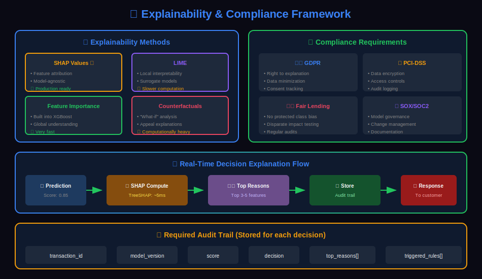
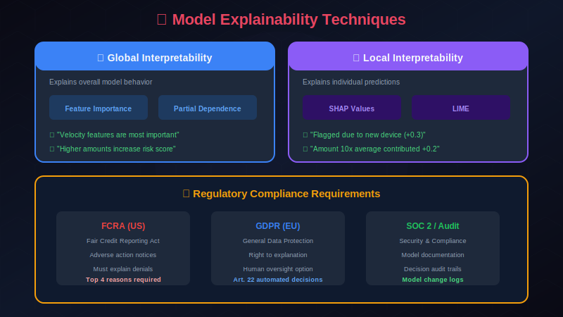

# 📋 Explainability & Compliance for Fraud Detection

> Building interpretable models and meeting regulatory requirements in fraud detection systems.

---

## 📊 Visual Overview

### Explainability Flow


---

## 📖 Table of Contents

1. [Why Explainability Matters](#why-explainability-matters)
2. [Explainability Techniques](#explainability-techniques)
3. [SHAP for Fraud Detection](#shap-for-fraud-detection)
4. [LIME for Local Explanations](#lime-for-local-explanations)
5. [Rule-Based Explanations](#rule-based-explanations)
6. [Regulatory Requirements](#regulatory-requirements)
7. [Audit Trails](#audit-trails)
8. [Fairness and Bias](#fairness-and-bias)
9. [Documentation Standards](#documentation-standards)

---

## Why Explainability Matters

### Stakeholder Requirements



### The Explainability Trade-off

| Model Type | Accuracy | Interpretability | Use Case |
|------------|----------|------------------|----------|
| Logistic Regression | Medium | High | Baseline, audit trail |
| Decision Trees | Medium | High | Rule extraction |
| Random Forest | High | Medium | Balanced approach |
| XGBoost/LightGBM | Very High | Low-Medium | Production with SHAP |
| Deep Learning | Very High | Low | Complex patterns + SHAP |

---

## Explainability Techniques

### Global vs Local Explanations

```python
class ExplainabilityFramework:
    """Framework for model explanations"""

    def __init__(self, model, feature_names):
        self.model = model
        self.feature_names = feature_names

    def global_explanation(self, X: np.ndarray) -> dict:
        """
        Global explanation: Overall feature importance
        - Which features matter most across all predictions?
        """

        # Feature importance from tree-based models
        if hasattr(self.model, 'feature_importances_'):
            importance = dict(zip(
                self.feature_names,
                self.model.feature_importances_
            ))
        else:

            # Use SHAP for global importance
            explainer = shap.Explainer(self.model)
            shap_values = explainer(X)
            importance = dict(zip(
                self.feature_names,
                np.abs(shap_values.values).mean(axis=0)
            ))

        return {
            'type': 'global',
            'feature_importance': dict(sorted(
                importance.items(),
                key=lambda x: x[1],
                reverse=True
            ))
        }

    def local_explanation(self, x: np.ndarray) -> dict:
        """
        Local explanation: Why this specific prediction?
        - Which features drove this particular decision?
        """

        # Use SHAP for local explanation
        explainer = shap.Explainer(self.model)
        shap_values = explainer(x.reshape(1, -1))

        contributions = dict(zip(
            self.feature_names,
            shap_values.values[0]
        ))

        # Sort by absolute contribution
        sorted_contributions = dict(sorted(
            contributions.items(),
            key=lambda x: abs(x[1]),
            reverse=True
        ))

        return {
            'type': 'local',
            'base_value': explainer.expected_value,
            'prediction': self.model.predict_proba(x.reshape(1, -1))[0, 1],
            'feature_contributions': sorted_contributions
        }
```

---

## SHAP for Fraud Detection

### SHAP Implementation

```python
import shap
import numpy as np
import pandas as pd
from typing import List, Dict

class SHAPExplainer:
    """SHAP-based explanations for fraud detection"""

    def __init__(self, model, background_data: np.ndarray, feature_names: List[str]):
        self.model = model
        self.feature_names = feature_names

        # Create explainer with background data
        if hasattr(model, 'predict_proba'):
            self.explainer = shap.TreeExplainer(model)
        else:

            # For custom models, use KernelExplainer
            self.explainer = shap.KernelExplainer(
                model.predict_proba,
                shap.sample(background_data, 100)
            )

    def explain_prediction(self, x: np.ndarray) -> dict:
        """Generate SHAP explanation for a single prediction"""

        # Get SHAP values
        shap_values = self.explainer.shap_values(x.reshape(1, -1))

        # For binary classification, use class 1 (fraud)
        if isinstance(shap_values, list):
            shap_values = shap_values[1]

        # Create explanation
        contributions = {}
        for i, feature in enumerate(self.feature_names):
            contributions[feature] = {
                'shap_value': float(shap_values[0, i]),
                'feature_value': float(x[i]),
                'contribution': 'increases' if shap_values[0, i] > 0 else 'decreases'
            }

        # Sort by absolute impact
        sorted_features = sorted(
            contributions.items(),
            key=lambda x: abs(x[1]['shap_value']),
            reverse=True
        )

        return {
            'expected_value': float(self.explainer.expected_value[1] if isinstance(self.explainer.expected_value, list) else self.explainer.expected_value),
            'predicted_score': float(self.model.predict_proba(x.reshape(1, -1))[0, 1]),
            'top_factors': [
                {
                    'feature': feat,
                    'impact': data['shap_value'],
                    'value': data['feature_value'],
                    'direction': data['contribution']
                }
                for feat, data in sorted_features[:10]
            ]
        }

    def generate_human_readable_explanation(self, explanation: dict) -> str:
        """Convert SHAP explanation to human-readable text"""

        score = explanation['predicted_score']
        factors = explanation['top_factors']

        # Determine risk level
        if score >= 0.8:
            risk_level = "high"
        elif score >= 0.5:
            risk_level = "medium"
        else:
            risk_level = "low"

        # Build explanation text
        lines = [
            f"This transaction has a {risk_level} fraud risk (score: {score:.2f}).",
            "",
            "Top contributing factors:"
        ]

        for i, factor in enumerate(factors[:5], 1):
            direction = "increases" if factor['impact'] > 0 else "decreases"
            impact_strength = abs(factor['impact'])

            if impact_strength > 0.3:
                strength = "significantly"
            elif impact_strength > 0.1:
                strength = "moderately"
            else:
                strength = "slightly"

            lines.append(
                f"{i}. {factor['feature']} = {factor['value']:.2f} "
                f"({strength} {direction} fraud risk)"
            )

        return "\n".join(lines)

    def create_waterfall_chart(self, x: np.ndarray, output_path: str = None):
        """Create SHAP waterfall chart"""

        shap_values = self.explainer(x.reshape(1, -1))

        fig = shap.plots.waterfall(shap_values[0], show=False)

        if output_path:
            fig.savefig(output_path, bbox_inches='tight', dpi=150)

        return fig
```

### Real-Time SHAP Explanations

```python
class RealTimeSHAPService:
    """Optimized SHAP explanations for production"""

    def __init__(self, model, background_sample_size: int = 100):
        self.model = model

        # Pre-compute for faster explanations
        self.background_data = self._get_background_sample(background_sample_size)
        self.explainer = shap.TreeExplainer(model, self.background_data)

        # Cache for repeated entities
        self.explanation_cache = LRUCache(maxsize=1000)

    async def explain(self, transaction_id: str, features: np.ndarray) -> dict:
        """Get explanation with caching"""

        cache_key = self._make_cache_key(features)

        # Check cache
        if cache_key in self.explanation_cache:
            return self.explanation_cache[cache_key]

        # Compute explanation
        explanation = self._compute_explanation(features)

        # Cache result
        self.explanation_cache[cache_key] = explanation

        return explanation

    def _compute_explanation(self, features: np.ndarray) -> dict:
        """Compute SHAP explanation"""

        shap_values = self.explainer.shap_values(features.reshape(1, -1))

        if isinstance(shap_values, list):
            shap_values = shap_values[1]

        # Get top factors only for performance
        indices = np.argsort(np.abs(shap_values[0]))[-5:][::-1]

        return {
            'top_factors': [
                {
                    'feature': self.feature_names[i],
                    'shap_value': float(shap_values[0, i])
                }
                for i in indices
            ],
            'expected_value': float(self.explainer.expected_value)
        }
```

---

## LIME for Local Explanations

```python
from lime.lime_tabular import LimeTabularExplainer

class LIMEExplainer:
    """LIME-based local explanations"""

    def __init__(self, model, training_data: np.ndarray,
                 feature_names: List[str], categorical_features: List[int] = None):

        self.model = model
        self.feature_names = feature_names

        self.explainer = LimeTabularExplainer(
            training_data,
            feature_names=feature_names,
            categorical_features=categorical_features,
            class_names=['legitimate', 'fraud'],
            mode='classification'
        )

    def explain(self, x: np.ndarray, num_features: int = 10) -> dict:
        """Generate LIME explanation"""

        explanation = self.explainer.explain_instance(
            x,
            self.model.predict_proba,
            num_features=num_features,
            num_samples=1000
        )

        # Extract feature weights
        feature_weights = explanation.as_list()

        return {
            'prediction': self.model.predict_proba(x.reshape(1, -1))[0].tolist(),
            'intercept': explanation.intercept[1],
            'local_prediction': explanation.local_pred[0],
            'feature_contributions': [
                {
                    'feature': feat,
                    'weight': weight
                }
                for feat, weight in feature_weights
            ]
        }
```

---

## Rule-Based Explanations

### Combining ML with Rule Explanations

```python
class HybridExplainer:
    """Combine ML explanations with rule-based reasoning"""

    def __init__(self, ml_model, rule_engine, shap_explainer):
        self.ml_model = ml_model
        self.rule_engine = rule_engine
        self.shap = shap_explainer

    def explain_decision(self, transaction: dict, features: np.ndarray) -> dict:
        """Generate comprehensive explanation combining ML and rules"""

        # Get ML prediction and explanation
        ml_score = self.ml_model.predict_proba(features.reshape(1, -1))[0, 1]
        shap_explanation = self.shap.explain_prediction(features)

        # Get triggered rules
        rule_results = self.rule_engine.evaluate(transaction)
        triggered_rules = [r for r in rule_results if r.triggered]

        # Determine primary decision driver
        if any(r.severity == 'CRITICAL' for r in triggered_rules):
            primary_driver = 'rule'
            primary_reason = next(r for r in triggered_rules if r.severity == 'CRITICAL')
        elif ml_score > 0.9:
            primary_driver = 'ml'
            primary_reason = shap_explanation['top_factors'][0]
        elif len(triggered_rules) >= 3:
            primary_driver = 'rules_combination'
            primary_reason = triggered_rules
        else:
            primary_driver = 'ml'
            primary_reason = shap_explanation['top_factors'][0]

        return {
            'final_score': ml_score,
            'primary_driver': primary_driver,

            'ml_explanation': {
                'score': ml_score,
                'top_factors': shap_explanation['top_factors'],
                'human_readable': self._format_ml_explanation(shap_explanation)
            },

            'rule_explanation': {
                'triggered_rules': [
                    {
                        'rule_id': r.rule_id,
                        'description': r.description,
                        'severity': r.severity
                    }
                    for r in triggered_rules
                ]
            },

            'combined_explanation': self._generate_combined_explanation(
                shap_explanation, triggered_rules
            )
        }

    def _generate_combined_explanation(self, shap_exp: dict, rules: list) -> str:
        """Generate human-readable combined explanation"""

        lines = ["Transaction flagged due to:"]

        # Add rule explanations
        for rule in rules:
            lines.append(f"• {rule.description} ({rule.severity})")

        # Add top ML factors
        lines.append("\nML model also detected:")
        for factor in shap_exp['top_factors'][:3]:
            direction = "high risk" if factor['impact'] > 0 else "normal"
            lines.append(f"• {factor['feature']}: {direction}")

        return "\n".join(lines)
```

---

## Regulatory Requirements

### Key Regulations

```yaml
Regulatory Compliance Requirements:

FCRA (Fair Credit Reporting Act):
  applies_to: Credit decisions
  requirements:
    - Provide adverse action notices
    - Explain specific reasons for denial
    - Allow consumer disputes
    - Maintain accuracy of data

ECOA (Equal Credit Opportunity Act):
  applies_to: Credit decisions
  requirements:
    - Non-discrimination
    - Provide reasons for denial
    - Consistent decision criteria

GDPR (General Data Protection Regulation):
  applies_to: EU residents
  requirements:
    - Right to explanation (Article 22)
    - Right to human review
    - Data minimization
    - Purpose limitation

State Privacy Laws:
  CCPA: Right to know, delete, opt-out
  State-specific: Varying requirements
```

### Adverse Action Notice Generator

```python
class AdverseActionNotice:
    """Generate compliant adverse action notices"""

    REASON_TEMPLATES = {
        'high_velocity': "Recent transaction frequency exceeds normal patterns",
        'new_device': "Transaction originated from unrecognized device",
        'unusual_amount': "Transaction amount differs significantly from typical activity",
        'high_risk_merchant': "Merchant has elevated risk profile",
        'geographic_anomaly': "Transaction location inconsistent with account history",
        'ml_high_score': "Transaction pattern differs from established behavior",
    }

    def generate_notice(self, decision: dict, explanation: dict) -> dict:
        """Generate FCRA/ECOA compliant adverse action notice"""

        reasons = self._extract_top_reasons(explanation)

        notice = {
            'notice_type': 'adverse_action',
            'decision': decision['action'],
            'timestamp': datetime.utcnow().isoformat(),

            'header': "Notice of Adverse Action",

            'body': f"""
We were unable to approve your transaction at this time.

This decision was based on the following factors:
{self._format_reasons(reasons)}

You have the right to:
• Request additional information about this decision
• Dispute the accuracy of information used
• Request a human review of this decision

To exercise these rights, contact us at: support@example.com
            """,

            'reasons': reasons,
            'dispute_instructions': self._get_dispute_instructions(),
            'regulatory_disclosures': self._get_regulatory_disclosures()
        }

        return notice

    def _extract_top_reasons(self, explanation: dict) -> List[str]:
        """Extract top reasons from explanation"""

        reasons = []

        # From rules
        for rule in explanation.get('triggered_rules', []):
            if rule['severity'] in ['HIGH', 'CRITICAL']:
                template = self.REASON_TEMPLATES.get(
                    rule['rule_id'].lower(),
                    rule['description']
                )
                reasons.append(template)

        # From ML
        for factor in explanation.get('top_factors', [])[:2]:
            if factor['impact'] > 0.2:  # Significant positive contribution
                template = self.REASON_TEMPLATES.get(
                    factor['feature'].lower(),
                    f"Unusual pattern detected in {factor['feature']}"
                )
                reasons.append(template)

        return reasons[:4]  # Maximum 4 reasons
```

---

## Audit Trails

### Comprehensive Logging

```python
from dataclasses import dataclass, asdict
from typing import Optional
import hashlib
import json

@dataclass
class AuditRecord:
    """Immutable audit record for regulatory compliance"""

    # Identifiers
    record_id: str
    transaction_id: str
    timestamp: str

    # Decision
    decision: str
    fraud_score: float
    threshold_used: float

    # Model information
    model_version: str
    model_type: str
    feature_version: str

    # Explanation
    top_factors: list
    triggered_rules: list
    explanation_text: str

    # Input data (hashed for privacy)
    input_hash: str
    feature_hash: str

    # Processing metadata
    latency_ms: float
    processing_node: str

    def to_json(self) -> str:
        return json.dumps(asdict(self), default=str)

    def get_signature(self) -> str:
        """Generate tamper-evident signature"""
        content = f"{self.record_id}|{self.transaction_id}|{self.decision}|{self.timestamp}"
        return hashlib.sha256(content.encode()).hexdigest()

class AuditLogger:
    """WORM-compliant audit logging"""

    def __init__(self, storage_backend):
        self.storage = storage_backend

    async def log_decision(self,
                          transaction: dict,
                          features: np.ndarray,
                          decision: dict,
                          explanation: dict,
                          model_info: dict) -> str:
        """Log decision with full audit trail"""

        record = AuditRecord(
            record_id=str(uuid.uuid4()),
            transaction_id=transaction['transaction_id'],
            timestamp=datetime.utcnow().isoformat(),

            decision=decision['action'],
            fraud_score=decision['score'],
            threshold_used=decision['threshold'],

            model_version=model_info['version'],
            model_type=model_info['type'],
            feature_version=model_info['feature_version'],

            top_factors=explanation.get('top_factors', []),
            triggered_rules=explanation.get('triggered_rules', []),
            explanation_text=explanation.get('human_readable', ''),

            input_hash=self._hash_data(transaction),
            feature_hash=self._hash_data(features.tolist()),

            latency_ms=decision.get('latency_ms', 0),
            processing_node=os.getenv('HOSTNAME', 'unknown')
        )

        # Add tamper-evident signature
        record_dict = asdict(record)
        record_dict['signature'] = record.get_signature()

        # Write to immutable storage
        await self.storage.append(
            partition_key=transaction['transaction_id'],
            data=json.dumps(record_dict)
        )

        return record.record_id

    async def get_audit_trail(self, transaction_id: str) -> List[dict]:
        """Retrieve complete audit trail for a transaction"""

        records = await self.storage.query(
            partition_key=transaction_id
        )

        # Verify signatures
        for record in records:
            expected_sig = AuditRecord(**record).get_signature()
            if record.get('signature') != expected_sig:
                raise AuditIntegrityError(f"Tampered record: {record['record_id']}")

        return records
```

---

## Fairness and Bias

### Bias Detection

```python
from sklearn.metrics import confusion_matrix
from typing import Dict

class FairnessAnalyzer:
    """Analyze model for bias and fairness"""

    def __init__(self, model, protected_attributes: List[str]):
        self.model = model
        self.protected_attributes = protected_attributes

    def compute_fairness_metrics(self, X: pd.DataFrame, y: np.ndarray,
                                 sensitive_attribute: str) -> Dict:
        """Compute fairness metrics for a sensitive attribute"""

        predictions = self.model.predict(X)

        groups = X[sensitive_attribute].unique()

        metrics = {}

        for group in groups:
            mask = X[sensitive_attribute] == group

            group_preds = predictions[mask]
            group_true = y[mask]

            tn, fp, fn, tp = confusion_matrix(group_true, group_preds).ravel()

            metrics[group] = {
                'size': mask.sum(),
                'positive_rate': group_preds.mean(),
                'true_positive_rate': tp / (tp + fn) if (tp + fn) > 0 else 0,
                'false_positive_rate': fp / (fp + tn) if (fp + tn) > 0 else 0,
                'precision': tp / (tp + fp) if (tp + fp) > 0 else 0
            }

        # Calculate disparities
        base_group = groups[0]
        disparities = {}

        for group in groups[1:]:
            disparities[f'{group}_vs_{base_group}'] = {
                'positive_rate_ratio': metrics[group]['positive_rate'] / max(metrics[base_group]['positive_rate'], 1e-6),
                'tpr_difference': metrics[group]['true_positive_rate'] - metrics[base_group]['true_positive_rate'],
                'fpr_difference': metrics[group]['false_positive_rate'] - metrics[base_group]['false_positive_rate']
            }

        return {
            'per_group_metrics': metrics,
            'disparities': disparities,
            'demographic_parity_violation': any(
                d['positive_rate_ratio'] < 0.8 or d['positive_rate_ratio'] > 1.25
                for d in disparities.values()
            ),
            'equalized_odds_violation': any(
                abs(d['tpr_difference']) > 0.1 or abs(d['fpr_difference']) > 0.1
                for d in disparities.values()
            )
        }

    def generate_fairness_report(self, X: pd.DataFrame, y: np.ndarray) -> dict:
        """Generate comprehensive fairness report"""

        report = {
            'timestamp': datetime.utcnow().isoformat(),
            'sample_size': len(X),
            'attributes_analyzed': []
        }

        for attr in self.protected_attributes:
            if attr in X.columns:
                metrics = self.compute_fairness_metrics(X, y, attr)
                report['attributes_analyzed'].append({
                    'attribute': attr,
                    'metrics': metrics,
                    'recommendation': self._get_recommendation(metrics)
                })

        return report

    def _get_recommendation(self, metrics: dict) -> str:
        """Generate recommendation based on fairness metrics"""

        if metrics['demographic_parity_violation']:
            return "Consider reweighting training data or adjusting thresholds per group"
        elif metrics['equalized_odds_violation']:
            return "Consider calibrating model separately for each group"
        else:
            return "No significant fairness violations detected"
```

---

## Documentation Standards

### Model Card Template

```yaml

# Model Card: Fraud Detection Model v1.2.0

## Model Details
- Model Name: fraud_detection_xgboost
- Version: 1.2.0
- Type: XGBoost Classifier
- Training Date: 2024-01-15
- Owner: ML Platform Team
- Contact: ml-platform@example.com

## Intended Use
- Primary Use: Real-time transaction fraud detection
- Users: Payment processing systems
- Out of Scope: Account takeover detection, chargeback prediction

## Training Data
- Source: Historical transactions (2023-01-01 to 2024-01-01)
- Size: 100M transactions
- Fraud Rate: 0.3%
- Preprocessing: SMOTE oversampling, feature normalization
- Sensitive Attributes Removed: race, gender, zip_code

## Evaluation Data
- Holdout Period: 2024-01-01 to 2024-01-15
- Size: 5M transactions

## Performance Metrics
- PR-AUC: 0.52
- ROC-AUC: 0.95
- Precision @ 1% FPR: 0.45
- Recall @ 95% Precision: 0.32

## Fairness Metrics
- Demographic Parity: Within 10% across age groups
- Equal Opportunity: Within 5% across income brackets

## Limitations
- May underperform on new merchant types
- Requires minimum 5 transaction history for optimal performance
- Not validated for transactions > $50,000

## Ethical Considerations
- Model does not use protected attributes
- Regular bias audits performed quarterly
- Adverse action explanations provided for all declines

## Monitoring
- Score distribution monitored hourly
- Feature drift monitored daily
- Full retraining monthly
```

---

## Summary

Key explainability and compliance principles:

1. **Multiple explanation types**: SHAP, LIME, rules
2. **Regulatory compliance**: Adverse action notices, audit trails
3. **Fairness monitoring**: Regular bias audits
4. **Documentation**: Model cards, decision logs
5. **Human review**: Enable appeals and overrides

---

## Next Steps

Continue to [Chapter 12: Case Studies →](../12_case_studies/)

---

<div align="center">

**[⬆ Back to Top](#)** | **[📚 Main Repository](https://github.com/Gaurav14cs17/ml_system_design)**

Made with 💜 by [Gaurav14cs17](https://github.com/Gaurav14cs17)

</div>
