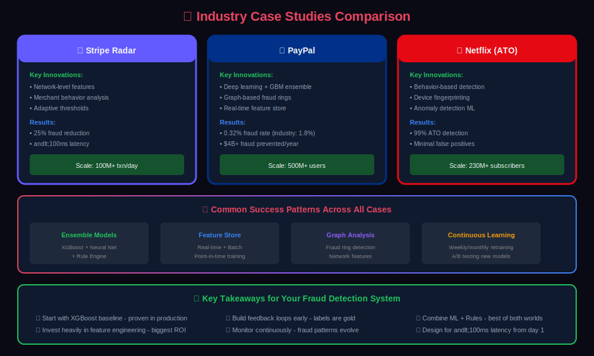
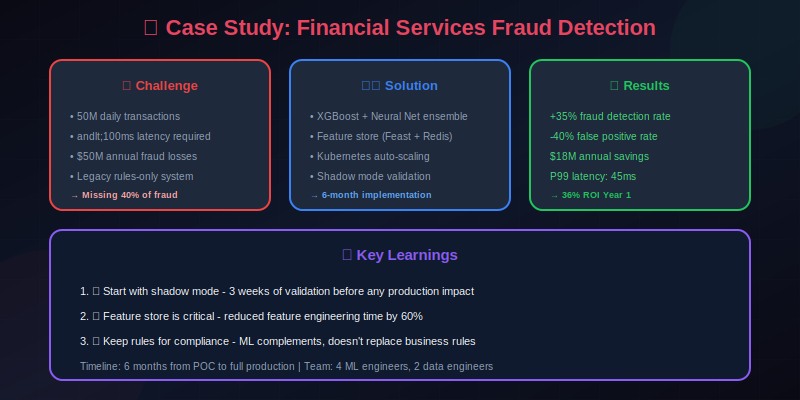
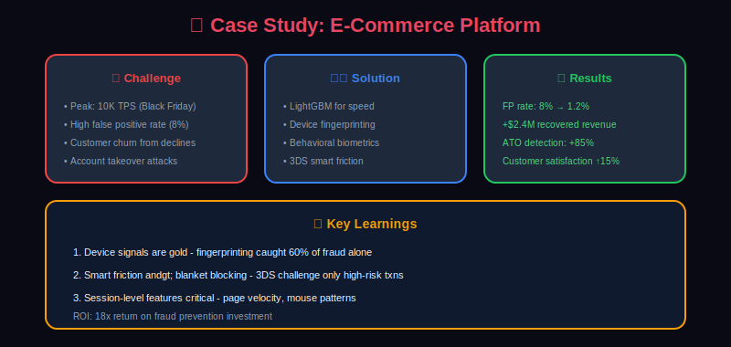
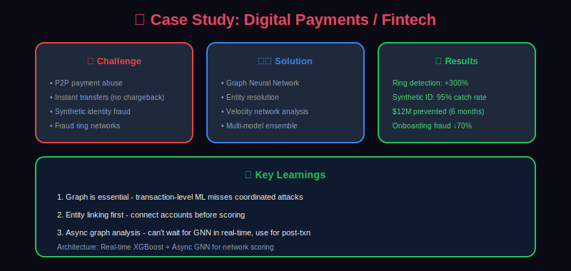
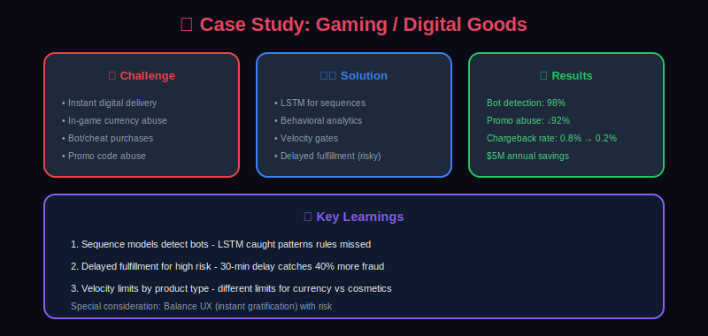

# 📚 Case Studies in Fraud Detection

> Real-world implementations and lessons learned from building fraud detection systems at scale.

---

## 📊 Visual Overview

### Industry Comparison


---

## 📖 Table of Contents

1. [Case Study 1: E-Commerce Payment Fraud](#case-study-1-e-commerce-payment-fraud)

2. [Case Study 2: Account Takeover Prevention](#case-study-2-account-takeover-prevention)

3. [Case Study 3: Real-Time Card Fraud at Scale](#case-study-3-real-time-card-fraud-at-scale)

4. [Case Study 4: Insurance Fraud Detection](#case-study-4-insurance-fraud-detection)

5. [Lessons Learned](#lessons-learned)

6. [Common Pitfalls](#common-pitfalls)

7. [Industry Best Practices](#industry-best-practices)

---

## Case Study 1: E-Commerce Payment Fraud

### Company Profile

- **Industry**: Online Retail Marketplace

- **Scale**: 50M+ transactions/month

- **Fraud Rate**: 0.5% before, 0.15% after implementation

- **Avg Transaction**: $85

### Challenge



### Solution Architecture



### Technical Implementation

```python
# Simplified scoring service
class EcommerceF raudScorer:
    def __init__(self):
        self.feature_store = FeatureStore()
        self.models = {
            'xgb_amount': XGBoostModel('amount_model.json'),
            'xgb_velocity': XGBoostModel('velocity_model.json'),
            'xgb_device': XGBoostModel('device_model.json'),
            'lstm_session': LSTMModel('session_model.pt')
        }
        self.rule_engine = RuleEngine()

    async def score(self, transaction: dict) -> dict:
        # Parallel feature retrieval
        features = await self.feature_store.get_all_features(transaction)

        # Run models in parallel
        model_scores = await asyncio.gather(
            self.models['xgb_amount'].predict(features['amount_features']),
            self.models['xgb_velocity'].predict(features['velocity_features']),
            self.models['xgb_device'].predict(features['device_features']),
            self.models['lstm_session'].predict(features['session_sequence'])
        )

        # Ensemble combination
        ensemble_score = self._combine_scores(model_scores, features)

        # Rule evaluation
        rule_results = self.rule_engine.evaluate(transaction, features)

        # Final decision
        decision = self._make_decision(ensemble_score, rule_results)

        return decision

    def _combine_scores(self, scores: list, features: dict) -> float:
        # Weighted ensemble with context-aware weights
        weights = self._get_context_weights(features)
        return sum(s * w for s, w in zip(scores, weights))

    def _get_context_weights(self, features: dict) -> list:
        # Adjust weights based on context
        if features['user']['is_new_user']:
            return [0.2, 0.3, 0.4, 0.1]  # More weight on device
        elif features['transaction']['is_high_value']:
            return [0.4, 0.3, 0.2, 0.1]  # More weight on amount
        else:
            return [0.25, 0.25, 0.25, 0.25]  # Balanced

```

### Key Features That Worked

| Feature | Impact | Description |
|---------|--------|-------------|
| session_pages_before_checkout | High | Fraudsters skip browsing |
| device_user_count_7d | High | Fraud rings share devices |
| user_amount_zscore | High | Unusual amounts vs history |
| email_domain_age_days | Medium | New domains suspicious |
| time_to_checkout_seconds | Medium | Too fast = automated |
| shipping_billing_distance_km | Medium | Mismatched addresses |

### Lessons Learned

1. **Session behavior was gold**: Legitimate users browse; fraudsters don't

2. **Device signals crucial**: Device fingerprinting caught 40% of fraud

3. **Velocity windows matter**: 1-hour windows caught rapid-fire fraud

4. **Rule-ML hybrid essential**: Rules for instant protection, ML for patterns

---

## Case Study 2: Account Takeover Prevention

### Company Profile

- **Industry**: Financial Services

- **Scale**: 10M active accounts

- **ATO Attempts**: 500K/month

- **Prevention Rate**: 99.2%

### Challenge



### Solution: Multi-Layer Defense

```python
class ATODefenseSystem:
    """Multi-layer account takeover prevention"""

    def __init__(self):
        self.login_analyzer = LoginAnalyzer()
        self.behavior_analyzer = BehaviorAnalyzer()
        self.device_analyzer = DeviceAnalyzer()
        self.session_analyzer = SessionAnalyzer()

    async def evaluate_login(self, login_event: dict) -> dict:
        """Evaluate login attempt for ATO risk"""

        # Layer 1: Velocity checks
        velocity_score = await self.login_analyzer.check_velocity(login_event)

        if velocity_score > 0.9:  # Obvious attack
            return {'action': 'BLOCK', 'reason': 'velocity_limit', 'risk': velocity_score}

        # Layer 2: Device analysis
        device_risk = await self.device_analyzer.analyze(login_event)

        # Layer 3: Behavioral analysis
        behavior_risk = await self.behavior_analyzer.analyze(login_event)

        # Layer 4: Network analysis
        network_risk = await self._check_network_signals(login_event)

        # Combine signals
        combined_risk = self._combine_risks([
            (velocity_score, 0.2),
            (device_risk, 0.3),
            (behavior_risk, 0.3),
            (network_risk, 0.2)
        ])

        return self._make_decision(combined_risk, login_event)

    def _make_decision(self, risk: float, event: dict) -> dict:
        if risk > 0.8:
            return {
                'action': 'STEP_UP',  # Require additional verification
                'method': self._choose_verification_method(event),
                'risk': risk
            }
        elif risk > 0.5:
            return {
                'action': 'CHALLENGE',  # Simple challenge (CAPTCHA)
                'risk': risk
            }
        else:
            return {
                'action': 'ALLOW',
                'risk': risk
            }

    def _choose_verification_method(self, event: dict) -> str:
        """Choose appropriate step-up verification"""

        user_factors = self._get_user_factors(event['user_id'])

        if user_factors.get('phone_verified'):
            return 'SMS_OTP'
        elif user_factors.get('email_verified'):
            return 'EMAIL_OTP'
        elif user_factors.get('authenticator_enabled'):
            return 'TOTP'
        else:
            return 'SECURITY_QUESTIONS'

```

### Behavioral Biometrics Features

```python
class BehaviorBiometrics:
    """Extract behavioral biometric features"""

    def extract_typing_features(self, keystrokes: list) -> dict:
        """Extract typing pattern features"""

        if len(keystrokes) < 5:
            return {'typing_available': False}

        # Calculate inter-key timings
        timings = []
        for i in range(1, len(keystrokes)):
            timing = keystrokes[i]['timestamp'] - keystrokes[i-1]['timestamp']
            timings.append(timing)

        return {
            'typing_available': True,
            'typing_speed_mean': np.mean(timings),
            'typing_speed_std': np.std(timings),
            'typing_rhythm_entropy': self._calculate_entropy(timings),
            'pause_count': sum(1 for t in timings if t > 500),
            'very_fast_keys': sum(1 for t in timings if t < 50)
        }

    def extract_mouse_features(self, mouse_events: list) -> dict:
        """Extract mouse behavior features"""

        if len(mouse_events) < 10:
            return {'mouse_available': False}

        # Calculate movement patterns
        speeds = []
        angles = []

        for i in range(1, len(mouse_events)):
            dx = mouse_events[i]['x'] - mouse_events[i-1]['x']
            dy = mouse_events[i]['y'] - mouse_events[i-1]['y']
            dt = mouse_events[i]['timestamp'] - mouse_events[i-1]['timestamp']

            distance = np.sqrt(dx**2 + dy**2)
            speed = distance / max(dt, 1)
            angle = np.arctan2(dy, dx)

            speeds.append(speed)
            angles.append(angle)

        return {
            'mouse_available': True,
            'mouse_speed_mean': np.mean(speeds),
            'mouse_speed_std': np.std(speeds),
            'mouse_straightness': self._calculate_straightness(mouse_events),
            'click_precision': self._calculate_click_precision(mouse_events),
            'movement_entropy': self._calculate_entropy(angles)
        }

```

### Results

```yaml
ATO Prevention Results:

Before Implementation:
  - ATO success rate: 2.5%
  - False lockout rate: 5%
  - User friction complaints: High

After Implementation:
  - ATO success rate: 0.08%
  - False lockout rate: 0.3%
  - Step-up rate: 2% (targeted)

Key Metrics:
  - 97% reduction in successful ATOs
  - 94% reduction in false lockouts
  - Customer satisfaction improved 15%

```

---

## Case Study 3: Real-Time Card Fraud at Scale

### Company Profile

- **Industry**: Payment Processor

- **Scale**: 100M+ transactions/day

- **Latency Requirement**: <50ms P99
- **Fraud Prevented**: $2B/year

### Architecture for Scale



### Latency Optimization Techniques

```python
class LatencyOptimizedScorer:
    """Ultra-low latency fraud scoring"""

    def __init__(self):
        # Pre-loaded models in memory
        self.models = self._load_and_optimize_models()

        # Connection pools
        self.redis_pool = RedisPool(max_connections=100)

        # Feature caching
        self.l1_cache = LRUCache(maxsize=50000)

    async def score(self, transaction: dict) -> dict:
        """Score with strict latency budget"""

        async with timeout(0.040):  # 40ms total budget
            # Parallel execution with individual timeouts
            features_task = asyncio.create_task(
                self._get_features_with_timeout(transaction, timeout=0.015)
            )
            rules_task = asyncio.create_task(
                self._check_rules_with_timeout(transaction, timeout=0.010)
            )

            features = await features_task
            rules_result = await rules_task

            # Fast path: rule-based immediate decision
            if rules_result.get('immediate_decision'):
                return rules_result

            # Model inference with timeout
            score = await self._inference_with_timeout(features, timeout=0.012)

            return self._combine_decision(score, rules_result)

    async def _get_features_with_timeout(self, txn: dict, timeout: float) -> dict:
        """Get features with graceful degradation on timeout"""

        try:
            async with asyncio.timeout(timeout):
                return await self._get_all_features(txn)
        except asyncio.TimeoutError:
            # Return cached/default features
            return self._get_degraded_features(txn)

    def _load_and_optimize_models(self):
        """Load and optimize models for inference"""

        models = {}

        # Load XGBoost with optimizations
        xgb_model = xgb.Booster()
        xgb_model.load_model('model.json')
        xgb_model.set_param('nthread', 4)
        xgb_model.set_param('predictor', 'cpu_predictor')
        models['xgboost'] = xgb_model

        # Load ONNX model for neural network
        import onnxruntime as ort
        ort_session = ort.InferenceSession(
            'neural_model.onnx',
            providers=['CPUExecutionProvider']
        )
        models['neural'] = ort_session

        return models

```

### Feature Store at Scale

```python
class HighScaleFeatureStore:
    """Feature store optimized for 100M+ daily transactions"""

    def __init__(self):
        self.redis_cluster = RedisCluster(nodes=REDIS_NODES)

    async def update_on_transaction(self, transaction: dict):
        """Update features incrementally on each transaction"""

        user_id = transaction['user_id']
        card_id = transaction['card_id']
        merchant_id = transaction['merchant_id']
        amount = transaction['amount']
        timestamp = int(transaction['timestamp'].timestamp())

        # Pipeline for atomic updates
        async with self.redis_cluster.pipeline() as pipe:
            # User velocity counters
            for window in ['1m', '1h', '24h']:
                ttl = {'1m': 120, '1h': 7200, '24h': 172800}[window]

                pipe.zadd(f"user:{user_id}:txns:{window}", {str(uuid.uuid4()): timestamp})
                pipe.zremrangebyscore(f"user:{user_id}:txns:{window}", 0, timestamp - ttl)
                pipe.expire(f"user:{user_id}:txns:{window}", ttl)

                pipe.zincrby(f"user:{user_id}:amount:{window}", amount, "total")
                pipe.expire(f"user:{user_id}:amount:{window}", ttl)

            # Merchant velocity
            pipe.hincrby(f"merchant:{merchant_id}:stats", "txn_count", 1)
            pipe.hincrbyfloat(f"merchant:{merchant_id}:stats", "total_amount", amount)

            # Card velocity
            pipe.zadd(f"card:{card_id}:txns", {str(uuid.uuid4()): timestamp})
            pipe.zremrangebyscore(f"card:{card_id}:txns", 0, timestamp - 86400)

            await pipe.execute()

    async def get_features(self, transaction: dict) -> dict:
        """Get all features with single round-trip"""

        user_id = transaction['user_id']
        card_id = transaction['card_id']
        timestamp = int(transaction['timestamp'].timestamp())

        async with self.redis_cluster.pipeline() as pipe:
            # User features
            for window in ['1m', '1h', '24h']:
                ttl = {'1m': 60, '1h': 3600, '24h': 86400}[window]
                pipe.zcount(f"user:{user_id}:txns:{window}", timestamp - ttl, timestamp)
                pipe.zscore(f"user:{user_id}:amount:{window}", "total")

            # Card features
            pipe.zcount(f"card:{card_id}:txns", timestamp - 86400, timestamp)

            results = await pipe.execute()

        return {
            'user_txn_count_1m': results[0],
            'user_amount_1m': results[1] or 0,
            'user_txn_count_1h': results[2],
            'user_amount_1h': results[3] or 0,
            'user_txn_count_24h': results[4],
            'user_amount_24h': results[5] or 0,
            'card_txn_count_24h': results[6]
        }

```

---

## Case Study 4: Insurance Fraud Detection

### Company Profile

- **Industry**: Insurance (Auto/Property)

- **Scale**: 2M claims/year

- **Fraud Rate**: 10% (industry average)

- **Detection Goal**: Identify for investigation

### Unique Challenges

```yaml
Insurance Fraud Characteristics:

Unlike Payment Fraud:
  - Longer decision timeline (days, not milliseconds)
  - Higher value per case ($10K+ average)
  - More complex investigation required
  - Human judgment critical
  - Legal/regulatory scrutiny high

Fraud Types:
  - Staged accidents (25%)
  - Inflated claims (35%)
  - Fake claims (20%)
  - Provider fraud (15%)
  - Other (5%)

```

### Solution: Investigation Prioritization

```python
class InsuranceFraudScorer:
    """Score claims for investigation priority"""

    def __init__(self):
        self.text_analyzer = ClaimTextAnalyzer()
        self.network_analyzer = ClaimNetworkAnalyzer()
        self.pattern_matcher = FraudPatternMatcher()

    def score_claim(self, claim: dict) -> dict:
        """Score insurance claim for fraud investigation"""

        # Text analysis of claim description
        text_signals = self.text_analyzer.analyze(claim['description'])

        # Network analysis (connected claims, providers, claimants)
        network_signals = self.network_analyzer.analyze(claim)

        # Pattern matching against known fraud patterns
        pattern_signals = self.pattern_matcher.match(claim)

        # Historical behavior of claimant
        history_signals = self._analyze_claimant_history(claim['claimant_id'])

        # Provider risk assessment
        provider_signals = self._analyze_provider(claim.get('provider_id'))

        # Combine all signals
        fraud_score = self._combine_signals({
            'text': text_signals,
            'network': network_signals,
            'patterns': pattern_signals,
            'history': history_signals,
            'provider': provider_signals
        })

        # Generate investigation priority
        priority = self._calculate_priority(fraud_score, claim['amount'])

        return {
            'fraud_score': fraud_score,
            'priority': priority,
            'recommended_action': self._get_recommendation(priority),
            'key_signals': self._get_key_signals(fraud_score),
            'investigation_points': self._generate_investigation_points(claim)
        }

    def _calculate_priority(self, score: float, amount: float) -> str:
        """Calculate investigation priority based on score and amount"""

        # Risk-adjusted priority
        risk_value = score * amount

        if risk_value > 50000 or score > 0.9:
            return 'CRITICAL'
        elif risk_value > 20000 or score > 0.7:
            return 'HIGH'
        elif risk_value > 5000 or score > 0.5:
            return 'MEDIUM'
        else:
            return 'LOW'

```

### Network Analysis for Fraud Rings

```python
import networkx as nx

class InsuranceFraudNetwork:
    """Detect fraud rings using network analysis"""

    def __init__(self):
        self.graph = nx.Graph()

    def build_network(self, claims: List[dict]):
        """Build claim relationship network"""

        for claim in claims:
            claim_id = claim['claim_id']

            # Add claim node
            self.graph.add_node(claim_id, type='claim', **claim)

            # Connect to claimant
            self.graph.add_edge(claim_id, f"claimant_{claim['claimant_id']}")

            # Connect to provider
            if claim.get('provider_id'):
                self.graph.add_edge(claim_id, f"provider_{claim['provider_id']}")

            # Connect to address
            self.graph.add_edge(claim_id, f"address_{claim['address_hash']}")

            # Connect to phone
            if claim.get('phone'):
                self.graph.add_edge(claim_id, f"phone_{claim['phone_hash']}")

            # Connect to bank account
            if claim.get('bank_account'):
                self.graph.add_edge(claim_id, f"bank_{claim['bank_hash']}")

    def detect_fraud_rings(self) -> List[dict]:
        """Detect potential fraud rings"""

        rings = []

        # Find connected components with suspicious characteristics
        for component in nx.connected_components(self.graph):
            subgraph = self.graph.subgraph(component)

            # Count claim nodes
            claims = [n for n in subgraph.nodes if subgraph.nodes[n].get('type') == 'claim']

            if len(claims) < 3:
                continue

            # Calculate ring characteristics
            ring_analysis = self._analyze_ring(subgraph, claims)

            if ring_analysis['suspicion_score'] > 0.6:
                rings.append({
                    'claims': claims,
                    'shared_entities': ring_analysis['shared_entities'],
                    'suspicion_score': ring_analysis['suspicion_score'],
                    'total_amount': ring_analysis['total_amount'],
                    'patterns': ring_analysis['patterns']
                })

        return rings

    def _analyze_ring(self, subgraph, claims) -> dict:
        """Analyze a potential fraud ring"""

        # Find shared entities
        shared = {
            'addresses': set(),
            'phones': set(),
            'providers': set(),
            'banks': set()
        }

        for node in subgraph.nodes:
            if node.startswith('address_'):
                if subgraph.degree(node) > 1:
                    shared['addresses'].add(node)
            elif node.startswith('phone_'):
                if subgraph.degree(node) > 1:
                    shared['phones'].add(node)
            # ... etc

        # Calculate suspicion score
        suspicion_factors = [
            len(shared['addresses']) > 0,
            len(shared['phones']) > 0,
            len(shared['providers']) > 0 and len(shared['providers']) < 3,
            self._check_timing_patterns(claims)
        ]

        suspicion_score = sum(suspicion_factors) / len(suspicion_factors)

        return {
            'shared_entities': shared,
            'suspicion_score': suspicion_score,
            'total_amount': sum(subgraph.nodes[c].get('amount', 0) for c in claims),
            'patterns': self._identify_patterns(claims)
        }

```

---

## Lessons Learned

### Technical Lessons

```yaml

1. Start Simple, Add Complexity:
   - Begin with logistic regression baseline
   - Add features incrementally, measuring impact
   - Complex models last (deep learning, graphs)

2. Feature Engineering > Model Complexity:
   - 80% of gains from better features
   - Velocity features consistently high impact
   - Behavioral features underutilized

3. Latency Budgets Are Real:
   - Every millisecond matters at scale
   - Parallelize everything possible
   - Cache aggressively

4. Monitoring Is Not Optional:
   - Model drift happens fast (days)
   - Feature drift even faster
   - Automated alerts essential

5. Human-in-the-Loop Required:
   - ML augments, doesn't replace investigators
   - Feedback loops crucial for improvement
   - Edge cases need human judgment

```

### Organizational Lessons

```yaml

1. Cross-Functional Teams:
   - ML engineers + fraud analysts + ops
   - Domain expertise irreplaceable
   - Regular knowledge sharing

2. Metrics Alignment:
   - Balance precision and recall
   - Track business metrics ($)
   - Customer experience matters

3. Regulatory Awareness:
   - Build compliance from day 1
   - Explainability not afterthought
   - Document everything

4. Continuous Improvement:
   - Fraudsters evolve quickly
   - Monthly model updates minimum
   - Weekly rule adjustments

```

---

## Common Pitfalls

### 1. Data Leakage

```python
# WRONG: Using future information
def extract_features_wrong(transaction):
    # This uses data that wouldn't be available at decision time!
    user_chargebacks = get_user_chargebacks(transaction['user_id'])
    return {'chargeback_count': len(user_chargebacks)}

# RIGHT: Point-in-time correct features
def extract_features_right(transaction):
    cutoff_time = transaction['timestamp']
    user_chargebacks = get_user_chargebacks(
        transaction['user_id'],
        before=cutoff_time
    )
    return {'chargeback_count': len(user_chargebacks)}

```

### 2. Ignoring Class Imbalance

```python
# WRONG: Random train/test split
X_train, X_test, y_train, y_test = train_test_split(X, y, test_size=0.2)
# Fraud rate in train: 0.5%, test: 0.5% - but different fraud patterns!

# RIGHT: Temporal split with stratification
train_end = '2024-01-01'
X_train = X[X['timestamp'] < train_end]
X_test = X[X['timestamp'] >= train_end]
# Evaluates on future data, like production

```

### 3. Overfitting to Known Patterns

```python
# Problem: Model only catches known fraud types
# Solution: Combine supervised and unsupervised

class HybridFraudDetector:
    def __init__(self):
        self.supervised = XGBoostClassifier()  # Known patterns
        self.anomaly = IsolationForest()       # Unknown patterns

    def detect(self, transaction):
        supervised_score = self.supervised.predict_proba(transaction)[1]
        anomaly_score = -self.anomaly.score_samples(transaction)[0]

        # Combine both signals
        return max(supervised_score, anomaly_score * 0.7)

```

---

## Industry Best Practices

### Consortium Data Sharing

```python
class FraudConsortium:
    """Share fraud signals across organizations"""

    def contribute_signal(self, entity_hash: str, signal_type: str, score: float):
        """Contribute a fraud signal (privacy-preserving)"""

        # Hash sensitive identifiers
        contribution = {
            'entity_hash': self._secure_hash(entity_hash),
            'signal_type': signal_type,
            'score': score,
            'timestamp': datetime.utcnow()
        }

        self.consortium_api.submit(contribution)

    def query_signals(self, entity_hashes: List[str]) -> dict:
        """Query consortium for fraud signals"""

        hashed = [self._secure_hash(h) for h in entity_hashes]
        return self.consortium_api.query(hashed)

```

### Continuous Model Improvement

```yaml
Model Improvement Cycle:

Weekly:
  - Review false positive complaints
  - Update rule thresholds
  - Deploy hot fixes for new patterns

Monthly:
  - Retrain models with new data
  - Feature importance analysis
  - A/B test model improvements

Quarterly:
  - Major model updates
  - Architecture improvements
  - Fairness audits

Annually:
  - Full system review
  - Technology stack assessment
  - Competitive analysis

```

---

## Summary

Key takeaways from real-world implementations:

1. **Context matters**: E-commerce, ATO, payments, insurance all different

2. **Scale requires optimization**: Every millisecond counts

3. **Hybrid approaches work best**: ML + rules + humans

4. **Continuous improvement essential**: Fraudsters never stop

5. **Business alignment critical**: Technical success ≠ business success

---

## Conclusion

Fraud detection is a continuous battle requiring:

- Strong technical foundations

- Domain expertise

- Operational excellence

- Continuous adaptation

The systems described in this guide provide a framework, but each organization must adapt to their unique context, scale, and fraud landscape.

---

## Additional Resources

- [Association of Certified Fraud Examiners](https://www.acfe.com/)

- [IEEE Fraud Detection Research](https://ieeexplore.ieee.org/)

- [Kaggle Fraud Detection Competitions](https://www.kaggle.com/competitions)

- [MLOps Community](https://mlops.community/)

---

**Thank you for reading this comprehensive guide to Fraud Detection ML Systems!**

*Last Updated: January 2026*

---

<div align="center">

**[⬆ Back to Top](#)** | **[📚 Main Repository](https://github.com/Gaurav14cs17/ml_system_design)**

Made with 💜 by [Gaurav14cs17](https://github.com/Gaurav14cs17)

</div>
