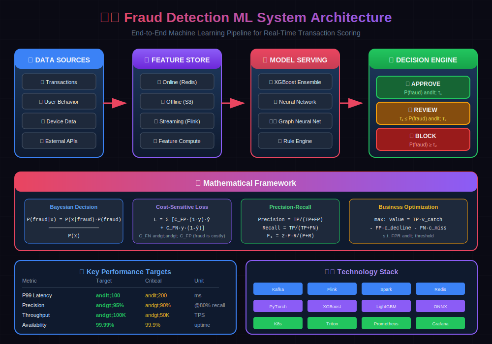

# 🛡️ Fraud Detection ML System Design

> A comprehensive guide to designing, building, and deploying production-grade fraud detection systems using machine learning.

## 📚 Table of Contents

| # | Topic | Description |
|---|-------|-------------|
| 01 | [Introduction to Fraud Detection](./01_introduction/) | Overview, types of fraud, business impact, and system requirements |
| 02 | [Data Collection & Preprocessing](./02_data_collection_and_preprocessing/) | Data sources, ETL pipelines, data quality, and preprocessing strategies |
| 03 | [Feature Engineering](./03_feature_engineering/) | Feature types, aggregations, embeddings, and feature selection |
| 04 | [Model Architecture](./04_model_architecture/) | ML models, ensemble methods, deep learning, and graph neural networks |
| 05 | [Real-Time Inference](./05_real_time_inference/) | Low-latency serving, streaming architectures, and optimization |
| 06 | [Rule Engine](./06_rule_engine/) | Business rules, hybrid systems, and rule management |
| 07 | [Model Training & Evaluation](./07_model_training_and_evaluation/) | Training pipelines, metrics, class imbalance, and validation |
| 08 | [Feature Store](./08_feature_store/) | Online/offline stores, feature serving, and feature management |
| 09 | [Monitoring & Observability](./09_monitoring_and_observability/) | Model drift, performance monitoring, alerting, and dashboards |
| 10 | [Deployment & Scaling](./10_deployment_and_scaling/) | Infrastructure, containerization, scaling strategies, and CI/CD |
| 11 | [Explainability & Compliance](./11_explainability_and_compliance/) | Model interpretability, regulatory requirements, and audit trails |
| 12 | [Case Studies](./12_case_studies/) | Real-world implementations and lessons learned |

---

## 🎯 System Overview

---

## 📐 Mathematical Framework

### The Fraud Detection Problem

At its core, fraud detection is a **cost-sensitive binary classification** problem. Given a transaction with features $\mathbf{x}$, we estimate:

$$P(\text{fraud} | \mathbf{x}) = f(\mathbf{x}; \theta)$$

### Bayesian Decision Theory

The optimal decision minimizes **expected cost**:

$$\text{Decision} = \begin{cases}
\text{BLOCK} & \text{if } P(\text{fraud}|\mathbf{x}) \cdot C_{FN} > (1 - P(\text{fraud}|\mathbf{x})) \cdot C_{FP} \\
\text{APPROVE} & \text{otherwise}
\end{cases}$$

Where $C_{FN}$ is the cost of missing fraud and $C_{FP}$ is the cost of blocking legitimate transactions.

### Key Mathematical Concepts

| Concept | Formula | Chapter |
|---------|---------|---------|
| **Bayes' Theorem** | $P(y\|\mathbf{x}) = \frac{P(\mathbf{x}\|y) P(y)}{P(\mathbf{x})}$ | [Ch. 1](./01_introduction/) |
| **Z-Score Anomaly** | $z = \frac{x - \mu}{\sigma}$ | [Ch. 3](./03_feature_engineering/) |
| **Focal Loss** | $\mathcal{L} = -\alpha(1-p_t)^\gamma \log(p_t)$ | [Ch. 4](./04_model_architecture/) |
| **PR-AUC** | $\int_0^1 P(r) \, dr$ | [Ch. 7](./07_model_training_and_evaluation/) |
| **F-beta Score** | $F_\beta = (1+\beta^2) \frac{P \cdot R}{\beta^2 P + R}$ | [Ch. 7](./07_model_training_and_evaluation/) |

### Class Imbalance Challenge

With fraud rates $\eta \approx 0.1\% - 1\%$, standard metrics fail:

- ❌ **Accuracy**: A model predicting "no fraud" achieves $99\%+$ accuracy

- ✅ **PR-AUC**: Focuses on minority class performance

- ✅ **Precision@Recall**: Business-relevant operating points

---

## 🚀 Key Design Principles

1. **Low Latency**: Sub-100ms inference for real-time decisions

2. **High Availability**: 99.99% uptime for critical financial systems

3. **Scalability**: Handle millions of transactions per second

4. **Explainability**: Clear reasoning for regulatory compliance

5. **Adaptability**: Quick response to new fraud patterns

## 📊 Key Metrics

| Metric | Target | Description |
|--------|--------|-------------|
| Precision | >95% | Minimize false positives to avoid customer friction |
| Recall | >80% | Catch as many fraud cases as possible |
| Latency P99 | <100ms | Real-time decision making |
| Throughput | >100K TPS | Handle peak transaction volumes |

## 🛠️ Technology Stack

- **Data Processing**: Apache Kafka, Apache Flink, Apache Spark

- **Feature Store**: Feast, Tecton, or custom Redis-based solution

- **ML Framework**: PyTorch, TensorFlow, XGBoost, LightGBM

- **Model Serving**: Triton Inference Server, TensorFlow Serving, Seldon

- **Monitoring**: Prometheus, Grafana, custom ML monitoring

- **Infrastructure**: Kubernetes, Docker, AWS/GCP/Azure

---

## 📖 How to Use This Guide

Each subdirectory contains:

- `README.md` - Comprehensive blog-style explanation

- `code/` - Implementation examples

- `diagrams/` - Architecture and flow diagrams

- `resources/` - Additional reading materials

Start with the [Introduction](./01_introduction/) and progress through each topic sequentially for the best learning experience.

---

**Author**: ML System Design Series
**Last Updated**: January 2026
**License**: MIT

---

**[⬆ Back to Top](#)** | **[📚 Main Repository](https://github.com/Gaurav14cs17/ml_system_design)**

Made with 💜 by [Gaurav14cs17](https://github.com/Gaurav14cs17)

