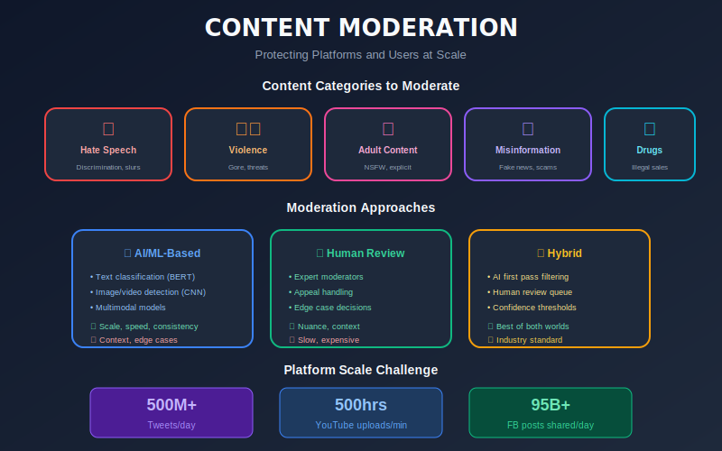
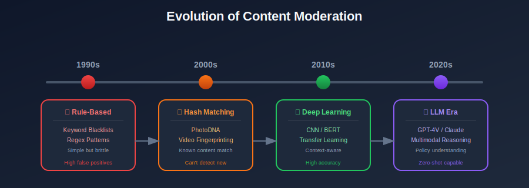

# Introduction to Content Moderation Systems


## Table of Contents
- [What is Content Moderation?](#what-is-content-moderation)
- [Why is Content Moderation Important?](#why-is-content-moderation-important)
- [Types of Content Moderation](#types-of-content-moderation)
- [The Scale of the Problem](#the-scale-of-the-problem)
- [Evolution of Content Moderation](#evolution-of-content-moderation)
- [Key Stakeholders](#key-stakeholders)
- [Challenges Overview](#challenges-overview)

---

## What is Content Moderation?

Content moderation is the practice of **monitoring, reviewing, and managing user-generated content (UGC)** on digital platforms to ensure it adheres to community guidelines, legal requirements, and platform policies. This process involves identifying and taking action on content that may be:

- **Harmful**: Violence, self-harm, dangerous activities
- **Illegal**: Child exploitation, terrorism, drug trafficking
- **Offensive**: Hate speech, harassment, bullying
- **Misleading**: Misinformation, fake news, scams
- **Inappropriate**: Adult content, graphic imagery
- **Spam**: Unsolicited promotional content, bots

### The Content Lifecycle



---

## Why is Content Moderation Important?

### 1. **User Safety and Well-being**
Platforms have a responsibility to protect users from harmful content. Studies show that exposure to violent, hateful, or self-harm content can have significant psychological impacts on users, particularly younger demographics.

### 2. **Legal Compliance**
Various jurisdictions have enacted laws requiring platforms to remove certain types of content:
- **GDPR (EU)**: Right to erasure
- **NetzDG (Germany)**: 24-hour removal of illegal content
- **DSA (EU)**: Digital Services Act requirements
- **COPPA (US)**: Children's online privacy protection
- **IT Rules 2021 (India)**: 36-hour content removal window

### 3. **Brand and Platform Integrity**
Advertisers and partners are reluctant to associate with platforms hosting harmful content. Content moderation directly impacts:
- Advertiser confidence
- User trust
- Platform reputation
- Stock valuation for public companies

### 4. **Community Health**
Healthy online communities require active moderation to:
- Maintain civil discourse
- Encourage positive engagement
- Prevent community toxicity
- Support diverse viewpoints

### 5. **Business Continuity**
Failure to moderate can result in:
- App store removal
- Payment processor restrictions
- ISP blocking in certain countries
- Regulatory penalties

---

## Types of Content Moderation

### By Timing

| Type | Description | Use Case |
|------|-------------|----------|
| **Pre-moderation** | Content reviewed before publication | High-stakes platforms, children's content |
| **Post-moderation** | Content reviewed after publication | Social media, forums |
| **Reactive moderation** | Review triggered by user reports | Community-driven platforms |
| **Real-time moderation** | Instant automated decisions | Live streaming, chat |

### By Method

#### 1. **Human Moderation**
- Professional content reviewers
- Community moderators
- Subject matter experts
- Distributed moderation (crowdsourced)

**Pros**: Nuanced understanding, context awareness, handles edge cases
**Cons**: Expensive, slow, psychological toll on moderators, inconsistent

#### 2. **Automated Moderation (AI/ML)**
- Text classification models
- Image/video analysis
- Audio transcription and analysis
- Behavior pattern detection

**Pros**: Fast, scalable, consistent, cost-effective at scale
**Cons**: Lacks nuance, adversarial attacks, cultural context challenges

#### 3. **Hybrid Moderation**
The industry standard combining:
- AI for first-pass filtering
- Human review for uncertain cases
- Escalation workflows for complex situations
- Continuous model improvement from human decisions

---

## The Scale of the Problem

### Content Volume Statistics (Industry Estimates)

| Platform Type | Daily Uploads | Moderation Challenge |
|--------------|---------------|---------------------|
| Major Social Network | 500M+ posts | Multilingual, multimedia |
| Video Platform | 500+ hours/minute | Long-form video analysis |
| Messaging Apps | 100B+ messages | End-to-end encryption challenges |
| E-commerce | 50M+ listings | Product safety, counterfeit |
| Gaming Platforms | 2B+ chat messages | Real-time, slang-heavy |

### The Mathematics of Scale

```python

# Example: Content moderation economics

daily_posts = 500_000_000  # 500M posts per day
avg_review_time_seconds = 30  # Human review time
working_hours_per_day = 8

# If all content needed human review:
total_seconds_needed = daily_posts * avg_review_time_seconds
total_hours_needed = total_seconds_needed / 3600
moderators_needed = total_hours_needed / working_hours_per_day

print(f"Moderators needed: {moderators_needed:,.0f}")

# Output: Moderators needed: 520,833

# With 99% ML automation:
human_review_posts = daily_posts * 0.01  # 1% needs human review
moderators_with_ml = (human_review_posts * avg_review_time_seconds / 3600) / working_hours_per_day
print(f"Moderators with ML: {moderators_with_ml:,.0f}")

# Output: Moderators with ML: 5,208
```

---

## Evolution of Content Moderation

### Timeline of Key Developments



### Generation 1: Rule-Based Systems (1990s-2000s)
- Keyword blocklists
- Regular expressions
- Simple pattern matching
- High false positive rates

### Generation 2: Hash-Based Matching (2000s-2010s)
- PhotoDNA for known bad images
- Video fingerprinting
- Audio matching
- Effective for known content, useless for new

### Generation 3: Machine Learning (2010s)
- CNNs for image classification
- RNNs/LSTMs for text
- Transfer learning
- Requires large labeled datasets

### Generation 4: Deep Learning & Transformers (2015-2020)
- BERT, RoBERTa for text understanding
- ResNet, EfficientNet for images
- Video understanding models
- Multimodal architectures

### Generation 5: Large Language Models (2020s+)
- GPT-4, Claude for nuanced text analysis
- Vision-language models (GPT-4V, LLaVA)
- Reasoning capabilities
- Zero-shot classification
- Policy understanding

---

## Key Stakeholders

### Internal Stakeholders

1. **Trust & Safety Team**
   - Policy development
   - Incident response
   - Regulatory compliance
   - Stakeholder communication

2. **ML/AI Engineering**
   - Model development
   - Feature engineering
   - System architecture
   - Performance optimization

3. **Operations/Content Review**
   - Human moderation
   - Quality assurance
   - Training programs
   - Workflow optimization

4. **Legal & Policy**
   - Regulatory compliance
   - Terms of service
   - Government relations
   - Litigation support

5. **Product Team**
   - User experience
   - Appeal workflows
   - Transparency reports
   - Creator tools

### External Stakeholders

1. **Users/Creators**
   - Content creators
   - General users
   - Advertisers
   - Businesses

2. **Regulators**
   - Government agencies
   - International bodies
   - Industry associations

3. **Civil Society**
   - NGOs
   - Researchers
   - Advocacy groups
   - Journalists

---

## Challenges Overview

### Technical Challenges

| Challenge | Description | Difficulty |
|-----------|-------------|------------|
| **Scale** | Billions of content pieces daily | ⭐⭐⭐⭐⭐ |
| **Latency** | Real-time decisions needed | ⭐⭐⭐⭐ |
| **Multimodal** | Text, image, video, audio together | ⭐⭐⭐⭐⭐ |
| **Multilingual** | 100+ languages, dialects | ⭐⭐⭐⭐⭐ |
| **Context** | Same content, different meaning | ⭐⭐⭐⭐⭐ |
| **Adversarial** | Users trying to evade detection | ⭐⭐⭐⭐⭐ |
| **Evolution** | New slang, memes, trends | ⭐⭐⭐⭐ |

### Operational Challenges

1. **Moderator Well-being**
   - Exposure to disturbing content
   - PTSD and psychological trauma
   - High turnover rates
   - Support systems needed

2. **Consistency**
   - Policy interpretation variations
   - Cultural differences
   - Time pressure impacts
   - Quality vs. quantity tradeoffs

3. **Transparency**
   - Explaining decisions to users
   - Appeal processes
   - Public accountability
   - Algorithmic transparency

### Ethical Challenges

1. **Free Speech vs. Safety**
   - Drawing the line
   - Political neutrality
   - Overmoderation concerns
   - Undermoderation risks

2. **Bias and Fairness**
   - Training data bias
   - Disparate impact on communities
   - Cultural context sensitivity
   - Linguistic bias

3. **Power and Accountability**
   - Platform as arbiter of speech
   - Democratic implications
   - Global consistency vs. local norms

---

## What You'll Learn in This Series

This comprehensive guide covers:

1. **System Architecture**: Designing scalable moderation pipelines
2. **Data Strategy**: Collection, labeling, and quality
3. **Text Moderation**: NLP techniques for harmful text
4. **Visual Moderation**: Image and video analysis
5. **Model Training**: Building effective classifiers
6. **Serving Infrastructure**: Low-latency inference
7. **Evaluation**: Metrics that matter
8. **Human-in-the-Loop**: Combining AI and human judgment
9. **Scalability**: Handling billions of requests
10. **Monitoring**: Keeping systems healthy
11. **Edge Cases**: Handling the hard problems
12. **Ethics & Legal**: Navigating complex requirements
13. **Case Studies**: Real-world implementations

---

## Getting Started

### Prerequisites

To follow along with the technical content, you should have:

- **Python 3.8+** with ML libraries (PyTorch, TensorFlow, Hugging Face)
- **Basic ML knowledge**: classification, neural networks, NLP fundamentals
- **System design basics**: distributed systems, APIs, databases
- **Cloud familiarity**: AWS/GCP/Azure services

### Setting Up Your Environment

```bash

# Create virtual environment
python -m venv content_moderation_env
source content_moderation_env/bin/activate

# Install core dependencies
pip install torch transformers
pip install pillow opencv-python
pip install pandas numpy scikit-learn
pip install fastapi uvicorn
pip install redis kafka-python
```

---

## Summary

Content moderation is a critical, complex, and evolving field at the intersection of:
- **Machine Learning**: Building intelligent systems
- **Product Design**: Creating user experiences
- **Policy**: Defining community standards
- **Ethics**: Balancing competing values
- **Operations**: Scaling human judgment

The following chapters will dive deep into each component, providing both theoretical foundations and practical implementation guidance.

---

## References

1. "The Facebook Files" - Wall Street Journal Investigation
2. "Content Moderation at Scale" - Harvard Berkman Klein Center
3. "Online Content Moderation" - Congressional Research Service
4. "The Moderators" - Documentary
5. "Custodians of the Internet" - Tarleton Gillespie

---

*Next Chapter: [System Requirements & Architecture](../02_system_requirements_architecture/README.md)*

---

<div align="center">

**[⬆ Back to Top](#)** | **[📚 Main Repository](https://github.com/Gaurav14cs17/ml_system_design)**

Made with 💜 by [Gaurav14cs17](https://github.com/Gaurav14cs17)

</div>
