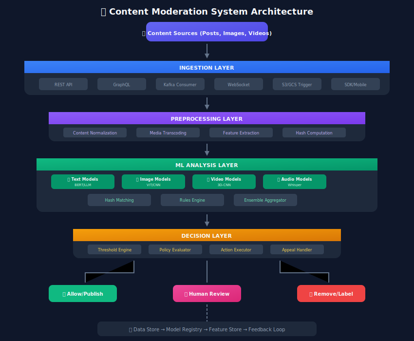
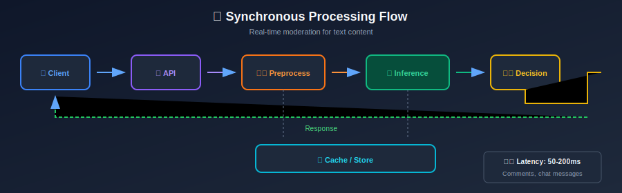
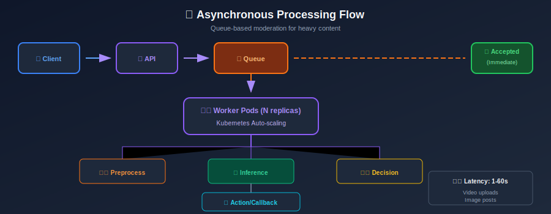
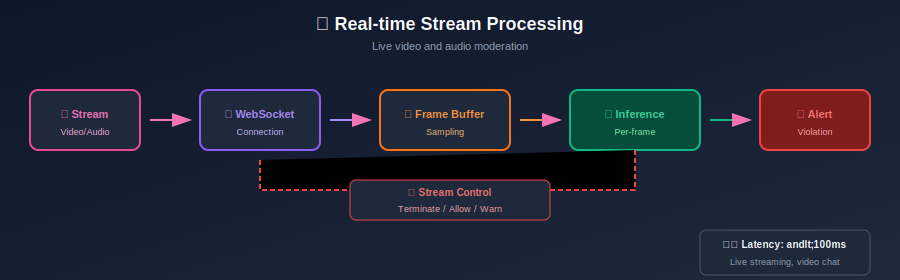
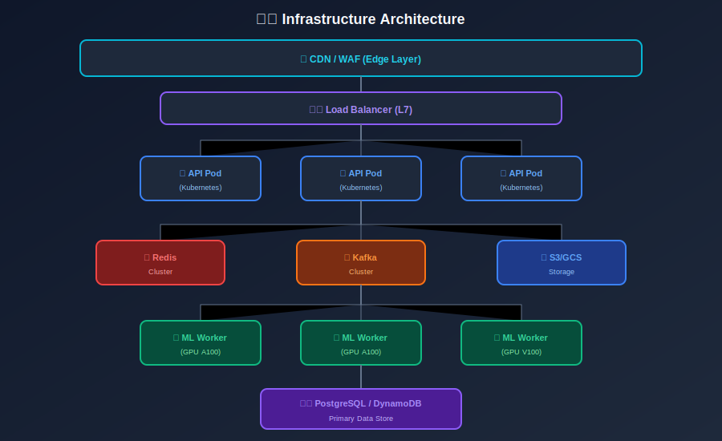

# System Requirements & Architecture for Content Moderation

## Table of Contents
- [Functional Requirements](#functional-requirements)
- [Non-Functional Requirements](#non-functional-requirements)
- [High-Level Architecture](#high-level-architecture)
- [Component Deep Dive](#component-deep-dive)
- [Data Flow Patterns](#data-flow-patterns)
- [Technology Stack](#technology-stack)
- [Deployment Strategies](#deployment-strategies)
- [Cost Considerations](#cost-considerations)

---

## Functional Requirements

### Core Features

#### 1. Content Ingestion

```
FR-001: System must accept content from multiple sources
        - API endpoints (REST, GraphQL)
        - Message queues (Kafka, SQS)
        - Streaming inputs (WebSocket)
        - Batch uploads (S3, GCS)

FR-002: System must support multiple content types
        - Text (posts, comments, messages)
        - Images (JPEG, PNG, WebP, GIF)
        - Video (MP4, WebM, streaming)
        - Audio (MP3, WAV, real-time)
        - Documents (PDF, DOCX)
        - Metadata (user info, context)

```

#### 2. Content Analysis

```
FR-003: System must classify content into policy categories
        - Violence/Gore
        - Adult/Sexual content
        - Hate speech
        - Harassment/Bullying
        - Misinformation
        - Spam/Scam
        - Self-harm/Suicide
        - Dangerous activities
        - Illegal content
        - Copyright violation

FR-004: System must provide confidence scores
        - Per-category probability scores
        - Overall violation likelihood
        - Severity ratings

FR-005: System must extract relevant signals
        - Text entities and sentiment
        - Object detection in images
        - Face detection (optional, privacy-aware)
        - Audio transcription
        - OCR for text in images

```

#### 3. Decision & Action

```
FR-006: System must support multiple action types
        - Allow (no action)
        - Flag for review
        - Reduce distribution
        - Age-gate/Warning label
        - Remove/Block
        - Account action (warn, suspend, ban)

FR-007: System must support configurable policies
        - Rule-based overrides
        - Threshold adjustments
        - A/B testing of policies
        - Geo-specific rules

```

#### 4. Human Review Integration

```
FR-008: System must route uncertain cases to human reviewers
        - Priority queuing
        - Skill-based routing
        - Load balancing
        - SLA tracking

FR-009: System must capture human decisions for model improvement
        - Decision logging
        - Disagreement tracking
        - Quality audits

```

#### 5. User-Facing Features

```
FR-010: System must support user appeals
        - Appeal submission
        - Status tracking
        - Decision notification

FR-011: System must provide transparency
        - Removal reasons
        - Policy citations
        - Educational content

```

---

## Non-Functional Requirements

### Performance Requirements

| Metric | Target | Rationale |
|--------|--------|-----------|
| **Latency (P50)** | < 100ms | Real-time user experience |
| **Latency (P99)** | < 500ms | Acceptable worst case |
| **Throughput** | 100K+ QPS | Peak traffic handling |
| **Availability** | 99.9% | Critical safety system |
| **Video Processing** | < 5 min | Reasonable upload wait |

### Scalability Requirements

```
NFR-001: Horizontal Scalability
         - System must scale linearly with traffic
         - Auto-scaling based on queue depth
         - No single points of failure

NFR-002: Data Scalability
         - Support 1B+ content items/day
         - Retain decisions for 7+ years (legal)
         - Handle 100TB+ model artifacts

```

### Reliability Requirements

```
NFR-003: Fault Tolerance
         - Graceful degradation under load
         - Circuit breakers for dependencies
         - Retry mechanisms with backoff
         - Dead letter queues for failures

NFR-004: Data Integrity
         - No content loss
         - Audit trail for all decisions
         - Consistent decision logging

```

### Security Requirements

```
NFR-005: Access Control
         - Role-based access (RBAC)
         - Principle of least privilege
         - Multi-factor authentication for reviewers

NFR-006: Data Protection
         - Encryption at rest and in transit
         - PII handling compliance
         - Data retention policies
         - Right to deletion support

```

---

## High-Level Architecture

### System Overview



---

## Component Deep Dive

### 1. Ingestion Layer

#### API Gateway

```python
# Example: FastAPI ingestion endpoint
from fastapi import FastAPI, BackgroundTasks
from pydantic import BaseModel
from typing import Optional, List
import uuid

app = FastAPI()

class ContentSubmission(BaseModel):
    content_id: str
    content_type: str  # text, image, video, audio
    text: Optional[str] = None
    media_url: Optional[str] = None
    user_id: str
    context: dict = {}
    priority: str = "normal"  # low, normal, high, critical

class ModerationResponse(BaseModel):
    request_id: str
    status: str  # pending, completed
    decision: Optional[str] = None
    scores: Optional[dict] = None

@app.post("/v1/moderate", response_model=ModerationResponse)
async def moderate_content(
    submission: ContentSubmission,
    background_tasks: BackgroundTasks
):
    request_id = str(uuid.uuid4())

    # For sync mode (blocking)
    if submission.priority == "critical":
        result = await process_sync(submission)
        return ModerationResponse(
            request_id=request_id,
            status="completed",
            decision=result.decision,
            scores=result.scores
        )

    # For async mode (non-blocking)
    background_tasks.add_task(enqueue_for_processing, submission, request_id)
    return ModerationResponse(
        request_id=request_id,
        status="pending"
    )

```

#### Message Queue Consumer

```python
# Kafka consumer for high-throughput ingestion
from kafka import KafkaConsumer
import json
from concurrent.futures import ThreadPoolExecutor

class ContentConsumer:
    def __init__(self, config):
        self.consumer = KafkaConsumer(
            'content-submissions',
            bootstrap_servers=config['kafka_brokers'],
            group_id='moderation-consumers',
            auto_offset_reset='earliest',
            enable_auto_commit=False,
            value_deserializer=lambda x: json.loads(x.decode('utf-8'))
        )
        self.executor = ThreadPoolExecutor(max_workers=config['num_workers'])

    def consume(self):
        for message in self.consumer:
            future = self.executor.submit(
                self.process_message,
                message.value
            )
            future.add_done_callback(
                lambda f: self.consumer.commit()
            )

    def process_message(self, content):
        # Preprocessing
        preprocessed = self.preprocess(content)

        # Analysis
        scores = self.analyze(preprocessed)

        # Decision
        decision = self.decide(scores)

        # Action
        self.execute_action(content, decision)

```

### 2. Preprocessing Layer

#### Text Normalization

```python
import re
from typing import Dict, Any
import unicodedata

class TextPreprocessor:
    def __init__(self):
        self.homoglyph_map = self._load_homoglyphs()
        self.slang_dict = self._load_slang_dictionary()

    def normalize(self, text: str) -> Dict[str, Any]:
        """Full text normalization pipeline."""
        result = {
            'original': text,
            'normalized': text,
            'features': {}
        }

        # 1. Unicode normalization
        text = unicodedata.normalize('NFKC', text)

        # 2. Homoglyph normalization (l33t speak, etc.)
        text = self._normalize_homoglyphs(text)

        # 3. Expand common obfuscations
        text = self._deobfuscate(text)

        # 4. Extract features before lowercasing
        result['features'] = {
            'caps_ratio': self._calculate_caps_ratio(text),
            'special_char_ratio': self._calculate_special_ratio(text),
            'repeated_chars': self._detect_char_repetition(text),
            'url_count': len(re.findall(r'https?://\S+', text)),
            'mention_count': len(re.findall(r'@\w+', text)),
        }

        # 5. Lowercase for model input
        result['normalized'] = text.lower().strip()

        return result

    def _normalize_homoglyphs(self, text: str) -> str:
        """Convert homoglyphs to standard characters."""
        # Examples: @ -> a, 0 -> o, 1 -> l, 3 -> e
        for char, replacement in self.homoglyph_map.items():
            text = text.replace(char, replacement)
        return text

    def _deobfuscate(self, text: str) -> str:
        """Handle common obfuscation patterns."""
        # Remove spaces/dots between letters: h.a.t.e -> hate
        text = re.sub(r'(\w)[.\s]+(?=\w)', r'\1', text)

        # Handle repeated characters: haaaate -> hate
        text = re.sub(r'(.)\1{2,}', r'\1\1', text)

        return text

```

#### Media Processing

```python
import cv2
import numpy as np
from PIL import Image
import io

class MediaPreprocessor:
    def __init__(self, config):
        self.image_size = config.get('image_size', (224, 224))
        self.video_fps_sample = config.get('video_fps_sample', 1)
        self.max_frames = config.get('max_frames', 32)

    def process_image(self, image_bytes: bytes) -> dict:
        """Process image for model input."""
        image = Image.open(io.BytesIO(image_bytes))

        # Extract metadata
        metadata = {
            'width': image.width,
            'height': image.height,
            'format': image.format,
            'mode': image.mode,
            'has_exif': bool(image.getexif()),
        }

        # Convert to RGB if needed
        if image.mode != 'RGB':
            image = image.convert('RGB')

        # Resize for model
        image_resized = image.resize(self.image_size, Image.LANCZOS)

        # Convert to numpy array and normalize
        image_array = np.array(image_resized) / 255.0

        # Compute perceptual hash for matching
        phash = self._compute_phash(image)

        return {
            'tensor': image_array,
            'metadata': metadata,
            'phash': phash,
            'original_size': (image.width, image.height)
        }

    def process_video(self, video_path: str) -> dict:
        """Extract frames from video for analysis."""
        cap = cv2.VideoCapture(video_path)

        fps = cap.get(cv2.CAP_PROP_FPS)
        total_frames = int(cap.get(cv2.CAP_PROP_FRAME_COUNT))
        duration = total_frames / fps

        # Calculate frame sampling
        sample_interval = int(fps / self.video_fps_sample)

        frames = []
        frame_indices = []

        for i in range(0, total_frames, sample_interval):
            if len(frames) >= self.max_frames:
                break

            cap.set(cv2.CAP_PROP_POS_FRAMES, i)
            ret, frame = cap.read()

            if ret:
                frame_rgb = cv2.cvtColor(frame, cv2.COLOR_BGR2RGB)
                frame_resized = cv2.resize(frame_rgb, self.image_size)
                frames.append(frame_resized / 255.0)
                frame_indices.append(i)

        cap.release()

        return {
            'frames': np.array(frames),
            'frame_indices': frame_indices,
            'metadata': {
                'fps': fps,
                'duration': duration,
                'total_frames': total_frames,
                'sampled_frames': len(frames)
            }
        }

    def _compute_phash(self, image: Image, hash_size: int = 16) -> str:
        """Compute perceptual hash for image matching."""
        # Resize to small square
        image = image.convert('L').resize((hash_size + 1, hash_size), Image.LANCZOS)
        pixels = np.array(image)

        # Compute difference
        diff = pixels[:, 1:] > pixels[:, :-1]

        # Convert to hex string
        return ''.join(format(byte, '02x') for byte in np.packbits(diff.flatten()))

```

### 3. Analysis Layer

#### Model Inference Service

```python
import torch
from transformers import AutoModelForSequenceClassification, AutoTokenizer
from typing import Dict, List
import numpy as np

class ModerationInferenceService:
    def __init__(self, model_configs: Dict):
        self.models = {}
        self.tokenizers = {}
        self.device = torch.device('cuda' if torch.cuda.is_available() else 'cpu')

        for model_name, config in model_configs.items():
            self._load_model(model_name, config)

    def _load_model(self, name: str, config: Dict):
        """Load a model and its tokenizer."""
        self.tokenizers[name] = AutoTokenizer.from_pretrained(config['path'])
        self.models[name] = AutoModelForSequenceClassification.from_pretrained(
            config['path']
        ).to(self.device).eval()

    @torch.no_grad()
    def predict_text(self, text: str, model_name: str = 'default') -> Dict:
        """Run text through classification model."""
        tokenizer = self.tokenizers[model_name]
        model = self.models[model_name]

        # Tokenize
        inputs = tokenizer(
            text,
            return_tensors='pt',
            truncation=True,
            max_length=512,
            padding=True
        ).to(self.device)

        # Forward pass
        outputs = model(**inputs)
        probabilities = torch.softmax(outputs.logits, dim=-1)

        # Map to categories
        categories = model.config.id2label
        scores = {
            categories[i]: float(probabilities[0][i])
            for i in range(len(categories))
        }

        return {
            'scores': scores,
            'predicted_label': max(scores, key=scores.get),
            'confidence': max(scores.values())
        }

    def predict_batch(self, texts: List[str], model_name: str = 'default') -> List[Dict]:
        """Batch prediction for efficiency."""
        tokenizer = self.tokenizers[model_name]
        model = self.models[model_name]

        inputs = tokenizer(
            texts,
            return_tensors='pt',
            truncation=True,
            max_length=512,
            padding=True
        ).to(self.device)

        with torch.no_grad():
            outputs = model(**inputs)
            probabilities = torch.softmax(outputs.logits, dim=-1)

        results = []
        categories = model.config.id2label

        for i, probs in enumerate(probabilities):
            scores = {categories[j]: float(probs[j]) for j in range(len(categories))}
            results.append({
                'scores': scores,
                'predicted_label': max(scores, key=scores.get),
                'confidence': max(scores.values())
            })

        return results

```

### 4. Decision Layer

#### Policy Engine

```python
from dataclasses import dataclass
from typing import List, Dict, Optional
from enum import Enum

class ActionType(Enum):
    ALLOW = "allow"
    FLAG_REVIEW = "flag_review"
    REDUCE_DISTRIBUTION = "reduce_distribution"
    ADD_WARNING = "add_warning"
    AGE_GATE = "age_gate"
    REMOVE = "remove"
    REMOVE_AND_WARN = "remove_and_warn"
    REMOVE_AND_STRIKE = "remove_and_strike"
    SUSPEND_ACCOUNT = "suspend_account"

@dataclass
class PolicyRule:
    id: str
    name: str
    category: str
    threshold: float
    action: ActionType
    priority: int = 0
    requires_human_review: bool = False
    geo_restrictions: Optional[List[str]] = None

class PolicyEngine:
    def __init__(self, rules: List[PolicyRule]):
        self.rules = sorted(rules, key=lambda r: r.priority, reverse=True)
        self.rule_index = {r.id: r for r in rules}

    def evaluate(
        self,
        scores: Dict[str, float],
        context: Dict
    ) -> Dict:
        """Evaluate content against all policies."""
        triggered_rules = []
        final_action = ActionType.ALLOW
        requires_review = False

        for rule in self.rules:
            # Check geo restrictions
            if rule.geo_restrictions:
                user_geo = context.get('user_country')
                if user_geo and user_geo not in rule.geo_restrictions:
                    continue

            # Check threshold
            category_score = scores.get(rule.category, 0)
            if category_score >= rule.threshold:
                triggered_rules.append({
                    'rule_id': rule.id,
                    'rule_name': rule.name,
                    'category': rule.category,
                    'score': category_score,
                    'threshold': rule.threshold,
                    'action': rule.action.value
                })

                # Track most severe action
                if rule.action.value > final_action.value:
                    final_action = rule.action

                if rule.requires_human_review:
                    requires_review = True

        return {
            'decision': final_action.value,
            'triggered_rules': triggered_rules,
            'requires_human_review': requires_review,
            'scores': scores
        }

# Example policy configuration
DEFAULT_POLICIES = [
    PolicyRule(
        id="violence_high",
        name="Extreme Violence",
        category="violence",
        threshold=0.9,
        action=ActionType.REMOVE_AND_STRIKE,
        priority=100
    ),
    PolicyRule(
        id="violence_medium",
        name="Moderate Violence",
        category="violence",
        threshold=0.7,
        action=ActionType.FLAG_REVIEW,
        priority=50,
        requires_human_review=True
    ),
    PolicyRule(
        id="adult_content",
        name="Adult Content",
        category="adult",
        threshold=0.85,
        action=ActionType.REMOVE,
        priority=90
    ),
    PolicyRule(
        id="hate_speech",
        name="Hate Speech",
        category="hate",
        threshold=0.8,
        action=ActionType.REMOVE_AND_WARN,
        priority=95
    ),
    PolicyRule(
        id="spam",
        name="Spam Content",
        category="spam",
        threshold=0.9,
        action=ActionType.REMOVE,
        priority=60
    ),
]

```

---

## Data Flow Patterns

### Synchronous Flow (Low Latency)


### Asynchronous Flow (High Throughput)


### Streaming Flow (Real-time)


---

## Technology Stack

### Recommended Stack

| Layer | Technology | Rationale |
|-------|------------|-----------|
| **API Gateway** | Kong, AWS API Gateway | Rate limiting, auth, routing |
| **Service Framework** | FastAPI, gRPC | High performance, async support |
| **Message Queue** | Kafka, AWS SQS | High throughput, durability |
| **ML Serving** | TorchServe, Triton | GPU optimization, batching |
| **Cache** | Redis, Memcached | Low latency lookups |
| **Database** | PostgreSQL, DynamoDB | Decisions, audit logs |
| **Object Storage** | S3, GCS | Media storage |
| **Feature Store** | Feast, Redis | ML feature serving |
| **Monitoring** | Prometheus, Grafana | Metrics and alerting |
| **Logging** | ELK Stack, Datadog | Centralized logging |
| **Orchestration** | Kubernetes | Container management |

### Infrastructure Diagram



---

## Deployment Strategies

### Blue-Green Deployment

```yaml
# Kubernetes deployment strategy
apiVersion: apps/v1
kind: Deployment
metadata:
  name: moderation-api
spec:
  replicas: 10
  strategy:
    type: RollingUpdate
    rollingUpdate:
      maxSurge: 25%
      maxUnavailable: 0
  selector:
    matchLabels:
      app: moderation-api
  template:
    spec:
      containers:
      - name: api
        image: moderation-api:v2.1.0
        resources:
          requests:
            cpu: "2"
            memory: "4Gi"
          limits:
            cpu: "4"
            memory: "8Gi"
        readinessProbe:
          httpGet:
            path: /health
            port: 8080
          initialDelaySeconds: 10
          periodSeconds: 5

```

### Canary Deployment for ML Models

```yaml
# Istio virtual service for canary
apiVersion: networking.istio.io/v1beta1
kind: VirtualService
metadata:
  name: moderation-inference
spec:
  hosts:
  - moderation-inference
  http:
  - match:
    - headers:
        canary:
          exact: "true"
    route:
    - destination:
        host: moderation-inference
        subset: canary
  - route:
    - destination:
        host: moderation-inference
        subset: stable
      weight: 95
    - destination:
        host: moderation-inference
        subset: canary
      weight: 5

```

---

## Cost Considerations

### Cost Breakdown (Example: 100M daily items)

| Component | Monthly Cost | Notes |
|-----------|-------------|-------|
| **GPU Compute** | $50,000 - $150,000 | Depends on model complexity |
| **Storage** | $10,000 - $30,000 | Content + decisions |
| **Bandwidth** | $5,000 - $20,000 | Media transfer |
| **Human Review** | $100,000 - $500,000 | Depending on review rate |
| **API/Infrastructure** | $20,000 - $50,000 | Kubernetes, networking |

### Optimization Strategies

1. **Model Optimization**
   - Quantization (INT8, FP16)
   - Model distillation
   - Efficient architectures

2. **Batching**
   - Dynamic batching for inference
   - Micro-batching for streaming

3. **Caching**
   - Hash-based duplicate detection
   - Feature caching
   - Decision caching for similar content

4. **Tiered Processing**
   - Fast cheap models first
   - Expensive models only when needed

```python
# Example: Tiered processing
class TieredModerationPipeline:
    def __init__(self):
        self.tier1_model = load_model("fast_classifier")  # Small, fast
        self.tier2_model = load_model("accurate_classifier")  # Large, accurate
        self.tier3_model = load_model("llm_reviewer")  # LLM for edge cases

    def process(self, content):
        # Tier 1: Fast classification
        tier1_result = self.tier1_model.predict(content)

        if tier1_result.confidence > 0.95:
            return tier1_result  # High confidence, done

        # Tier 2: More accurate model
        tier2_result = self.tier2_model.predict(content)

        if tier2_result.confidence > 0.85:
            return tier2_result

        # Tier 3: LLM for complex cases
        return self.tier3_model.analyze(content)

```

---

## Summary

A robust content moderation architecture requires:

1. **Scalable ingestion** handling multiple formats and sources
2. **Efficient preprocessing** for text, image, video, and audio
3. **Multi-model inference** with appropriate hardware
4. **Flexible policy engine** for configurable rules
5. **Human review integration** for uncertain cases
6. **Comprehensive monitoring** and feedback loops

The architecture should be designed for:
- **Low latency** (real-time decisions where needed)
- **High throughput** (billions of items per day)
- **Cost efficiency** (tiered processing, caching)
- **Flexibility** (new policies, models, content types)

---

*Previous: [Introduction](../01_introduction/README.md)*
*Next: [Data Collection & Labeling](../03_data_collection_labeling/README.md)*

---

<div align="center">

**[⬆ Back to Top](#)** | **[📚 Main Repository](https://github.com/Gaurav14cs17/ml_system_design)**

Made with 💜 by [Gaurav14cs17](https://github.com/Gaurav14cs17)

</div>
