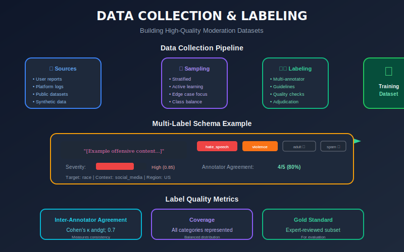
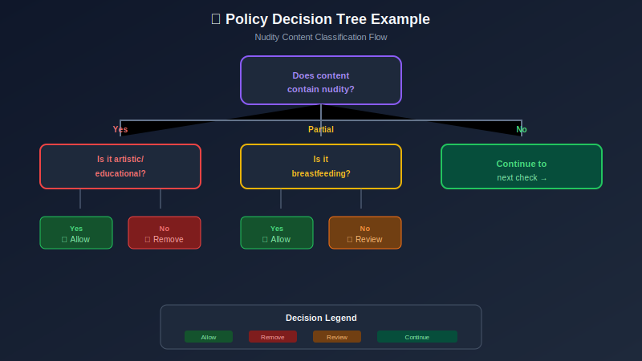
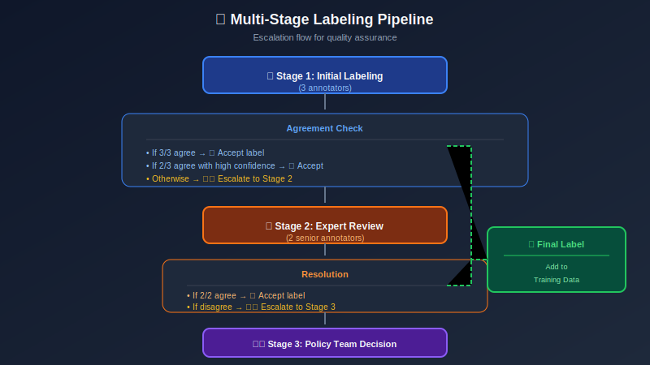

# Data Collection & Labeling for Content Moderation

## Table of Contents
- [Data Strategy Overview](#data-strategy-overview)
- [Data Sources](#data-sources)
- [Labeling Taxonomy](#labeling-taxonomy)
- [Annotation Guidelines](#annotation-guidelines)
- [Labeling Workflows](#labeling-workflows)
- [Quality Assurance](#quality-assurance)
- [Handling Imbalanced Data](#handling-imbalanced-data)
- [Data Privacy & Ethics](#data-privacy-ethics)

---

## Data Strategy Overview

### The Data Challenge

Content moderation ML faces unique data challenges:

| Challenge | Description | Impact |
|-----------|-------------|--------|
| **Class Imbalance** | Violating content is rare (0.1-5%) | Models biased toward majority |
| **Subjectivity** | "Hate speech" varies by context | Low inter-annotator agreement |
| **Evolution** | New slang, memes daily | Model drift |
| **Privacy** | Sensitive personal content | Storage/handling restrictions |
| **Adversarial** | Users evade detection | Need adversarial examples |

### Data Pipeline Architecture



---

## Data Sources

### 1. Platform Data (Primary)

```python
# Sampling strategies for platform data
class ContentSampler:
    def __init__(self, config):
        self.random_sample_rate = config.get('random_rate', 0.001)
        self.reported_sample_rate = config.get('reported_rate', 1.0)
        self.uncertain_sample_rate = config.get('uncertain_rate', 1.0)

    def sample(self, content_stream):
        for content in content_stream:
            # Always include reported content
            if content.was_reported:
                yield ('reported', content)
                continue

            # Include model-uncertain cases
            if content.model_confidence < 0.7:
                yield ('uncertain', content)
                continue

            # Random sample for distribution matching
            if random.random() < self.random_sample_rate:
                yield ('random', content)
```

**Sources:**
- Random samples (distribution matching)
- User-reported content (high violation rate)
- Model-flagged uncertain cases
- Appeal queue content
- Previously actioned content

### 2. Synthetic Data Generation

```python
# Generating synthetic adversarial examples
import random

class AdversarialGenerator:
    def __init__(self):
        self.perturbations = {
            'homoglyph': self._homoglyph_replace,
            'spacing': self._add_spacing,
            'unicode': self._unicode_confuse,
            'repetition': self._char_repeat,
            'masking': self._partial_mask,
        }

    def generate_variants(self, text: str, label: str, n: int = 5):
        """Generate adversarial variants of labeled text."""
        variants = []
        for _ in range(n):
            perturb_type = random.choice(list(self.perturbations.keys()))
            perturbed = self.perturbations[perturb_type](text)
            variants.append({
                'text': perturbed,
                'label': label,
                'original': text,
                'perturbation': perturb_type
            })
        return variants

    def _homoglyph_replace(self, text):
        """Replace characters with visually similar ones."""
        homoglyphs = {'a': '@', 'e': '3', 'i': '1', 'o': '0', 's': '$'}
        result = list(text)
        for i, char in enumerate(result):
            if char.lower() in homoglyphs and random.random() < 0.3:
                result[i] = homoglyphs[char.lower()]
        return ''.join(result)

    def _add_spacing(self, text):
        """Add spaces between characters in words."""
        words = text.split()
        result = []
        for word in words:
            if random.random() < 0.2:
                word = ' '.join(word)
            result.append(word)
        return ' '.join(result)
```

### 3. External Datasets

| Dataset | Content Type | Size | Use Case |
|---------|--------------|------|----------|
| HateXplain | Hate speech | 20K | Hate detection + explanations |
| Jigsaw Toxic | Toxicity | 160K | Multi-label toxicity |
| NSFW Dataset | Images | 60K | Adult content detection |
| Violence-Net | Violence | 25K | Violence in images |
| FakeNewsNet | Misinformation | 23K | Fake news detection |

---

## Labeling Taxonomy

### Hierarchical Category Structure

```yaml
content_categories:
  violence:
    - graphic_violence:
        description: "Depiction of severe bodily harm"
        severity: critical
        subcategories:
          - murder
          - torture
          - dismemberment
    - fighting:
        description: "Physical altercations"
        severity: high
    - threats:
        description: "Explicit threats of violence"
        severity: high

  hate_speech:
    - identity_attack:
        description: "Attacks based on protected characteristics"
        protected_groups:
          - race
          - religion
          - nationality
          - gender
          - sexual_orientation
          - disability
    - slurs:
        description: "Use of derogatory terms"
    - dehumanization:
        description: "Comparing groups to animals/objects"

  adult_content:
    - nudity:
        subcategories:
          - full_nudity
          - partial_nudity
    - sexual_activity:
        description: "Explicit sexual content"
    - suggestive:
        description: "Sexually suggestive but not explicit"

  harmful_behavior:
    - self_harm:
        description: "Content promoting self-injury"
        requires_urgent_review: true
    - dangerous_acts:
        description: "Dangerous challenges or activities"
    - eating_disorders:
        description: "Pro-anorexia or similar content"

  misinformation:
    - health:
        description: "False medical claims"
    - political:
        description: "Election misinformation"
    - conspiracy:
        description: "Conspiracy theories"

  spam:
    - commercial_spam:
        description: "Unsolicited ads"
    - scam:
        description: "Fraudulent schemes"
    - bot_content:
        description: "Automated spam"
```

### Multi-Label Schema

```python
from dataclasses import dataclass
from typing import List, Optional
from enum import Enum

class Severity(Enum):
    LOW = 1
    MEDIUM = 2
    HIGH = 3
    CRITICAL = 4

@dataclass
class ContentLabel:
    content_id: str
    primary_category: str
    subcategories: List[str]
    severity: Severity
    confidence: float  # Annotator confidence
    requires_context: bool
    target_groups: Optional[List[str]] = None
    notes: Optional[str] = None

# Example labeled item
example_label = ContentLabel(
    content_id="abc123",
    primary_category="hate_speech",
    subcategories=["identity_attack", "dehumanization"],
    severity=Severity.HIGH,
    confidence=0.9,
    requires_context=False,
    target_groups=["race"],
    notes="Clear case of racial slur with dehumanizing comparison"
)
```

---

## Annotation Guidelines

### Clear Decision Trees



### Context Guidelines

```markdown
## When Context Matters

### Example 1: "I'm going to kill you"
- In gaming context (during gameplay) → NOT a violation
- Directed at specific user with history → Violation (threat)
- In a movie quote context → NOT a violation

### Example 2: Swastika symbol
- In historical/educational content → NOT a violation
- Used as hate symbol with context → Violation
- In Hindu/Buddhist religious context → NOT a violation

### Example 3: Graphic injury image
- In medical education context → Allow with warning
- Posted to shock/disturb → Violation (gore)
- News reporting on accident → Allow with warning
```

### Annotator Decision Framework

```python
class AnnotationDecisionFramework:
    """
    Framework for consistent annotation decisions.
    """

    CONTEXT_FACTORS = [
        "author_intent",      # What is the poster trying to achieve?
        "audience_impact",    # How would the target audience perceive this?
        "cultural_context",   # Does cultural context change meaning?
        "platform_norms",     # What's expected on this platform?
        "historical_context", # Is this referencing historical events?
    ]

    def evaluate_content(self, content, metadata):
        """
        Step-by-step evaluation process.
        """
        # Step 1: Literal interpretation
        literal_check = self.check_literal_violation(content)

        # Step 2: Context evaluation
        if literal_check.is_ambiguous:
            context_score = self.evaluate_context(content, metadata)

        # Step 3: Apply severity
        severity = self.assess_severity(content, literal_check, context_score)

        # Step 4: Final decision
        return self.make_decision(severity)

    def check_literal_violation(self, content):
        """Check if content literally violates policy."""
        # Keywords, explicit content, etc.
        pass

    def evaluate_context(self, content, metadata):
        """Evaluate contextual factors."""
        context_score = 0

        # Check platform/community norms
        if metadata.get('community_type') == 'gaming':
            context_score += 0.2  # More lenient

        # Check if educational/newsworthy
        if self.is_educational(content, metadata):
            context_score += 0.3

        # Check relationship between users
        if metadata.get('are_friends'):
            context_score += 0.1

        return context_score
```

---

## Labeling Workflows

### Multi-Stage Review Pipeline



### Annotation Platform Interface

```python
# Example annotation interface data model
from datetime import datetime
from typing import Dict, List

class AnnotationTask:
    def __init__(self, content_id: str, content_data: Dict):
        self.content_id = content_id
        self.content_data = content_data
        self.annotations = []
        self.status = "pending"
        self.created_at = datetime.utcnow()

    def add_annotation(self, annotator_id: str, labels: Dict):
        annotation = {
            "annotator_id": annotator_id,
            "labels": labels,
            "timestamp": datetime.utcnow(),
            "time_spent_seconds": labels.get('time_spent', 0)
        }
        self.annotations.append(annotation)
        self._check_completion()

    def _check_completion(self):
        if len(self.annotations) >= 3:
            self.status = "ready_for_resolution"

    def compute_agreement(self) -> float:
        """Compute inter-annotator agreement (Fleiss' Kappa)."""
        if len(self.annotations) < 2:
            return 0.0

        # Extract primary labels
        labels = [a['labels']['primary_category'] for a in self.annotations]

        # Compute agreement
        from collections import Counter
        label_counts = Counter(labels)
        n = len(labels)

        # Simple agreement ratio
        max_agreement = max(label_counts.values())
        return max_agreement / n

class AnnotationPlatform:
    def __init__(self, db_connection):
        self.db = db_connection
        self.task_queue = []

    def create_task_batch(self, content_items: List[Dict], priority: int = 5):
        """Create annotation tasks for a batch of content."""
        tasks = []
        for item in content_items:
            task = AnnotationTask(
                content_id=item['id'],
                content_data=item
            )
            task.priority = priority
            tasks.append(task)
            self.db.insert('annotation_tasks', task)
        return tasks

    def get_next_task(self, annotator_id: str) -> AnnotationTask:
        """Get next task for annotator (avoiding their own content)."""
        query = """
            SELECT * FROM annotation_tasks
            WHERE status = 'pending'
            AND content_id NOT IN (
                SELECT content_id FROM annotations
                WHERE annotator_id = %s
            )
            ORDER BY priority DESC, created_at ASC
            LIMIT 1
        """
        return self.db.query(query, [annotator_id])
```

---

## Quality Assurance

### Golden Set Testing

```python
class QualityAssurance:
    def __init__(self, golden_set: List[Dict]):
        """
        Golden set: pre-labeled items with known correct labels.
        """
        self.golden_set = {item['id']: item for item in golden_set}
        self.annotator_performance = {}

    def inject_golden_items(self, task_queue: List, injection_rate: float = 0.05):
        """Inject golden set items into regular queue."""
        import random

        golden_items = random.sample(
            list(self.golden_set.values()),
            k=int(len(task_queue) * injection_rate)
        )

        # Randomly insert into queue
        for item in golden_items:
            position = random.randint(0, len(task_queue))
            task_queue.insert(position, {
                **item,
                'is_golden': True,
                'expected_label': item['label']
            })

        return task_queue

    def evaluate_annotator(self, annotator_id: str, annotations: List[Dict]):
        """Evaluate annotator accuracy on golden items."""
        golden_annotations = [
            a for a in annotations
            if a.get('content_id') in self.golden_set
        ]

        if not golden_annotations:
            return None

        correct = 0
        for annotation in golden_annotations:
            expected = self.golden_set[annotation['content_id']]['label']
            if annotation['label'] == expected:
                correct += 1

        accuracy = correct / len(golden_annotations)

        self.annotator_performance[annotator_id] = {
            'accuracy': accuracy,
            'total_golden': len(golden_annotations),
            'correct': correct
        }

        return accuracy

    def flag_low_performers(self, threshold: float = 0.8):
        """Flag annotators below quality threshold."""
        flagged = []
        for annotator_id, perf in self.annotator_performance.items():
            if perf['accuracy'] < threshold and perf['total_golden'] >= 10:
                flagged.append({
                    'annotator_id': annotator_id,
                    'accuracy': perf['accuracy'],
                    'recommendation': 'retraining'
                })
        return flagged
```

### Inter-Annotator Agreement Metrics

```python
import numpy as np
from sklearn.metrics import cohen_kappa_score

def compute_agreement_metrics(annotations: List[List[str]]):
    """
    Compute multiple agreement metrics.

    Args:
        annotations: List of annotator labels, e.g.,
                     [[A1_labels], [A2_labels], [A3_labels]]
    """
    metrics = {}

    # 1. Raw Agreement (percentage)
    n_items = len(annotations[0])
    agreements = 0
    for i in range(n_items):
        item_labels = [ann[i] for ann in annotations]
        if len(set(item_labels)) == 1:
            agreements += 1
    metrics['raw_agreement'] = agreements / n_items

    # 2. Cohen's Kappa (pairwise)
    kappas = []
    for i in range(len(annotations)):
        for j in range(i + 1, len(annotations)):
            kappa = cohen_kappa_score(annotations[i], annotations[j])
            kappas.append(kappa)
    metrics['avg_cohens_kappa'] = np.mean(kappas)

    # 3. Fleiss' Kappa (multi-annotator)
    metrics['fleiss_kappa'] = compute_fleiss_kappa(annotations)

    return metrics

def compute_fleiss_kappa(annotations):
    """Compute Fleiss' Kappa for multi-annotator agreement."""
    from collections import Counter

    n_annotators = len(annotations)
    n_items = len(annotations[0])

    # Get all unique labels
    all_labels = set()
    for ann in annotations:
        all_labels.update(ann)
    all_labels = sorted(all_labels)
    n_labels = len(all_labels)

    # Build count matrix
    counts = np.zeros((n_items, n_labels))
    for i in range(n_items):
        item_labels = [ann[i] for ann in annotations]
        label_counts = Counter(item_labels)
        for j, label in enumerate(all_labels):
            counts[i, j] = label_counts.get(label, 0)

    # Compute P_i (agreement for each item)
    P_i = (np.sum(counts ** 2, axis=1) - n_annotators) / (n_annotators * (n_annotators - 1))
    P_bar = np.mean(P_i)

    # Compute P_e (expected agreement)
    p_j = np.sum(counts, axis=0) / (n_items * n_annotators)
    P_e = np.sum(p_j ** 2)

    # Fleiss' Kappa
    kappa = (P_bar - P_e) / (1 - P_e)

    return kappa
```

---

## Handling Imbalanced Data

### Sampling Strategies

```python
from imblearn.over_sampling import SMOTE
from imblearn.under_sampling import RandomUnderSampler
from imblearn.pipeline import Pipeline

class BalancedDataLoader:
    def __init__(self, strategy='hybrid'):
        self.strategy = strategy

    def balance_dataset(self, X, y, target_ratios=None):
        """
        Balance dataset using specified strategy.

        Args:
            X: Features
            y: Labels
            target_ratios: Dict of {class: ratio} for sampling
        """
        if self.strategy == 'oversample':
            return self._oversample(X, y)
        elif self.strategy == 'undersample':
            return self._undersample(X, y)
        elif self.strategy == 'hybrid':
            return self._hybrid_sample(X, y, target_ratios)
        elif self.strategy == 'weighted':
            return X, y, self._compute_weights(y)

    def _oversample(self, X, y):
        """SMOTE oversampling of minority classes."""
        smote = SMOTE(random_state=42)
        X_resampled, y_resampled = smote.fit_resample(X, y)
        return X_resampled, y_resampled, None

    def _undersample(self, X, y):
        """Random undersampling of majority class."""
        rus = RandomUnderSampler(random_state=42)
        X_resampled, y_resampled = rus.fit_resample(X, y)
        return X_resampled, y_resampled, None

    def _hybrid_sample(self, X, y, target_ratios):
        """Combine over and undersampling."""
        # Default: minority at 50%, majority at 100%
        if target_ratios is None:
            target_ratios = {0: 1.0, 1: 0.5}  # Adjust as needed

        pipeline = Pipeline([
            ('oversample', SMOTE(sampling_strategy=0.5)),
            ('undersample', RandomUnderSampler(sampling_strategy=0.8))
        ])
        X_resampled, y_resampled = pipeline.fit_resample(X, y)
        return X_resampled, y_resampled, None

    def _compute_weights(self, y):
        """Compute class weights for loss function."""
        from sklearn.utils.class_weight import compute_class_weight
        import numpy as np

        classes = np.unique(y)
        weights = compute_class_weight('balanced', classes=classes, y=y)
        return dict(zip(classes, weights))
```

### Hard Example Mining

```python
class HardExampleMiner:
    """
    Mine hard examples from model predictions for retraining.
    """

    def __init__(self, model, threshold=0.6):
        self.model = model
        self.threshold = threshold

    def find_hard_examples(self, X, y_true):
        """Find examples where model is uncertain or wrong."""
        predictions = self.model.predict_proba(X)
        y_pred = self.model.predict(X)

        hard_examples = []

        for i, (probs, pred, true) in enumerate(zip(predictions, y_pred, y_true)):
            max_prob = max(probs)

            # Uncertain predictions
            if max_prob < self.threshold:
                hard_examples.append({
                    'index': i,
                    'type': 'uncertain',
                    'confidence': max_prob,
                    'predicted': pred,
                    'true': true
                })

            # Confident but wrong
            elif pred != true:
                hard_examples.append({
                    'index': i,
                    'type': 'confident_wrong',
                    'confidence': max_prob,
                    'predicted': pred,
                    'true': true
                })

        return hard_examples

    def prioritize_for_labeling(self, unlabeled_X, top_k=1000):
        """Select unlabeled examples most worth labeling."""
        predictions = self.model.predict_proba(unlabeled_X)

        # Calculate uncertainty (entropy)
        import numpy as np
        entropy = -np.sum(predictions * np.log(predictions + 1e-10), axis=1)

        # Get top-k most uncertain
        uncertain_indices = np.argsort(entropy)[-top_k:]

        return uncertain_indices
```

---

## Data Privacy & Ethics

### Privacy-Preserving Practices

```python
import hashlib
from cryptography.fernet import Fernet

class PrivacyManager:
    def __init__(self, encryption_key: bytes):
        self.cipher = Fernet(encryption_key)
        self.pii_patterns = self._load_pii_patterns()

    def anonymize_for_labeling(self, content: dict) -> dict:
        """Remove/mask PII before sending to annotators."""
        anonymized = content.copy()

        # Hash user identifiers
        if 'user_id' in anonymized:
            anonymized['user_id'] = self._hash_id(anonymized['user_id'])

        # Remove names, emails, phones from text
        if 'text' in anonymized:
            anonymized['text'] = self._mask_pii(anonymized['text'])

        # Blur faces in images (if configured)
        if 'image' in anonymized:
            anonymized['image'] = self._blur_faces(anonymized['image'])

        return anonymized

    def _hash_id(self, user_id: str) -> str:
        """One-way hash of user ID."""
        return hashlib.sha256(user_id.encode()).hexdigest()[:16]

    def _mask_pii(self, text: str) -> str:
        """Mask detected PII in text."""
        import re

        # Email
        text = re.sub(r'\b[\w.-]+@[\w.-]+\.\w+\b', '[EMAIL]', text)

        # Phone (US format)
        text = re.sub(r'\b\d{3}[-.]?\d{3}[-.]?\d{4}\b', '[PHONE]', text)

        # SSN
        text = re.sub(r'\b\d{3}-\d{2}-\d{4}\b', '[SSN]', text)

        return text

class DataRetentionPolicy:
    """Manage data retention for compliance."""

    RETENTION_PERIODS = {
        'raw_content': 90,           # 90 days
        'anonymized_content': 365,   # 1 year
        'labels': 2555,              # 7 years (legal)
        'model_decisions': 2555,     # 7 years (legal)
        'user_appeals': 365,         # 1 year
    }

    def apply_retention(self, data_store, data_type: str):
        """Delete data past retention period."""
        from datetime import datetime, timedelta

        retention_days = self.RETENTION_PERIODS.get(data_type, 90)
        cutoff = datetime.utcnow() - timedelta(days=retention_days)

        deleted = data_store.delete_before(data_type, cutoff)
        return deleted
```

### Annotator Well-being

```python
class AnnotatorWellbeingManager:
    """
    Manage annotator exposure to disturbing content.
    """

    def __init__(self):
        self.exposure_limits = {
            'violence_extreme': 20,   # Max per day
            'csam': 0,                # Never (specialized team only)
            'self_harm': 15,          # Max per day
            'adult': 50,              # Max per day
        }
        self.annotator_exposure = {}

    def can_assign_task(self, annotator_id: str, content_category: str) -> bool:
        """Check if annotator can be assigned this content type."""
        today = datetime.utcnow().date()

        key = (annotator_id, today)
        if key not in self.annotator_exposure:
            self.annotator_exposure[key] = {}

        current = self.annotator_exposure[key].get(content_category, 0)
        limit = self.exposure_limits.get(content_category, float('inf'))

        return current < limit

    def record_exposure(self, annotator_id: str, content_category: str):
        """Record annotator exposure to content type."""
        today = datetime.utcnow().date()
        key = (annotator_id, today)

        if key not in self.annotator_exposure:
            self.annotator_exposure[key] = {}

        current = self.annotator_exposure[key].get(content_category, 0)
        self.annotator_exposure[key][content_category] = current + 1

    def schedule_wellness_break(self, annotator_id: str):
        """Check if annotator needs a wellness break."""
        # Implement break logic after heavy exposure
        pass
```

---

## Summary

Effective data collection and labeling requires:

1. **Diverse sampling** from multiple sources
2. **Clear taxonomy** with hierarchical categories
3. **Detailed guidelines** with decision trees
4. **Multi-stage review** for quality
5. **Continuous QA** with golden sets
6. **Balance strategies** for rare classes
7. **Privacy protection** throughout pipeline
8. **Annotator well-being** consideration

---

*Previous: [System Requirements & Architecture](../02_system_requirements_architecture/README.md)*
*Next: [Text Moderation](../04_text_moderation/README.md)*

---

<div align="center">

**[⬆ Back to Top](#)** | **[📚 Main Repository](https://github.com/Gaurav14cs17/ml_system_design)**

Made with 💜 by [Gaurav14cs17](https://github.com/Gaurav14cs17)

</div>
