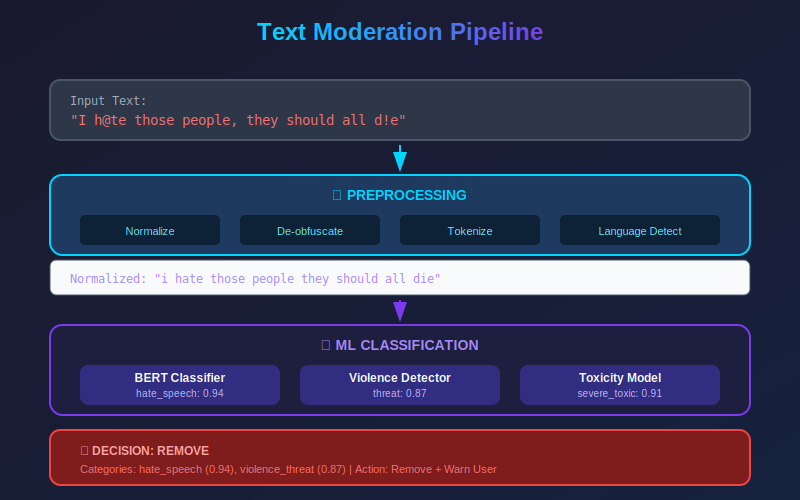
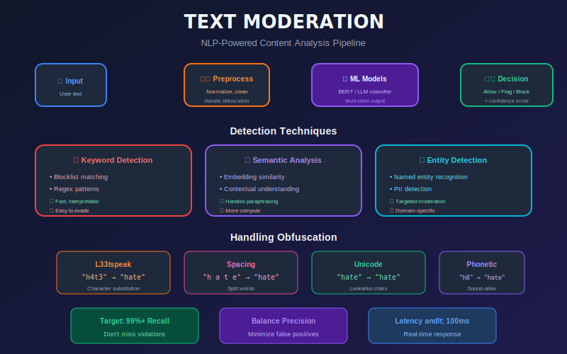

# Text Content Moderation



## Table of Contents

- [Overview](#overview)

- [Text Classification Approaches](#text-classification-approaches)

- [Traditional ML Methods](#traditional-ml-methods)

- [Deep Learning Methods](#deep-learning-methods)

- [Large Language Models](#large-language-models)

- [Handling Adversarial Text](#handling-adversarial-text)

- [Multilingual Moderation](#multilingual-moderation)

- [Implementation Examples](#implementation-examples)

---

## Overview

Text moderation is the foundation of content moderation systems. It involves detecting:

| Category | Examples | Challenges |
|----------|----------|------------|
| **Hate Speech** | Slurs, identity attacks | Context, reclaimed terms |
| **Harassment** | Bullying, threats | Relationship context |
| **Toxicity** | Insults, profanity | Severity levels |
| **Spam** | Ads, scams | Constantly evolving |
| **Misinformation** | False claims | Fact verification needed |
| **Self-harm** | Suicide, eating disorders | Sensitive, urgent |

### Text Moderation Pipeline



---

## Mathematical Foundations of Text Moderation

### Text Representation

#### TF-IDF (Term Frequency-Inverse Document Frequency)

Converts text to numerical vectors by weighting term importance:

```math
\text{TF-IDF}(t, d, D) = \text{TF}(t, d) \times \text{IDF}(t, D)

```

Where:

- \(\text{TF}(t, d) = \frac{f_{t,d}}{\sum_{t' \in d} f_{t',d}}\) (normalized term frequency)

- \(\text{IDF}(t, D) = \log \frac{|D|}{|\{d \in D : t \in d\}|}\) (inverse document frequency)

#### Word Embeddings

Dense vector representations learned from large corpora:

```math
\mathbf{v}_w \in \mathbb{R}^d \quad \text{where } d \in \{100, 300, 768, ...\}

```

**Word2Vec Skip-gram objective**:

```math
\mathcal{L} = \sum_{(w, c) \in D} \log \sigma(\mathbf{v}_w \cdot \mathbf{v}_c) + \sum_{(w, c') \in D'} \log \sigma(-\mathbf{v}_w \cdot \mathbf{v}_{c'})

```

### Attention Mechanism

The self-attention operation in transformers:

```math
\text{Attention}(Q, K, V) = \text{softmax}\left(\frac{QK^T}{\sqrt{d_k}}\right)V

```

Where:

- \(Q = XW^Q\) (queries)

- \(K = XW^K\) (keys)

- \(V = XW^V\) (values)

- \(\sqrt{d_k}\) is the scaling factor

**Multi-head attention**:

```math
\text{MultiHead}(Q, K, V) = \text{Concat}(\text{head}_1, ..., \text{head}_h)W^O

```

Where each head is:

```math
\text{head}_i = \text{Attention}(QW_i^Q, KW_i^K, VW_i^V)

```

### Toxicity Score Calibration

Converting raw model outputs to calibrated probabilities using **Platt Scaling**:

```math
P(y=1 | f(x)) = \frac{1}{1 + \exp(Af(x) + B)}

```

Where \(A\) and \(B\) are parameters fit on a validation set to minimize:

```math
\mathcal{L} = -\sum_{i} y_i \log(p_i) + (1-y_i) \log(1-p_i)

```

### Threshold Optimization

Finding the optimal decision threshold \(\tau\) by maximizing F1:

```math
\tau^* = \arg\max_{\tau} F_1(\tau) = \arg\max_{\tau} \frac{2 \cdot \text{Precision}(\tau) \cdot \text{Recall}(\tau)}{\text{Precision}(\tau) + \text{Recall}(\tau)}

```

Or with a cost-sensitive approach:

```math
\tau^* = \arg\min_{\tau} \left[ C_{FP} \cdot \text{FPR}(\tau) + C_{FN} \cdot \text{FNR}(\tau) \right]

```

Where \(C_{FP}\) and \(C_{FN}\) are the costs of false positives and negatives.

---

## Text Classification Approaches

### Approach Comparison

| Approach | Accuracy | Speed | Interpretability | Cost |
|----------|----------|-------|------------------|------|
| Regex/Keywords | Low | Very Fast | High | Low |
| Traditional ML | Medium | Fast | Medium | Low |
| CNN/LSTM | High | Medium | Low | Medium |
| BERT-based | Very High | Slow | Low | High |
| LLM (GPT-4) | Highest | Slowest | High | Very High |

### When to Use What

```python
# Decision framework for model selection
def select_approach(requirements):
    """
    Select text moderation approach based on requirements.
    """
    if requirements['latency_ms'] < 10:
        return 'regex_keywords'  # Fastest

    elif requirements['latency_ms'] < 50:
        if requirements['accuracy'] > 0.9:
            return 'distilbert'  # Fast transformer
        else:
            return 'traditional_ml'  # Fast, decent

    elif requirements['latency_ms'] < 200:
        return 'bert_large'  # Most accurate single model

    else:
        if requirements['needs_reasoning']:
            return 'llm'  # Best reasoning
        else:
            return 'ensemble'  # Best accuracy

```

---

## Traditional ML Methods

### Feature Engineering

```python
import numpy as np
from sklearn.feature_extraction.text import TfidfVectorizer, CountVectorizer
from scipy.sparse import hstack
import re

class TextFeatureExtractor:
    def __init__(self):
        self.tfidf_word = TfidfVectorizer(
            ngram_range=(1, 3),
            max_features=50000,
            min_df=2
        )
        self.tfidf_char = TfidfVectorizer(
            ngram_range=(3, 5),
            analyzer='char',
            max_features=50000
        )

    def fit(self, texts):
        self.tfidf_word.fit(texts)
        self.tfidf_char.fit(texts)

    def transform(self, texts):
        # TF-IDF features
        word_features = self.tfidf_word.transform(texts)
        char_features = self.tfidf_char.transform(texts)

        # Statistical features
        stat_features = np.array([
            self._extract_stats(text) for text in texts
        ])

        return hstack([word_features, char_features, stat_features])

    def _extract_stats(self, text):
        """Extract statistical features from text."""
        return [
            len(text),                                    # Length
            len(text.split()),                            # Word count
            sum(1 for c in text if c.isupper()) / max(len(text), 1),  # Caps ratio
            len(re.findall(r'[!?]+', text)),             # Exclamation count
            len(re.findall(r'http\S+', text)),           # URL count
            len(re.findall(r'@\w+', text)),              # Mention count
            len(re.findall(r'#\w+', text)),              # Hashtag count
            text.count('...'),                           # Ellipsis count
            sum(1 for c in text if not c.isalnum() and c != ' ') / max(len(text), 1),
        ]

```

### Classifier Implementation

```python
from sklearn.linear_model import LogisticRegression
from sklearn.ensemble import RandomForestClassifier, GradientBoostingClassifier
from sklearn.svm import LinearSVC
from sklearn.pipeline import Pipeline
from sklearn.model_selection import cross_val_score
import joblib

class TraditionalModerationModel:
    def __init__(self, model_type='logistic'):
        self.feature_extractor = TextFeatureExtractor()

        if model_type == 'logistic':
            self.classifier = LogisticRegression(
                C=1.0,
                class_weight='balanced',
                max_iter=1000
            )
        elif model_type == 'svm':
            self.classifier = LinearSVC(
                C=1.0,
                class_weight='balanced'
            )
        elif model_type == 'gradient_boosting':
            self.classifier = GradientBoostingClassifier(
                n_estimators=200,
                max_depth=5,
                learning_rate=0.1
            )

    def train(self, texts, labels):
        # Fit feature extractor
        self.feature_extractor.fit(texts)

        # Transform texts
        X = self.feature_extractor.transform(texts)

        # Train classifier
        self.classifier.fit(X, labels)

        # Cross-validation score
        scores = cross_val_score(self.classifier, X, labels, cv=5)
        print(f"CV Accuracy: {scores.mean():.3f} (+/- {scores.std() * 2:.3f})")

    def predict(self, texts):
        X = self.feature_extractor.transform(texts)
        return self.classifier.predict(X)

    def predict_proba(self, texts):
        X = self.feature_extractor.transform(texts)
        return self.classifier.predict_proba(X)

    def save(self, path):
        joblib.dump({
            'feature_extractor': self.feature_extractor,
            'classifier': self.classifier
        }, path)

    @classmethod
    def load(cls, path):
        data = joblib.load(path)
        model = cls.__new__(cls)
        model.feature_extractor = data['feature_extractor']
        model.classifier = data['classifier']
        return model

```

---

## Deep Learning Methods

### CNN for Text Classification

```python
import torch
import torch.nn as nn
import torch.nn.functional as F

class TextCNN(nn.Module):
    """
    Convolutional Neural Network for text classification.
    Based on Kim (2014) architecture.
    """

    def __init__(
        self,
        vocab_size,
        embedding_dim=300,
        num_classes=10,
        kernel_sizes=[3, 4, 5],
        num_filters=100,
        dropout=0.5,
        pretrained_embeddings=None
    ):
        super(TextCNN, self).__init__()

        # Embedding layer
        self.embedding = nn.Embedding(vocab_size, embedding_dim)
        if pretrained_embeddings is not None:
            self.embedding.weight.data.copy_(pretrained_embeddings)
            self.embedding.weight.requires_grad = True

        # Convolutional layers
        self.convs = nn.ModuleList([
            nn.Conv1d(embedding_dim, num_filters, kernel_size)
            for kernel_size in kernel_sizes
        ])

        # Dropout
        self.dropout = nn.Dropout(dropout)

        # Fully connected layer
        self.fc = nn.Linear(num_filters * len(kernel_sizes), num_classes)

    def forward(self, x):
        # x: (batch_size, seq_length)

        # Embedding: (batch_size, seq_length, embedding_dim)
        embedded = self.embedding(x)

        # Transpose for conv1d: (batch_size, embedding_dim, seq_length)
        embedded = embedded.transpose(1, 2)

        # Apply convolutions with ReLU and max pooling
        conv_outputs = []
        for conv in self.convs:
            conv_out = F.relu(conv(embedded))
            pooled = F.max_pool1d(conv_out, conv_out.size(2)).squeeze(2)
            conv_outputs.append(pooled)

        # Concatenate all pooled features
        concat = torch.cat(conv_outputs, dim=1)

        # Dropout and classification
        dropped = self.dropout(concat)
        output = self.fc(dropped)

        return output

```

### LSTM with Attention

```python
class AttentionLSTM(nn.Module):
    """
    Bidirectional LSTM with attention mechanism.
    """

    def __init__(
        self,
        vocab_size,
        embedding_dim=300,
        hidden_dim=256,
        num_layers=2,
        num_classes=10,
        dropout=0.3,
        pretrained_embeddings=None
    ):
        super(AttentionLSTM, self).__init__()

        self.embedding = nn.Embedding(vocab_size, embedding_dim)
        if pretrained_embeddings is not None:
            self.embedding.weight.data.copy_(pretrained_embeddings)

        self.lstm = nn.LSTM(
            embedding_dim,
            hidden_dim,
            num_layers=num_layers,
            bidirectional=True,
            dropout=dropout if num_layers > 1 else 0,
            batch_first=True
        )

        # Attention
        self.attention = nn.Linear(hidden_dim * 2, 1)

        # Classification
        self.dropout = nn.Dropout(dropout)
        self.fc = nn.Linear(hidden_dim * 2, num_classes)

    def forward(self, x, lengths=None):
        # Embedding
        embedded = self.embedding(x)  # (batch, seq_len, embed_dim)

        # LSTM
        if lengths is not None:
            packed = nn.utils.rnn.pack_padded_sequence(
                embedded, lengths, batch_first=True, enforce_sorted=False
            )
            lstm_out, _ = self.lstm(packed)
            lstm_out, _ = nn.utils.rnn.pad_packed_sequence(
                lstm_out, batch_first=True
            )
        else:
            lstm_out, _ = self.lstm(embedded)

        # Attention weights
        attention_weights = F.softmax(self.attention(lstm_out), dim=1)

        # Weighted sum
        context = torch.sum(attention_weights * lstm_out, dim=1)

        # Classification
        dropped = self.dropout(context)
        output = self.fc(dropped)

        return output, attention_weights

```

### BERT-based Classification

```python
from transformers import BertTokenizer, BertForSequenceClassification
from transformers import Trainer, TrainingArguments
import torch
from torch.utils.data import Dataset

class ToxicityDataset(Dataset):
    def __init__(self, texts, labels, tokenizer, max_length=256):
        self.texts = texts
        self.labels = labels
        self.tokenizer = tokenizer
        self.max_length = max_length

    def __len__(self):
        return len(self.texts)

    def __getitem__(self, idx):
        encoding = self.tokenizer(
            self.texts[idx],
            truncation=True,
            padding='max_length',
            max_length=self.max_length,
            return_tensors='pt'
        )
        return {
            'input_ids': encoding['input_ids'].squeeze(),
            'attention_mask': encoding['attention_mask'].squeeze(),
            'labels': torch.tensor(self.labels[idx], dtype=torch.long)
        }

class BertModerationModel:
    def __init__(self, model_name='bert-base-uncased', num_labels=10):
        self.tokenizer = BertTokenizer.from_pretrained(model_name)
        self.model = BertForSequenceClassification.from_pretrained(
            model_name,
            num_labels=num_labels
        )

    def train(self, train_texts, train_labels, val_texts, val_labels):
        train_dataset = ToxicityDataset(
            train_texts, train_labels, self.tokenizer
        )
        val_dataset = ToxicityDataset(
            val_texts, val_labels, self.tokenizer
        )

        training_args = TrainingArguments(
            output_dir='./results',
            num_train_epochs=3,
            per_device_train_batch_size=16,
            per_device_eval_batch_size=32,
            warmup_steps=500,
            weight_decay=0.01,
            logging_dir='./logs',
            logging_steps=100,
            evaluation_strategy='epoch',
            save_strategy='epoch',
            load_best_model_at_end=True,
        )

        trainer = Trainer(
            model=self.model,
            args=training_args,
            train_dataset=train_dataset,
            eval_dataset=val_dataset,
        )

        trainer.train()

    def predict(self, texts, batch_size=32):
        self.model.eval()
        device = next(self.model.parameters()).device

        all_preds = []
        for i in range(0, len(texts), batch_size):
            batch_texts = texts[i:i + batch_size]
            encodings = self.tokenizer(
                batch_texts,
                truncation=True,
                padding=True,
                max_length=256,
                return_tensors='pt'
            ).to(device)

            with torch.no_grad():
                outputs = self.model(**encodings)
                probs = torch.softmax(outputs.logits, dim=-1)
                all_preds.extend(probs.cpu().numpy())

        return np.array(all_preds)

```

---

## Large Language Models

### Using LLMs for Content Moderation

```python
from openai import OpenAI
import json

class LLMModerator:
    """
    Use LLMs for nuanced content moderation with reasoning.
    """

    def __init__(self, api_key: str):
        self.client = OpenAI(api_key=api_key)
        self.system_prompt = self._create_system_prompt()

    def _create_system_prompt(self):
        return """You are a content moderation expert. Analyze the given content and classify it according to our policy categories.

Policy Categories:

1. VIOLENCE: Threats, graphic violence, incitement

2. HATE_SPEECH: Attacks on protected groups, slurs, dehumanization

3. HARASSMENT: Bullying, targeted attacks, stalking

4. ADULT: Sexual content, nudity

5. SELF_HARM: Suicide, self-injury promotion

6. SPAM: Unsolicited ads, scams

7. MISINFORMATION: False claims about health, elections

8. SAFE: Content that doesn't violate policies

For each analysis, provide:

1. Primary category

2. Confidence (0-1)

3. Severity (low/medium/high/critical)

4. Brief reasoning

5. Any context that would change the decision

Respond in JSON format."""

    def moderate(self, content: str, context: dict = None) -> dict:
        messages = [
            {"role": "system", "content": self.system_prompt},
            {"role": "user", "content": f"""Analyze this content:

Content: "{content}"

Additional context: {json.dumps(context) if context else 'None'}

Provide your moderation analysis."""}
        ]

        response = self.client.chat.completions.create(
            model="gpt-4",
            messages=messages,
            temperature=0,
            response_format={"type": "json_object"}
        )

        return json.loads(response.choices[0].message.content)

    def moderate_batch(self, contents: list) -> list:
        """Batch moderation for efficiency."""
        results = []
        for content in contents:
            result = self.moderate(content)
            results.append(result)
        return results

# Example usage
"""
moderator = LLMModerator(api_key="...")
result = moderator.moderate(
    "I'm going to find you and make you pay",
    context={"platform": "gaming", "previous_messages": [...]}
)

# Result:
{
    "primary_category": "HARASSMENT",
    "confidence": 0.85,
    "severity": "medium",
    "reasoning": "While this appears to be a threat, gaming context suggests it may be competitive banter. However, 'find you' suggests potential real-world threat.",
    "context_modifiers": "If users are friends and this is during gameplay, reduce severity to low"
}
"""

```

### Prompt Engineering for Moderation

```python
class ModerationPromptTemplates:
    """
    Carefully crafted prompts for different moderation tasks.
    """

    HATE_SPEECH_PROMPT = """Analyze the following text for hate speech. Consider:

1. Is there an attack on a protected group (race, religion, gender, etc.)?

2. Are slurs or derogatory terms used?

3. Is there dehumanization (comparing people to animals/objects)?

4. Is there incitement to violence or discrimination?

Also consider context:

- Is this reclaimed language used within a community?

- Is this quoting or discussing hate speech (vs. promoting it)?

- Could this be satire or irony?

Text: "{text}"

Respond with:

- is_hate_speech: true/false

- confidence: 0-1
- targeted_group: which group if any

- hate_type: slur/dehumanization/incitement/stereotyping/none

- reasoning: brief explanation
"""

    SELF_HARM_PROMPT = """Analyze the following text for self-harm content. This is a sensitive task.

Categories:

1. CRISIS: Active expression of suicidal ideation requiring immediate intervention

2. CONCERNING: Discussion of self-harm that may need support resources

3. RECOVERY: Sharing recovery journey or seeking help (generally allowed)

4. EDUCATIONAL: Discussion in mental health context (generally allowed)

5. SAFE: No self-harm content

Important: We want to support people in crisis, not silence them. Focus on:

- Is this a cry for help that needs support resources?

- Is this promoting or glorifying self-harm?

- Is this recovery/awareness content?

Text: "{text}"

Respond with:

- category: one of the above

- urgency: none/low/high/immediate

- should_show_resources: true/false

- reasoning: brief explanation
"""

    MISINFORMATION_PROMPT = """Analyze the following claim for potential misinformation.

Consider:

1. Is this a factual claim or an opinion?

2. Does it contradict established scientific consensus?

3. Could it cause real-world harm if believed?

4. Is the source cited or verifiable?

Claim: "{text}"

Known facts (if relevant): {known_facts}

Respond with:

- is_factual_claim: true/false

- likely_false: true/false/uncertain

- harm_potential: none/low/medium/high

- fact_check_needed: true/false

- reasoning: brief explanation
"""

```

---

## Handling Adversarial Text

### Common Evasion Techniques

```
1. Homoglyph substitution: "h@te" instead of "hate"

2. Character insertion: "ha.te" or "h a t e"

3. Unicode tricks: "hate" with zero-width characters

4. Leetspeak: "h4t3"

5. Phonetic spelling: "hayt"

6. Deliberate misspelling: "haet"

7. Encoded content: base64, rot13
8. Language mixing: "I h8 你们"

```

### Adversarial Text Normalizer

```python
import re
import unicodedata
from typing import Dict, List

class AdversarialTextNormalizer:
    """
    Normalize adversarial text to defeat evasion attempts.
    """

    def __init__(self):
        # Homoglyph mappings
        self.homoglyphs = {
            '@': 'a', '4': 'a', '^': 'a',
            '8': 'b', '6': 'b',
            '(': 'c', '<': 'c',
            '3': 'e', '€': 'e',
            '9': 'g', '6': 'g',
            '#': 'h',
            '1': 'i', '!': 'i', '|': 'i',
            '7': 'l', '1': 'l',
            '0': 'o', '()': 'o',
            '5': 's', '$': 's',
            '7': 't', '+': 't',
            'µ': 'u', 'v': 'u',
            '\/': 'v',
            '\/\/': 'w',
            '><': 'x',
            '¥': 'y',
            '2': 'z',
        }

        # Load phonetic patterns
        self.phonetic_patterns = self._load_phonetic_patterns()

    def normalize(self, text: str) -> Dict[str, str]:
        """Apply all normalization steps."""
        original = text

        # Step 1: Unicode normalization
        text = unicodedata.normalize('NFKC', text)

        # Step 2: Remove zero-width characters
        text = self._remove_zero_width(text)

        # Step 3: Homoglyph replacement
        text = self._replace_homoglyphs(text)

        # Step 4: Remove inserted characters
        text = self._remove_separators(text)

        # Step 5: Phonetic normalization
        text = self._phonetic_normalize(text)

        # Step 6: Repeated character reduction
        text = self._reduce_repetition(text)

        return {
            'original': original,
            'normalized': text.lower(),
            'transformations_applied': self._log_transformations(original, text)
        }

    def _remove_zero_width(self, text: str) -> str:
        """Remove zero-width and invisible characters."""
        # Zero-width chars: \u200b, \u200c, \u200d, \ufeff
        return re.sub(r'[\u200b\u200c\u200d\ufeff\u00ad]', '', text)

    def _replace_homoglyphs(self, text: str) -> str:
        """Replace common homoglyphs."""
        result = list(text.lower())
        for i, char in enumerate(result):
            if char in self.homoglyphs:
                result[i] = self.homoglyphs[char]
        return ''.join(result)

    def _remove_separators(self, text: str) -> str:
        """Remove inserted separators in words."""
        # Pattern: single non-alphanum between letters
        # e.g., "h.a.t.e" -> "hate"
        patterns = [
            (r'(\w)[.\-_*]+(\w)', r'\1\2'),  # Dots, dashes
            (r'(\w)\s+(\w)(?=\w\s+\w)', r'\1\2'),  # Spaced letters
        ]
        for pattern, replacement in patterns:
            text = re.sub(pattern, replacement, text)
        return text

    def _phonetic_normalize(self, text: str) -> str:
        """Normalize phonetic spellings."""
        replacements = {
            'ph': 'f',
            'ck': 'k',
            'kk': 'k',
            'nn': 'n',
        }
        for pattern, replacement in replacements.items():
            text = text.replace(pattern, replacement)
        return text

    def _reduce_repetition(self, text: str) -> str:
        """Reduce character repetition."""
        # "haaaate" -> "haate" (keep max 2)
        return re.sub(r'(.)\1{2,}', r'\1\1', text)

    def _load_phonetic_patterns(self):
        """Load phonetic spelling patterns."""
        return {}  # Would load from file

    def _log_transformations(self, original, normalized):
        """Log what transformations were applied."""
        if original == normalized:
            return []
        return ['normalized']  # Simplified

```

### Ensemble Detection

```python
class AdversarialDetector:
    """
    Detect and handle adversarial text inputs.
    """

    def __init__(self, models: list):
        self.normalizer = AdversarialTextNormalizer()
        self.models = models  # List of moderation models

    def detect(self, text: str) -> Dict:
        """
        Run detection on both original and normalized text.
        """
        normalized = self.normalizer.normalize(text)

        # Get predictions on original
        original_scores = [
            model.predict([text])[0]
            for model in self.models
        ]

        # Get predictions on normalized
        normalized_scores = [
            model.predict([normalized['normalized']])[0]
            for model in self.models
        ]

        # Compare predictions
        original_max = max(max(s.values()) for s in original_scores)
        normalized_max = max(max(s.values()) for s in normalized_scores)

        # If normalized version triggers more, likely adversarial
        likely_adversarial = normalized_max > original_max + 0.2

        # Use higher of the two
        final_scores = normalized_scores if normalized_max > original_max else original_scores

        return {
            'scores': self._ensemble_scores(final_scores),
            'likely_adversarial': likely_adversarial,
            'original_scores': original_scores,
            'normalized_scores': normalized_scores,
            'normalized_text': normalized['normalized']
        }

    def _ensemble_scores(self, scores_list):
        """Combine scores from multiple models."""
        combined = {}
        for scores in scores_list:
            for category, score in scores.items():
                if category not in combined:
                    combined[category] = []
                combined[category].append(score)

        return {k: max(v) for k, v in combined.items()}  # Max pooling

```

---

## Multilingual Moderation

### Multilingual Model Architecture

```python
from transformers import XLMRobertaForSequenceClassification, XLMRobertaTokenizer

class MultilingualModerator:
    """
    Handle content moderation across 100+ languages.
    """

    def __init__(self, model_path='xlm-roberta-large'):
        self.tokenizer = XLMRobertaTokenizer.from_pretrained(model_path)
        self.model = XLMRobertaForSequenceClassification.from_pretrained(
            model_path,
            num_labels=10
        )
        self.device = torch.device('cuda' if torch.cuda.is_available() else 'cpu')
        self.model.to(self.device)

    def predict(self, texts: List[str], detect_language=True) -> List[Dict]:
        """Predict moderation categories for multilingual texts."""
        results = []

        for text in texts:
            # Optionally detect language
            if detect_language:
                from langdetect import detect
                try:
                    lang = detect(text)
                except:
                    lang = 'unknown'
            else:
                lang = None

            # Tokenize and predict
            inputs = self.tokenizer(
                text,
                return_tensors='pt',
                truncation=True,
                max_length=256
            ).to(self.device)

            with torch.no_grad():
                outputs = self.model(**inputs)
                probs = torch.softmax(outputs.logits, dim=-1)

            results.append({
                'scores': probs[0].cpu().numpy(),
                'language': lang
            })

        return results

```

### Language-Specific Considerations

```python
class LanguageSpecificRules:
    """
    Handle language-specific moderation rules.
    """

    def __init__(self):
        self.slur_dictionaries = self._load_slur_dictionaries()
        self.cultural_context = self._load_cultural_context()

    def apply_language_rules(self, text: str, language: str, base_scores: Dict) -> Dict:
        """Adjust scores based on language-specific rules."""
        adjusted_scores = base_scores.copy()

        # Check language-specific slurs
        if language in self.slur_dictionaries:
            slur_matches = self._check_slurs(text, language)
            if slur_matches:
                adjusted_scores['hate_speech'] = max(
                    adjusted_scores.get('hate_speech', 0),
                    0.9  # High confidence for known slurs
                )

        # Apply cultural context adjustments
        if language in self.cultural_context:
            context_adjustment = self.cultural_context[language]
            for category, adjustment in context_adjustment.items():
                if category in adjusted_scores:
                    adjusted_scores[category] *= adjustment

        return adjusted_scores

    def _check_slurs(self, text: str, language: str) -> List[str]:
        """Check for language-specific slurs."""
        slurs = self.slur_dictionaries.get(language, [])
        text_lower = text.lower()
        return [slur for slur in slurs if slur in text_lower]

    def _load_slur_dictionaries(self):
        """Load slur dictionaries for each language."""
        # Would load from secure, encrypted storage
        return {}

    def _load_cultural_context(self):
        """Load cultural context adjustments."""
        # Example: Some gestures/phrases have different meanings
        return {
            'ja': {'adult': 0.8},  # Japanese manga context
            'de': {'hate': 1.2},   # Stricter in Germany (NetzDG)
        }

```

---

## Implementation Examples

### Complete Text Moderation Pipeline

```python
class TextModerationPipeline:
    """
    Complete text moderation pipeline combining all components.
    """

    def __init__(self, config: Dict):
        # Initialize components
        self.normalizer = AdversarialTextNormalizer()
        self.feature_extractor = TextFeatureExtractor()

        # Load models
        self.fast_model = self._load_fast_model(config['fast_model_path'])
        self.accurate_model = self._load_bert_model(config['bert_model_path'])
        self.llm_moderator = LLMModerator(config['llm_api_key'])

        # Thresholds
        self.thresholds = config['thresholds']

    def moderate(self, text: str, context: Dict = None) -> Dict:
        """
        Full moderation pipeline with tiered approach.
        """
        # Step 1: Normalize text
        normalized = self.normalizer.normalize(text)
        clean_text = normalized['normalized']

        # Step 2: Fast model check (keyword + simple ML)
        fast_result = self._fast_check(clean_text)

        if fast_result['confidence'] > 0.95:
            return self._format_result(fast_result, tier='fast')

        # Step 3: Accurate model check (BERT)
        accurate_result = self._accurate_check(clean_text)

        if accurate_result['confidence'] > 0.85:
            return self._format_result(accurate_result, tier='accurate')

        # Step 4: LLM for uncertain cases
        if accurate_result['requires_context'] or accurate_result['confidence'] < 0.6:
            llm_result = self.llm_moderator.moderate(text, context)
            return self._format_result(llm_result, tier='llm')

        return self._format_result(accurate_result, tier='accurate')

    def moderate_batch(self, texts: List[str], contexts: List[Dict] = None) -> List[Dict]:
        """Batch moderation for efficiency."""
        results = []
        for i, text in enumerate(texts):
            context = contexts[i] if contexts else None
            result = self.moderate(text, context)
            results.append(result)
        return results

    def _fast_check(self, text: str) -> Dict:
        """Quick keyword and simple model check."""
        # Keyword check
        keyword_score = self._keyword_check(text)

        # Fast ML model
        features = self.feature_extractor.transform([text])
        ml_probs = self.fast_model.predict_proba(features)[0]

        max_score = max(max(keyword_score.values()), max(ml_probs))

        return {
            'scores': ml_probs,
            'confidence': max_score,
            'method': 'fast'
        }

    def _accurate_check(self, text: str) -> Dict:
        """BERT-based accurate check."""
        probs = self.accurate_model.predict([text])[0]

        return {
            'scores': probs,
            'confidence': max(probs),
            'requires_context': max(probs) < 0.7,
            'method': 'bert'
        }

    def _keyword_check(self, text: str) -> Dict:
        """Check against keyword lists."""
        # Would check against maintained keyword lists
        return {'hate': 0, 'violence': 0, 'adult': 0}

    def _format_result(self, result: Dict, tier: str) -> Dict:
        """Format final result."""
        return {
            **result,
            'tier': tier,
            'timestamp': datetime.utcnow().isoformat()
        }

```

---

## Summary

Text moderation requires a multi-layered approach:

1. **Preprocessing**: Normalize adversarial text variations

2. **Fast Layer**: Keywords and simple ML for obvious cases

3. **Accurate Layer**: BERT/transformers for nuanced detection

4. **LLM Layer**: Reasoning for edge cases requiring context

5. **Multilingual**: XLM-RoBERTa or similar for global coverage

6. **Adversarial Defense**: Continuous adaptation to evasion attempts

---

*Previous: [Data Collection & Labeling](../03_data_collection_labeling/README.md)*
*Next: [Image & Video Moderation](../05_image_video_moderation/README.md)*

---

<div align="center">

**[⬆ Back to Top](#)** | **[📚 Main Repository](https://github.com/Gaurav14cs17/ml_system_design)**

Made with 💜 by [Gaurav14cs17](https://github.com/Gaurav14cs17)

</div>
