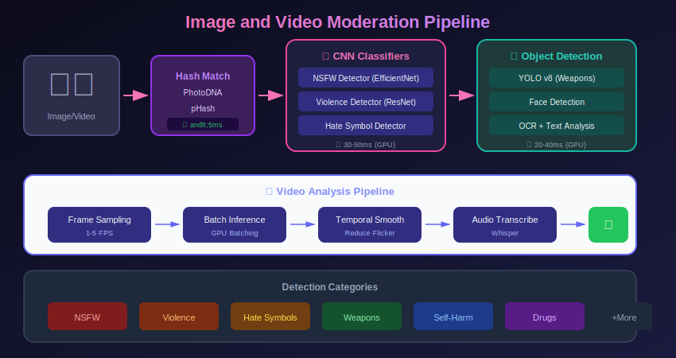
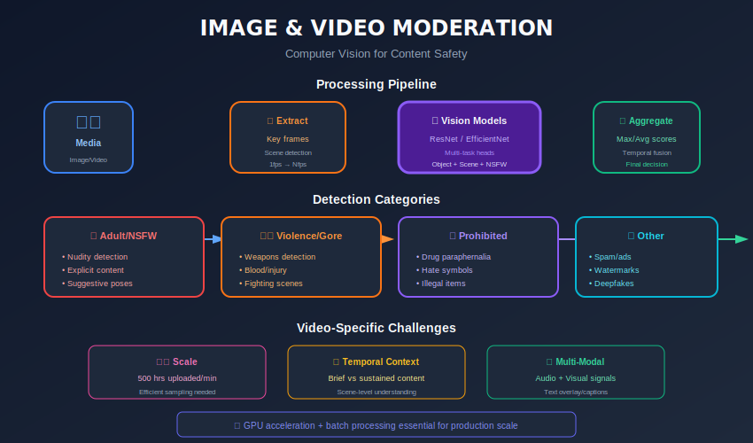

# Image & Video Content Moderation



## Table of Contents
- [Overview](#overview)
- [Image Classification Models](#image-classification-models)
- [Object Detection for Moderation](#object-detection-for-moderation)
- [Video Analysis Techniques](#video-analysis-techniques)
- [Hash-Based Matching](#hash-based-matching)
- [OCR and Text in Images](#ocr-and-text-in-images)
- [Multimodal Approaches](#multimodal-approaches)
- [Implementation Examples](#implementation-examples)

---

## Overview

Visual content moderation handles:

| Content Type | Detection Goals | Challenges |
|--------------|-----------------|------------|
| **Images** | NSFW, violence, hate symbols | Context, art vs. violation |
| **Videos** | Same as images + temporal patterns | Scale, real-time streaming |
| **Memes** | Text + image combinations | Irony, cultural references |
| **GIFs** | Animated content patterns | Loop detection, keyframes |

### Visual Moderation Pipeline



---

## Image Classification Models

### CNN Architectures for Moderation

```python
import torch
import torch.nn as nn
import torchvision.models as models

class ModerationCNN(nn.Module):
    """
    Transfer learning based moderation classifier.
    """

    def __init__(
        self,
        num_classes: int = 5,
        backbone: str = 'efficientnet_b4',
        pretrained: bool = True
    ):
        super().__init__()

        # Load backbone
        if backbone == 'efficientnet_b4':
            self.backbone = models.efficientnet_b4(pretrained=pretrained)
            num_features = self.backbone.classifier[1].in_features
            self.backbone.classifier = nn.Identity()
        elif backbone == 'resnet50':
            self.backbone = models.resnet50(pretrained=pretrained)
            num_features = self.backbone.fc.in_features
            self.backbone.fc = nn.Identity()

        # Classification head
        self.classifier = nn.Sequential(
            nn.Dropout(0.3),
            nn.Linear(num_features, 512),
            nn.ReLU(),
            nn.Dropout(0.2),
            nn.Linear(512, num_classes)
        )

        # For multi-label classification
        self.sigmoid = nn.Sigmoid()

    def forward(self, x, multi_label=True):
        features = self.backbone(x)
        logits = self.classifier(features)

        if multi_label:
            return self.sigmoid(logits)
        return logits

    def extract_features(self, x):
        """Extract features for hash-like comparison."""
        return self.backbone(x)

```

### Training Pipeline

```python
import torch
from torch.utils.data import DataLoader, Dataset
from torchvision import transforms
from PIL import Image
import albumentations as A
from albumentations.pytorch import ToTensorV2

class ModerationDataset(Dataset):
    def __init__(self, image_paths, labels, transform=None, is_training=True):
        self.image_paths = image_paths
        self.labels = labels
        self.is_training = is_training

        if transform is None:
            if is_training:
                self.transform = A.Compose([
                    A.RandomResizedCrop(224, 224),
                    A.HorizontalFlip(p=0.5),
                    A.ColorJitter(brightness=0.2, contrast=0.2, saturation=0.2),
                    A.GaussNoise(p=0.1),
                    A.Normalize(mean=[0.485, 0.456, 0.406],
                               std=[0.229, 0.224, 0.225]),
                    ToTensorV2()
                ])
            else:
                self.transform = A.Compose([
                    A.Resize(256, 256),
                    A.CenterCrop(224, 224),
                    A.Normalize(mean=[0.485, 0.456, 0.406],
                               std=[0.229, 0.224, 0.225]),
                    ToTensorV2()
                ])
        else:
            self.transform = transform

    def __len__(self):
        return len(self.image_paths)

    def __getitem__(self, idx):
        image = Image.open(self.image_paths[idx]).convert('RGB')
        image = np.array(image)

        if self.transform:
            transformed = self.transform(image=image)
            image = transformed['image']

        label = torch.tensor(self.labels[idx], dtype=torch.float32)
        return image, label

class ImageModerationTrainer:
    def __init__(self, model, config):
        self.model = model
        self.config = config
        self.device = torch.device('cuda' if torch.cuda.is_available() else 'cpu')
        self.model.to(self.device)

        self.criterion = nn.BCEWithLogitsLoss(
            pos_weight=torch.tensor(config.get('pos_weights', [1.0] * 5))
        ).to(self.device)

        self.optimizer = torch.optim.AdamW(
            model.parameters(),
            lr=config.get('lr', 1e-4),
            weight_decay=config.get('weight_decay', 0.01)
        )

        self.scheduler = torch.optim.lr_scheduler.CosineAnnealingLR(
            self.optimizer,
            T_max=config.get('epochs', 10)
        )

    def train_epoch(self, dataloader):
        self.model.train()
        total_loss = 0

        for batch_idx, (images, labels) in enumerate(dataloader):
            images = images.to(self.device)
            labels = labels.to(self.device)

            self.optimizer.zero_grad()
            outputs = self.model(images)
            loss = self.criterion(outputs, labels)

            loss.backward()
            torch.nn.utils.clip_grad_norm_(self.model.parameters(), 1.0)
            self.optimizer.step()

            total_loss += loss.item()

        self.scheduler.step()
        return total_loss / len(dataloader)

    def evaluate(self, dataloader):
        self.model.eval()
        all_preds = []
        all_labels = []

        with torch.no_grad():
            for images, labels in dataloader:
                images = images.to(self.device)
                outputs = self.model(images)
                preds = torch.sigmoid(outputs)

                all_preds.extend(preds.cpu().numpy())
                all_labels.extend(labels.numpy())

        return np.array(all_preds), np.array(all_labels)

```

---

## Object Detection for Moderation

### YOLO-based Detection

```python
from ultralytics import YOLO
import cv2
import numpy as np

class ModerationObjectDetector:
    """
    Detect specific objects relevant to content moderation.
    """

    def __init__(self, model_path: str):
        self.model = YOLO(model_path)

        # Categories to detect
        self.moderation_classes = {
            'weapon': ['gun', 'knife', 'rifle', 'sword'],
            'drug': ['syringe', 'pill', 'pipe'],
            'symbol': ['swastika', 'confederate_flag'],
            'person': ['person'],  # For nudity detection regions
        }

    def detect(self, image: np.ndarray) -> dict:
        """Detect objects in image."""
        results = self.model(image, verbose=False)[0]

        detections = {
            'objects': [],
            'moderation_flags': []
        }

        for box in results.boxes:
            cls_id = int(box.cls[0])
            cls_name = self.model.names[cls_id]
            confidence = float(box.conf[0])
            bbox = box.xyxy[0].tolist()

            detection = {
                'class': cls_name,
                'confidence': confidence,
                'bbox': bbox
            }
            detections['objects'].append(detection)

            # Check moderation relevance
            for mod_category, class_list in self.moderation_classes.items():
                if cls_name in class_list:
                    detections['moderation_flags'].append({
                        'category': mod_category,
                        'class': cls_name,
                        'confidence': confidence,
                        'bbox': bbox
                    })

        return detections

    def detect_and_blur(self, image: np.ndarray, categories: list) -> np.ndarray:
        """Detect and blur specific content categories."""
        detections = self.detect(image)
        result_image = image.copy()

        for flag in detections['moderation_flags']:
            if flag['category'] in categories:
                x1, y1, x2, y2 = map(int, flag['bbox'])
                roi = result_image[y1:y2, x1:x2]
                blurred = cv2.GaussianBlur(roi, (99, 99), 30)
                result_image[y1:y2, x1:x2] = blurred

        return result_image

```

### Nudity Detection with Body Part Segmentation

```python
class NudityDetector:
    """
    Detect nudity using body part segmentation.
    """

    def __init__(self, classifier_path: str, segmenter_path: str):
        self.classifier = self._load_classifier(classifier_path)
        self.segmenter = self._load_segmenter(segmenter_path)

        # Body part categories
        self.sensitive_parts = ['chest', 'buttocks', 'genitals']
        self.covered_threshold = 0.3  # Min coverage to be considered clothed

    def detect(self, image: np.ndarray) -> dict:
        """Full nudity detection pipeline."""
        # Step 1: Quick classification
        quick_score = self._quick_classify(image)

        if quick_score < 0.3:
            return {'nudity_score': quick_score, 'is_nude': False}

        # Step 2: Detailed segmentation for uncertain cases
        segments = self.segmenter.predict(image)

        # Step 3: Analyze exposure
        exposure_analysis = self._analyze_exposure(segments)

        # Step 4: Combined decision
        final_score = self._combine_scores(quick_score, exposure_analysis)

        return {
            'nudity_score': final_score,
            'is_nude': final_score > 0.7,
            'exposure_details': exposure_analysis,
            'segments': segments
        }

    def _quick_classify(self, image):
        """Quick binary classification."""
        # Preprocess
        processed = self._preprocess(image)
        return float(self.classifier(processed)[0])

    def _analyze_exposure(self, segments):
        """Analyze which body parts are exposed."""
        exposure = {}
        for part in self.sensitive_parts:
            if part in segments:
                # Calculate what percentage is exposed vs covered
                part_mask = segments[part]
                covered_mask = segments.get('clothing', np.zeros_like(part_mask))

                overlap = np.logical_and(part_mask, covered_mask).sum()
                total = part_mask.sum()

                covered_ratio = overlap / max(total, 1)
                exposure[part] = {
                    'exposed': covered_ratio < self.covered_threshold,
                    'coverage_ratio': covered_ratio
                }

        return exposure

```

---

## Video Analysis Techniques

### Keyframe Extraction

```python
import cv2
import numpy as np
from typing import List, Tuple

class VideoKeyframeExtractor:
    """
    Extract representative keyframes from video.
    """

    def __init__(self, method: str = 'scene_change'):
        self.method = method
        self.min_scene_change_threshold = 30.0

    def extract(self, video_path: str, max_frames: int = 32) -> List[np.ndarray]:
        """Extract keyframes from video."""
        cap = cv2.VideoCapture(video_path)

        if self.method == 'scene_change':
            return self._extract_scene_changes(cap, max_frames)
        elif self.method == 'uniform':
            return self._extract_uniform(cap, max_frames)
        elif self.method == 'motion':
            return self._extract_high_motion(cap, max_frames)

    def _extract_scene_changes(self, cap, max_frames) -> List[np.ndarray]:
        """Extract frames at scene changes."""
        keyframes = []
        prev_hist = None

        total_frames = int(cap.get(cv2.CAP_PROP_FRAME_COUNT))

        for frame_idx in range(total_frames):
            ret, frame = cap.read()
            if not ret:
                break

            # Convert to HSV and compute histogram
            hsv = cv2.cvtColor(frame, cv2.COLOR_BGR2HSV)
            hist = cv2.calcHist([hsv], [0, 1], None, [50, 60], [0, 180, 0, 256])
            hist = cv2.normalize(hist, hist).flatten()

            if prev_hist is not None:
                # Compare histograms
                diff = cv2.compareHist(prev_hist, hist, cv2.HISTCMP_BHATTACHARYYA)

                if diff > self.min_scene_change_threshold / 100:
                    keyframes.append(cv2.cvtColor(frame, cv2.COLOR_BGR2RGB))

                    if len(keyframes) >= max_frames:
                        break
            else:
                keyframes.append(cv2.cvtColor(frame, cv2.COLOR_BGR2RGB))

            prev_hist = hist

        cap.release()
        return keyframes

    def _extract_uniform(self, cap, max_frames) -> List[np.ndarray]:
        """Extract frames at uniform intervals."""
        total_frames = int(cap.get(cv2.CAP_PROP_FRAME_COUNT))
        interval = max(1, total_frames // max_frames)

        keyframes = []
        for i in range(0, total_frames, interval):
            cap.set(cv2.CAP_PROP_POS_FRAMES, i)
            ret, frame = cap.read()
            if ret:
                keyframes.append(cv2.cvtColor(frame, cv2.COLOR_BGR2RGB))

            if len(keyframes) >= max_frames:
                break

        cap.release()
        return keyframes

```

### Video Classification with 3D CNN

```python
import torch
import torch.nn as nn

class Video3DCNN(nn.Module):
    """
    3D CNN for video classification.
    Based on C3D/I3D architecture.
    """

    def __init__(self, num_classes: int = 5):
        super().__init__()

        self.features = nn.Sequential(
            # Conv block 1
            nn.Conv3d(3, 64, kernel_size=(3, 3, 3), padding=(1, 1, 1)),
            nn.BatchNorm3d(64),
            nn.ReLU(inplace=True),
            nn.MaxPool3d(kernel_size=(1, 2, 2), stride=(1, 2, 2)),

            # Conv block 2
            nn.Conv3d(64, 128, kernel_size=(3, 3, 3), padding=(1, 1, 1)),
            nn.BatchNorm3d(128),
            nn.ReLU(inplace=True),
            nn.MaxPool3d(kernel_size=(2, 2, 2), stride=(2, 2, 2)),

            # Conv block 3
            nn.Conv3d(128, 256, kernel_size=(3, 3, 3), padding=(1, 1, 1)),
            nn.BatchNorm3d(256),
            nn.ReLU(inplace=True),
            nn.Conv3d(256, 256, kernel_size=(3, 3, 3), padding=(1, 1, 1)),
            nn.BatchNorm3d(256),
            nn.ReLU(inplace=True),
            nn.MaxPool3d(kernel_size=(2, 2, 2), stride=(2, 2, 2)),

            # Conv block 4
            nn.Conv3d(256, 512, kernel_size=(3, 3, 3), padding=(1, 1, 1)),
            nn.BatchNorm3d(512),
            nn.ReLU(inplace=True),
            nn.Conv3d(512, 512, kernel_size=(3, 3, 3), padding=(1, 1, 1)),
            nn.BatchNorm3d(512),
            nn.ReLU(inplace=True),
            nn.MaxPool3d(kernel_size=(2, 2, 2), stride=(2, 2, 2)),
        )

        self.classifier = nn.Sequential(
            nn.AdaptiveAvgPool3d((1, 1, 1)),
            nn.Flatten(),
            nn.Linear(512, 256),
            nn.ReLU(inplace=True),
            nn.Dropout(0.5),
            nn.Linear(256, num_classes)
        )

    def forward(self, x):
        # x: (batch, channels, frames, height, width)
        x = self.features(x)
        x = self.classifier(x)
        return x

class VideoModerator:
    """
    Complete video moderation pipeline.
    """

    def __init__(self, frame_model, video_model, config):
        self.frame_model = frame_model  # Image classifier
        self.video_model = video_model  # 3D CNN
        self.keyframe_extractor = VideoKeyframeExtractor()
        self.config = config

    def moderate(self, video_path: str) -> dict:
        """Full video moderation."""
        # Extract keyframes
        keyframes = self.keyframe_extractor.extract(video_path)

        # Classify each keyframe
        frame_results = []
        for frame in keyframes:
            result = self._classify_frame(frame)
            frame_results.append(result)

        # Aggregate frame results
        frame_aggregated = self._aggregate_frame_results(frame_results)

        # Video-level classification (for temporal patterns)
        video_result = self._classify_video(keyframes)

        # Combine results
        final_result = self._combine_results(frame_aggregated, video_result)

        # Find worst frames for human review
        worst_frames = self._find_worst_frames(frame_results, keyframes)

        return {
            'scores': final_result,
            'frame_scores': frame_results,
            'worst_frames': worst_frames,
            'keyframe_count': len(keyframes)
        }

    def _classify_frame(self, frame):
        """Classify single frame."""
        processed = self._preprocess_frame(frame)
        with torch.no_grad():
            return self.frame_model(processed)

    def _aggregate_frame_results(self, results):
        """Aggregate frame-level results."""
        # Max pooling across frames (worst case)
        max_scores = {}
        for result in results:
            for category, score in result.items():
                if category not in max_scores:
                    max_scores[category] = score
                else:
                    max_scores[category] = max(max_scores[category], score)
        return max_scores

    def _find_worst_frames(self, results, keyframes, top_k=3):
        """Find frames with highest violation scores."""
        scored_frames = []
        for i, (result, frame) in enumerate(zip(results, keyframes)):
            max_score = max(result.values())
            scored_frames.append((max_score, i, frame))

        scored_frames.sort(reverse=True)
        return scored_frames[:top_k]

```

---

## Hash-Based Matching

### Perceptual Hashing

```python
import imagehash
from PIL import Image
import numpy as np

class PerceptualHasher:
    """
    Generate and compare perceptual hashes for images.
    """

    def __init__(self, hash_size: int = 16):
        self.hash_size = hash_size

    def compute_hash(self, image: Image.Image) -> dict:
        """Compute multiple perceptual hashes."""
        return {
            'phash': str(imagehash.phash(image, hash_size=self.hash_size)),
            'dhash': str(imagehash.dhash(image, hash_size=self.hash_size)),
            'average_hash': str(imagehash.average_hash(image, hash_size=self.hash_size)),
            'colorhash': str(imagehash.colorhash(image))
        }

    def compute_distance(self, hash1: str, hash2: str) -> int:
        """Compute Hamming distance between hashes."""
        h1 = imagehash.hex_to_hash(hash1)
        h2 = imagehash.hex_to_hash(hash2)
        return h1 - h2

    def is_similar(self, hash1: str, hash2: str, threshold: int = 10) -> bool:
        """Check if two hashes are similar."""
        return self.compute_distance(hash1, hash2) <= threshold

class HashDatabase:
    """
    Database for known bad content hashes.
    """

    def __init__(self, redis_client):
        self.redis = redis_client
        self.hasher = PerceptualHasher()

    def add_known_bad(self, image: Image.Image, metadata: dict):
        """Add known bad image to database."""
        hashes = self.hasher.compute_hash(image)

        # Store in Redis with metadata
        for hash_type, hash_value in hashes.items():
            key = f"bad_hash:{hash_type}:{hash_value}"
            self.redis.hset(key, mapping=metadata)

    def check_image(self, image: Image.Image) -> dict:
        """Check image against known bad hashes."""
        hashes = self.hasher.compute_hash(image)

        matches = []
        for hash_type, hash_value in hashes.items():
            # Exact match check
            key = f"bad_hash:{hash_type}:{hash_value}"
            if self.redis.exists(key):
                matches.append({
                    'type': 'exact',
                    'hash_type': hash_type,
                    'metadata': self.redis.hgetall(key)
                })

            # Near-duplicate check (scan similar hashes)
            # This would use a more efficient structure in production
            # like locality-sensitive hashing (LSH)

        return {
            'is_known_bad': len(matches) > 0,
            'matches': matches,
            'computed_hashes': hashes
        }

```

### PhotoDNA-like Implementation

```python
class RobustImageHash:
    """
    Robust hashing similar to PhotoDNA concept.
    Resistant to common image modifications.
    """

    def __init__(self, grid_size: int = 8, feature_dim: int = 144):
        self.grid_size = grid_size
        self.feature_dim = feature_dim

    def compute_hash(self, image: Image.Image) -> np.ndarray:
        """
        Compute robust hash resistant to:
        - Resizing
        - Compression
        - Minor crops
        - Color adjustments
        """
        # Convert to grayscale
        gray = image.convert('L')

        # Resize to standard size
        resized = gray.resize((self.grid_size * 8, self.grid_size * 8))

        # Divide into grid cells
        arr = np.array(resized)
        features = []

        cell_size = 8
        for i in range(self.grid_size):
            for j in range(self.grid_size):
                cell = arr[i*cell_size:(i+1)*cell_size,
                          j*cell_size:(j+1)*cell_size]

                # Extract robust features from each cell
                cell_features = self._extract_cell_features(cell)
                features.extend(cell_features)

        return np.array(features[:self.feature_dim])

    def _extract_cell_features(self, cell: np.ndarray) -> list:
        """Extract robust features from cell."""
        # Mean and std
        mean = np.mean(cell)
        std = np.std(cell)

        # Gradient features
        gx = np.mean(np.diff(cell, axis=1))
        gy = np.mean(np.diff(cell, axis=0))

        return [mean / 255.0, std / 128.0, gx / 128.0, gy / 128.0]

    def compare(self, hash1: np.ndarray, hash2: np.ndarray) -> float:
        """Compare two hashes (0 = identical, 1 = completely different)."""
        return np.linalg.norm(hash1 - hash2) / np.sqrt(self.feature_dim)

```

---

## OCR and Text in Images

### Text Extraction from Images

```python
import easyocr
import cv2
import numpy as np
from typing import List, Dict

class ImageTextExtractor:
    """
    Extract text from images for moderation.
    """

    def __init__(self, languages: List[str] = ['en']):
        self.reader = easyocr.Reader(languages)

    def extract_text(self, image: np.ndarray) -> Dict:
        """Extract all text from image."""
        results = self.reader.readtext(image)

        extracted = {
            'full_text': '',
            'regions': [],
            'confidence': 0
        }

        texts = []
        confidences = []

        for (bbox, text, conf) in results:
            texts.append(text)
            confidences.append(conf)

            extracted['regions'].append({
                'text': text,
                'bbox': bbox,
                'confidence': conf
            })

        extracted['full_text'] = ' '.join(texts)
        extracted['confidence'] = np.mean(confidences) if confidences else 0

        return extracted

    def extract_and_moderate(self, image: np.ndarray, text_moderator) -> Dict:
        """Extract text and run through text moderation."""
        ocr_result = self.extract_text(image)

        if not ocr_result['full_text']:
            return {
                'has_text': False,
                'text_moderation': None
            }

        # Run text through moderation
        text_result = text_moderator.moderate(ocr_result['full_text'])

        return {
            'has_text': True,
            'extracted_text': ocr_result['full_text'],
            'text_regions': ocr_result['regions'],
            'text_moderation': text_result
        }

```

### Meme Understanding

```python
class MemeAnalyzer:
    """
    Analyze memes by combining image and text understanding.
    """

    def __init__(self, image_model, text_model, multimodal_model):
        self.image_model = image_model
        self.text_model = text_model
        self.multimodal_model = multimodal_model  # e.g., CLIP or GPT-4V
        self.text_extractor = ImageTextExtractor()

    def analyze(self, image: np.ndarray) -> Dict:
        """Full meme analysis pipeline."""
        # Step 1: Extract text from meme
        text_result = self.text_extractor.extract_text(image)

        # Step 2: Image-only classification
        image_scores = self.image_model.predict(image)

        # Step 3: Text-only classification (if text exists)
        text_scores = None
        if text_result['full_text']:
            text_scores = self.text_model.predict(text_result['full_text'])

        # Step 4: Multimodal understanding
        multimodal_result = self._multimodal_analysis(image, text_result['full_text'])

        # Step 5: Combine all signals
        final_scores = self._combine_signals(
            image_scores, text_scores, multimodal_result
        )

        return {
            'image_scores': image_scores,
            'text_scores': text_scores,
            'multimodal_result': multimodal_result,
            'final_scores': final_scores,
            'extracted_text': text_result['full_text']
        }

    def _multimodal_analysis(self, image, text):
        """Use multimodal model for context understanding."""
        # This would use a model like CLIP or GPT-4V
        # to understand the relationship between image and text
        prompt = f"""Analyze this meme image with text: "{text}"

        Consider:
        1. Is there irony or sarcasm?
        2. Does the image-text combination create offensive meaning?
        3. Are there cultural references that change interpretation?

        Categories: hate_speech, violence, safe, needs_context"""

        return self.multimodal_model.analyze(image, prompt)

```

---

## Multimodal Approaches

### CLIP for Content Moderation

```python
import torch
import clip
from PIL import Image

class CLIPModerator:
    """
    Use CLIP for zero-shot content moderation.
    """

    def __init__(self, model_name: str = "ViT-B/32"):
        self.device = "cuda" if torch.cuda.is_available() else "cpu"
        self.model, self.preprocess = clip.load(model_name, device=self.device)

        # Define moderation categories as text prompts
        self.categories = {
            'safe': [
                "a safe, appropriate image",
                "a normal photo",
                "family friendly content"
            ],
            'violence': [
                "a violent image",
                "an image containing blood or gore",
                "a graphic depiction of violence"
            ],
            'adult': [
                "nudity or sexual content",
                "adult content",
                "NSFW image"
            ],
            'hate': [
                "hate symbols or imagery",
                "racist imagery",
                "discriminatory content"
            ]
        }

        # Precompute text embeddings
        self.category_embeddings = self._compute_category_embeddings()

    def _compute_category_embeddings(self):
        """Precompute embeddings for all category prompts."""
        embeddings = {}

        for category, prompts in self.categories.items():
            text_tokens = clip.tokenize(prompts).to(self.device)
            with torch.no_grad():
                text_features = self.model.encode_text(text_tokens)
                text_features = text_features / text_features.norm(dim=-1, keepdim=True)
                # Average embeddings for category
                embeddings[category] = text_features.mean(dim=0)

        return embeddings

    def moderate(self, image: Image.Image) -> Dict:
        """Zero-shot moderation using CLIP."""
        # Preprocess image
        image_input = self.preprocess(image).unsqueeze(0).to(self.device)

        # Get image embedding
        with torch.no_grad():
            image_features = self.model.encode_image(image_input)
            image_features = image_features / image_features.norm(dim=-1, keepdim=True)

        # Compare with category embeddings
        scores = {}
        for category, text_embedding in self.category_embeddings.items():
            similarity = (image_features @ text_embedding.unsqueeze(0).T).item()
            # Convert to 0-1 score
            scores[category] = (similarity + 1) / 2

        # Normalize so safe + violations sum to 1
        total = sum(scores.values())
        normalized = {k: v / total for k, v in scores.items()}

        return {
            'scores': normalized,
            'raw_scores': scores,
            'predicted_category': max(scores, key=scores.get)
        }

```

### Vision-Language Model Integration

```python
class VisionLanguageModerator:
    """
    Use vision-language models (GPT-4V, LLaVA) for nuanced moderation.
    """

    def __init__(self, api_client):
        self.client = api_client
        self.system_prompt = self._create_system_prompt()

    def _create_system_prompt(self):
        return """You are an expert content moderator. Analyze images for policy violations.

Categories:
- VIOLENCE: Graphic violence, gore, weapons
- ADULT: Nudity, sexual content
- HATE: Hate symbols, discriminatory imagery
- DANGEROUS: Self-harm, dangerous activities
- SAFE: No violations

For each image, provide:
1. Primary category
2. Confidence (0-1)
3. Specific elements that led to your decision
4. Any context that might change interpretation

Respond in JSON format."""

    def moderate(self, image_base64: str, context: str = None) -> Dict:
        """Analyze image using vision-language model."""
        messages = [
            {"role": "system", "content": self.system_prompt},
            {
                "role": "user",
                "content": [
                    {
                        "type": "image_url",
                        "image_url": {"url": f"data:image/jpeg;base64,{image_base64}"}
                    },
                    {
                        "type": "text",
                        "text": f"Analyze this image for content policy violations.{f' Context: {context}' if context else ''}"
                    }
                ]
            }
        ]

        response = self.client.chat.completions.create(
            model="gpt-4-vision-preview",
            messages=messages,
            max_tokens=500
        )

        return self._parse_response(response.choices[0].message.content)

```

---

## Implementation Examples

### Complete Image Moderation Service

```python
from fastapi import FastAPI, File, UploadFile, HTTPException
from PIL import Image
import io
import base64

app = FastAPI()

class ImageModerationService:
    def __init__(self, config):
        self.hash_db = HashDatabase(config['redis'])
        self.cnn_model = ModerationCNN.load(config['cnn_path'])
        self.clip_moderator = CLIPModerator()
        self.text_extractor = ImageTextExtractor()
        self.text_moderator = TextModerator(config['text_model_path'])

    async def moderate(self, image_bytes: bytes) -> Dict:
        """Full image moderation pipeline."""
        image = Image.open(io.BytesIO(image_bytes))

        # Step 1: Check against known bad hashes
        hash_result = self.hash_db.check_image(image)
        if hash_result['is_known_bad']:
            return {
                'decision': 'block',
                'reason': 'known_bad_content',
                'confidence': 1.0,
                'details': hash_result
            }

        # Step 2: CNN classification
        cnn_scores = self._run_cnn(image)

        # Step 3: CLIP zero-shot
        clip_scores = self.clip_moderator.moderate(image)

        # Step 4: OCR + text moderation
        text_result = self.text_extractor.extract_and_moderate(
            np.array(image),
            self.text_moderator
        )

        # Step 5: Combine all signals
        final_result = self._combine_results(
            cnn_scores, clip_scores, text_result
        )

        return final_result

    def _run_cnn(self, image):
        """Run CNN model on image."""
        processed = self._preprocess_for_cnn(image)
        with torch.no_grad():
            return self.cnn_model(processed)

    def _combine_results(self, cnn, clip, text):
        """Weighted combination of all signals."""
        weights = {'cnn': 0.5, 'clip': 0.3, 'text': 0.2}

        combined = {}
        for category in ['violence', 'adult', 'hate', 'safe']:
            score = (
                weights['cnn'] * cnn.get(category, 0) +
                weights['clip'] * clip['scores'].get(category, 0)
            )

            # Add text signal if present
            if text.get('text_moderation'):
                score += weights['text'] * text['text_moderation'].get(category, 0)

            combined[category] = score

        # Normalize
        total = sum(combined.values())
        combined = {k: v / total for k, v in combined.items()}

        return {
            'scores': combined,
            'decision': 'block' if combined.get('safe', 0) < 0.5 else 'allow',
            'component_scores': {
                'cnn': cnn,
                'clip': clip['scores'],
                'text': text.get('text_moderation')
            }
        }

# API endpoint
service = ImageModerationService(config)

@app.post("/moderate/image")
async def moderate_image(file: UploadFile = File(...)):
    contents = await file.read()
    result = await service.moderate(contents)
    return result

```

---

## Summary

Visual content moderation requires:

1. **Multi-model ensemble**: CNN + CLIP + specialized detectors
2. **Hash matching**: Fast rejection of known bad content
3. **Object detection**: For specific policy-relevant objects
4. **OCR integration**: Text in images needs moderation too
5. **Video handling**: Keyframe extraction + temporal analysis
6. **Multimodal understanding**: Image + text context matters

Key challenges:
- Scale (billions of images/videos)
- Context (same image, different meaning)
- Adversarial attacks (modified images)
- New content types (AR filters, AI-generated)

---

*Previous: [Text Moderation](../04_text_moderation/README.md)*
*Next: [Model Training & Selection](../06_model_training_selection/README.md)*

---

<div align="center">

**[⬆ Back to Top](#)** | **[📚 Main Repository](https://github.com/Gaurav14cs17/ml_system_design)**

Made with 💜 by [Gaurav14cs17](https://github.com/Gaurav14cs17)

</div>
