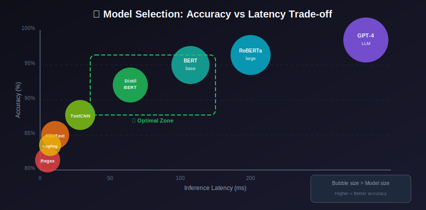
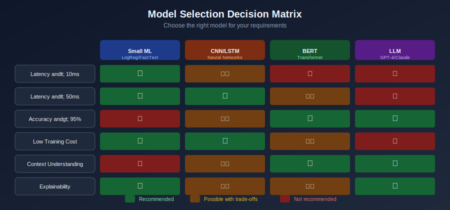

# Model Training & Selection for Content Moderation



## Table of Contents
- [Model Selection Strategy](#model-selection-strategy)
- [Training Pipelines](#training-pipelines)
- [Loss Functions](#loss-functions)
- [Optimization Techniques](#optimization-techniques)
- [Model Compression](#model-compression)
- [Hyperparameter Tuning](#hyperparameter-tuning)
- [Experiment Tracking](#experiment-tracking)

---

## Model Selection Strategy

### Decision Framework



### Model Comparison for Text

```python
from dataclasses import dataclass
from typing import Dict, List

@dataclass
class ModelConfig:
    name: str
    architecture: str
    params: int
    latency_ms: float
    accuracy: float
    cost_per_1m: float

MODELS = [
    ModelConfig("LogReg+TF-IDF", "linear", 10_000, 1, 0.82, 0.01),
    ModelConfig("FastText", "embedding", 100_000, 2, 0.85, 0.02),
    ModelConfig("TextCNN", "cnn", 1_000_000, 5, 0.88, 0.10),
    ModelConfig("BiLSTM+Attn", "rnn", 5_000_000, 20, 0.90, 0.50),
    ModelConfig("DistilBERT", "transformer", 66_000_000, 30, 0.93, 1.00),
    ModelConfig("BERT-base", "transformer", 110_000_000, 50, 0.95, 2.00),
    ModelConfig("RoBERTa-large", "transformer", 355_000_000, 100, 0.96, 5.00),
    ModelConfig("GPT-4", "llm", 1_000_000_000_000, 2000, 0.98, 30.00),
]

def select_model(requirements: Dict) -> ModelConfig:
    """Select best model based on requirements."""
    candidates = MODELS.copy()

    # Filter by latency
    max_latency = requirements.get('max_latency_ms', float('inf'))
    candidates = [m for m in candidates if m.latency_ms <= max_latency]

    # Filter by accuracy
    min_accuracy = requirements.get('min_accuracy', 0)
    candidates = [m for m in candidates if m.accuracy >= min_accuracy]

    # Filter by cost
    max_cost = requirements.get('max_cost_per_1m', float('inf'))
    candidates = [m for m in candidates if m.cost_per_1m <= max_cost]

    if not candidates:
        raise ValueError("No model meets all requirements")

    # Return highest accuracy among candidates
    return max(candidates, key=lambda m: m.accuracy)
```

---

## Training Pipelines

### Complete Training Pipeline

```python
import torch
from torch.utils.data import DataLoader
from transformers import get_linear_schedule_with_warmup
import wandb
from sklearn.metrics import f1_score, precision_recall_fscore_support

class ModerationTrainingPipeline:
    def __init__(self, config):
        self.config = config
        self.device = torch.device('cuda' if torch.cuda.is_available() else 'cpu')

        # Initialize model
        self.model = self._create_model(config)
        self.model.to(self.device)

        # Optimizer and scheduler
        self.optimizer = self._create_optimizer()
        self.scheduler = None  # Created after knowing training steps

        # Loss function
        self.criterion = self._create_loss_function()

        # Tracking
        wandb.init(project=config['project_name'], config=config)

    def _create_model(self, config):
        """Create model based on config."""
        from transformers import AutoModelForSequenceClassification

        return AutoModelForSequenceClassification.from_pretrained(
            config['model_name'],
            num_labels=config['num_labels'],
            problem_type="multi_label_classification"
        )

    def _create_optimizer(self):
        """Create optimizer with layer-wise learning rate decay."""
        no_decay = ['bias', 'LayerNorm.weight']

        # Group parameters
        optimizer_grouped_parameters = [
            {
                'params': [p for n, p in self.model.named_parameters()
                          if not any(nd in n for nd in no_decay)],
                'weight_decay': self.config.get('weight_decay', 0.01)
            },
            {
                'params': [p for n, p in self.model.named_parameters()
                          if any(nd in n for nd in no_decay)],
                'weight_decay': 0.0
            }
        ]

        return torch.optim.AdamW(
            optimizer_grouped_parameters,
            lr=self.config.get('learning_rate', 2e-5)
        )

    def _create_loss_function(self):
        """Create weighted loss function for imbalanced data."""
        if self.config.get('class_weights'):
            weights = torch.tensor(self.config['class_weights']).to(self.device)
            return torch.nn.BCEWithLogitsLoss(pos_weight=weights)
        return torch.nn.BCEWithLogitsLoss()

    def train(self, train_loader, val_loader, epochs):
        """Main training loop."""
        # Create scheduler
        total_steps = len(train_loader) * epochs
        self.scheduler = get_linear_schedule_with_warmup(
            self.optimizer,
            num_warmup_steps=int(total_steps * 0.1),
            num_training_steps=total_steps
        )

        best_f1 = 0
        patience = self.config.get('patience', 3)
        patience_counter = 0

        for epoch in range(epochs):
            # Training
            train_loss = self._train_epoch(train_loader)

            # Validation
            val_metrics = self._evaluate(val_loader)

            # Log metrics
            wandb.log({
                'epoch': epoch,
                'train_loss': train_loss,
                'val_f1': val_metrics['f1'],
                'val_precision': val_metrics['precision'],
                'val_recall': val_metrics['recall']
            })

            print(f"Epoch {epoch+1}: Loss={train_loss:.4f}, F1={val_metrics['f1']:.4f}")

            # Early stopping
            if val_metrics['f1'] > best_f1:
                best_f1 = val_metrics['f1']
                patience_counter = 0
                self._save_checkpoint('best_model.pt')
            else:
                patience_counter += 1
                if patience_counter >= patience:
                    print("Early stopping triggered")
                    break

        return best_f1

    def _train_epoch(self, dataloader):
        """Train for one epoch."""
        self.model.train()
        total_loss = 0

        for batch in dataloader:
            input_ids = batch['input_ids'].to(self.device)
            attention_mask = batch['attention_mask'].to(self.device)
            labels = batch['labels'].to(self.device)

            self.optimizer.zero_grad()

            outputs = self.model(
                input_ids=input_ids,
                attention_mask=attention_mask
            )

            loss = self.criterion(outputs.logits, labels)
            loss.backward()

            torch.nn.utils.clip_grad_norm_(self.model.parameters(), 1.0)

            self.optimizer.step()
            self.scheduler.step()

            total_loss += loss.item()

        return total_loss / len(dataloader)

    def _evaluate(self, dataloader):
        """Evaluate model on validation set."""
        self.model.eval()
        all_preds = []
        all_labels = []

        with torch.no_grad():
            for batch in dataloader:
                input_ids = batch['input_ids'].to(self.device)
                attention_mask = batch['attention_mask'].to(self.device)
                labels = batch['labels']

                outputs = self.model(
                    input_ids=input_ids,
                    attention_mask=attention_mask
                )

                preds = torch.sigmoid(outputs.logits).cpu()
                all_preds.extend((preds > 0.5).numpy())
                all_labels.extend(labels.numpy())

        precision, recall, f1, _ = precision_recall_fscore_support(
            all_labels, all_preds, average='macro'
        )

        return {
            'precision': precision,
            'recall': recall,
            'f1': f1
        }

    def _save_checkpoint(self, filename):
        """Save model checkpoint."""
        torch.save({
            'model_state_dict': self.model.state_dict(),
            'optimizer_state_dict': self.optimizer.state_dict(),
            'config': self.config
        }, filename)
```

---

## Loss Functions

### Mathematical Background

In content moderation, selecting the right loss function is critical due to:
- **Class imbalance**: Violations are typically rare (1-5% of content)
- **Multi-label classification**: Content can violate multiple policies
- **Severity gradients**: Not all violations are equally harmful

### Binary Cross-Entropy Loss

The standard loss for binary classification:

```math
\mathcal{L}_{\text{BCE}} = -\frac{1}{N} \sum_{i=1}^{N} \left[ y_i \log(\hat{y}_i) + (1 - y_i) \log(1 - \hat{y}_i) \right]
```

Where:
- \(y_i \in \{0, 1\}\) is the true label
- \(\hat{y}_i \in [0, 1]\) is the predicted probability

### Focal Loss

Addresses class imbalance by down-weighting easy examples:

```math
\mathcal{L}_{\text{Focal}} = -\alpha_t (1 - p_t)^\gamma \log(p_t)
```

Where:
- \(p_t = \hat{y}\) if \(y = 1\), else \(1 - \hat{y}\)
- \(\gamma\) is the focusing parameter (typically 2)
- \(\alpha_t\) is the class weight

**Effect**: When a sample is misclassified and \(p_t\) is small, the loss is unaffected. But when \(p_t \to 1\), the factor \((1 - p_t)^\gamma\) goes to zero, reducing the loss for well-classified examples.

### Asymmetric Loss

Different treatment for positive and negative samples:

```math
\mathcal{L}_{\text{ASL}} = \begin{cases}
(1 - p)^{\gamma_+} \log(p) & \text{if } y = 1 \\
(p_m)^{\gamma_-} \log(1 - p_m) & \text{if } y = 0
\end{cases}
```

Where \(p_m = \max(p - m, 0)\) with margin \(m\) for hard threshold on negatives.

### Weighted Cross-Entropy for Class Imbalance

When violations are rare, weight the positive class:

```math
\mathcal{L}_{\text{weighted}} = -\frac{1}{N} \sum_{i=1}^{N} \left[ w_+ \cdot y_i \log(\hat{y}_i) + w_- \cdot (1 - y_i) \log(1 - \hat{y}_i) \right]
```

Common weighting: \(w_+ = \frac{N}{2 \cdot N_+}\), \(w_- = \frac{N}{2 \cdot N_-}\)

### Label Smoothing

Prevents overconfident predictions:

```math
y_{\text{smooth}} = y \cdot (1 - \epsilon) + \frac{\epsilon}{K}
```

Where \(\epsilon\) is the smoothing factor (typically 0.1) and \(K\) is the number of classes.

### Custom Loss Functions for Moderation

```python
import torch
import torch.nn as nn
import torch.nn.functional as F

class FocalLoss(nn.Module):
    """
    Focal Loss for handling class imbalance.
    Focuses on hard examples by down-weighting easy ones.
    """

    def __init__(self, alpha=1, gamma=2, reduction='mean'):
        super().__init__()
        self.alpha = alpha
        self.gamma = gamma
        self.reduction = reduction

    def forward(self, inputs, targets):
        bce_loss = F.binary_cross_entropy_with_logits(
            inputs, targets, reduction='none'
        )

        pt = torch.exp(-bce_loss)
        focal_loss = self.alpha * (1 - pt) ** self.gamma * bce_loss

        if self.reduction == 'mean':
            return focal_loss.mean()
        elif self.reduction == 'sum':
            return focal_loss.sum()
        return focal_loss

class AsymmetricLoss(nn.Module):
    """
    Asymmetric Loss for multi-label classification.
    Different focusing for positive and negative samples.
    """

    def __init__(self, gamma_neg=4, gamma_pos=1, clip=0.05):
        super().__init__()
        self.gamma_neg = gamma_neg
        self.gamma_pos = gamma_pos
        self.clip = clip

    def forward(self, inputs, targets):
        # Positive samples
        xs_pos = inputs
        xs_neg = 1 - inputs

        # Asymmetric clipping
        if self.clip is not None and self.clip > 0:
            xs_neg = (xs_neg + self.clip).clamp(max=1)

        # Basic CE calculations
        los_pos = targets * torch.log(xs_pos.clamp(min=1e-8))
        los_neg = (1 - targets) * torch.log(xs_neg.clamp(min=1e-8))

        # Asymmetric focusing
        if self.gamma_neg > 0 or self.gamma_pos > 0:
            pt0 = xs_pos * targets
            pt1 = xs_neg * (1 - targets)
            pt = pt0 + pt1
            one_sided_gamma = self.gamma_pos * targets + self.gamma_neg * (1 - targets)
            one_sided_w = torch.pow(1 - pt, one_sided_gamma)
            loss = one_sided_w * (los_pos + los_neg)
        else:
            loss = los_pos + los_neg

        return -loss.mean()

class LabelSmoothingLoss(nn.Module):
    """
    Label smoothing to prevent overconfidence.
    """

    def __init__(self, smoothing=0.1):
        super().__init__()
        self.smoothing = smoothing

    def forward(self, inputs, targets):
        # Smooth labels
        n_classes = inputs.size(-1)
        smooth_targets = targets * (1 - self.smoothing) + self.smoothing / n_classes

        return F.binary_cross_entropy_with_logits(inputs, smooth_targets)

class HierarchicalLoss(nn.Module):
    """
    Loss that respects category hierarchy.
    E.g., 'extreme_violence' implies 'violence'.
    """

    def __init__(self, hierarchy: dict, weight_parent=0.5):
        super().__init__()
        self.hierarchy = hierarchy  # {child_idx: parent_idx}
        self.weight_parent = weight_parent
        self.bce = nn.BCEWithLogitsLoss(reduction='none')

    def forward(self, inputs, targets):
        base_loss = self.bce(inputs, targets)

        # Add consistency loss for hierarchy
        hierarchy_loss = 0
        for child_idx, parent_idx in self.hierarchy.items():
            # If child is positive, parent should be positive
            child_prob = torch.sigmoid(inputs[:, child_idx])
            parent_prob = torch.sigmoid(inputs[:, parent_idx])

            # Penalty when child > parent
            violation = F.relu(child_prob - parent_prob)
            hierarchy_loss += violation.mean()

        return base_loss.mean() + self.weight_parent * hierarchy_loss
```

---

## Optimization Techniques

### Gradient Accumulation

```python
class GradientAccumulationTrainer:
    """
    Train with gradient accumulation for larger effective batch sizes.
    """

    def __init__(self, model, optimizer, accumulation_steps=4):
        self.model = model
        self.optimizer = optimizer
        self.accumulation_steps = accumulation_steps

    def train_step(self, batch, step):
        outputs = self.model(**batch)
        loss = outputs.loss / self.accumulation_steps
        loss.backward()

        if (step + 1) % self.accumulation_steps == 0:
            self.optimizer.step()
            self.optimizer.zero_grad()

        return loss.item() * self.accumulation_steps
```

### Mixed Precision Training

```python
from torch.cuda.amp import autocast, GradScaler

class MixedPrecisionTrainer:
    """
    FP16 training for faster training and lower memory.
    """

    def __init__(self, model, optimizer):
        self.model = model
        self.optimizer = optimizer
        self.scaler = GradScaler()

    def train_step(self, batch):
        self.optimizer.zero_grad()

        with autocast():
            outputs = self.model(**batch)
            loss = outputs.loss

        self.scaler.scale(loss).backward()
        self.scaler.unscale_(self.optimizer)
        torch.nn.utils.clip_grad_norm_(self.model.parameters(), 1.0)
        self.scaler.step(self.optimizer)
        self.scaler.update()

        return loss.item()
```

---

## Model Compression

### Knowledge Distillation

```python
class DistillationTrainer:
    """
    Distill knowledge from large teacher to small student.
    """

    def __init__(self, teacher, student, temperature=4.0, alpha=0.5):
        self.teacher = teacher
        self.student = student
        self.temperature = temperature
        self.alpha = alpha  # Weight for distillation vs hard labels

    def train_step(self, batch, labels):
        # Get teacher predictions (no gradient)
        self.teacher.eval()
        with torch.no_grad():
            teacher_logits = self.teacher(**batch).logits

        # Get student predictions
        self.student.train()
        student_logits = self.student(**batch).logits

        # Hard label loss
        hard_loss = F.cross_entropy(student_logits, labels)

        # Soft label loss (distillation)
        soft_teacher = F.softmax(teacher_logits / self.temperature, dim=-1)
        soft_student = F.log_softmax(student_logits / self.temperature, dim=-1)
        soft_loss = F.kl_div(soft_student, soft_teacher, reduction='batchmean')
        soft_loss = soft_loss * (self.temperature ** 2)

        # Combined loss
        loss = self.alpha * soft_loss + (1 - self.alpha) * hard_loss

        return loss
```

### Quantization

```python
import torch.quantization as quant

class ModelQuantizer:
    """
    Quantize models for faster inference.
    """

    @staticmethod
    def dynamic_quantization(model):
        """Dynamic quantization (weights only)."""
        return torch.quantization.quantize_dynamic(
            model,
            {torch.nn.Linear},
            dtype=torch.qint8
        )

    @staticmethod
    def static_quantization(model, calibration_data):
        """Static quantization (weights + activations)."""
        model.eval()

        # Prepare for quantization
        model.qconfig = quant.get_default_qconfig('fbgemm')
        quant.prepare(model, inplace=True)

        # Calibrate with representative data
        with torch.no_grad():
            for batch in calibration_data:
                model(**batch)

        # Convert to quantized model
        quant.convert(model, inplace=True)

        return model
```

---

## Hyperparameter Tuning

### Optuna Integration

```python
import optuna
from optuna.integration import PyTorchLightningPruningCallback

def objective(trial):
    """Optuna objective for hyperparameter search."""

    # Suggest hyperparameters
    config = {
        'learning_rate': trial.suggest_loguniform('lr', 1e-6, 1e-3),
        'batch_size': trial.suggest_categorical('batch_size', [16, 32, 64]),
        'warmup_ratio': trial.suggest_uniform('warmup_ratio', 0.0, 0.2),
        'weight_decay': trial.suggest_loguniform('weight_decay', 1e-5, 1e-2),
        'dropout': trial.suggest_uniform('dropout', 0.1, 0.5),
        'hidden_dim': trial.suggest_categorical('hidden_dim', [256, 512, 768]),
    }

    # Train model with these hyperparameters
    trainer = ModerationTrainingPipeline(config)

    train_loader = create_dataloader(config['batch_size'])
    val_loader = create_dataloader(config['batch_size'])

    best_f1 = trainer.train(train_loader, val_loader, epochs=5)

    return best_f1

# Run optimization
study = optuna.create_study(direction='maximize')
study.optimize(objective, n_trials=50, timeout=3600)

print(f"Best trial: {study.best_trial.params}")
print(f"Best F1: {study.best_value}")
```

---

## Experiment Tracking

### MLflow Integration

```python
import mlflow
import mlflow.pytorch

class ExperimentTracker:
    """
    Track experiments with MLflow.
    """

    def __init__(self, experiment_name: str):
        mlflow.set_experiment(experiment_name)
        self.run = None

    def start_run(self, run_name: str = None):
        self.run = mlflow.start_run(run_name=run_name)
        return self

    def log_params(self, params: dict):
        mlflow.log_params(params)

    def log_metrics(self, metrics: dict, step: int = None):
        mlflow.log_metrics(metrics, step=step)

    def log_model(self, model, artifact_path: str):
        mlflow.pytorch.log_model(model, artifact_path)

    def log_artifact(self, local_path: str):
        mlflow.log_artifact(local_path)

    def end_run(self):
        mlflow.end_run()

    def __enter__(self):
        return self.start_run()

    def __exit__(self, *args):
        self.end_run()

# Usage
tracker = ExperimentTracker("content_moderation")

with tracker.start_run("bert_fine_tuning_v1"):
    tracker.log_params({
        'model': 'bert-base-uncased',
        'learning_rate': 2e-5,
        'epochs': 10
    })

    for epoch in range(10):
        # Train...
        tracker.log_metrics({
            'train_loss': train_loss,
            'val_f1': val_f1
        }, step=epoch)

    tracker.log_model(model, "model")
```

---

## Summary

Effective model training for content moderation requires:

1. **Model Selection**: Match model complexity to requirements
2. **Custom Loss Functions**: Handle class imbalance
3. **Optimization**: Mixed precision, gradient accumulation
4. **Compression**: Distillation, quantization for deployment
5. **Hyperparameter Tuning**: Systematic search with Optuna
6. **Experiment Tracking**: MLflow/W&B for reproducibility

---

*Previous: [Image & Video Moderation](../05_image_video_moderation/README.md)*
*Next: [Feature Engineering](../07_feature_engineering/README.md)*

---

<div align="center">

**[⬆ Back to Top](#)** | **[📚 Main Repository](https://github.com/Gaurav14cs17/ml_system_design)**

Made with 💜 by [Gaurav14cs17](https://github.com/Gaurav14cs17)

</div>
