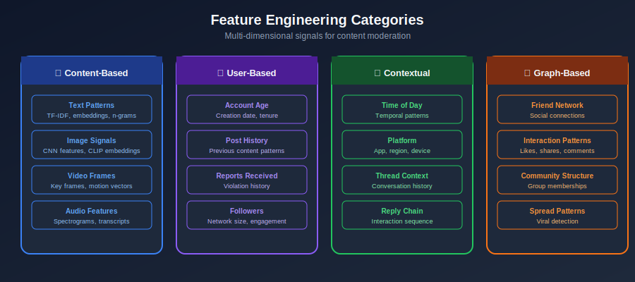

# Feature Engineering for Content Moderation

## Table of Contents
- [Feature Categories](#feature-categories)
- [Text Features](#text-features)
- [User & Behavioral Features](#user-behavioral-features)
- [Contextual Features](#contextual-features)
- [Graph Features](#graph-features)
- [Feature Stores](#feature-stores)
- [Feature Selection](#feature-selection)

---

## Feature Categories

### Overview of Feature Types



---

## Text Features

### Comprehensive Text Feature Extractor

```python
import numpy as np
import re
from collections import Counter
from typing import Dict, List
import emoji
from textblob import TextBlob

class TextFeatureExtractor:
    """
    Extract rich features from text for content moderation.
    """

    def __init__(self):
        self.slur_patterns = self._load_slur_patterns()
        self.url_pattern = re.compile(r'https?://\S+')
        self.mention_pattern = re.compile(r'@\w+')
        self.hashtag_pattern = re.compile(r'#\w+')

    def extract_all(self, text: str) -> Dict[str, float]:
        """Extract all feature categories."""
        features = {}

        # Basic statistics
        features.update(self._basic_stats(text))

        # Pattern-based features
        features.update(self._pattern_features(text))

        # Linguistic features
        features.update(self._linguistic_features(text))

        # Sentiment features
        features.update(self._sentiment_features(text))

        # Toxicity signals
        features.update(self._toxicity_signals(text))

        return features

    def _basic_stats(self, text: str) -> Dict:
        """Basic text statistics."""
        words = text.split()
        chars = list(text)

        return {
            'char_count': len(text),
            'word_count': len(words),
            'avg_word_length': np.mean([len(w) for w in words]) if words else 0,
            'unique_word_ratio': len(set(words)) / max(len(words), 1),
            'uppercase_ratio': sum(1 for c in chars if c.isupper()) / max(len(chars), 1),
            'digit_ratio': sum(1 for c in chars if c.isdigit()) / max(len(chars), 1),
            'whitespace_ratio': sum(1 for c in chars if c.isspace()) / max(len(chars), 1),
            'punctuation_ratio': sum(1 for c in chars if c in '.,!?;:') / max(len(chars), 1),
        }

    def _pattern_features(self, text: str) -> Dict:
        """Pattern-based features."""
        return {
            'url_count': len(self.url_pattern.findall(text)),
            'mention_count': len(self.mention_pattern.findall(text)),
            'hashtag_count': len(self.hashtag_pattern.findall(text)),
            'emoji_count': len([c for c in text if c in emoji.EMOJI_DATA]),
            'exclamation_count': text.count('!'),
            'question_count': text.count('?'),
            'ellipsis_count': text.count('...'),
            'all_caps_words': sum(1 for w in text.split() if w.isupper() and len(w) > 1),
            'repeated_chars': len(re.findall(r'(.)\1{2,}', text)),
        }

    def _linguistic_features(self, text: str) -> Dict:
        """Linguistic analysis features."""
        words = text.lower().split()

        # First/second person pronouns (direct address)
        first_person = sum(1 for w in words if w in ['i', 'me', 'my', 'mine', 'we', 'us', 'our'])
        second_person = sum(1 for w in words if w in ['you', 'your', 'yours'])

        # Question words
        question_words = sum(1 for w in words if w in ['who', 'what', 'where', 'when', 'why', 'how'])

        # Negation
        negations = sum(1 for w in words if w in ["not", "no", "never", "don't", "won't", "can't", "doesn't"])

        return {
            'first_person_ratio': first_person / max(len(words), 1),
            'second_person_ratio': second_person / max(len(words), 1),
            'question_word_ratio': question_words / max(len(words), 1),
            'negation_ratio': negations / max(len(words), 1),
        }

    def _sentiment_features(self, text: str) -> Dict:
        """Sentiment analysis features."""
        blob = TextBlob(text)

        return {
            'sentiment_polarity': blob.sentiment.polarity,  # -1 to 1
            'sentiment_subjectivity': blob.sentiment.subjectivity,  # 0 to 1
        }

    def _toxicity_signals(self, text: str) -> Dict:
        """Signals that may indicate toxic content."""
        text_lower = text.lower()

        # Check for obfuscated patterns
        obfuscation_score = self._detect_obfuscation(text)

        # Check for slur patterns
        slur_matches = sum(1 for pattern in self.slur_patterns
                         if re.search(pattern, text_lower))

        return {
            'obfuscation_score': obfuscation_score,
            'potential_slur_count': slur_matches,
            'excessive_caps': 1 if text.isupper() and len(text) > 10 else 0,
        }

    def _detect_obfuscation(self, text: str) -> float:
        """Detect if text is obfuscated to evade detection."""
        signals = 0

        # Spaces between letters (h a t e)
        if re.search(r'\b\w(\s\w){3,}\b', text):
            signals += 1

        # Dots between letters (h.a.t.e)
        if re.search(r'\b\w(\.\w){3,}\b', text):
            signals += 1

        # Number substitutions (h4t3)
        if re.search(r'[a-z]+[0-9]+[a-z]+', text.lower()):
            signals += 1

        # Special character substitutions (@, $, etc.)
        special_ratio = sum(1 for c in text if c in '@$!#%^&*') / max(len(text), 1)
        if special_ratio > 0.1:
            signals += 1

        return signals / 4.0

    def _load_slur_patterns(self):
        """Load regex patterns for known slurs (simplified)."""
        # In production, load from secure, encrypted storage
        return []

```

### N-gram Features

```python
from sklearn.feature_extraction.text import TfidfVectorizer
from scipy.sparse import hstack

class NgramFeatureExtractor:
    """
    Extract n-gram features with TF-IDF weighting.
    """

    def __init__(self, max_features: int = 10000):
        self.word_vectorizer = TfidfVectorizer(
            ngram_range=(1, 3),
            max_features=max_features,
            min_df=2,
            max_df=0.95,
            sublinear_tf=True
        )

        self.char_vectorizer = TfidfVectorizer(
            analyzer='char',
            ngram_range=(3, 6),
            max_features=max_features,
            min_df=2
        )

        self.fitted = False

    def fit(self, texts: List[str]):
        """Fit vectorizers on training data."""
        self.word_vectorizer.fit(texts)
        self.char_vectorizer.fit(texts)
        self.fitted = True

    def transform(self, texts: List[str]):
        """Transform texts to feature matrix."""
        if not self.fitted:
            raise ValueError("Must fit before transform")

        word_features = self.word_vectorizer.transform(texts)
        char_features = self.char_vectorizer.transform(texts)

        return hstack([word_features, char_features])

```

---

## User & Behavioral Features

### User Profile Features

```python
from datetime import datetime, timedelta
from dataclasses import dataclass
from typing import Optional

@dataclass
class UserFeatures:
    user_id: str
    account_age_days: int
    total_posts: int
    total_reports_received: int
    total_reports_made: int
    previous_violations: int
    follower_count: int
    following_count: int
    is_verified: bool
    profile_completeness: float

class UserFeatureExtractor:
    """
    Extract features from user profile and history.
    """

    def __init__(self, db_connection):
        self.db = db_connection

    def extract(self, user_id: str) -> Dict[str, float]:
        """Extract all user features."""
        profile = self._get_user_profile(user_id)
        history = self._get_user_history(user_id)

        features = {}

        # Account features
        features['account_age_days'] = profile.account_age_days
        features['is_new_account'] = 1 if profile.account_age_days < 7 else 0
        features['is_very_new_account'] = 1 if profile.account_age_days < 1 else 0

        # Activity features
        features['total_posts'] = profile.total_posts
        features['posts_per_day'] = profile.total_posts / max(profile.account_age_days, 1)

        # Trust signals
        features['is_verified'] = 1 if profile.is_verified else 0
        features['profile_completeness'] = profile.profile_completeness

        # Social features
        features['follower_count'] = profile.follower_count
        features['following_count'] = profile.following_count
        features['follower_ratio'] = (
            profile.follower_count / max(profile.following_count, 1)
        )

        # Risk signals
        features['report_rate'] = (
            profile.total_reports_received / max(profile.total_posts, 1)
        )
        features['previous_violations'] = profile.previous_violations
        features['violation_rate'] = (
            profile.previous_violations / max(profile.total_posts, 1)
        )

        # Recent activity patterns
        features.update(self._extract_recent_patterns(history))

        return features

    def _extract_recent_patterns(self, history) -> Dict:
        """Extract patterns from recent activity."""
        now = datetime.utcnow()
        last_24h = [h for h in history if h.timestamp > now - timedelta(hours=24)]
        last_hour = [h for h in history if h.timestamp > now - timedelta(hours=1)]

        return {
            'posts_last_24h': len(last_24h),
            'posts_last_hour': len(last_hour),
            'is_burst_posting': 1 if len(last_hour) > 10 else 0,
            'avg_post_interval_minutes': self._avg_interval(history),
        }

    def _avg_interval(self, history) -> float:
        """Average time between posts."""
        if len(history) < 2:
            return 0

        intervals = []
        sorted_history = sorted(history, key=lambda x: x.timestamp)
        for i in range(1, len(sorted_history)):
            delta = (sorted_history[i].timestamp - sorted_history[i-1].timestamp)
            intervals.append(delta.total_seconds() / 60)

        return np.mean(intervals)

```

---

## Contextual Features

### Thread and Conversation Context

```python
class ContextualFeatureExtractor:
    """
    Extract features from the context around content.
    """

    def __init__(self, content_db):
        self.db = content_db

    def extract(self, content_id: str, content_text: str) -> Dict:
        """Extract contextual features."""
        context = self._get_context(content_id)

        features = {}

        # Thread features
        if context.get('thread'):
            features.update(self._thread_features(context['thread'], content_text))

        # Temporal features
        features.update(self._temporal_features(context.get('timestamp')))

        # Platform features
        features.update(self._platform_features(context.get('platform_context')))

        return features

    def _thread_features(self, thread, current_text) -> Dict:
        """Features from conversation thread."""
        return {
            'thread_length': len(thread),
            'is_reply': 1 if len(thread) > 1 else 0,
            'reply_depth': len(thread) - 1,
            'thread_toxicity_avg': self._avg_thread_toxicity(thread),
            'parent_was_flagged': 1 if thread[-2].get('was_flagged') else 0 if len(thread) > 1 else 0,
            'same_author_in_thread': sum(1 for t in thread if t.get('author') == thread[-1].get('author')),
        }

    def _temporal_features(self, timestamp) -> Dict:
        """Time-based features."""
        if not timestamp:
            return {}

        return {
            'hour_of_day': timestamp.hour,
            'day_of_week': timestamp.weekday(),
            'is_weekend': 1 if timestamp.weekday() >= 5 else 0,
            'is_night': 1 if timestamp.hour < 6 or timestamp.hour > 22 else 0,
        }

    def _platform_features(self, platform_context) -> Dict:
        """Features specific to platform location."""
        if not platform_context:
            return {}

        return {
            'is_public': 1 if platform_context.get('visibility') == 'public' else 0,
            'community_size': platform_context.get('community_size', 0),
            'is_moderated_community': 1 if platform_context.get('has_moderators') else 0,
        }

```

---

## Graph Features

### Social Graph Features

```python
import networkx as nx
from typing import Set

class GraphFeatureExtractor:
    """
    Extract features from social graph structure.
    """

    def __init__(self, graph: nx.Graph):
        self.graph = graph

    def extract_user_features(self, user_id: str) -> Dict:
        """Extract graph features for a user."""
        if user_id not in self.graph:
            return self._default_features()

        features = {}

        # Basic centrality
        features['degree'] = self.graph.degree(user_id)

        # Neighborhood features
        neighbors = set(self.graph.neighbors(user_id))
        features['neighbor_count'] = len(neighbors)

        # Bad actor proximity
        bad_actors = self._get_flagged_users()
        features['bad_neighbor_count'] = len(neighbors & bad_actors)
        features['bad_neighbor_ratio'] = (
            features['bad_neighbor_count'] / max(features['neighbor_count'], 1)
        )

        # Clustering
        features['clustering_coefficient'] = nx.clustering(self.graph, user_id)

        # Community features
        if hasattr(self, 'communities'):
            user_community = self._get_user_community(user_id)
            features['community_size'] = len(user_community)
            features['community_violation_rate'] = self._community_violation_rate(user_community)

        return features

    def extract_interaction_features(self, user_a: str, user_b: str) -> Dict:
        """Extract features for interaction between two users."""
        features = {}

        # Are they connected?
        features['are_connected'] = 1 if self.graph.has_edge(user_a, user_b) else 0

        # Common neighbors
        if user_a in self.graph and user_b in self.graph:
            neighbors_a = set(self.graph.neighbors(user_a))
            neighbors_b = set(self.graph.neighbors(user_b))
            common = neighbors_a & neighbors_b

            features['common_neighbors'] = len(common)
            features['jaccard_similarity'] = (
                len(common) / max(len(neighbors_a | neighbors_b), 1)
            )

        return features

    def _get_flagged_users(self) -> Set[str]:
        """Get users with previous violations."""
        return {n for n, d in self.graph.nodes(data=True)
                if d.get('flagged', False)}

```

---

## Feature Stores

### Redis-based Feature Store

```python
import redis
import json
from typing import Dict, Optional
import hashlib

class FeatureStore:
    """
    Feature store for serving precomputed features.
    """

    def __init__(self, redis_client: redis.Redis, ttl: int = 3600):
        self.redis = redis_client
        self.ttl = ttl

    def get_features(self, entity_type: str, entity_id: str) -> Optional[Dict]:
        """Get features for an entity."""
        key = f"features:{entity_type}:{entity_id}"
        data = self.redis.get(key)

        if data:
            return json.loads(data)
        return None

    def set_features(self, entity_type: str, entity_id: str, features: Dict):
        """Store features for an entity."""
        key = f"features:{entity_type}:{entity_id}"
        self.redis.setex(key, self.ttl, json.dumps(features))

    def get_or_compute(
        self,
        entity_type: str,
        entity_id: str,
        compute_fn
    ) -> Dict:
        """Get cached features or compute if missing."""
        features = self.get_features(entity_type, entity_id)

        if features is None:
            features = compute_fn(entity_id)
            self.set_features(entity_type, entity_id, features)

        return features

    def batch_get(self, entity_type: str, entity_ids: list) -> Dict[str, Dict]:
        """Batch get features for multiple entities."""
        keys = [f"features:{entity_type}:{eid}" for eid in entity_ids]
        values = self.redis.mget(keys)

        result = {}
        for eid, val in zip(entity_ids, values):
            if val:
                result[eid] = json.loads(val)

        return result

```

---

## Feature Selection

### Feature Importance Analysis

```python
from sklearn.ensemble import RandomForestClassifier
from sklearn.feature_selection import mutual_info_classif, RFE
import pandas as pd

class FeatureSelector:
    """
    Select most important features for moderation.
    """

    def __init__(self, n_features: int = 50):
        self.n_features = n_features
        self.selected_features = None

    def select_by_importance(self, X: pd.DataFrame, y) -> list:
        """Select features using Random Forest importance."""
        rf = RandomForestClassifier(n_estimators=100, random_state=42)
        rf.fit(X, y)

        importances = pd.DataFrame({
            'feature': X.columns,
            'importance': rf.feature_importances_
        }).sort_values('importance', ascending=False)

        self.selected_features = importances.head(self.n_features)['feature'].tolist()
        return self.selected_features

    def select_by_mutual_info(self, X: pd.DataFrame, y) -> list:
        """Select features using mutual information."""
        mi_scores = mutual_info_classif(X, y, random_state=42)

        mi_df = pd.DataFrame({
            'feature': X.columns,
            'mi_score': mi_scores
        }).sort_values('mi_score', ascending=False)

        self.selected_features = mi_df.head(self.n_features)['feature'].tolist()
        return self.selected_features

    def remove_correlated(self, X: pd.DataFrame, threshold: float = 0.95) -> list:
        """Remove highly correlated features."""
        corr_matrix = X.corr().abs()

        # Upper triangle
        upper = corr_matrix.where(
            np.triu(np.ones(corr_matrix.shape), k=1).astype(bool)
        )

        # Find features to drop
        to_drop = [col for col in upper.columns if any(upper[col] > threshold)]

        return [col for col in X.columns if col not in to_drop]

```

---

## Summary

Feature engineering for content moderation includes:

1. **Text Features**: Linguistic patterns, sentiment, toxicity signals
2. **User Features**: Account age, history, trust signals
3. **Contextual Features**: Thread context, timing, platform location
4. **Graph Features**: Social network structure, community patterns
5. **Feature Stores**: Low-latency serving of precomputed features
6. **Feature Selection**: Identify most predictive features

---

*Previous: [Model Training & Selection](../06_model_training_selection/README.md)*
*Next: [Model Serving & Inference](../08_model_serving_inference/README.md)*

---

<div align="center">

**[⬆ Back to Top](#)** | **[📚 Main Repository](https://github.com/Gaurav14cs17/ml_system_design)**

Made with 💜 by [Gaurav14cs17](https://github.com/Gaurav14cs17)

</div>
