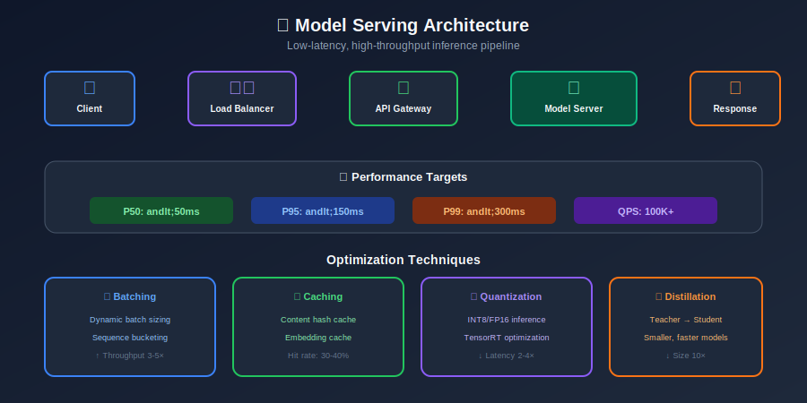

# Model Serving & Inference for Content Moderation

## Table of Contents

- [Serving Architecture](#serving-architecture)

- [Low-Latency Inference](#low-latency-inference)

- [Batch Processing](#batch-processing)

- [Model Versioning](#model-versioning)

- [A/B Testing](#ab-testing)

- [Caching Strategies](#caching-strategies)

- [GPU Optimization](#gpu-optimization)

---

## Serving Architecture

### High-Level Architecture



### FastAPI Serving Implementation

```python
from fastapi import FastAPI, HTTPException, BackgroundTasks
from pydantic import BaseModel
from typing import List, Optional, Dict
import asyncio
import aiohttp
import redis.asyncio as redis

app = FastAPI(title="Content Moderation API")

class ModerationRequest(BaseModel):
    content_id: str
    content_type: str  # text, image, video
    content: str  # text or URL
    user_id: Optional[str] = None
    context: Optional[Dict] = None
    priority: str = "normal"

class ModerationResponse(BaseModel):
    content_id: str
    decision: str  # allow, flag, remove
    scores: Dict[str, float]
    latency_ms: float
    model_version: str

class ModerationService:
    def __init__(self):
        self.redis = redis.Redis(host='redis', port=6379)
        self.inference_url = "http://inference-service:8080"
        self.model_version = "v2.1.0"

    async def moderate(self, request: ModerationRequest) -> ModerationResponse:
        import time
        start = time.time()

        # Check cache first
        cached = await self._check_cache(request)
        if cached:
            cached['latency_ms'] = (time.time() - start) * 1000
            return ModerationResponse(**cached)

        # Get user features
        user_features = await self._get_user_features(request.user_id)

        # Call inference service
        scores = await self._call_inference(request, user_features)

        # Apply policy rules
        decision = self._apply_policy(scores)

        # Cache result
        result = {
            'content_id': request.content_id,
            'decision': decision,
            'scores': scores,
            'latency_ms': (time.time() - start) * 1000,
            'model_version': self.model_version
        }

        await self._cache_result(request, result)

        return ModerationResponse(**result)

    async def _check_cache(self, request: ModerationRequest) -> Optional[Dict]:
        """Check if result is cached."""
        cache_key = f"moderation:{hash(request.content)}"
        cached = await self.redis.get(cache_key)
        if cached:
            return json.loads(cached)
        return None

    async def _call_inference(self, request, user_features) -> Dict:
        """Call inference service."""
        async with aiohttp.ClientSession() as session:
            async with session.post(
                f"{self.inference_url}/predict",
                json={
                    'content': request.content,
                    'content_type': request.content_type,
                    'user_features': user_features
                }
            ) as response:
                return await response.json()

    def _apply_policy(self, scores: Dict) -> str:
        """Apply policy thresholds to determine decision."""
        thresholds = {
            'violence': 0.8,
            'adult': 0.85,
            'hate_speech': 0.75,
            'spam': 0.9
        }

        for category, threshold in thresholds.items():
            if scores.get(category, 0) >= threshold:
                return 'remove'

        for category, threshold in thresholds.items():
            if scores.get(category, 0) >= threshold * 0.7:
                return 'flag'

        return 'allow'

service = ModerationService()

@app.post("/v1/moderate", response_model=ModerationResponse)
async def moderate_content(request: ModerationRequest):
    return await service.moderate(request)

@app.post("/v1/moderate/batch")
async def moderate_batch(requests: List[ModerationRequest]):
    tasks = [service.moderate(req) for req in requests]
    return await asyncio.gather(*tasks)

```

---

## Low-Latency Inference

### TorchServe Configuration

```python
# model_handler.py
import torch
from ts.torch_handler.base_handler import BaseHandler
import json

class ModerationHandler(BaseHandler):
    def __init__(self):
        super().__init__()
        self.initialized = False

    def initialize(self, context):
        """Load model and tokenizer."""
        self.manifest = context.manifest
        properties = context.system_properties
        model_dir = properties.get("model_dir")

        # Load model
        self.model = torch.jit.load(f"{model_dir}/model.pt")
        self.model.eval()

        # Load tokenizer
        from transformers import AutoTokenizer
        self.tokenizer = AutoTokenizer.from_pretrained(model_dir)

        # Move to GPU
        self.device = torch.device(
            "cuda" if torch.cuda.is_available() else "cpu"
        )
        self.model.to(self.device)

        self.initialized = True

    def preprocess(self, requests):
        """Tokenize input texts."""
        texts = [req.get("data") or req.get("body") for req in requests]

        if isinstance(texts[0], bytes):
            texts = [t.decode('utf-8') for t in texts]

        encodings = self.tokenizer(
            texts,
            padding=True,
            truncation=True,
            max_length=256,
            return_tensors="pt"
        )

        return encodings.to(self.device)

    def inference(self, inputs):
        """Run model inference."""
        with torch.no_grad():
            outputs = self.model(
                input_ids=inputs['input_ids'],
                attention_mask=inputs['attention_mask']
            )
        return outputs

    def postprocess(self, outputs):
        """Convert outputs to response format."""
        probs = torch.sigmoid(outputs.logits).cpu().numpy()

        categories = ['violence', 'adult', 'hate_speech', 'spam', 'safe']

        results = []
        for prob in probs:
            scores = {cat: float(p) for cat, p in zip(categories, prob)}
            results.append(scores)

        return results

```

### Dynamic Batching

```python
import asyncio
from collections import deque
import time

class DynamicBatcher:
    """
    Collect requests and batch them for efficient GPU inference.
    """

    def __init__(
        self,
        max_batch_size: int = 32,
        max_wait_ms: float = 10.0,
        inference_fn=None
    ):
        self.max_batch_size = max_batch_size
        self.max_wait_ms = max_wait_ms
        self.inference_fn = inference_fn

        self.queue = deque()
        self.lock = asyncio.Lock()
        self.batch_event = asyncio.Event()

    async def add_request(self, request) -> dict:
        """Add request to batch queue."""
        future = asyncio.Future()

        async with self.lock:
            self.queue.append((request, future, time.time()))

            if len(self.queue) >= self.max_batch_size:
                self.batch_event.set()

        # Start batch processor if not running
        asyncio.create_task(self._process_batch())

        return await future

    async def _process_batch(self):
        """Process accumulated batch."""
        # Wait for batch to fill or timeout
        try:
            await asyncio.wait_for(
                self.batch_event.wait(),
                timeout=self.max_wait_ms / 1000
            )
        except asyncio.TimeoutError:
            pass

        async with self.lock:
            if not self.queue:
                return

            # Collect batch
            batch = []
            futures = []

            while self.queue and len(batch) < self.max_batch_size:
                req, future, timestamp = self.queue.popleft()
                batch.append(req)
                futures.append(future)

            self.batch_event.clear()

        # Run inference
        try:
            results = await self.inference_fn(batch)

            for future, result in zip(futures, results):
                future.set_result(result)
        except Exception as e:
            for future in futures:
                future.set_exception(e)

```

---

## Batch Processing

### Kafka-based Batch Pipeline

```python
from kafka import KafkaConsumer, KafkaProducer
import json
from concurrent.futures import ThreadPoolExecutor

class BatchModerationPipeline:
    """
    Process content in batches from Kafka.
    """

    def __init__(self, config):
        self.consumer = KafkaConsumer(
            config['input_topic'],
            bootstrap_servers=config['kafka_servers'],
            group_id=config['consumer_group'],
            auto_offset_reset='earliest',
            enable_auto_commit=False,
            value_deserializer=lambda x: json.loads(x.decode('utf-8'))
        )

        self.producer = KafkaProducer(
            bootstrap_servers=config['kafka_servers'],
            value_serializer=lambda x: json.dumps(x).encode('utf-8')
        )

        self.output_topic = config['output_topic']
        self.batch_size = config.get('batch_size', 100)
        self.model = self._load_model(config['model_path'])

    def run(self):
        """Main processing loop."""
        batch = []

        for message in self.consumer:
            batch.append(message.value)

            if len(batch) >= self.batch_size:
                self._process_batch(batch)
                batch = []
                self.consumer.commit()

        # Process remaining
        if batch:
            self._process_batch(batch)
            self.consumer.commit()

    def _process_batch(self, batch):
        """Process a batch of content."""
        # Extract texts/images
        contents = [item['content'] for item in batch]

        # Batch inference
        results = self.model.predict_batch(contents)

        # Send results
        for item, result in zip(batch, results):
            output = {
                'content_id': item['content_id'],
                'scores': result,
                'decision': self._decide(result),
                'processed_at': datetime.utcnow().isoformat()
            }

            self.producer.send(self.output_topic, value=output)

        self.producer.flush()

    def _decide(self, scores):
        """Make moderation decision from scores."""
        if max(scores.values()) > 0.8:
            return 'remove'
        elif max(scores.values()) > 0.5:
            return 'review'
        return 'allow'

```

---

## Model Versioning

### Model Registry with MLflow

```python
import mlflow
from mlflow.tracking import MlflowClient
from typing import Optional

class ModelRegistry:
    """
    Manage model versions and deployments.
    """

    def __init__(self, tracking_uri: str):
        mlflow.set_tracking_uri(tracking_uri)
        self.client = MlflowClient()

    def register_model(
        self,
        model_path: str,
        model_name: str,
        metrics: dict,
        tags: dict = None
    ) -> str:
        """Register a new model version."""
        with mlflow.start_run():
            # Log metrics
            mlflow.log_metrics(metrics)

            # Log model
            mlflow.pytorch.log_model(
                pytorch_model=model_path,
                artifact_path="model",
                registered_model_name=model_name
            )

            # Add tags
            if tags:
                for key, value in tags.items():
                    mlflow.set_tag(key, value)

            run_id = mlflow.active_run().info.run_id

        # Get version number
        versions = self.client.get_latest_versions(model_name)
        latest_version = max([v.version for v in versions])

        return f"{model_name}:{latest_version}"

    def promote_to_production(self, model_name: str, version: str):
        """Promote model version to production."""
        self.client.transition_model_version_stage(
            name=model_name,
            version=version,
            stage="Production"
        )

    def get_production_model(self, model_name: str):
        """Load the current production model."""
        return mlflow.pytorch.load_model(
            f"models:/{model_name}/Production"
        )

    def rollback(self, model_name: str, to_version: str):
        """Rollback to a previous version."""
        # Archive current production
        current = self.client.get_latest_versions(model_name, stages=["Production"])
        if current:
            self.client.transition_model_version_stage(
                name=model_name,
                version=current[0].version,
                stage="Archived"
            )

        # Promote specified version
        self.promote_to_production(model_name, to_version)

```

---

## A/B Testing

### Traffic Splitting for Model Experiments

```python
import hashlib
from dataclasses import dataclass
from typing import Dict, Callable

@dataclass
class ModelVariant:
    name: str
    model: Callable
    weight: float  # Traffic percentage (0-1)

class ABTestingRouter:
    """
    Route requests to different model variants for A/B testing.
    """

    def __init__(self, variants: list[ModelVariant]):
        self.variants = variants
        self._validate_weights()

    def _validate_weights(self):
        total = sum(v.weight for v in self.variants)
        assert abs(total - 1.0) < 0.01, f"Weights must sum to 1, got {total}"

    def route(self, content_id: str) -> ModelVariant:
        """Deterministically route content to a variant."""
        # Hash content_id for consistent routing
        hash_val = int(hashlib.md5(content_id.encode()).hexdigest(), 16)
        bucket = (hash_val % 1000) / 1000  # 0-1

        cumulative = 0
        for variant in self.variants:
            cumulative += variant.weight
            if bucket < cumulative:
                return variant

        return self.variants[-1]  # Fallback

    def predict(self, content_id: str, content: str) -> Dict:
        """Route to variant and get prediction."""
        variant = self.route(content_id)
        result = variant.model(content)

        return {
            'scores': result,
            'variant': variant.name
        }

class ABTestAnalyzer:
    """
    Analyze A/B test results.
    """

    def __init__(self, results_db):
        self.db = results_db

    def compute_metrics(self, experiment_id: str) -> Dict:
        """Compute metrics for each variant."""
        results = self.db.get_results(experiment_id)

        metrics = {}
        for variant in set(r['variant'] for r in results):
            variant_results = [r for r in results if r['variant'] == variant]

            # Compute precision, recall, etc.
            true_positives = sum(1 for r in variant_results
                               if r['prediction'] == r['ground_truth'] == 'violation')
            false_positives = sum(1 for r in variant_results
                                if r['prediction'] == 'violation' and r['ground_truth'] == 'safe')

            precision = true_positives / max(true_positives + false_positives, 1)

            metrics[variant] = {
                'precision': precision,
                'sample_size': len(variant_results),
                'avg_latency_ms': np.mean([r['latency_ms'] for r in variant_results])
            }

        return metrics

    def is_significant(self, experiment_id: str, confidence: float = 0.95):
        """Check if difference is statistically significant."""
        from scipy import stats

        results = self.db.get_results(experiment_id)
        variants = list(set(r['variant'] for r in results))

        if len(variants) != 2:
            raise ValueError("Need exactly 2 variants for significance test")

        group_a = [r['score'] for r in results if r['variant'] == variants[0]]
        group_b = [r['score'] for r in results if r['variant'] == variants[1]]

        t_stat, p_value = stats.ttest_ind(group_a, group_b)

        return p_value < (1 - confidence)

```

---

## Caching Strategies

### Multi-Level Caching

```python
import redis
import hashlib
from functools import lru_cache

class ModerationCache:
    """
    Multi-level caching for moderation results.
    """

    def __init__(self, redis_client: redis.Redis):
        self.redis = redis_client
        self.local_cache = {}
        self.local_cache_size = 10000

    def get(self, content: str) -> Optional[Dict]:
        """Get cached result (local -> Redis)."""
        cache_key = self._hash_content(content)

        # Check local cache first
        if cache_key in self.local_cache:
            return self.local_cache[cache_key]

        # Check Redis
        redis_result = self.redis.get(f"mod:{cache_key}")
        if redis_result:
            result = json.loads(redis_result)
            self._add_to_local(cache_key, result)
            return result

        return None

    def set(self, content: str, result: Dict, ttl: int = 3600):
        """Cache result in both levels."""
        cache_key = self._hash_content(content)

        # Local cache
        self._add_to_local(cache_key, result)

        # Redis with TTL
        self.redis.setex(
            f"mod:{cache_key}",
            ttl,
            json.dumps(result)
        )

    def _hash_content(self, content: str) -> str:
        """Create hash of content for cache key."""
        return hashlib.sha256(content.encode()).hexdigest()[:16]

    def _add_to_local(self, key: str, value: Dict):
        """Add to local cache with LRU eviction."""
        if len(self.local_cache) >= self.local_cache_size:
            # Remove oldest entry
            oldest = next(iter(self.local_cache))
            del self.local_cache[oldest]

        self.local_cache[key] = value

```

### Semantic Caching

```python
import numpy as np
from sklearn.neighbors import NearestNeighbors

class SemanticCache:
    """
    Cache based on semantic similarity (for similar inputs).
    """

    def __init__(self, embedding_model, similarity_threshold: float = 0.95):
        self.embedding_model = embedding_model
        self.threshold = similarity_threshold

        self.embeddings = []
        self.results = []
        self.nn_index = None

    def get(self, content: str) -> Optional[Dict]:
        """Find similar cached content."""
        if not self.embeddings:
            return None

        # Embed query
        query_embedding = self.embedding_model.encode([content])[0]

        # Find nearest neighbor
        if self.nn_index is None:
            self._build_index()

        distances, indices = self.nn_index.kneighbors([query_embedding], n_neighbors=1)

        if distances[0][0] < (1 - self.threshold):
            return self.results[indices[0][0]]

        return None

    def set(self, content: str, result: Dict):
        """Add to semantic cache."""
        embedding = self.embedding_model.encode([content])[0]

        self.embeddings.append(embedding)
        self.results.append(result)

        # Rebuild index periodically
        if len(self.embeddings) % 100 == 0:
            self._build_index()

    def _build_index(self):
        """Build nearest neighbor index."""
        if self.embeddings:
            self.nn_index = NearestNeighbors(
                n_neighbors=1,
                metric='cosine'
            ).fit(self.embeddings)

```

---

## GPU Optimization

### ONNX Runtime Optimization

```python
import onnxruntime as ort
import numpy as np

class OptimizedInference:
    """
    ONNX Runtime optimized inference.
    """

    def __init__(self, model_path: str):
        # Session options for optimization
        sess_options = ort.SessionOptions()
        sess_options.graph_optimization_level = ort.GraphOptimizationLevel.ORT_ENABLE_ALL
        sess_options.intra_op_num_threads = 4

        # CUDA execution provider
        providers = [
            ('CUDAExecutionProvider', {
                'device_id': 0,
                'arena_extend_strategy': 'kNextPowerOfTwo',
                'cuda_mem_limit': 4 * 1024 * 1024 * 1024,  # 4GB
            }),
            'CPUExecutionProvider'
        ]

        self.session = ort.InferenceSession(
            model_path,
            sess_options=sess_options,
            providers=providers
        )

        self.input_name = self.session.get_inputs()[0].name
        self.output_name = self.session.get_outputs()[0].name

    def predict(self, input_ids: np.ndarray, attention_mask: np.ndarray) -> np.ndarray:
        """Run optimized inference."""
        outputs = self.session.run(
            [self.output_name],
            {
                'input_ids': input_ids.astype(np.int64),
                'attention_mask': attention_mask.astype(np.int64)
            }
        )
        return outputs[0]

    def benchmark(self, input_ids, attention_mask, n_runs: int = 100):
        """Benchmark inference latency."""
        import time

        # Warmup
        for _ in range(10):
            self.predict(input_ids, attention_mask)

        # Benchmark
        latencies = []
        for _ in range(n_runs):
            start = time.time()
            self.predict(input_ids, attention_mask)
            latencies.append((time.time() - start) * 1000)

        return {
            'mean_ms': np.mean(latencies),
            'p50_ms': np.percentile(latencies, 50),
            'p99_ms': np.percentile(latencies, 99)
        }

```

---

## Summary

Effective model serving for content moderation requires:

1. **Low Latency**: Dynamic batching, GPU optimization, caching

2. **High Throughput**: Horizontal scaling, batch processing

3. **Reliability**: Health checks, circuit breakers, fallbacks

4. **Model Management**: Versioning, A/B testing, rollback

5. **Cost Efficiency**: Caching, quantization, right-sizing

---

*Previous: [Feature Engineering](../07_feature_engineering/README.md)*
*Next: [Evaluation Metrics](../09_evaluation_metrics/README.md)*

---

<div align="center">

**[⬆ Back to Top](#)** | **[📚 Main Repository](https://github.com/Gaurav14cs17/ml_system_design)**

Made with 💜 by [Gaurav14cs17](https://github.com/Gaurav14cs17)

</div>
