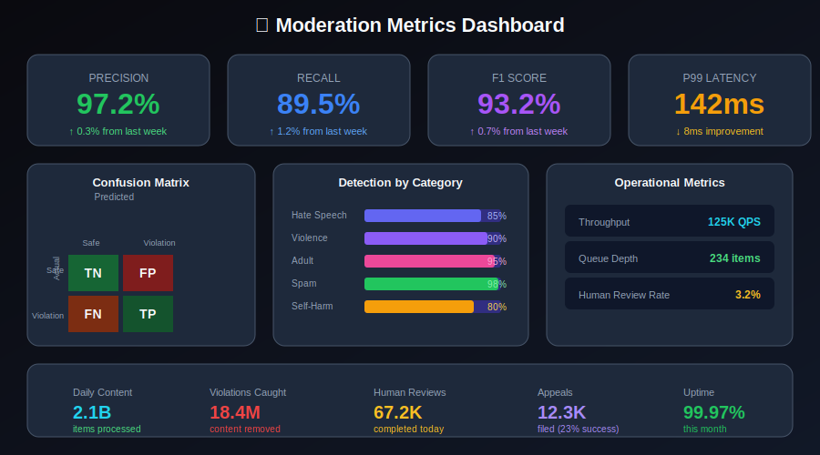
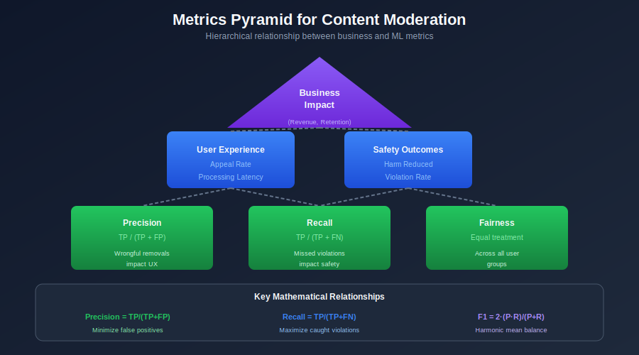

# Evaluation Metrics for Content Moderation



## Table of Contents
- [Key Metrics Overview](#key-metrics-overview)
- [Classification Metrics](#classification-metrics)
- [Ranking Metrics](#ranking-metrics)
- [Operational Metrics](#operational-metrics)
- [Fairness Metrics](#fairness-metrics)
- [Human Review Metrics](#human-review-metrics)
- [Business Impact Metrics](#business-impact-metrics)

---

## Key Metrics Overview

### The Moderation Metrics Pyramid



### Trade-offs in Content Moderation

| Metric | Optimizing For | Risk |
|--------|---------------|------|
| **High Precision** | Fewer wrongful removals | Miss more violations |
| **High Recall** | Catch more violations | More false positives |
| **Low Latency** | Better UX | May sacrifice accuracy |
| **Consistency** | Fairness | May miss edge cases |

---

## Mathematical Foundations

### The Confusion Matrix

For binary content moderation (violation vs. safe), the confusion matrix forms the basis of all metrics:

|  | Predicted Safe | Predicted Violation |
|---|---|---|
| **Actually Safe** | True Negative (TN) | False Positive (FP) |
| **Actually Violation** | False Negative (FN) | True Positive (TP) |

### Core Metric Definitions

**Precision (Positive Predictive Value)**

The probability that a flagged item is actually a violation:

```math
\text{Precision} = \frac{TP}{TP + FP}
```

- **High precision** → Few wrongful content removals
- **Content moderation target**: > 95% to minimize user frustration

**Recall (Sensitivity / True Positive Rate)**

The probability of catching an actual violation:

```math
\text{Recall} = \frac{TP}{TP + FN}
```

- **High recall** → Catch most harmful content
- **Content moderation target**: > 90% for safety-critical categories

**F1 Score (Harmonic Mean)**

Balances precision and recall into a single metric:

```math
F_1 = 2 \cdot \frac{\text{Precision} \cdot \text{Recall}}{\text{Precision} + \text{Recall}} = \frac{2 \cdot TP}{2 \cdot TP + FP + FN}
```

**F-beta Score (Weighted Harmonic Mean)**

Allows weighting recall vs. precision:

```math
F_\beta = (1 + \beta^2) \cdot \frac{\text{Precision} \cdot \text{Recall}}{(\beta^2 \cdot \text{Precision}) + \text{Recall}}
```

- β > 1: Emphasize recall (prefer catching violations)
- β < 1: Emphasize precision (prefer avoiding false positives)
- β = 2 is common for content moderation: catching harm is more important

### Error Rates

**False Positive Rate (Type I Error)**

```math
\text{FPR} = \frac{FP}{FP + TN} = 1 - \text{Specificity}
```

**False Negative Rate (Type II Error)**

```math
\text{FNR} = \frac{FN}{FN + TP} = 1 - \text{Recall}
```

### ROC and AUC

The **Receiver Operating Characteristic (ROC) curve** plots TPR vs. FPR at various thresholds:

```math
\text{AUC-ROC} = \int_0^1 TPR(FPR^{-1}(x)) \, dx
```

- AUC = 0.5 → Random classifier
- AUC = 1.0 → Perfect classifier
- AUC > 0.9 → Excellent discrimination

### Precision-Recall AUC

For imbalanced datasets (common in moderation where violations are rare):

```math
\text{AUC-PR} = \int_0^1 P(R^{-1}(x)) \, dx
```

More informative than ROC-AUC when negative class dominates.

### Multi-Class Averaging Strategies

For multiple violation categories:

**Macro-Average**: Unweighted mean across classes

```math
\text{Precision}_{\text{macro}} = \frac{1}{K} \sum_{k=1}^{K} \text{Precision}_k
```

**Micro-Average**: Global TP, FP, FN counts

```math
\text{Precision}_{\text{micro}} = \frac{\sum_{k=1}^{K} TP_k}{\sum_{k=1}^{K} (TP_k + FP_k)}
```

**Weighted-Average**: Weighted by class support

```math
\text{Precision}_{\text{weighted}} = \frac{\sum_{k=1}^{K} n_k \cdot \text{Precision}_k}{\sum_{k=1}^{K} n_k}
```

---

## Classification Metrics

### Core Metrics Implementation

```python
import numpy as np
from sklearn.metrics import (
    precision_score, recall_score, f1_score,
    precision_recall_curve, roc_curve, auc,
    confusion_matrix, classification_report
)
from typing import Dict, List, Tuple

class ModerationMetrics:
    """
    Comprehensive metrics for content moderation evaluation.
    """

    def __init__(self, y_true: np.ndarray, y_pred: np.ndarray, y_proba: np.ndarray = None):
        self.y_true = y_true
        self.y_pred = y_pred
        self.y_proba = y_proba

    def compute_all(self) -> Dict:
        """Compute all standard metrics."""
        metrics = {}

        # Basic metrics
        metrics['precision'] = precision_score(self.y_true, self.y_pred, average='macro')
        metrics['recall'] = recall_score(self.y_true, self.y_pred, average='macro')
        metrics['f1'] = f1_score(self.y_true, self.y_pred, average='macro')

        # Confusion matrix
        cm = confusion_matrix(self.y_true, self.y_pred)
        metrics['confusion_matrix'] = cm.tolist()

        # Per-class metrics
        metrics['per_class'] = self._per_class_metrics()

        # If probabilities available
        if self.y_proba is not None:
            metrics['auc_roc'] = self._compute_auc()
            metrics['auc_pr'] = self._compute_auc_pr()

        # Moderation-specific
        metrics['false_positive_rate'] = self._false_positive_rate()
        metrics['false_negative_rate'] = self._false_negative_rate()

        return metrics

    def _per_class_metrics(self) -> Dict:
        """Compute metrics for each class."""
        report = classification_report(
            self.y_true, self.y_pred,
            output_dict=True
        )
        return report

    def _false_positive_rate(self) -> float:
        """
        FPR = FP / (FP + TN)
        Critical for wrongful removals.
        """
        cm = confusion_matrix(self.y_true, self.y_pred)
        fp = cm.sum(axis=0) - np.diag(cm)
        tn = cm.sum() - (cm.sum(axis=0) + cm.sum(axis=1) - np.diag(cm))
        return np.mean(fp / (fp + tn + 1e-10))

    def _false_negative_rate(self) -> float:
        """
        FNR = FN / (FN + TP)
        Critical for missed violations.
        """
        cm = confusion_matrix(self.y_true, self.y_pred)
        fn = cm.sum(axis=1) - np.diag(cm)
        tp = np.diag(cm)
        return np.mean(fn / (fn + tp + 1e-10))

    def _compute_auc(self) -> float:
        """Compute ROC AUC."""
        if self.y_proba is None:
            return None

        from sklearn.preprocessing import label_binarize

        classes = np.unique(self.y_true)
        y_true_bin = label_binarize(self.y_true, classes=classes)

        aucs = []
        for i in range(len(classes)):
            fpr, tpr, _ = roc_curve(y_true_bin[:, i], self.y_proba[:, i])
            aucs.append(auc(fpr, tpr))

        return np.mean(aucs)

    def _compute_auc_pr(self) -> float:
        """Compute Precision-Recall AUC."""
        if self.y_proba is None:
            return None

        from sklearn.preprocessing import label_binarize

        classes = np.unique(self.y_true)
        y_true_bin = label_binarize(self.y_true, classes=classes)

        aucs = []
        for i in range(len(classes)):
            precision, recall, _ = precision_recall_curve(
                y_true_bin[:, i], self.y_proba[:, i]
            )
            aucs.append(auc(recall, precision))

        return np.mean(aucs)
```

### Threshold Analysis

```python
class ThresholdAnalyzer:
    """
    Analyze performance at different decision thresholds.
    """

    def __init__(self, y_true: np.ndarray, y_proba: np.ndarray):
        self.y_true = y_true
        self.y_proba = y_proba

    def find_optimal_threshold(
        self,
        metric: str = 'f1',
        constraint: Dict = None
    ) -> Tuple[float, Dict]:
        """
        Find optimal threshold for given metric.

        Args:
            metric: Metric to optimize ('f1', 'precision', 'recall')
            constraint: e.g., {'precision': 0.95} - must maintain this
        """
        thresholds = np.arange(0.1, 1.0, 0.01)
        best_threshold = 0.5
        best_score = 0

        for threshold in thresholds:
            y_pred = (self.y_proba >= threshold).astype(int)

            # Check constraint
            if constraint:
                for metric_name, min_value in constraint.items():
                    if metric_name == 'precision':
                        if precision_score(self.y_true, y_pred) < min_value:
                            continue
                    elif metric_name == 'recall':
                        if recall_score(self.y_true, y_pred) < min_value:
                            continue

            # Compute target metric
            if metric == 'f1':
                score = f1_score(self.y_true, y_pred)
            elif metric == 'precision':
                score = precision_score(self.y_true, y_pred)
            elif metric == 'recall':
                score = recall_score(self.y_true, y_pred)

            if score > best_score:
                best_score = score
                best_threshold = threshold

        # Compute all metrics at best threshold
        y_pred = (self.y_proba >= best_threshold).astype(int)
        metrics = {
            'threshold': best_threshold,
            'precision': precision_score(self.y_true, y_pred),
            'recall': recall_score(self.y_true, y_pred),
            'f1': f1_score(self.y_true, y_pred)
        }

        return best_threshold, metrics

    def threshold_curve(self) -> Dict:
        """Generate precision/recall at all thresholds."""
        precision, recall, thresholds = precision_recall_curve(
            self.y_true, self.y_proba
        )

        return {
            'precision': precision.tolist(),
            'recall': recall.tolist(),
            'thresholds': thresholds.tolist()
        }
```

---

## Ranking Metrics

### Prioritization Metrics

```python
class RankingMetrics:
    """
    Metrics for content ranking/prioritization.
    Used when human reviewers can only handle a fraction of flagged content.
    """

    @staticmethod
    def precision_at_k(y_true: np.ndarray, y_scores: np.ndarray, k: int) -> float:
        """
        Precision among top-k ranked items.
        Critical for human review queue prioritization.
        """

        # Get indices of top k scores
        top_k_indices = np.argsort(y_scores)[-k:]

        # Precision = positives in top k / k
        return np.sum(y_true[top_k_indices]) / k

    @staticmethod
    def recall_at_k(y_true: np.ndarray, y_scores: np.ndarray, k: int) -> float:
        """
        Recall among top-k ranked items.
        What fraction of violations are in top k?
        """
        top_k_indices = np.argsort(y_scores)[-k:]
        total_positives = np.sum(y_true)

        return np.sum(y_true[top_k_indices]) / total_positives

    @staticmethod
    def ndcg_at_k(y_true: np.ndarray, y_scores: np.ndarray, k: int) -> float:
        """
        Normalized Discounted Cumulative Gain.
        Accounts for ranking position of violations.
        """

        # Get ranking
        ranking = np.argsort(y_scores)[::-1][:k]

        # DCG
        dcg = 0
        for i, idx in enumerate(ranking):
            dcg += y_true[idx] / np.log2(i + 2)

        # Ideal DCG (all positives first)
        ideal_ranking = np.argsort(y_true)[::-1][:k]
        idcg = 0
        for i, idx in enumerate(ideal_ranking):
            idcg += y_true[idx] / np.log2(i + 2)

        return dcg / idcg if idcg > 0 else 0

    @staticmethod
    def average_precision(y_true: np.ndarray, y_scores: np.ndarray) -> float:
        """
        Average Precision across all thresholds.
        """
        from sklearn.metrics import average_precision_score
        return average_precision_score(y_true, y_scores)
```

---

## Operational Metrics

### System Performance Metrics

```python
from dataclasses import dataclass
from datetime import datetime, timedelta
import numpy as np

@dataclass
class OperationalMetrics:
    """Metrics for system health and performance."""

    # Latency
    p50_latency_ms: float
    p95_latency_ms: float
    p99_latency_ms: float

    # Throughput
    requests_per_second: float

    # Availability
    uptime_percentage: float
    error_rate: float

    # Capacity
    queue_depth: int
    processing_backlog_minutes: float

class OperationalMetricsCollector:
    def __init__(self, prometheus_client):
        self.prometheus = prometheus_client

    def collect(self, time_range: timedelta = timedelta(hours=1)) -> OperationalMetrics:
        """Collect operational metrics from monitoring."""
        end_time = datetime.utcnow()
        start_time = end_time - time_range

        # Query latency metrics
        latency_query = 'histogram_quantile(0.5, rate(moderation_latency_bucket[1h]))'
        p50 = self.prometheus.query(latency_query)

        p95_query = 'histogram_quantile(0.95, rate(moderation_latency_bucket[1h]))'
        p95 = self.prometheus.query(p95_query)

        p99_query = 'histogram_quantile(0.99, rate(moderation_latency_bucket[1h]))'
        p99 = self.prometheus.query(p99_query)

        # Throughput
        throughput_query = 'rate(moderation_requests_total[1h])'
        throughput = self.prometheus.query(throughput_query)

        # Error rate
        error_query = 'rate(moderation_errors_total[1h]) / rate(moderation_requests_total[1h])'
        error_rate = self.prometheus.query(error_query)

        return OperationalMetrics(
            p50_latency_ms=p50 * 1000,
            p95_latency_ms=p95 * 1000,
            p99_latency_ms=p99 * 1000,
            requests_per_second=throughput,
            uptime_percentage=100 * (1 - error_rate),
            error_rate=error_rate,
            queue_depth=self._get_queue_depth(),
            processing_backlog_minutes=self._get_backlog()
        )
```

### SLA Monitoring

```python
class SLAMonitor:
    """
    Monitor Service Level Agreements.
    """

    SLA_TARGETS = {
        'latency_p99_ms': 500,
        'availability': 99.9,
        'error_rate': 0.1,
        'processing_time_critical_minutes': 5,
        'processing_time_normal_minutes': 60,
    }

    def check_sla_compliance(self, metrics: OperationalMetrics) -> Dict:
        """Check if current metrics meet SLA."""
        results = {}

        # Latency SLA
        results['latency_compliant'] = (
            metrics.p99_latency_ms <= self.SLA_TARGETS['latency_p99_ms']
        )

        # Availability SLA
        results['availability_compliant'] = (
            metrics.uptime_percentage >= self.SLA_TARGETS['availability']
        )

        # Error rate SLA
        results['error_rate_compliant'] = (
            metrics.error_rate * 100 <= self.SLA_TARGETS['error_rate']
        )

        results['overall_compliant'] = all(results.values())

        return results

    def calculate_sla_credits(self, metrics: OperationalMetrics) -> float:
        """Calculate SLA credit if targets missed."""
        if metrics.uptime_percentage >= 99.9:
            return 0
        elif metrics.uptime_percentage >= 99.0:
            return 10  # 10% credit
        elif metrics.uptime_percentage >= 95.0:
            return 25  # 25% credit
        else:
            return 50  # 50% credit
```

---

## Fairness Metrics

### Mathematical Framework for Fairness

Fairness in content moderation ensures equal treatment across protected groups. Let $A$ be a sensitive attribute (e.g., language, region, user demographics).

**Demographic Parity (Statistical Parity)**

Predictions should be independent of the sensitive attribute:

```math
P(\hat{Y} = 1 | A = a) = P(\hat{Y} = 1 | A = b) \quad \forall a, b
```

**Equalized Odds**

True positive and false positive rates should be equal across groups:

```math
P(\hat{Y} = 1 | Y = y, A = a) = P(\hat{Y} = 1 | Y = y, A = b) \quad \forall y \in \{0, 1\}
```

**Equal Opportunity**

A relaxation focusing only on true positive rates:

```math
P(\hat{Y} = 1 | Y = 1, A = a) = P(\hat{Y} = 1 | Y = 1, A = b)
```

**Disparate Impact Ratio**

The "80% rule" from employment law:

```math
\text{DI} = \frac{P(\hat{Y} = 1 | A = \text{minority})}{P(\hat{Y} = 1 | A = \text{majority})} \geq 0.8
```

**False Positive Rate Parity**

Critical for content moderation—ensures equal wrongful removal rates:

```math
P(\hat{Y} = 1 | Y = 0, A = a) = P(\hat{Y} = 1 | Y = 0, A = b)
```

**Calibration**

Predicted probabilities should reflect true probabilities across groups:

```math
P(Y = 1 | \hat{P} = p, A = a) = P(Y = 1 | \hat{P} = p, A = b) = p
```

### Impossibility Theorem

It's mathematically impossible to satisfy all fairness criteria simultaneously (except in trivial cases). Content moderation must explicitly choose which constraints to prioritize:

| Criterion | Pro | Con |
|-----------|-----|-----|
| Demographic Parity | Equal flagging rates | May miss more violations in some groups |
| Equalized Odds | Equal error rates | Requires group labels at inference |
| Calibration | Trust in scores | May have disparate impact |

### Bias Detection

```python
class FairnessMetrics:
    """
    Measure fairness across different user groups.
    """

    def __init__(self, y_true, y_pred, sensitive_attribute):
        self.y_true = np.array(y_true)
        self.y_pred = np.array(y_pred)
        self.sensitive_attr = np.array(sensitive_attribute)
        self.groups = np.unique(sensitive_attribute)

    def demographic_parity(self) -> Dict:
        """
        Check if positive prediction rate is equal across groups.
        Measures: P(Ŷ=1 | A=a) for each group a
        """
        rates = {}
        for group in self.groups:
            mask = self.sensitive_attr == group
            rates[group] = np.mean(self.y_pred[mask])

        # Disparity ratio
        min_rate = min(rates.values())
        max_rate = max(rates.values())
        disparity = min_rate / max_rate if max_rate > 0 else 0

        return {
            'rates_by_group': rates,
            'disparity_ratio': disparity,
            'is_fair': disparity > 0.8  # 80% rule
        }

    def equalized_odds(self) -> Dict:
        """
        Check if TPR and FPR are equal across groups.
        """
        metrics = {}

        for group in self.groups:
            mask = self.sensitive_attr == group
            y_true_g = self.y_true[mask]
            y_pred_g = self.y_pred[mask]

            # TPR (recall for positive class)
            positives = y_true_g == 1
            if positives.sum() > 0:
                tpr = np.mean(y_pred_g[positives] == 1)
            else:
                tpr = 0

            # FPR
            negatives = y_true_g == 0
            if negatives.sum() > 0:
                fpr = np.mean(y_pred_g[negatives] == 1)
            else:
                fpr = 0

            metrics[group] = {'tpr': tpr, 'fpr': fpr}

        # Calculate disparity
        tprs = [m['tpr'] for m in metrics.values()]
        fprs = [m['fpr'] for m in metrics.values()]

        tpr_disparity = min(tprs) / max(tprs) if max(tprs) > 0 else 0
        fpr_disparity = min(fprs) / max(fprs) if max(fprs) > 0 else 0

        return {
            'by_group': metrics,
            'tpr_disparity': tpr_disparity,
            'fpr_disparity': fpr_disparity,
            'is_fair': tpr_disparity > 0.8 and fpr_disparity > 0.8
        }

    def false_positive_rate_parity(self) -> Dict:
        """
        Critical for content moderation: ensure false positives
        (wrongful removals) are equal across groups.
        """
        fpr_by_group = {}

        for group in self.groups:
            mask = self.sensitive_attr == group
            y_true_g = self.y_true[mask]
            y_pred_g = self.y_pred[mask]

            negatives = y_true_g == 0
            if negatives.sum() > 0:
                fpr = np.mean(y_pred_g[negatives] == 1)
            else:
                fpr = 0

            fpr_by_group[group] = fpr

        max_fpr = max(fpr_by_group.values())
        min_fpr = min(fpr_by_group.values())

        return {
            'fpr_by_group': fpr_by_group,
            'max_difference': max_fpr - min_fpr,
            'is_fair': (max_fpr - min_fpr) < 0.05  # 5% difference threshold
        }
```

---

## Human Review Metrics

### Review Queue Metrics

```python
class HumanReviewMetrics:
    """
    Metrics for human review process.
    """

    def __init__(self, review_db):
        self.db = review_db

    def compute_queue_metrics(self, time_range: timedelta) -> Dict:
        """Compute metrics for review queue."""
        reviews = self.db.get_reviews(time_range)

        return {

            # Volume
            'total_reviews': len(reviews),
            'reviews_per_hour': len(reviews) / (time_range.total_seconds() / 3600),

            # Timing
            'avg_wait_time_minutes': np.mean([r.wait_time for r in reviews]),
            'avg_review_time_seconds': np.mean([r.review_duration for r in reviews]),
            'sla_compliance_rate': np.mean([r.wait_time < 60 for r in reviews]),

            # Quality
            'overturn_rate': np.mean([r.was_overturned for r in reviews]),
            'escalation_rate': np.mean([r.was_escalated for r in reviews]),
        }

    def compute_agreement_metrics(self, reviews) -> Dict:
        """Compute inter-annotator agreement."""

        # Filter to reviews with multiple annotators
        multi_reviewed = [r for r in reviews if len(r.decisions) > 1]

        if not multi_reviewed:
            return {'agreement_rate': None}

        agreements = []
        for r in multi_reviewed:
            decisions = [d.decision for d in r.decisions]
            agreement = len(set(decisions)) == 1
            agreements.append(agreement)

        return {
            'agreement_rate': np.mean(agreements),
            'multi_reviewed_count': len(multi_reviewed)
        }

    def ml_human_alignment(self) -> Dict:
        """How often do human reviewers agree with ML decisions?"""
        reviews = self.db.get_reviews_with_ml_predictions()

        alignments = []
        for r in reviews:
            ml_decision = r.ml_prediction
            human_decision = r.final_decision
            alignments.append(ml_decision == human_decision)

        return {
            'alignment_rate': np.mean(alignments),
            'ml_correct_rate': np.mean([
                r.ml_prediction == r.ground_truth
                for r in reviews if r.ground_truth
            ])
        }
```

---

## Business Impact Metrics

### Impact Measurement

```python
class BusinessImpactMetrics:
    """
    Measure business impact of content moderation.
    """

    def __init__(self, analytics_db, moderation_db):
        self.analytics = analytics_db
        self.moderation = moderation_db

    def compute_safety_impact(self, time_range: timedelta) -> Dict:
        """Measure impact on platform safety."""
        return {

            # Violations caught
            'violations_removed': self.moderation.count_removals(time_range),
            'violations_per_1m_views': self._violations_per_views(time_range),

            # User reports
            'user_reports': self.moderation.count_reports(time_range),
            'report_rate_change': self._report_rate_change(time_range),

            # Severe violations
            'csam_blocked': self.moderation.count_by_type('csam', time_range),
            'terrorism_blocked': self.moderation.count_by_type('terrorism', time_range),
        }

    def compute_user_experience_impact(self, time_range: timedelta) -> Dict:
        """Measure impact on user experience."""
        return {

            # False positives impact
            'appeals_filed': self.moderation.count_appeals(time_range),
            'appeals_upheld': self.moderation.count_upheld_appeals(time_range),
            'appeal_success_rate': self._appeal_success_rate(time_range),

            # Latency impact
            'avg_post_delay_ms': self._avg_moderation_delay(time_range),

            # User sentiment
            'creator_satisfaction_score': self._creator_satisfaction(time_range),
        }

    def compute_business_metrics(self, time_range: timedelta) -> Dict:
        """Measure business outcomes."""
        return {

            # Engagement
            'dau_trend': self._dau_trend(time_range),
            'time_spent_trend': self._time_spent_trend(time_range),

            # Monetization
            'ad_revenue_trend': self._ad_revenue_trend(time_range),
            'brand_safety_incidents': self._brand_safety_incidents(time_range),

            # Regulatory
            'regulatory_complaints': self._regulatory_complaints(time_range),
            'compliance_score': self._compliance_score(time_range),
        }

    def _violations_per_views(self, time_range):
        """Violations per million content views."""
        violations = self.moderation.count_removals(time_range)
        views = self.analytics.total_views(time_range)
        return (violations / views) * 1_000_000
```

---

## Summary

Comprehensive evaluation for content moderation requires:

1. **Classification Metrics**: Precision, recall, F1, ROC-AUC
2. **Threshold Analysis**: Optimize for specific constraints
3. **Ranking Metrics**: P@k for human review prioritization
4. **Operational Metrics**: Latency, throughput, availability
5. **Fairness Metrics**: Equal treatment across groups
6. **Human Review Metrics**: Agreement, alignment, queue health
7. **Business Metrics**: Safety, UX, and business impact

The key trade-off: maximizing recall (catching violations) while maintaining high precision (avoiding wrongful removals).

---

*Previous: [Model Serving & Inference](../08_model_serving_inference/README.md)*
*Next: [Human-in-the-Loop](../10_human_in_the_loop/README.md)*

---

<div align="center">

**[⬆ Back to Top](#)** | **[📚 Main Repository](https://github.com/Gaurav14cs17/ml_system_design)**

Made with 💜 by [Gaurav14cs17](https://github.com/Gaurav14cs17)

</div>
