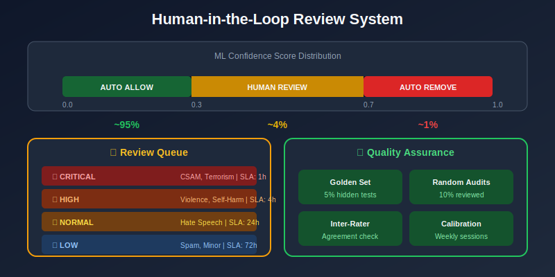
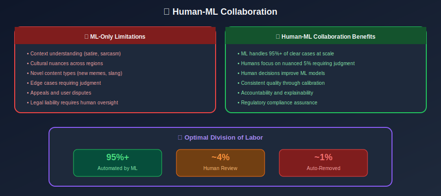
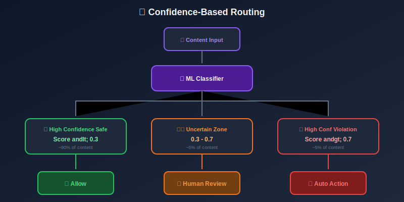

# Human-in-the-Loop for Content Moderation



## Table of Contents

- [Overview](#overview)

- [Review Queue Design](#review-queue-design)

- [Reviewer Interface](#reviewer-interface)

- [Quality Assurance](#quality-assurance)

- [Feedback Loops](#feedback-loops)

- [Moderator Well-being](#moderator-well-being)

---

## Overview

### Why Human-in-the-Loop?



### Routing Architecture



---

## Review Queue Design

### Priority Queue System

```python
from dataclasses import dataclass
from enum import Enum
from typing import Optional
import heapq
from datetime import datetime

class Priority(Enum):
    CRITICAL = 1    # CSAM, terrorism - immediate
    HIGH = 2        # Violence, self-harm - within 1 hour
    NORMAL = 3      # Hate speech, harassment - within 24 hours
    LOW = 4         # Spam, minor violations - within 72 hours

@dataclass
class ReviewTask:
    task_id: str
    content_id: str
    content_type: str
    content_data: dict
    ml_scores: dict
    priority: Priority
    created_at: datetime
    sla_deadline: datetime
    assigned_to: Optional[str] = None

    def __lt__(self, other):
        # Higher priority (lower number) comes first
        if self.priority.value != other.priority.value:
            return self.priority.value < other.priority.value
        # Within same priority, older tasks first
        return self.created_at < other.created_at

class ReviewQueue:
    def __init__(self, redis_client):
        self.redis = redis_client
        self.queue = []
        heapq.heapify(self.queue)

    def add_task(self, task: ReviewTask):
        """Add task to priority queue."""
        heapq.heappush(self.queue, task)

        # Store in Redis for persistence
        self.redis.hset(
            f"review_task:{task.task_id}",
            mapping=task.__dict__
        )

        # Track queue metrics
        self.redis.incr(f"queue_size:{task.priority.name}")

    def get_next_task(self, reviewer_id: str, skills: list) -> Optional[ReviewTask]:
        """Get highest priority task matching reviewer skills."""
        # Filter by skills (e.g., language, content type)
        available_tasks = [
            t for t in self.queue
            if t.assigned_to is None and self._matches_skills(t, skills)
        ]

        if not available_tasks:
            return None

        # Get highest priority
        task = min(available_tasks)
        task.assigned_to = reviewer_id

        return task

    def _matches_skills(self, task: ReviewTask, skills: list) -> bool:
        """Check if reviewer has required skills for task."""
        required_skills = self._get_required_skills(task)
        return all(s in skills for s in required_skills)

    def get_queue_stats(self) -> dict:
        """Get current queue statistics."""
        stats = {
            'total': len(self.queue),
            'by_priority': {},
            'avg_wait_time': 0
        }

        for priority in Priority:
            count = sum(1 for t in self.queue if t.priority == priority)
            stats['by_priority'][priority.name] = count

        if self.queue:
            wait_times = [
                (datetime.utcnow() - t.created_at).seconds
                for t in self.queue
            ]
            stats['avg_wait_time'] = sum(wait_times) / len(wait_times)

        return stats

```

### Load Balancing

```python
class ReviewerLoadBalancer:
    """
    Balance work across reviewers for efficiency and well-being.
    """

    def __init__(self, config):
        self.max_tasks_per_hour = config.get('max_tasks_per_hour', 30)
        self.max_severe_per_day = config.get('max_severe_per_day', 20)
        self.reviewer_stats = {}

    def can_assign(self, reviewer_id: str, task: ReviewTask) -> bool:
        """Check if reviewer can take another task."""
        stats = self._get_reviewer_stats(reviewer_id)

        # Check hourly limit
        if stats['tasks_this_hour'] >= self.max_tasks_per_hour:
            return False

        # Check severe content limit
        if task.priority == Priority.CRITICAL:
            if stats['severe_today'] >= self.max_severe_per_day:
                return False

        return True

    def select_reviewer(self, task: ReviewTask, available_reviewers: list) -> str:
        """Select best reviewer for task."""
        candidates = [
            r for r in available_reviewers
            if self.can_assign(r, task)
        ]

        if not candidates:
            return None

        # Score candidates
        scored = []
        for reviewer in candidates:
            score = self._score_assignment(reviewer, task)
            scored.append((score, reviewer))

        # Return highest scoring
        scored.sort(reverse=True)
        return scored[0][1]

    def _score_assignment(self, reviewer_id: str, task: ReviewTask) -> float:
        """Score how good an assignment is."""
        score = 0
        stats = self._get_reviewer_stats(reviewer_id)

        # Prefer reviewers with lower current load
        load_factor = 1 - (stats['tasks_this_hour'] / self.max_tasks_per_hour)
        score += load_factor * 0.4

        # Prefer reviewers with expertise in this content type
        if task.content_type in stats.get('expertise', []):
            score += 0.3

        # Balance severe content exposure
        if task.priority == Priority.CRITICAL:
            severe_factor = 1 - (stats['severe_today'] / self.max_severe_per_day)
            score += severe_factor * 0.3

        return score

```

---

## Reviewer Interface

### Review UI Components

```python
from dataclasses import dataclass
from typing import List, Dict

@dataclass
class ReviewDecision:
    task_id: str
    reviewer_id: str
    decision: str  # 'remove', 'allow', 'escalate'
    violated_policies: List[str]
    severity: str
    notes: str
    time_spent_seconds: int
    confidence: str  # 'certain', 'likely', 'uncertain'

class ReviewInterface:
    """
    Interface for content review decisions.
    """

    DECISION_OPTIONS = [
        {'value': 'remove', 'label': 'Remove - Violates Policy'},
        {'value': 'warning', 'label': 'Allow with Warning Label'},
        {'value': 'reduce', 'label': 'Reduce Distribution'},
        {'value': 'allow', 'label': 'Allow - No Violation'},
        {'value': 'escalate', 'label': 'Escalate to Senior Reviewer'},
    ]

    POLICY_CATEGORIES = [
        {'id': 'violence', 'name': 'Violence & Gore'},
        {'id': 'hate', 'name': 'Hate Speech'},
        {'id': 'harassment', 'name': 'Harassment & Bullying'},
        {'id': 'adult', 'name': 'Adult Content'},
        {'id': 'self_harm', 'name': 'Self-Harm & Suicide'},
        {'id': 'dangerous', 'name': 'Dangerous Activities'},
        {'id': 'misinformation', 'name': 'Misinformation'},
        {'id': 'spam', 'name': 'Spam & Scam'},
    ]

    def render_review_page(self, task: ReviewTask) -> dict:
        """Generate review page data."""
        return {
            'task_id': task.task_id,
            'content': self._render_content(task),
            'context': self._render_context(task),
            'ml_predictions': self._render_ml_hints(task),
            'policy_reference': self._get_relevant_policies(task),
            'decision_options': self.DECISION_OPTIONS,
            'policy_categories': self.POLICY_CATEGORIES,
        }

    def _render_content(self, task):
        """Render content appropriately by type."""
        if task.content_type == 'text':
            return {
                'type': 'text',
                'content': task.content_data['text'],
                'language': task.content_data.get('language', 'unknown')
            }
        elif task.content_type == 'image':
            return {
                'type': 'image',
                'url': task.content_data['image_url'],
                'ocr_text': task.content_data.get('ocr_text', '')
            }
        elif task.content_type == 'video':
            return {
                'type': 'video',
                'url': task.content_data['video_url'],
                'keyframes': task.content_data.get('keyframes', []),
                'transcript': task.content_data.get('transcript', '')
            }

    def _render_context(self, task):
        """Render contextual information."""
        return {
            'author_info': task.content_data.get('author', {}),
            'thread_context': task.content_data.get('thread', []),
            'previous_violations': task.content_data.get('author_violations', 0),
            'community_context': task.content_data.get('community', {})
        }

    def _render_ml_hints(self, task):
        """Show ML predictions as hints (not mandates)."""
        scores = task.ml_scores

        hints = []
        for category, score in scores.items():
            if score > 0.5:
                hints.append({
                    'category': category,
                    'confidence': score,
                    'reasoning': self._get_ml_reasoning(task, category)
                })

        return hints

```

### Keyboard Shortcuts

```python
KEYBOARD_SHORTCUTS = {
    '1': 'Remove - Violates Policy',
    '2': 'Allow with Warning',
    '3': 'Reduce Distribution',
    '4': 'Allow - No Violation',
    '5': 'Escalate',
    'space': 'Next Task',
    'b': 'Previous Task',
    'h': 'Show Policy Help',
    'n': 'Add Note',
    'esc': 'Cancel Current Action',
}

```

---

## Quality Assurance

### Quality Control System

```python
import random
from typing import Dict, List

class QualityControl:
    """
    Ensure consistent, high-quality review decisions.
    """

    def __init__(self, db):
        self.db = db
        self.golden_set_rate = 0.05  # 5% golden set items
        self.audit_rate = 0.10  # 10% random audits

    def inject_golden_set(self, queue: ReviewQueue) -> None:
        """Inject known-answer items into queue."""
        golden_items = self.db.get_golden_set_items()

        for item in random.sample(golden_items, k=int(len(queue.queue) * self.golden_set_rate)):
            task = ReviewTask(
                task_id=f"golden_{item.id}",
                content_id=item.content_id,
                content_type=item.content_type,
                content_data=item.content_data,
                ml_scores=item.ml_scores,
                priority=Priority.NORMAL,
                created_at=datetime.utcnow(),
                sla_deadline=datetime.utcnow() + timedelta(hours=24),
            )
            task._is_golden = True
            task._golden_answer = item.correct_decision
            queue.add_task(task)

    def evaluate_golden_decision(self, task: ReviewTask, decision: ReviewDecision) -> Dict:
        """Evaluate decision on golden set item."""
        if not getattr(task, '_is_golden', False):
            return None

        is_correct = decision.decision == task._golden_answer

        # Update reviewer stats
        self.db.update_reviewer_accuracy(
            decision.reviewer_id,
            is_correct
        )

        return {
            'is_golden': True,
            'is_correct': is_correct,
            'expected': task._golden_answer,
            'actual': decision.decision
        }

    def select_for_audit(self, decisions: List[ReviewDecision]) -> List[ReviewDecision]:
        """Select decisions for audit by senior reviewers."""
        # Random sample
        random_audit = random.sample(
            decisions,
            k=int(len(decisions) * self.audit_rate)
        )

        # Also include uncertain decisions
        uncertain = [d for d in decisions if d.confidence == 'uncertain']

        # And borderline ML scores
        borderline = [d for d in decisions if self._is_borderline(d)]

        return list(set(random_audit + uncertain + borderline))

    def compute_reviewer_metrics(self, reviewer_id: str) -> Dict:
        """Compute quality metrics for a reviewer."""
        decisions = self.db.get_reviewer_decisions(reviewer_id, days=30)
        golden_results = [d for d in decisions if d.get('is_golden')]
        audited = [d for d in decisions if d.get('audit_result')]

        return {
            'total_reviews': len(decisions),
            'golden_accuracy': sum(g['is_correct'] for g in golden_results) / max(len(golden_results), 1),
            'audit_agreement': sum(a['audit_agreed'] for a in audited) / max(len(audited), 1),
            'avg_time_per_review': sum(d['time_spent'] for d in decisions) / max(len(decisions), 1),
            'escalation_rate': sum(1 for d in decisions if d['decision'] == 'escalate') / len(decisions),
        }

```

### Calibration Sessions

```python
class CalibrationSession:
    """
    Regular calibration to ensure reviewer consistency.
    """

    def __init__(self, session_id: str):
        self.session_id = session_id
        self.participants = []
        self.cases = []
        self.results = {}

    def add_calibration_case(self, content: dict, discussion_points: list):
        """Add a case for discussion."""
        self.cases.append({
            'content': content,
            'discussion_points': discussion_points,
            'decisions': {}
        })

    def record_decision(self, case_idx: int, reviewer_id: str, decision: str):
        """Record individual decision before discussion."""
        self.cases[case_idx]['decisions'][reviewer_id] = decision

    def analyze_agreement(self) -> Dict:
        """Analyze agreement across reviewers."""
        results = {}

        for i, case in enumerate(self.cases):
            decisions = list(case['decisions'].values())

            # Calculate agreement
            from collections import Counter
            decision_counts = Counter(decisions)
            most_common = decision_counts.most_common(1)[0]

            results[i] = {
                'decision_distribution': dict(decision_counts),
                'majority_decision': most_common[0],
                'agreement_rate': most_common[1] / len(decisions),
                'needs_discussion': most_common[1] / len(decisions) < 0.8
            }

        return results

```

---

## Feedback Loops

### Active Learning Pipeline

```python
class ActiveLearningPipeline:
    """
    Use human decisions to improve ML models.
    """

    def __init__(self, model_trainer, data_store):
        self.trainer = model_trainer
        self.data_store = data_store

    def collect_training_data(self, decisions: List[ReviewDecision]) -> None:
        """Collect high-quality human decisions for training."""
        for decision in decisions:
            # Only use high-confidence decisions
            if decision.confidence != 'certain':
                continue

            # Get content
            content = self.data_store.get_content(decision.task_id)

            # Create training example
            training_example = {
                'content': content,
                'label': decision.decision,
                'policies': decision.violated_policies,
                'reviewer_id': decision.reviewer_id,
                'timestamp': datetime.utcnow()
            }

            self.data_store.add_training_example(training_example)

    def select_for_labeling(self, unlabeled_content: list, k: int) -> list:
        """Select most valuable items for human labeling."""
        # Get model predictions
        predictions = self.trainer.model.predict(unlabeled_content)

        # Calculate uncertainty
        uncertainties = []
        for pred in predictions:
            # Entropy-based uncertainty
            probs = list(pred.values())
            entropy = -sum(p * np.log(p + 1e-10) for p in probs)
            uncertainties.append(entropy)

        # Select top-k most uncertain
        indices = np.argsort(uncertainties)[-k:]

        return [unlabeled_content[i] for i in indices]

    def trigger_retraining(self) -> None:
        """Trigger model retraining with new data."""
        # Get recent training data
        new_data = self.data_store.get_recent_training_data(days=7)

        if len(new_data) < 1000:
            print("Not enough new data for retraining")
            return

        # Retrain model
        self.trainer.retrain(new_data)

        # Evaluate new model
        metrics = self.trainer.evaluate()

        # Deploy if improved
        if metrics['f1'] > self.trainer.current_model_f1:
            self.trainer.deploy_new_model()

```

---

## Moderator Well-being

### Exposure Management

```python
class WellbeingManager:
    """
    Protect moderator mental health.
    """

    CONTENT_SEVERITY = {
        'csam': 5,  # Most severe
        'extreme_violence': 4,
        'self_harm': 4,
        'terrorism': 3,
        'hate_speech': 2,
        'adult': 2,
        'spam': 1,
    }

    def __init__(self, config):
        self.max_severity_points_per_day = config.get('max_severity_points', 50)
        self.mandatory_break_after_severe = config.get('break_after_severe_minutes', 10)
        self.max_hours_per_day = config.get('max_hours', 6)

    def can_assign_content(self, reviewer_id: str, content_type: str) -> bool:
        """Check if reviewer should see this content type."""
        stats = self._get_daily_stats(reviewer_id)
        severity = self.CONTENT_SEVERITY.get(content_type, 1)

        # Check severity points
        if stats['severity_points'] + severity > self.max_severity_points_per_day:
            return False

        # Check if on mandatory break
        if stats.get('on_break_until') and datetime.utcnow() < stats['on_break_until']:
            return False

        return True

    def record_review(self, reviewer_id: str, content_type: str) -> Dict:
        """Record review and check for required breaks."""
        severity = self.CONTENT_SEVERITY.get(content_type, 1)
        stats = self._get_daily_stats(reviewer_id)

        # Update stats
        stats['severity_points'] += severity
        stats['reviews_today'] += 1

        response = {'continue': True}

        # Mandate break after severe content
        if severity >= 4:
            stats['on_break_until'] = datetime.utcnow() + timedelta(
                minutes=self.mandatory_break_after_severe
            )
            response = {
                'continue': False,
                'break_required': True,
                'break_minutes': self.mandatory_break_after_severe,
                'message': "Please take a short break. Wellness resources are available."
            }

        # Check daily limits
        if stats['severity_points'] >= self.max_severity_points_per_day:
            response = {
                'continue': False,
                'shift_complete': True,
                'message': "You've reached your daily limit. Thank you for your work."
            }

        self._save_stats(reviewer_id, stats)
        return response

    def get_wellness_resources(self) -> list:
        """Return available wellness resources."""
        return [
            {'type': 'counseling', 'name': 'EAP Counseling', 'phone': '1-800-XXX-XXXX'},
            {'type': 'peer_support', 'name': 'Peer Support Group', 'schedule': 'Daily 3pm'},
            {'type': 'meditation', 'name': 'Calm App Access', 'url': 'https://calm.com'},
            {'type': 'training', 'name': 'Resilience Training', 'next_session': 'Friday'},
        ]

```

---

## Summary

Human-in-the-loop content moderation requires:

1. **Smart Routing**: Direct uncertain cases to humans

2. **Priority Queues**: Handle critical content first

3. **Efficient UI**: Keyboard shortcuts, clear guidance

4. **Quality Control**: Golden sets, audits, calibration

5. **Feedback Loops**: Improve models from human decisions

6. **Well-being**: Protect moderators from harm

---

*Previous: [Evaluation Metrics](../09_evaluation_metrics/README.md)*
*Next: [Scalability & Performance](../11_scalability_performance/README.md)*

---

<div align="center">

**[⬆ Back to Top](#)** | **[📚 Main Repository](https://github.com/Gaurav14cs17/ml_system_design)**

Made with 💜 by [Gaurav14cs17](https://github.com/Gaurav14cs17)

</div>
