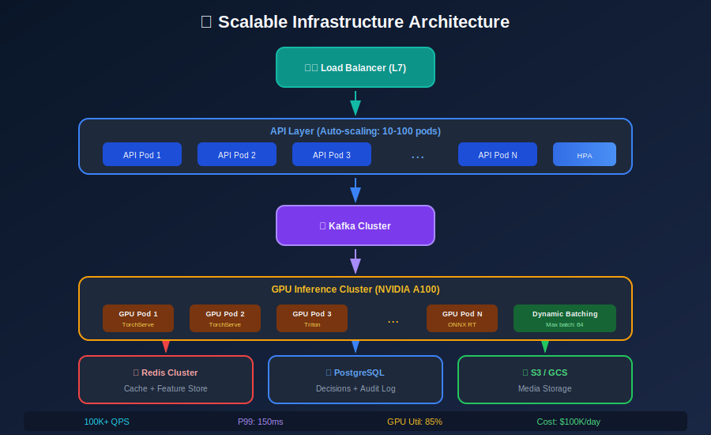
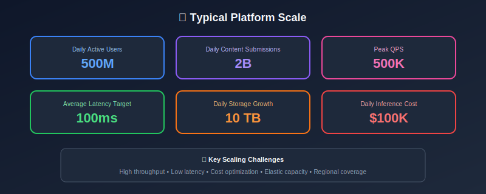

# Scalability & Performance for Content Moderation



## Table of Contents
- [Scale Challenges](#scale-challenges)
- [Horizontal Scaling](#horizontal-scaling)
- [Caching Strategies](#caching-strategies)
- [Database Optimization](#database-optimization)
- [Async Processing](#async-processing)
- [Performance Optimization](#performance-optimization)
- [Cost Optimization](#cost-optimization)

---

## Scale Challenges

### The Numbers at Scale



### Bottleneck Analysis

```python
class BottleneckAnalyzer:
    """Identify system bottlenecks."""

    def analyze_pipeline(self, metrics: dict) -> dict:
        """Analyze where time is spent in pipeline."""
        stages = {
            'api_overhead': metrics['api_latency'] - metrics['total_processing'],
            'preprocessing': metrics['preprocess_time'],
            'feature_extraction': metrics['feature_time'],
            'model_inference': metrics['inference_time'],
            'postprocessing': metrics['postprocess_time'],
            'database_write': metrics['db_write_time'],
        }

        total = sum(stages.values())
        percentages = {k: v/total*100 for k, v in stages.items()}

        # Identify bottleneck (>40% of time)
        bottleneck = max(percentages, key=percentages.get)

        return {
            'stages': stages,
            'percentages': percentages,
            'bottleneck': bottleneck,
            'recommendations': self._get_recommendations(bottleneck)
        }

    def _get_recommendations(self, bottleneck: str) -> list:
        recommendations = {
            'model_inference': [
                'Use GPU batching',
                'Quantize models (INT8)',
                'Use ONNX Runtime',
                'Horizontal scaling'
            ],
            'preprocessing': [
                'Parallelize preprocessing',
                'Use faster libraries (cv2 vs PIL)',
                'Precompute features'
            ],
            'database_write': [
                'Use async writes',
                'Batch database operations',
                'Use write-behind caching'
            ]
        }
        return recommendations.get(bottleneck, [])

```

---

## Horizontal Scaling

### Kubernetes Deployment

```yaml
# moderation-deployment.yaml
apiVersion: apps/v1
kind: Deployment
metadata:
  name: moderation-api
spec:
  replicas: 20
  selector:
    matchLabels:
      app: moderation-api
  template:
    metadata:
      labels:
        app: moderation-api
    spec:
      containers:
      - name: api
        image: moderation-api:v2.1.0
        resources:
          requests:
            cpu: "2"
            memory: "4Gi"
          limits:
            cpu: "4"
            memory: "8Gi"
        env:
        - name: REDIS_HOST
          value: "redis-cluster"
        - name: INFERENCE_SERVICE
          value: "http://inference-service:8080"
---
apiVersion: autoscaling/v2
kind: HorizontalPodAutoscaler
metadata:
  name: moderation-api-hpa
spec:
  scaleTargetRef:
    apiVersion: apps/v1
    kind: Deployment
    name: moderation-api
  minReplicas: 10
  maxReplicas: 100
  metrics:
  - type: Resource
    resource:
      name: cpu
      target:
        type: Utilization
        averageUtilization: 70
  - type: Pods
    pods:
      metric:
        name: requests_per_second
      target:
        type: AverageValue
        averageValue: "1000"

```

### GPU Cluster for Inference

```yaml
# inference-deployment.yaml
apiVersion: apps/v1
kind: Deployment
metadata:
  name: inference-service
spec:
  replicas: 10
  selector:
    matchLabels:
      app: inference-service
  template:
    spec:
      nodeSelector:
        accelerator: nvidia-a100
      containers:
      - name: inference
        image: inference-service:v1.5.0
        resources:
          limits:
            nvidia.com/gpu: 1
        ports:
        - containerPort: 8080
        env:
        - name: MAX_BATCH_SIZE
          value: "64"
        - name: MAX_WAIT_MS
          value: "10"

```

---

## Caching Strategies

### Multi-Layer Cache

```python
import redis
import hashlib
from functools import lru_cache

class MultiLayerCache:
    """
    L1: In-memory LRU cache
    L2: Redis distributed cache
    L3: Database (source of truth)
    """

    def __init__(self, redis_client, db_client):
        self.redis = redis_client
        self.db = db_client
        self.l1_cache = {}
        self.l1_max_size = 10000

    def get(self, key: str) -> dict:
        """Get from cache hierarchy."""
        # L1: In-memory
        if key in self.l1_cache:
            return self.l1_cache[key]

        # L2: Redis
        redis_val = self.redis.get(f"cache:{key}")
        if redis_val:
            value = json.loads(redis_val)
            self._add_to_l1(key, value)
            return value

        # L3: Database
        db_val = self.db.get(key)
        if db_val:
            self._add_to_l2(key, db_val)
            self._add_to_l1(key, db_val)
            return db_val

        return None

    def set(self, key: str, value: dict, ttl: int = 3600):
        """Set in all cache layers."""
        # L1
        self._add_to_l1(key, value)

        # L2
        self.redis.setex(f"cache:{key}", ttl, json.dumps(value))

        # L3 (async)
        self.db.set_async(key, value)

    def _add_to_l1(self, key, value):
        """Add to L1 with LRU eviction."""
        if len(self.l1_cache) >= self.l1_max_size:
            # Evict oldest
            oldest = next(iter(self.l1_cache))
            del self.l1_cache[oldest]
        self.l1_cache[key] = value

    def _add_to_l2(self, key, value, ttl=3600):
        self.redis.setex(f"cache:{key}", ttl, json.dumps(value))

class ContentHashCache:
    """
    Cache moderation results by content hash.
    Same content = same result (for a time period).
    """

    def __init__(self, redis_client, ttl: int = 3600):
        self.redis = redis_client
        self.ttl = ttl

    def get_result(self, content: str) -> dict:
        """Get cached result for content."""
        content_hash = self._hash(content)
        cached = self.redis.get(f"mod_result:{content_hash}")

        if cached:
            return json.loads(cached)
        return None

    def set_result(self, content: str, result: dict):
        """Cache moderation result."""
        content_hash = self._hash(content)
        self.redis.setex(
            f"mod_result:{content_hash}",
            self.ttl,
            json.dumps(result)
        )

    def _hash(self, content: str) -> str:
        """Create content hash."""
        return hashlib.sha256(content.encode()).hexdigest()[:16]

```

---

## Database Optimization

### Sharding Strategy

```python
class DatabaseShardRouter:
    """
    Route database queries to appropriate shard.
    """

    def __init__(self, num_shards: int = 16):
        self.num_shards = num_shards
        self.shards = self._initialize_shards()

    def get_shard(self, content_id: str):
        """Determine shard for content."""
        shard_idx = int(hashlib.md5(content_id.encode()).hexdigest(), 16) % self.num_shards
        return self.shards[shard_idx]

    def insert(self, content_id: str, data: dict):
        """Insert into correct shard."""
        shard = self.get_shard(content_id)
        return shard.insert(data)

    def query(self, content_id: str) -> dict:
        """Query from correct shard."""
        shard = self.get_shard(content_id)
        return shard.find_one({'content_id': content_id})

    def batch_insert(self, items: list):
        """Batch insert with shard grouping."""
        # Group by shard
        shard_groups = {}
        for item in items:
            shard_idx = int(hashlib.md5(item['content_id'].encode()).hexdigest(), 16) % self.num_shards
            if shard_idx not in shard_groups:
                shard_groups[shard_idx] = []
            shard_groups[shard_idx].append(item)

        # Batch insert per shard
        for shard_idx, group in shard_groups.items():
            self.shards[shard_idx].insert_many(group)

```

### Time-Series Partitioning

```sql
-- PostgreSQL partitioning for moderation decisions
CREATE TABLE moderation_decisions (
    id BIGSERIAL,
    content_id VARCHAR(64) NOT NULL,
    decision VARCHAR(20) NOT NULL,
    scores JSONB,
    created_at TIMESTAMP NOT NULL DEFAULT NOW(),
    PRIMARY KEY (id, created_at)
) PARTITION BY RANGE (created_at);

-- Monthly partitions
CREATE TABLE moderation_decisions_2024_01
    PARTITION OF moderation_decisions
    FOR VALUES FROM ('2024-01-01') TO ('2024-02-01');

CREATE TABLE moderation_decisions_2024_02
    PARTITION OF moderation_decisions
    FOR VALUES FROM ('2024-02-01') TO ('2024-03-01');

-- Indexes on each partition
CREATE INDEX idx_content_id_2024_01
    ON moderation_decisions_2024_01 (content_id);

-- Auto-create new partitions
CREATE OR REPLACE FUNCTION create_monthly_partition()
RETURNS void AS $$
DECLARE
    start_date DATE;
    end_date DATE;
    partition_name TEXT;
BEGIN
    start_date := DATE_TRUNC('month', NOW() + INTERVAL '1 month');
    end_date := start_date + INTERVAL '1 month';
    partition_name := 'moderation_decisions_' || TO_CHAR(start_date, 'YYYY_MM');
    EXECUTE FORMAT(
        'CREATE TABLE IF NOT EXISTS %I PARTITION OF moderation_decisions
         FOR VALUES FROM (%L) TO (%L)',
        partition_name, start_date, end_date
    );
END;
$$ LANGUAGE plpgsql;

```

---

## Async Processing

### Message Queue Architecture

```python
from kafka import KafkaProducer, KafkaConsumer
import asyncio
from concurrent.futures import ThreadPoolExecutor

class AsyncModerationPipeline:
    """
    Asynchronous content moderation using Kafka.
    """

    def __init__(self, config):
        self.producer = KafkaProducer(
            bootstrap_servers=config['kafka_servers'],
            value_serializer=lambda v: json.dumps(v).encode('utf-8'),
            acks='all',
            retries=3
        )

        self.topics = {
            'ingest': 'content-ingest',
            'processed': 'content-processed',
            'actions': 'moderation-actions',
            'dlq': 'moderation-dlq'  # Dead letter queue
        }

    async def submit(self, content: dict) -> str:
        """Submit content for async moderation."""
        request_id = str(uuid.uuid4())

        message = {
            'request_id': request_id,
            'content': content,
            'submitted_at': datetime.utcnow().isoformat()
        }

        # Send to ingest topic
        future = self.producer.send(
            self.topics['ingest'],
            key=request_id.encode(),
            value=message
        )

        # Wait for acknowledgment
        await asyncio.get_event_loop().run_in_executor(
            None, future.get, 10  # 10 second timeout
        )

        return request_id

    async def get_result(self, request_id: str, timeout: int = 60) -> dict:
        """Poll for async result."""
        start = datetime.utcnow()

        while (datetime.utcnow() - start).seconds < timeout:
            result = await self._check_result(request_id)
            if result:
                return result
            await asyncio.sleep(0.5)

        raise TimeoutError(f"Result not ready after {timeout}s")

class ModerationWorker:
    """
    Worker that processes content from queue.
    """

    def __init__(self, config):
        self.consumer = KafkaConsumer(
            'content-ingest',
            bootstrap_servers=config['kafka_servers'],
            group_id='moderation-workers',
            auto_offset_reset='earliest',
            enable_auto_commit=False
        )

        self.model = self._load_model(config['model_path'])
        self.producer = KafkaProducer(
            bootstrap_servers=config['kafka_servers']
        )

    def run(self):
        """Main worker loop."""
        batch = []
        batch_start = time.time()

        for message in self.consumer:
            batch.append(message)

            # Process when batch is full or timeout
            if len(batch) >= 32 or (time.time() - batch_start) > 0.1:
                self._process_batch(batch)
                self.consumer.commit()
                batch = []
                batch_start = time.time()

    def _process_batch(self, messages):
        """Process batch of messages."""
        contents = [json.loads(m.value)['content'] for m in messages]

        # Batch inference
        results = self.model.predict_batch(contents)

        # Send results
        for msg, result in zip(messages, results):
            request_id = json.loads(msg.value)['request_id']

            self.producer.send(
                'content-processed',
                key=request_id.encode(),
                value=json.dumps({
                    'request_id': request_id,
                    'result': result,
                    'processed_at': datetime.utcnow().isoformat()
                }).encode()
            )

        self.producer.flush()

```

---

## Performance Optimization

### Model Optimization

```python
import torch
import onnxruntime as ort

class OptimizedInferenceEngine:
    """
    Optimized inference with multiple techniques.
    """

    def __init__(self, model_path: str):
        # Load ONNX model with optimizations
        sess_options = ort.SessionOptions()
        sess_options.graph_optimization_level = ort.GraphOptimizationLevel.ORT_ENABLE_ALL
        sess_options.intra_op_num_threads = 4
        sess_options.inter_op_num_threads = 2

        providers = [
            ('CUDAExecutionProvider', {
                'device_id': 0,
                'arena_extend_strategy': 'kNextPowerOfTwo',
                'cudnn_conv_algo_search': 'HEURISTIC',
            }),
            'CPUExecutionProvider'
        ]

        self.session = ort.InferenceSession(
            model_path,
            sess_options,
            providers=providers
        )

    def predict_batch(self, inputs: np.ndarray) -> np.ndarray:
        """Run optimized batch prediction."""
        # Ensure contiguous memory layout
        inputs = np.ascontiguousarray(inputs)

        outputs = self.session.run(
            None,
            {'input': inputs.astype(np.float32)}
        )

        return outputs[0]

def convert_to_onnx(pytorch_model, sample_input, output_path: str):
    """Convert PyTorch model to ONNX."""
    torch.onnx.export(
        pytorch_model,
        sample_input,
        output_path,
        input_names=['input'],
        output_names=['output'],
        dynamic_axes={
            'input': {0: 'batch_size'},
            'output': {0: 'batch_size'}
        },
        opset_version=14
    )

    # Optimize ONNX model
    from onnxruntime.transformers import optimizer
    optimized = optimizer.optimize_model(
        output_path,
        model_type='bert',
        num_heads=12,
        hidden_size=768
    )
    optimized.save_model_to_file(output_path.replace('.onnx', '_optimized.onnx'))

```

---

## Cost Optimization

### Cost Analysis

```python
class CostAnalyzer:
    """
    Analyze and optimize moderation costs.
    """

    COSTS = {
        'gpu_hour': 3.0,        # A100 GPU
        'cpu_hour': 0.05,       # Per vCPU
        'human_review': 0.10,   # Per item
        'storage_gb_month': 0.02,
        'bandwidth_gb': 0.01,
    }

    def analyze_daily_costs(self, metrics: dict) -> dict:
        """Calculate daily costs breakdown."""
        costs = {}

        # GPU inference costs
        gpu_hours = (
            metrics['inference_requests'] *
            metrics['avg_inference_time_ms'] / 1000 / 3600
        )
        costs['gpu_inference'] = gpu_hours * self.COSTS['gpu_hour']

        # CPU costs (API, preprocessing)
        cpu_hours = metrics['total_cpu_hours']
        costs['cpu'] = cpu_hours * self.COSTS['cpu_hour']

        # Human review costs
        costs['human_review'] = (
            metrics['human_reviews'] * self.COSTS['human_review']
        )

        # Storage
        costs['storage'] = (
            metrics['storage_gb'] * self.COSTS['storage_gb_month'] / 30
        )

        costs['total'] = sum(costs.values())
        costs['cost_per_1m_items'] = costs['total'] / metrics['total_items'] * 1_000_000

        return costs

    def recommend_optimizations(self, metrics: dict) -> list:
        """Recommend cost optimizations."""
        recommendations = []

        # Check cache hit rate
        if metrics.get('cache_hit_rate', 0) < 0.5:
            recommendations.append({
                'action': 'Improve caching',
                'potential_savings': '20-40%',
                'description': 'Increase cache TTL and size'
            })

        # Check human review rate
        if metrics.get('human_review_rate', 0) > 0.1:
            recommendations.append({
                'action': 'Improve model accuracy',
                'potential_savings': '30-50%',
                'description': 'Reduce uncertain predictions'
            })

        # Check GPU utilization
        if metrics.get('gpu_utilization', 0) < 0.7:
            recommendations.append({
                'action': 'Increase batch size',
                'potential_savings': '15-30%',
                'description': 'Better GPU utilization'
            })

        return recommendations

```

---

## Summary

Scaling content moderation requires:

1. **Horizontal Scaling**: K8s auto-scaling, GPU clusters
2. **Caching**: Multi-layer, content hash caching
3. **Database**: Sharding, time-series partitioning
4. **Async Processing**: Kafka, batch processing
5. **Optimization**: ONNX, quantization, batching
6. **Cost Control**: Monitor and optimize spend

---

*Previous: [Human-in-the-Loop](../10_human_in_the_loop/README.md)*
*Next: [Monitoring & Alerting](../12_monitoring_alerting/README.md)*

---

<div align="center">

**[⬆ Back to Top](#)** | **[📚 Main Repository](https://github.com/Gaurav14cs17/ml_system_design)**

Made with 💜 by [Gaurav14cs17](https://github.com/Gaurav14cs17)

</div>
