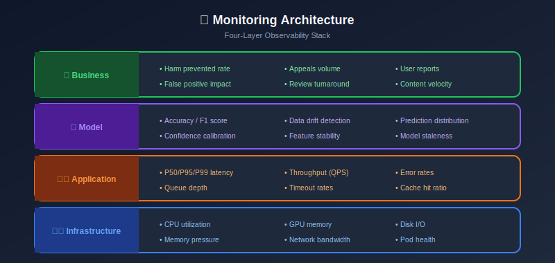

# Monitoring & Alerting for Content Moderation

## Table of Contents

- [Monitoring Strategy](#monitoring-strategy)

- [Key Metrics](#key-metrics)

- [Alerting Rules](#alerting-rules)

- [Dashboards](#dashboards)

- [Incident Response](#incident-response)

- [Model Monitoring](#model-monitoring)

---

## Monitoring Strategy

### Monitoring Layers



### Prometheus Metrics Collection

```python
from prometheus_client import Counter, Histogram, Gauge, start_http_server

# Define metrics
MODERATION_REQUESTS = Counter(
    'moderation_requests_total',
    'Total moderation requests',
    ['content_type', 'decision']
)

MODERATION_LATENCY = Histogram(
    'moderation_latency_seconds',
    'Moderation request latency',
    ['content_type'],
    buckets=[0.01, 0.05, 0.1, 0.25, 0.5, 1.0, 2.5, 5.0]
)

MODEL_CONFIDENCE = Histogram(
    'model_confidence',
    'Model prediction confidence distribution',
    ['model_name', 'category'],
    buckets=[0.1, 0.2, 0.3, 0.4, 0.5, 0.6, 0.7, 0.8, 0.9, 0.95, 0.99]
)

QUEUE_DEPTH = Gauge(
    'review_queue_depth',
    'Number of items in review queue',
    ['priority']
)

class MetricsCollector:
    def record_moderation(self, content_type: str, decision: str, latency: float, confidence: float):
        MODERATION_REQUESTS.labels(content_type=content_type, decision=decision).inc()
        MODERATION_LATENCY.labels(content_type=content_type).observe(latency)
        MODEL_CONFIDENCE.labels(model_name='main', category='overall').observe(confidence)

    def update_queue_depth(self, priority: str, depth: int):
        QUEUE_DEPTH.labels(priority=priority).set(depth)

```

---

## Key Metrics

### Operational Metrics

```python
# Essential metrics to track
OPERATIONAL_METRICS = {
    # Latency
    'p50_latency_ms': 'histogram_quantile(0.5, rate(moderation_latency_seconds_bucket[5m])) * 1000',
    'p99_latency_ms': 'histogram_quantile(0.99, rate(moderation_latency_seconds_bucket[5m])) * 1000',

    # Throughput
    'requests_per_second': 'rate(moderation_requests_total[1m])',
    'requests_by_type': 'sum by (content_type) (rate(moderation_requests_total[5m]))',

    # Errors
    'error_rate': 'rate(moderation_errors_total[5m]) / rate(moderation_requests_total[5m])',

    # Queue health
    'queue_wait_time': 'avg(review_queue_wait_seconds)',
    'queue_depth_total': 'sum(review_queue_depth)',
}

MODEL_METRICS = {
    # Prediction distribution
    'removal_rate': 'sum(rate(moderation_requests_total{decision="remove"}[1h])) / sum(rate(moderation_requests_total[1h]))',

    # Confidence distribution
    'low_confidence_rate': 'sum(rate(model_confidence_bucket{le="0.5"}[1h])) / sum(rate(model_confidence_count[1h]))',

    # Category distribution
    'predictions_by_category': 'sum by (category) (rate(moderation_predictions_total[1h]))',
}

```

### Model Quality Metrics

```python
class ModelMonitor:
    """Monitor model performance in production."""

    def __init__(self, metrics_store):
        self.store = metrics_store
        self.baseline_metrics = self._load_baseline()

    def compute_drift_metrics(self, window_hours: int = 24) -> dict:
        """Detect prediction distribution drift."""
        current = self._get_recent_predictions(window_hours)
        baseline = self.baseline_metrics

        drift_metrics = {}

        # Category distribution drift (KL divergence)
        for category in current['category_dist'].keys():
            current_dist = current['category_dist'][category]
            baseline_dist = baseline['category_dist'].get(category, 0.1)

            drift_metrics[f'{category}_drift'] = self._kl_divergence(
                current_dist, baseline_dist
            )

        # Confidence distribution shift
        drift_metrics['confidence_drift'] = self._wasserstein_distance(
            current['confidence_dist'],
            baseline['confidence_dist']
        )

        # Removal rate change
        drift_metrics['removal_rate_change'] = (
            current['removal_rate'] - baseline['removal_rate']
        ) / baseline['removal_rate']

        return drift_metrics

    def detect_anomalies(self, window_minutes: int = 15) -> list:
        """Detect real-time anomalies."""
        anomalies = []
        current = self._get_recent_metrics(window_minutes)

        # Sudden latency spike
        if current['p99_latency'] > self.baseline_metrics['p99_latency'] * 2:
            anomalies.append({
                'type': 'latency_spike',
                'severity': 'high',
                'value': current['p99_latency']
            })

        # Error rate spike
        if current['error_rate'] > 0.01:  # > 1% errors
            anomalies.append({
                'type': 'error_rate_spike',
                'severity': 'critical',
                'value': current['error_rate']
            })

        # Unusual removal rate
        if abs(current['removal_rate'] - self.baseline_metrics['removal_rate']) > 0.05:
            anomalies.append({
                'type': 'removal_rate_anomaly',
                'severity': 'medium',
                'value': current['removal_rate']
            })

        return anomalies

```

---

## Alerting Rules

### Prometheus AlertManager Rules

```yaml
# alerting_rules.yaml
groups:
  - name: moderation_alerts
    rules:
      # Latency alerts
      - alert: HighLatency
        expr: histogram_quantile(0.99, rate(moderation_latency_seconds_bucket[5m])) > 0.5
        for: 5m
        labels:
          severity: warning
        annotations:
          summary: "High moderation latency"
          description: "P99 latency is {{ $value }}s"

      - alert: CriticalLatency
        expr: histogram_quantile(0.99, rate(moderation_latency_seconds_bucket[5m])) > 2
        for: 2m
        labels:
          severity: critical
        annotations:
          summary: "Critical moderation latency"
          description: "P99 latency is {{ $value }}s"

      # Error rate alerts
      - alert: HighErrorRate
        expr: rate(moderation_errors_total[5m]) / rate(moderation_requests_total[5m]) > 0.01
        for: 5m
        labels:
          severity: critical
        annotations:
          summary: "High moderation error rate"
          description: "Error rate is {{ $value | humanizePercentage }}"

      # Queue alerts
      - alert: QueueBacklog
        expr: review_queue_depth{priority="critical"} > 100
        for: 5m
        labels:
          severity: critical
        annotations:
          summary: "Critical content queue backlog"
          description: "{{ $value }} critical items waiting"

      # Model alerts
      - alert: ModelDrift
        expr: model_prediction_drift > 0.1
        for: 30m
        labels:
          severity: warning
        annotations:
          summary: "Model prediction drift detected"
          description: "Drift score: {{ $value }}"

      - alert: RemovalRateAnomaly
        expr: abs(sum(rate(moderation_requests_total{decision="remove"}[1h])) / sum(rate(moderation_requests_total[1h])) - 0.02) > 0.01
        for: 1h
        labels:
          severity: warning
        annotations:
          summary: "Unusual removal rate"
          description: "Current removal rate: {{ $value }}"

  - name: safety_alerts
    rules:
      # Critical content waiting
      - alert: CSAMContentWaiting
        expr: review_queue_depth{category="csam"} > 0
        for: 1m
        labels:
          severity: critical
          category: csam
        annotations:
          summary: "CSAM content awaiting review"
          runbook: "https://runbooks/csam-response"

      # Appeals backlog
      - alert: AppealsBacklog
        expr: appeals_queue_depth > 1000
        for: 30m
        labels:
          severity: warning
        annotations:
          summary: "High appeals backlog"

```

### PagerDuty Integration

```python
import requests

class AlertManager:
    def __init__(self, pagerduty_key: str, slack_webhook: str):
        self.pd_key = pagerduty_key
        self.slack_webhook = slack_webhook

    def trigger_alert(self, alert: dict):
        """Route alert to appropriate channel."""
        severity = alert.get('severity', 'warning')

        if severity == 'critical':
            self._page_oncall(alert)
            self._send_slack(alert, channel='#incidents')
        elif severity == 'warning':
            self._send_slack(alert, channel='#moderation-alerts')
        else:
            self._send_slack(alert, channel='#moderation-info')

    def _page_oncall(self, alert: dict):
        """Send PagerDuty alert."""
        payload = {
            'routing_key': self.pd_key,
            'event_action': 'trigger',
            'payload': {
                'summary': alert['summary'],
                'severity': 'critical',
                'source': 'moderation-system',
                'custom_details': alert.get('details', {})
            }
        }

        requests.post(
            'https://events.pagerduty.com/v2/enqueue',
            json=payload
        )

    def _send_slack(self, alert: dict, channel: str):
        """Send Slack notification."""
        color = {'critical': 'danger', 'warning': 'warning', 'info': 'good'}

        payload = {
            'channel': channel,
            'attachments': [{
                'color': color.get(alert.get('severity', 'info'), 'good'),
                'title': alert['summary'],
                'text': alert.get('description', ''),
                'fields': [
                    {'title': k, 'value': str(v), 'short': True}
                    for k, v in alert.get('details', {}).items()
                ]
            }]
        }

        requests.post(self.slack_webhook, json=payload)

```

---

## Dashboards

### Grafana Dashboard Configuration

```json
{
  "dashboard": {
    "title": "Content Moderation Overview",
    "panels": [
      {
        "title": "Request Rate",
        "type": "graph",
        "targets": [
          {
            "expr": "sum(rate(moderation_requests_total[5m]))",
            "legendFormat": "Total"
          },
          {
            "expr": "sum by (decision) (rate(moderation_requests_total[5m]))",
            "legendFormat": "{{decision}}"
          }
        ]
      },
      {
        "title": "Latency Distribution",
        "type": "heatmap",
        "targets": [
          {
            "expr": "sum by (le) (rate(moderation_latency_seconds_bucket[5m]))"
          }
        ]
      },
      {
        "title": "Review Queue Depth",
        "type": "gauge",
        "targets": [
          {
            "expr": "sum(review_queue_depth)"
          }
        ],
        "thresholds": {
          "mode": "absolute",
          "steps": [
            {"color": "green", "value": null},
            {"color": "yellow", "value": 500},
            {"color": "red", "value": 1000}
          ]
        }
      },
      {
        "title": "Model Confidence Distribution",
        "type": "histogram",
        "targets": [
          {
            "expr": "sum by (le) (rate(model_confidence_bucket[1h]))"
          }
        ]
      },
      {
        "title": "Removal Rate Trend",
        "type": "graph",
        "targets": [
          {
            "expr": "sum(rate(moderation_requests_total{decision='remove'}[1h])) / sum(rate(moderation_requests_total[1h]))"
          }
        ]
      }
    ]
  }
}

```

---

## Incident Response

### Runbook Template

```markdown
# Incident Runbook: High Moderation Latency

## Symptoms

- P99 latency > 500ms

- Alert: HighLatency or CriticalLatency triggered

## Impact

- Delayed content publishing

- Poor user experience

- Potential content queue buildup

## Diagnosis Steps

1. **Check GPU utilization**
   ```bash
   kubectl top pods -l app=inference-service
   ```

2. **Check queue depth**
   ```promql
   review_queue_depth
   ```

3. **Check for recent deployments**
   ```bash
   kubectl rollout history deployment/inference-service
   ```

4. **Check model serving logs**
   ```bash
   kubectl logs -l app=inference-service --tail=100
   ```

## Resolution Steps

### If GPU overloaded:

1. Scale up inference pods
   ```bash
   kubectl scale deployment inference-service --replicas=20
   ```

### If model issue:

1. Rollback to previous model version
   ```bash
   kubectl set image deployment/inference-service model=model:v1.4.0
   ```

### If queue backlog:

1. Enable burst capacity
   ```bash
   kubectl apply -f burst-config.yaml
   ```

## Escalation

- After 15 min unresolved: Page ML team lead

- After 30 min unresolved: Page VP Engineering

```

---

## Model Monitoring

### Drift Detection

```python
from scipy import stats
import numpy as np

class DriftDetector:
    """Detect data and prediction drift."""

    def __init__(self, reference_data: dict):
        self.reference = reference_data

    def detect_feature_drift(self, current_features: np.ndarray) -> dict:
        """Detect drift in input features."""
        drift_scores = {}

        for i, feature_name in enumerate(self.reference['feature_names']):
            ref_values = self.reference['features'][:, i]
            curr_values = current_features[:, i]

            # KS test for continuous features
            statistic, p_value = stats.ks_2samp(ref_values, curr_values)

            drift_scores[feature_name] = {
                'ks_statistic': statistic,
                'p_value': p_value,
                'is_drifted': p_value < 0.01
            }

        return drift_scores

    def detect_prediction_drift(self, current_predictions: np.ndarray) -> dict:
        """Detect drift in model predictions."""
        ref_preds = self.reference['predictions']

        # Compare prediction distributions
        result = {
            'distribution_shift': {},
            'removal_rate_change': 0
        }

        # For each category
        categories = ['violence', 'hate', 'adult', 'spam']
        for cat in categories:
            ref_cat = ref_preds[:, categories.index(cat)]
            curr_cat = current_predictions[:, categories.index(cat)]

            ks_stat, p_val = stats.ks_2samp(ref_cat, curr_cat)
            result['distribution_shift'][cat] = {
                'ks_statistic': ks_stat,
                'p_value': p_val
            }

        # Removal rate (threshold > 0.5)
        ref_removal = (ref_preds.max(axis=1) > 0.5).mean()
        curr_removal = (current_predictions.max(axis=1) > 0.5).mean()
        result['removal_rate_change'] = curr_removal - ref_removal

        return result

```

---

## Summary

Effective monitoring for content moderation includes:

1. **Multi-layer metrics**: Infrastructure, application, model, business

2. **Real-time alerting**: PagerDuty, Slack for different severities

3. **Comprehensive dashboards**: Grafana for visualization

4. **Drift detection**: Monitor prediction and feature drift

5. **Incident runbooks**: Clear response procedures

6. **Proactive monitoring**: Catch issues before they impact users

---

*Previous: [Scalability & Performance](../11_scalability_performance/README.md)*
*Next: [Edge Cases & Adversarial](../13_edge_cases_adversarial/README.md)*

---

<div align="center">

**[⬆ Back to Top](#)** | **[📚 Main Repository](https://github.com/Gaurav14cs17/ml_system_design)**

Made with 💜 by [Gaurav14cs17](https://github.com/Gaurav14cs17)

</div>
