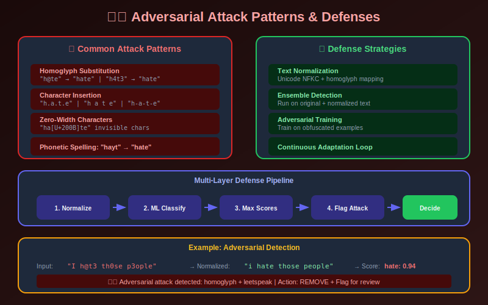

# Edge Cases & Adversarial Attacks in Content Moderation



## Table of Contents
- [Types of Edge Cases](#types-of-edge-cases)
- [Adversarial Attack Patterns](#adversarial-attack-patterns)
- [Defense Strategies](#defense-strategies)
- [Context-Dependent Decisions](#context-dependent-decisions)
- [Handling Ambiguity](#handling-ambiguity)

---

## Types of Edge Cases

### Common Edge Cases

| Category | Example | Challenge |
|----------|---------|-----------|
| **Satire/Parody** | Mocking hate speech | Intent matters |
| **Reclaimed Terms** | Community uses slur | Context-dependent |
| **News/Education** | Reporting on violence | Informational value |
| **Art** | Nude paintings | Artistic merit |
| **Historical** | Nazi imagery in documentaries | Educational context |
| **Irony** | "I love Mondays" | Opposite meaning |
| **Code-switching** | Mixed language insults | Multilingual detection |

### Edge Case Classification

```python
from dataclasses import dataclass
from enum import Enum
from typing import List, Optional

class EdgeCaseType(Enum):
    SATIRE = "satire"
    RECLAIMED = "reclaimed"
    NEWSWORTHY = "newsworthy"
    ARTISTIC = "artistic"
    EDUCATIONAL = "educational"
    IRONY = "irony"
    CULTURAL_CONTEXT = "cultural_context"
    CODE_SWITCHING = "code_switching"

@dataclass
class EdgeCaseSignal:
    case_type: EdgeCaseType
    confidence: float
    indicators: List[str]
    recommended_action: str

class EdgeCaseDetector:
    """Detect potential edge cases that need special handling."""

    def __init__(self, config):
        self.satire_patterns = self._load_satire_patterns()
        self.news_domains = self._load_news_domains()
        self.educational_indicators = self._load_educational_indicators()

    def detect(self, content: dict, context: dict) -> List[EdgeCaseSignal]:
        """Detect edge cases in content."""
        signals = []

        # Check for satire indicators
        satire_signal = self._check_satire(content, context)
        if satire_signal:
            signals.append(satire_signal)

        # Check for news/educational context
        news_signal = self._check_newsworthy(content, context)
        if news_signal:
            signals.append(news_signal)

        # Check for artistic context
        art_signal = self._check_artistic(content, context)
        if art_signal:
            signals.append(art_signal)

        # Check for reclaimed language
        reclaimed_signal = self._check_reclaimed(content, context)
        if reclaimed_signal:
            signals.append(reclaimed_signal)

        return signals

    def _check_satire(self, content, context) -> Optional[EdgeCaseSignal]:
        """Check for satire/parody indicators."""
        indicators = []

        # Check account type
        if context.get('account_type') == 'satire':
            indicators.append('satire_account')

        # Check for satire signals in content
        text = content.get('text', '').lower()
        satire_keywords = ['parody', 'satire', '/s', 'sarcasm', 'not real']
        if any(kw in text for kw in satire_keywords):
            indicators.append('satire_keywords')

        # Check hashtags
        if any('#satire' in tag or '#parody' in tag
               for tag in context.get('hashtags', [])):
            indicators.append('satire_hashtags')

        if indicators:
            return EdgeCaseSignal(
                case_type=EdgeCaseType.SATIRE,
                confidence=len(indicators) / 3,
                indicators=indicators,
                recommended_action='human_review'
            )
        return None

    def _check_newsworthy(self, content, context) -> Optional[EdgeCaseSignal]:
        """Check for news or educational context."""
        indicators = []

        # Check if from verified news source
        if context.get('source_domain') in self.news_domains:
            indicators.append('news_source')

        # Check for quote patterns
        text = content.get('text', '')
        if '"' in text and ('said' in text or 'reported' in text):
            indicators.append('quoting_pattern')

        # Educational indicators
        if any(ind in text.lower() for ind in self.educational_indicators):
            indicators.append('educational_language')

        if indicators:
            return EdgeCaseSignal(
                case_type=EdgeCaseType.NEWSWORTHY,
                confidence=len(indicators) / 3,
                indicators=indicators,
                recommended_action='allow_with_context'
            )
        return None
```

---

## Adversarial Attack Patterns

### Common Attack Techniques

```
1. Character Manipulation
   - Homoglyphs: h@te → hate
   - Leetspeak: h4t3 → hate
   - Zero-width chars: ha​te (invisible char)
   - Accents: hàté → hate

2. Word-Level Obfuscation
   - Spacing: h a t e → hate
   - Dots/dashes: h.a.t.e → hate
   - Deliberate misspelling: haet → hate
   - Phonetic: hayt → hate

3. Semantic Evasion
   - Euphemisms: "take them for a walk"
   - Code words: evolving slang
   - Context hiding: innocuous followed by harmful
   - Dog whistles: coded language

4. Technical Attacks
   - Adversarial images (tiny perturbations)
   - Steganography (hidden content)
   - Exploiting model blind spots
   - Rate limiting evasion
```

### Attack Detection

```python
import re
import unicodedata
from typing import Dict, List, Tuple

class AdversarialDetector:
    """Detect adversarial manipulation attempts."""

    def __init__(self):
        self.homoglyph_map = self._build_homoglyph_map()
        self.known_obfuscations = self._load_obfuscation_patterns()

    def analyze(self, text: str) -> Dict:
        """Analyze text for adversarial patterns."""
        results = {
            'original': text,
            'is_adversarial': False,
            'attack_types': [],
            'normalized': text,
            'confidence': 0
        }

        # Check for homoglyphs
        homoglyph_result = self._detect_homoglyphs(text)
        if homoglyph_result['detected']:
            results['attack_types'].append('homoglyph')
            results['is_adversarial'] = True

        # Check for spacing attacks
        spacing_result = self._detect_spacing_attacks(text)
        if spacing_result['detected']:
            results['attack_types'].append('spacing')
            results['is_adversarial'] = True

        # Check for zero-width characters
        zwc_result = self._detect_zero_width(text)
        if zwc_result['detected']:
            results['attack_types'].append('zero_width')
            results['is_adversarial'] = True

        # Normalize and compare
        results['normalized'] = self._normalize_text(text)

        # Confidence based on number of attack types found
        results['confidence'] = min(len(results['attack_types']) * 0.3, 1.0)

        return results

    def _detect_homoglyphs(self, text: str) -> Dict:
        """Detect homoglyph substitutions."""
        suspicious = []

        for char in text:
            if char in self.homoglyph_map:
                suspicious.append({
                    'char': char,
                    'looks_like': self.homoglyph_map[char],
                    'unicode': f'U+{ord(char):04X}'
                })

        return {
            'detected': len(suspicious) > 0,
            'substitutions': suspicious
        }

    def _detect_spacing_attacks(self, text: str) -> Dict:
        """Detect intentional spacing to break words."""

        # Pattern: single characters separated by spaces or dots
        patterns = [
            r'\b(\w)\s+(\w)\s+(\w)\s+(\w)\b',  # h a t e
            r'\b(\w)\.(\w)\.(\w)\.(\w)\b',      # h.a.t.e
            r'\b(\w)-(\w)-(\w)-(\w)\b',         # h-a-t-e
        ]

        matches = []
        for pattern in patterns:
            found = re.findall(pattern, text)
            if found:
                matches.extend(found)

        return {
            'detected': len(matches) > 0,
            'matches': matches
        }

    def _detect_zero_width(self, text: str) -> Dict:
        """Detect zero-width character injection."""
        zero_width_chars = [
            '\u200b',  # zero-width space
            '\u200c',  # zero-width non-joiner
            '\u200d',  # zero-width joiner
            '\ufeff',  # zero-width no-break space
            '\u00ad',  # soft hyphen
        ]

        found = []
        for i, char in enumerate(text):
            if char in zero_width_chars:
                found.append({
                    'position': i,
                    'unicode': f'U+{ord(char):04X}'
                })

        return {
            'detected': len(found) > 0,
            'positions': found
        }

    def _normalize_text(self, text: str) -> str:
        """Normalize adversarial text to standard form."""

        # Unicode normalization
        text = unicodedata.normalize('NFKC', text)

        # Remove zero-width characters
        text = re.sub(r'[\u200b\u200c\u200d\ufeff\u00ad]', '', text)

        # Replace homoglyphs
        for char, replacement in self.homoglyph_map.items():
            text = text.replace(char, replacement)

        # Remove character separation
        text = re.sub(r'(\w)[.\-_\s]+(?=\w[.\-_\s]+\w)', r'\1', text)

        # Reduce repeated characters
        text = re.sub(r'(.)\1{2,}', r'\1\1', text)

        return text.lower()

    def _build_homoglyph_map(self) -> Dict[str, str]:
        return {
            '@': 'a', '4': 'a', 'α': 'a',
            '8': 'b', 'ß': 'b',
            '(': 'c', '¢': 'c',
            '3': 'e', 'є': 'e', 'ε': 'e',
            '6': 'g', '9': 'g',
            '#': 'h',
            '!': 'i', '1': 'i', '|': 'i', 'ï': 'i',
            '0': 'o', 'ø': 'o', 'θ': 'o',
            '$': 's', '5': 's',
            '7': 't', '+': 't',
            'µ': 'u', 'ü': 'u',
            '\/': 'v',
            '\/\/': 'w',
            '><': 'x',
            '¥': 'y',
            '2': 'z',
        }
```

---

## Defense Strategies

### Multi-Layer Defense

```python
class DefenseLayer:
    """Multi-layer defense against adversarial attacks."""

    def __init__(self, config):
        self.adversarial_detector = AdversarialDetector()
        self.models = self._load_ensemble_models()
        self.hash_db = self._load_known_bad_hashes()

    def defend(self, content: dict) -> dict:
        """Apply multi-layer defense."""
        result = {
            'original_scores': None,
            'normalized_scores': None,
            'final_decision': None,
            'attack_detected': False
        }

        # Layer 1: Check known bad content hashes
        if self._check_hash_match(content):
            return {'final_decision': 'block', 'reason': 'known_bad_hash'}

        # Layer 2: Run on original content
        result['original_scores'] = self._run_models(content)

        # Layer 3: Adversarial detection and normalization
        adv_result = self.adversarial_detector.analyze(content.get('text', ''))

        if adv_result['is_adversarial']:
            result['attack_detected'] = True

            # Run models on normalized content
            normalized_content = {**content, 'text': adv_result['normalized']}
            result['normalized_scores'] = self._run_models(normalized_content)

            # Take max of original and normalized scores
            result['final_scores'] = self._max_scores(
                result['original_scores'],
                result['normalized_scores']
            )
        else:
            result['final_scores'] = result['original_scores']

        # Layer 4: Ensemble decision
        result['final_decision'] = self._ensemble_decision(result['final_scores'])

        return result

    def _run_models(self, content: dict) -> dict:
        """Run content through model ensemble."""
        all_scores = []

        for model in self.models:
            scores = model.predict(content)
            all_scores.append(scores)

        # Aggregate (max pooling for safety)
        aggregated = {}
        for category in all_scores[0].keys():
            aggregated[category] = max(s[category] for s in all_scores)

        return aggregated

    def _max_scores(self, scores1: dict, scores2: dict) -> dict:
        """Take maximum score for each category."""
        return {
            cat: max(scores1.get(cat, 0), scores2.get(cat, 0))
            for cat in set(scores1.keys()) | set(scores2.keys())
        }
```

### Continuous Adaptation

```python
class AdaptiveDefense:
    """Continuously adapt to new attack patterns."""

    def __init__(self, db, model_trainer):
        self.db = db
        self.trainer = model_trainer
        self.attack_patterns = {}

    def learn_from_appeals(self, successful_appeals: List[dict]):
        """Learn from cases where adversarial content was missed."""
        for appeal in successful_appeals:
            if appeal['was_violation'] and appeal['was_initially_allowed']:

                # This content evaded detection
                self._analyze_evasion(appeal['content'])

    def _analyze_evasion(self, content: dict):
        """Analyze how content evaded detection."""
        text = content.get('text', '')

        # Detect attack patterns used
        patterns = self.adversarial_detector.analyze(text)

        if patterns['attack_types']:
            for attack_type in patterns['attack_types']:

                # Track this pattern
                if attack_type not in self.attack_patterns:
                    self.attack_patterns[attack_type] = []

                self.attack_patterns[attack_type].append({
                    'content': content,
                    'detected_at': datetime.utcnow()
                })

        # Add to training data for model improvement
        self._add_to_training_data(content, patterns['normalized'])

    def generate_adversarial_training_data(self, clean_data: List[dict]) -> List[dict]:
        """Generate adversarial examples for training."""
        adversarial_examples = []

        for item in clean_data:
            if item['label'] == 'violation':

                # Generate multiple adversarial versions
                variants = self._generate_variants(item['text'])

                for variant in variants:
                    adversarial_examples.append({
                        'text': variant,
                        'label': item['label'],  # Same label
                        'is_adversarial': True
                    })

        return adversarial_examples

    def _generate_variants(self, text: str) -> List[str]:
        """Generate adversarial variants of text."""
        variants = []

        # Homoglyph variant
        variants.append(self._apply_homoglyphs(text))

        # Spacing variant
        variants.append(self._apply_spacing(text))

        # Zero-width variant
        variants.append(self._apply_zero_width(text))

        return variants
```

---

## Context-Dependent Decisions

### Context Analyzer

```python
class ContextAnalyzer:
    """Analyze context to make nuanced decisions."""

    def __init__(self):
        self.context_weights = {
            'author_history': 0.2,
            'community_norms': 0.2,
            'conversation_context': 0.3,
            'temporal_context': 0.1,
            'relationship_context': 0.2
        }

    def analyze(self, content: dict, context: dict) -> dict:
        """Analyze full context around content."""
        analysis = {}

        # Author history
        analysis['author'] = self._analyze_author(context.get('author', {}))

        # Community context
        analysis['community'] = self._analyze_community(context.get('community', {}))

        # Conversation context
        analysis['conversation'] = self._analyze_conversation(context.get('thread', []))

        # Temporal context
        analysis['temporal'] = self._analyze_temporal(context.get('timestamp'))

        # Compute context modifier
        analysis['context_modifier'] = self._compute_modifier(analysis)

        return analysis

    def _analyze_author(self, author: dict) -> dict:
        """Analyze author's history and reputation."""
        return {
            'is_verified': author.get('verified', False),
            'account_age_days': author.get('account_age', 0),
            'previous_violations': author.get('violations', 0),
            'is_creator': author.get('is_creator', False),
            'trust_score': self._calculate_trust_score(author)
        }

    def _analyze_community(self, community: dict) -> dict:
        """Analyze community norms and expectations."""
        return {
            'allows_adult': community.get('nsfw_allowed', False),
            'is_gaming': community.get('category') == 'gaming',
            'moderation_level': community.get('moderation_level', 'standard'),
            'typical_content': community.get('typical_content', 'general')
        }

    def _analyze_conversation(self, thread: list) -> dict:
        """Analyze conversation context."""
        if not thread:
            return {'has_context': False}

        return {
            'has_context': True,
            'thread_length': len(thread),
            'is_reply': len(thread) > 1,
            'thread_sentiment': self._analyze_thread_sentiment(thread),
            'escalation_pattern': self._detect_escalation(thread)
        }

    def _compute_modifier(self, analysis: dict) -> float:
        """Compute context-based score modifier."""
        modifier = 0

        # Trusted author reduces score
        if analysis['author'].get('is_verified'):
            modifier -= 0.1
        if analysis['author'].get('trust_score', 0) > 0.8:
            modifier -= 0.05

        # Previous violations increase score
        if analysis['author'].get('previous_violations', 0) > 2:
            modifier += 0.2

        # Gaming context is more lenient
        if analysis['community'].get('is_gaming'):
            modifier -= 0.1

        # Escalating conversation increases suspicion
        if analysis['conversation'].get('escalation_pattern'):
            modifier += 0.15

        return modifier
```

---

## Handling Ambiguity

### Ambiguity Resolution

```python
class AmbiguityResolver:
    """Handle ambiguous content decisions."""

    AMBIGUITY_THRESHOLDS = {
        'low_confidence': 0.4,
        'high_confidence': 0.7,
        'definitely_violation': 0.9
    }

    def resolve(self, scores: dict, context: dict) -> dict:
        """Resolve ambiguous moderation decisions."""
        max_score = max(scores.values())
        max_category = max(scores, key=scores.get)

        # Clear violation
        if max_score > self.AMBIGUITY_THRESHOLDS['definitely_violation']:
            return {
                'decision': 'violation',
                'category': max_category,
                'confidence': 'high',
                'needs_review': False
            }

        # Clear safe
        if max_score < self.AMBIGUITY_THRESHOLDS['low_confidence']:
            return {
                'decision': 'safe',
                'confidence': 'high',
                'needs_review': False
            }

        # Ambiguous zone - needs additional signals
        return self._resolve_ambiguous(scores, context)

    def _resolve_ambiguous(self, scores: dict, context: dict) -> dict:
        """Apply additional heuristics for ambiguous cases."""
        resolution = {
            'decision': 'uncertain',
            'confidence': 'low',
            'needs_review': True,
            'resolution_factors': []
        }

        # Check edge case signals
        edge_cases = context.get('edge_case_signals', [])
        if edge_cases:
            resolution['resolution_factors'].append({
                'factor': 'edge_case',
                'signals': edge_cases
            })

            # If satire/news, lean toward allowing
            if any(e.case_type in [EdgeCaseType.SATIRE, EdgeCaseType.NEWSWORTHY]
                   for e in edge_cases):
                resolution['decision'] = 'allow_with_review'

        # Check author trust
        author_trust = context.get('author', {}).get('trust_score', 0.5)
        if author_trust > 0.8:
            resolution['resolution_factors'].append({
                'factor': 'trusted_author',
                'trust_score': author_trust
            })
            resolution['decision'] = 'allow_with_review'

        # Check if content was reported
        if context.get('was_reported'):
            resolution['resolution_factors'].append({
                'factor': 'user_reported'
            })
            resolution['needs_review'] = True

        return resolution
```

---

## Summary

Handling edge cases and adversarial attacks requires:

1. **Edge Case Detection**: Identify satire, news, art, etc.
2. **Adversarial Defense**: Multi-layer normalization and detection
3. **Context Analysis**: Author, community, conversation context
4. **Ambiguity Resolution**: Clear processes for uncertain cases
5. **Continuous Learning**: Adapt to new attack patterns

---

*Previous: [Monitoring & Alerting](../12_monitoring_alerting/README.md)*
*Next: [Legal & Ethical Considerations](../14_legal_ethical_considerations/README.md)*

---

<div align="center">

**[⬆ Back to Top](#)** | **[📚 Main Repository](https://github.com/Gaurav14cs17/ml_system_design)**

Made with 💜 by [Gaurav14cs17](https://github.com/Gaurav14cs17)

</div>
