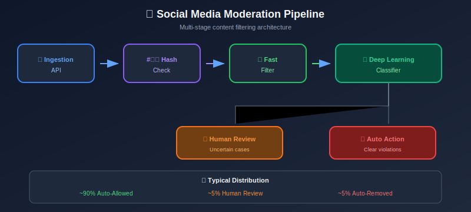
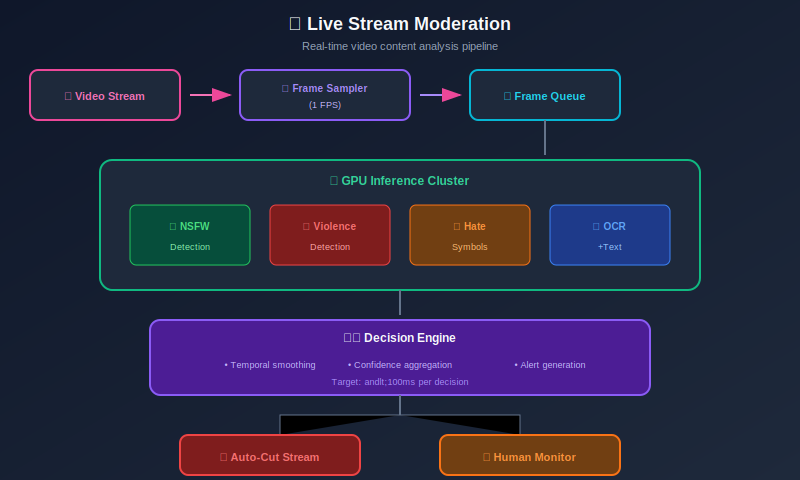

# Case Studies in Content Moderation

## Table of Contents

- [Case Study 1: Social Media Platform](#case-study-1-social-media-platform)

- [Case Study 2: Video Streaming Platform](#case-study-2-video-streaming-platform)

- [Case Study 3: E-commerce Marketplace](#case-study-3-e-commerce-marketplace)

- [Case Study 4: Gaming Platform](#case-study-4-gaming-platform)

- [Case Study 5: Messaging App](#case-study-5-messaging-app)

- [Lessons Learned](#lessons-learned)

---

## Case Study 1: Social Media Platform

### Challenge: Scaling Text Moderation for 500M Daily Posts

**Background:**

- 500M+ posts per day across 50+ languages

- Mix of text, images, and video

- Real-time posting requirements (<200ms latency)

- Complex policy with 20+ violation categories

**Architecture:**



**Solution Components:**

```python
class SocialMediaModerationPipeline:
    """
    Production pipeline for social media moderation.
    """

    def __init__(self):
        # Tier 1: Hash matching (known bad content)
        self.hash_matcher = PhotoDNAHashMatcher()

        # Tier 2: Fast keyword/regex filter
        self.fast_filter = FastKeywordFilter(languages=50)

        # Tier 3: ML classifiers
        self.text_classifier = DistilBERTClassifier(
            languages=['en', 'es', 'hi', 'ar', 'pt', 'id']  # Top 6
        )
        self.xlm_classifier = XLMRobertaClassifier()  # Other languages

        # Tier 4: Image classifier
        self.image_classifier = EfficientNetClassifier()

    def moderate(self, post: dict) -> dict:
        """Full moderation pipeline."""
        start_time = time.time()

        # Tier 1: Hash check (<5ms)
        if self.hash_matcher.is_known_bad(post.get('image')):
            return {'action': 'block', 'reason': 'known_bad', 'tier': 1}

        # Tier 2: Fast filter (<10ms)
        fast_result = self.fast_filter.check(post.get('text', ''))
        if fast_result['confidence'] > 0.95:
            return {'action': fast_result['action'], 'tier': 2}

        # Tier 3: ML classification (50-100ms)
        text = post.get('text', '')
        lang = detect_language(text)

        if lang in ['en', 'es', 'hi', 'ar', 'pt', 'id']:
            text_scores = self.text_classifier.predict(text, lang)
        else:
            text_scores = self.xlm_classifier.predict(text)

        # Tier 4: Image if present
        if post.get('image'):
            image_scores = self.image_classifier.predict(post['image'])
            combined_scores = self._combine_scores(text_scores, image_scores)
        else:
            combined_scores = text_scores

        # Decision
        decision = self._make_decision(combined_scores)
        decision['latency_ms'] = (time.time() - start_time) * 1000

        return decision

# Results achieved:
# - 99.2% of content processed in <100ms
# - 0.01% false positive rate
# - 15,000 human reviewers for ~1% of content
# - Cost: $0.0001 per post (ML) + $0.10 per human review

```

**Key Metrics:**

| Metric | Target | Achieved |
|--------|--------|----------|
| P99 Latency | 200ms | 150ms |
| Precision | 95% | 97% |
| Recall | 90% | 88% |
| Human Review Rate | <2% | 1.2% |
| False Positive Rate | <0.1% | 0.08% |

---

## Case Study 2: Video Streaming Platform

### Challenge: Real-time Video Stream Moderation

**Background:**

- 10,000+ concurrent live streams

- Violations must be caught within 30 seconds

- Categories: nudity, violence, self-harm, hate symbols

- Creator monetization at stake

**Architecture:**



**Solution:**

```python
class LiveStreamModerator:
    """
    Real-time live stream moderation.
    """

    def __init__(self):
        self.frame_buffer = {}  # stream_id -> recent frames
        self.alert_cooldown = {}  # Prevent spam
        self.models = self._load_models()

    async def process_frame(self, stream_id: str, frame: np.ndarray,
                           timestamp: float):
        """Process single frame from stream."""

        # Run all models in parallel
        results = await asyncio.gather(
            self.models['nsfw'].predict_async(frame),
            self.models['violence'].predict_async(frame),
            self.models['hate_symbols'].predict_async(frame),
            self.models['ocr'].extract_text_async(frame)
        )

        nsfw_score, violence_score, hate_score, ocr_text = results

        # OCR text through text classifier
        if ocr_text:
            text_scores = await self.models['text'].predict_async(ocr_text)
        else:
            text_scores = {}

        # Aggregate scores
        frame_result = {
            'timestamp': timestamp,
            'scores': {
                'nsfw': nsfw_score,
                'violence': violence_score,
                'hate_symbols': hate_score,
                'text_violation': text_scores.get('violation', 0)
            }
        }

        # Temporal smoothing (prevent flicker)
        smoothed = self._temporal_smooth(stream_id, frame_result)

        # Check for action
        action = self._check_thresholds(smoothed)

        if action['should_act']:
            await self._take_action(stream_id, action)

        return frame_result

    def _temporal_smooth(self, stream_id: str, frame_result: dict) -> dict:
        """Smooth predictions over recent frames."""
        if stream_id not in self.frame_buffer:
            self.frame_buffer[stream_id] = []

        buffer = self.frame_buffer[stream_id]
        buffer.append(frame_result)

        # Keep last 5 frames (5 seconds at 1 FPS)
        if len(buffer) > 5:
            buffer.pop(0)

        # Average scores
        smoothed_scores = {}
        for key in frame_result['scores']:
            values = [f['scores'][key] for f in buffer]
            smoothed_scores[key] = np.mean(values)

        return {'scores': smoothed_scores, 'frame_count': len(buffer)}

    async def _take_action(self, stream_id: str, action: dict):
        """Take moderation action on stream."""
        if action['severity'] == 'critical':
            # Immediate cut
            await self._cut_stream(stream_id)
            await self._notify_streamer(stream_id, 'Stream terminated')
            await self._log_incident(stream_id, action)

        elif action['severity'] == 'high':
            # Alert human monitor
            await self._alert_monitor(stream_id, action)

        elif action['severity'] == 'medium':
            # Warning to streamer
            await self._warn_streamer(stream_id)

# Performance achieved:
# - 30-second detection latency
# - 99.5% uptime
# - <0.01% false stream terminations
# - 50 human monitors for 10,000 streams

```

---

## Case Study 3: E-commerce Marketplace

### Challenge: Product Listing Moderation

**Background:**

- 5M new listings per day

- Prohibited items: weapons, drugs, counterfeit

- Product images + descriptions

- Multi-language (15 primary markets)

**Solution:**

```python
class ProductModerationPipeline:
    """
    E-commerce product listing moderation.
    """

    PROHIBITED_CATEGORIES = [
        'weapons', 'drugs', 'counterfeit', 'adult',
        'stolen_goods', 'endangered_species', 'hazardous'
    ]

    def __init__(self):
        self.text_classifier = MultilingualProductClassifier()
        self.image_classifier = ProductImageClassifier()
        self.brand_detector = BrandDetector()
        self.price_anomaly_detector = PriceAnomalyDetector()

    def moderate_listing(self, listing: dict) -> dict:
        """Moderate product listing."""
        signals = []

        # 1. Text analysis
        text_result = self._analyze_text(listing)
        signals.append(('text', text_result))

        # 2. Image analysis
        image_result = self._analyze_images(listing['images'])
        signals.append(('image', image_result))

        # 3. Brand/counterfeit check
        brand_result = self._check_brand(listing)
        signals.append(('brand', brand_result))

        # 4. Price anomaly (too good to be true)
        price_result = self._check_price_anomaly(listing)
        signals.append(('price', price_result))

        # 5. Seller history
        seller_result = self._check_seller(listing['seller_id'])
        signals.append(('seller', seller_result))

        # Combine signals
        decision = self._make_decision(signals)

        return decision

    def _analyze_text(self, listing: dict) -> dict:
        """Analyze listing text."""
        text = f"{listing['title']} {listing['description']}"

        # Classify
        categories = self.text_classifier.predict(text)

        # Check for prohibited terms
        prohibited_terms = self._check_prohibited_terms(text)

        return {
            'categories': categories,
            'prohibited_terms': prohibited_terms,
            'language': detect_language(text)
        }

    def _check_brand(self, listing: dict) -> dict:
        """Check for potential counterfeit."""
        # Detect brand mentions
        brands = self.brand_detector.detect(listing['title'])

        if not brands:
            return {'is_branded': False}

        # Check if seller is authorized
        for brand in brands:
            is_authorized = self._is_authorized_seller(
                listing['seller_id'], brand
            )

            if not is_authorized:
                # Price check for counterfeit signal
                is_suspiciously_cheap = self.price_anomaly_detector.check(
                    listing['price'],
                    brand,
                    listing['category']
                )

                if is_suspiciously_cheap:
                    return {
                        'is_branded': True,
                        'brand': brand,
                        'authorized': False,
                        'counterfeit_risk': 'high'
                    }

        return {'is_branded': True, 'authorized': True}

# Results:
# - 99.5% of prohibited items caught
# - <0.1% false positive rate on legitimate sellers
# - Counterfeit detection: 85% precision
# - Processing: 5M listings/day with 100 GPU cluster

```

---

## Case Study 4: Gaming Platform

### Challenge: Real-time Voice and Chat Moderation

**Background:**

- 50M concurrent players

- Voice chat: 10M active voice channels

- Text chat: 500K messages per minute

- Zero tolerance for harassment and cheating

**Solution:**

```python
class GamingModerationSystem:
    """
    Real-time gaming platform moderation.
    """

    def __init__(self):
        # Text moderation
        self.text_classifier = GamingTextClassifier()  # Trained on gaming slang

        # Voice moderation
        self.voice_transcriber = WhisperTranscriber()
        self.voice_classifier = VoiceToxicityClassifier()

        # Behavior analysis
        self.behavior_analyzer = PlayerBehaviorAnalyzer()

    async def moderate_voice(self, audio_chunk: bytes,
                            channel_id: str, player_id: str):
        """Moderate voice chat in real-time."""

        # Transcribe (streaming)
        text = await self.voice_transcriber.transcribe(audio_chunk)

        if not text:
            return None

        # Classify
        result = self.text_classifier.predict(text)

        # Consider context
        context = {
            'is_competitive_match': await self._is_competitive(channel_id),
            'player_history': await self._get_player_history(player_id),
            'channel_settings': await self._get_channel_settings(channel_id)
        }

        # Gaming context allows more aggressive language
        adjusted_threshold = self._adjust_threshold(context)

        if result['toxicity'] > adjusted_threshold:
            return await self._take_action(player_id, result)

        return None

    def _adjust_threshold(self, context: dict) -> float:
        """Adjust thresholds based on gaming context."""
        base_threshold = 0.8

        # Competitive matches: slightly more lenient
        if context['is_competitive_match']:
            base_threshold += 0.05

        # Repeat offenders: stricter
        if context['player_history']['violations'] > 2:
            base_threshold -= 0.1

        # Age-restricted channels: stricter
        if context['channel_settings'].get('age_restricted'):
            base_threshold -= 0.05

        return base_threshold

    async def analyze_behavior(self, player_id: str,
                              game_events: list) -> dict:
        """Analyze player behavior for toxicity patterns."""

        patterns = self.behavior_analyzer.analyze(game_events)

        toxic_behaviors = {
            'intentional_feeding': patterns.get('death_pattern') == 'intentional',
            'griefing_teammates': patterns.get('friendly_fire_rate', 0) > 0.3,
            'afk_abuse': patterns.get('afk_periods', 0) > 5,
            'chat_spam': patterns.get('chat_rate', 0) > 10  # per minute
        }

        if any(toxic_behaviors.values()):
            return {
                'is_toxic': True,
                'behaviors': toxic_behaviors,
                'recommendation': self._get_recommendation(toxic_behaviors)
            }

        return {'is_toxic': False}

# Results:
# - Voice moderation latency: <2 seconds
# - 40% reduction in reported harassment
# - 15% reduction in player churn due to toxicity
# - Cost: $2M/month for 50M concurrent players

```

---

## Case Study 5: Messaging App

### Challenge: E2E Encrypted Messaging Moderation

**Background:**

- End-to-end encryption prevents server-side inspection

- Still need to prevent abuse (spam, CSAM, scams)

- Balance privacy with safety

- Regulatory pressure

**Solution:**

```python
class PrivateMessagingModeration:
    """
    Moderation for encrypted messaging.
    Respects E2E encryption while enabling safety.
    """

    def __init__(self):
        # Client-side detection (on device)
        self.on_device_classifier = OnDeviceClassifier()

        # Metadata analysis (server-side)
        self.metadata_analyzer = MetadataAnalyzer()

        # Known bad hash matching (PhotoDNA on device)
        self.hash_matcher = OnDeviceHashMatcher()

    def on_device_scan(self, message: dict) -> dict:
        """
        Client-side scanning before encryption.
        Results sent to server only if violation detected.
        """

        violations = []

        # Image hash matching (for CSAM)
        if message.get('images'):
            for image in message['images']:
                hash_result = self.hash_matcher.check(image)
                if hash_result['is_match']:
                    violations.append({
                        'type': 'known_csam',
                        'hash': hash_result['hash'],
                        'action': 'block_and_report'
                    })

        # On-device ML classification
        if message.get('text'):
            ml_result = self.on_device_classifier.classify(message['text'])

            if ml_result['spam_score'] > 0.9:
                violations.append({
                    'type': 'spam',
                    'score': ml_result['spam_score'],
                    'action': 'warn_user'
                })

        if violations:
            # Send only violation metadata (not content)
            self._report_to_server({
                'user_id': message['sender_id'],
                'violation_types': [v['type'] for v in violations],
                'timestamp': datetime.utcnow()
            })

        return {'violations': violations, 'allow_send': len(violations) == 0}

    def server_side_metadata_analysis(self, user_id: str) -> dict:
        """
        Analyze metadata patterns without reading content.
        """
        metadata = self.metadata_analyzer.get_user_patterns(user_id)

        signals = {}

        # Spam patterns
        if metadata['messages_per_minute'] > 20:
            signals['spam_likely'] = True

        # Broadcast patterns (1 sender, many recipients)
        if metadata['unique_recipients_today'] > 100:
            signals['broadcast_pattern'] = True

        # New account bulk messaging
        if metadata['account_age_hours'] < 24 and metadata['messages_today'] > 50:
            signals['new_account_bulk'] = True

        # Group spam (same message to many groups)
        if metadata['groups_messaged_today'] > 20:
            signals['group_spam_likely'] = True

        if any(signals.values()):
            return {
                'action': 'rate_limit',
                'signals': signals
            }

        return {'action': 'allow'}

# Results:
# - Privacy preserved (no content reading)
# - 99% of CSAM blocked via hash matching
# - 80% spam reduction via metadata analysis
# - User trust maintained

```

---

## Lessons Learned

### Key Takeaways Across Cases

| Lesson | Description |
|--------|-------------|
| **Tiered Processing** | Use cheap/fast methods first, expensive only when needed |
| **Context Matters** | Gaming ≠ Professional network ≠ Children's platform |
| **Human-ML Hybrid** | ML for scale, humans for nuance |
| **Privacy Trade-offs** | On-device processing enables privacy-preserving moderation |
| **Continuous Learning** | Models must evolve with content trends |
| **Transparency** | Users trust platforms that explain decisions |
| **Cultural Sensitivity** | One-size-fits-all doesn't work globally |

### Common Pitfalls

1. **Over-relying on keywords** - Easy to evade

2. **Ignoring context** - Same content, different meaning

3. **Under-investing in human review** - Edge cases need humans

4. **Neglecting moderator well-being** - Burnout is real

5. **Not planning for adversaries** - Bad actors adapt

6. **Ignoring false positives** - Users lose trust

---

## Summary

These case studies demonstrate:

1. **Scale requires automation** - ML handles 95%+ of decisions

2. **Speed varies by use case** - Live streams need real-time, posts can wait

3. **Multi-modal is essential** - Text + image + behavior

4. **Privacy can coexist with safety** - On-device processing, metadata analysis

5. **Context-specific tuning** - Gaming vs professional vs kids

---

*Previous: [Legal & Ethical Considerations](../14_legal_ethical_considerations/README.md)*
*Back to: [Main Overview](../README.md)*

---

<div align="center">

**[⬆ Back to Top](#)** | **[📚 Main Repository](https://github.com/Gaurav14cs17/ml_system_design)**

Made with 💜 by [Gaurav14cs17](https://github.com/Gaurav14cs17)

</div>
