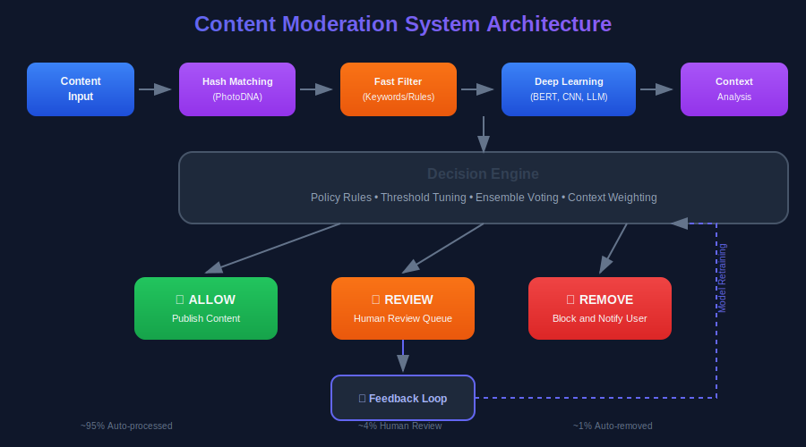
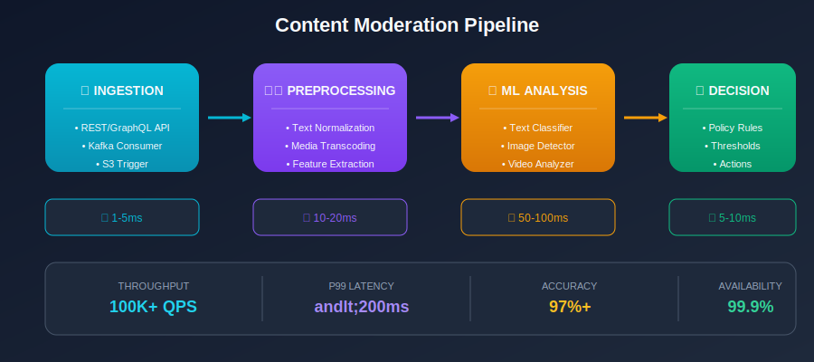
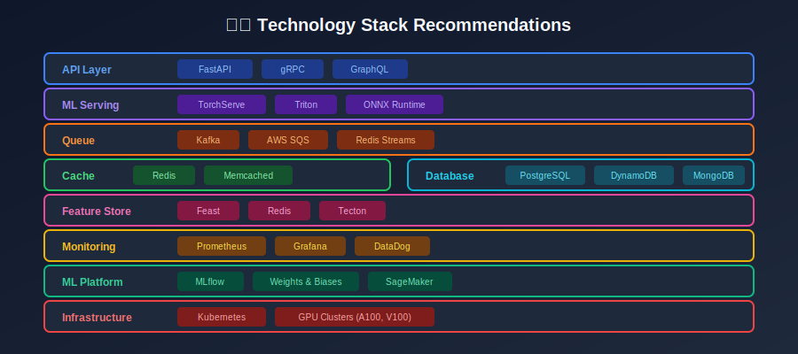

# Content Moderation ML System Design

> A comprehensive guide to designing and building machine learning systems for content moderation at scale.

## Overview



Content moderation is one of the most challenging ML system design problems, requiring a blend of:

- **Machine Learning**: Multi-modal classification, NLP, computer vision

- **System Design**: Low-latency, high-throughput distributed systems

- **Product Design**: User experience, transparency, appeals

- **Policy**: Defining and enforcing community standards

- **Ethics**: Balancing safety with free expression

This guide covers the complete lifecycle of building production-grade content moderation systems.

---

## System Design at a Glance



---

## Table of Contents

### Part 1: Foundations

| Chapter | Topic | Description |
|---------|-------|-------------|
| 01 | [Introduction](./01_introduction/README.md) | What is content moderation, why it matters |
| 02 | [System Requirements & Architecture](./02_system_requirements_architecture/README.md) | Functional/non-functional requirements, high-level design |
| 03 | [Data Collection & Labeling](./03_data_collection_labeling/README.md) | Training data strategies, annotation workflows |

### Part 2: ML Components

| Chapter | Topic | Description |
|---------|-------|-------------|
| 04 | [Text Moderation](./04_text_moderation/README.md) | NLP for toxic text, hate speech, spam detection |
| 05 | [Image & Video Moderation](./05_image_video_moderation/README.md) | Computer vision for NSFW, violence, hate symbols |
| 06 | [Model Training & Selection](./06_model_training_selection/README.md) | Training pipelines, loss functions, optimization |
| 07 | [Feature Engineering](./07_feature_engineering/README.md) | Text, user, contextual, and graph features |

### Part 3: System Components

| Chapter | Topic | Description |
|---------|-------|-------------|
| 08 | [Model Serving & Inference](./08_model_serving_inference/README.md) | Low-latency serving, batching, caching |
| 09 | [Evaluation Metrics](./09_evaluation_metrics/README.md) | Precision, recall, fairness, business metrics |
| 10 | [Human-in-the-Loop](./10_human_in_the_loop/README.md) | Review queues, quality assurance, well-being |
| 11 | [Scalability & Performance](./11_scalability_performance/README.md) | Horizontal scaling, optimization, cost |
| 12 | [Monitoring & Alerting](./12_monitoring_alerting/README.md) | Metrics, dashboards, incident response |

### Part 4: Advanced Topics

| Chapter | Topic | Description |
|---------|-------|-------------|
| 13 | [Edge Cases & Adversarial](./13_edge_cases_adversarial/README.md) | Handling ambiguity, defeating evasion |
| 14 | [Legal & Ethical Considerations](./14_legal_ethical_considerations/README.md) | Compliance, fairness, transparency |
| 15 | [Case Studies](./15_case_studies/README.md) | Real-world implementations at scale |

---

## Quick Reference

### Key Design Decisions

| Decision | Options | Trade-offs |
|----------|---------|------------|
| **Sync vs Async** | Real-time / Background | Latency vs Accuracy |
| **Model Size** | DistilBERT / BERT / LLM | Speed vs Precision |
| **Human Review** | All flagged / Sampling | Cost vs Coverage |
| **Threshold** | High precision / High recall | FP vs FN |
| **Caching** | Content hash / Semantic | Hit rate vs Storage |

### Technology Stack Recommendations



### Scale Reference

| Platform Size | Daily Content | Recommended Architecture |
|--------------|---------------|-------------------------|
| Small (<1M) | 100K items | Monolith, CPU inference |
| Medium (1-50M) | 1-10M items | Microservices, GPU pods |
| Large (50-500M) | 10-100M items | Distributed, multi-region |
| Massive (500M+) | 1B+ items | Global, custom hardware |

---

## Key Metrics to Track

### ML Metrics

- **Precision**: % of flagged content that is actually violation

- **Recall**: % of violations that are caught

- **F1 Score**: Harmonic mean of precision and recall

- **AUC-ROC**: Model discrimination ability

- **Latency**: P50, P95, P99 inference time

### Operational Metrics

- **Throughput**: Requests per second

- **Queue Depth**: Items waiting for review

- **Error Rate**: Failed moderation requests

- **Human Review Rate**: % needing human decision

### Business Metrics

- **Violation Rate**: % of content that violates policies

- **Appeal Rate**: % of decisions appealed

- **Overturn Rate**: % of appeals successful

- **User Reports**: Reports per 1M content views

---

## Getting Started

### Prerequisites

```bash
# Python 3.9+
python --version

# Create virtual environment
python -m venv venv
source venv/bin/activate

# Install dependencies
pip install torch transformers
pip install fastapi uvicorn
pip install pillow opencv-python
pip install redis kafka-python
pip install prometheus-client
pip install scikit-learn pandas numpy

```

### Quick Start Example

```python
from transformers import pipeline

# Load pre-trained toxicity classifier
classifier = pipeline(
    "text-classification",
    model="unitary/toxic-bert"
)

# Moderate content
result = classifier("This is a test message")
print(result)
# [{'label': 'toxic', 'score': 0.002}]

# Make decision
def moderate(text, threshold=0.5):
    result = classifier(text)[0]
    if result['label'] == 'toxic' and result['score'] > threshold:
        return {'decision': 'remove', 'score': result['score']}
    return {'decision': 'allow', 'score': result['score']}

print(moderate("Hello world!"))
# {'decision': 'allow', 'score': 0.002}

```

---

## Learning Path

### Beginner (Week 1-2)

1. Read [Introduction](./01_introduction/README.md)

2. Understand [System Architecture](./02_system_requirements_architecture/README.md)

3. Learn [Text Moderation](./04_text_moderation/README.md) basics

### Intermediate (Week 3-4)

1. Deep dive into [Image/Video Moderation](./05_image_video_moderation/README.md)

2. Explore [Model Training](./06_model_training_selection/README.md)

3. Understand [Evaluation Metrics](./09_evaluation_metrics/README.md)

### Advanced (Week 5-6)

1. Study [Model Serving](./08_model_serving_inference/README.md)

2. Learn [Scalability](./11_scalability_performance/README.md)

3. Review [Case Studies](./15_case_studies/README.md)

### Expert (Week 7-8)

1. Master [Edge Cases](./13_edge_cases_adversarial/README.md)

2. Understand [Legal/Ethics](./14_legal_ethical_considerations/README.md)

3. Implement end-to-end system

---

## Interview Preparation

### Common Interview Questions

1. **Design a content moderation system for Instagram**
   - Focus: Scale (2B daily uploads), multimodal, real-time

2. **How would you detect hate speech across 50 languages?**
   - Focus: Multilingual NLP, data collection, cultural context

3. **Design a system to moderate live video streams**
   - Focus: Real-time processing, frame sampling, latency

4. **How do you handle false positives in moderation?**
   - Focus: User experience, appeals, threshold tuning

5. **How do you prevent adversarial attacks on your models?**
   - Focus: Normalization, ensemble, continuous adaptation

### Key Points to Cover

- [ ] Requirements gathering (functional + non-functional)

- [ ] High-level architecture diagram

- [ ] Data pipeline and labeling strategy

- [ ] ML model selection and training

- [ ] Serving infrastructure (latency, throughput)

- [ ] Human review integration

- [ ] Monitoring and alerting

- [ ] Edge cases and adversarial handling

- [ ] Scalability and cost optimization

- [ ] Compliance and ethics

---

## Contributing

This is a living document. Contributions welcome for:

- New case studies

- Code examples

- Updated regulations

- Industry best practices

---

## References

### Papers

- "Challenges in Content Moderation" - Meta AI Research

- "The Moderators" - UCLA Research

- "Fairness in Machine Learning" - Google Research

### Books

- "Custodians of the Internet" - Tarleton Gillespie

- "Content Moderation at Scale" - Harvard Berkman Klein Center

### Regulations

- EU Digital Services Act (DSA)

- German NetzDG

- US Section 230
- UK Online Safety Bill

---

## License

This educational content is provided for learning purposes.

---

*Last Updated: January 2025*

---

<div align="center">

**[⬆ Back to Top](#)** | **[📚 Main Repository](https://github.com/Gaurav14cs17/ml_system_design)**

Made with 💜 by [Gaurav14cs17](https://github.com/Gaurav14cs17)

</div>
