# Introduction to Time Series Forecasting

<p align="center">
  
  
  
</p>

## Table of Contents
- [What is Time Series Data?](#what-is-time-series-data)
- [Why Time Series Forecasting Matters](#why-time-series-forecasting-matters)
- [Types of Time Series Problems](#types-of-time-series-problems)
- [Components of Time Series](#components-of-time-series)
- [Stationarity and Its Importance](#stationarity-and-its-importance)
- [Common Applications](#common-applications)
- [Challenges in Time Series Forecasting](#challenges-in-time-series-forecasting)
- [The ML System Design Perspective](#the-ml-system-design-perspective)

---

## What is Time Series Data?

Time series data is a sequence of data points collected or recorded at successive points in time, typically at uniform intervals. Unlike traditional tabular data where each row is independent, time series data has an inherent **temporal ordering** that carries crucial information.

### Visual: Time Series Concept

```mermaid
graph LR
    subgraph "Time Series Data Flow"
        A[t₁] -->|Δt| B[t₂]
        B -->|Δt| C[t₃]
        C -->|Δt| D[t₄]
        D -->|Δt| E[t₅]
        E -->|Δt| F["..."]
        F -->|Δt| G[tₙ]
    end

    style A fill:#4CAF50,color:white
    style B fill:#4CAF50,color:white
    style C fill:#4CAF50,color:white
    style D fill:#4CAF50,color:white
    style E fill:#4CAF50,color:white
    style G fill:#2196F3,color:white

```



### Key Characteristics

<table>
<tr>
<td width="50%">

**Data Structure**

| Timestamp | Value | Features |
|-----------|-------|----------|
| 2024-01-01 | 100.5 | feat_1 |
| 2024-01-02 | 102.3 | feat_2 |
| 2024-01-03 | 98.7 | feat_3 |
| ... | ... | ... |

</td>
<td width="50%">

**Visual Representation**


</td>
</tr>
</table>

### Univariate vs Multivariate Time Series

| Type | Description | Example |
|------|-------------|---------|
| **Univariate** | Single variable measured over time | Stock closing price |
| **Multivariate** | Multiple variables measured over time | Weather data (temp, humidity, pressure) |

```python
# Example: Univariate Time Series
import pandas as pd
import numpy as np

# Single stock price over time
univariate_ts = pd.Series(
    data=[100, 102, 101, 105, 108],
    index=pd.date_range('2024-01-01', periods=5, freq='D'),
    name='stock_price'
)

# Example: Multivariate Time Series
multivariate_ts = pd.DataFrame({
    'temperature': [25.5, 26.1, 24.8, 27.2, 26.5],
    'humidity': [65, 70, 68, 72, 69],
    'pressure': [1013, 1012, 1015, 1010, 1014]
}, index=pd.date_range('2024-01-01', periods=5, freq='D'))

```

---

## Why Time Series Forecasting Matters

Time series forecasting is critical across virtually every industry. The ability to predict future values based on historical patterns drives:

### Business Impact

```mermaid
flowchart TD
    A[📊 FORECASTING<br/>BUSINESS VALUE] --> B[📋 PLANNING]
    A --> C[⚙️ OPERATIONS]
    A --> D[📈 STRATEGY]

    B --> B1[Budgeting]
    B --> B2[Staffing]
    B --> B3[Resources]

    C --> C1[Inventory]
    C --> C2[Scheduling]
    C --> C3[Capacity]

    D --> D1[Investment]
    D --> D2[Expansion]
    D --> D3[Pricing]

    style A fill:#1976D2,color:white,stroke:#1565C0,stroke-width:2px
    style B fill:#388E3C,color:white
    style C fill:#F57C00,color:white
    style D fill:#7B1FA2,color:white

```



<p align="center">
<svg width="600" height="120" xmlns="http://www.w3.org/2000/svg">
  <defs>
    <linearGradient id="grad1" x1="0%" y1="0%" x2="100%" y2="0%">
      <stop offset="0%" style="stop-color:#667eea;stop-opacity:1" />
      <stop offset="100%" style="stop-color:#764ba2;stop-opacity:1" />
    </linearGradient>
  </defs>
  <rect x="10" y="10" width="180" height="100" rx="10" fill="url(#grad1)"/>
  <text x="100" y="50" fill="white" font-size="14" text-anchor="middle" font-weight="bold">📋 PLANNING</text>
  <text x="100" y="75" fill="white" font-size="11" text-anchor="middle">Budgeting • Staffing</text>
  <text x="100" y="92" fill="white" font-size="11" text-anchor="middle">Resources</text>

  <rect x="210" y="10" width="180" height="100" rx="10" fill="#00C851"/>
  <text x="300" y="50" fill="white" font-size="14" text-anchor="middle" font-weight="bold">⚙️ OPERATIONS</text>
  <text x="300" y="75" fill="white" font-size="11" text-anchor="middle">Inventory • Scheduling</text>
  <text x="300" y="92" fill="white" font-size="11" text-anchor="middle">Capacity</text>

  <rect x="410" y="10" width="180" height="100" rx="10" fill="#ff4444"/>
  <text x="500" y="50" fill="white" font-size="14" text-anchor="middle" font-weight="bold">📈 STRATEGY</text>
  <text x="500" y="75" fill="white" font-size="11" text-anchor="middle">Investment • Expansion</text>
  <text x="500" y="92" fill="white" font-size="11" text-anchor="middle">Pricing</text>
</svg>
</p>

### ROI of Accurate Forecasting

| Industry | Forecast Improvement | Business Impact |
|----------|---------------------|-----------------|
| Retail | 1% accuracy increase | 2-3% inventory cost reduction |
| Energy | 10% MAPE improvement | $1M+ annual savings (utility) |
| Finance | Better volatility forecast | Reduced portfolio risk |
| Healthcare | Demand prediction | Optimized staffing, reduced wait times |

---

## Types of Time Series Problems

```mermaid
graph TB
    subgraph "🎯 Time Series Problem Types"
        A[Time Series<br/>Analysis] --> B[Forecasting]
        A --> C[Anomaly Detection]
        A --> D[Classification]
        A --> E[Segmentation]
    end

    style A fill:#1976D2,color:white
    style B fill:#4CAF50,color:white
    style C fill:#FF5722,color:white
    style D fill:#9C27B0,color:white
    style E fill:#FF9800,color:white

```



### 1. 📈 Forecasting (Prediction)
Predicting future values based on historical data.

<p align="center">
<svg width="500" height="100" xmlns="http://www.w3.org/2000/svg">
  <!-- Background -->
  <rect x="0" y="0" width="500" height="100" fill="#f8f9fa"/>

  <!-- Dividing line -->
  <line x1="280" y1="20" x2="280" y2="80" stroke="#333" stroke-width="2" stroke-dasharray="5,5"/>
  <text x="280" y="95" fill="#333" font-size="12" text-anchor="middle">Today</text>

  <!-- Historical data points -->
  <circle cx="50" cy="50" r="8" fill="#4CAF50"/>
  <circle cx="100" cy="40" r="8" fill="#4CAF50"/>
  <circle cx="150" cy="55" r="8" fill="#4CAF50"/>
  <circle cx="200" cy="35" r="8" fill="#4CAF50"/>
  <circle cx="250" cy="45" r="8" fill="#4CAF50"/>

  <!-- Connecting lines for historical -->
  <polyline points="50,50 100,40 150,55 200,35 250,45" fill="none" stroke="#4CAF50" stroke-width="2"/>

  <!-- Future predictions -->
  <circle cx="320" cy="50" r="8" fill="#2196F3" opacity="0.7"/>
  <circle cx="370" cy="40" r="8" fill="#2196F3" opacity="0.5"/>
  <circle cx="420" cy="55" r="8" fill="#2196F3" opacity="0.3"/>

  <!-- Connecting lines for predictions -->
  <polyline points="250,45 320,50 370,40 420,55" fill="none" stroke="#2196F3" stroke-width="2" stroke-dasharray="5,3"/>

  <!-- Labels -->
  <text x="150" y="18" fill="#4CAF50" font-size="12" font-weight="bold">Historical Data</text>
  <text x="370" y="18" fill="#2196F3" font-size="12" font-weight="bold">Forecast</text>
</svg>
</p>

### 2. 🚨 Anomaly Detection
Identifying unusual patterns or outliers in the time series.

<p align="center">
<svg width="500" height="100" xmlns="http://www.w3.org/2000/svg">
  <rect x="0" y="0" width="500" height="100" fill="#f8f9fa"/>

  <!-- Normal data points -->
  <circle cx="50" cy="60" r="6" fill="#4CAF50"/>
  <circle cx="100" cy="55" r="6" fill="#4CAF50"/>
  <circle cx="150" cy="58" r="6" fill="#4CAF50"/>
  <circle cx="200" cy="52" r="6" fill="#4CAF50"/>

  <!-- Anomaly -->
  <circle cx="250" cy="20" r="10" fill="#FF5722"/>
  <text x="250" y="8" fill="#FF5722" font-size="11" text-anchor="middle" font-weight="bold">⚠️ Anomaly!</text>

  <!-- More normal points -->
  <circle cx="300" cy="55" r="6" fill="#4CAF50"/>
  <circle cx="350" cy="60" r="6" fill="#4CAF50"/>
  <circle cx="400" cy="53" r="6" fill="#4CAF50"/>
  <circle cx="450" cy="57" r="6" fill="#4CAF50"/>

  <!-- Connecting line -->
  <polyline points="50,60 100,55 150,58 200,52 250,20 300,55 350,60 400,53 450,57"
            fill="none" stroke="#666" stroke-width="1.5"/>
</svg>
</p>

### 3. 🏷️ Classification
Classifying entire time series into categories.

<p align="center">
<svg width="500" height="140" xmlns="http://www.w3.org/2000/svg">
  <rect x="0" y="0" width="500" height="140" fill="#f8f9fa"/>

  <!-- Series A - Normal wave -->
  <path d="M30,30 Q55,15 80,30 T130,30 T180,30" fill="none" stroke="#4CAF50" stroke-width="2"/>
  <text x="200" y="35" fill="#333" font-size="12">→</text>
  <rect x="220" y="20" width="100" height="25" rx="5" fill="#4CAF50"/>
  <text x="270" y="37" fill="white" font-size="11" text-anchor="middle">Normal ✓</text>

  <!-- Series B - Fault pattern -->
  <path d="M30,70 L55,50 L80,90 L105,50 L130,90 L155,50 L180,70" fill="none" stroke="#FF5722" stroke-width="2"/>
  <text x="200" y="75" fill="#333" font-size="12">→</text>
  <rect x="220" y="60" width="100" height="25" rx="5" fill="#FF5722"/>
  <text x="270" y="77" fill="white" font-size="11" text-anchor="middle">Fault ⚠️</text>

  <!-- Series C - Maintenance -->
  <path d="M30,110 Q55,95 80,110 T130,120 T180,115" fill="none" stroke="#FF9800" stroke-width="2"/>
  <text x="200" y="115" fill="#333" font-size="12">→</text>
  <rect x="220" y="100" width="100" height="25" rx="5" fill="#FF9800"/>
  <text x="270" y="117" fill="white" font-size="11" text-anchor="middle">Maintenance 🔧</text>
</svg>
</p>

### 4. ✂️ Segmentation
Dividing time series into meaningful segments.

<p align="center">
<svg width="500" height="100" xmlns="http://www.w3.org/2000/svg">
  <rect x="0" y="0" width="500" height="100" fill="#f8f9fa"/>

  <!-- Segment 1 - Trend -->
  <rect x="20" y="30" width="100" height="50" rx="5" fill="#E3F2FD" stroke="#2196F3" stroke-width="2"/>
  <path d="M30,70 L50,60 L70,65 L90,55 L110,45" fill="none" stroke="#2196F3" stroke-width="2"/>
  <text x="70" y="20" fill="#2196F3" font-size="10" text-anchor="middle" font-weight="bold">📈 Trend</text>

  <!-- Segment 2 - Seasonal -->
  <rect x="130" y="30" width="100" height="50" rx="5" fill="#E8F5E9" stroke="#4CAF50" stroke-width="2"/>
  <path d="M140,55 Q155,40 170,55 T200,55 T220,55" fill="none" stroke="#4CAF50" stroke-width="2"/>
  <text x="180" y="20" fill="#4CAF50" font-size="10" text-anchor="middle" font-weight="bold">🔄 Seasonal</text>

  <!-- Segment 3 - Shock -->
  <rect x="240" y="30" width="100" height="50" rx="5" fill="#FFEBEE" stroke="#F44336" stroke-width="2"/>
  <path d="M250,55 L270,55 L280,30 L290,70 L300,55 L330,55" fill="none" stroke="#F44336" stroke-width="2"/>
  <text x="290" y="20" fill="#F44336" font-size="10" text-anchor="middle" font-weight="bold">⚡ Shock</text>

  <!-- Segment 4 - Recovery -->
  <rect x="350" y="30" width="100" height="50" rx="5" fill="#FFF3E0" stroke="#FF9800" stroke-width="2"/>
  <path d="M360,70 L380,65 L400,55 L420,50 L440,50" fill="none" stroke="#FF9800" stroke-width="2"/>
  <text x="400" y="20" fill="#FF9800" font-size="10" text-anchor="middle" font-weight="bold">🔄 Recovery</text>
</svg>
</p>

---

## Components of Time Series

Understanding time series decomposition is fundamental to building effective forecasting models.

### The Four Components

<p align="center">
<svg width="700" height="120" xmlns="http://www.w3.org/2000/svg">
  <defs>
    <linearGradient id="formula-grad" x1="0%" y1="0%" x2="100%" y2="0%">
      <stop offset="0%" style="stop-color:#667eea;stop-opacity:1" />
      <stop offset="100%" style="stop-color:#764ba2;stop-opacity:1" />
    </linearGradient>
  </defs>
  <rect x="0" y="0" width="700" height="120" rx="12" fill="url(#formula-grad)"/>
  <text x="350" y="35" fill="white" font-size="18" text-anchor="middle" font-weight="bold" font-family="monospace">
    Additive: Y(t) = T(t) + S(t) + C(t) + ε(t)
  </text>
  <text x="350" y="65" fill="white" font-size="18" text-anchor="middle" font-weight="bold" font-family="monospace">
    Multiplicative: Y(t) = T(t) × S(t) × C(t) × ε(t)
  </text>
  <text x="350" y="100" fill="white" font-size="12" text-anchor="middle" opacity="0.9">
    Use multiplicative when seasonal variation scales with the level of the series
  </text>
</svg>
</p>

### Mathematical Definitions

| Component | Symbol | Mathematical Form | Characteristics |
|-----------|--------|-------------------|-----------------|
| **Trend** | $T\_t$ | $T\_t = \beta\_0 + \beta\_1 t$ (linear) or $T\_t = \beta\_0 + \beta\_1 t + \beta\_2 t^2$ (quadratic) | Long-term direction |
| **Seasonal** | $S\_t$ | $S\_t = \sum\_{k=1}^{K} [a\_k \cos(2\pi kt/m) + b\_k \sin(2\pi kt/m)]$ | Period $m$, Fourier harmonics |
| **Cyclical** | $C\_t$ | Irregular fluctuations with variable period | Business cycles, typically 2-10 years |
| **Residual** | $\varepsilon\_t$ | $\varepsilon\_t \sim \text{WN}(0, \sigma^2)$ (white noise) | $\mathbb{E}[\varepsilon\_t] = 0$, $\text{Cov}(\varepsilon\_t, \varepsilon\_s) = 0$ for $t \neq s$ |

### Seasonal Pattern with Fourier Series

For a seasonal component with period $m$, we can express it as:

```math
S_t = \sum_{k=1}^{K} \left[ a_k \cos\left(\frac{2\pi kt}{m}\right) + b_k \sin\left(\frac{2\pi kt}{m}\right) \right]

```

Where $K \leq \lfloor m/2 \rfloor$ harmonics capture different frequency components of the seasonality.

### Visual Decomposition

<p align="center">
<svg width="650" height="400" xmlns="http://www.w3.org/2000/svg">
  <!-- Background -->
  <rect x="0" y="0" width="650" height="400" fill="#fafafa" rx="10"/>

  <!-- Title -->
  <text x="325" y="25" fill="#333" font-size="16" text-anchor="middle" font-weight="bold">📊 Time Series Decomposition</text>

  <!-- Original Series -->
  <rect x="20" y="40" width="610" height="70" fill="#E3F2FD" rx="5"/>
  <text x="35" y="58" fill="#1976D2" font-size="12" font-weight="bold">Original Series (Combined)</text>
  <path d="M50,90 Q80,60 110,85 T170,80 T230,95 T290,70 T350,85 T410,65 T470,90 T530,60 T590,80"
        fill="none" stroke="#1976D2" stroke-width="3"/>

  <!-- Equals sign -->
  <text x="325" y="130" fill="#333" font-size="24" text-anchor="middle">=</text>

  <!-- Trend -->
  <rect x="20" y="140" width="200" height="70" fill="#E8F5E9" rx="5"/>
  <text x="35" y="158" fill="#388E3C" font-size="11" font-weight="bold">📈 Trend (T)</text>
  <path d="M35,195 L80,190 L130,180 L180,165 L200,160"
        fill="none" stroke="#388E3C" stroke-width="2.5"/>

  <!-- Plus sign -->
  <text x="240" y="180" fill="#333" font-size="24" text-anchor="middle">+</text>

  <!-- Seasonality -->
  <rect x="260" y="140" width="200" height="70" fill="#FFF3E0" rx="5"/>
  <text x="275" y="158" fill="#F57C00" font-size="11" font-weight="bold">🔄 Seasonal (S)</text>
  <path d="M275,180 Q295,160 315,180 T355,180 T395,180 T435,180"
        fill="none" stroke="#F57C00" stroke-width="2.5"/>

  <!-- Plus sign -->
  <text x="480" y="180" fill="#333" font-size="24" text-anchor="middle">+</text>

  <!-- Cyclical -->
  <rect x="500" y="140" width="130" height="70" fill="#FCE4EC" rx="5"/>
  <text x="515" y="158" fill="#C2185B" font-size="11" font-weight="bold">〰️ Cyclical (C)</text>
  <path d="M515,180 Q545,165 575,185 Q605,195 610,175"
        fill="none" stroke="#C2185B" stroke-width="2.5"/>

  <!-- Plus sign for residual row -->
  <text x="325" y="240" fill="#333" font-size="24" text-anchor="middle">+</text>

  <!-- Residual -->
  <rect x="210" y="250" width="230" height="70" fill="#ECEFF1" rx="5"/>
  <text x="225" y="268" fill="#546E7A" font-size="11" font-weight="bold">✨ Residual (R)</text>
  <!-- Random dots for residual -->
  <circle cx="240" cy="295" r="2" fill="#546E7A"/>
  <circle cx="260" cy="285" r="2" fill="#546E7A"/>
  <circle cx="280" cy="300" r="2" fill="#546E7A"/>
  <circle cx="300" cy="290" r="2" fill="#546E7A"/>
  <circle cx="320" cy="305" r="2" fill="#546E7A"/>
  <circle cx="340" cy="280" r="2" fill="#546E7A"/>
  <circle cx="360" cy="295" r="2" fill="#546E7A"/>
  <circle cx="380" cy="288" r="2" fill="#546E7A"/>
  <circle cx="400" cy="302" r="2" fill="#546E7A"/>
  <circle cx="420" cy="292" r="2" fill="#546E7A"/>

  <!-- Legend -->
  <rect x="150" y="340" width="350" height="45" fill="white" rx="5" stroke="#ddd"/>
  <text x="325" y="360" fill="#333" font-size="11" text-anchor="middle" font-weight="bold">Decomposition Methods</text>
  <text x="325" y="378" fill="#666" font-size="10" text-anchor="middle">Additive: Y = T + S + R  |  Multiplicative: Y = T × S × R</text>
</svg>
</p>

### Python Implementation

```python
from statsmodels.tsa.seasonal import seasonal_decompose
import matplotlib.pyplot as plt

# Decompose time series
decomposition = seasonal_decompose(
    time_series,
    model='additive',  # or 'multiplicative'
    period=12  # for monthly data with yearly seasonality
)

# Access components
trend = decomposition.trend
seasonal = decomposition.seasonal
residual = decomposition.resid

# Visualize
fig = decomposition.plot()
plt.tight_layout()
plt.show()

```

### Additive vs Multiplicative Decomposition

| Model | Formula | When to Use |
|-------|---------|-------------|
| **Additive** | Y = T + S + R | Seasonal amplitude is constant |
| **Multiplicative** | Y = T × S × R | Seasonal amplitude varies with trend |

---

## Stationarity and Its Importance

### What is Stationarity?

A time series is **stationary** if its statistical properties remain constant over time. This is a fundamental requirement for many forecasting methods.


### Mathematical Definition

A stochastic process $\{Y\_t\}$ is **weakly stationary** (or covariance stationary) if:

```math
\mathbb{E}[Y_t] = \mu \quad \forall t \quad \text{(constant mean)}
\text{Var}(Y_t) = \sigma^2 < \infty \quad \forall t \quad \text{(constant finite variance)}
\text{Cov}(Y_t, Y_{t+h}) = \gamma(h) \quad \forall t \quad \text{(covariance depends only on lag } h\text{)}

```

### The Autocovariance Function

For a stationary process, the **autocovariance function** is:

```math
\gamma(h) = \text{Cov}(Y_t, Y_{t+h}) = \mathbb{E}[(Y_t - \mu)(Y_{t+h} - \mu)]

```

And the **autocorrelation function (ACF)** is:

```math
\rho(h) = \frac{\gamma(h)}{\gamma(0)} = \frac{\text{Cov}(Y_t, Y_{t+h})}{\text{Var}(Y_t)}

```

**Properties:**
- $\rho(0) = 1$
- $|\rho(h)| \leq 1$
- $\rho(h) = \rho(-h)$ (symmetry)

### Types of Stationarity

| Type | Definition | Mathematical Condition |
|------|------------|----------------------|
| **Strict Stationarity** | Joint distribution is time-invariant | $F(y\_{t\_1}, ..., y\_{t\_k}) = F(y\_{t\_1+h}, ..., y\_{t\_k+h})$ |
| **Weak Stationarity** | First two moments are time-invariant | $\mathbb{E}[Y\_t] = \mu$, $\text{Cov}(Y\_t, Y\_{t+h}) = \gamma(h)$ |
| **Trend Stationarity** | Stationary after removing deterministic trend | $Y\_t = f(t) + \varepsilon\_t$ where $\varepsilon\_t$ is stationary |
| **Difference Stationarity** | Stationary after differencing | $\nabla Y\_t = Y\_t - Y\_{t-1}$ is stationary |

### Testing for Stationarity

```python
from statsmodels.tsa.stattools import adfuller, kpss

def check_stationarity(series):
    """
    Perform ADF and KPSS tests for stationarity
    """
    # Augmented Dickey-Fuller Test
    adf_result = adfuller(series.dropna())
    print(f"ADF Statistic: {adf_result[0]:.4f}")
    print(f"p-value: {adf_result[1]:.4f}")
    print(f"Stationary (ADF): {adf_result[1] < 0.05}")

    # KPSS Test
    kpss_result = kpss(series.dropna(), regression='c')
    print(f"\nKPSS Statistic: {kpss_result[0]:.4f}")
    print(f"p-value: {kpss_result[1]:.4f}")
    print(f"Stationary (KPSS): {kpss_result[1] > 0.05}")

    return adf_result[1] < 0.05 and kpss_result[1] > 0.05

# Usage
is_stationary = check_stationarity(time_series)

```

### Making Series Stationary

| Technique | Code | Use Case |
|-----------|------|----------|
| **Differencing** | `series.diff()` | Remove trend |
| **Log Transform** | `np.log(series)` | Stabilize variance |
| **Seasonal Differencing** | `series.diff(12)` | Remove seasonality |
| **Detrending** | `series - series.rolling(window).mean()` | Remove moving average trend |

---

## Common Applications

### Industry Applications Map


<p align="center">
<svg width="700" height="280" xmlns="http://www.w3.org/2000/svg">
  <defs>
    <filter id="shadow" x="-20%" y="-20%" width="140%" height="140%">
      <feDropShadow dx="2" dy="2" stdDeviation="3" flood-opacity="0.2"/>
    </filter>
  </defs>

  <!-- Title -->
  <text x="350" y="25" fill="#333" font-size="16" text-anchor="middle" font-weight="bold">🌐 Industry Applications</text>

  <!-- Row 1 -->
  <!-- Finance -->
  <rect x="20" y="45" width="200" height="90" rx="10" fill="#1565C0" filter="url(#shadow)"/>
  <text x="120" y="70" fill="white" font-size="14" text-anchor="middle" font-weight="bold">💰 FINANCE</text>
  <text x="120" y="90" fill="white" font-size="11" text-anchor="middle" opacity="0.9">Stock Price • Volatility</text>
  <text x="120" y="105" fill="white" font-size="11" text-anchor="middle" opacity="0.9">Risk • Fraud Detection</text>
  <text x="120" y="125" fill="#FFD700" font-size="10" text-anchor="middle">📈 High-frequency data</text>

  <!-- Retail -->
  <rect x="240" y="45" width="200" height="90" rx="10" fill="#2E7D32" filter="url(#shadow)"/>
  <text x="340" y="70" fill="white" font-size="14" text-anchor="middle" font-weight="bold">🛒 RETAIL</text>
  <text x="340" y="90" fill="white" font-size="11" text-anchor="middle" opacity="0.9">Demand • Inventory</text>
  <text x="340" y="105" fill="white" font-size="11" text-anchor="middle" opacity="0.9">Sales • Customer Trends</text>
  <text x="340" y="125" fill="#FFD700" font-size="10" text-anchor="middle">📦 SKU-level forecasting</text>

  <!-- Energy -->
  <rect x="460" y="45" width="200" height="90" rx="10" fill="#F57C00" filter="url(#shadow)"/>
  <text x="560" y="70" fill="white" font-size="14" text-anchor="middle" font-weight="bold">⚡ ENERGY</text>
  <text x="560" y="90" fill="white" font-size="11" text-anchor="middle" opacity="0.9">Load • Renewable</text>
  <text x="560" y="105" fill="white" font-size="11" text-anchor="middle" opacity="0.9">Price • Grid Management</text>
  <text x="560" y="125" fill="#FFD700" font-size="10" text-anchor="middle">🌤️ Weather-dependent</text>

  <!-- Row 2 -->
  <!-- Healthcare -->
  <rect x="20" y="155" width="200" height="90" rx="10" fill="#C62828" filter="url(#shadow)"/>
  <text x="120" y="180" fill="white" font-size="14" text-anchor="middle" font-weight="bold">🏥 HEALTHCARE</text>
  <text x="120" y="200" fill="white" font-size="11" text-anchor="middle" opacity="0.9">Patient Volume • Resources</text>
  <text x="120" y="215" fill="white" font-size="11" text-anchor="middle" opacity="0.9">Outbreaks • Staffing</text>
  <text x="120" y="235" fill="#FFD700" font-size="10" text-anchor="middle">🦠 Epidemiological models</text>

  <!-- Weather -->
  <rect x="240" y="155" width="200" height="90" rx="10" fill="#0277BD" filter="url(#shadow)"/>
  <text x="340" y="180" fill="white" font-size="14" text-anchor="middle" font-weight="bold">🌤️ WEATHER</text>
  <text x="340" y="200" fill="white" font-size="11" text-anchor="middle" opacity="0.9">Temperature • Rainfall</text>
  <text x="340" y="215" fill="white" font-size="11" text-anchor="middle" opacity="0.9">Storms • Climate</text>
  <text x="340" y="235" fill="#FFD700" font-size="10" text-anchor="middle">🌍 Spatial-temporal data</text>

  <!-- Transport -->
  <rect x="460" y="155" width="200" height="90" rx="10" fill="#6A1B9A" filter="url(#shadow)"/>
  <text x="560" y="180" fill="white" font-size="14" text-anchor="middle" font-weight="bold">🚗 TRANSPORT</text>
  <text x="560" y="200" fill="white" font-size="11" text-anchor="middle" opacity="0.9">Traffic • Ridership</text>
  <text x="560" y="215" fill="white" font-size="11" text-anchor="middle" opacity="0.9">Delays • Route Planning</text>
  <text x="560" y="235" fill="#FFD700" font-size="10" text-anchor="middle">🗺️ Network effects</text>
</svg>
</p>

### Detailed Use Cases

#### 1. Financial Markets
- **Stock Price Prediction**: Forecasting future prices for trading strategies
- **Volatility Forecasting**: Predicting market volatility for risk management
- **Fraud Detection**: Identifying anomalous transaction patterns

#### 2. Retail & E-commerce
- **Demand Forecasting**: Predicting product demand for inventory optimization
- **Sales Prediction**: Forecasting revenue for budgeting and planning
- **Customer Behavior**: Predicting customer lifetime value trends

#### 3. Energy & Utilities
- **Load Forecasting**: Predicting electricity demand for grid management
- **Renewable Energy**: Forecasting solar/wind generation
- **Price Forecasting**: Predicting energy market prices

#### 4. Healthcare
- **Patient Volume**: Predicting hospital admissions
- **Disease Outbreaks**: Forecasting epidemic spread
- **Resource Planning**: Predicting equipment and staff needs

---

## Challenges in Time Series Forecasting

### The Complexity Landscape


### Key Challenges

| Challenge | Description | Solution Approaches |
|-----------|-------------|---------------------|
| **Non-Stationarity** | Statistical properties change over time | Differencing, transformations |
| **Multiple Seasonalities** | Daily, weekly, yearly patterns overlapping | Fourier features, Prophet, neural nets |
| **Missing Data** | Gaps in the time series | Interpolation, imputation models |
| **Concept Drift** | Underlying patterns change | Online learning, retraining |
| **Exogenous Variables** | External factors affecting the series | Multivariate models, feature engineering |
| **Long-Range Dependencies** | Past events affecting distant future | Attention mechanisms, Transformers |
| **Uncertainty Quantification** | Need for prediction intervals | Probabilistic forecasting |

### Handling Missing Data

```python
import pandas as pd
import numpy as np

def handle_missing_data(series, method='linear'):
    """
    Handle missing values in time series

    Methods:
    - 'linear': Linear interpolation
    - 'ffill': Forward fill
    - 'bfill': Backward fill
    - 'seasonal': Seasonal interpolation
    """
    if method == 'linear':
        return series.interpolate(method='linear')
    elif method == 'ffill':
        return series.ffill()
    elif method == 'bfill':
        return series.bfill()
    elif method == 'seasonal':
        # Use seasonal decomposition for imputation
        from statsmodels.tsa.seasonal import seasonal_decompose
        decomp = seasonal_decompose(series, period=12, extrapolate_trend='freq')
        return decomp.trend + decomp.seasonal
    else:
        raise ValueError(f"Unknown method: {method}")

```

---

## The ML System Design Perspective

Building production-ready time series forecasting systems requires careful consideration of the entire ML lifecycle.

### System Architecture Overview


### Key Design Considerations

#### 1. Data Pipeline Design
- **Real-time vs Batch**: Choose based on latency requirements
- **Data Validation**: Ensure data quality and consistency
- **Feature Store**: Centralize feature computation and serving

#### 2. Model Selection Strategy


#### 3. Serving Infrastructure
- **Batch Predictions**: Pre-compute forecasts on schedule
- **Online Predictions**: Real-time inference for dynamic needs
- **Caching Strategy**: Cache forecasts with appropriate TTL

#### 4. Monitoring & Maintenance

```python
# Example: Forecast monitoring metrics
class ForecastMonitor:
    def __init__(self, threshold_mape=15):
        self.threshold = threshold_mape
        self.history = []

    def evaluate(self, actual, predicted):
        mape = np.mean(np.abs((actual - predicted) / actual)) * 100
        self.history.append({
            'timestamp': pd.Timestamp.now(),
            'mape': mape,
            'alert': mape > self.threshold
        })

        if mape > self.threshold:
            self.trigger_alert(mape)

        return mape

    def trigger_alert(self, mape):
        # Send alert to monitoring system
        print(f"⚠️ ALERT: MAPE {mape:.2f}% exceeds threshold {self.threshold}%")

```

---

## Summary

Time series forecasting is a critical capability in ML systems, requiring understanding of:

1. **Data Characteristics**: Temporal dependencies, stationarity, seasonality
2. **Problem Types**: Forecasting, anomaly detection, classification
3. **Components**: Trend, seasonality, cycles, residuals
4. **Challenges**: Non-stationarity, missing data, concept drift
5. **System Design**: End-to-end pipeline from ingestion to monitoring

### Next Steps

Continue your learning journey:
- [02_data_preprocessing](../02_data_preprocessing/) - Learn to prepare time series data
- [03_feature_engineering](../03_feature_engineering/) - Create powerful temporal features
- [04_statistical_methods](../04_statistical_methods/) - Master ARIMA and classical methods

---

## References

1. Hyndman, R.J., & Athanasopoulos, G. (2021). *Forecasting: Principles and Practice*, 3rd edition
2. Box, G.E.P., Jenkins, G.M., Reinsel, G.C., & Ljung, G.M. (2015). *Time Series Analysis: Forecasting and Control*
3. Hamilton, J.D. (1994). *Time Series Analysis*

---

<div align="center">

**[⬆ Back to Top](#)** | **[📚 Main Repository](https://github.com/Gaurav14cs17/ml_system_design)**

Made with 💜 by [Gaurav14cs17](https://github.com/Gaurav14cs17)

</div>
