# Data Preprocessing for Time Series

<p align="center">
  
  
  
</p>

## Table of Contents

- [Overview](#overview)

- [Mathematical Foundations](#mathematical-foundations)

- [Data Collection and Ingestion](#data-collection-and-ingestion)

- [Data Quality Assessment](#data-quality-assessment)

- [Handling Missing Values](#handling-missing-values)

- [Outlier Detection and Treatment](#outlier-detection-and-treatment)

- [Resampling and Alignment](#resampling-and-alignment)

- [Normalization and Scaling](#normalization-and-scaling)

- [Data Splitting Strategies](#data-splitting-strategies)

- [Building a Preprocessing Pipeline](#building-a-preprocessing-pipeline)

---

## Overview

Data preprocessing is the foundation of any successful time series forecasting project. Unlike traditional ML where samples are independent, time series preprocessing must preserve temporal relationships while ensuring data quality.

---

## Mathematical Foundations

### Stationarity Transformations

A non-stationary series $\{Y\_t\}$ can be transformed to achieve stationarity:

#### Differencing

```math
\nabla Y_t = Y_t - Y_{t-1} = (1-B)Y_t

```

For seasonal differencing with period $m$:

```math
\nabla_m Y_t = Y_t - Y_{t-m} = (1-B^m)Y_t

```

#### Log Transformation

For series with multiplicative seasonality or variance proportional to level:

```math
Z_t = \log(Y_t)

```

#### Box-Cox Transformation

A family of power transformations parametrized by $\lambda$:

```math
Y_t^{(\lambda)} = \begin{cases} \frac{Y_t^\lambda - 1}{\lambda} & \text{if } \lambda \neq 0 \\ \log(Y_t) & \text{if } \lambda = 0 \end{cases}

```

### Normalization Methods

| Method | Formula | When to Use |
|--------|---------|-------------|
| **Z-score** | $z = \frac{x - \mu}{\sigma}$ | Gaussian-like distributions |
| **Min-Max** | $x' = \frac{x - x\_{min}}{x\_{max} - x\_{min}}$ | Bounded range [0, 1] |
| **Robust** | $x' = \frac{x - \text{median}}{IQR}$ | Outlier-resistant |

### Missing Value Imputation

#### Linear Interpolation

```math
\hat{Y}_t = Y_{t-k} + \frac{t - (t-k)}{(t+j) - (t-k)}(Y_{t+j} - Y_{t-k})

```

#### Seasonal Decomposition Imputation

```math
\hat{Y}_t = \hat{T}_t + \hat{S}_t

```

Where $\hat{T}\_t$ and $\hat{S}\_t$ are estimated from non-missing values.

### The Preprocessing Pipeline

```mermaid
flowchart LR
    A[📊 Raw Data] --> B[✓ Quality Check]
    B --> C[🔧 Handle Missing]
    C --> D[📈 Outlier Treatment]
    D --> E[⚖️ Normalize]
    E --> F[✨ Clean Data]

    style A fill:#E3F2FD,stroke:#1976D2
    style B fill:#E8F5E9,stroke:#388E3C
    style C fill:#FFF3E0,stroke:#F57C00
    style D fill:#FCE4EC,stroke:#C2185B
    style E fill:#F3E5F5,stroke:#7B1FA2
    style F fill:#E0F7FA,stroke:#00838F

```



<p align="center">
<svg width="700" height="140" xmlns="http://www.w3.org/2000/svg">
  <defs>
    <filter id="shadow-preproc" x="-10%" y="-10%" width="120%" height="120%">
      <feDropShadow dx="2" dy="2" stdDeviation="2" flood-opacity="0.2"/>
    </filter>
  </defs>

  <!-- Background -->
  <rect x="0" y="0" width="700" height="140" fill="#fafafa" rx="10"/>

  <!-- Title -->
  <text x="350" y="25" fill="#333" font-size="14" text-anchor="middle" font-weight="bold">📋 TIME SERIES PREPROCESSING PIPELINE</text>

  <!-- Step 1: Ingest -->
  <rect x="20" y="45" width="100" height="70" rx="8" fill="#2196F3" filter="url(#shadow-preproc)"/>
  <text x="70" y="75" fill="white" font-size="20" text-anchor="middle">📊</text>
  <text x="70" y="100" fill="white" font-size="10" text-anchor="middle" font-weight="bold">INGEST</text>

  <text x="135" y="80" fill="#666" font-size="18">→</text>

  <!-- Step 2: Validate -->
  <rect x="150" y="45" width="100" height="70" rx="8" fill="#4CAF50" filter="url(#shadow-preproc)"/>
  <text x="200" y="75" fill="white" font-size="20" text-anchor="middle">✓</text>
  <text x="200" y="100" fill="white" font-size="10" text-anchor="middle" font-weight="bold">VALIDATE</text>

  <text x="265" y="80" fill="#666" font-size="18">→</text>

  <!-- Step 3: Impute -->
  <rect x="280" y="45" width="100" height="70" rx="8" fill="#FF9800" filter="url(#shadow-preproc)"/>
  <text x="330" y="75" fill="white" font-size="20" text-anchor="middle">🔧</text>
  <text x="330" y="100" fill="white" font-size="10" text-anchor="middle" font-weight="bold">IMPUTE</text>

  <text x="395" y="80" fill="#666" font-size="18">→</text>

  <!-- Step 4: Outliers -->
  <rect x="410" y="45" width="100" height="70" rx="8" fill="#E91E63" filter="url(#shadow-preproc)"/>
  <text x="460" y="75" fill="white" font-size="20" text-anchor="middle">📈</text>
  <text x="460" y="100" fill="white" font-size="10" text-anchor="middle" font-weight="bold">OUTLIERS</text>

  <text x="525" y="80" fill="#666" font-size="18">→</text>

  <!-- Step 5: Scale -->
  <rect x="540" y="45" width="100" height="70" rx="8" fill="#9C27B0" filter="url(#shadow-preproc)"/>
  <text x="590" y="75" fill="white" font-size="20" text-anchor="middle">⚖️</text>
  <text x="590" y="100" fill="white" font-size="10" text-anchor="middle" font-weight="bold">SCALE</text>

  <text x="655" y="80" fill="#00838F" font-size="14" font-weight="bold">→ ✨</text>
</svg>
</p>

### Why Time Series Preprocessing is Different

| Aspect | Traditional ML | Time Series ML |
|--------|---------------|----------------|
| **Sample Independence** | Samples are i.i.d. | Samples are temporally dependent |
| **Missing Values** | Can drop rows | Must maintain temporal continuity |
| **Train/Test Split** | Random split | Temporal split (no future leakage) |
| **Normalization** | Fit on training data | Must handle concept drift |
| **Outliers** | Remove or cap | May be meaningful signals |

---

## Data Collection and Ingestion

### Data Sources for Time Series


### Loading Time Series Data

```python
import pandas as pd
import numpy as np
from datetime import datetime

# Method 1: From CSV with datetime parsing
def load_timeseries_csv(filepath, date_column='date', freq='D'):
    """
    Load time series from CSV with proper datetime handling
    """
    df = pd.read_csv(
        filepath,
        parse_dates=[date_column],
        index_col=date_column,
        infer_datetime_format=True
    )

    # Ensure proper frequency
    df = df.asfreq(freq)

    return df

# Method 2: From database with SQL
def load_from_database(connection_string, query):
    """
    Load time series from SQL database
    """
    import sqlalchemy as sa

    engine = sa.create_engine(connection_string)
    df = pd.read_sql(query, engine, parse_dates=['timestamp'])
    df.set_index('timestamp', inplace=True)
    df.sort_index(inplace=True)

    return df

# Method 3: From API with pagination
def load_from_api(base_url, params, date_field='timestamp'):
    """
    Load time series from paginated API
    """
    import requests

    all_data = []
    page = 1

    while True:
        params['page'] = page
        response = requests.get(base_url, params=params)
        data = response.json()

        if not data['results']:
            break

        all_data.extend(data['results'])
        page += 1

    df = pd.DataFrame(all_data)
    df[date_field] = pd.to_datetime(df[date_field])
    df.set_index(date_field, inplace=True)

    return df.sort_index()

```

### Datetime Index Best Practices

```python
# Creating proper datetime index
def create_datetime_index(df, date_column, freq='D'):
    """
    Create and validate datetime index
    """
    # Parse dates
    df[date_column] = pd.to_datetime(df[date_column])

    # Set as index
    df.set_index(date_column, inplace=True)

    # Sort chronologically
    df.sort_index(inplace=True)

    # Check for duplicates
    if df.index.duplicated().any():
        print(f"Warning: {df.index.duplicated().sum()} duplicate timestamps found")
        # Aggregate duplicates (example: mean)
        df = df.groupby(df.index).mean()

    # Set frequency
    df = df.asfreq(freq)

    return df

# Example usage
df = create_datetime_index(raw_df, 'timestamp', freq='H')
print(f"Index frequency: {df.index.freq}")
print(f"Date range: {df.index.min()} to {df.index.max()}")

```

---

## Data Quality Assessment

### Comprehensive Quality Check

```python
class TimeSeriesQualityChecker:
    """
    Comprehensive quality assessment for time series data
    """

    def __init__(self, df):
        self.df = df
        self.report = {}

    def check_all(self):
        """Run all quality checks"""
        self.check_completeness()
        self.check_temporal_integrity()
        self.check_value_ranges()
        self.check_duplicates()
        self.check_data_types()
        return self.report

    def check_completeness(self):
        """Check for missing values"""
        missing = self.df.isnull().sum()
        missing_pct = (missing / len(self.df)) * 100

        self.report['completeness'] = {
            'missing_counts': missing.to_dict(),
            'missing_percentages': missing_pct.to_dict(),
            'total_missing': missing.sum(),
            'complete_rows': (self.df.notna().all(axis=1)).sum()
        }

    def check_temporal_integrity(self):
        """Check temporal consistency"""
        # Check if index is sorted
        is_sorted = self.df.index.is_monotonic_increasing

        # Check for gaps
        if hasattr(self.df.index, 'freq') and self.df.index.freq:
            expected_len = len(pd.date_range(
                self.df.index.min(),
                self.df.index.max(),
                freq=self.df.index.freq
            ))
            gaps = expected_len - len(self.df)
        else:
            gaps = None

        self.report['temporal_integrity'] = {
            'is_sorted': is_sorted,
            'start_date': str(self.df.index.min()),
            'end_date': str(self.df.index.max()),
            'frequency': str(self.df.index.freq),
            'gaps_count': gaps
        }

    def check_value_ranges(self):
        """Check value distributions"""
        stats = {}
        for col in self.df.select_dtypes(include=[np.number]).columns:
            stats[col] = {
                'min': self.df[col].min(),
                'max': self.df[col].max(),
                'mean': self.df[col].mean(),
                'std': self.df[col].std(),
                'zeros': (self.df[col] == 0).sum(),
                'negatives': (self.df[col] < 0).sum()
            }
        self.report['value_ranges'] = stats

    def check_duplicates(self):
        """Check for duplicate timestamps"""
        dup_indices = self.df.index.duplicated()
        self.report['duplicates'] = {
            'count': dup_indices.sum(),
            'duplicate_dates': list(self.df.index[dup_indices].unique()[:10])
        }

    def check_data_types(self):
        """Verify data types"""
        self.report['data_types'] = {
            'index_type': str(type(self.df.index)),
            'column_types': self.df.dtypes.astype(str).to_dict()
        }

    def generate_summary(self):
        """Generate human-readable summary"""
        if not self.report:
            self.check_all()

        summary = []
        summary.append("=" * 60)
        summary.append("TIME SERIES DATA QUALITY REPORT")
        summary.append("=" * 60)

        # Completeness
        summary.append("\n📊 COMPLETENESS:")
        for col, pct in self.report['completeness']['missing_percentages'].items():
            status = "✅" if pct == 0 else "⚠️" if pct < 5 else "❌"
            summary.append(f"  {status} {col}: {pct:.2f}% missing")

        # Temporal
        summary.append("\n⏰ TEMPORAL INTEGRITY:")
        ti = self.report['temporal_integrity']
        summary.append(f"  Sorted: {'✅' if ti['is_sorted'] else '❌'}")
        summary.append(f"  Range: {ti['start_date']} to {ti['end_date']}")
        summary.append(f"  Frequency: {ti['frequency']}")
        if ti['gaps_count']:
            summary.append(f"  Gaps: {ti['gaps_count']} missing periods")

        # Duplicates
        dup_count = self.report['duplicates']['count']
        summary.append(f"\n🔄 DUPLICATES: {'✅ None' if dup_count == 0 else f'❌ {dup_count} found'}")

        return "\n".join(summary)

# Usage
checker = TimeSeriesQualityChecker(df)
print(checker.generate_summary())

```

### Visual Quality Assessment

```python
import matplotlib.pyplot as plt
import seaborn as sns

def visualize_data_quality(df, target_col):
    """
    Create visual quality assessment
    """
    fig, axes = plt.subplots(2, 2, figsize=(14, 10))

    # 1. Time series plot with missing data highlighted
    ax1 = axes[0, 0]
    ax1.plot(df.index, df[target_col], 'b-', alpha=0.7)

    # Highlight missing regions
    missing_mask = df[target_col].isnull()
    if missing_mask.any():
        missing_idx = df.index[missing_mask]
        ax1.scatter(missing_idx, [df[target_col].mean()] * len(missing_idx),
                   c='red', s=20, label='Missing')
    ax1.set_title('Time Series with Missing Values')
    ax1.legend()

    # 2. Missing data heatmap
    ax2 = axes[0, 1]
    missing_matrix = df.isnull().astype(int)
    sns.heatmap(missing_matrix.T, cmap='YlOrRd', cbar_kws={'label': 'Missing'},
                ax=ax2, yticklabels=df.columns)
    ax2.set_title('Missing Data Pattern')

    # 3. Distribution plot
    ax3 = axes[1, 0]
    df[target_col].hist(bins=50, ax=ax3, edgecolor='black', alpha=0.7)
    ax3.axvline(df[target_col].mean(), color='red', linestyle='--', label='Mean')
    ax3.axvline(df[target_col].median(), color='green', linestyle='--', label='Median')
    ax3.set_title('Value Distribution')
    ax3.legend()

    # 4. Box plot by time period
    ax4 = axes[1, 1]
    df_temp = df.copy()
    df_temp['month'] = df_temp.index.month
    df_temp.boxplot(column=target_col, by='month', ax=ax4)
    ax4.set_title('Monthly Distribution (Seasonality Check)')

    plt.tight_layout()
    return fig

```

---

## Handling Missing Values

### Missing Data Patterns in Time Series


### Imputation Methods

```python
import pandas as pd
import numpy as np
from scipy import interpolate

class TimeSeriesImputer:
    """
    Comprehensive imputation strategies for time series
    """

    def __init__(self, df):
        self.df = df.copy()

    def forward_fill(self, max_gap=None):
        """Forward fill with optional gap limit"""
        return self.df.ffill(limit=max_gap)

    def backward_fill(self, max_gap=None):
        """Backward fill with optional gap limit"""
        return self.df.bfill(limit=max_gap)

    def linear_interpolation(self):
        """Linear interpolation between known points"""
        return self.df.interpolate(method='linear')

    def time_interpolation(self):
        """Interpolation considering time intervals"""
        return self.df.interpolate(method='time')

    def spline_interpolation(self, order=3):
        """Smooth spline interpolation"""
        return self.df.interpolate(method='spline', order=order)

    def seasonal_interpolation(self, period=7):
        """
        Use values from same seasonal period
        """
        df_filled = self.df.copy()

        for col in df_filled.columns:
            for i in range(len(df_filled)):
                if pd.isnull(df_filled.iloc[i][col]):
                    # Look back one period
                    if i >= period and pd.notna(df_filled.iloc[i - period][col]):
                        df_filled.iloc[i, df_filled.columns.get_loc(col)] = \
                            df_filled.iloc[i - period][col]
                    # Look forward one period
                    elif i + period < len(df_filled) and pd.notna(df_filled.iloc[i + period][col]):
                        df_filled.iloc[i, df_filled.columns.get_loc(col)] = \
                            df_filled.iloc[i + period][col]

        return df_filled

    def moving_average_imputation(self, window=5):
        """
        Impute using local moving average
        """
        df_filled = self.df.copy()

        for col in df_filled.columns:
            # Calculate rolling mean
            rolling_mean = df_filled[col].rolling(
                window=window,
                center=True,
                min_periods=1
            ).mean()

            # Fill missing with rolling mean
            df_filled[col] = df_filled[col].fillna(rolling_mean)

        return df_filled

    def kalman_filter_imputation(self):
        """
        Kalman filter based imputation
        """
        from pykalman import KalmanFilter

        df_filled = self.df.copy()

        for col in df_filled.columns:
            kf = KalmanFilter(
                initial_state_mean=df_filled[col].dropna().iloc[0],
                n_dim_obs=1
            )

            # EM algorithm to find optimal parameters
            kf = kf.em(df_filled[col].dropna().values, n_iter=10)

            # Smooth to fill gaps
            smoothed, _ = kf.smooth(df_filled[col].values)
            df_filled[col] = smoothed.flatten()

        return df_filled

    def ml_imputation(self, model=None):
        """
        Machine learning based imputation
        """
        from sklearn.experimental import enable_iterative_imputer
        from sklearn.impute import IterativeImputer

        if model is None:
            from sklearn.ensemble import RandomForestRegressor
            model = RandomForestRegressor(n_estimators=10, random_state=42)

        imputer = IterativeImputer(estimator=model, random_state=42)

        df_filled = self.df.copy()
        df_filled.iloc[:, :] = imputer.fit_transform(df_filled)

        return df_filled

# Usage example
imputer = TimeSeriesImputer(df)

# For small gaps
df_linear = imputer.linear_interpolation()

# For seasonal data
df_seasonal = imputer.seasonal_interpolation(period=7)

# For complex patterns
df_ml = imputer.ml_imputation()

```

### Choosing the Right Imputation Method


---

## Outlier Detection and Treatment

### Types of Outliers in Time Series


### Outlier Detection Methods

```python
import pandas as pd
import numpy as np
from scipy import stats

class TimeSeriesOutlierDetector:
    """
    Multiple outlier detection methods for time series
    """

    def __init__(self, series):
        self.series = series

    def zscore_detection(self, threshold=3):
        """
        Z-score based detection
        """
        z_scores = np.abs(stats.zscore(self.series.dropna()))
        outliers = z_scores > threshold
        return pd.Series(outliers, index=self.series.dropna().index)

    def iqr_detection(self, k=1.5):
        """
        Interquartile range based detection
        """
        Q1 = self.series.quantile(0.25)
        Q3 = self.series.quantile(0.75)
        IQR = Q3 - Q1

        lower_bound = Q1 - k * IQR
        upper_bound = Q3 + k * IQR

        outliers = (self.series < lower_bound) | (self.series > upper_bound)
        return outliers

    def rolling_zscore_detection(self, window=30, threshold=3):
        """
        Rolling window Z-score for handling non-stationarity
        """
        rolling_mean = self.series.rolling(window=window, center=True).mean()
        rolling_std = self.series.rolling(window=window, center=True).std()

        z_scores = np.abs((self.series - rolling_mean) / rolling_std)
        outliers = z_scores > threshold

        return outliers

    def mad_detection(self, threshold=3.5):
        """
        Median Absolute Deviation - robust to outliers
        """
        median = self.series.median()
        mad = np.median(np.abs(self.series - median))

        # Scale factor for normal distribution
        modified_z_scores = 0.6745 * (self.series - median) / mad

        outliers = np.abs(modified_z_scores) > threshold
        return outliers

    def isolation_forest_detection(self, contamination=0.05):
        """
        Isolation Forest for complex patterns
        """
        from sklearn.ensemble import IsolationForest

        # Prepare features (value + temporal features)
        X = pd.DataFrame({
            'value': self.series,
            'hour': self.series.index.hour if hasattr(self.series.index, 'hour') else 0,
            'dayofweek': self.series.index.dayofweek if hasattr(self.series.index, 'dayofweek') else 0
        }).dropna()

        clf = IsolationForest(contamination=contamination, random_state=42)
        predictions = clf.fit_predict(X)

        outliers = pd.Series(predictions == -1, index=X.index)
        return outliers

    def stl_residual_detection(self, period=7, threshold=3):
        """
        STL decomposition residual based detection
        """
        from statsmodels.tsa.seasonal import STL

        stl = STL(self.series.dropna(), period=period)
        result = stl.fit()

        residual = result.resid
        z_scores = np.abs(stats.zscore(residual))

        outliers = z_scores > threshold
        return pd.Series(outliers, index=residual.index)

# Usage
detector = TimeSeriesOutlierDetector(df['value'])

# Compare methods
outliers_zscore = detector.zscore_detection(threshold=3)
outliers_iqr = detector.iqr_detection(k=1.5)
outliers_rolling = detector.rolling_zscore_detection(window=30)
outliers_mad = detector.mad_detection(threshold=3.5)
outliers_stl = detector.stl_residual_detection(period=7)

# Consensus approach - outlier if detected by multiple methods
consensus = (outliers_zscore.astype(int) +
             outliers_iqr.astype(int) +
             outliers_mad.astype(int)) >= 2

```

### Outlier Treatment Strategies

```python
def treat_outliers(series, outlier_mask, method='clip'):
    """
    Treat detected outliers

    Methods:
    - 'clip': Cap to percentile bounds
    - 'interpolate': Replace with interpolated values
    - 'median': Replace with rolling median
    - 'nan': Mark as missing for later imputation
    """
    treated = series.copy()

    if method == 'clip':
        lower = series.quantile(0.01)
        upper = series.quantile(0.99)
        treated = treated.clip(lower, upper)

    elif method == 'interpolate':
        treated[outlier_mask] = np.nan
        treated = treated.interpolate(method='linear')

    elif method == 'median':
        rolling_median = series.rolling(window=7, center=True).median()
        treated[outlier_mask] = rolling_median[outlier_mask]

    elif method == 'nan':
        treated[outlier_mask] = np.nan

    return treated

# Example
outliers = detector.mad_detection(threshold=3.5)
df['value_cleaned'] = treat_outliers(df['value'], outliers, method='median')

```

---

## Resampling and Alignment

### Frequency Conversion

```python
class TimeSeriesResampler:
    """
    Resample time series to different frequencies
    """

    def __init__(self, df):
        self.df = df

    def upsample(self, target_freq, method='linear'):
        """
        Increase frequency (e.g., daily to hourly)
        """
        # Resample to higher frequency
        upsampled = self.df.resample(target_freq).asfreq()

        # Fill gaps
        if method == 'linear':
            upsampled = upsampled.interpolate(method='linear')
        elif method == 'ffill':
            upsampled = upsampled.ffill()
        elif method == 'spline':
            upsampled = upsampled.interpolate(method='spline', order=3)

        return upsampled

    def downsample(self, target_freq, agg_func='mean'):
        """
        Decrease frequency (e.g., hourly to daily)
        """
        if agg_func == 'mean':
            return self.df.resample(target_freq).mean()
        elif agg_func == 'sum':
            return self.df.resample(target_freq).sum()
        elif agg_func == 'last':
            return self.df.resample(target_freq).last()
        elif agg_func == 'first':
            return self.df.resample(target_freq).first()
        elif agg_func == 'ohlc':
            return self.df.resample(target_freq).ohlc()
        elif callable(agg_func):
            return self.df.resample(target_freq).apply(agg_func)

    def align_to_calendar(self, freq='D', fill_method='ffill'):
        """
        Align to regular calendar intervals
        """
        # Create complete date range
        full_range = pd.date_range(
            start=self.df.index.min(),
            end=self.df.index.max(),
            freq=freq
        )

        # Reindex to complete range
        aligned = self.df.reindex(full_range)

        # Fill gaps
        if fill_method:
            aligned = aligned.fillna(method=fill_method)

        return aligned

# Common frequency codes
"""
Frequency Codes:
---------------------------------------
'S'   - Seconds
'T'   - Minutes
'H'   - Hours
'D'   - Calendar days
'B'   - Business days
'W'   - Weeks
'M'   - Month end
'MS'  - Month start
'Q'   - Quarter end
'A'   - Year end
---------------------------------------
"""

# Usage examples
resampler = TimeSeriesResampler(df)

# Hourly to daily (mean)
daily = resampler.downsample('D', agg_func='mean')

# Daily to hourly (interpolated)
hourly = resampler.upsample('H', method='linear')

# Align irregular timestamps to regular calendar
regular = resampler.align_to_calendar(freq='D')

```

### Multiple Series Alignment

```python
def align_multiple_series(series_list, freq='D', method='outer'):
    """
    Align multiple time series to common timeline

    Args:
        series_list: List of pandas Series or DataFrames
        freq: Target frequency
        method: 'outer' (union), 'inner' (intersection), or datetime range
    """
    if method == 'outer':
        # Get union of all date ranges
        min_date = min(s.index.min() for s in series_list)
        max_date = max(s.index.max() for s in series_list)
    elif method == 'inner':
        # Get intersection of all date ranges
        min_date = max(s.index.min() for s in series_list)
        max_date = min(s.index.max() for s in series_list)
    else:
        min_date, max_date = method  # Assume it's a tuple

    # Create common index
    common_index = pd.date_range(min_date, max_date, freq=freq)

    # Align all series
    aligned = []
    for s in series_list:
        resampled = s.resample(freq).mean()  # Aggregate if needed
        reindexed = resampled.reindex(common_index)
        aligned.append(reindexed)

    return pd.concat(aligned, axis=1)

# Usage
aligned_df = align_multiple_series([series1, series2, series3], freq='H')

```

---

## Normalization and Scaling

### Scaling Methods for Time Series

```python
import numpy as np
from sklearn.preprocessing import StandardScaler, MinMaxScaler, RobustScaler

class TimeSeriesScaler:
    """
    Proper scaling for time series with temporal considerations
    """

    def __init__(self, method='standard'):
        self.method = method
        self.scaler = None
        self.fit_params = {}

    def fit(self, train_data):
        """Fit scaler on training data only"""
        if self.method == 'standard':
            self.scaler = StandardScaler()
        elif self.method == 'minmax':
            self.scaler = MinMaxScaler()
        elif self.method == 'robust':
            self.scaler = RobustScaler()

        if self.scaler:
            self.scaler.fit(train_data.values.reshape(-1, 1))

        # Store fit parameters
        self.fit_params = {
            'mean': train_data.mean(),
            'std': train_data.std(),
            'min': train_data.min(),
            'max': train_data.max()
        }

        return self

    def transform(self, data):
        """Transform data using fitted scaler"""
        if self.scaler:
            scaled = self.scaler.transform(data.values.reshape(-1, 1))
            return pd.Series(scaled.flatten(), index=data.index)
        return data

    def inverse_transform(self, scaled_data):
        """Reverse the scaling"""
        if self.scaler:
            original = self.scaler.inverse_transform(
                scaled_data.values.reshape(-1, 1)
            )
            return pd.Series(original.flatten(), index=scaled_data.index)
        return scaled_data

    def fit_transform(self, train_data):
        """Fit and transform in one step"""
        self.fit(train_data)
        return self.transform(train_data)

class WindowScaler:
    """
    Rolling window scaling for non-stationary series
    """

    def __init__(self, window_size=30, method='zscore'):
        self.window_size = window_size
        self.method = method

    def transform(self, series):
        """Apply rolling normalization"""
        if self.method == 'zscore':
            rolling_mean = series.rolling(self.window_size).mean()
            rolling_std = series.rolling(self.window_size).std()
            return (series - rolling_mean) / rolling_std
        elif self.method == 'minmax':
            rolling_min = series.rolling(self.window_size).min()
            rolling_max = series.rolling(self.window_size).max()
            return (series - rolling_min) / (rolling_max - rolling_min)

# Usage - IMPORTANT: Fit only on training data!
# Split first
train = df['value'][:split_point]
test = df['value'][split_point:]

# Fit scaler on training data
scaler = TimeSeriesScaler(method='standard')
train_scaled = scaler.fit_transform(train)

# Transform test data using training statistics
test_scaled = scaler.transform(test)

# After prediction, inverse transform
predictions_original_scale = scaler.inverse_transform(predictions_scaled)

```

### Log and Box-Cox Transformations

```python
from scipy import stats

def apply_transformations(series, method='log'):
    """
    Apply variance-stabilizing transformations
    """
    if method == 'log':
        # Handle zeros and negatives
        if (series <= 0).any():
            min_val = series[series > 0].min()
            series = series + min_val
        return np.log(series)

    elif method == 'log1p':
        # log(1 + x), handles zeros
        return np.log1p(series)

    elif method == 'boxcox':
        # Box-Cox transformation (requires positive values)
        if (series <= 0).any():
            series = series - series.min() + 1
        transformed, lambda_ = stats.boxcox(series)
        return pd.Series(transformed, index=series.index), lambda_

    elif method == 'sqrt':
        return np.sqrt(np.abs(series)) * np.sign(series)

def inverse_transformations(series, method='log', lambda_=None):
    """
    Inverse transformations
    """
    if method == 'log':
        return np.exp(series)
    elif method == 'log1p':
        return np.expm1(series)
    elif method == 'boxcox':
        from scipy.special import inv_boxcox
        return inv_boxcox(series, lambda_)
    elif method == 'sqrt':
        return series ** 2 * np.sign(series)

```

---

## Data Splitting Strategies

### Time Series Cross-Validation


### Implementation

```python
from sklearn.model_selection import TimeSeriesSplit

class TimeSeriesDataSplitter:
    """
    Proper temporal splitting for time series
    """

    def __init__(self, df, target_col):
        self.df = df
        self.target_col = target_col

    def simple_split(self, train_ratio=0.7, val_ratio=0.15):
        """
        Simple temporal train/val/test split
        """
        n = len(self.df)
        train_end = int(n * train_ratio)
        val_end = int(n * (train_ratio + val_ratio))

        train = self.df.iloc[:train_end]
        val = self.df.iloc[train_end:val_end]
        test = self.df.iloc[val_end:]

        return train, val, test

    def expanding_window_cv(self, n_splits=5, test_size=None):
        """
        Expanding window cross-validation
        """
        tscv = TimeSeriesSplit(n_splits=n_splits, test_size=test_size)

        splits = []
        for train_idx, test_idx in tscv.split(self.df):
            train = self.df.iloc[train_idx]
            test = self.df.iloc[test_idx]
            splits.append((train, test))

        return splits

    def sliding_window_cv(self, train_size, test_size, step=None):
        """
        Fixed-size sliding window cross-validation
        """
        if step is None:
            step = test_size

        splits = []
        n = len(self.df)

        start = 0
        while start + train_size + test_size <= n:
            train_end = start + train_size
            test_end = train_end + test_size

            train = self.df.iloc[start:train_end]
            test = self.df.iloc[train_end:test_end]
            splits.append((train, test))

            start += step

        return splits

    def blocked_cv(self, n_blocks=5, gap=0):
        """
        Blocked cross-validation with optional gap
        """
        block_size = len(self.df) // n_blocks

        splits = []
        for i in range(n_blocks - 1):
            train_end = (i + 1) * block_size - gap
            test_start = (i + 1) * block_size
            test_end = (i + 2) * block_size

            train = self.df.iloc[:train_end]
            test = self.df.iloc[test_start:test_end]
            splits.append((train, test))

        return splits

# Usage
splitter = TimeSeriesDataSplitter(df, 'value')

# Simple 70/15/15 split
train, val, test = splitter.simple_split()

# 5-fold expanding window CV
cv_splits = splitter.expanding_window_cv(n_splits=5)

# Sliding window: 365 days train, 30 days test
sliding_splits = splitter.sliding_window_cv(train_size=365, test_size=30)

```

### Avoiding Data Leakage

```python
def create_sequences_with_gap(data, lookback, horizon, gap=0):
    """
    Create sequences with a gap between input and target
    to prevent information leakage

    Args:
        data: Time series data
        lookback: Number of past observations for input
        horizon: Number of future observations to predict
        gap: Number of steps between input and target
    """
    X, y = [], []

    for i in range(len(data) - lookback - gap - horizon + 1):
        X.append(data[i:(i + lookback)])
        y.append(data[(i + lookback + gap):(i + lookback + gap + horizon)])

    return np.array(X), np.array(y)

# Example with gap
# Predict days 8-14 using days 1-7 (gap of 0)
# Predict days 9-15 using days 1-7 (gap of 1) - useful when day 8 isn't available yet
X, y = create_sequences_with_gap(data, lookback=7, horizon=7, gap=1)

```

---

## Building a Preprocessing Pipeline

### Complete Pipeline Implementation

```python
import pandas as pd
import numpy as np
from sklearn.pipeline import Pipeline
from sklearn.base import BaseEstimator, TransformerMixin

class DatetimeIndexer(BaseEstimator, TransformerMixin):
    """Set datetime index"""
    def __init__(self, date_column, freq='D'):
        self.date_column = date_column
        self.freq = freq

    def fit(self, X, y=None):
        return self

    def transform(self, X):
        df = X.copy()
        df[self.date_column] = pd.to_datetime(df[self.date_column])
        df.set_index(self.date_column, inplace=True)
        df.sort_index(inplace=True)
        df = df.asfreq(self.freq)
        return df

class MissingValueHandler(BaseEstimator, TransformerMixin):
    """Handle missing values"""
    def __init__(self, method='linear', max_gap=None):
        self.method = method
        self.max_gap = max_gap

    def fit(self, X, y=None):
        return self

    def transform(self, X):
        df = X.copy()
        if self.method == 'linear':
            return df.interpolate(method='linear', limit=self.max_gap)
        elif self.method == 'ffill':
            return df.ffill(limit=self.max_gap)
        return df

class OutlierHandler(BaseEstimator, TransformerMixin):
    """Detect and handle outliers"""
    def __init__(self, method='clip', threshold=3):
        self.method = method
        self.threshold = threshold

    def fit(self, X, y=None):
        return self

    def transform(self, X):
        df = X.copy()
        for col in df.select_dtypes(include=[np.number]).columns:
            Q1 = df[col].quantile(0.25)
            Q3 = df[col].quantile(0.75)
            IQR = Q3 - Q1
            lower = Q1 - self.threshold * IQR
            upper = Q3 + self.threshold * IQR

            if self.method == 'clip':
                df[col] = df[col].clip(lower, upper)
            elif self.method == 'nan':
                df.loc[(df[col] < lower) | (df[col] > upper), col] = np.nan

        return df

class TemporalScaler(BaseEstimator, TransformerMixin):
    """Scale features with temporal awareness"""
    def __init__(self, method='standard', columns=None):
        self.method = method
        self.columns = columns
        self.scalers = {}

    def fit(self, X, y=None):
        cols = self.columns or X.select_dtypes(include=[np.number]).columns

        for col in cols:
            if self.method == 'standard':
                self.scalers[col] = {
                    'mean': X[col].mean(),
                    'std': X[col].std()
                }
            elif self.method == 'minmax':
                self.scalers[col] = {
                    'min': X[col].min(),
                    'max': X[col].max()
                }
        return self

    def transform(self, X):
        df = X.copy()
        for col, params in self.scalers.items():
            if self.method == 'standard':
                df[col] = (df[col] - params['mean']) / params['std']
            elif self.method == 'minmax':
                df[col] = (df[col] - params['min']) / (params['max'] - params['min'])
        return df

    def inverse_transform(self, X):
        df = X.copy()
        for col, params in self.scalers.items():
            if self.method == 'standard':
                df[col] = df[col] * params['std'] + params['mean']
            elif self.method == 'minmax':
                df[col] = df[col] * (params['max'] - params['min']) + params['min']
        return df

# Build the pipeline
preprocessing_pipeline = Pipeline([
    ('datetime', DatetimeIndexer('timestamp', freq='H')),
    ('missing', MissingValueHandler(method='linear', max_gap=6)),
    ('outliers', OutlierHandler(method='clip', threshold=1.5)),
])

# Fit on training data
train_processed = preprocessing_pipeline.fit_transform(train_raw)

# Apply to test data (using training statistics)
test_processed = preprocessing_pipeline.transform(test_raw)

# Scaler should be fit/applied separately due to temporal nature
scaler = TemporalScaler(method='standard')
train_scaled = scaler.fit_transform(train_processed)
test_scaled = scaler.transform(test_processed)

```

### Pipeline Configuration

```yaml
# preprocessing_config.yaml
preprocessing:
  datetime:
    date_column: timestamp
    frequency: H  # hourly

  missing_values:
    method: linear
    max_gap: 6

  outliers:
    detection_method: iqr
    threshold: 1.5
    treatment: clip

  scaling:
    method: standard
    columns:
      - value
      - temperature

  resampling:
    target_frequency: D
    aggregation: mean

```

---

## Summary

Time series preprocessing requires special attention to:

1. **Temporal Integrity**: Maintain chronological order and handle time-specific issues
2. **Missing Values**: Use interpolation methods that respect temporal patterns
3. **Outliers**: Distinguish between noise and meaningful anomalies
4. **Scaling**: Fit only on training data to prevent data leakage
5. **Splitting**: Always use temporal splits, never random

### Preprocessing Checklist

```
□ Data loaded with proper datetime index
□ Frequency set and validated
□ Missing values assessed and handled
□ Outliers detected and treated appropriately
□ Stationarity checked (if required by model)
□ Appropriate transformations applied
□ Train/test split is temporal (no leakage)
□ Scaler fit only on training data
□ Pipeline documented and reproducible

```

### Next Steps

- [03_feature_engineering](../03_feature_engineering/) - Create powerful temporal features

- [04_statistical_methods](../04_statistical_methods/) - Apply ARIMA and classical methods

---

<div align="center">

**[⬆ Back to Top](#)** | **[📚 Main Repository](https://github.com/Gaurav14cs17/ml_system_design)**

Made with 💜 by [Gaurav14cs17](https://github.com/Gaurav14cs17)

</div>
