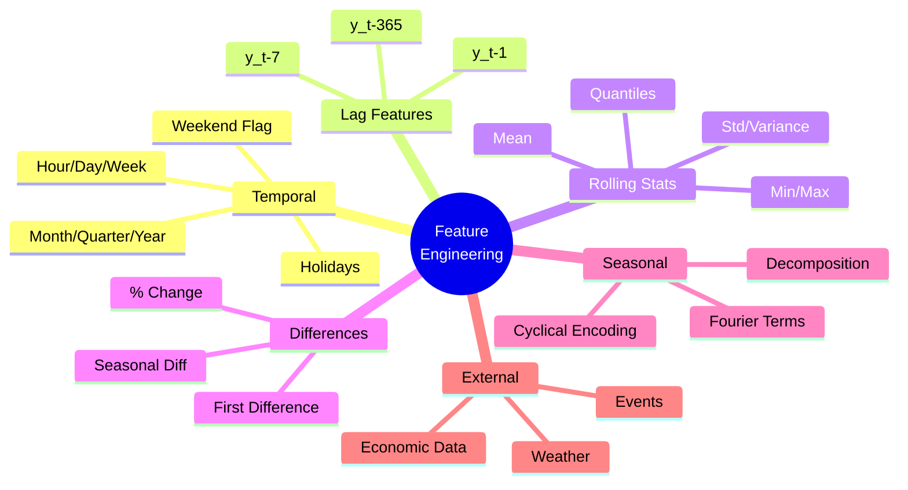
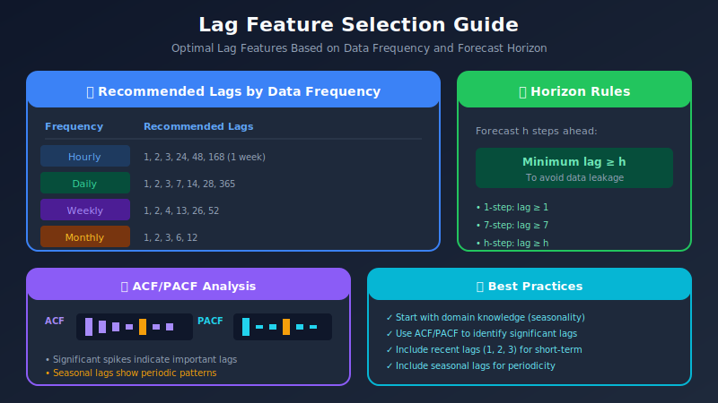

# Feature Engineering for Time Series

<p align="center">
  
  
  
</p>

## Table of Contents
- [Overview](#overview)
- [Temporal Features](#temporal-features)
- [Lag Features](#lag-features)
- [Rolling Window Features](#rolling-window-features)
- [Expanding Window Features](#expanding-window-features)
- [Seasonal Features](#seasonal-features)
- [Trend Features](#trend-features)
- [External Features](#external-features)
- [Feature Selection](#feature-selection)
- [Production Considerations](#production-considerations)

---

## Overview

Feature engineering transforms raw time series data into meaningful inputs for machine learning models. Well-crafted features can dramatically improve forecasting accuracy.

### The Feature Engineering Landscape



<p align="center">
<svg width="750" height="280" xmlns="http://www.w3.org/2000/svg">
  <defs>
    <filter id="feat-shadow" x="-10%" y="-10%" width="120%" height="120%">
      <feDropShadow dx="2" dy="2" stdDeviation="3" flood-opacity="0.15"/>
    </filter>
  </defs>

  <!-- Background -->
  <rect x="0" y="0" width="750" height="280" fill="#fafafa" rx="10"/>

  <!-- Title -->
  <text x="375" y="25" fill="#333" font-size="16" text-anchor="middle" font-weight="bold">🔧 TIME SERIES FEATURE CATEGORIES</text>

  <!-- Row 1: Temporal (full width) -->
  <rect x="20" y="40" width="710" height="50" rx="8" fill="#1976D2" filter="url(#feat-shadow)"/>
  <text x="375" y="60" fill="white" font-size="13" text-anchor="middle" font-weight="bold">📅 TEMPORAL FEATURES</text>
  <text x="375" y="78" fill="white" font-size="11" text-anchor="middle" opacity="0.9">Hour • Day • Week • Month • Quarter • Year • Holiday • Weekend</text>

  <!-- Row 2: Three columns -->
  <!-- Lag Features -->
  <rect x="20" y="100" width="220" height="80" rx="8" fill="#4CAF50" filter="url(#feat-shadow)"/>
  <text x="130" y="125" fill="white" font-size="12" text-anchor="middle" font-weight="bold">⏮️ LAG FEATURES</text>
  <text x="130" y="145" fill="white" font-size="10" text-anchor="middle" opacity="0.9">y(t-1), y(t-7)</text>
  <text x="130" y="162" fill="white" font-size="10" text-anchor="middle" opacity="0.9">y(t-28), y(t-365)</text>

  <!-- Rolling Stats -->
  <rect x="260" y="100" width="220" height="80" rx="8" fill="#FF9800" filter="url(#feat-shadow)"/>
  <text x="370" y="125" fill="white" font-size="12" text-anchor="middle" font-weight="bold">📊 ROLLING STATS</text>
  <text x="370" y="145" fill="white" font-size="10" text-anchor="middle" opacity="0.9">mean, std, var</text>
  <text x="370" y="162" fill="white" font-size="10" text-anchor="middle" opacity="0.9">min, max, quantiles</text>

  <!-- Differences -->
  <rect x="500" y="100" width="230" height="80" rx="8" fill="#9C27B0" filter="url(#feat-shadow)"/>
  <text x="615" y="125" fill="white" font-size="12" text-anchor="middle" font-weight="bold">📉 DIFFERENCES</text>
  <text x="615" y="145" fill="white" font-size="10" text-anchor="middle" opacity="0.9">y(t) - y(t-1)</text>
  <text x="615" y="162" fill="white" font-size="10" text-anchor="middle" opacity="0.9">% change, seasonal diff</text>

  <!-- Row 3: Two columns -->
  <!-- Seasonal Features -->
  <rect x="20" y="190" width="350" height="75" rx="8" fill="#00BCD4" filter="url(#feat-shadow)"/>
  <text x="195" y="215" fill="white" font-size="12" text-anchor="middle" font-weight="bold">🔄 SEASONAL FEATURES</text>
  <text x="195" y="235" fill="white" font-size="10" text-anchor="middle" opacity="0.9">Fourier terms • Cyclical encoding (sin/cos)</text>
  <text x="195" y="252" fill="white" font-size="10" text-anchor="middle" opacity="0.9">STL decomposition • Seasonal indicators</text>

  <!-- External Features -->
  <rect x="390" y="190" width="340" height="75" rx="8" fill="#E91E63" filter="url(#feat-shadow)"/>
  <text x="560" y="215" fill="white" font-size="12" text-anchor="middle" font-weight="bold">🌍 EXTERNAL FEATURES</text>
  <text x="560" y="235" fill="white" font-size="10" text-anchor="middle" opacity="0.9">Weather • Events • Promotions</text>
  <text x="560" y="252" fill="white" font-size="10" text-anchor="middle" opacity="0.9">Economic indicators • Competitor data</text>
</svg>
</p>

---

## Temporal Features

### Date/Time Components

```python
import pandas as pd
import numpy as np

def create_datetime_features(df):
    """
    Extract datetime components as features
    """
    df = df.copy()
    idx = df.index

    # Basic components
    df['hour'] = idx.hour
    df['day'] = idx.day
    df['dayofweek'] = idx.dayofweek  # 0=Monday, 6=Sunday
    df['dayofyear'] = idx.dayofyear
    df['week'] = idx.isocalendar().week.values
    df['month'] = idx.month
    df['quarter'] = idx.quarter
    df['year'] = idx.year

    # Binary features
    df['is_weekend'] = (idx.dayofweek >= 5).astype(int)
    df['is_month_start'] = idx.is_month_start.astype(int)
    df['is_month_end'] = idx.is_month_end.astype(int)
    df['is_quarter_start'] = idx.is_quarter_start.astype(int)
    df['is_quarter_end'] = idx.is_quarter_end.astype(int)
    df['is_year_start'] = idx.is_year_start.astype(int)
    df['is_year_end'] = idx.is_year_end.astype(int)

    return df
```

### Cyclical Encoding

```python
def cyclical_encoding(df, col, max_val):
    """
    Encode cyclical features using sine and cosine
    Ensures continuity (e.g., hour 23 is close to hour 0)
    """
    df[f'{col}_sin'] = np.sin(2 * np.pi * df[col] / max_val)
    df[f'{col}_cos'] = np.cos(2 * np.pi * df[col] / max_val)
    return df

# Apply cyclical encoding
df = cyclical_encoding(df, 'hour', 24)      # Hours: 0-23
df = cyclical_encoding(df, 'dayofweek', 7)  # Days: 0-6
df = cyclical_encoding(df, 'month', 12)     # Months: 1-12
df = cyclical_encoding(df, 'dayofyear', 365)
```

### Holiday Features

```python
from pandas.tseries.holiday import USFederalHolidayCalendar

def add_holiday_features(df, country='US'):
    """
    Add holiday indicators
    """
    if country == 'US':
        cal = USFederalHolidayCalendar()
        holidays = cal.holidays(start=df.index.min(), end=df.index.max())

    df['is_holiday'] = df.index.isin(holidays).astype(int)

    # Days until/since holiday
    holiday_dates = pd.Series(holidays)

    def days_to_holiday(date):
        future = holiday_dates[holiday_dates >= date]
        return (future.iloc[0] - date).days if len(future) > 0 else 365

    def days_since_holiday(date):
        past = holiday_dates[holiday_dates <= date]
        return (date - past.iloc[-1]).days if len(past) > 0 else 365

    df['days_to_holiday'] = df.index.map(days_to_holiday)
    df['days_since_holiday'] = df.index.map(days_since_holiday)

    return df
```

---

## Lag Features

### Mathematical Basis: Autoregression

Lag features are rooted in the **autoregressive (AR)** assumption that future values depend on past values:

```math
Y_t = f(Y_{t-1}, Y_{t-2}, \ldots, Y_{t-p}) + \varepsilon_t
```

The **Autocorrelation Function (ACF)** helps identify which lags are most informative:

```math
\rho_k = \frac{\text{Cov}(Y_t, Y_{t-k})}{\text{Var}(Y_t)} = \frac{\gamma_k}{\gamma_0}
```

The **Partial Autocorrelation Function (PACF)** measures direct correlation at lag $k$, controlling for intermediate lags:

```math
\phi_{kk} = \text{Corr}(Y_t, Y_{t-k} | Y_{t-1}, \ldots, Y_{t-k+1})
```

| Pattern | ACF Behavior | PACF Behavior | Model Suggestion |
|---------|--------------|---------------|------------------|
| AR(p) | Exponential decay | Cuts off after lag $p$ | Use first $p$ lags |
| MA(q) | Cuts off after lag $q$ | Exponential decay | Rolling statistics |
| ARMA | Exponential decay | Exponential decay | Both lags and rolling |

### Creating Lag Features

```python
def create_lag_features(df, target_col, lags):
    """
    Create lag features for a target column

    Args:
        df: DataFrame with datetime index
        target_col: Column to create lags for
        lags: List of lag periods (e.g., [1, 7, 14, 28, 365])
    """
    df = df.copy()

    for lag in lags:
        df[f'{target_col}_lag_{lag}'] = df[target_col].shift(lag)

    return df

# Common lag patterns
hourly_lags = [1, 2, 3, 24, 48, 168]  # Last hours, same hour yesterday, same hour last week
daily_lags = [1, 2, 3, 7, 14, 21, 28, 365]  # Days and weeks back
monthly_lags = [1, 2, 3, 6, 12]  # Months back

df = create_lag_features(df, 'value', daily_lags)
```

### Difference Features

```python
def create_difference_features(df, target_col, periods):
    """
    Create difference features (changes)
    """
    df = df.copy()

    for period in periods:
        # Absolute difference
        df[f'{target_col}_diff_{period}'] = df[target_col].diff(period)

        # Percentage change
        df[f'{target_col}_pct_change_{period}'] = df[target_col].pct_change(period)

    return df

df = create_difference_features(df, 'value', [1, 7, 28])
```

### Lag Selection Strategy



---

## Rolling Window Features

### Basic Rolling Statistics

```python
def create_rolling_features(df, target_col, windows):
    """
    Create rolling window statistics
    """
    df = df.copy()

    for window in windows:
        rolling = df[target_col].rolling(window=window)

        # Central tendency
        df[f'{target_col}_roll_mean_{window}'] = rolling.mean()
        df[f'{target_col}_roll_median_{window}'] = rolling.median()

        # Dispersion
        df[f'{target_col}_roll_std_{window}'] = rolling.std()
        df[f'{target_col}_roll_var_{window}'] = rolling.var()

        # Range
        df[f'{target_col}_roll_min_{window}'] = rolling.min()
        df[f'{target_col}_roll_max_{window}'] = rolling.max()
        df[f'{target_col}_roll_range_{window}'] = (
            df[f'{target_col}_roll_max_{window}'] -
            df[f'{target_col}_roll_min_{window}']
        )

        # Quantiles
        df[f'{target_col}_roll_q25_{window}'] = rolling.quantile(0.25)
        df[f'{target_col}_roll_q75_{window}'] = rolling.quantile(0.75)

        # Skewness and Kurtosis
        df[f'{target_col}_roll_skew_{window}'] = rolling.skew()
        df[f'{target_col}_roll_kurt_{window}'] = rolling.kurt()

    return df

windows = [7, 14, 28, 90]
df = create_rolling_features(df, 'value', windows)
```

### Advanced Rolling Features

```python
def create_advanced_rolling_features(df, target_col, window):
    """
    Create advanced rolling features
    """
    df = df.copy()
    rolling = df[target_col].rolling(window=window)

    # Coefficient of Variation
    df[f'{target_col}_roll_cv_{window}'] = (
        rolling.std() / rolling.mean()
    ).abs()

    # Z-score of current value vs rolling window
    df[f'{target_col}_roll_zscore_{window}'] = (
        (df[target_col] - rolling.mean()) / rolling.std()
    )

    # Ratio to rolling mean
    df[f'{target_col}_ratio_to_mean_{window}'] = (
        df[target_col] / rolling.mean()
    )

    # Position within rolling range (0 = min, 1 = max)
    roll_min = rolling.min()
    roll_max = rolling.max()
    df[f'{target_col}_roll_position_{window}'] = (
        (df[target_col] - roll_min) / (roll_max - roll_min)
    )

    # Trend strength (slope)
    def rolling_slope(x):
        if len(x) < 2:
            return np.nan
        return np.polyfit(range(len(x)), x, 1)[0]

    df[f'{target_col}_roll_slope_{window}'] = (
        df[target_col].rolling(window=window).apply(rolling_slope, raw=True)
    )

    return df
```

### Exponentially Weighted Features

```python
def create_ewm_features(df, target_col, spans):
    """
    Create exponentially weighted moving average features
    EWM gives more weight to recent observations
    """
    df = df.copy()

    for span in spans:
        ewm = df[target_col].ewm(span=span)

        df[f'{target_col}_ewm_mean_{span}'] = ewm.mean()
        df[f'{target_col}_ewm_std_{span}'] = ewm.std()
        df[f'{target_col}_ewm_var_{span}'] = ewm.var()

    return df

spans = [7, 14, 28]
df = create_ewm_features(df, 'value', spans)
```

---

## Expanding Window Features

```python
def create_expanding_features(df, target_col, min_periods=30):
    """
    Create expanding window features (cumulative statistics)
    """
    df = df.copy()
    expanding = df[target_col].expanding(min_periods=min_periods)

    # Cumulative statistics
    df[f'{target_col}_exp_mean'] = expanding.mean()
    df[f'{target_col}_exp_std'] = expanding.std()
    df[f'{target_col}_exp_min'] = expanding.min()
    df[f'{target_col}_exp_max'] = expanding.max()

    # Current value vs historical
    df[f'{target_col}_vs_exp_mean'] = df[target_col] / expanding.mean()
    df[f'{target_col}_exp_zscore'] = (
        (df[target_col] - expanding.mean()) / expanding.std()
    )

    # Percentile rank
    df[f'{target_col}_exp_pct_rank'] = (
        df[target_col].expanding(min_periods=min_periods)
        .apply(lambda x: pd.Series(x).rank(pct=True).iloc[-1])
    )

    return df
```

---

## Seasonal Features

### Fourier Features: Mathematical Foundation

Any periodic function can be decomposed into a sum of sinusoids using **Fourier series**:

```math
f(t) = \frac{a_0}{2} + \sum_{k=1}^{K} \left[ a_k \cos\left(\frac{2\pi kt}{m}\right) + b_k \sin\left(\frac{2\pi kt}{m}\right) \right]
```

For time series with period $m$, we use Fourier terms as features:

| Harmonic | Formula | Captures |
|----------|---------|----------|
| $k=1$ | $\sin(2\pi t/m), \cos(2\pi t/m)$ | Fundamental frequency |
| $k=2$ | $\sin(4\pi t/m), \cos(4\pi t/m)$ | First overtone |
| $k=K$ | $\sin(2K\pi t/m), \cos(2K\pi t/m)$ | $K$-th harmonic |

**Choosing $K$**: More harmonics capture sharper seasonal patterns, but risk overfitting. Rule of thumb: $K \leq \lfloor m/2 \rfloor$.

<p align="center">
<svg width="650" height="150" xmlns="http://www.w3.org/2000/svg">
  <rect x="0" y="0" width="650" height="150" rx="10" fill="#1e293b"/>
  <text x="325" y="25" fill="#f8fafc" font-size="14" text-anchor="middle" font-weight="bold">Fourier Features for Seasonality</text>
  
  <!-- Wave visualization -->
  <path d="M50 80 Q100 40 150 80 T250 80 T350 80 T450 80 T550 80 T600 80" stroke="#3b82f6" stroke-width="2" fill="none"/>
  <path d="M50 80 Q100 50 150 80 T250 80 T350 80" stroke="#22c55e" stroke-width="2" fill="none" stroke-dasharray="5,3"/>
  <path d="M50 80 Q75 60 100 80 T150 80 T200 80 T250 80" stroke="#f59e0b" stroke-width="2" fill="none" stroke-dasharray="3,2"/>
  
  <!-- Legend -->
  <rect x="80" y="115" width="15" height="3" fill="#3b82f6"/>
  <text x="100" y="120" font-family="Segoe UI, sans-serif" font-size="10" fill="#94a3b8">k=1 (fundamental)</text>
  <rect x="230" y="115" width="15" height="3" fill="#22c55e" stroke-dasharray="5,3"/>
  <text x="250" y="120" font-family="Segoe UI, sans-serif" font-size="10" fill="#94a3b8">k=2 (2nd harmonic)</text>
  <rect x="400" y="115" width="15" height="3" fill="#f59e0b"/>
  <text x="420" y="120" font-family="Segoe UI, sans-serif" font-size="10" fill="#94a3b8">k=3 (3rd harmonic)</text>
</svg>
</p>

```python
def create_fourier_features(df, period, n_harmonics):
    """
    Create Fourier terms for capturing seasonality
    
    Args:
        df: DataFrame with DatetimeIndex
        period: Seasonal period (e.g., 365.25 for yearly with daily data)
        n_harmonics: Number of Fourier pairs (K)
    
    Mathematical basis:
        sin(2πkt/m) and cos(2πkt/m) for k = 1, ..., K
    """
    df = df.copy()
    t = np.arange(len(df))

    for k in range(1, n_harmonics + 1):
        df[f'sin_{period}_{k}'] = np.sin(2 * np.pi * k * t / period)
        df[f'cos_{period}_{k}'] = np.cos(2 * np.pi * k * t / period)

    return df

# For daily data with yearly seasonality
df = create_fourier_features(df, period=365.25, n_harmonics=5)

# For hourly data with daily and weekly seasonality
df = create_fourier_features(df, period=24, n_harmonics=3)    # Daily
df = create_fourier_features(df, period=168, n_harmonics=3)   # Weekly
```

### Same-Period Features

```python
def create_same_period_features(df, target_col):
    """
    Features comparing to same period in previous cycles
    """
    df = df.copy()

    # Same hour yesterday
    if hasattr(df.index, 'hour'):
        df[f'{target_col}_same_hour_yesterday'] = df[target_col].shift(24)
        df[f'{target_col}_same_hour_last_week'] = df[target_col].shift(168)

    # Same day last week
    df[f'{target_col}_same_day_last_week'] = df[target_col].shift(7)

    # Same day last month (approximately)
    df[f'{target_col}_same_day_last_month'] = df[target_col].shift(28)

    # Same day last year
    df[f'{target_col}_same_day_last_year'] = df[target_col].shift(365)

    # Calculate ratios
    for lag_name, lag_col in [
        ('week', f'{target_col}_same_day_last_week'),
        ('month', f'{target_col}_same_day_last_month'),
        ('year', f'{target_col}_same_day_last_year')
    ]:
        if lag_col in df.columns:
            df[f'{target_col}_ratio_vs_{lag_name}'] = (
                df[target_col] / df[lag_col]
            )

    return df
```

### Seasonal Decomposition Features

```python
from statsmodels.tsa.seasonal import STL

def create_stl_features(df, target_col, period=7):
    """
    Create features from STL decomposition
    """
    df = df.copy()

    # Perform STL decomposition
    stl = STL(df[target_col].dropna(), period=period)
    result = stl.fit()

    # Add components as features
    df[f'{target_col}_trend'] = result.trend
    df[f'{target_col}_seasonal'] = result.seasonal
    df[f'{target_col}_residual'] = result.resid

    # Seasonal strength
    var_resid = result.resid.var()
    var_seasonal_resid = (result.seasonal + result.resid).var()
    df[f'{target_col}_seasonal_strength'] = max(0, 1 - var_resid / var_seasonal_resid)

    return df
```

---

## Trend Features

```python
def create_trend_features(df, target_col, windows=[7, 14, 28]):
    """
    Create trend-related features
    """
    df = df.copy()

    for window in windows:
        # Simple moving average trend
        sma = df[target_col].rolling(window=window).mean()
        df[f'{target_col}_above_sma_{window}'] = (df[target_col] > sma).astype(int)
        df[f'{target_col}_sma_diff_{window}'] = df[target_col] - sma

        # Momentum
        df[f'{target_col}_momentum_{window}'] = df[target_col] - df[target_col].shift(window)

        # Rate of change
        df[f'{target_col}_roc_{window}'] = (
            (df[target_col] - df[target_col].shift(window)) /
            df[target_col].shift(window) * 100
        )

    # Linear trend coefficient
    def linear_trend(x):
        if len(x) < 2:
            return np.nan
        slope, _ = np.polyfit(range(len(x)), x, 1)
        return slope

    for window in windows:
        df[f'{target_col}_trend_coef_{window}'] = (
            df[target_col].rolling(window=window).apply(linear_trend, raw=True)
        )

    return df
```

---

## External Features

### Weather Features

```python
def create_weather_features(df, weather_df):
    """
    Incorporate weather data
    """
    df = df.copy()

    # Merge weather data
    df = df.merge(weather_df, left_index=True, right_index=True, how='left')

    # Interaction features
    if 'temperature' in df.columns:
        df['temp_squared'] = df['temperature'] ** 2
        df['is_extreme_cold'] = (df['temperature'] < 0).astype(int)
        df['is_extreme_hot'] = (df['temperature'] > 30).astype(int)

        # Heating/Cooling degree days
        df['heating_degree_days'] = np.maximum(0, 18 - df['temperature'])
        df['cooling_degree_days'] = np.maximum(0, df['temperature'] - 18)

    if 'humidity' in df.columns:
        df['is_high_humidity'] = (df['humidity'] > 80).astype(int)

    return df
```

### Event Features

```python
def create_event_features(df, events_df):
    """
    Incorporate event data (promotions, sports events, etc.)
    """
    df = df.copy()

    # Merge events
    for event_type in events_df['event_type'].unique():
        event_dates = events_df[events_df['event_type'] == event_type].index
        df[f'is_{event_type}'] = df.index.isin(event_dates).astype(int)

        # Days until/since event
        df[f'days_to_{event_type}'] = df.index.map(
            lambda x: min([(d - x).days for d in event_dates if d >= x], default=365)
        )
        df[f'days_since_{event_type}'] = df.index.map(
            lambda x: min([(x - d).days for d in event_dates if d <= x], default=365)
        )

    return df
```

---

## Feature Selection

### Correlation-Based Selection

```python
def select_features_by_correlation(df, target_col, threshold=0.05):
    """
    Select features based on correlation with target
    """
    correlations = df.corr()[target_col].drop(target_col)

    # Filter by absolute correlation
    selected = correlations[correlations.abs() > threshold]

    return selected.sort_values(key=abs, ascending=False)
```

### Importance-Based Selection

```python
from sklearn.ensemble import RandomForestRegressor

def select_features_by_importance(df, target_col, n_top=20):
    """
    Select features using Random Forest importance
    """
    feature_cols = [c for c in df.columns if c != target_col]

    # Handle missing values
    df_clean = df[feature_cols + [target_col]].dropna()

    X = df_clean[feature_cols]
    y = df_clean[target_col]

    # Train Random Forest
    rf = RandomForestRegressor(n_estimators=100, random_state=42)
    rf.fit(X, y)

    # Get importance
    importance = pd.Series(rf.feature_importances_, index=feature_cols)

    return importance.nlargest(n_top)
```

---

## Production Considerations

### Feature Pipeline

```python
class TimeSeriesFeatureEngineer:
    """
    Production-ready feature engineering pipeline
    """

    def __init__(self, target_col, config):
        self.target_col = target_col
        self.config = config
        self.fitted_params = {}

    def fit(self, df):
        """Fit on training data to store parameters"""
        # Store scaling parameters, etc.
        return self

    def transform(self, df):
        """Apply all feature engineering"""
        df = df.copy()

        # Temporal features
        df = create_datetime_features(df)

        # Lag features (only valid lags based on forecast horizon)
        min_lag = self.config.get('forecast_horizon', 1)
        lags = [l for l in self.config['lags'] if l >= min_lag]
        df = create_lag_features(df, self.target_col, lags)

        # Rolling features
        df = create_rolling_features(df, self.target_col, self.config['windows'])

        # Seasonal features
        if self.config.get('fourier', True):
            for period, harmonics in self.config['fourier_terms'].items():
                df = create_fourier_features(df, period, harmonics)

        return df

    def fit_transform(self, df):
        self.fit(df)
        return self.transform(df)

# Configuration
config = {
    'forecast_horizon': 7,
    'lags': [7, 14, 21, 28, 365],
    'windows': [7, 14, 28],
    'fourier_terms': {365: 5, 7: 3}
}

# Usage
engineer = TimeSeriesFeatureEngineer('value', config)
train_features = engineer.fit_transform(train_df)
test_features = engineer.transform(test_df)
```

---

## Summary

Effective time series feature engineering:

1. **Temporal Features**: Capture calendar patterns
2. **Lag Features**: Use past values as predictors
3. **Rolling Features**: Capture local trends and volatility
4. **Seasonal Features**: Model periodic patterns
5. **External Features**: Incorporate domain knowledge

### Next Steps

- [04_statistical_methods](../04_statistical_methods/) - Classical forecasting methods
- [05_machine_learning](../05_machine_learning/) - ML-based approaches

---

<div align="center">

**[⬆ Back to Top](#)** | **[📚 Main Repository](https://github.com/Gaurav14cs17/ml_system_design)**

Made with 💜 by [Gaurav14cs17](https://github.com/Gaurav14cs17)

</div>
