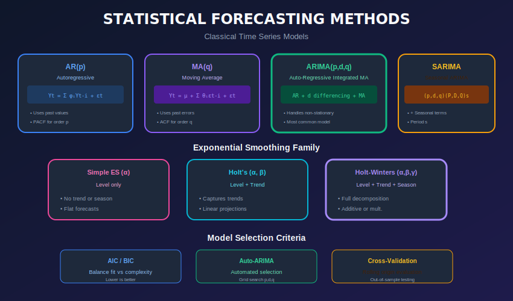
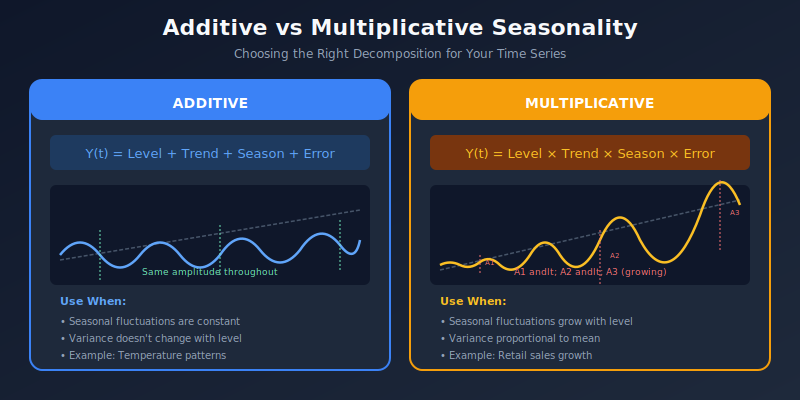

# Classical Statistical Methods for Time Series Forecasting

<p align="center">
  
  
  
</p>

## Table of Contents
- [Overview](#overview)
- [Mathematical Foundations](#mathematical-foundations)
- [Moving Average Methods](#moving-average-methods)
- [Exponential Smoothing](#exponential-smoothing)
- [ARIMA Models](#arima-models)
- [SARIMA Models](#sarima-models)
- [Prophet](#prophet)
- [Model Selection and Diagnostics](#model-selection-and-diagnostics)
- [Practical Implementation](#practical-implementation)

---

## Overview

Statistical methods provide interpretable, well-understood approaches to time series forecasting. They remain powerful baselines and production-ready solutions.

### Method Comparison



---

## Mathematical Foundations

### The Backshift Operator

The **backshift operator** $B$ (or lag operator $L$) is fundamental to time series notation:

```math
B Y_t = Y_{t-1}
B^k Y_t = Y_{t-k}
```

The **difference operator** $\nabla$ is defined as:

```math
\nabla Y_t = Y_t - Y_{t-1} = (1 - B)Y_t
\nabla^d Y_t = (1 - B)^d Y_t
```

### White Noise Process

A **white noise** process $\{\varepsilon\_t\}$ satisfies:

```math
\mathbb{E}[\varepsilon_t] = 0, \quad \text{Var}(\varepsilon_t) = \sigma^2, \quad \text{Cov}(\varepsilon_t, \varepsilon_s) = 0 \text{ for } t \neq s
```

Often denoted as $\varepsilon\_t \sim \text{WN}(0, \sigma^2)$ or $\varepsilon\_t \overset{iid}{\sim} \mathcal{N}(0, \sigma^2)$ for Gaussian white noise.

### Wold's Decomposition Theorem

Any stationary process $\{Y\_t\}$ can be represented as:

```math
Y_t = \mu + \sum_{j=0}^{\infty} \psi_j \varepsilon_{t-j} = \mu + \psi(B)\varepsilon_t
```

where $\psi(B) = \sum\_{j=0}^{\infty} \psi\_j B^j$ and $\sum\_{j=0}^{\infty} \psi\_j^2 < \infty$.

---

## Moving Average Methods

### Simple Moving Average (SMA)

```python
import pandas as pd
import numpy as np

def simple_moving_average_forecast(series, window, horizon):
    """
    Forecast using Simple Moving Average
    All future values = average of last 'window' observations
    """
    last_values = series.iloc[-window:]
    forecast_value = last_values.mean()

    # Create forecast index
    last_date = series.index[-1]
    forecast_index = pd.date_range(
        start=last_date + pd.Timedelta(days=1),
        periods=horizon,
        freq=series.index.freq
    )

    return pd.Series([forecast_value] * horizon, index=forecast_index)

# Usage
forecast = simple_moving_average_forecast(df['value'], window=7, horizon=14)
```

### Weighted Moving Average

```python
def weighted_moving_average_forecast(series, weights, horizon):
    """
    Forecast using Weighted Moving Average
    Recent observations get higher weights
    """
    window = len(weights)
    weights = np.array(weights) / sum(weights)  # Normalize

    last_values = series.iloc[-window:].values
    forecast_value = np.dot(last_values, weights)

    last_date = series.index[-1]
    forecast_index = pd.date_range(
        start=last_date + pd.Timedelta(days=1),
        periods=horizon,
        freq=series.index.freq
    )

    return pd.Series([forecast_value] * horizon, index=forecast_index)

# Weights: more recent = higher weight
weights = [1, 2, 3, 4, 5, 6, 7]  # Last day has weight 7
forecast = weighted_moving_average_forecast(df['value'], weights, horizon=14)
```

---

## Exponential Smoothing

### Simple Exponential Smoothing (SES)

```python
from statsmodels.tsa.holtwinters import SimpleExpSmoothing

def ses_forecast(series, horizon, alpha=None):
    """
    Simple Exponential Smoothing
    Best for: Series with no trend or seasonality
    """
    model = SimpleExpSmoothing(series)

    if alpha:
        fitted = model.fit(smoothing_level=alpha, optimized=False)
    else:
        fitted = model.fit(optimized=True)

    forecast = fitted.forecast(horizon)

    print(f"Optimal alpha: {fitted.params['smoothing_level']:.4f}")

    return forecast, fitted
```

### Holt's Linear Trend Method

```python
from statsmodels.tsa.holtwinters import Holt

def holt_forecast(series, horizon, damped=False):
    """
    Holt's method for trend
    Best for: Series with trend, no seasonality
    """
    model = Holt(series, damped_trend=damped)
    fitted = model.fit(optimized=True)

    forecast = fitted.forecast(horizon)

    print(f"Alpha (level): {fitted.params['smoothing_level']:.4f}")
    print(f"Beta (trend): {fitted.params['smoothing_trend']:.4f}")

    return forecast, fitted
```

### Holt-Winters Method

```python
from statsmodels.tsa.holtwinters import ExponentialSmoothing

def holt_winters_forecast(series, horizon, seasonal_periods,
                          trend='add', seasonal='add', damped=False):
    """
    Holt-Winters method for trend and seasonality

    Args:
        series: Time series data
        horizon: Forecast steps
        seasonal_periods: Number of periods in a season (e.g., 12 for monthly)
        trend: 'add' for additive, 'mul' for multiplicative
        seasonal: 'add' for additive, 'mul' for multiplicative
        damped: Whether to damp the trend
    """
    model = ExponentialSmoothing(
        series,
        trend=trend,
        seasonal=seasonal,
        seasonal_periods=seasonal_periods,
        damped_trend=damped
    )

    fitted = model.fit(optimized=True)
    forecast = fitted.forecast(horizon)

    print("Fitted parameters:")
    print(f"  Alpha (level): {fitted.params['smoothing_level']:.4f}")
    print(f"  Beta (trend): {fitted.params['smoothing_trend']:.4f}")
    print(f"  Gamma (seasonal): {fitted.params['smoothing_seasonal']:.4f}")

    return forecast, fitted

# Example: Monthly data with yearly seasonality
forecast, model = holt_winters_forecast(
    monthly_sales,
    horizon=12,
    seasonal_periods=12,
    trend='add',
    seasonal='mul'  # Multiplicative if seasonal amplitude grows with level
)
```

### Choosing Additive vs Multiplicative



---

## ARIMA Models

### Understanding ARIMA Components

**ARIMA(p, d, q)** combines three components:

#### Autoregressive (AR) Component

An **AR(p)** process models the current value as a linear combination of past values:

```math
Y_t = c + \phi_1 Y_{t-1} + \phi_2 Y_{t-2} + \cdots + \phi_p Y_{t-p} + \varepsilon_t
```

Using the backshift operator:

```math
\phi(B)Y_t = c + \varepsilon_t \quad \text{where} \quad \phi(B) = 1 - \phi_1 B - \phi_2 B^2 - \cdots - \phi_p B^p
```

**Stationarity condition:** All roots of $\phi(z) = 0$ lie outside the unit circle.

#### Moving Average (MA) Component

An **MA(q)** process models the current value as a linear combination of past errors:

```math
Y_t = \mu + \varepsilon_t + \theta_1 \varepsilon_{t-1} + \theta_2 \varepsilon_{t-2} + \cdots + \theta_q \varepsilon_{t-q}
```

Using the backshift operator:

```math
Y_t = \mu + \theta(B)\varepsilon_t \quad \text{where} \quad \theta(B) = 1 + \theta_1 B + \theta_2 B^2 + \cdots + \theta_q B^q
```

**Invertibility condition:** All roots of $\theta(z) = 0$ lie outside the unit circle.

#### Integrated (I) Component

Differencing removes non-stationarity:

```math
\nabla^d Y_t = (1-B)^d Y_t
```

### Complete ARIMA(p,d,q) Model

```math
\phi(B)(1-B)^d Y_t = c + \theta(B)\varepsilon_t
```

Or equivalently, if $W\_t = \nabla^d Y\_t$:

```math
\phi(B)W_t = c + \theta(B)\varepsilon_t
```

<p align="center">
<svg width="700" height="100" xmlns="http://www.w3.org/2000/svg">
  <rect x="0" y="0" width="700" height="100" rx="10" fill="#1e293b"/>
  <text x="350" y="40" fill="#60a5fa" font-size="16" text-anchor="middle" font-family="monospace">
    ARIMA(p,d,q): φ(B)(1-B)ᵈYₜ = c + θ(B)εₜ
  </text>
  <text x="140" y="75" fill="#94a3b8" font-size="12" text-anchor="middle">p: AR order</text>
  <text x="350" y="75" fill="#94a3b8" font-size="12" text-anchor="middle">d: differencing order</text>
  <text x="560" y="75" fill="#94a3b8" font-size="12" text-anchor="middle">q: MA order</text>
</svg>
</p>

### ARIMA Implementation

```python
from statsmodels.tsa.arima.model import ARIMA
from statsmodels.tsa.stattools import adfuller
from statsmodels.graphics.tsaplots import plot_acf, plot_pacf

def find_differencing_order(series, max_d=2):
    """
    Find the differencing order needed for stationarity
    """
    for d in range(max_d + 1):
        if d == 0:
            test_series = series
        else:
            test_series = series.diff(d).dropna()

        adf_result = adfuller(test_series)

        if adf_result[1] < 0.05:  # Stationary
            print(f"Series is stationary at d={d} (p-value: {adf_result[1]:.4f})")
            return d

    return max_d

def fit_arima(series, order, horizon):
    """
    Fit ARIMA model and forecast
    """
    model = ARIMA(series, order=order)
    fitted = model.fit()

    # Print summary
    print(fitted.summary())

    # Forecast
    forecast = fitted.forecast(steps=horizon)
    conf_int = fitted.get_forecast(steps=horizon).conf_int()

    return forecast, conf_int, fitted

# Example
d = find_differencing_order(df['value'])
forecast, conf_int, model = fit_arima(df['value'], order=(2, d, 2), horizon=30)
```

### Auto ARIMA

```python
import pmdarima as pm

def auto_arima_forecast(series, horizon, seasonal=False, m=1):
    """
    Automatic ARIMA order selection

    Args:
        series: Time series data
        horizon: Forecast steps
        seasonal: Whether to fit seasonal ARIMA
        m: Seasonal period (if seasonal=True)
    """
    model = pm.auto_arima(
        series,
        start_p=0, start_q=0,
        max_p=5, max_q=5,
        d=None,  # Auto-select differencing
        seasonal=seasonal,
        m=m,
        trace=True,
        error_action='ignore',
        suppress_warnings=True,
        stepwise=True,  # Faster search
        information_criterion='aic'
    )

    print(model.summary())

    # Forecast with confidence intervals
    forecast, conf_int = model.predict(n_periods=horizon, return_conf_int=True)

    return forecast, conf_int, model

# Non-seasonal
forecast, conf_int, model = auto_arima_forecast(df['value'], horizon=30)

# Seasonal (monthly data, yearly seasonality)
forecast, conf_int, model = auto_arima_forecast(
    monthly_data, horizon=12, seasonal=True, m=12
)
```

---

## SARIMA Models

### SARIMA Structure

**SARIMA(p, d, q)(P, D, Q)ₘ** extends ARIMA with seasonal components.

#### Seasonal Backshift Operator

```math
B^m Y_t = Y_{t-m}
```

#### Complete SARIMA Model

```math
\Phi_P(B^m) \phi_p(B) (1-B)^d (1-B^m)^D Y_t = c + \Theta_Q(B^m) \theta_q(B) \varepsilon_t
```

Where:
- $\phi\_p(B) = 1 - \phi\_1 B - \cdots - \phi\_p B^p$ — Non-seasonal AR polynomial
- $\theta\_q(B) = 1 + \theta\_1 B + \cdots + \theta\_q B^q$ — Non-seasonal MA polynomial
- $\Phi\_P(B^m) = 1 - \Phi\_1 B^m - \cdots - \Phi\_P B^{Pm}$ — Seasonal AR polynomial
- $\Theta\_Q(B^m) = 1 + \Theta\_1 B^m + \cdots + \Theta\_Q B^{Qm}$ — Seasonal MA polynomial

### Example: SARIMA(1,1,1)(1,1,1)₁₂

For monthly data with yearly seasonality:

```math
(1 - \Phi_1 B^{12})(1 - \phi_1 B)(1-B)(1-B^{12}) Y_t = (1 + \Theta_1 B^{12})(1 + \theta_1 B) \varepsilon_t
```

| Parameter | Interpretation |
|-----------|----------------|
| $\phi\_1$ | Dependence on previous month |
| $\Phi\_1$ | Dependence on same month last year |
| $\theta\_1$ | Smoothing of recent errors |
| $\Theta\_1$ | Smoothing of yearly seasonal errors |

### SARIMA Implementation

```python
from statsmodels.tsa.statespace.sarimax import SARIMAX

def fit_sarima(series, order, seasonal_order, horizon):
    """
    Fit SARIMA model

    Args:
        series: Time series data
        order: (p, d, q) tuple
        seasonal_order: (P, D, Q, m) tuple
        horizon: Forecast steps
    """
    model = SARIMAX(
        series,
        order=order,
        seasonal_order=seasonal_order,
        enforce_stationarity=False,
        enforce_invertibility=False
    )

    fitted = model.fit(disp=False)
    print(fitted.summary())

    # Forecast
    forecast_obj = fitted.get_forecast(steps=horizon)
    forecast = forecast_obj.predicted_mean
    conf_int = forecast_obj.conf_int()

    return forecast, conf_int, fitted

# Example: Monthly data with yearly seasonality
# SARIMA(1,1,1)(1,1,1,12)
forecast, conf_int, model = fit_sarima(
    monthly_sales,
    order=(1, 1, 1),
    seasonal_order=(1, 1, 1, 12),
    horizon=12
)
```

### SARIMA with Exogenous Variables (SARIMAX)

```python
def fit_sarimax(series, exog, order, seasonal_order, horizon, exog_forecast):
    """
    SARIMA with external regressors
    """
    model = SARIMAX(
        series,
        exog=exog,
        order=order,
        seasonal_order=seasonal_order
    )

    fitted = model.fit(disp=False)

    # Forecast with future exogenous values
    forecast_obj = fitted.get_forecast(steps=horizon, exog=exog_forecast)
    forecast = forecast_obj.predicted_mean
    conf_int = forecast_obj.conf_int()

    return forecast, conf_int, fitted

# Example with holiday indicator
exog_train = train_df[['is_holiday', 'temperature']]
exog_future = future_df[['is_holiday', 'temperature']]

forecast, conf_int, model = fit_sarimax(
    train_df['sales'],
    exog_train,
    order=(1, 1, 1),
    seasonal_order=(1, 1, 1, 12),
    horizon=30,
    exog_forecast=exog_future
)
```

---

## Prophet

### Prophet Overview

```
Facebook Prophet is designed for business time series with:
  ✓ Multiple seasonalities (daily, weekly, yearly)
  ✓ Holiday effects
  ✓ Missing data
  ✓ Trend changes
  ✓ Outliers
```

### Basic Prophet Usage

```python
from prophet import Prophet
import pandas as pd

def prepare_for_prophet(df, target_col):
    """
    Prepare data for Prophet (requires 'ds' and 'y' columns)
    """
    prophet_df = df.reset_index()
    prophet_df.columns = ['ds', 'y'] if len(prophet_df.columns) == 2 else prophet_df.columns
    prophet_df['ds'] = pd.to_datetime(prophet_df['ds'])
    return prophet_df

def fit_prophet(df, target_col, horizon_days,
                yearly=True, weekly=True, daily=False):
    """
    Fit Prophet model
    """

    # Prepare data
    prophet_df = prepare_for_prophet(df[[target_col]], target_col)

    # Initialize model
    model = Prophet(
        yearly_seasonality=yearly,
        weekly_seasonality=weekly,
        daily_seasonality=daily,
        changepoint_prior_scale=0.05,  # Flexibility of trend changes
        seasonality_prior_scale=10.0   # Flexibility of seasonality
    )

    # Fit
    model.fit(prophet_df)

    # Create future dataframe
    future = model.make_future_dataframe(periods=horizon_days)

    # Predict
    forecast = model.predict(future)

    return forecast, model

# Usage
forecast, model = fit_prophet(df, 'value', horizon_days=30)

# Plot
fig1 = model.plot(forecast)
fig2 = model.plot_components(forecast)
```

### Prophet with Holidays

```python
def fit_prophet_with_holidays(df, target_col, horizon_days, country='US'):
    """
    Prophet with holiday effects
    """
    prophet_df = prepare_for_prophet(df[[target_col]], target_col)

    model = Prophet()

    # Add country holidays
    model.add_country_holidays(country_name=country)

    # Or add custom holidays
    custom_holidays = pd.DataFrame({
        'holiday': 'black_friday',
        'ds': pd.to_datetime(['2023-11-24', '2024-11-29', '2025-11-28']),
        'lower_window': -1,  # Effect starts 1 day before
        'upper_window': 1    # Effect ends 1 day after
    })
    model = Prophet(holidays=custom_holidays)

    model.fit(prophet_df)
    future = model.make_future_dataframe(periods=horizon_days)
    forecast = model.predict(future)

    return forecast, model
```

### Prophet with Regressors

```python
def fit_prophet_with_regressors(df, target_col, regressor_cols, horizon_days, future_regressors):
    """
    Prophet with additional regressors
    """
    prophet_df = df.reset_index()
    prophet_df = prophet_df.rename(columns={prophet_df.columns[0]: 'ds', target_col: 'y'})

    model = Prophet()

    # Add regressors
    for col in regressor_cols:
        model.add_regressor(col)

    model.fit(prophet_df)

    # Future with regressors
    future = model.make_future_dataframe(periods=horizon_days)
    for col in regressor_cols:
        future[col] = pd.concat([df[col], future_regressors[col]]).values[:len(future)]

    forecast = model.predict(future)

    return forecast, model
```

---

## Model Selection and Diagnostics

### Residual Analysis

```python
def diagnose_residuals(fitted_model, series):
    """
    Diagnostic plots for residual analysis
    """
    import matplotlib.pyplot as plt
    from scipy import stats
    from statsmodels.graphics.tsaplots import plot_acf
    from statsmodels.stats.diagnostic import acorr_ljungbox

    residuals = fitted_model.resid

    fig, axes = plt.subplots(2, 2, figsize=(12, 10))

    # 1. Residuals over time
    axes[0, 0].plot(residuals)
    axes[0, 0].axhline(y=0, color='r', linestyle='--')
    axes[0, 0].set_title('Residuals Over Time')

    # 2. Histogram
    axes[0, 1].hist(residuals, bins=30, density=True, alpha=0.7)
    xmin, xmax = axes[0, 1].get_xlim()
    x = np.linspace(xmin, xmax, 100)
    axes[0, 1].plot(x, stats.norm.pdf(x, residuals.mean(), residuals.std()))
    axes[0, 1].set_title('Residual Distribution')

    # 3. ACF of residuals
    plot_acf(residuals.dropna(), ax=axes[1, 0], lags=40)
    axes[1, 0].set_title('ACF of Residuals')

    # 4. Q-Q plot
    stats.probplot(residuals.dropna(), dist="norm", plot=axes[1, 1])
    axes[1, 1].set_title('Q-Q Plot')

    plt.tight_layout()

    # Ljung-Box test
    lb_test = acorr_ljungbox(residuals.dropna(), lags=[10, 20, 30])
    print("\nLjung-Box Test (H0: No autocorrelation):")
    print(lb_test)

    return fig
```

### Information Criteria

```python
def compare_models(series, models_config):
    """
    Compare models using AIC/BIC
    """
    results = []

    for name, config in models_config.items():
        if config['type'] == 'arima':
            model = ARIMA(series, order=config['order']).fit()
        elif config['type'] == 'sarima':
            model = SARIMAX(series,
                          order=config['order'],
                          seasonal_order=config['seasonal_order']).fit()

        results.append({
            'model': name,
            'aic': model.aic,
            'bic': model.bic,
            'hqic': model.hqic
        })

    results_df = pd.DataFrame(results)
    print(results_df.sort_values('aic'))

    return results_df

# Usage
models = {
    'ARIMA(1,1,1)': {'type': 'arima', 'order': (1,1,1)},
    'ARIMA(2,1,2)': {'type': 'arima', 'order': (2,1,2)},
    'SARIMA(1,1,1)(1,1,1,12)': {
        'type': 'sarima',
        'order': (1,1,1),
        'seasonal_order': (1,1,1,12)
    }
}

compare_models(monthly_data, models)
```

---

## Practical Implementation

### Complete Forecasting Pipeline

```python
class StatisticalForecaster:
    """
    Unified interface for statistical forecasting methods
    """

    def __init__(self, method='auto_arima'):
        self.method = method
        self.model = None

    def fit(self, series, **kwargs):
        if self.method == 'ses':
            self.model = SimpleExpSmoothing(series).fit()
        elif self.method == 'holt':
            self.model = Holt(series, **kwargs).fit()
        elif self.method == 'holt_winters':
            self.model = ExponentialSmoothing(series, **kwargs).fit()
        elif self.method == 'arima':
            self.model = ARIMA(series, **kwargs).fit()
        elif self.method == 'auto_arima':
            self.model = pm.auto_arima(series, **kwargs)
        elif self.method == 'prophet':
            self.model = Prophet(**kwargs)
            prophet_df = series.reset_index()
            prophet_df.columns = ['ds', 'y']
            self.model.fit(prophet_df)

        return self

    def predict(self, horizon):
        if self.method == 'prophet':
            future = self.model.make_future_dataframe(periods=horizon)
            forecast = self.model.predict(future)
            return forecast['yhat'].iloc[-horizon:]
        elif self.method == 'auto_arima':
            return self.model.predict(n_periods=horizon)
        else:
            return self.model.forecast(steps=horizon)

    def get_confidence_intervals(self, horizon, alpha=0.05):
        if self.method == 'auto_arima':
            _, conf_int = self.model.predict(n_periods=horizon, return_conf_int=True)
            return conf_int
        else:
            forecast_obj = self.model.get_forecast(steps=horizon)
            return forecast_obj.conf_int(alpha=alpha)

# Usage
forecaster = StatisticalForecaster(method='auto_arima')
forecaster.fit(train_series, seasonal=True, m=12)
predictions = forecaster.predict(horizon=30)
```

---

## Summary

Statistical methods provide:
- **Interpretability**: Clear model components
- **Efficiency**: Fast training and inference
- **Uncertainty**: Built-in confidence intervals
- **Strong baselines**: Often hard to beat

### Method Selection Guide

| Scenario | Recommended Method |
|----------|-------------------|
| No trend, no seasonality | SES, Simple MA |
| Trend only | Holt's method |
| Trend + single seasonality | Holt-Winters |
| Complex dependencies | ARIMA |
| Strong seasonality | SARIMA |
| Multiple seasonalities + holidays | Prophet |

### Next Steps

- [05_machine_learning](../05_machine_learning/) - Tree-based and ML approaches
- [06_deep_learning](../06_deep_learning/) - Neural network methods

---

<div align="center">

**[⬆ Back to Top](#)** | **[📚 Main Repository](https://github.com/Gaurav14cs17/ml_system_design)**

Made with 💜 by [Gaurav14cs17](https://github.com/Gaurav14cs17)

</div>
