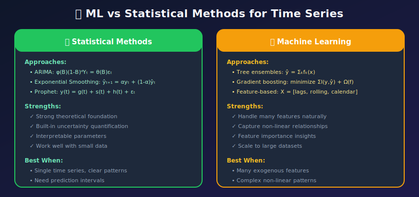
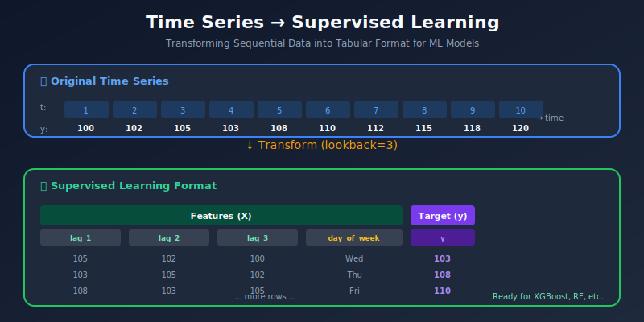

# Machine Learning Approaches for Time Series Forecasting

<p align="center">
  
  
  
</p>

## Table of Contents

- [Overview](#overview)

- [Mathematical Framework](#mathematical-framework)

- [Supervised Learning Formulation](#supervised-learning-formulation)

- [Tree-Based Models](#tree-based-models)

- [Gradient Boosting Methods](#gradient-boosting-methods)

- [Linear Models](#linear-models)

- [Ensemble Methods](#ensemble-methods)

- [Multi-Step Forecasting Strategies](#multi-step-forecasting-strategies)

- [Hyperparameter Tuning](#hyperparameter-tuning)

- [Production Pipeline](#production-pipeline)

---

## Overview

Machine Learning approaches treat time series forecasting as a supervised learning problem, using handcrafted features to capture temporal patterns.

### ML vs Statistical Methods



---

## Mathematical Framework

### The Supervised Learning Formulation

Transform time series into input-output pairs:

$$\{Y_1, Y_2, \ldots, Y_T\} \rightarrow \{(X_t, Y_{t+h})\}_{t=p}^{T-h}$$

Where:

- $X_t = f(Y_{t-1}, Y_{t-2}, \ldots, Y_{t-p}, Z_t)$ — Feature vector at time $t$

- $Y_{t+h}$ — Target value $h$ steps ahead

- $p$ — Lookback window size

- $Z_t$ — Exogenous features (calendar, external data)

### Loss Functions

| Model Type | Loss Function | Mathematical Form |
|------------|---------------|-------------------|
| **Regression** | MSE | $\mathcal{L} = \frac{1}{n}\sum_{i=1}^{n}(y_i - \hat{y}_i)^2$ |
| **Regression** | MAE | $\mathcal{L} = \frac{1}{n}\sum_{i=1}^{n}\|y_i - \hat{y}_i\|$ |
| **Quantile** | Pinball | $\mathcal{L}_q = \sum_{i}(y_i - \hat{y}_i)(q - \mathbb{1}_{y_i < \hat{y}_i})$ |

### Gradient Boosting Objective

For tree ensemble methods (XGBoost, LightGBM):

$$\mathcal{L}(\theta) = \sum_{i=1}^{n}l(y_i, \hat{y}_i) + \sum_{k=1}^{K}\Omega(f_k)$$

Where:

- $l(y_i, \hat{y}_i)$ — Differentiable loss function

- $\Omega(f_k) = \gamma T + \frac{1}{2}\lambda\|w\|^2$ — Regularization (tree complexity)

- $T$ — Number of leaves in tree $k$

- $w$ — Leaf weights

---

## Supervised Learning Formulation

### Time Series to Tabular Transformation



### Implementation

```python
import pandas as pd
import numpy as np

class TimeSeriesTransformer:
    """
    Transform time series into supervised learning format
    """

    def __init__(self, lookback=7, horizon=1, target_col='value'):
        self.lookback = lookback
        self.horizon = horizon
        self.target_col = target_col
        self.feature_cols = []

    def transform(self, df):
        """
        Transform time series to supervised format
        """
        result = df.copy()

        # Lag features
        for i in range(1, self.lookback + 1):
            result[f'lag_{i}'] = result[self.target_col].shift(i)

        # Rolling statistics
        for window in [7, 14, 28]:
            if window <= self.lookback:
                result[f'roll_mean_{window}'] = (
                    result[self.target_col].shift(1).rolling(window).mean()
                )
                result[f'roll_std_{window}'] = (
                    result[self.target_col].shift(1).rolling(window).std()
                )

        # Datetime features
        result['hour'] = result.index.hour
        result['dayofweek'] = result.index.dayofweek
        result['month'] = result.index.month
        result['dayofyear'] = result.index.dayofyear

        # Target (shifted for forecast horizon)
        if self.horizon > 1:
            result['target'] = result[self.target_col].shift(-self.horizon + 1)
        else:
            result['target'] = result[self.target_col]

        # Drop rows with NaN from lagging
        result = result.dropna()

        # Store feature columns
        self.feature_cols = [c for c in result.columns
                           if c not in [self.target_col, 'target']]

        return result

    def get_X_y(self, df):
        """
        Return features and target arrays
        """
        transformed = self.transform(df)
        X = transformed[self.feature_cols]
        y = transformed['target']
        return X, y

# Usage
transformer = TimeSeriesTransformer(lookback=14, horizon=1)
X, y = transformer.get_X_y(df)

```

---

## Tree-Based Models

### Random Forest

```python
from sklearn.ensemble import RandomForestRegressor
from sklearn.model_selection import TimeSeriesSplit

class TimeSeriesRandomForest:
    """
    Random Forest for time series forecasting
    """

    def __init__(self, n_estimators=100, max_depth=10,
                 min_samples_leaf=5, random_state=42):
        self.model = RandomForestRegressor(
            n_estimators=n_estimators,
            max_depth=max_depth,
            min_samples_leaf=min_samples_leaf,
            random_state=random_state,
            n_jobs=-1
        )
        self.feature_importance = None

    def fit(self, X_train, y_train):
        self.model.fit(X_train, y_train)
        self.feature_importance = pd.DataFrame({
            'feature': X_train.columns,
            'importance': self.model.feature_importances_
        }).sort_values('importance', ascending=False)
        return self

    def predict(self, X_test):
        return self.model.predict(X_test)

    def get_feature_importance(self, top_n=20):
        return self.feature_importance.head(top_n)

# Usage
rf_model = TimeSeriesRandomForest(n_estimators=200, max_depth=15)
rf_model.fit(X_train, y_train)
predictions = rf_model.predict(X_test)

# Feature importance
print(rf_model.get_feature_importance(10))

```

### Decision Tree Feature Importance Visualization

```python
import matplotlib.pyplot as plt

def plot_feature_importance(model, feature_names, top_n=20):
    """
    Plot feature importance from tree-based models
    """
    importance = pd.DataFrame({
        'feature': feature_names,
        'importance': model.feature_importances_
    }).sort_values('importance', ascending=True).tail(top_n)

    plt.figure(figsize=(10, 8))
    plt.barh(importance['feature'], importance['importance'])
    plt.xlabel('Importance')
    plt.title('Feature Importance')
    plt.tight_layout()
    return plt.gcf()

```

---

## Gradient Boosting Methods

### XGBoost

```python
import xgboost as xgb

class TimeSeriesXGBoost:
    """
    XGBoost for time series forecasting
    """

    def __init__(self, params=None):
        self.params = params or {
            'objective': 'reg:squarederror',
            'max_depth': 6,
            'learning_rate': 0.1,
            'n_estimators': 100,
            'min_child_weight': 1,
            'subsample': 0.8,
            'colsample_bytree': 0.8,
            'reg_alpha': 0.1,
            'reg_lambda': 1.0,
            'random_state': 42
        }
        self.model = None

    def fit(self, X_train, y_train, X_val=None, y_val=None):
        self.model = xgb.XGBRegressor(**self.params)

        eval_set = [(X_train, y_train)]
        if X_val is not None:
            eval_set.append((X_val, y_val))

        self.model.fit(
            X_train, y_train,
            eval_set=eval_set,
            verbose=False
        )
        return self

    def predict(self, X):
        return self.model.predict(X)

    def get_feature_importance(self):
        return pd.DataFrame({
            'feature': self.model.feature_names_in_,
            'importance': self.model.feature_importances_
        }).sort_values('importance', ascending=False)

# Usage with early stopping
xgb_model = TimeSeriesXGBoost({
    'objective': 'reg:squarederror',
    'max_depth': 8,
    'learning_rate': 0.05,
    'n_estimators': 500,
    'early_stopping_rounds': 50
})

xgb_model.fit(X_train, y_train, X_val, y_val)
predictions = xgb_model.predict(X_test)

```

### LightGBM

```python
import lightgbm as lgb

class TimeSeriesLightGBM:
    """
    LightGBM for time series - faster than XGBoost
    """

    def __init__(self, params=None):
        self.params = params or {
            'objective': 'regression',
            'metric': 'rmse',
            'boosting_type': 'gbdt',
            'num_leaves': 31,
            'learning_rate': 0.05,
            'feature_fraction': 0.8,
            'bagging_fraction': 0.8,
            'bagging_freq': 5,
            'verbose': -1,
            'random_state': 42
        }
        self.model = None

    def fit(self, X_train, y_train, X_val=None, y_val=None,
            num_boost_round=1000, early_stopping_rounds=50):

        train_data = lgb.Dataset(X_train, label=y_train)
        valid_data = lgb.Dataset(X_val, label=y_val) if X_val is not None else None

        callbacks = [lgb.early_stopping(early_stopping_rounds)] if valid_data else []

        self.model = lgb.train(
            self.params,
            train_data,
            num_boost_round=num_boost_round,
            valid_sets=[train_data, valid_data] if valid_data else [train_data],
            callbacks=callbacks
        )
        return self

    def predict(self, X):
        return self.model.predict(X)

# Usage
lgb_model = TimeSeriesLightGBM()
lgb_model.fit(X_train, y_train, X_val, y_val)
predictions = lgb_model.predict(X_test)

```

### CatBoost

```python
from catboost import CatBoostRegressor

class TimeSeriesCatBoost:
    """
    CatBoost - handles categorical features natively
    """

    def __init__(self, params=None, cat_features=None):
        self.params = params or {
            'iterations': 500,
            'learning_rate': 0.05,
            'depth': 8,
            'loss_function': 'RMSE',
            'random_seed': 42,
            'verbose': False
        }
        self.cat_features = cat_features or []
        self.model = None

    def fit(self, X_train, y_train, X_val=None, y_val=None):
        self.model = CatBoostRegressor(**self.params)

        eval_set = (X_val, y_val) if X_val is not None else None

        self.model.fit(
            X_train, y_train,
            cat_features=self.cat_features,
            eval_set=eval_set,
            early_stopping_rounds=50
        )
        return self

    def predict(self, X):
        return self.model.predict(X)

# Usage with categorical features
cat_features = ['dayofweek', 'month', 'holiday_type']
catboost_model = TimeSeriesCatBoost(cat_features=cat_features)
catboost_model.fit(X_train, y_train, X_val, y_val)

```

---

## Linear Models

### Ridge and Lasso Regression

```python
from sklearn.linear_model import Ridge, Lasso, ElasticNet
from sklearn.preprocessing import StandardScaler

class TimeSeriesLinearModel:
    """
    Linear models for time series with regularization
    """

    def __init__(self, model_type='ridge', alpha=1.0, l1_ratio=0.5):
        self.scaler = StandardScaler()

        if model_type == 'ridge':
            self.model = Ridge(alpha=alpha)
        elif model_type == 'lasso':
            self.model = Lasso(alpha=alpha)
        elif model_type == 'elasticnet':
            self.model = ElasticNet(alpha=alpha, l1_ratio=l1_ratio)

    def fit(self, X_train, y_train):
        X_scaled = self.scaler.fit_transform(X_train)
        self.model.fit(X_scaled, y_train)
        return self

    def predict(self, X):
        X_scaled = self.scaler.transform(X)
        return self.model.predict(X_scaled)

    def get_coefficients(self, feature_names):
        return pd.DataFrame({
            'feature': feature_names,
            'coefficient': self.model.coef_
        }).sort_values('coefficient', key=abs, ascending=False)

```

---

## Ensemble Methods

### Stacking Ensemble

```python
from sklearn.ensemble import StackingRegressor
from sklearn.linear_model import RidgeCV

class TimeSeriesEnsemble:
    """
    Ensemble multiple models for robust forecasting
    """

    def __init__(self):
        self.base_models = [
            ('rf', RandomForestRegressor(n_estimators=100, random_state=42)),
            ('xgb', xgb.XGBRegressor(n_estimators=100, random_state=42)),
            ('lgb', lgb.LGBMRegressor(n_estimators=100, random_state=42))
        ]
        self.meta_model = RidgeCV()
        self.ensemble = None

    def fit(self, X_train, y_train):
        self.ensemble = StackingRegressor(
            estimators=self.base_models,
            final_estimator=self.meta_model,
            cv=TimeSeriesSplit(n_splits=3)
        )
        self.ensemble.fit(X_train, y_train)
        return self

    def predict(self, X):
        return self.ensemble.predict(X)

# Simple averaging ensemble
class SimpleAverageEnsemble:
    """
    Simple average of multiple models
    """

    def __init__(self, models, weights=None):
        self.models = models
        self.weights = weights or [1/len(models)] * len(models)

    def fit(self, X_train, y_train):
        for model in self.models:
            model.fit(X_train, y_train)
        return self

    def predict(self, X):
        predictions = np.array([m.predict(X) for m in self.models])
        return np.average(predictions, axis=0, weights=self.weights)

```

---

## Multi-Step Forecasting Strategies

### Strategy Comparison


### Implementation

```python
class MultiStepForecaster:
    """
    Multi-step forecasting with different strategies
    """

    def __init__(self, base_model, horizon, strategy='recursive'):
        self.base_model = base_model
        self.horizon = horizon
        self.strategy = strategy
        self.models = {}

    def fit(self, X, y, feature_cols):
        self.feature_cols = feature_cols

        if self.strategy == 'recursive':
            self.base_model.fit(X, y)

        elif self.strategy == 'direct':
            # Train separate model for each horizon
            for h in range(1, self.horizon + 1):
                y_h = y.shift(-h + 1).dropna()
                X_h = X.iloc[:len(y_h)]

                model_h = clone(self.base_model)
                model_h.fit(X_h, y_h)
                self.models[h] = model_h

        return self

    def predict(self, X_last, horizon=None):
        horizon = horizon or self.horizon
        predictions = []

        if self.strategy == 'recursive':
            current_features = X_last.copy()

            for h in range(horizon):
                pred = self.base_model.predict(current_features.values.reshape(1, -1))[0]
                predictions.append(pred)

                # Update features with new prediction
                current_features = self._update_features(current_features, pred)

        elif self.strategy == 'direct':
            for h in range(1, horizon + 1):
                pred = self.models[h].predict(X_last.values.reshape(1, -1))[0]
                predictions.append(pred)

        return np.array(predictions)

    def _update_features(self, features, new_value):
        """Shift lag features and insert new prediction"""
        updated = features.copy()
        # Shift lags
        for i in range(len(self.feature_cols) - 1, 0, -1):
            if f'lag_{i+1}' in updated.index and f'lag_{i}' in updated.index:
                updated[f'lag_{i+1}'] = updated[f'lag_{i}']
        if 'lag_1' in updated.index:
            updated['lag_1'] = new_value
        return updated

```

---

## Hyperparameter Tuning

### Time Series Cross-Validation

```python
from sklearn.model_selection import TimeSeriesSplit
import optuna

def tune_xgboost_optuna(X, y, n_trials=100):
    """
    Hyperparameter tuning with Optuna and time series CV
    """

    def objective(trial):
        params = {
            'max_depth': trial.suggest_int('max_depth', 3, 10),
            'learning_rate': trial.suggest_float('learning_rate', 0.01, 0.3, log=True),
            'n_estimators': trial.suggest_int('n_estimators', 50, 500),
            'min_child_weight': trial.suggest_int('min_child_weight', 1, 10),
            'subsample': trial.suggest_float('subsample', 0.6, 1.0),
            'colsample_bytree': trial.suggest_float('colsample_bytree', 0.6, 1.0),
            'reg_alpha': trial.suggest_float('reg_alpha', 1e-8, 10.0, log=True),
            'reg_lambda': trial.suggest_float('reg_lambda', 1e-8, 10.0, log=True),
        }

        # Time series cross-validation
        tscv = TimeSeriesSplit(n_splits=5)
        scores = []

        for train_idx, val_idx in tscv.split(X):
            X_train, X_val = X.iloc[train_idx], X.iloc[val_idx]
            y_train, y_val = y.iloc[train_idx], y.iloc[val_idx]

            model = xgb.XGBRegressor(**params, random_state=42)
            model.fit(X_train, y_train, eval_set=[(X_val, y_val)], verbose=False)

            pred = model.predict(X_val)
            rmse = np.sqrt(np.mean((y_val - pred) ** 2))
            scores.append(rmse)

        return np.mean(scores)

    study = optuna.create_study(direction='minimize')
    study.optimize(objective, n_trials=n_trials, show_progress_bar=True)

    print(f"Best RMSE: {study.best_value:.4f}")
    print(f"Best params: {study.best_params}")

    return study.best_params

```

---

## Production Pipeline

### Complete ML Forecasting Pipeline

```python
from sklearn.base import clone

class MLForecastingPipeline:
    """
    Production-ready ML forecasting pipeline
    """

    def __init__(self, config):
        self.config = config
        self.transformer = TimeSeriesTransformer(
            lookback=config['lookback'],
            horizon=config['horizon']
        )
        self.model = None
        self.scaler = StandardScaler()

    def prepare_data(self, df):
        """Prepare features and target"""
        X, y = self.transformer.get_X_y(df)
        return X, y

    def train(self, train_df, val_df=None):
        """Train the model"""
        X_train, y_train = self.prepare_data(train_df)

        # Scale features
        X_train_scaled = self.scaler.fit_transform(X_train)

        # Initialize model
        self.model = xgb.XGBRegressor(**self.config['model_params'])

        if val_df is not None:
            X_val, y_val = self.prepare_data(val_df)
            X_val_scaled = self.scaler.transform(X_val)

            self.model.fit(
                X_train_scaled, y_train,
                eval_set=[(X_val_scaled, y_val)],
                verbose=False
            )
        else:
            self.model.fit(X_train_scaled, y_train)

        return self

    def predict(self, test_df):
        """Generate predictions"""
        X_test, _ = self.prepare_data(test_df)
        X_test_scaled = self.scaler.transform(X_test)
        return self.model.predict(X_test_scaled)

    def evaluate(self, test_df):
        """Evaluate model performance"""
        X_test, y_test = self.prepare_data(test_df)
        predictions = self.predict(test_df)

        # Align predictions with actuals
        predictions = predictions[:len(y_test)]

        metrics = {
            'rmse': np.sqrt(np.mean((y_test - predictions) ** 2)),
            'mae': np.mean(np.abs(y_test - predictions)),
            'mape': np.mean(np.abs((y_test - predictions) / y_test)) * 100
        }

        return metrics, predictions

# Configuration
config = {
    'lookback': 14,
    'horizon': 7,
    'model_params': {
        'max_depth': 6,
        'learning_rate': 0.05,
        'n_estimators': 200,
        'random_state': 42
    }
}

# Usage
pipeline = MLForecastingPipeline(config)
pipeline.train(train_df, val_df)
metrics, predictions = pipeline.evaluate(test_df)
print(f"Test RMSE: {metrics['rmse']:.4f}")

```

---

## Summary

ML approaches for time series:

- Transform temporal data to supervised format

- Leverage feature engineering for patterns

- Use gradient boosting for state-of-the-art results

- Apply proper time series cross-validation

### Next Steps

- [06_deep_learning](../06_deep_learning/) - Neural network methods

- [07_evaluation_metrics](../07_evaluation_metrics/) - Comprehensive evaluation

---

<div align="center">

**[⬆ Back to Top](#)** | **[📚 Main Repository](https://github.com/Gaurav14cs17/ml_system_design)**

Made with 💜 by [Gaurav14cs17](https://github.com/Gaurav14cs17)

</div>
