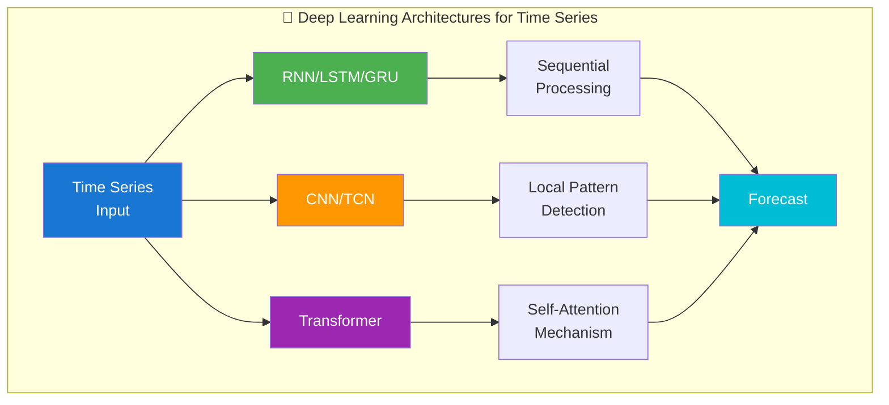
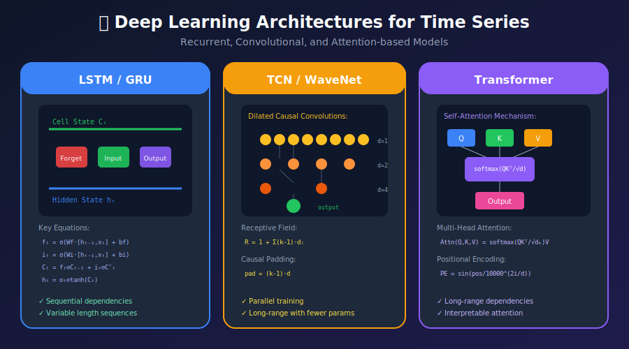

# Deep Learning for Time Series Forecasting

<p align="center">
  
  
  
</p>

## Table of Contents

- [Overview](#overview)

- [Data Preparation for Neural Networks](#data-preparation-for-neural-networks)

- [Recurrent Neural Networks (RNN/LSTM/GRU)](#recurrent-neural-networks)

- [Convolutional Neural Networks (CNN)](#convolutional-neural-networks)

- [Transformer Models](#transformer-models)

- [Hybrid Architectures](#hybrid-architectures)

- [Training Best Practices](#training-best-practices)

- [State-of-the-Art Models](#state-of-the-art-models)

---

## Overview

Deep learning models can capture complex temporal patterns without manual feature engineering.

### When to Use Deep Learning

<p align="center">
<svg width="700" height="200" xmlns="http://www.w3.org/2000/svg">
  <defs>
    <filter id="dl-shadow" x="-10%" y="-10%" width="120%" height="120%">
      <feDropShadow dx="2" dy="2" stdDeviation="3" flood-opacity="0.2"/>
    </filter>
  </defs>

  <!-- Background -->
  <rect x="0" y="0" width="700" height="200" fill="#fafafa" rx="10"/>

  <!-- Title -->
  <text x="350" y="25" fill="#333" font-size="14" text-anchor="middle" font-weight="bold">🤔 WHEN TO USE DEEP LEARNING?</text>

  <!-- Use DL Box -->
  <rect x="20" y="40" width="320" height="145" rx="10" fill="#E8F5E9" stroke="#4CAF50" stroke-width="2" filter="url(#dl-shadow)"/>
  <rect x="30" y="50" width="300" height="30" rx="5" fill="#4CAF50"/>
  <text x="180" y="70" fill="white" font-size="12" text-anchor="middle" font-weight="bold">✅ USE DEEP LEARNING WHEN</text>

  <text x="40" y="100" fill="#2E7D32" font-size="11">• Large dataset (>10K samples)</text>
  <text x="40" y="120" fill="#2E7D32" font-size="11">• Complex non-linear patterns</text>
  <text x="40" y="140" fill="#2E7D32" font-size="11">• Multiple related time series</text>
  <text x="40" y="160" fill="#2E7D32" font-size="11">• Long-range dependencies</text>
  <text x="40" y="180" fill="#2E7D32" font-size="11">• Rich multivariate inputs</text>

  <!-- Avoid DL Box -->
  <rect x="360" y="40" width="320" height="145" rx="10" fill="#FFEBEE" stroke="#F44336" stroke-width="2" filter="url(#dl-shadow)"/>
  <rect x="370" y="50" width="300" height="30" rx="5" fill="#F44336"/>
  <text x="520" y="70" fill="white" font-size="12" text-anchor="middle" font-weight="bold">❌ AVOID DEEP LEARNING WHEN</text>

  <text x="380" y="100" fill="#C62828" font-size="11">• Small dataset (<1K samples)</text>
  <text x="380" y="120" fill="#C62828" font-size="11">• Simple linear trends</text>
  <text x="380" y="140" fill="#C62828" font-size="11">• Limited compute resources</text>
  <text x="380" y="160" fill="#C62828" font-size="11">• Need interpretability</text>
  <text x="380" y="180" fill="#C62828" font-size="11">• Strict real-time requirements</text>
</svg>
</p>

### Architecture Landscape



<p align="center">
<svg width="750" height="220" xmlns="http://www.w3.org/2000/svg">
  <defs>
    <filter id="arch-shadow" x="-10%" y="-10%" width="120%" height="120%">
      <feDropShadow dx="2" dy="2" stdDeviation="3" flood-opacity="0.2"/>
    </filter>
  </defs>

  <!-- Background -->
  <rect x="0" y="0" width="750" height="220" fill="#fafafa" rx="10"/>

  <!-- Title -->
  <text x="375" y="25" fill="#333" font-size="14" text-anchor="middle" font-weight="bold">🏗️ ARCHITECTURE COMPARISON</text>

  <!-- RNN/LSTM/GRU -->
  <rect x="20" y="40" width="220" height="165" rx="10" fill="#E3F2FD" stroke="#1976D2" stroke-width="2" filter="url(#arch-shadow)"/>
  <rect x="30" y="50" width="200" height="30" rx="5" fill="#1976D2"/>
  <text x="130" y="70" fill="white" font-size="11" text-anchor="middle" font-weight="bold">🔄 RNN / LSTM / GRU</text>

  <!-- LSTM cells visualization -->
  <rect x="45" y="90" width="40" height="30" rx="5" fill="#64B5F6"/>
  <text x="65" y="110" fill="white" font-size="10" text-anchor="middle">h₁</text>
  <text x="95" y="105" fill="#1976D2" font-size="14">→</text>
  <rect x="105" y="90" width="40" height="30" rx="5" fill="#64B5F6"/>
  <text x="125" y="110" fill="white" font-size="10" text-anchor="middle">h₂</text>
  <text x="155" y="105" fill="#1976D2" font-size="14">→</text>
  <rect x="165" y="90" width="40" height="30" rx="5" fill="#64B5F6"/>
  <text x="185" y="110" fill="white" font-size="10" text-anchor="middle">hₙ</text>

  <text x="130" y="145" fill="#1565C0" font-size="10" text-anchor="middle">✓ Sequential processing</text>
  <text x="130" y="160" fill="#1565C0" font-size="10" text-anchor="middle">✓ Memory cells</text>
  <text x="130" y="175" fill="#1565C0" font-size="10" text-anchor="middle">✓ Variable length</text>
  <text x="130" y="195" fill="#666" font-size="9" text-anchor="middle" font-style="italic">Best for: Medium sequences</text>

  <!-- CNN/TCN -->
  <rect x="265" y="40" width="220" height="165" rx="10" fill="#FFF3E0" stroke="#FF9800" stroke-width="2" filter="url(#arch-shadow)"/>
  <rect x="275" y="50" width="200" height="30" rx="5" fill="#FF9800"/>
  <text x="375" y="70" fill="white" font-size="11" text-anchor="middle" font-weight="bold">📊 CNN / TCN</text>

  <!-- Conv visualization -->
  <rect x="295" y="90" width="150" height="25" rx="3" fill="#FFE0B2"/>
  <rect x="300" y="95" width="30" height="15" rx="2" fill="#FFB74D"/>
  <rect x="335" y="95" width="30" height="15" rx="2" fill="#FFB74D"/>
  <rect x="370" y="95" width="30" height="15" rx="2" fill="#FFB74D"/>
  <rect x="405" y="95" width="30" height="15" rx="2" fill="#FFB74D"/>

  <text x="375" y="145" fill="#E65100" font-size="10" text-anchor="middle">✓ Local pattern detection</text>
  <text x="375" y="160" fill="#E65100" font-size="10" text-anchor="middle">✓ Fast training (parallel)</text>
  <text x="375" y="175" fill="#E65100" font-size="10" text-anchor="middle">✓ Dilated convolutions</text>
  <text x="375" y="195" fill="#666" font-size="9" text-anchor="middle" font-style="italic">Best for: Fixed-length patterns</text>

  <!-- Transformer -->
  <rect x="510" y="40" width="220" height="165" rx="10" fill="#F3E5F5" stroke="#9C27B0" stroke-width="2" filter="url(#arch-shadow)"/>
  <rect x="520" y="50" width="200" height="30" rx="5" fill="#9C27B0"/>
  <text x="620" y="70" fill="white" font-size="11" text-anchor="middle" font-weight="bold">🎯 TRANSFORMER</text>

  <!-- Attention visualization -->
  <rect x="540" y="90" width="160" height="30" rx="5" fill="#E1BEE7"/>
  <text x="620" y="110" fill="#7B1FA2" font-size="10" text-anchor="middle" font-weight="bold">Self-Attention</text>

  <text x="620" y="145" fill="#6A1B9A" font-size="10" text-anchor="middle">✓ Long-range dependencies</text>
  <text x="620" y="160" fill="#6A1B9A" font-size="10" text-anchor="middle">✓ Parallel training</text>
  <text x="620" y="175" fill="#6A1B9A" font-size="10" text-anchor="middle">✓ Attention weights</text>
  <text x="620" y="195" fill="#666" font-size="9" text-anchor="middle" font-style="italic">Best for: Long sequences</text>
</svg>
</p>

---

## Data Preparation for Neural Networks

### Sequence Creation

```python
import numpy as np
import torch
from torch.utils.data import Dataset, DataLoader

class TimeSeriesDataset(Dataset):
    """
    PyTorch Dataset for time series
    """

    def __init__(self, data, lookback, horizon, stride=1):
        self.data = torch.FloatTensor(data)
        self.lookback = lookback
        self.horizon = horizon
        self.stride = stride

    def __len__(self):
        return (len(self.data) - self.lookback - self.horizon) // self.stride + 1

    def __getitem__(self, idx):
        idx = idx * self.stride
        x = self.data[idx:idx + self.lookback]
        y = self.data[idx + self.lookback:idx + self.lookback + self.horizon]
        return x, y

def create_sequences(data, lookback, horizon):
    """
    Create input-output sequences for training

    Args:
        data: numpy array of shape (n_samples, n_features)
        lookback: number of past time steps
        horizon: number of future time steps to predict
    """
    X, y = [], []

    for i in range(len(data) - lookback - horizon + 1):
        X.append(data[i:i + lookback])
        y.append(data[i + lookback:i + lookback + horizon])

    return np.array(X), np.array(y)

# Usage
lookback = 30
horizon = 7

# Normalize data
from sklearn.preprocessing import StandardScaler
scaler = StandardScaler()
data_scaled = scaler.fit_transform(data.reshape(-1, 1))

# Create sequences
X, y = create_sequences(data_scaled, lookback, horizon)

# Split temporally
train_size = int(len(X) * 0.8)
X_train, X_test = X[:train_size], X[train_size:]
y_train, y_test = y[:train_size], y[train_size:]

# Create DataLoaders
train_dataset = TimeSeriesDataset(X_train, lookback, horizon)
train_loader = DataLoader(train_dataset, batch_size=32, shuffle=True)

```

### Multivariate Sequences

```python
def create_multivariate_sequences(data, target_col, lookback, horizon):
    """
    Create sequences for multivariate time series

    Args:
        data: DataFrame with multiple features
        target_col: column index to predict
        lookback: past time steps
        horizon: future time steps
    """
    values = data.values
    X, y = [], []

    for i in range(len(values) - lookback - horizon + 1):
        X.append(values[i:i + lookback])  # All features as input
        y.append(values[i + lookback:i + lookback + horizon, target_col])  # Only target

    return np.array(X), np.array(y)

```

---

## Recurrent Neural Networks

### LSTM Architecture



### LSTM Mathematical Formulation

The **Long Short-Term Memory (LSTM)** network uses gating mechanisms to control information flow:

#### Gate Equations

At each time step $t$, given input $x_t$ and previous hidden state $h_{t-1}$:

| Gate | Formula | Function |
|------|---------|----------|
| **Forget Gate** | $f_t = \sigma(W_f \cdot [h_{t-1}, x_t] + b_f)$ | Decides what to discard from cell state |
| **Input Gate** | $i_t = \sigma(W_i \cdot [h_{t-1}, x_t] + b_i)$ | Decides what new information to store |
| **Candidate Values** | $\tilde{C}_t = \tanh(W_C \cdot [h_{t-1}, x_t] + b_C)$ | Creates candidate values to add |
| **Cell State Update** | $C_t = f_t \odot C_{t-1} + i_t \odot \tilde{C}_t$ | Updates the cell state |
| **Output Gate** | $o_t = \sigma(W_o \cdot [h_{t-1}, x_t] + b_o)$ | Decides what to output |
| **Hidden State** | $h_t = o_t \odot \tanh(C_t)$ | Outputs filtered cell state |

Where:

- $\sigma(\cdot)$ is the sigmoid function: $\sigma(x) = \frac{1}{1 + e^{-x}}$

- $\odot$ denotes element-wise (Hadamard) product

- $[\cdot, \cdot]$ denotes concatenation

<p align="center">
<svg width="650" height="180" xmlns="http://www.w3.org/2000/svg">
  <rect x="0" y="0" width="650" height="180" rx="10" fill="#1e293b"/>
  <text x="325" y="25" fill="#f8fafc" font-size="14" text-anchor="middle" font-weight="bold">LSTM Cell State Flow</text>
  
  <!-- Cell state line -->
  <line x1="50" y1="60" x2="600" y2="60" stroke="#22c55e" stroke-width="3"/>
  <text x="50" y="50" fill="#22c55e" font-size="11">Cₜ₋₁</text>
  <text x="580" y="50" fill="#22c55e" font-size="11">Cₜ</text>
  
  <!-- Hidden state line -->
  <line x1="50" y1="140" x2="600" y2="140" stroke="#3b82f6" stroke-width="3"/>
  <text x="50" y="160" fill="#3b82f6" font-size="11">hₜ₋₁</text>
  <text x="580" y="160" fill="#3b82f6" font-size="11">hₜ</text>
  
  <!-- Gates -->
  <rect x="120" y="85" width="60" height="35" rx="5" fill="#ef4444" opacity="0.8"/>
  <text x="150" y="107" fill="white" font-size="10" text-anchor="middle">Forget</text>
  
  <rect x="220" y="85" width="60" height="35" rx="5" fill="#22c55e" opacity="0.8"/>
  <text x="250" y="107" fill="white" font-size="10" text-anchor="middle">Input</text>
  
  <rect x="320" y="85" width="60" height="35" rx="5" fill="#f59e0b" opacity="0.8"/>
  <text x="350" y="107" fill="white" font-size="10" text-anchor="middle">C̃</text>
  
  <rect x="450" y="85" width="60" height="35" rx="5" fill="#8b5cf6" opacity="0.8"/>
  <text x="480" y="107" fill="white" font-size="10" text-anchor="middle">Output</text>
  
  <!-- Operations -->
  <circle cx="150" cy="60" r="8" fill="#1e293b" stroke="#ef4444" stroke-width="2"/>
  <text x="150" y="64" fill="white" font-size="10" text-anchor="middle">×</text>
  
  <circle cx="285" cy="60" r="8" fill="#1e293b" stroke="#22c55e" stroke-width="2"/>
  <text x="285" y="64" fill="white" font-size="10" text-anchor="middle">+</text>
  
  <circle cx="530" cy="140" r="8" fill="#1e293b" stroke="#8b5cf6" stroke-width="2"/>
  <text x="530" y="144" fill="white" font-size="10" text-anchor="middle">×</text>
</svg>
</p>

### GRU (Simplified LSTM)

**Gated Recurrent Unit** combines forget and input gates:

$$z_t = \sigma(W_z \cdot [h_{t-1}, x_t]) \quad \text{(update gate)}
r_t = \sigma(W_r \cdot [h_{t-1}, x_t]) \quad \text{(reset gate)}
\tilde{h}_t = \tanh(W \cdot [r_t \odot h_{t-1}, x_t]) \quad \text{(candidate)}
h_t = (1 - z_t) \odot h_{t-1} + z_t \odot \tilde{h}_t \quad \text{(output)}$$

### PyTorch LSTM Implementation

```python
import torch
import torch.nn as nn

class LSTMForecaster(nn.Module):
    """
    LSTM model for time series forecasting
    """

    def __init__(self, input_size, hidden_size, num_layers, output_size, dropout=0.2):
        super().__init__()

        self.hidden_size = hidden_size
        self.num_layers = num_layers

        self.lstm = nn.LSTM(
            input_size=input_size,
            hidden_size=hidden_size,
            num_layers=num_layers,
            batch_first=True,
            dropout=dropout if num_layers > 1 else 0
        )

        self.fc = nn.Sequential(
            nn.Linear(hidden_size, hidden_size // 2),
            nn.ReLU(),
            nn.Dropout(dropout),
            nn.Linear(hidden_size // 2, output_size)
        )

    def forward(self, x):
        # x shape: (batch, seq_len, input_size)
        lstm_out, (h_n, c_n) = self.lstm(x)

        # Use last hidden state
        out = self.fc(lstm_out[:, -1, :])

        return out

# Usage
model = LSTMForecaster(
    input_size=1,        # univariate
    hidden_size=64,
    num_layers=2,
    output_size=7,       # predict 7 steps
    dropout=0.2
)

```

### GRU Model

```python
class GRUForecaster(nn.Module):
    """
    GRU - simpler than LSTM, often similar performance
    """

    def __init__(self, input_size, hidden_size, num_layers, output_size, dropout=0.2):
        super().__init__()

        self.gru = nn.GRU(
            input_size=input_size,
            hidden_size=hidden_size,
            num_layers=num_layers,
            batch_first=True,
            dropout=dropout if num_layers > 1 else 0
        )

        self.fc = nn.Linear(hidden_size, output_size)

    def forward(self, x):
        gru_out, h_n = self.gru(x)
        out = self.fc(gru_out[:, -1, :])
        return out

```

### Bidirectional LSTM

```python
class BiLSTMForecaster(nn.Module):
    """
    Bidirectional LSTM - processes sequence in both directions
    """

    def __init__(self, input_size, hidden_size, num_layers, output_size):
        super().__init__()

        self.lstm = nn.LSTM(
            input_size=input_size,
            hidden_size=hidden_size,
            num_layers=num_layers,
            batch_first=True,
            bidirectional=True
        )

        # Hidden size * 2 for bidirectional
        self.fc = nn.Linear(hidden_size * 2, output_size)

    def forward(self, x):
        lstm_out, _ = self.lstm(x)
        out = self.fc(lstm_out[:, -1, :])
        return out

```

### Encoder-Decoder LSTM (Seq2Seq)

```python
class Seq2SeqLSTM(nn.Module):
    """
    Sequence-to-Sequence LSTM for multi-step forecasting
    """

    def __init__(self, input_size, hidden_size, output_size, horizon):
        super().__init__()

        self.horizon = horizon
        self.hidden_size = hidden_size

        # Encoder
        self.encoder = nn.LSTM(
            input_size=input_size,
            hidden_size=hidden_size,
            batch_first=True
        )

        # Decoder
        self.decoder = nn.LSTM(
            input_size=output_size,
            hidden_size=hidden_size,
            batch_first=True
        )

        self.fc = nn.Linear(hidden_size, output_size)

    def forward(self, x, target=None, teacher_forcing_ratio=0.5):
        batch_size = x.size(0)

        # Encode
        _, (hidden, cell) = self.encoder(x)

        # Initialize decoder input
        decoder_input = x[:, -1:, :1]  # Last value

        outputs = []
        for t in range(self.horizon):
            decoder_out, (hidden, cell) = self.decoder(decoder_input, (hidden, cell))
            prediction = self.fc(decoder_out)
            outputs.append(prediction)

            # Teacher forcing
            if target is not None and torch.rand(1).item() < teacher_forcing_ratio:
                decoder_input = target[:, t:t+1, :]
            else:
                decoder_input = prediction

        return torch.cat(outputs, dim=1)

```

---

## Convolutional Neural Networks

### Temporal Convolutional Network (TCN)

```python
class TemporalBlock(nn.Module):
    """
    Causal dilated convolution block
    """

    def __init__(self, in_channels, out_channels, kernel_size, dilation, dropout=0.2):
        super().__init__()

        padding = (kernel_size - 1) * dilation

        self.conv1 = nn.Conv1d(
            in_channels, out_channels, kernel_size,
            padding=padding, dilation=dilation
        )
        self.conv2 = nn.Conv1d(
            out_channels, out_channels, kernel_size,
            padding=padding, dilation=dilation
        )

        self.chomp1 = Chomp1d(padding)
        self.chomp2 = Chomp1d(padding)

        self.relu1 = nn.ReLU()
        self.relu2 = nn.ReLU()

        self.dropout1 = nn.Dropout(dropout)
        self.dropout2 = nn.Dropout(dropout)

        self.downsample = nn.Conv1d(in_channels, out_channels, 1) \
            if in_channels != out_channels else None

        self.relu = nn.ReLU()

    def forward(self, x):
        out = self.chomp1(self.conv1(x))
        out = self.relu1(out)
        out = self.dropout1(out)

        out = self.chomp2(self.conv2(out))
        out = self.relu2(out)
        out = self.dropout2(out)

        res = x if self.downsample is None else self.downsample(x)
        return self.relu(out + res)

class Chomp1d(nn.Module):
    """Remove padding from causal convolution"""
    def __init__(self, chomp_size):
        super().__init__()
        self.chomp_size = chomp_size

    def forward(self, x):
        return x[:, :, :-self.chomp_size].contiguous()

class TCN(nn.Module):
    """
    Temporal Convolutional Network
    """

    def __init__(self, input_size, output_size, num_channels, kernel_size=3, dropout=0.2):
        super().__init__()

        layers = []
        num_levels = len(num_channels)

        for i in range(num_levels):
            dilation = 2 ** i
            in_ch = input_size if i == 0 else num_channels[i-1]
            out_ch = num_channels[i]

            layers.append(TemporalBlock(
                in_ch, out_ch, kernel_size, dilation, dropout
            ))

        self.network = nn.Sequential(*layers)
        self.fc = nn.Linear(num_channels[-1], output_size)

    def forward(self, x):
        # x: (batch, seq_len, features) -> (batch, features, seq_len)
        x = x.transpose(1, 2)
        out = self.network(x)
        # Take last time step
        out = self.fc(out[:, :, -1])
        return out

# Usage
model = TCN(
    input_size=1,
    output_size=7,
    num_channels=[32, 64, 64],
    kernel_size=3,
    dropout=0.2
)

```

### 1D CNN for Time Series

```python
class CNN1DForecaster(nn.Module):
    """
    Simple 1D CNN for time series
    """

    def __init__(self, input_size, seq_len, output_size):
        super().__init__()

        self.conv_layers = nn.Sequential(
            nn.Conv1d(input_size, 64, kernel_size=3, padding=1),
            nn.ReLU(),
            nn.MaxPool1d(2),

            nn.Conv1d(64, 128, kernel_size=3, padding=1),
            nn.ReLU(),
            nn.MaxPool1d(2),

            nn.Conv1d(128, 64, kernel_size=3, padding=1),
            nn.ReLU(),
            nn.AdaptiveAvgPool1d(1)
        )

        self.fc = nn.Sequential(
            nn.Linear(64, 32),
            nn.ReLU(),
            nn.Linear(32, output_size)
        )

    def forward(self, x):
        # x: (batch, seq_len, features) -> (batch, features, seq_len)
        x = x.transpose(1, 2)
        x = self.conv_layers(x)
        x = x.squeeze(-1)
        return self.fc(x)

```

---

## Transformer Models

### Self-Attention Mechanism

The **Scaled Dot-Product Attention** is the core of Transformers:

$$\text{Attention}(Q, K, V) = \text{softmax}\left(\frac{QK^T}{\sqrt{d_k}}\right)V$$

Where:

- $Q \in \mathbb{R}^{n \times d_k}$ — Query matrix

- $K \in \mathbb{R}^{m \times d_k}$ — Key matrix

- $V \in \mathbb{R}^{m \times d_v}$ — Value matrix

- $d_k$ — Key dimension (scaling factor prevents vanishing gradients)

### Multi-Head Attention

Allows the model to attend to different representation subspaces:

$$\text{MultiHead}(Q, K, V) = \text{Concat}(\text{head}_1, \ldots, \text{head}_h)W^O
\text{where head}_i = \text{Attention}(QW_i^Q, KW_i^K, VW_i^V)$$

### Positional Encoding

Since Transformers lack recurrence, we add positional information:

$$PE_{(pos, 2i)} = \sin\left(\frac{pos}{10000^{2i/d_{model}}}\right)
PE_{(pos, 2i+1)} = \cos\left(\frac{pos}{10000^{2i/d_{model}}}\right)$$

<p align="center">
<svg width="700" height="150" xmlns="http://www.w3.org/2000/svg">
  <rect x="0" y="0" width="700" height="150" rx="10" fill="#1e293b"/>
  <text x="350" y="25" fill="#f8fafc" font-size="14" text-anchor="middle" font-weight="bold">Transformer Self-Attention for Time Series</text>
  
  <!-- Input sequence -->
  <rect x="30" y="50" width="50" height="30" rx="5" fill="#3b82f6"/>
  <text x="55" y="70" fill="white" font-size="10" text-anchor="middle">x₁</text>
  <rect x="90" y="50" width="50" height="30" rx="5" fill="#3b82f6"/>
  <text x="115" y="70" fill="white" font-size="10" text-anchor="middle">x₂</text>
  <rect x="150" y="50" width="50" height="30" rx="5" fill="#3b82f6"/>
  <text x="175" y="70" fill="white" font-size="10" text-anchor="middle">...</text>
  <rect x="210" y="50" width="50" height="30" rx="5" fill="#3b82f6"/>
  <text x="235" y="70" fill="white" font-size="10" text-anchor="middle">xₜ</text>
  
  <!-- Attention box -->
  <rect x="300" y="40" width="150" height="60" rx="8" fill="#8b5cf6" opacity="0.8"/>
  <text x="375" y="60" fill="white" font-size="10" text-anchor="middle" font-weight="bold">Self-Attention</text>
  <text x="375" y="80" fill="white" font-size="9" text-anchor="middle" font-family="monospace">softmax(QKᵀ/√d)V</text>
  
  <!-- Output -->
  <rect x="490" y="50" width="50" height="30" rx="5" fill="#22c55e"/>
  <text x="515" y="70" fill="white" font-size="10" text-anchor="middle">h₁</text>
  <rect x="550" y="50" width="50" height="30" rx="5" fill="#22c55e"/>
  <text x="575" y="70" fill="white" font-size="10" text-anchor="middle">h₂</text>
  <rect x="610" y="50" width="50" height="30" rx="5" fill="#22c55e"/>
  <text x="635" y="70" fill="white" font-size="10" text-anchor="middle">...</text>
  
  <!-- Arrows -->
  <path d="M265 65 L295 65" stroke="#94a3b8" stroke-width="2" marker-end="url(#arrowhead)"/>
  <path d="M455 65 L485 65" stroke="#94a3b8" stroke-width="2" marker-end="url(#arrowhead)"/>
  
  <!-- Caption -->
  <text x="350" y="130" fill="#94a3b8" font-size="11" text-anchor="middle">Each output position attends to all input positions</text>
</svg>
</p>

### Transformer for Time Series

```python
class PositionalEncoding(nn.Module):
    """
    Add positional information to embeddings
    """

    def __init__(self, d_model, max_len=5000, dropout=0.1):
        super().__init__()
        self.dropout = nn.Dropout(p=dropout)

        pe = torch.zeros(max_len, d_model)
        position = torch.arange(0, max_len, dtype=torch.float).unsqueeze(1)
        div_term = torch.exp(torch.arange(0, d_model, 2).float() *
                           (-np.log(10000.0) / d_model))

        pe[:, 0::2] = torch.sin(position * div_term)
        pe[:, 1::2] = torch.cos(position * div_term)
        pe = pe.unsqueeze(0)

        self.register_buffer('pe', pe)

    def forward(self, x):
        x = x + self.pe[:, :x.size(1), :]
        return self.dropout(x)

class TransformerForecaster(nn.Module):
    """
    Transformer model for time series forecasting
    """

    def __init__(self, input_size, d_model, nhead, num_layers,
                 output_size, dropout=0.1):
        super().__init__()

        self.input_projection = nn.Linear(input_size, d_model)
        self.pos_encoder = PositionalEncoding(d_model, dropout=dropout)

        encoder_layer = nn.TransformerEncoderLayer(
            d_model=d_model,
            nhead=nhead,
            dim_feedforward=d_model * 4,
            dropout=dropout,
            batch_first=True
        )

        self.transformer_encoder = nn.TransformerEncoder(
            encoder_layer, num_layers=num_layers
        )

        self.fc = nn.Linear(d_model, output_size)

    def forward(self, x):
        # x: (batch, seq_len, input_size)
        x = self.input_projection(x)
        x = self.pos_encoder(x)

        # Create causal mask
        mask = self._generate_square_subsequent_mask(x.size(1)).to(x.device)

        x = self.transformer_encoder(x, mask=mask)

        # Use last position for prediction
        out = self.fc(x[:, -1, :])
        return out

    def _generate_square_subsequent_mask(self, sz):
        mask = torch.triu(torch.ones(sz, sz), diagonal=1)
        mask = mask.masked_fill(mask == 1, float('-inf'))
        return mask

# Usage
model = TransformerForecaster(
    input_size=1,
    d_model=64,
    nhead=4,
    num_layers=3,
    output_size=7,
    dropout=0.1
)

```

### Informer (Efficient Transformer)

```python
class ProbSparseAttention(nn.Module):
    """
    Probabilistic sparse attention from Informer paper
    Reduces O(L²) to O(L log L) complexity
    """

    def __init__(self, d_model, n_heads, factor=5):
        super().__init__()
        self.factor = factor
        self.n_heads = n_heads
        self.d_k = d_model // n_heads

        self.W_Q = nn.Linear(d_model, d_model)
        self.W_K = nn.Linear(d_model, d_model)
        self.W_V = nn.Linear(d_model, d_model)
        self.out = nn.Linear(d_model, d_model)

    def forward(self, queries, keys, values):
        B, L, _ = queries.shape

        Q = self.W_Q(queries).view(B, L, self.n_heads, self.d_k)
        K = self.W_K(keys).view(B, L, self.n_heads, self.d_k)
        V = self.W_V(values).view(B, L, self.n_heads, self.d_k)

        # Sparse attention (simplified)
        u = int(self.factor * np.log(L))
        U = int(self.factor * np.log(L))

        # Sample top-u queries
        scores = torch.einsum('blhd,bshd->bhls', Q, K) / np.sqrt(self.d_k)

        # ... (full implementation would include sparse sampling)

        attn = torch.softmax(scores, dim=-1)
        out = torch.einsum('bhls,bshd->blhd', attn, V)

        return self.out(out.reshape(B, L, -1))

```

---

## Hybrid Architectures

### CNN-LSTM Hybrid

```python
class CNNLSTMForecaster(nn.Module):
    """
    CNN for feature extraction + LSTM for sequence modeling
    """

    def __init__(self, input_size, seq_len, hidden_size, output_size):
        super().__init__()

        # CNN feature extractor
        self.cnn = nn.Sequential(
            nn.Conv1d(input_size, 64, kernel_size=3, padding=1),
            nn.ReLU(),
            nn.Conv1d(64, 64, kernel_size=3, padding=1),
            nn.ReLU(),
        )

        # LSTM
        self.lstm = nn.LSTM(
            input_size=64,
            hidden_size=hidden_size,
            num_layers=2,
            batch_first=True,
            dropout=0.2
        )

        self.fc = nn.Linear(hidden_size, output_size)

    def forward(self, x):
        # x: (batch, seq_len, features)
        x = x.transpose(1, 2)  # (batch, features, seq_len)
        x = self.cnn(x)
        x = x.transpose(1, 2)  # (batch, seq_len, cnn_features)

        lstm_out, _ = self.lstm(x)
        out = self.fc(lstm_out[:, -1, :])
        return out

```

### Attention-Enhanced LSTM

```python
class AttentionLSTM(nn.Module):
    """
    LSTM with attention mechanism
    """

    def __init__(self, input_size, hidden_size, output_size):
        super().__init__()

        self.lstm = nn.LSTM(
            input_size=input_size,
            hidden_size=hidden_size,
            batch_first=True,
            bidirectional=True
        )

        self.attention = nn.Sequential(
            nn.Linear(hidden_size * 2, hidden_size),
            nn.Tanh(),
            nn.Linear(hidden_size, 1)
        )

        self.fc = nn.Linear(hidden_size * 2, output_size)

    def forward(self, x):
        lstm_out, _ = self.lstm(x)  # (batch, seq_len, hidden*2)

        # Attention weights
        attn_weights = self.attention(lstm_out)  # (batch, seq_len, 1)
        attn_weights = torch.softmax(attn_weights, dim=1)

        # Weighted sum
        context = torch.sum(attn_weights * lstm_out, dim=1)

        return self.fc(context)

```

---

## Training Best Practices

### Training Loop

```python
def train_model(model, train_loader, val_loader, epochs=100, lr=0.001):
    """
    Complete training loop with validation
    """
    device = torch.device('cuda' if torch.cuda.is_available() else 'cpu')
    model = model.to(device)

    criterion = nn.MSELoss()
    optimizer = torch.optim.Adam(model.parameters(), lr=lr)
    scheduler = torch.optim.lr_scheduler.ReduceLROnPlateau(
        optimizer, mode='min', factor=0.5, patience=10
    )

    best_val_loss = float('inf')
    patience_counter = 0

    for epoch in range(epochs):
        # Training
        model.train()
        train_loss = 0
        for X_batch, y_batch in train_loader:
            X_batch = X_batch.to(device)
            y_batch = y_batch.to(device)

            optimizer.zero_grad()
            predictions = model(X_batch)
            loss = criterion(predictions, y_batch.squeeze())
            loss.backward()

            # Gradient clipping
            torch.nn.utils.clip_grad_norm_(model.parameters(), max_norm=1.0)

            optimizer.step()
            train_loss += loss.item()

        # Validation
        model.eval()
        val_loss = 0
        with torch.no_grad():
            for X_batch, y_batch in val_loader:
                X_batch = X_batch.to(device)
                y_batch = y_batch.to(device)

                predictions = model(X_batch)
                loss = criterion(predictions, y_batch.squeeze())
                val_loss += loss.item()

        train_loss /= len(train_loader)
        val_loss /= len(val_loader)

        scheduler.step(val_loss)

        # Early stopping
        if val_loss < best_val_loss:
            best_val_loss = val_loss
            patience_counter = 0
            torch.save(model.state_dict(), 'best_model.pt')
        else:
            patience_counter += 1
            if patience_counter >= 20:
                print(f"Early stopping at epoch {epoch}")
                break

        if epoch % 10 == 0:
            print(f"Epoch {epoch}: Train Loss={train_loss:.4f}, Val Loss={val_loss:.4f}")

    # Load best model
    model.load_state_dict(torch.load('best_model.pt'))
    return model

```

### Loss Functions

```python
# Common loss functions for time series

class MAPELoss(nn.Module):
    """Mean Absolute Percentage Error"""
    def forward(self, pred, target):
        return torch.mean(torch.abs((target - pred) / target)) * 100

class SMAPELoss(nn.Module):
    """Symmetric MAPE"""
    def forward(self, pred, target):
        return torch.mean(2 * torch.abs(pred - target) /
                         (torch.abs(pred) + torch.abs(target))) * 100

class QuantileLoss(nn.Module):
    """Quantile loss for probabilistic forecasting"""
    def __init__(self, quantile):
        super().__init__()
        self.quantile = quantile

    def forward(self, pred, target):
        errors = target - pred
        return torch.mean(torch.max(
            self.quantile * errors,
            (self.quantile - 1) * errors
        ))

```

---

## State-of-the-Art Models

### Popular Libraries

```python
# 1. Darts (Unified interface)
from darts import TimeSeries
from darts.models import TFTModel, NBEATSModel

series = TimeSeries.from_dataframe(df, 'date', 'value')

# N-BEATS
model = NBEATSModel(
    input_chunk_length=30,
    output_chunk_length=7,
    n_epochs=100
)
model.fit(train_series)
forecast = model.predict(n=7)

# Temporal Fusion Transformer
tft = TFTModel(
    input_chunk_length=30,
    output_chunk_length=7,
    hidden_size=64,
    lstm_layers=1,
    num_attention_heads=4
)

# 2. NeuralForecast
from neuralforecast import NeuralForecast
from neuralforecast.models import NBEATS, NHITS, TFT

models = [
    NBEATS(input_size=30, h=7, max_steps=100),
    NHITS(input_size=30, h=7, max_steps=100),
]

nf = NeuralForecast(models=models, freq='D')
nf.fit(df)
forecasts = nf.predict()

# 3. PyTorch Forecasting
from pytorch_forecasting import TemporalFusionTransformer
from pytorch_forecasting.data import TimeSeriesDataSet

training = TimeSeriesDataSet(
    data,
    time_idx="time_idx",
    target="value",
    group_ids=["group"],
    max_encoder_length=30,
    max_prediction_length=7,
)

tft = TemporalFusionTransformer.from_dataset(training)

```

---

## Summary

Deep learning for time series:

- **LSTM/GRU**: Good for sequential patterns

- **TCN**: Efficient, parallelizable

- **Transformers**: Long-range dependencies

- **Hybrids**: Combine strengths

### Model Selection

| Data Size | Complexity | Recommended |
|-----------|------------|-------------|
| Small | Low | LSTM/GRU |
| Medium | Medium | TCN, CNN-LSTM |
| Large | High | Transformer, TFT |
| Very Large | Complex | N-BEATS, Informer |

### Next Steps

- [07_evaluation_metrics](../07_evaluation_metrics/) - Model evaluation

- [08_deployment](../08_deployment/) - Production deployment

---

<div align="center">

**[⬆ Back to Top](#)** | **[📚 Main Repository](https://github.com/Gaurav14cs17/ml_system_design)**

Made with 💜 by [Gaurav14cs17](https://github.com/Gaurav14cs17)

</div>
