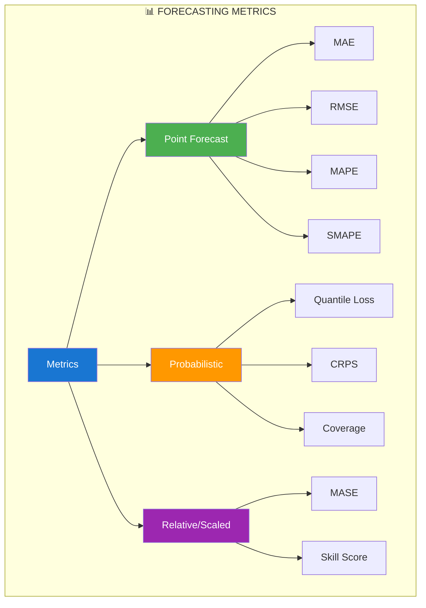
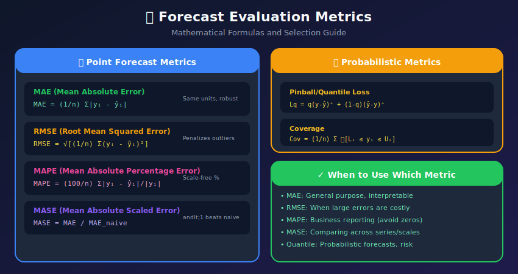
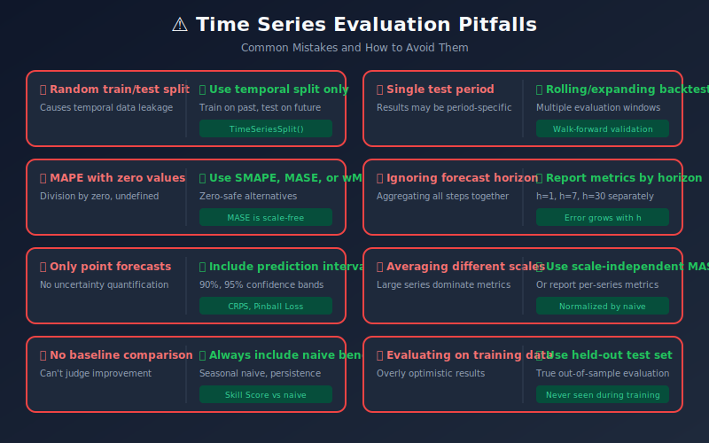

# Evaluation Metrics for Time Series Forecasting

<p align="center">
  
  
  
</p>

## Table of Contents
- [Overview](#overview)
- [Point Forecast Metrics](#point-forecast-metrics)
- [Probabilistic Forecast Metrics](#probabilistic-forecast-metrics)
- [Scale-Independent Metrics](#scale-independent-metrics)
- [Business-Oriented Metrics](#business-oriented-metrics)
- [Visualization Techniques](#visualization-techniques)
- [Backtesting Strategies](#backtesting-strategies)
- [Common Pitfalls](#common-pitfalls)

---

## Overview

Choosing the right evaluation metrics is crucial for developing effective forecasting models.

### Metrics Taxonomy



<p align="center">
<svg width="750" height="250" xmlns="http://www.w3.org/2000/svg">
  <defs>
    <filter id="metric-shadow" x="-10%" y="-10%" width="120%" height="120%">
      <feDropShadow dx="2" dy="2" stdDeviation="3" flood-opacity="0.2"/>
    </filter>
  </defs>

  <!-- Background -->
  <rect x="0" y="0" width="750" height="250" fill="#fafafa" rx="10"/>

  <!-- Title -->
  <text x="375" y="25" fill="#333" font-size="16" text-anchor="middle" font-weight="bold">📊 FORECASTING METRICS TAXONOMY</text>

  <!-- Point Forecast Metrics -->
  <rect x="20" y="45" width="710" height="55" rx="8" fill="#4CAF50" filter="url(#metric-shadow)"/>
  <text x="375" y="65" fill="white" font-size="12" text-anchor="middle" font-weight="bold">📈 POINT FORECAST METRICS</text>

  <rect x="40" y="72" width="70" height="22" rx="4" fill="white" opacity="0.9"/>
  <text x="75" y="87" fill="#2E7D32" font-size="10" text-anchor="middle" font-weight="bold">MAE</text>

  <rect x="120" y="72" width="70" height="22" rx="4" fill="white" opacity="0.9"/>
  <text x="155" y="87" fill="#2E7D32" font-size="10" text-anchor="middle" font-weight="bold">MSE</text>

  <rect x="200" y="72" width="70" height="22" rx="4" fill="white" opacity="0.9"/>
  <text x="235" y="87" fill="#2E7D32" font-size="10" text-anchor="middle" font-weight="bold">RMSE</text>

  <rect x="280" y="72" width="70" height="22" rx="4" fill="white" opacity="0.9"/>
  <text x="315" y="87" fill="#2E7D32" font-size="10" text-anchor="middle" font-weight="bold">MAPE</text>

  <rect x="360" y="72" width="70" height="22" rx="4" fill="white" opacity="0.9"/>
  <text x="395" y="87" fill="#2E7D32" font-size="10" text-anchor="middle" font-weight="bold">SMAPE</text>

  <rect x="440" y="72" width="70" height="22" rx="4" fill="white" opacity="0.9"/>
  <text x="475" y="87" fill="#2E7D32" font-size="10" text-anchor="middle" font-weight="bold">MASE</text>

  <rect x="520" y="72" width="70" height="22" rx="4" fill="white" opacity="0.9"/>
  <text x="555" y="87" fill="#2E7D32" font-size="10" text-anchor="middle" font-weight="bold">MdAE</text>

  <!-- Probabilistic Metrics -->
  <rect x="20" y="110" width="350" height="60" rx="8" fill="#FF9800" filter="url(#metric-shadow)"/>
  <text x="195" y="130" fill="white" font-size="12" text-anchor="middle" font-weight="bold">🎯 PROBABILISTIC METRICS</text>

  <rect x="35" y="142" width="85" height="22" rx="4" fill="white" opacity="0.9"/>
  <text x="77" y="157" fill="#E65100" font-size="9" text-anchor="middle">Quantile Loss</text>

  <rect x="130" y="142" width="55" height="22" rx="4" fill="white" opacity="0.9"/>
  <text x="157" y="157" fill="#E65100" font-size="9" text-anchor="middle">CRPS</text>

  <rect x="195" y="142" width="75" height="22" rx="4" fill="white" opacity="0.9"/>
  <text x="232" y="157" fill="#E65100" font-size="9" text-anchor="middle">Coverage</text>

  <rect x="280" y="142" width="75" height="22" rx="4" fill="white" opacity="0.9"/>
  <text x="317" y="157" fill="#E65100" font-size="9" text-anchor="middle">PI Width</text>

  <!-- Relative/Scaled Metrics -->
  <rect x="380" y="110" width="350" height="60" rx="8" fill="#9C27B0" filter="url(#metric-shadow)"/>
  <text x="555" y="130" fill="white" font-size="12" text-anchor="middle" font-weight="bold">📐 RELATIVE / SCALED</text>

  <rect x="395" y="142" width="65" height="22" rx="4" fill="white" opacity="0.9"/>
  <text x="427" y="157" fill="#6A1B9A" font-size="9" text-anchor="middle">MASE</text>

  <rect x="470" y="142" width="90" height="22" rx="4" fill="white" opacity="0.9"/>
  <text x="515" y="157" fill="#6A1B9A" font-size="9" text-anchor="middle">Relative MAE</text>

  <rect x="570" y="142" width="85" height="22" rx="4" fill="white" opacity="0.9"/>
  <text x="612" y="157" fill="#6A1B9A" font-size="9" text-anchor="middle">Skill Score</text>

  <!-- Business Metrics -->
  <rect x="20" y="180" width="710" height="55" rx="8" fill="#00BCD4" filter="url(#metric-shadow)"/>
  <text x="375" y="200" fill="white" font-size="12" text-anchor="middle" font-weight="bold">💼 BUSINESS-ORIENTED METRICS</text>

  <rect x="100" y="207" width="110" height="22" rx="4" fill="white" opacity="0.9"/>
  <text x="155" y="222" fill="#00838F" font-size="9" text-anchor="middle">Weighted Error</text>

  <rect x="230" y="207" width="120" height="22" rx="4" fill="white" opacity="0.9"/>
  <text x="290" y="222" fill="#00838F" font-size="9" text-anchor="middle">Asymmetric Cost</text>

  <rect x="370" y="207" width="90" height="22" rx="4" fill="white" opacity="0.9"/>
  <text x="415" y="222" fill="#00838F" font-size="9" text-anchor="middle">Bias</text>

  <rect x="480" y="207" width="150" height="22" rx="4" fill="white" opacity="0.9"/>
  <text x="555" y="222" fill="#00838F" font-size="9" text-anchor="middle">Forecast Value Added</text>
</svg>
</p>

---

## Point Forecast Metrics

### Mathematical Definitions

Let $y\_1, y\_2, \ldots, y\_n$ be the actual values and $\hat{y}\_1, \hat{y}\_2, \ldots, \hat{y}\_n$ be the predictions.

#### Mean Absolute Error (MAE)

$$
\text{MAE} = \frac{1}{n}\sum_{i=1}^{n}|y_i - \hat{y}_i|
$$

**Properties:**
- Same units as the target variable
- Robust to outliers (compared to MSE)
- Minimized by the **median** of the predictive distribution

#### Mean Squared Error (MSE) and Root Mean Squared Error (RMSE)

$$
\text{MSE} = \frac{1}{n}\sum_{i=1}^{n}(y_i - \hat{y}_i)^2
\text{RMSE} = \sqrt{\text{MSE}} = \sqrt{\frac{1}{n}\sum_{i=1}^{n}(y_i - \hat{y}_i)^2}
$$

**Properties:**
- MSE minimized by the **mean** of the predictive distribution
- Penalizes large errors quadratically
- RMSE has same units as target; MSE has squared units

#### Mean Absolute Percentage Error (MAPE)

$$
\text{MAPE} = \frac{100\%}{n}\sum_{i=1}^{n}\left|\frac{y_i - \hat{y}_i}{y_i}\right|
$$

**Properties:**
- Scale-independent (percentage)
- ⚠️ Undefined when $y\_i = 0$
- ⚠️ Asymmetric: penalizes under-forecasts more than over-forecasts

#### Symmetric MAPE (SMAPE)

$$
\text{SMAPE} = \frac{100\%}{n}\sum_{i=1}^{n}\frac{2|y_i - \hat{y}_i|}{|y_i| + |\hat{y}_i|}
$$

**Properties:**
- Bounded: $0\% \leq \text{SMAPE} \leq 200\%$
- More symmetric than MAPE
- Still problematic when both $y\_i$ and $\hat{y}\_i$ are near zero

#### Mean Absolute Scaled Error (MASE)

$$
\text{MASE} = \frac{\frac{1}{n}\sum_{i=1}^{n}|y_i - \hat{y}_i|}{\frac{1}{T-m}\sum_{t=m+1}^{T}|y_t - y_{t-m}|}
$$

**Properties:**
- Scale-free: can compare across different series
- $\text{MASE} < 1$: better than naive seasonal forecast
- $\text{MASE} > 1$: worse than naive seasonal forecast
- Denominator uses in-sample seasonal naive MAE

### Core Metrics Implementation

```python
import numpy as np
import pandas as pd
from typing import Union, Tuple

class ForecastMetrics:
    """
    Comprehensive forecasting metrics calculator
    """

    @staticmethod
    def mae(actual: np.ndarray, predicted: np.ndarray) -> float:
        """
        Mean Absolute Error
        MAE = (1/n) * Σ|yᵢ - ŷᵢ|

        Pros: Easy to interpret, same units as data
        Cons: Doesn't penalize large errors heavily
        """
        return np.mean(np.abs(actual - predicted))

    @staticmethod
    def mse(actual: np.ndarray, predicted: np.ndarray) -> float:
        """
        Mean Squared Error
        MSE = (1/n) * Σ(yᵢ - ŷᵢ)²

        Pros: Penalizes large errors
        Cons: Not in original units, sensitive to outliers
        """
        return np.mean((actual - predicted) ** 2)

    @staticmethod
    def rmse(actual: np.ndarray, predicted: np.ndarray) -> float:
        """
        Root Mean Squared Error
        RMSE = √MSE

        Pros: Same units as data, penalizes large errors
        Cons: Sensitive to outliers
        """
        return np.sqrt(np.mean((actual - predicted) ** 2))

    @staticmethod
    def mape(actual: np.ndarray, predicted: np.ndarray,
             epsilon: float = 1e-10) -> float:
        """
        Mean Absolute Percentage Error
        MAPE = (100/n) * Σ|yᵢ - ŷᵢ|/|yᵢ|

        Pros: Scale-independent, easy to interpret
        Cons: Undefined for zero values, asymmetric
        """

        # Avoid division by zero
        actual = np.where(actual == 0, epsilon, actual)
        return np.mean(np.abs((actual - predicted) / actual)) * 100

    @staticmethod
    def smape(actual: np.ndarray, predicted: np.ndarray) -> float:
        """
        Symmetric Mean Absolute Percentage Error
        SMAPE = (100/n) * Σ|yᵢ - ŷᵢ|/(|yᵢ| + |ŷᵢ|)/2

        Pros: Bounded (0-200%), handles zeros better
        Cons: Can still be undefined
        """
        denominator = (np.abs(actual) + np.abs(predicted)) / 2
        denominator = np.where(denominator == 0, 1e-10, denominator)
        return np.mean(np.abs(actual - predicted) / denominator) * 100

    @staticmethod
    def mase(actual: np.ndarray, predicted: np.ndarray,
             training_actual: np.ndarray, seasonality: int = 1) -> float:
        """
        Mean Absolute Scaled Error
        MASE = MAE / MAE_naive

        Pros: Scale-independent, interpretable (< 1 is better than naive)
        Cons: Requires training data
        """

        # Naive forecast error (seasonal naive)
        naive_errors = np.abs(
            training_actual[seasonality:] - training_actual[:-seasonality]
        )
        scale = np.mean(naive_errors)

        if scale == 0:
            return np.inf

        mae = np.mean(np.abs(actual - predicted))
        return mae / scale

    @staticmethod
    def mdae(actual: np.ndarray, predicted: np.ndarray) -> float:
        """
        Median Absolute Error
        More robust to outliers than MAE
        """
        return np.median(np.abs(actual - predicted))

    @staticmethod
    def r2_score(actual: np.ndarray, predicted: np.ndarray) -> float:
        """
        R-squared (Coefficient of Determination)
        R² = 1 - SS_res / SS_tot
        """
        ss_res = np.sum((actual - predicted) ** 2)
        ss_tot = np.sum((actual - np.mean(actual)) ** 2)
        return 1 - (ss_res / ss_tot)

# Usage
metrics = ForecastMetrics()
print(f"MAE: {metrics.mae(actual, predicted):.4f}")
print(f"RMSE: {metrics.rmse(actual, predicted):.4f}")
print(f"MAPE: {metrics.mape(actual, predicted):.2f}%")
print(f"SMAPE: {metrics.smape(actual, predicted):.2f}%")
```

### Metrics Comparison



---

## Probabilistic Forecast Metrics

### Quantile Loss and CRPS

```python
class ProbabilisticMetrics:
    """
    Metrics for probabilistic forecasts
    """

    @staticmethod
    def pinball_loss(actual: np.ndarray, predicted: np.ndarray,
                     quantile: float) -> float:
        """
        Pinball/Quantile Loss

        L_q(y, ŷ) = q * (y - ŷ) if y >= ŷ
                  = (1-q) * (ŷ - y) if y < ŷ
        """
        errors = actual - predicted
        return np.mean(
            np.where(errors >= 0,
                    quantile * errors,
                    (quantile - 1) * errors)
        )

    @staticmethod
    def quantile_loss(actual: np.ndarray,
                      quantile_predictions: dict) -> dict:
        """
        Quantile loss for multiple quantiles

        Args:
            actual: Actual values
            quantile_predictions: Dict of {quantile: predictions}
        """
        losses = {}
        for q, pred in quantile_predictions.items():
            losses[q] = ProbabilisticMetrics.pinball_loss(actual, pred, q)
        return losses

    @staticmethod
    def crps(actual: np.ndarray,
             forecast_samples: np.ndarray) -> float:
        """
        Continuous Ranked Probability Score
        CRPS = ∫[F(x) - 1(x >= y)]² dx

        Approximated using samples from predictive distribution
        """

        # Sort samples
        sorted_samples = np.sort(forecast_samples, axis=1)
        n_samples = sorted_samples.shape[1]

        crps_values = []
        for i, y in enumerate(actual):
            samples = sorted_samples[i]

            # Empirical CDF
            below = np.sum(samples < y)
            above = n_samples - below

            crps_i = (
                np.sum(np.abs(samples[samples < y] - y)) * (2 * np.arange(below) + 1) / n_samples**2
                + np.sum(np.abs(samples[samples >= y] - y)) * (2 * (n_samples - np.arange(above) - 1) + 1) / n_samples**2
            ).mean() if len(samples) > 0 else 0

            crps_values.append(crps_i)

        return np.mean(crps_values)

    @staticmethod
    def prediction_interval_coverage(actual: np.ndarray,
                                     lower: np.ndarray,
                                     upper: np.ndarray) -> float:
        """
        Coverage: % of actuals within prediction interval
        """
        within = (actual >= lower) & (actual <= upper)
        return np.mean(within) * 100

    @staticmethod
    def prediction_interval_width(lower: np.ndarray,
                                  upper: np.ndarray,
                                  normalize_by: np.ndarray = None) -> float:
        """
        Average width of prediction interval
        """
        width = upper - lower
        if normalize_by is not None:
            width = width / np.abs(normalize_by)
        return np.mean(width)

    @staticmethod
    def winkler_score(actual: np.ndarray, lower: np.ndarray,
                      upper: np.ndarray, alpha: float = 0.05) -> float:
        """
        Winkler Score: Penalizes both width and violations
        """
        width = upper - lower

        below = actual < lower
        above = actual > upper

        score = width.copy()
        score[below] += (2/alpha) * (lower[below] - actual[below])
        score[above] += (2/alpha) * (actual[above] - upper[above])

        return np.mean(score)

# Usage
prob_metrics = ProbabilisticMetrics()

# For quantile forecasts
quantile_preds = {
    0.1: lower_10,
    0.5: median_pred,
    0.9: upper_90
}
q_losses = prob_metrics.quantile_loss(actual, quantile_preds)

# Coverage and width
coverage = prob_metrics.prediction_interval_coverage(actual, lower_90, upper_90)
print(f"90% PI Coverage: {coverage:.1f}%")  # Should be ~90%
```

---

## Scale-Independent Metrics

### Relative Metrics

```python
class RelativeMetrics:
    """
    Scale-independent metrics for comparing across series
    """

    @staticmethod
    def relative_mae(actual: np.ndarray, predicted: np.ndarray,
                    baseline_pred: np.ndarray) -> float:
        """
        RelMAE = MAE_model / MAE_baseline
        < 1 means model is better than baseline
        """
        mae_model = np.mean(np.abs(actual - predicted))
        mae_baseline = np.mean(np.abs(actual - baseline_pred))
        return mae_model / mae_baseline

    @staticmethod
    def skill_score(actual: np.ndarray, predicted: np.ndarray,
                   baseline_pred: np.ndarray) -> float:
        """
        Skill Score = 1 - (MSE_model / MSE_baseline)
        > 0 means model is better than baseline
        1 is perfect, 0 equals baseline
        """
        mse_model = np.mean((actual - predicted) ** 2)
        mse_baseline = np.mean((actual - baseline_pred) ** 2)
        return 1 - (mse_model / mse_baseline)

    @staticmethod
    def geometric_mean_relative_absolute_error(
        actual: np.ndarray, predicted: np.ndarray,
        baseline_pred: np.ndarray) -> float:
        """
        GMRAE - Geometric mean of relative absolute errors
        """
        rae = np.abs(actual - predicted) / np.abs(actual - baseline_pred)

        # Handle zeros
        rae = rae[~np.isinf(rae) & ~np.isnan(rae)]
        return np.exp(np.mean(np.log(rae)))

    @staticmethod
    def percent_better(actual: np.ndarray, predicted: np.ndarray,
                      baseline_pred: np.ndarray) -> float:
        """
        Percentage of time steps where model beats baseline
        """
        model_error = np.abs(actual - predicted)
        baseline_error = np.abs(actual - baseline_pred)
        return np.mean(model_error < baseline_error) * 100

# Create naive baseline
def seasonal_naive_forecast(series, horizon, seasonality=7):
    """Seasonal naive: forecast = value from same season last cycle"""
    return series.shift(seasonality).iloc[-horizon:].values

baseline = seasonal_naive_forecast(train_series, len(test_series))
relative = RelativeMetrics()

skill = relative.skill_score(actual, predicted, baseline)
print(f"Skill Score: {skill:.4f}")
```

---

## Business-Oriented Metrics

### Cost-Weighted Metrics

```python
class BusinessMetrics:
    """
    Business-relevant forecasting metrics
    """

    @staticmethod
    def weighted_absolute_error(actual: np.ndarray, predicted: np.ndarray,
                                weights: np.ndarray) -> float:
        """
        Weighted error based on business importance
        """
        return np.sum(weights * np.abs(actual - predicted)) / np.sum(weights)

    @staticmethod
    def asymmetric_error(actual: np.ndarray, predicted: np.ndarray,
                        over_penalty: float = 1.0,
                        under_penalty: float = 2.0) -> float:
        """
        Different penalties for over vs under forecasting

        Example: In inventory, understocking (stockout) may be
        more costly than overstocking
        """
        errors = actual - predicted

        # Positive error = under-forecast (actual > predicted)
        # Negative error = over-forecast (actual < predicted)

        costs = np.where(
            errors > 0,
            under_penalty * errors,
            over_penalty * np.abs(errors)
        )

        return np.mean(costs)

    @staticmethod
    def inventory_cost(actual_demand: np.ndarray,
                      forecast: np.ndarray,
                      holding_cost: float = 1.0,
                      stockout_cost: float = 10.0,
                      lead_time: int = 1) -> float:
        """
        Calculate inventory cost based on forecast errors
        """

        # Order based on forecast
        order_quantity = forecast

        # Actual inventory position
        inventory = order_quantity - actual_demand

        # Costs
        holding = np.maximum(0, inventory) * holding_cost
        stockout = np.maximum(0, -inventory) * stockout_cost

        return np.sum(holding) + np.sum(stockout)

    @staticmethod
    def bias(actual: np.ndarray, predicted: np.ndarray) -> float:
        """
        Systematic over/under forecasting
        Bias = mean(predicted - actual)

        Positive = over-forecasting
        Negative = under-forecasting
        """
        return np.mean(predicted - actual)

    @staticmethod
    def forecast_value_added(actual: np.ndarray, predicted: np.ndarray,
                            naive_pred: np.ndarray) -> float:
        """
        FVA = (Error_naive - Error_model) / Error_naive * 100
        Positive = model adds value
        """
        mae_naive = np.mean(np.abs(actual - naive_pred))
        mae_model = np.mean(np.abs(actual - predicted))
        return (mae_naive - mae_model) / mae_naive * 100

# Usage
biz_metrics = BusinessMetrics()

# When understocking is 3x more costly than overstocking
asym_error = biz_metrics.asymmetric_error(
    actual, predicted,
    over_penalty=1.0,
    under_penalty=3.0
)

# Check for systematic bias
bias = biz_metrics.bias(actual, predicted)
print(f"Forecast Bias: {bias:.2f} (positive = over-forecasting)")
```

---

## Visualization Techniques

### Comprehensive Visualization

```python
import matplotlib.pyplot as plt
import seaborn as sns

class ForecastVisualizer:
    """
    Visualization tools for forecast evaluation
    """

    @staticmethod
    def plot_forecast_vs_actual(actual, predicted,
                               lower=None, upper=None,
                               title="Forecast vs Actual"):
        """
        Plot predicted vs actual with confidence intervals
        """
        fig, ax = plt.subplots(figsize=(12, 6))

        x = range(len(actual))
        ax.plot(x, actual, 'b-', label='Actual', linewidth=2)
        ax.plot(x, predicted, 'r--', label='Predicted', linewidth=2)

        if lower is not None and upper is not None:
            ax.fill_between(x, lower, upper, alpha=0.3, color='red',
                           label='Prediction Interval')

        ax.set_xlabel('Time')
        ax.set_ylabel('Value')
        ax.set_title(title)
        ax.legend()
        ax.grid(True, alpha=0.3)

        return fig

    @staticmethod
    def plot_residuals(actual, predicted):
        """
        Residual analysis plots
        """
        residuals = actual - predicted

        fig, axes = plt.subplots(2, 2, figsize=(12, 10))

        # Residuals over time
        axes[0, 0].plot(residuals)
        axes[0, 0].axhline(y=0, color='r', linestyle='--')
        axes[0, 0].set_title('Residuals Over Time')
        axes[0, 0].set_ylabel('Residual')

        # Histogram
        axes[0, 1].hist(residuals, bins=30, edgecolor='black', alpha=0.7)
        axes[0, 1].axvline(x=0, color='r', linestyle='--')
        axes[0, 1].set_title('Residual Distribution')

        # Predicted vs Residual
        axes[1, 0].scatter(predicted, residuals, alpha=0.5)
        axes[1, 0].axhline(y=0, color='r', linestyle='--')
        axes[1, 0].set_xlabel('Predicted')
        axes[1, 0].set_ylabel('Residual')
        axes[1, 0].set_title('Predicted vs Residuals')

        # Actual vs Predicted
        axes[1, 1].scatter(actual, predicted, alpha=0.5)
        min_val = min(actual.min(), predicted.min())
        max_val = max(actual.max(), predicted.max())
        axes[1, 1].plot([min_val, max_val], [min_val, max_val], 'r--')
        axes[1, 1].set_xlabel('Actual')
        axes[1, 1].set_ylabel('Predicted')
        axes[1, 1].set_title('Actual vs Predicted')

        plt.tight_layout()
        return fig

    @staticmethod
    def plot_error_by_horizon(errors_by_horizon: dict):
        """
        Plot how error changes with forecast horizon
        """
        horizons = list(errors_by_horizon.keys())
        errors = list(errors_by_horizon.values())

        fig, ax = plt.subplots(figsize=(10, 6))
        ax.bar(horizons, errors, color='steelblue', edgecolor='black')
        ax.set_xlabel('Forecast Horizon')
        ax.set_ylabel('Error')
        ax.set_title('Error by Forecast Horizon')

        return fig

    @staticmethod
    def plot_model_comparison(results: pd.DataFrame,
                             metric='RMSE'):
        """
        Compare multiple models
        """
        fig, ax = plt.subplots(figsize=(10, 6))

        models = results['Model']
        values = results[metric]

        bars = ax.barh(models, values, color='steelblue')
        ax.set_xlabel(metric)
        ax.set_title(f'Model Comparison by {metric}')

        # Add value labels
        for bar, val in zip(bars, values):
            ax.text(bar.get_width() + 0.01 * max(values),
                   bar.get_y() + bar.get_height()/2,
                   f'{val:.4f}', va='center')

        return fig

# Usage
viz = ForecastVisualizer()
fig1 = viz.plot_forecast_vs_actual(actual, predicted, lower, upper)
fig2 = viz.plot_residuals(actual, predicted)
```

---

## Backtesting Strategies

### Rolling Window Backtesting

```python
class ForecastBacktester:
    """
    Backtesting framework for forecast evaluation
    """

    def __init__(self, model_fn, horizon, min_train_size):
        self.model_fn = model_fn
        self.horizon = horizon
        self.min_train_size = min_train_size
        self.results = []

    def expanding_window(self, data, step=1):
        """
        Expanding window backtesting
        Train on all data up to t, predict t+1 to t+h
        """
        n = len(data)

        for t in range(self.min_train_size, n - self.horizon, step):
            train = data[:t]
            test = data[t:t + self.horizon]

            # Train and predict
            model = self.model_fn()
            model.fit(train)
            predictions = model.predict(self.horizon)

            self.results.append({
                'train_end': t,
                'actual': test.values,
                'predicted': predictions,
                'mae': np.mean(np.abs(test.values - predictions)),
                'rmse': np.sqrt(np.mean((test.values - predictions) ** 2))
            })

        return self.results

    def sliding_window(self, data, window_size, step=1):
        """
        Fixed-size sliding window backtesting
        """
        n = len(data)

        for t in range(window_size, n - self.horizon, step):
            train = data[t - window_size:t]
            test = data[t:t + self.horizon]

            model = self.model_fn()
            model.fit(train)
            predictions = model.predict(self.horizon)

            self.results.append({
                'train_end': t,
                'actual': test.values,
                'predicted': predictions,
                'mae': np.mean(np.abs(test.values - predictions))
            })

        return self.results

    def summarize(self):
        """
        Summarize backtest results
        """
        mae_values = [r['mae'] for r in self.results]
        rmse_values = [r['rmse'] for r in self.results]

        return {
            'n_folds': len(self.results),
            'mae_mean': np.mean(mae_values),
            'mae_std': np.std(mae_values),
            'rmse_mean': np.mean(rmse_values),
            'rmse_std': np.std(rmse_values)
        }

# Usage
backtester = ForecastBacktester(
    model_fn=lambda: ARIMAWrapper(order=(1,1,1)),
    horizon=7,
    min_train_size=100
)

results = backtester.expanding_window(data, step=7)
summary = backtester.summarize()
print(f"MAE: {summary['mae_mean']:.4f} ± {summary['mae_std']:.4f}")
```

---

## Common Pitfalls

### Pitfalls to Avoid



---

## Summary

Effective evaluation requires:
1. **Multiple metrics**: No single metric tells the whole story
2. **Proper baselines**: Compare against naive forecasts
3. **Business context**: Weight errors by business impact
4. **Probabilistic assessment**: Evaluate uncertainty estimates
5. **Robust backtesting**: Use temporal cross-validation

### Recommended Metrics by Use Case

| Use Case | Primary Metrics |
|----------|----------------|
| General forecasting | MAE, RMSE, MASE |
| Cross-series comparison | MASE, SMAPE |
| Business reporting | MAPE, Bias |
| Probabilistic forecasts | Quantile Loss, CRPS, Coverage |
| Model selection | MASE, Skill Score |

### Next Steps

- [08_deployment](../08_deployment/) - Production deployment
- [09_case_studies](../09_case_studies/) - Real-world examples

---

<div align="center">

**[⬆ Back to Top](#)** | **[📚 Main Repository](https://github.com/Gaurav14cs17/ml_system_design)**

Made with 💜 by [Gaurav14cs17](https://github.com/Gaurav14cs17)

</div>
