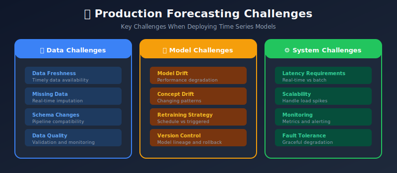
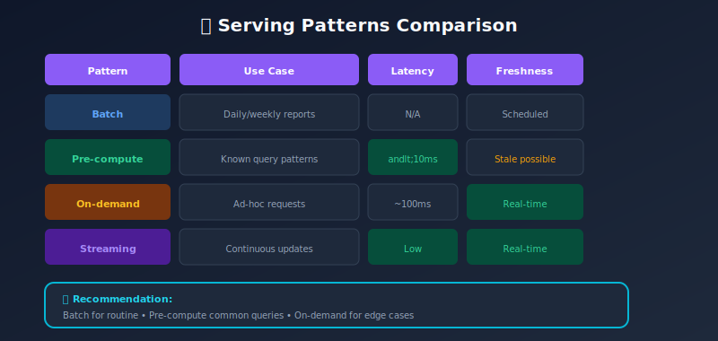
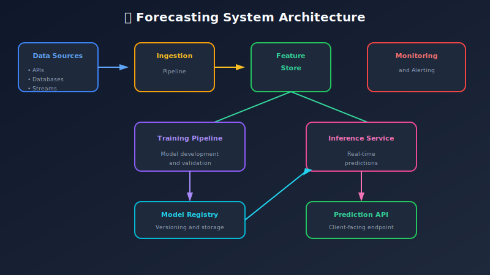
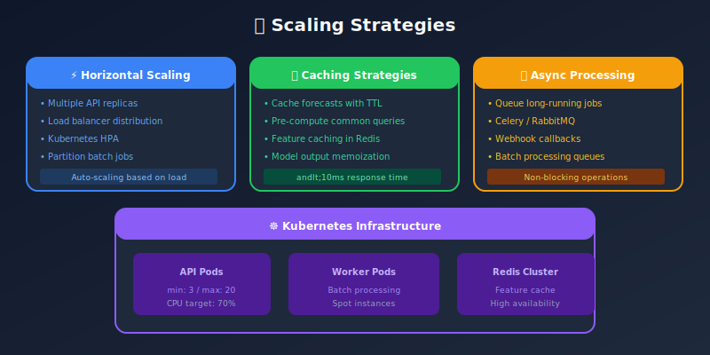
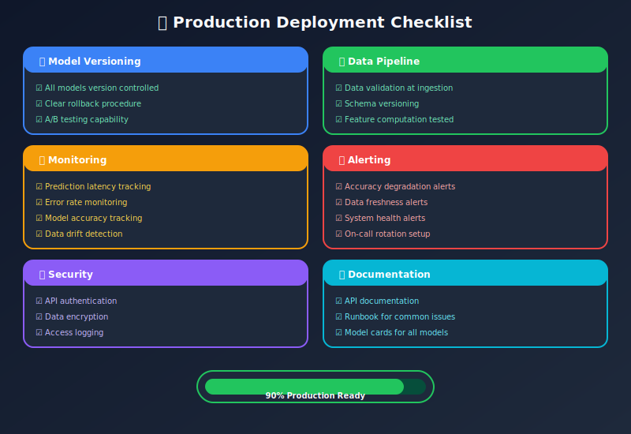

# Model Deployment and Production Systems

## Table of Contents
- [Overview](#overview)
- [System Architecture](#system-architecture)
- [Model Serving Patterns](#model-serving-patterns)
- [Data Pipeline Design](#data-pipeline-design)
- [Monitoring and Alerting](#monitoring-and-alerting)
- [Model Retraining](#model-retraining)
- [Scalability Considerations](#scalability-considerations)
- [Best Practices](#best-practices)

---

## Overview

Deploying time series forecasting models to production requires careful consideration of data freshness, prediction latency, and model maintenance.

### Production Challenges



---

## System Architecture

### High-Level Architecture



### Component Details

```python
# Example: Complete System Configuration

system_config = {
    "data_ingestion": {
        "sources": ["kafka", "s3", "api"],
        "frequency": "hourly",
        "validation": True,
        "schema_registry": "confluent"
    },

    "feature_store": {
        "backend": "feast",
        "online_store": "redis",
        "offline_store": "s3",
        "ttl_hours": 24
    },

    "model_registry": {
        "backend": "mlflow",
        "storage": "s3",
        "tracking_uri": "http://mlflow:5000"
    },

    "inference_service": {
        "framework": "fastapi",
        "batch_enabled": True,
        "online_enabled": True,
        "cache_ttl_minutes": 60
    },

    "monitoring": {
        "metrics": ["prometheus"],
        "logging": ["elasticsearch"],
        "alerting": ["pagerduty", "slack"]
    }
}
```

---

## Model Serving Patterns

### Batch Prediction

```python
from datetime import datetime, timedelta
import schedule
import time

class BatchForecastingService:
    """
    Batch forecasting service for scheduled predictions
    """

    def __init__(self, model_registry, feature_store, output_store):
        self.model_registry = model_registry
        self.feature_store = feature_store
        self.output_store = output_store

    def run_batch_forecast(self, model_name: str, horizon: int):
        """
        Execute batch forecasting job
        """
        # Load model
        model = self.model_registry.load_model(model_name, stage="production")

        # Get features
        features = self.feature_store.get_batch_features(
            entity_ids=self._get_entity_ids(),
            feature_names=model.feature_names,
            as_of=datetime.now()
        )

        # Generate forecasts
        forecasts = model.predict(features, horizon=horizon)

        # Add metadata
        forecasts['generated_at'] = datetime.now()
        forecasts['model_version'] = model.version
        forecasts['forecast_horizon'] = horizon

        # Store results
        self.output_store.save_forecasts(forecasts)

        return forecasts

    def schedule_jobs(self):
        """
        Schedule regular forecast jobs
        """
        # Daily forecast at 6 AM
        schedule.every().day.at("06:00").do(
            self.run_batch_forecast,
            model_name="demand_model",
            horizon=7
        )

        # Hourly short-term forecast
        schedule.every().hour.do(
            self.run_batch_forecast,
            model_name="hourly_model",
            horizon=24
        )

        while True:
            schedule.run_pending()
            time.sleep(60)

# Airflow DAG example
"""
from airflow import DAG
from airflow.operators.python import PythonOperator
from datetime import datetime, timedelta

dag = DAG(
    'daily_forecast',
    schedule_interval='0 6 * * *',
    start_date=datetime(2024, 1, 1),
    catchup=False
)

def run_forecast():
    service = BatchForecastingService(...)
    service.run_batch_forecast("demand_model", horizon=7)

forecast_task = PythonOperator(
    task_id='generate_forecasts',
    python_callable=run_forecast,
    dag=dag
)
"""
```

### Online Prediction Service

```python
from fastapi import FastAPI, HTTPException
from pydantic import BaseModel
from typing import List, Optional
import redis
import json

app = FastAPI(title="Forecasting API")

class ForecastRequest(BaseModel):
    entity_id: str
    horizon: int = 7
    include_intervals: bool = True

class ForecastResponse(BaseModel):
    entity_id: str
    forecasts: List[float]
    lower_bound: Optional[List[float]]
    upper_bound: Optional[List[float]]
    generated_at: str
    model_version: str

class ForecastingService:
    """
    Real-time forecasting service
    """

    def __init__(self, model_registry, feature_store, cache_client):
        self.model_registry = model_registry
        self.feature_store = feature_store
        self.cache = cache_client
        self.model = None
        self._load_model()

    def _load_model(self):
        """Load production model"""
        self.model = self.model_registry.load_model(
            "demand_model",
            stage="production"
        )

    def _get_cache_key(self, entity_id: str, horizon: int) -> str:
        return f"forecast:{entity_id}:{horizon}"

    def predict(self, request: ForecastRequest) -> ForecastResponse:
        # Check cache first
        cache_key = self._get_cache_key(request.entity_id, request.horizon)
        cached = self.cache.get(cache_key)

        if cached:
            return ForecastResponse(**json.loads(cached))

        # Get features
        features = self.feature_store.get_online_features(
            entity_id=request.entity_id,
            feature_names=self.model.feature_names
        )

        # Generate forecast
        forecast = self.model.predict(features, horizon=request.horizon)

        response = ForecastResponse(
            entity_id=request.entity_id,
            forecasts=forecast['predictions'].tolist(),
            lower_bound=forecast.get('lower', []),
            upper_bound=forecast.get('upper', []),
            generated_at=datetime.now().isoformat(),
            model_version=self.model.version
        )

        # Cache result
        self.cache.setex(
            cache_key,
            timedelta(hours=1),
            json.dumps(response.dict())
        )

        return response

# Initialize service
redis_client = redis.Redis(host='localhost', port=6379)
forecast_service = ForecastingService(
    model_registry=MLflowRegistry(),
    feature_store=FeastFeatureStore(),
    cache_client=redis_client
)

@app.post("/forecast", response_model=ForecastResponse)
async def get_forecast(request: ForecastRequest):
    try:
        return forecast_service.predict(request)
    except Exception as e:
        raise HTTPException(status_code=500, detail=str(e))

@app.get("/health")
async def health_check():
    return {"status": "healthy", "model_loaded": forecast_service.model is not None}
```

### Serving Patterns Comparison



---

## Data Pipeline Design

### Feature Pipeline

```python
from datetime import datetime, timedelta
import pandas as pd

class FeaturePipeline:
    """
    Pipeline for computing and storing features
    """

    def __init__(self, data_source, feature_store):
        self.data_source = data_source
        self.feature_store = feature_store
        self.feature_definitions = self._define_features()

    def _define_features(self):
        """Define feature computations"""
        return {
            'lag_features': {
                'lags': [1, 7, 14, 28, 365],
                'columns': ['value']
            },
            'rolling_features': {
                'windows': [7, 14, 28],
                'stats': ['mean', 'std', 'min', 'max']
            },
            'temporal_features': [
                'hour', 'dayofweek', 'month', 'is_weekend', 'is_holiday'
            ]
        }

    def compute_features(self, entity_id: str,
                        as_of: datetime) -> pd.DataFrame:
        """
        Compute features for an entity at a point in time
        """
        # Get raw data
        raw_data = self.data_source.get_data(
            entity_id=entity_id,
            end_date=as_of,
            lookback_days=400  # Need history for lags
        )

        features = pd.DataFrame(index=raw_data.index)

        # Lag features
        for col in self.feature_definitions['lag_features']['columns']:
            for lag in self.feature_definitions['lag_features']['lags']:
                features[f'{col}_lag_{lag}'] = raw_data[col].shift(lag)

        # Rolling features
        for window in self.feature_definitions['rolling_features']['windows']:
            for stat in self.feature_definitions['rolling_features']['stats']:
                features[f'value_roll_{stat}_{window}'] = (
                    raw_data['value'].shift(1)
                    .rolling(window=window)
                    .agg(stat)
                )

        # Temporal features
        features['hour'] = features.index.hour
        features['dayofweek'] = features.index.dayofweek
        features['month'] = features.index.month
        features['is_weekend'] = (features.index.dayofweek >= 5).astype(int)

        return features.dropna()

    def materialize_features(self, entity_ids: list,
                            start_date: datetime,
                            end_date: datetime):
        """
        Materialize features to feature store
        """
        for entity_id in entity_ids:
            features = self.compute_features(entity_id, end_date)

            # Filter to date range
            features = features[
                (features.index >= start_date) &
                (features.index <= end_date)
            ]

            self.feature_store.ingest(
                entity_id=entity_id,
                features=features,
                timestamp_column='index'
            )

# Scheduled feature materialization
"""
# Airflow DAG for feature pipeline
feature_dag = DAG(
    'feature_pipeline',
    schedule_interval='0 * * * *',  # Every hour
    catchup=False
)

def materialize_features():
    pipeline = FeaturePipeline(...)
    pipeline.materialize_features(
        entity_ids=get_all_entities(),
        start_date=datetime.now() - timedelta(hours=1),
        end_date=datetime.now()
    )
"""
```

---

## Monitoring and Alerting

### Monitoring Framework

```python
from prometheus_client import Counter, Histogram, Gauge
import logging

# Metrics
PREDICTION_LATENCY = Histogram(
    'forecast_prediction_latency_seconds',
    'Time to generate forecast',
    buckets=[0.01, 0.05, 0.1, 0.5, 1.0, 5.0]
)

PREDICTION_COUNT = Counter(
    'forecast_predictions_total',
    'Total number of predictions',
    ['model', 'status']
)

MODEL_ACCURACY = Gauge(
    'forecast_model_accuracy',
    'Current model accuracy metrics',
    ['model', 'metric']
)

DATA_FRESHNESS = Gauge(
    'forecast_data_freshness_seconds',
    'Age of most recent data',
    ['entity_id']
)

class ForecastMonitor:
    """
    Monitor forecasting system health
    """

    def __init__(self, threshold_config):
        self.thresholds = threshold_config
        self.logger = logging.getLogger(__name__)

    def record_prediction(self, model_name: str, latency: float,
                         success: bool):
        """Record prediction metrics"""
        PREDICTION_LATENCY.observe(latency)
        status = 'success' if success else 'failure'
        PREDICTION_COUNT.labels(model=model_name, status=status).inc()

    def check_data_freshness(self, entity_id: str,
                            latest_timestamp: datetime):
        """Check if data is stale"""
        age_seconds = (datetime.now() - latest_timestamp).total_seconds()
        DATA_FRESHNESS.labels(entity_id=entity_id).set(age_seconds)

        if age_seconds > self.thresholds['data_staleness_seconds']:
            self.logger.warning(
                f"Stale data for {entity_id}: {age_seconds/3600:.1f} hours old"
            )
            self._send_alert(
                severity='warning',
                message=f"Data staleness detected for {entity_id}"
            )

    def evaluate_accuracy(self, model_name: str,
                         actual: np.ndarray,
                         predicted: np.ndarray):
        """Evaluate and record model accuracy"""
        mape = np.mean(np.abs((actual - predicted) / actual)) * 100
        rmse = np.sqrt(np.mean((actual - predicted) ** 2))

        MODEL_ACCURACY.labels(model=model_name, metric='mape').set(mape)
        MODEL_ACCURACY.labels(model=model_name, metric='rmse').set(rmse)

        if mape > self.thresholds['mape_threshold']:
            self.logger.error(
                f"Model {model_name} MAPE {mape:.2f}% exceeds threshold"
            )
            self._send_alert(
                severity='error',
                message=f"Model accuracy degradation: MAPE={mape:.2f}%"
            )

    def detect_drift(self, recent_data: pd.DataFrame,
                    reference_data: pd.DataFrame):
        """Detect data drift"""
        from scipy import stats

        # KS test for distribution shift
        stat, p_value = stats.ks_2samp(
            recent_data['value'],
            reference_data['value']
        )

        if p_value < 0.05:
            self.logger.warning(f"Data drift detected: KS statistic={stat:.4f}")
            self._send_alert(
                severity='warning',
                message=f"Data drift detected (p-value={p_value:.4f})"
            )
            return True
        return False

    def _send_alert(self, severity: str, message: str):
        """Send alert to configured channels"""
        # Integration with PagerDuty, Slack, etc.
        pass

# Alert configuration
threshold_config = {
    'mape_threshold': 15.0,
    'data_staleness_seconds': 3600,
    'prediction_latency_p99': 1.0,
    'error_rate_threshold': 0.01
}

monitor = ForecastMonitor(threshold_config)
```

---

## Model Retraining

### Retraining Pipeline

```python
from datetime import datetime, timedelta
import mlflow

class RetrainingPipeline:
    """
    Automated model retraining pipeline
    """

    def __init__(self, config):
        self.config = config
        self.feature_store = config['feature_store']
        self.model_registry = config['model_registry']

    def should_retrain(self, model_name: str) -> bool:
        """
        Determine if model needs retraining
        """
        # Check scheduled retraining
        last_trained = self.model_registry.get_last_trained(model_name)
        days_since = (datetime.now() - last_trained).days

        if days_since >= self.config['retrain_interval_days']:
            return True

        # Check performance degradation
        recent_metrics = self._get_recent_metrics(model_name)
        if recent_metrics['mape'] > self.config['mape_threshold']:
            return True

        # Check for data drift
        if self._detect_drift(model_name):
            return True

        return False

    def retrain(self, model_name: str):
        """
        Execute retraining pipeline
        """
        with mlflow.start_run(run_name=f"retrain_{model_name}"):
            # Get training data
            train_data = self.feature_store.get_training_data(
                model_name=model_name,
                start_date=datetime.now() - timedelta(
                    days=self.config['training_window_days']
                ),
                end_date=datetime.now() - timedelta(
                    days=self.config['forecast_horizon']
                )
            )

            # Split data
            val_size = int(len(train_data) * 0.2)
            train_set = train_data[:-val_size]
            val_set = train_data[-val_size:]

            # Train model
            model = self._train_model(train_set, val_set)

            # Evaluate
            metrics = self._evaluate_model(model, val_set)
            mlflow.log_metrics(metrics)

            # Champion/Challenger comparison
            if self._beats_champion(model_name, metrics):
                # Register as new production model
                self._promote_model(model, model_name, metrics)
            else:
                mlflow.log_param("promoted", False)

    def _train_model(self, train_data, val_data):
        """Train the model"""
        # Model training logic
        pass

    def _beats_champion(self, model_name: str,
                       challenger_metrics: dict) -> bool:
        """
        Compare challenger model to current champion
        """
        champion_metrics = self.model_registry.get_production_metrics(
            model_name
        )

        # Challenger must be significantly better
        improvement = (
            (champion_metrics['mape'] - challenger_metrics['mape']) /
            champion_metrics['mape']
        )

        return improvement > self.config['min_improvement_threshold']

    def _promote_model(self, model, model_name: str, metrics: dict):
        """
        Promote model to production
        """
        # Log model
        mlflow.sklearn.log_model(
            model,
            artifact_path="model",
            registered_model_name=model_name
        )

        # Transition to production
        client = mlflow.tracking.MlflowClient()
        latest_version = client.get_latest_versions(
            model_name,
            stages=["None"]
        )[0]

        client.transition_model_version_stage(
            name=model_name,
            version=latest_version.version,
            stage="Production",
            archive_existing_versions=True
        )

# Configuration
retrain_config = {
    'retrain_interval_days': 7,
    'training_window_days': 365,
    'forecast_horizon': 7,
    'mape_threshold': 15.0,
    'min_improvement_threshold': 0.05,
    'feature_store': feast_client,
    'model_registry': mlflow_client
}

pipeline = RetrainingPipeline(retrain_config)
```

---

## Scalability Considerations

### Scaling Strategies



### Kubernetes Deployment

```yaml
# deployment.yaml
apiVersion: apps/v1
kind: Deployment
metadata:
  name: forecast-api
spec:
  replicas: 3
  selector:
    matchLabels:
      app: forecast-api
  template:
    metadata:
      labels:
        app: forecast-api
    spec:
      containers:
      - name: api
        image: forecast-api:latest
        ports:
        - containerPort: 8000
        resources:
          requests:
            memory: "512Mi"
            cpu: "500m"
          limits:
            memory: "2Gi"
            cpu: "2000m"
        env:
        - name: MODEL_REGISTRY_URI
          value: "http://mlflow:5000"
        - name: REDIS_HOST
          value: "redis-master"
---
apiVersion: autoscaling/v2
kind: HorizontalPodAutoscaler
metadata:
  name: forecast-api-hpa
spec:
  scaleTargetRef:
    apiVersion: apps/v1
    kind: Deployment
    name: forecast-api
  minReplicas: 3
  maxReplicas: 20
  metrics:
  - type: Resource
    resource:
      name: cpu
      target:
        type: Utilization
        averageUtilization: 70
```

---

## Best Practices

### Deployment Checklist



---

## Summary

Production forecasting systems require:
1. **Robust data pipelines** with validation
2. **Flexible serving** (batch + online)
3. **Comprehensive monitoring**
4. **Automated retraining**
5. **Scalable infrastructure**

### Next Steps

- [09_case_studies](../09_case_studies/) - Real-world examples
- [10_advanced_topics](../10_advanced_topics/) - Advanced techniques

---

<div align="center">

**[⬆ Back to Top](#)** | **[📚 Main Repository](https://github.com/Gaurav14cs17/ml_system_design)**

Made with 💜 by [Gaurav14cs17](https://github.com/Gaurav14cs17)

</div>
