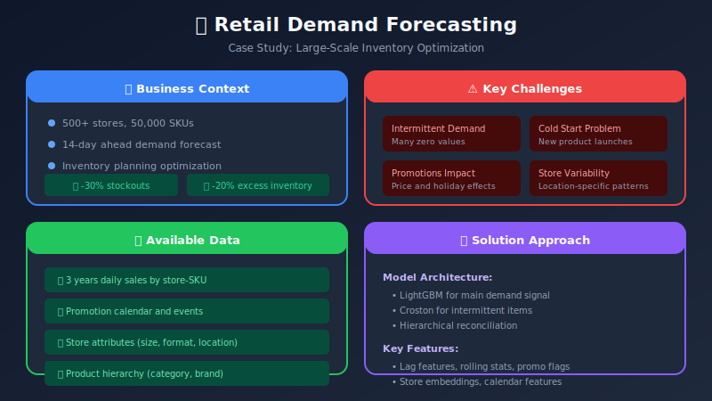
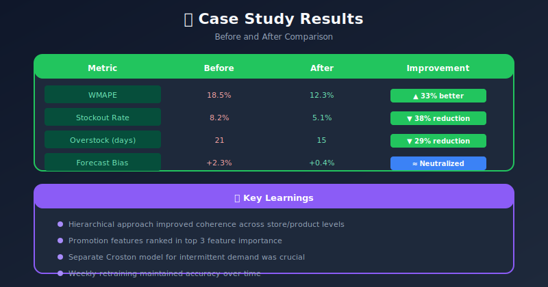
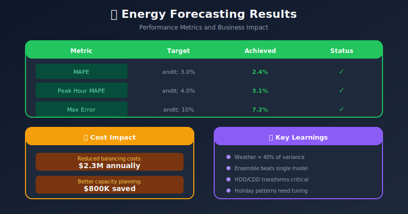
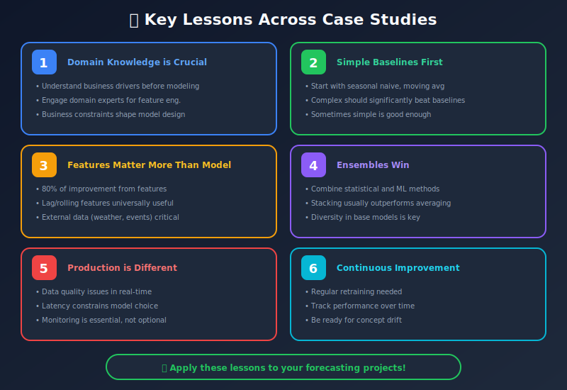

# Real-World Case Studies

## Table of Contents
- [Overview](#overview)
- [Case Study 1: Retail Demand Forecasting](#case-study-1-retail-demand-forecasting)
- [Case Study 2: Energy Load Forecasting](#case-study-2-energy-load-forecasting)
- [Case Study 3: Financial Time Series](#case-study-3-financial-time-series)
- [Case Study 4: Traffic Prediction](#case-study-4-traffic-prediction)
- [Lessons Learned](#lessons-learned)

---

## Overview

Real-world forecasting projects face unique challenges. This section explores practical implementations across industries.

---

## Case Study 1: Retail Demand Forecasting

### Problem Statement



### Solution Architecture

```python
# Hierarchical forecasting approach

class RetailDemandForecaster:
    """
    Multi-level retail demand forecasting
    """

    def __init__(self):
        self.models = {
            'global': LightGBMForecaster(),      # All stores aggregate
            'store': LightGBMForecaster(),        # Store level
            'category': LightGBMForecaster(),     # Category level
            'sku': LightGBMForecaster()           # SKU level
        }
        self.reconciliation = MinTraceReconciliation()

    def create_features(self, df):
        """
        Feature engineering for retail forecasting
        """
        features = pd.DataFrame()

        # Lag features (careful with aggregation level)
        for lag in [7, 14, 21, 28]:
            features[f'sales_lag_{lag}'] = df['sales'].shift(lag)

        # Rolling statistics
        for window in [7, 14, 28]:
            features[f'sales_roll_mean_{window}'] = (
                df['sales'].shift(1).rolling(window).mean()
            )
            features[f'sales_roll_std_{window}'] = (
                df['sales'].shift(1).rolling(window).std()
            )

        # Promotion features
        features['is_promo'] = df['promotion_flag']
        features['days_to_promo'] = df['days_to_next_promotion']
        features['promo_discount_pct'] = df['discount_percentage']

        # Calendar features
        features['dayofweek'] = df.index.dayofweek
        features['month'] = df.index.month
        features['is_weekend'] = (df.index.dayofweek >= 5).astype(int)
        features['is_payday'] = df.index.day.isin([15, 30]).astype(int)

        # Holiday features
        features['is_holiday'] = df['holiday_flag']
        features['days_to_holiday'] = df['days_to_holiday']
        features['holiday_type'] = df['holiday_type']

        # Product features
        features['price'] = df['unit_price']
        features['category_encoded'] = df['category_id']

        # Store features
        features['store_size'] = df['store_sqft']
        features['store_format'] = df['format_encoded']

        return features

    def train(self, train_data):
        """
        Train hierarchical models
        """
        # Aggregate to different levels
        aggregations = {
            'global': train_data.groupby('date')['sales'].sum(),
            'store': train_data.groupby(['date', 'store_id'])['sales'].sum(),
            'category': train_data.groupby(['date', 'category_id'])['sales'].sum(),
            'sku': train_data.groupby(['date', 'store_id', 'sku_id'])['sales'].sum()
        }

        for level, agg_data in aggregations.items():
            features = self.create_features(agg_data)
            self.models[level].fit(features, agg_data['sales'])

    def predict(self, forecast_df, horizon=14):
        """
        Generate reconciled forecasts
        """
        # Base forecasts at each level
        base_forecasts = {}
        for level in self.models:
            base_forecasts[level] = self.models[level].predict(horizon)

        # Reconcile to ensure consistency
        # Sum of SKU forecasts = Store forecast = Global forecast
        reconciled = self.reconciliation.reconcile(base_forecasts)

        return reconciled

# Handling intermittent demand
class IntermittentDemandForecaster:
    """
    For products with many zeros (slow movers)
    """

    def __init__(self):
        self.demand_model = LightGBMRegressor()
        self.occurrence_model = LightGBMClassifier()

    def fit(self, X, y):
        # Model 1: Probability of non-zero demand
        y_binary = (y > 0).astype(int)
        self.occurrence_model.fit(X, y_binary)

        # Model 2: Demand given occurrence
        X_nonzero = X[y > 0]
        y_nonzero = y[y > 0]
        self.demand_model.fit(X_nonzero, y_nonzero)

    def predict(self, X):
        prob = self.occurrence_model.predict_proba(X)[:, 1]
        demand = self.demand_model.predict(X)

        # Expected demand = P(demand > 0) × E[demand | demand > 0]
        return prob * demand

```

### Results



---

## Case Study 2: Energy Load Forecasting

### Problem Statement


### Solution

```python
class EnergyLoadForecaster:
    """
    Ensemble model for energy load forecasting
    """

    def __init__(self):
        self.models = {
            'lgb': LightGBMForecaster(),
            'xgb': XGBoostForecaster(),
            'lstm': LSTMForecaster(),
            'prophet': ProphetForecaster()
        }
        self.meta_model = RidgeCV()

    def create_features(self, df, weather_forecast):
        """
        Feature engineering for load forecasting
        """
        features = pd.DataFrame(index=df.index)

        # Temporal features
        features['hour'] = df.index.hour
        features['dayofweek'] = df.index.dayofweek
        features['month'] = df.index.month
        features['is_weekend'] = (df.index.dayofweek >= 5).astype(int)
        features['is_holiday'] = df['is_holiday']

        # Cyclical encoding
        features['hour_sin'] = np.sin(2 * np.pi * features['hour'] / 24)
        features['hour_cos'] = np.cos(2 * np.pi * features['hour'] / 24)

        # Load lags
        for lag in [24, 48, 168]:  # 1 day, 2 days, 1 week
            features[f'load_lag_{lag}'] = df['load'].shift(lag)

        # Same hour patterns
        features['load_same_hour_yesterday'] = df['load'].shift(24)
        features['load_same_hour_last_week'] = df['load'].shift(168)

        # Rolling statistics
        for window in [24, 48, 168]:
            features[f'load_roll_mean_{window}'] = (
                df['load'].shift(1).rolling(window).mean()
            )

        # Weather features
        features['temperature'] = weather_forecast['temperature']
        features['humidity'] = weather_forecast['humidity']
        features['cloud_cover'] = weather_forecast['cloud_cover']

        # Temperature non-linearity (heating/cooling effects)
        features['temp_squared'] = features['temperature'] ** 2
        features['heating_degree'] = np.maximum(0, 18 - features['temperature'])
        features['cooling_degree'] = np.maximum(0, features['temperature'] - 24)

        # Temperature × hour interaction
        features['temp_hour'] = features['temperature'] * features['hour']

        # Fourier terms for multiple seasonalities
        t = np.arange(len(df))
        # Daily
        for k in range(1, 4):
            features[f'daily_sin_{k}'] = np.sin(2 * np.pi * k * t / 24)
            features[f'daily_cos_{k}'] = np.cos(2 * np.pi * k * t / 24)
        # Weekly
        for k in range(1, 3):
            features[f'weekly_sin_{k}'] = np.sin(2 * np.pi * k * t / 168)
            features[f'weekly_cos_{k}'] = np.cos(2 * np.pi * k * t / 168)

        return features

    def train(self, train_data, weather_data):
        """
        Train ensemble
        """
        features = self.create_features(train_data, weather_data)
        target = train_data['load']

        # Train base models
        cv_predictions = {}
        tscv = TimeSeriesSplit(n_splits=5)

        for name, model in self.models.items():
            cv_preds = np.zeros(len(target))

            for train_idx, val_idx in tscv.split(features):
                model.fit(features.iloc[train_idx], target.iloc[train_idx])
                cv_preds[val_idx] = model.predict(features.iloc[val_idx])

            cv_predictions[name] = cv_preds

        # Train meta model on CV predictions
        meta_features = pd.DataFrame(cv_predictions)
        self.meta_model.fit(meta_features, target)

        # Retrain base models on full data
        for model in self.models.values():
            model.fit(features, target)

    def predict(self, forecast_features):
        """
        Generate ensemble prediction
        """
        base_predictions = {}
        for name, model in self.models.items():
            base_predictions[name] = model.predict(forecast_features)

        meta_features = pd.DataFrame(base_predictions)
        return self.meta_model.predict(meta_features)

```

### Results



---

## Case Study 3: Financial Time Series

### Stock Volatility Forecasting

```python
class VolatilityForecaster:
    """
    Stock volatility forecasting for risk management
    """

    def __init__(self):
        self.garch = None
        self.ml_model = LightGBMRegressor()

    def calculate_realized_volatility(self, prices, window=20):
        """
        Calculate realized volatility
        """
        returns = prices.pct_change()
        return returns.rolling(window).std() * np.sqrt(252)  # Annualized

    def create_features(self, df):
        """
        Features for volatility forecasting
        """
        features = pd.DataFrame(index=df.index)

        # Past volatility
        for window in [5, 10, 20, 60]:
            features[f'rv_{window}'] = self.calculate_realized_volatility(
                df['close'], window
            )

        # Return features
        features['return'] = df['close'].pct_change()
        features['return_abs'] = features['return'].abs()

        # VIX (if available)
        if 'vix' in df.columns:
            features['vix'] = df['vix']
            features['vix_lag_1'] = df['vix'].shift(1)

        # Volume features
        features['volume_ratio'] = (
            df['volume'] / df['volume'].rolling(20).mean()
        )

        # Range-based volatility
        features['parkinson_vol'] = (
            np.log(df['high'] / df['low']) ** 2 / (4 * np.log(2))
        ).rolling(20).mean() ** 0.5

        # Day of week effects
        features['dayofweek'] = df.index.dayofweek
        features['is_monday'] = (features['dayofweek'] == 0).astype(int)
        features['is_friday'] = (features['dayofweek'] == 4).astype(int)

        return features

    def fit_garch(self, returns):
        """
        Fit GARCH model for volatility
        """
        from arch import arch_model

        self.garch = arch_model(
            returns * 100,  # Scale for numerical stability
            vol='Garch',
            p=1, q=1
        )
        self.garch_result = self.garch.fit(disp='off')

    def forecast(self, horizon=22):
        """
        Generate volatility forecast
        """
        # GARCH forecast
        garch_forecast = self.garch_result.forecast(horizon=horizon)
        garch_vol = np.sqrt(garch_forecast.variance.values[-1]) / 100

        # ML forecast
        ml_vol = self.ml_model.predict(horizon)

        # Ensemble
        return 0.6 * garch_vol + 0.4 * ml_vol

```

---

## Case Study 4: Traffic Prediction

### Urban Traffic Flow Forecasting

```python
class TrafficForecaster:
    """
    Graph neural network for traffic prediction
    """

    def __init__(self, adjacency_matrix):
        self.adj = adjacency_matrix  # Road network topology
        self.model = None

    def create_spatial_features(self, traffic_data):
        """
        Create features capturing spatial dependencies
        """
        # Neighbor average (using adjacency)
        neighbor_avg = np.matmul(self.adj, traffic_data) / (
            self.adj.sum(axis=1, keepdims=True) + 1e-8
        )
        return neighbor_avg

    def create_temporal_features(self, df, sensor_id):
        """
        Temporal features for traffic
        """
        features = pd.DataFrame()

        # Time of day
        features['hour'] = df.index.hour
        features['minute'] = df.index.minute
        features['dayofweek'] = df.index.dayofweek

        # Peak hour indicators
        features['is_morning_peak'] = df.index.hour.isin([7, 8, 9]).astype(int)
        features['is_evening_peak'] = df.index.hour.isin([17, 18, 19]).astype(int)

        # Historical patterns
        features['same_time_yesterday'] = df['flow'].shift(288)  # 5-min intervals
        features['same_time_last_week'] = df['flow'].shift(288 * 7)

        # Rolling statistics
        for window in [12, 36, 72]:  # 1hr, 3hr, 6hr
            features[f'flow_mean_{window}'] = df['flow'].rolling(window).mean()

        return features

    def build_stgcn(self, input_shape, num_nodes):
        """
        Spatial-Temporal Graph Convolutional Network
        """
        import torch
        import torch.nn as nn

        class STGCN(nn.Module):
            def __init__(self, num_nodes, in_channels, hidden, out_horizon):
                super().__init__()

                # Temporal convolution
                self.temporal_conv1 = nn.Conv1d(in_channels, hidden, kernel_size=3)

                # Graph convolution (simplified)
                self.graph_conv = nn.Linear(hidden, hidden)
                self.adj = nn.Parameter(torch.FloatTensor(self.adj))

                # Output
                self.fc = nn.Linear(hidden * num_nodes, out_horizon * num_nodes)

            def forward(self, x):
                # x: (batch, nodes, timesteps, features)
                batch, nodes, time, feat = x.shape

                # Temporal
                x = x.reshape(batch * nodes, feat, time)
                x = self.temporal_conv1(x)
                x = x.reshape(batch, nodes, -1)

                # Spatial
                x = torch.matmul(self.adj, x)
                x = self.graph_conv(x)

                # Output
                x = x.reshape(batch, -1)
                out = self.fc(x)

                return out.reshape(batch, nodes, -1)

        return STGCN(num_nodes, input_shape[-1], 64, 12)

```

---

## Lessons Learned



### Next Steps

- [10_advanced_topics](../10_advanced_topics/) - Advanced techniques
- Return to [README](../README.md) for full navigation

---

<div align="center">

**[⬆ Back to Top](#)** | **[📚 Main Repository](https://github.com/Gaurav14cs17/ml_system_design)**

Made with 💜 by [Gaurav14cs17](https://github.com/Gaurav14cs17)

</div>
