# Time Series Forecasting: Complete ML System Design Guide

<div align="center">


</div>

---

## 🧮 Mathematical Foundations

Time series forecasting is grounded in rigorous mathematical theory. A time series $\{Y\_t\}\_{t=1}^{T}$ is a sequence of random variables indexed by time.

### Core Definitions

| Concept | Mathematical Definition | Interpretation |
|---------|------------------------|----------------|
| **Expectation** | $\mu\_t = \mathbb{E}[Y\_t]$ | Mean value at time $t$ |
| **Variance** | $\sigma\_t^2 = \text{Var}(Y\_t) = \mathbb{E}[(Y\_t - \mu\_t)^2]$ | Spread of values |
| **Autocovariance** | $\gamma(s, t) = \text{Cov}(Y\_s, Y\_t) = \mathbb{E}[(Y\_s - \mu\_s)(Y\_t - \mu\_t)]$ | Temporal dependence |
| **Autocorrelation** | $\rho(s, t) = \frac{\gamma(s, t)}{\sqrt{\gamma(s,s) \cdot \gamma(t,t)}}$ | Normalized dependence |

### Stationarity Conditions

A time series is **weakly stationary** if:

```math
\mu_t = \mu \quad \forall t \quad \text{(constant mean)}
\gamma(t, t+h) = \gamma(h) \quad \forall t \quad \text{(covariance depends only on lag } h\text{)}

```

### Decomposition Model

```math
Y_t = T_t + S_t + C_t + \varepsilon_t

```

Where:
- $T\_t$ — **Trend**: Long-term progression
- $S\_t$ — **Seasonal**: Repeating patterns with fixed period $m$
- $C\_t$ — **Cyclical**: Fluctuations without fixed period
- $\varepsilon\_t$ — **Residual**: Random noise, $\varepsilon\_t \sim \mathcal{N}(0, \sigma^2)$

---

## 📚 Table of Contents

| # | Topic | Description | Status |
|---|-------|-------------|--------|
| 01 | [Introduction](./01_introduction/) | Fundamentals of time series forecasting | ✅ |
| 02 | [Data Preprocessing](./02_data_preprocessing/) | Preparing data for modeling | ✅ |
| 03 | [Feature Engineering](./03_feature_engineering/) | Creating temporal features | ✅ |
| 04 | [Statistical Methods](./04_statistical_methods/) | ARIMA, SARIMA, Prophet | ✅ |
| 05 | [Machine Learning](./05_machine_learning/) | Tree-based and ML approaches | ✅ |
| 06 | [Deep Learning](./06_deep_learning/) | LSTM, Transformers, TCN | ✅ |
| 07 | [Evaluation Metrics](./07_evaluation_metrics/) | Measuring forecast accuracy | ✅ |
| 08 | [Deployment](./08_deployment/) | Production systems | ✅ |
| 09 | [Case Studies](./09_case_studies/) | Real-world examples | ✅ |
| 10 | [Advanced Topics](./10_advanced_topics/) | Probabilistic, hierarchical, causal | ✅ |

---

## 🎯 Learning Path

### Beginner Path


### Intermediate Path


### Advanced Path


---

## 🏗️ System Architecture Overview

```mermaid
flowchart TB
    subgraph DATA["📊 DATA LAYER"]
        D1[Raw Data<br/>Sources] --> D2[Validation<br/>& Quality]
        D2 --> D3[Processing<br/>Pipeline]
        D3 --> D4[Feature<br/>Store]
    end

    subgraph MODEL["🧠 MODEL LAYER"]
        M1[Training<br/>Pipeline] --> M2[Validation<br/>& Testing]
        M2 --> M3[Model<br/>Registry]
        M3 --> M4[Inference<br/>Service]
    end

    subgraph SERVE["🚀 SERVING LAYER"]
        S1[Batch<br/>Forecasts]
        S2[Real-time<br/>Inference]
        S3[Caching<br/>Layer]
        S4[API<br/>Gateway]
    end

    subgraph MONITOR["📈 MONITORING LAYER"]
        MO1[Accuracy<br/>Metrics]
        MO2[Data<br/>Drift]
        MO3[System<br/>Health]
        MO4[Alerting]
    end

    DATA --> MODEL
    MODEL --> SERVE
    SERVE --> MONITOR
    MONITOR -.->|Feedback| DATA

    style DATA fill:#E3F2FD,stroke:#1976D2,stroke-width:2px
    style MODEL fill:#E8F5E9,stroke:#388E3C,stroke-width:2px
    style SERVE fill:#FFF3E0,stroke:#F57C00,stroke-width:2px
    style MONITOR fill:#FCE4EC,stroke:#C2185B,stroke-width:2px

```



<p align="center">
<svg width="800" height="320" xmlns="http://www.w3.org/2000/svg">
  <defs>
    <linearGradient id="data-grad" x1="0%" y1="0%" x2="100%" y2="100%">
      <stop offset="0%" style="stop-color:#2196F3"/>
      <stop offset="100%" style="stop-color:#1565C0"/>
    </linearGradient>
    <linearGradient id="model-grad" x1="0%" y1="0%" x2="100%" y2="100%">
      <stop offset="0%" style="stop-color:#4CAF50"/>
      <stop offset="100%" style="stop-color:#2E7D32"/>
    </linearGradient>
    <linearGradient id="serve-grad" x1="0%" y1="0%" x2="100%" y2="100%">
      <stop offset="0%" style="stop-color:#FF9800"/>
      <stop offset="100%" style="stop-color:#F57C00"/>
    </linearGradient>
    <linearGradient id="monitor-grad" x1="0%" y1="0%" x2="100%" y2="100%">
      <stop offset="0%" style="stop-color:#E91E63"/>
      <stop offset="100%" style="stop-color:#C2185B"/>
    </linearGradient>
    <filter id="drop-shadow" x="-20%" y="-20%" width="140%" height="140%">
      <feDropShadow dx="3" dy="3" stdDeviation="4" flood-opacity="0.25"/>
    </filter>
  </defs>

  <!-- Background -->
  <rect x="0" y="0" width="800" height="320" fill="#fafafa" rx="10"/>

  <!-- Data Layer -->
  <rect x="20" y="20" width="180" height="280" rx="10" fill="url(#data-grad)" filter="url(#drop-shadow)"/>
  <text x="110" y="50" fill="white" font-size="14" text-anchor="middle" font-weight="bold">📊 DATA LAYER</text>
  <rect x="35" y="65" width="150" height="50" rx="5" fill="white" opacity="0.9"/>
  <text x="110" y="95" fill="#1565C0" font-size="11" text-anchor="middle">Raw Data Sources</text>
  <rect x="35" y="125" width="150" height="50" rx="5" fill="white" opacity="0.9"/>
  <text x="110" y="155" fill="#1565C0" font-size="11" text-anchor="middle">Validation & Quality</text>
  <rect x="35" y="185" width="150" height="50" rx="5" fill="white" opacity="0.9"/>
  <text x="110" y="215" fill="#1565C0" font-size="11" text-anchor="middle">Feature Store</text>

  <!-- Arrow -->
  <path d="M210,160 L230,160" stroke="#666" stroke-width="3" marker-end="url(#arrow)"/>
  <text x="220" y="150" fill="#666" font-size="20">→</text>

  <!-- Model Layer -->
  <rect x="220" y="20" width="180" height="280" rx="10" fill="url(#model-grad)" filter="url(#drop-shadow)"/>
  <text x="310" y="50" fill="white" font-size="14" text-anchor="middle" font-weight="bold">🧠 MODEL LAYER</text>
  <rect x="235" y="65" width="150" height="50" rx="5" fill="white" opacity="0.9"/>
  <text x="310" y="95" fill="#2E7D32" font-size="11" text-anchor="middle">Training Pipeline</text>
  <rect x="235" y="125" width="150" height="50" rx="5" fill="white" opacity="0.9"/>
  <text x="310" y="155" fill="#2E7D32" font-size="11" text-anchor="middle">Model Registry</text>
  <rect x="235" y="185" width="150" height="50" rx="5" fill="white" opacity="0.9"/>
  <text x="310" y="215" fill="#2E7D32" font-size="11" text-anchor="middle">Inference Service</text>

  <!-- Arrow -->
  <text x="420" y="150" fill="#666" font-size="20">→</text>

  <!-- Serving Layer -->
  <rect x="420" y="20" width="180" height="280" rx="10" fill="url(#serve-grad)" filter="url(#drop-shadow)"/>
  <text x="510" y="50" fill="white" font-size="14" text-anchor="middle" font-weight="bold">🚀 SERVING LAYER</text>
  <rect x="435" y="65" width="150" height="50" rx="5" fill="white" opacity="0.9"/>
  <text x="510" y="95" fill="#F57C00" font-size="11" text-anchor="middle">Batch Forecasts</text>
  <rect x="435" y="125" width="150" height="50" rx="5" fill="white" opacity="0.9"/>
  <text x="510" y="155" fill="#F57C00" font-size="11" text-anchor="middle">Real-time Inference</text>
  <rect x="435" y="185" width="150" height="50" rx="5" fill="white" opacity="0.9"/>
  <text x="510" y="215" fill="#F57C00" font-size="11" text-anchor="middle">API Gateway</text>

  <!-- Arrow -->
  <text x="620" y="150" fill="#666" font-size="20">→</text>

  <!-- Monitoring Layer -->
  <rect x="620" y="20" width="160" height="280" rx="10" fill="url(#monitor-grad)" filter="url(#drop-shadow)"/>
  <text x="700" y="50" fill="white" font-size="14" text-anchor="middle" font-weight="bold">📈 MONITORING</text>
  <rect x="635" y="65" width="130" height="40" rx="5" fill="white" opacity="0.9"/>
  <text x="700" y="90" fill="#C2185B" font-size="10" text-anchor="middle">Accuracy Metrics</text>
  <rect x="635" y="115" width="130" height="40" rx="5" fill="white" opacity="0.9"/>
  <text x="700" y="140" fill="#C2185B" font-size="10" text-anchor="middle">Data Drift</text>
  <rect x="635" y="165" width="130" height="40" rx="5" fill="white" opacity="0.9"/>
  <text x="700" y="190" fill="#C2185B" font-size="10" text-anchor="middle">System Health</text>
  <rect x="635" y="215" width="130" height="40" rx="5" fill="white" opacity="0.9"/>
  <text x="700" y="240" fill="#C2185B" font-size="10" text-anchor="middle">Alerting</text>
</svg>
</p>

---

## 📊 Quick Reference: Model Selection


<p align="center">
<svg width="750" height="350" xmlns="http://www.w3.org/2000/svg">
  <defs>
    <filter id="card-shadow" x="-10%" y="-10%" width="120%" height="120%">
      <feDropShadow dx="2" dy="2" stdDeviation="3" flood-opacity="0.2"/>
    </filter>
  </defs>

  <!-- Background -->
  <rect x="0" y="0" width="750" height="350" fill="#f5f5f5" rx="15"/>

  <!-- Title -->
  <text x="375" y="30" fill="#333" font-size="18" text-anchor="middle" font-weight="bold">🎯 Model Selection Decision Tree</text>

  <!-- Data Size Header -->
  <rect x="300" y="45" width="150" height="35" rx="18" fill="#1976D2" filter="url(#card-shadow)"/>
  <text x="375" y="68" fill="white" font-size="12" text-anchor="middle" font-weight="bold">📊 DATA SIZE?</text>

  <!-- Arrows from header -->
  <line x1="325" y1="80" x2="125" y2="110" stroke="#666" stroke-width="2"/>
  <line x1="375" y1="80" x2="375" y2="110" stroke="#666" stroke-width="2"/>
  <line x1="425" y1="80" x2="625" y2="110" stroke="#666" stroke-width="2"/>

  <!-- Small Data -->
  <rect x="25" y="110" width="200" height="220" rx="10" fill="#E8F5E9" stroke="#4CAF50" stroke-width="2" filter="url(#card-shadow)"/>
  <rect x="40" y="120" width="170" height="30" rx="5" fill="#4CAF50"/>
  <text x="125" y="140" fill="white" font-size="12" text-anchor="middle" font-weight="bold">SMALL (&lt;1K pts)</text>

  <rect x="40" y="160" width="170" height="35" rx="5" fill="white"/>
  <text x="125" y="183" fill="#2E7D32" font-size="12" text-anchor="middle">📈 ARIMA / SARIMA</text>

  <rect x="40" y="205" width="170" height="35" rx="5" fill="white"/>
  <text x="125" y="228" fill="#2E7D32" font-size="12" text-anchor="middle">📊 ETS / Holt-Winters</text>

  <rect x="40" y="250" width="170" height="35" rx="5" fill="white"/>
  <text x="125" y="273" fill="#2E7D32" font-size="12" text-anchor="middle">🔮 Prophet</text>

  <text x="125" y="310" fill="#666" font-size="10" text-anchor="middle" font-style="italic">Fast training, interpretable</text>

  <!-- Medium Data -->
  <rect x="275" y="110" width="200" height="220" rx="10" fill="#FFF3E0" stroke="#FF9800" stroke-width="2" filter="url(#card-shadow)"/>
  <rect x="290" y="120" width="170" height="30" rx="5" fill="#FF9800"/>
  <text x="375" y="140" fill="white" font-size="12" text-anchor="middle" font-weight="bold">MEDIUM (1K-100K)</text>

  <rect x="290" y="160" width="170" height="35" rx="5" fill="white"/>
  <text x="375" y="183" fill="#F57C00" font-size="12" text-anchor="middle">🚀 XGBoost</text>

  <rect x="290" y="205" width="170" height="35" rx="5" fill="white"/>
  <text x="375" y="228" fill="#F57C00" font-size="12" text-anchor="middle">⚡ LightGBM</text>

  <rect x="290" y="250" width="170" height="35" rx="5" fill="white"/>
  <text x="375" y="273" fill="#F57C00" font-size="12" text-anchor="middle">🔮 Prophet + Features</text>

  <text x="375" y="310" fill="#666" font-size="10" text-anchor="middle" font-style="italic">Feature engineering critical</text>

  <!-- Large Data -->
  <rect x="525" y="110" width="200" height="220" rx="10" fill="#F3E5F5" stroke="#9C27B0" stroke-width="2" filter="url(#card-shadow)"/>
  <rect x="540" y="120" width="170" height="30" rx="5" fill="#9C27B0"/>
  <text x="625" y="140" fill="white" font-size="12" text-anchor="middle" font-weight="bold">LARGE (&gt;100K)</text>

  <rect x="540" y="160" width="170" height="35" rx="5" fill="white"/>
  <text x="625" y="183" fill="#7B1FA2" font-size="12" text-anchor="middle">🧠 LSTM / GRU</text>

  <rect x="540" y="205" width="170" height="35" rx="5" fill="white"/>
  <text x="625" y="228" fill="#7B1FA2" font-size="12" text-anchor="middle">🌊 TCN / WaveNet</text>

  <rect x="540" y="250" width="170" height="35" rx="5" fill="white"/>
  <text x="625" y="273" fill="#7B1FA2" font-size="12" text-anchor="middle">🤖 Transformer</text>

  <text x="625" y="310" fill="#666" font-size="10" text-anchor="middle" font-style="italic">Learns patterns automatically</text>
</svg>
</p>

### Seasonality Patterns

| Pattern | Recommended Models |
|---------|-------------------|
| 🔄 **Single seasonality** | SARIMA, Holt-Winters |
| 🎭 **Multiple seasonalities** | Prophet, Fourier features + ML |
| ➖ **No clear seasonality** | ARIMA, Random Forest, XGBoost |

### Special Cases

| Scenario | Approach |
|----------|----------|
| 📦 **Intermittent demand** | Croston, Zero-inflated models |
| 📊 **Multiple series** | Global models (LightGBM across series) |
| 🏢 **Hierarchical** | Bottom-up, MinT reconciliation |

---

## 🔧 Technology Stack

### Python Libraries

| Category | Libraries |
|----------|-----------|
| **Data Processing** | pandas, numpy, scipy |
| **Statistical** | statsmodels, pmdarima, prophet |
| **Machine Learning** | scikit-learn, xgboost, lightgbm, catboost |
| **Deep Learning** | pytorch, tensorflow, darts, neuralforecast |
| **Visualization** | matplotlib, seaborn, plotly |
| **Production** | fastapi, mlflow, feast, airflow |

### Installation

```bash
# Core dependencies
pip install pandas numpy scipy matplotlib seaborn

# Statistical models
pip install statsmodels pmdarima prophet

# Machine learning
pip install scikit-learn xgboost lightgbm catboost

# Deep learning
pip install torch darts neuralforecast pytorch-forecasting

# Production tools
pip install fastapi uvicorn mlflow feast

```

---

## 📈 Key Metrics Reference

### Point Forecast Metrics

| Metric | Mathematical Formula | Use Case |
|--------|---------------------|----------|
| **MAE** | $\text{MAE} = \frac{1}{n}\sum\_{i=1}^{n}\|y\_i - \hat{y}\_i\|$ | General purpose, same units as data |
| **MSE** | $\text{MSE} = \frac{1}{n}\sum\_{i=1}^{n}(y\_i - \hat{y}\_i)^2$ | Penalizes large errors heavily |
| **RMSE** | $\text{RMSE} = \sqrt{\frac{1}{n}\sum\_{i=1}^{n}(y\_i - \hat{y}\_i)^2}$ | Same units, penalizes outliers |
| **MAPE** | $\text{MAPE} = \frac{100\%}{n}\sum\_{i=1}^{n}\left\|\frac{y\_i - \hat{y}\_i}{y\_i}\right\|$ | Percentage, scale-independent |
| **SMAPE** | $\text{SMAPE} = \frac{100\%}{n}\sum\_{i=1}^{n}\frac{2\|y\_i - \hat{y}\_i\|}{\|y\_i\| + \|\hat{y}\_i\|}$ | Symmetric, bounded [0%, 200%] |
| **MASE** | $\text{MASE} = \frac{\text{MAE}}{\frac{1}{n-m}\sum\_{i=m+1}^{n}\|y\_i - y\_{i-m}\|}$ | Scale-free, compares to naive |

### Probabilistic Forecast Metrics

| Metric | Formula | Purpose |
|--------|---------|---------|
| **Quantile Loss** | $L\_q(y, \hat{y}) = (y - \hat{y})(q - \mathbb{1}\_{y < \hat{y}})$ | Evaluates prediction intervals |
| **CRPS** | $\text{CRPS} = \int\_{-\infty}^{\infty}(F(x) - \mathbb{1}\_{x \geq y})^2 dx$ | Probabilistic accuracy |
| **Coverage** | $\frac{1}{n}\sum\_{i=1}^{n}\mathbb{1}\_{L\_i \leq y\_i \leq U\_i}$ | Interval calibration |

---

## 📝 Best Practices Checklist


---

## 🚀 Quick Start Example

```python
import pandas as pd
import numpy as np
from sklearn.model_selection import TimeSeriesSplit
import lightgbm as lgb

# Load data
df = pd.read_csv('timeseries.csv', parse_dates=['date'], index_col='date')

# Feature engineering
def create_features(df, target='value'):
    features = pd.DataFrame(index=df.index)

    # Lags
    for lag in [1, 7, 14, 28]:
        features[f'lag_{lag}'] = df[target].shift(lag)

    # Rolling
    for window in [7, 14]:
        features[f'roll_mean_{window}'] = df[target].shift(1).rolling(window).mean()

    # Calendar
    features['dayofweek'] = df.index.dayofweek
    features['month'] = df.index.month

    return features

# Prepare data
features = create_features(df)
target = df['value']

# Temporal split
train_size = int(len(df) * 0.8)
X_train = features.iloc[:train_size].dropna()
y_train = target.loc[X_train.index]
X_test = features.iloc[train_size:].dropna()
y_test = target.loc[X_test.index]

# Train model
model = lgb.LGBMRegressor(n_estimators=100, random_state=42)
model.fit(X_train, y_train)

# Evaluate
predictions = model.predict(X_test)
mape = np.mean(np.abs((y_test - predictions) / y_test)) * 100
print(f"MAPE: {mape:.2f}%")

```

---

## 📖 Additional Resources

### Books
- *Forecasting: Principles and Practice* - Hyndman & Athanasopoulos
- *Time Series Analysis* - Hamilton
- *Deep Learning for Time Series* - Brownlee

### Papers
- "N-BEATS: Neural basis expansion analysis for interpretable time series forecasting"
- "Temporal Fusion Transformers for Interpretable Multi-horizon Time Series Forecasting"
- "Informer: Beyond Efficient Transformer for Long Sequence Time-Series Forecasting"

### Online Courses
- Coursera: Sequences, Time Series and Prediction
- Fast.ai: Practical Deep Learning
- Kaggle Learn: Time Series

---

## 🤝 Contributing

Contributions are welcome! Please feel free to:
- Report issues
- Suggest improvements
- Add new case studies
- Fix typos and errors

---

## 📜 License

This project is for educational purposes.

---

<div align="center">

**Happy Forecasting! 📈**

*Built with ❤️ for the ML community*

</div>

---

<div align="center">

**[⬆ Back to Top](#)** | **[📚 Main Repository](https://github.com/Gaurav14cs17/ml_system_design)**

Made with 💜 by [Gaurav14cs17](https://github.com/Gaurav14cs17)

</div>
