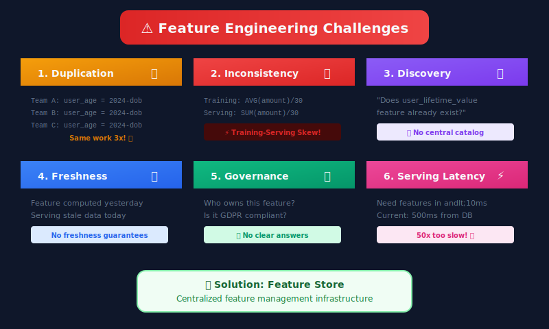
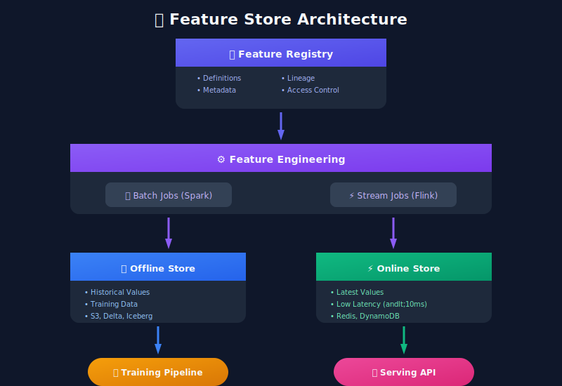
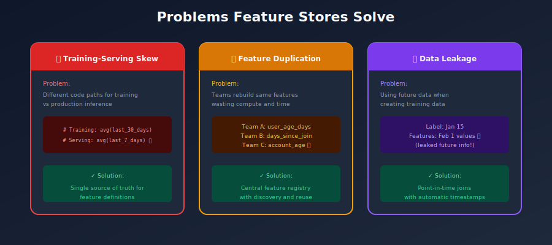
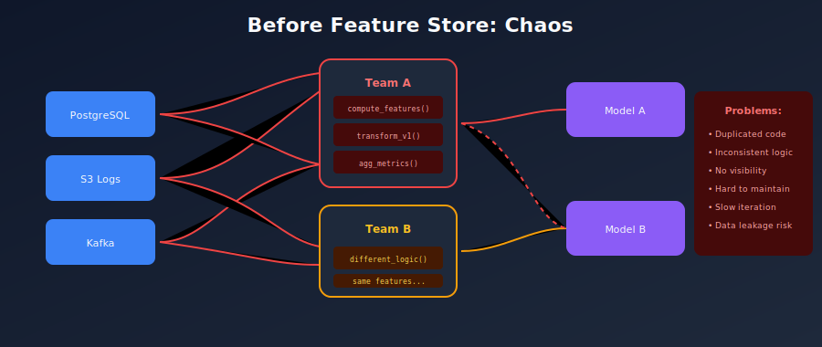
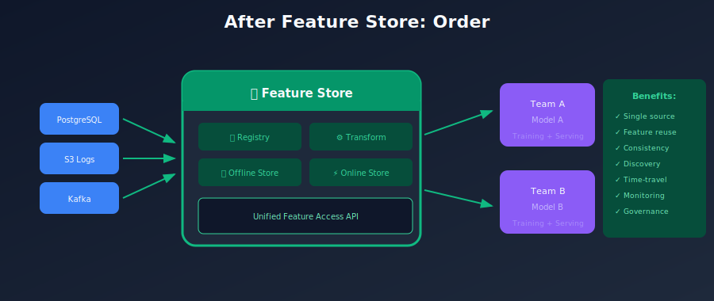
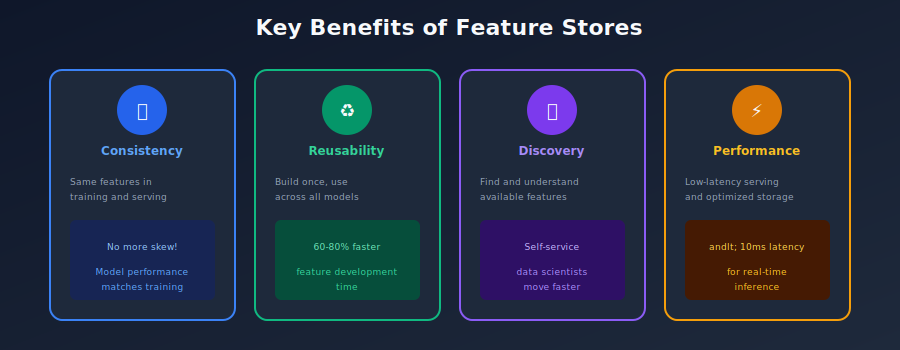
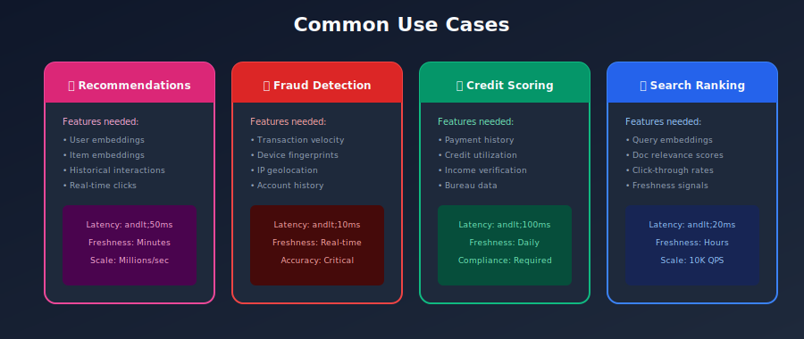
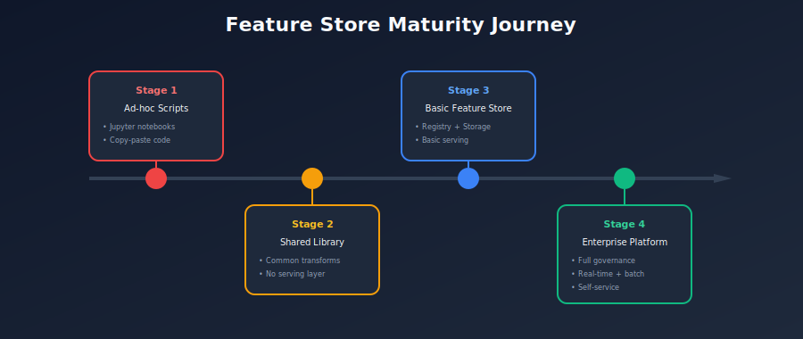

# 📖 Chapter 1: Introduction to Feature Stores

> *"A feature store is to ML what a database is to applications - the foundational data layer that everything else depends on."*

<p align="center">
  
</p>

---

## 🎯 What You'll Learn

- What is a feature store and why it exists

- The problems that feature stores solve

- History and evolution of feature stores

- Key benefits and trade-offs

- When to use (and not use) a feature store

- Real-world use cases from industry

---

## 📚 Table of Contents

1. [The Feature Problem in ML](#the-feature-problem-in-ml)

2. [What is a Feature Store?](#what-is-a-feature-store)

3. [Brief History](#brief-history)

4. [Core Value Propositions](#core-value-propositions)

5. [Feature Store vs Traditional Approaches](#feature-store-vs-traditional-approaches)

6. [Industry Use Cases](#industry-use-cases)

7. [When to Use a Feature Store](#when-to-use-a-feature-store)

8. [Common Misconceptions](#common-misconceptions)

---

## The Feature Problem in ML

### Understanding Features

In machine learning, a **feature** is an individual measurable property or characteristic of a phenomenon being observed. Features are the input variables that ML models use to make predictions.

```python
# Example: Features for a fraud detection model
features = {
    "user_id": "user_123",
    "transaction_amount": 500.00,
    "user_avg_transaction_30d": 125.50,      # Aggregated feature
    "user_transaction_count_1h": 5,           # Time-windowed feature
    "merchant_fraud_rate": 0.02,              # Entity-level statistic
    "is_international": True,                 # Derived feature
    "device_fingerprint_age_days": 365,       # Complex derived feature
    "user_account_age_days": 730,             # Simple derived feature
}

```

### The Challenge: Feature Engineering at Scale

As ML systems mature, organizations face several challenges:



### The Training-Serving Skew Problem

One of the most insidious problems in ML systems is **training-serving skew** - when features used during training differ from features used during inference.

```python
# ❌ PROBLEM: Training-Serving Skew

# During Training (in a Jupyter notebook)
def compute_user_features_training(user_id, historical_data):
    # Using pandas, computed on full historical data
    user_data = historical_data[historical_data['user_id'] == user_id]
    return {
        'avg_purchase': user_data['amount'].mean(),
        'total_purchases': len(user_data),
        'days_since_last_purchase': (datetime.now() - user_data['date'].max()).days
    }

# During Serving (in production API)
def compute_user_features_serving(user_id, db_connection):
    # Using SQL, computed in real-time
    result = db_connection.execute(f"""
        SELECT
            AVG(amount) as avg_purchase,  -- Different NULL handling!
            COUNT(*) as total_purchases,
            DATEDIFF(NOW(), MAX(date)) as days_since_last_purchase
        FROM purchases
        WHERE user_id = '{user_id}'
    """)
    return result

# These can produce DIFFERENT results for the same user!
# - NULL handling differences
# - Timezone issues
# - Precision differences
# - Data freshness differences

```

```python
# ✅ SOLUTION: Feature Store ensures consistency

from feature_store import FeatureStore

fs = FeatureStore()

# SAME code path for training and serving
features = fs.get_features(
    entity_id="user_123",
    feature_names=["avg_purchase", "total_purchases", "days_since_last_purchase"]
)

# Training uses historical point-in-time values
# Serving uses latest values
# BUT the computation logic is IDENTICAL

```

---

## What is a Feature Store?

### Definition

A **Feature Store** is a centralized data system that:

1. **Stores** feature values (both historical and current)

2. **Manages** feature definitions, metadata, and lineage

3. **Serves** features for both training and inference

4. **Ensures** consistency between training and serving

### Conceptual Architecture



### The Two Stores

| Aspect | Offline Store | Online Store |
|--------|---------------|--------------|
| **Purpose** | Training data generation | Real-time inference |
| **Data** | Historical feature values | Latest feature values |
| **Latency** | Minutes to hours | Milliseconds (<10ms) |
| **Query Pattern** | Batch reads, time-travel | Point lookups by entity |
| **Storage** | Data Lake (S3, Delta) | Key-Value Store (Redis) |
| **Scale** | Petabytes | Terabytes |

---

## Brief History

### The Evolution of Feature Management



### Key Milestones

| Year | Company | Contribution |
|------|---------|-------------|
| 2017 | Uber | Published Michelangelo paper, coined "Feature Store" |
| 2018 | Gojek | Open-sourced Feast |
| 2019 | Airbnb | Published Zipline architecture |
| 2020 | AWS | Launched SageMaker Feature Store |
| 2021 | Databricks | Integrated Feature Store into lakehouse |
| 2022 | Google | Launched Vertex AI Feature Store |

---

## Core Value Propositions

### 1. Feature Reuse

```python
# Without Feature Store: Each team builds their own features
# Team A (Fraud Detection)
def get_user_features_fraud():
    return compute_user_velocity_features()  # 2 weeks of work

# Team B (Recommendations)
def get_user_features_recs():
    return compute_user_velocity_features()  # 2 weeks of work (duplicated!)

# Team C (Credit Risk)
def get_user_features_credit():
    return compute_user_velocity_features()  # 2 weeks of work (duplicated!)

# Total: 6 weeks of duplicated effort

# -------------------------------------------------------

# With Feature Store: Compute once, use everywhere
fs.register_feature(
    name="user_velocity_features",
    computation=compute_user_velocity_features,
    entities=["user"],
    owner="platform-team"
)

# All teams use the same feature
# Team A
fraud_features = fs.get_features(entity="user", features=["user_velocity_features"])

# Team B
rec_features = fs.get_features(entity="user", features=["user_velocity_features"])

# Team C
credit_features = fs.get_features(entity="user", features=["user_velocity_features"])

# Total: 2 weeks of work, used by 3 teams

```

### 2. Training-Serving Consistency



### 3. Point-in-Time Correctness

Avoiding **data leakage** in training datasets:

```python
# ❌ WRONG: Data leakage
# Using current feature values for historical predictions
training_data = []
for event in historical_events:
    # This uses TODAY's feature values, not values at event time!
    features = get_current_features(event.user_id)
    training_data.append((features, event.label))

# ✅ CORRECT: Point-in-time join
# Using feature values AS THEY WERE at the time of the event
training_data = fs.get_historical_features(
    entity_df=historical_events[['user_id', 'event_timestamp', 'label']],
    features=['user_avg_purchase_30d', 'user_transaction_count_7d']
)
# Returns features as they were at each event_timestamp
# No data leakage!

```



### 4. Feature Discovery

```python
# Find relevant features for a new model
available_features = fs.search_features(
    tags=["user", "engagement"],
    owner="growth-team",
    freshness="<1h"
)

# Output:
# +----------------------------+-------------+------------+----------+
# | Feature Name               | Entity      | Freshness  | Owner    |
# +----------------------------+-------------+------------+----------+
# | user_sessions_7d           | user        | 15min      | growth   |
# | user_pages_viewed_24h      | user        | 5min       | growth   |
# | user_engagement_score      | user        | 1h         | growth   |
# | user_last_active_timestamp | user        | real-time  | growth   |
# +----------------------------+-------------+------------+----------+

```

### 5. Governance & Lineage



---

## Feature Store vs Traditional Approaches

### Comparison Matrix

| Capability | Ad-hoc Scripts | Data Warehouse | Feature Store |
|------------|---------------|----------------|---------------|
| Feature Reuse | ❌ None | ⚠️ Limited | ✅ First-class |
| Training-Serving Consistency | ❌ Manual | ❌ Manual | ✅ Automatic |
| Point-in-Time Correctness | ❌ Complex | ⚠️ Possible | ✅ Built-in |
| Low-Latency Serving | ❌ No | ❌ No | ✅ Yes |
| Feature Discovery | ❌ No | ⚠️ Basic | ✅ Rich catalog |
| Versioning | ❌ Git only | ⚠️ Limited | ✅ Native |
| Monitoring | ❌ No | ⚠️ Basic | ✅ Integrated |

### When Each Approach Works



---

## Industry Use Cases

### 🚗 Uber: Michelangelo

**Scale**: Thousands of ML models, millions of predictions per second

**Features**:

- Real-time trip features (ETA, surge pricing)

- Driver/rider historical features

- Geographic features

**Architecture**: Custom-built feature store integrated with ML platform

### 🏠 Airbnb: Zipline

**Scale**: Hundreds of ML models for search, pricing, trust

**Features**:

- Listing quality scores

- User preference features

- Search ranking features

**Key Innovation**: Backfill system for point-in-time correctness

### 🛒 DoorDash: Feature Store

**Scale**: Real-time features for delivery time prediction

**Features**:

- Restaurant preparation time

- Dasher location features

- Order complexity features

**Latency**: <10ms for real-time serving

### 🎵 Spotify: Feature Platform

**Scale**: Personalization for 500M+ users

**Features**:

- Listening history aggregations

- Content embeddings

- User taste profiles

**Innovation**: Streaming feature computation

### 💳 Stripe: Radar Features

**Scale**: Fraud detection at payment processing scale

**Features**:

- Transaction velocity features

- Merchant risk features

- Card behavior patterns

**Requirement**: Ultra-low latency (<5ms)

---

## When to Use a Feature Store

### ✅ Strong Indicators You Need One

```
□ Multiple models share the same features
□ Real-time inference with <100ms latency
□ Training-serving skew has caused production issues
□ Data scientists spend >30% time on feature engineering
□ Feature duplication across teams
□ Regulatory requirements for feature lineage
□ Need to serve features at >1000 QPS

```

### ⚠️ Signs You Might Not Need One Yet

```
□ Single ML model in production
□ Batch predictions only (daily/weekly)
□ Small team (<3 data scientists)
□ Simple features (mostly raw columns)
□ Early stage ML exploration
□ Limited engineering resources

```

### Decision Framework



---

## Common Misconceptions

### Misconception 1: "A Feature Store is Just a Database"

**Reality**: A Feature Store is a **specialized system** with:

- Dual storage (online + offline)

- Point-in-time joins

- Feature registry

- Training-serving consistency

- ML-specific operations

### Misconception 2: "We Can Build It with Redis + S3"

**Reality**: The storage is the easy part. The hard parts are:

- Point-in-time correctness

- Feature versioning

- Metadata management

- Materialization pipelines

- SDK and API design

### Misconception 3: "Feature Stores Are Only for Big Companies"

**Reality**: Open-source tools like Feast make it accessible to any team. Start small, grow as needed.

### Misconception 4: "Feature Stores Replace Data Warehouses"

**Reality**: Feature Stores **complement** data warehouses:

- Data Warehouse: Source of truth, analytics

- Feature Store: ML-optimized layer on top

### Misconception 5: "All Features Need to Go Through the Feature Store"

**Reality**: Start with high-value, shared features. Not every feature needs to be in the feature store.

---

## Summary

### Key Takeaways

1. **Feature Stores solve real problems**: Training-serving skew, feature reuse, discovery, and governance

2. **Core components**: Registry, Offline Store, Online Store, and Serving APIs

3. **Two serving modes**: Batch (training) and real-time (inference)

4. **Not always needed**: Simple, single-model, batch-only systems may not benefit

5. **Growing ecosystem**: From open-source (Feast) to managed services (AWS, GCP, Databricks)

### What's Next?

In the next chapter, we'll dive deep into **Core Concepts**:

- Features, Entities, and Feature Groups

- Feature Views and Feature Services

- Data types and schemas

- Versioning strategies

---

## 📚 Further Reading

1. [Uber Michelangelo Paper](https://eng.uber.com/michelangelo-machine-learning-platform/)

2. [Feast Documentation](https://docs.feast.dev/)

3. [Feature Stores for ML (O'Reilly)](https://www.oreilly.com/library/view/feature-stores-for/9781098143732/)

4. [MLOps Community Feature Store Resources](https://mlops.community/learn/feature-store/)

---

[← Back to Main](../README.md) | [Next: Core Concepts →](../02_core_concepts/README.md)

---

<div align="center">

**[⬆ Back to Top](#)** | **[📚 Main Repository](https://github.com/Gaurav14cs17/ml_system_design)**

Made with 💜 by [Gaurav14cs17](https://github.com/Gaurav14cs17)

</div>
