# 🧱 Chapter 2: Core Concepts

> *"Understanding the building blocks of Feature Stores is essential for designing effective ML data systems."*

<p align="center">
  
</p>

---

## 🎯 What You'll Learn

- Fundamental concepts: Features, Entities, and Feature Groups
- Feature Views and Feature Services
- Data types, schemas, and validation
- Versioning strategies
- Time-to-live (TTL) and freshness
- Point-in-time joins in depth

---

## 📚 Table of Contents

1. [Features](#features)
2. [Entities](#entities)
3. [Feature Groups](#feature-groups)
4. [Feature Views](#feature-views)
5. [Feature Services](#feature-services)
6. [Data Types and Schemas](#data-types-and-schemas)
7. [Versioning](#versioning)
8. [Time Concepts](#time-concepts)
9. [Point-in-Time Joins](#point-in-time-joins)

---

## Features

### What is a Feature?

A **feature** is an individual measurable property or characteristic used as input to a machine learning model. Features transform raw data into a format that ML algorithms can learn from.

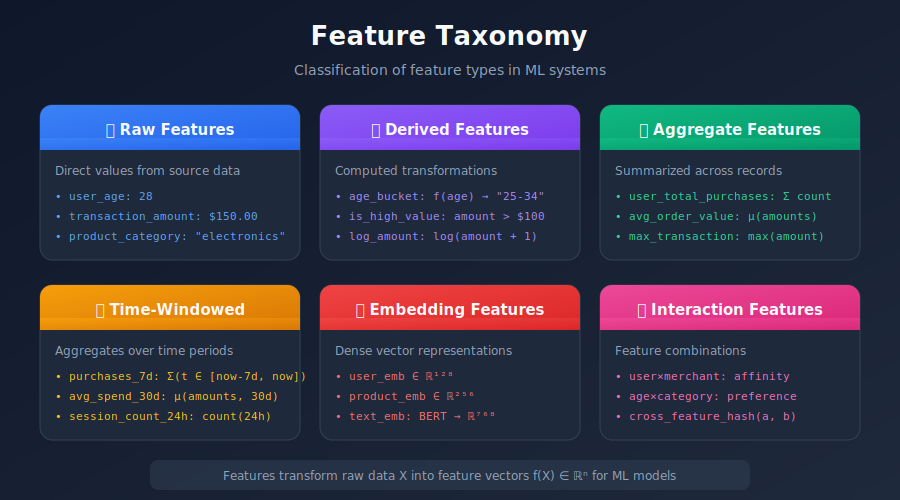

### Feature Properties

Every feature in a Feature Store has metadata properties:

```python
from dataclasses import dataclass
from typing import List, Optional
from datetime import timedelta

@dataclass
class FeatureDefinition:
    """Complete feature definition with all metadata."""

    # Identity
    name: str                          # Unique identifier
    description: str                   # Human-readable description

    # Type
    dtype: str                         # Data type (INT64, FLOAT, STRING, etc.)
    shape: Optional[List[int]]         # Shape for arrays/embeddings

    # Ownership
    owner: str                         # Team or person responsible
    tags: List[str]                    # Searchable tags

    # Lineage
    source: str                        # Where data comes from
    transformation: str                # How it's computed
    dependencies: List[str]            # Other features it depends on

    # Freshness
    ttl: Optional[timedelta]           # Time-to-live
    update_frequency: str              # How often it's updated

    # Governance
    pii: bool                          # Contains personal info?
    deprecated: bool                   # Is it deprecated?
    version: str                       # Current version

# Example usage
user_purchase_count = FeatureDefinition(
    name="user_purchase_count_30d",
    description="Number of purchases by user in last 30 days",
    dtype="INT64",
    shape=None,
    owner="growth-team",
    tags=["user", "engagement", "purchases"],
    source="transactions_table",
    transformation="COUNT(*) WHERE timestamp > NOW() - 30 DAYS",
    dependencies=[],
    ttl=timedelta(hours=24),
    update_frequency="hourly",
    pii=False,
    deprecated=False,
    version="1.0.0"
)

```

### Feature Categories by Computation

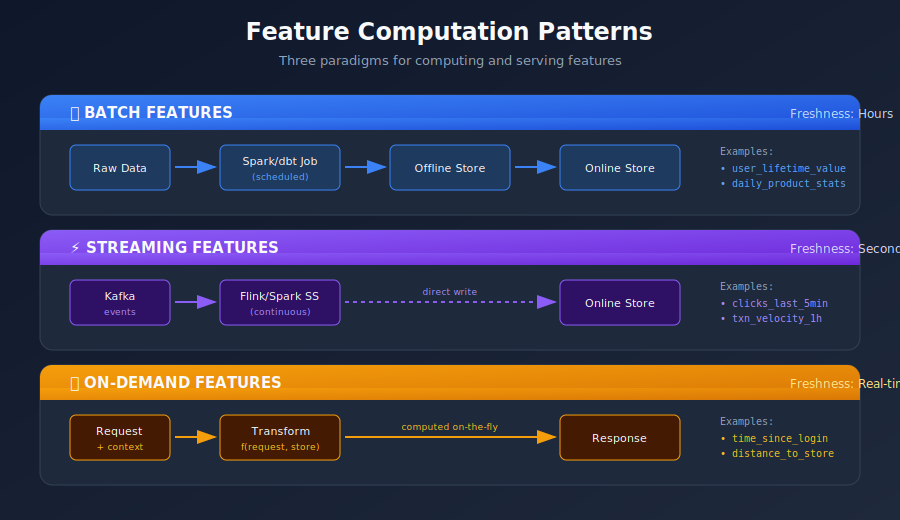

---

## Entities

### What is an Entity?

An **entity** is a semantic object that features describe. Entities provide the keys for organizing and retrieving features.

```python
# Common entities in ML systems

entities = {
    "user": {
        "keys": ["user_id"],
        "description": "A registered user of the platform",
        "example_features": [
            "user_age",
            "user_signup_date",
            "user_lifetime_value",
            "user_purchase_count_30d"
        ]
    },
    "merchant": {
        "keys": ["merchant_id"],
        "description": "A business selling on the platform",
        "example_features": [
            "merchant_rating",
            "merchant_category",
            "merchant_transaction_volume"
        ]
    },
    "user_merchant": {
        "keys": ["user_id", "merchant_id"],  # Composite entity
        "description": "Relationship between user and merchant",
        "example_features": [
            "user_merchant_transaction_count",
            "user_merchant_last_purchase_date",
            "user_merchant_affinity_score"
        ]
    },
    "session": {
        "keys": ["session_id"],
        "description": "A user's browsing session",
        "example_features": [
            "session_duration",
            "session_page_count",
            "session_device_type"
        ]
    }
}

```

### Entity Hierarchy

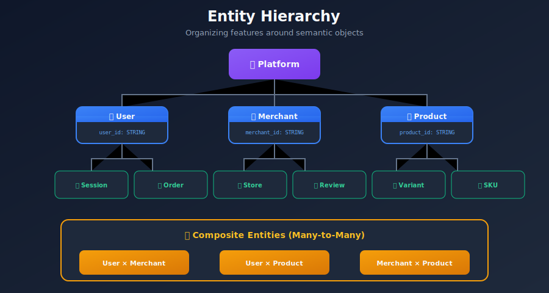

### Entity Definition in Code

```python
from feast import Entity, ValueType

# Simple entity
user = Entity(
    name="user",
    join_keys=["user_id"],
    value_type=ValueType.STRING,
    description="A registered user"
)

# Composite entity
user_merchant = Entity(
    name="user_merchant",
    join_keys=["user_id", "merchant_id"],
    value_type=ValueType.STRING,
    description="User-Merchant relationship"
)

# Entity with multiple key columns (rare)
geo_time = Entity(
    name="geo_time",
    join_keys=["latitude_bucket", "longitude_bucket", "hour_of_day"],
    description="Geographic-temporal bucketed entity"
)

```

---

## Feature Groups

### What is a Feature Group?

A **Feature Group** (also called Feature Table in some systems) is a collection of related features computed from the same data source and sharing the same entity.

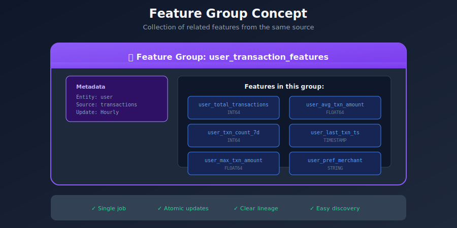

### Feature Group Definition

```python
from feast import FeatureView, Field, FileSource
from feast.types import Int64, Float64, String
from datetime import timedelta

# Define the data source
transactions_source = FileSource(
    path="s3://data-lake/transactions/",
    timestamp_field="event_timestamp",
    created_timestamp_column="created_timestamp"
)

# Define the feature group (Feature View in Feast)
user_transaction_features = FeatureView(
    name="user_transaction_features",
    entities=[user],
    ttl=timedelta(days=1),
    schema=[
        Field(name="user_total_transactions", dtype=Int64),
        Field(name="user_avg_transaction_amt", dtype=Float64),
        Field(name="user_max_transaction_amt", dtype=Float64),
        Field(name="user_transaction_count_7d", dtype=Int64),
        Field(name="user_last_transaction_ts", dtype=Int64),
        Field(name="user_preferred_merchant", dtype=String),
    ],
    source=transactions_source,
    tags={"team": "data-platform", "domain": "transactions"}
)

```

### Feature Group Organization Patterns

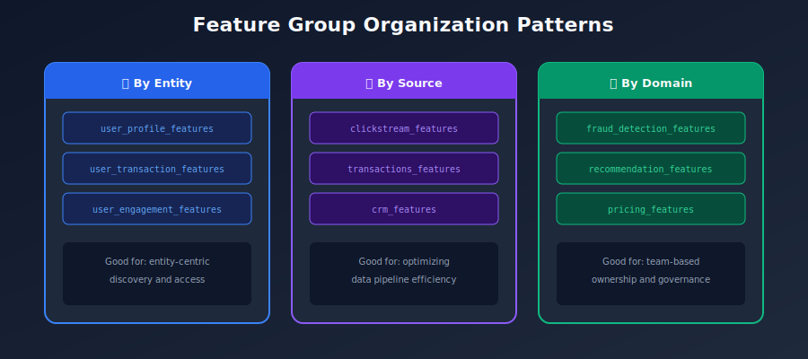

---

## Feature Views

### What is a Feature View?

A **Feature View** is a logical grouping of features that are served together. It defines:
- Which features to include
- The entity (join key)
- The data source
- Transformation logic (optional)
- TTL and freshness requirements

```python
from feast import FeatureView, Field, BatchFeatureView
from feast.types import Float64, Int64

# Basic Feature View (pre-computed features)
user_features = FeatureView(
    name="user_features",
    entities=[user],
    schema=[
        Field(name="age", dtype=Int64),
        Field(name="lifetime_value", dtype=Float64),
        Field(name="account_age_days", dtype=Int64),
    ],
    source=user_source,
    ttl=timedelta(days=1),
)

# Feature View with transformation (Feast 0.30+)
@batch_feature_view(
    sources=[transactions_source],
    entities=[user],
    ttl=timedelta(days=1),
)
def user_transaction_stats(transactions):
    """Compute transaction statistics per user."""
    return transactions.group_by("user_id").agg(
        total_amount=("amount", "sum"),
        avg_amount=("amount", "mean"),
        transaction_count=("amount", "count"),
    )

```

### Feature View Types

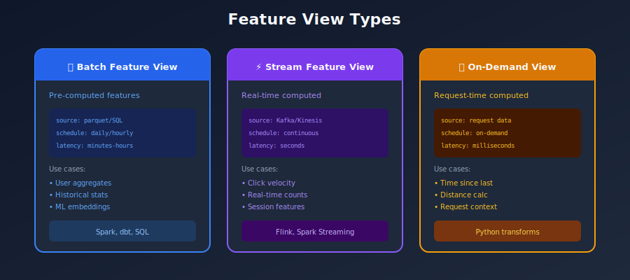

---

## Feature Services

### What is a Feature Service?

A **Feature Service** groups multiple Feature Views into a single, versioned API endpoint for model serving.

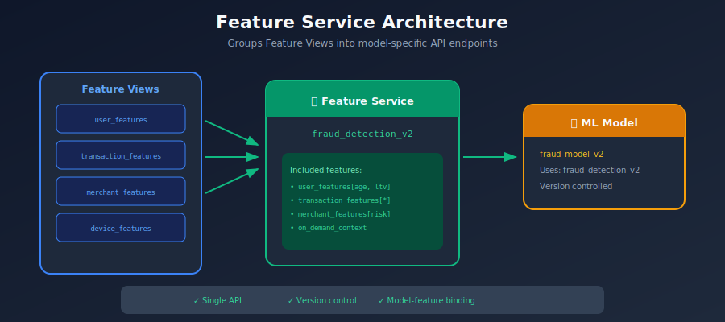

### Feature Service Definition

```python
from feast import FeatureService

# Define a feature service for a specific model
fraud_detection_fs = FeatureService(
    name="fraud_detection_v2",
    features=[
        user_features[["age", "account_age_days", "verification_level"]],
        transaction_features[["avg_amount_30d", "transaction_count", "max_amount_7d"]],
        merchant_features[["risk_score", "category", "fraud_rate"]],
        on_demand_transaction_context,  # All features from this view
    ],
    tags={"model": "fraud_v2", "team": "trust-safety"},
    description="Features for fraud detection model v2"
)

# Usage
features = store.get_online_features(
    features=fraud_detection_fs,
    entity_rows=[
        {"user_id": "user_123", "merchant_id": "merchant_456"}
    ]
).to_dict()

```

### Feature Service Benefits

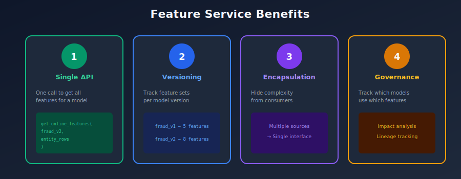

---

## Data Types and Schemas

### Supported Data Types

```python
from feast.types import (
    Int32, Int64,           # Integers
    Float32, Float64,       # Floating point
    String,                 # Text
    Bytes,                  # Binary data
    Bool,                   # Boolean
    UnixTimestamp,          # Timestamps
    Array,                  # Arrays/Lists
)

# Type mapping to storage
TYPE_MAPPING = {
    # Feast Type    → Python    → Parquet    → Redis       → DynamoDB
    "Int64":        ("int",      "INT64",     "int",        "N"),
    "Float64":      ("float",    "DOUBLE",    "float",      "N"),
    "String":       ("str",      "STRING",    "str",        "S"),
    "Bool":         ("bool",     "BOOLEAN",   "int",        "BOOL"),
    "Array(Int64)": ("List[int]","list<int>", "json",       "L"),
    "Array(Float)": ("List[flt]","list<dbl>", "json/blob",  "L"),
}

```

### Embedding/Vector Features

```python
from feast import Field
from feast.types import Array, Float32

# Define embedding feature
user_embedding = Field(
    name="user_embedding",
    dtype=Array(Float32),
    description="128-dimensional user embedding from collaborative filtering"
)

# In feature view
user_embedding_view = FeatureView(
    name="user_embeddings",
    entities=[user],
    schema=[
        Field(name="user_embedding", dtype=Array(Float32)),
        Field(name="embedding_version", dtype=String),
        Field(name="embedding_timestamp", dtype=UnixTimestamp),
    ],
    source=embedding_source,
)

# Storage considerations for embeddings
EMBEDDING_STORAGE = """
+---------------------------------------------------------------------------+
|                      EMBEDDING STORAGE OPTIONS                              |
+---------------------------------------------------------------------------+
|                                                                             |
|  OPTION 1: Serialize as JSON/BLOB                                           |
|  --------------------------------                                           |
|  • Simple implementation                                                    |
|  • Works with any key-value store                                          |
|  • Higher latency for large embeddings                                      |
|  Redis: SET user:123:embedding "[0.1, 0.2, ..., 0.9]"                       |
|                                                                             |
|  OPTION 2: Native Array Support                                             |
|  ------------------------------                                             |
|  • Better performance                                                       |
|  • Requires compatible store (Postgres, DynamoDB)                          |
|  Postgres: embedding FLOAT[] or vector(128)                                |
|                                                                             |
|  OPTION 3: Dedicated Vector Store                                           |
|  --------------------------------                                           |
|  • Best for similarity search                                               |
|  • Pinecone, Milvus, Qdrant, pgvector                                      |
|  • Feature store + vector store integration                                 |
|                                                                             |
+---------------------------------------------------------------------------+
"""

```

### Schema Validation

```python
from feast import Field
from feast.types import Int64, Float64, String
import pandera as pa

# Define schema with validation rules
class UserFeatureSchema(pa.SchemaModel):
    user_id: pa.typing.Series[str] = pa.Field(nullable=False)
    age: pa.typing.Series[int] = pa.Field(ge=0, le=150)
    lifetime_value: pa.typing.Series[float] = pa.Field(ge=0)
    account_status: pa.typing.Series[str] = pa.Field(
        isin=["active", "inactive", "suspended"]
    )

    class Config:
        strict = True
        coerce = True

# Validate before writing to feature store
@pa.check_types
def compute_user_features(raw_data: pd.DataFrame) -> pa.typing.DataFrame[UserFeatureSchema]:
    """Compute and validate user features."""
    features = transform(raw_data)
    return features  # Automatically validated against schema

```

---

## Versioning

### Feature Versioning Strategies

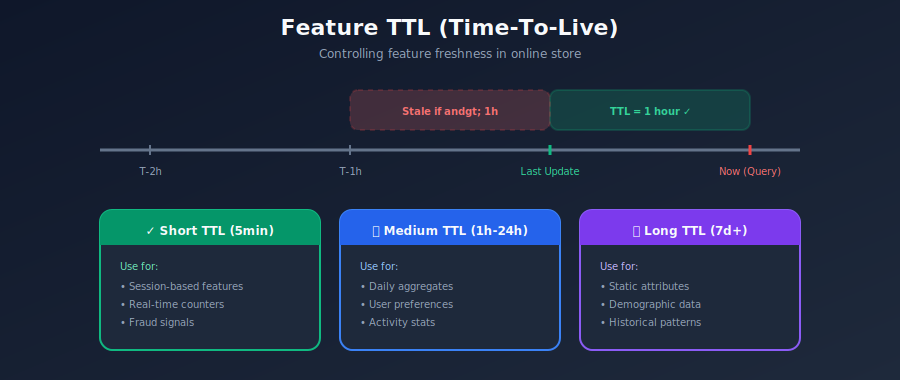

### Versioning in Practice

```python
# Feature definition with version tracking
from datetime import datetime

user_avg_purchase_v2 = FeatureView(
    name="user_avg_purchase_v2",
    entities=[user],
    schema=[
        Field(name="avg_purchase_30d", dtype=Float64),
        Field(name="feature_version", dtype=String),  # Track version
        Field(name="computed_at", dtype=UnixTimestamp),
    ],
    source=transactions_source,
    tags={
        "version": "2.0.0",
        "previous_version": "user_avg_purchase_v1",
        "breaking_change": "true",
        "change_description": "Changed from 30-day rolling to calendar month",
    }
)

# Migration helper
def migrate_consumers(old_feature: str, new_feature: str):
    """Find and notify consumers of feature changes."""
    consumers = feature_registry.get_consumers(old_feature)
    for consumer in consumers:
        notify_team(
            consumer.owner,
            f"Feature {old_feature} deprecated. Migrate to {new_feature}"
        )

```

---

## Time Concepts

### Event Time vs Processing Time

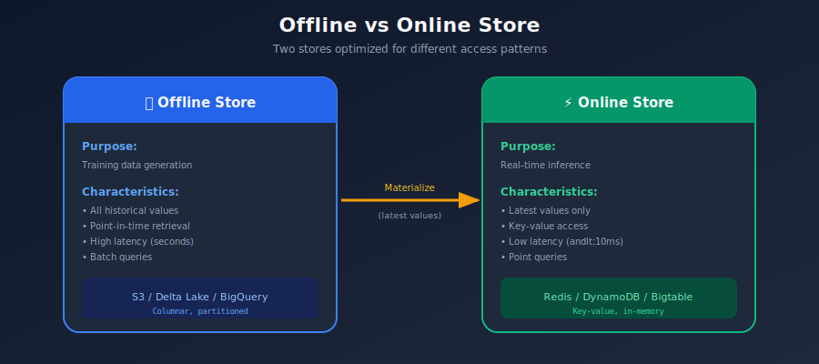

### Time-to-Live (TTL)

```python
from datetime import timedelta

# TTL defines how long feature values are valid
user_features = FeatureView(
    name="user_features",
    ttl=timedelta(days=7),  # Features older than 7 days are stale
    # ...
)

# How TTL works
"""
+---------------------------------------------------------------------------+
|                           TTL BEHAVIOR                                      |
+---------------------------------------------------------------------------+
|                                                                             |
|  Feature computed at: 2024-01-01 00:00                                      |
|  TTL: 7 days                                                                |
|  Feature expires at: 2024-01-08 00:00                                       |
|                                                                             |
|  Query at 2024-01-05: ✅ Returns feature value                              |
|  Query at 2024-01-10: ❌ Returns NULL (expired)                             |
|                                                                             |
|  TTL Guidelines:                                                            |
|  ---------------                                                            |
|  • Real-time features: minutes to hours                                     |
|  • Daily aggregates: 1-2 days                                               |
|  • Weekly aggregates: 7-14 days                                             |
|  • Static features (age, signup date): months to years                     |
|                                                                             |
+---------------------------------------------------------------------------+
"""

```

### Feature Freshness

```python
# Freshness monitoring
class FeatureFreshness:
    """Monitor feature freshness."""

    def __init__(self, feature_view: str, max_staleness: timedelta):
        self.feature_view = feature_view
        self.max_staleness = max_staleness

    def check_freshness(self) -> dict:
        """Check if features are fresh enough."""
        latest_timestamp = self.get_latest_feature_timestamp()
        staleness = datetime.now() - latest_timestamp

        return {
            "feature_view": self.feature_view,
            "latest_timestamp": latest_timestamp,
            "staleness": staleness,
            "max_allowed": self.max_staleness,
            "is_fresh": staleness <= self.max_staleness,
            "alert": staleness > self.max_staleness
        }

# Example freshness SLAs
FRESHNESS_SLAS = {
    "real_time_features": timedelta(minutes=5),
    "near_real_time_features": timedelta(hours=1),
    "daily_features": timedelta(hours=25),  # Buffer for delays
    "weekly_features": timedelta(days=8),
}

```

---

## Point-in-Time Joins

### The Problem

When creating training data, we need feature values **as they were at the time of each training example**, not current values.

### Mathematical Definition

Point-in-time joins ensure temporal consistency in training data construction. Formally:

Given:
- Entity events \( E = \{(e_i, t_i, y_i)\} \) where \( e_i \) is entity ID, \( t_i \) is event timestamp, \( y_i \) is label
- Feature table \( F = \{(e_j, \tau_j, f_j)\} \) where \( \tau_j \) is feature computation timestamp

The point-in-time join produces:

```math
\text{Training}(e_i, t_i) = \arg\max_{\tau_j \leq t_i} F(e_j = e_i, \tau_j)

```

This ensures we only use features computed **before** the event time, preventing **data leakage**.

#### Why This Matters

| Approach | Formula | Risk |
|----------|---------|------|
| **Wrong**: Latest features | \( f(e_i) = F(e_i, \tau_{max}) \) | Future information leaks into training |
| **Correct**: Point-in-time | \( f(e_i, t_i) = F(e_i, \tau_{max} \leq t_i) \) | Only past information used |

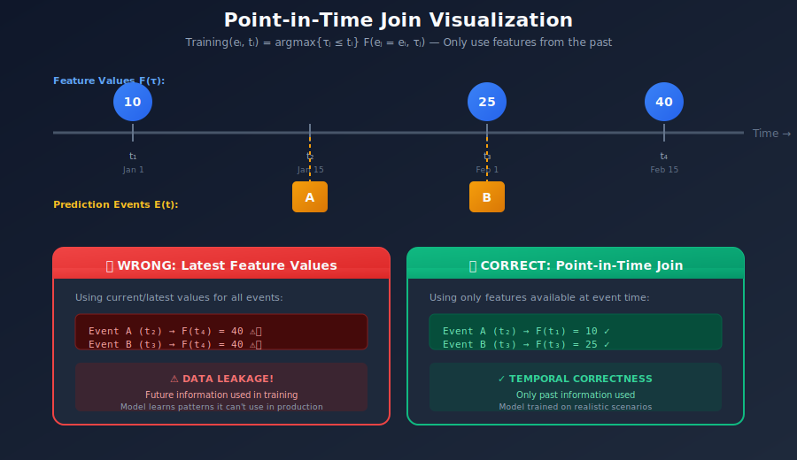

### Point-in-Time Join Logic

```python
def point_in_time_join(
    entity_df: pd.DataFrame,      # Labels with timestamps
    feature_df: pd.DataFrame,     # Features with timestamps
    entity_key: str,              # e.g., "user_id"
    entity_timestamp: str,        # e.g., "event_timestamp"
    feature_timestamp: str,       # e.g., "feature_timestamp"
    ttl: timedelta = None         # Optional staleness limit
) -> pd.DataFrame:
    """
    Join features to entities using point-in-time logic.

    For each entity row, find the most recent feature value
    that was available BEFORE the entity timestamp.
    """

    # Sort features by timestamp
    feature_df = feature_df.sort_values(feature_timestamp)

    results = []
    for _, entity_row in entity_df.iterrows():
        entity_id = entity_row[entity_key]
        event_ts = entity_row[entity_timestamp]

        # Filter features for this entity
        entity_features = feature_df[feature_df[entity_key] == entity_id]

        # Find most recent feature BEFORE event timestamp
        valid_features = entity_features[
            entity_features[feature_timestamp] <= event_ts
        ]

        if len(valid_features) == 0:
            # No feature available at this time
            feature_row = None
        else:
            feature_row = valid_features.iloc[-1]  # Most recent

            # Check TTL if specified
            if ttl:
                feature_age = event_ts - feature_row[feature_timestamp]
                if feature_age > ttl:
                    feature_row = None  # Feature too old

        results.append({
            **entity_row.to_dict(),
            **(feature_row.to_dict() if feature_row is not None else {})
        })

    return pd.DataFrame(results)

# Using Feast (much more efficient)
training_df = store.get_historical_features(
    entity_df=labels_df,  # Must have entity columns + event_timestamp
    features=[
        "user_features:purchase_count",
        "user_features:avg_purchase_amount",
        "merchant_features:fraud_rate",
    ],
).to_df()

```

### Visualization of Point-in-Time Join

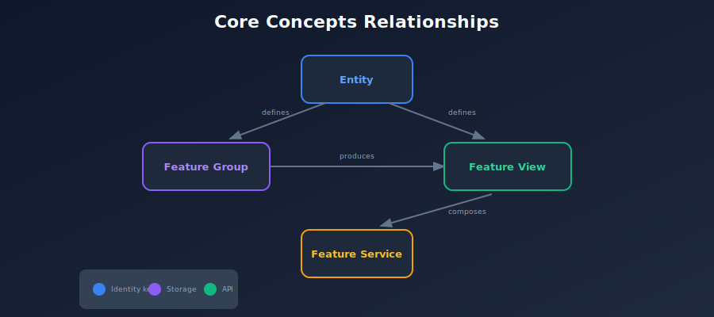

---

## Summary

### Core Concepts Recap

| Concept | Definition | Key Points |
|---------|------------|------------|
| **Feature** | Measurable property for ML | Raw, derived, aggregate, time-windowed |
| **Entity** | Object features describe | user, merchant, product, session |
| **Feature Group** | Collection of related features | Same source, same entity, updated together |
| **Feature View** | Logical grouping for serving | Batch, stream, on-demand |
| **Feature Service** | Features for a specific model | Version control, single API |
| **TTL** | Feature validity period | Prevents serving stale data |
| **Point-in-Time Join** | Historical feature lookup | Prevents data leakage |

### Design Principles

1. **Entity-first design**: Start with entities, then define features
2. **Group related features**: Same source, same update schedule
3. **Version everything**: Features, views, and services
4. **Define freshness SLAs**: Know how stale is acceptable
5. **Use point-in-time joins**: Always for training data

---

[← Previous: Introduction](../01_introduction/README.md) | [Back to Main](../README.md) | [Next: Architecture →](../03_architecture/README.md)

---

<div align="center">

**[⬆ Back to Top](#)** | **[📚 Main Repository](https://github.com/Gaurav14cs17/ml_system_design)**

Made with 💜 by [Gaurav14cs17](https://github.com/Gaurav14cs17)

</div>
