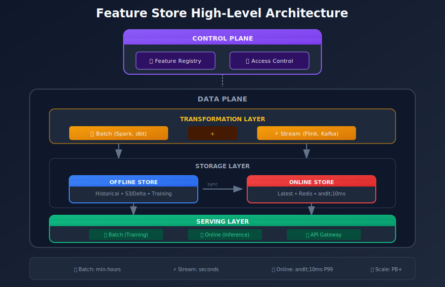
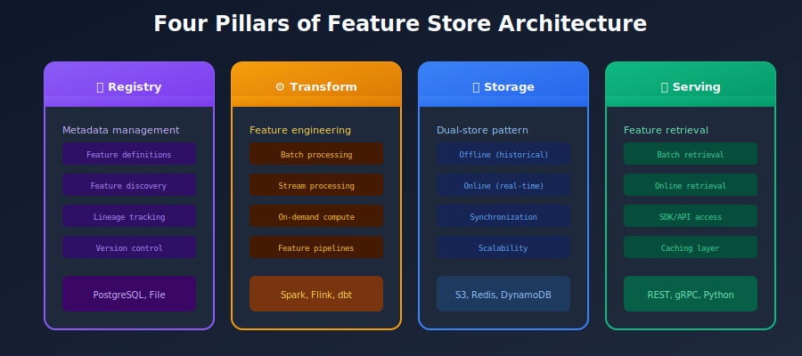
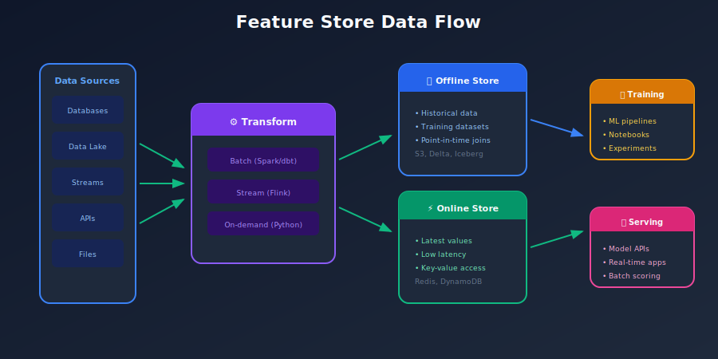
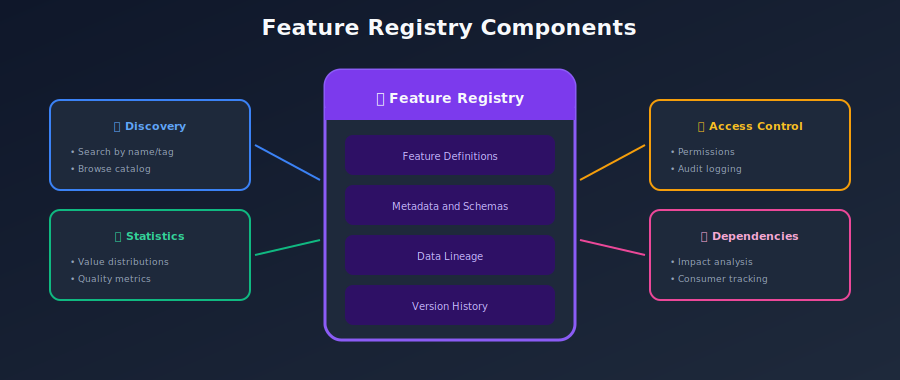
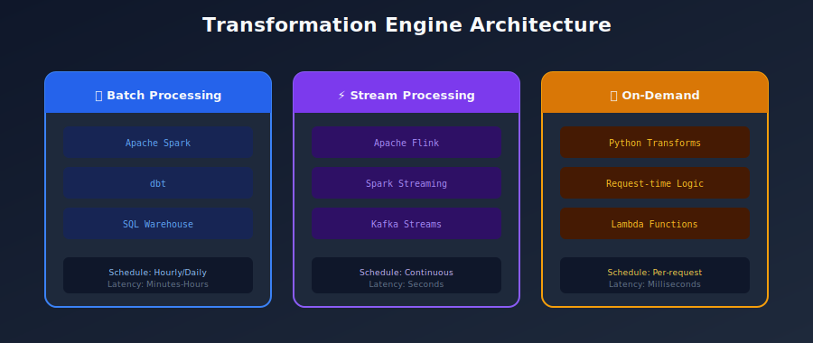
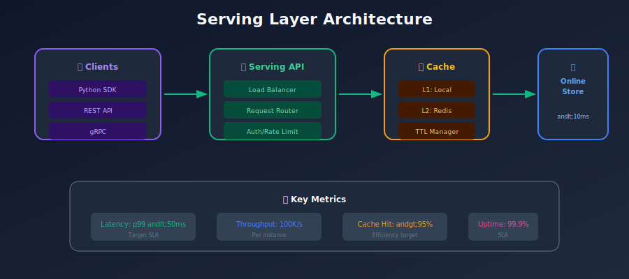
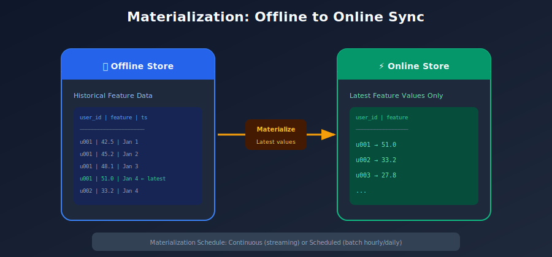
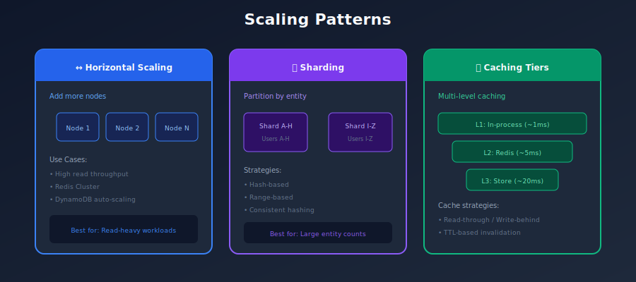
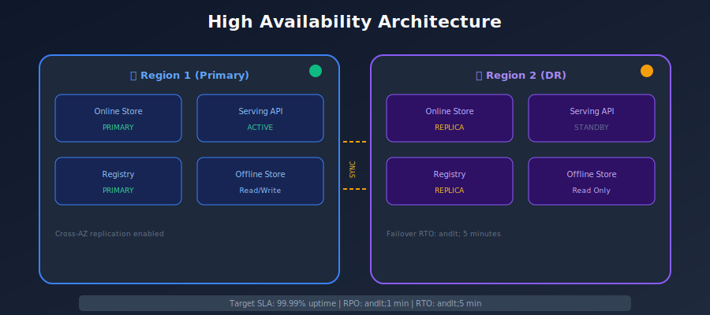
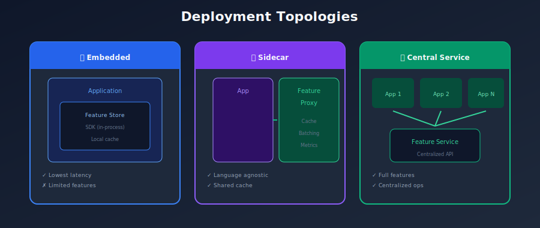

# 🏗️ Chapter 3: Feature Store Architecture

> *"A well-designed Feature Store architecture balances consistency, latency, scalability, and operational complexity."*

<p align="center">
  
</p>

---

## 🎯 What You'll Learn

- High-level architecture patterns

- Component deep-dives

- Data flow and synchronization

- Scalability considerations

- Reference architectures

---

## 📚 Table of Contents

1. [High-Level Architecture](#high-level-architecture)
2. [Component Deep-Dive](#component-deep-dive)
3. [Data Flow Patterns](#data-flow-patterns)
6. [Reference Architectures](#reference-architectures)

---

## High-Level Architecture

### Conceptual Overview



### Four Pillars of Feature Store Architecture



---

## Component Deep-Dive

### 1. Feature Registry

The brain of the feature store - manages all metadata.

```python
# Feature Registry Schema
class FeatureRegistry:
    """
    Central catalog for all feature metadata.
    Typically backed by: PostgreSQL, MySQL, or managed metadata service
    """

    def register_feature_view(self, view: FeatureViewSpec) -> None:
        """Register a new feature view."""
        pass

    def get_feature_view(self, name: str, version: str = None) -> FeatureViewSpec:
        """Retrieve feature view definition."""
        pass

    def search_features(
        self,
        tags: List[str] = None,
        owner: str = None,
        entity: str = None
    ) -> List[FeatureSpec]:
        """Search features by criteria."""
        pass

    def get_lineage(self, feature_name: str) -> LineageGraph:
        """Get upstream/downstream dependencies."""
        pass

    def get_consumers(self, feature_name: str) -> List[Consumer]:
        """Find all models/services using this feature."""
        pass

```



### 2. Offline Store



### 3. Online Store



### 4. Transformation Engine


---

## Data Flow Patterns

### Write Path: Feature Ingestion



### Read Path: Feature Retrieval



---

## Reference Architectures

### Architecture 1: AWS-Native



### Architecture 2: GCP-Native



### Architecture 3: Open Source (Feast)



---

## Summary

### Architecture Decision Matrix

| Decision | Options | Recommendation |
|----------|---------|----------------|
| **Offline Store** | S3+Delta, BigQuery, Snowflake | Delta Lake for flexibility, DW for SQL teams |
| **Online Store** | Redis, DynamoDB, Bigtable | Redis for latency, DynamoDB for scale |
| **Registry** | File, PostgreSQL, Cloud Catalog | PostgreSQL for multi-user |
| **Batch Engine** | Spark, dbt, SQL | dbt for SQL teams, Spark for scale |
| **Stream Engine** | Flink, Spark SS, Kafka Streams | Flink for complex, Kafka Streams for simple |

### Key Design Principles

1. **Separate compute from storage** - Scale independently
2. **Dual-store pattern** - Offline for training, online for serving
3. **Registry as single source of truth** - All metadata centralized
4. **Idempotent writes** - Safe retries and reprocessing
5. **Backfill capability** - Reconstruct any point in time

---

[← Previous: Core Concepts](../02_core_concepts/README.md) | [Back to Main](../README.md) | [Next: Feature Engineering →](../04_feature_engineering/README.md)

---

<div align="center">

**[⬆ Back to Top](#)** | **[📚 Main Repository](https://github.com/Gaurav14cs17/ml_system_design)**

Made with 💜 by [Gaurav14cs17](https://github.com/Gaurav14cs17)

</div>
